# 综述:DRRN——深度递归残差网络(超分辨率)

> 原文：<https://towardsdatascience.com/review-drrn-deep-recursive-residual-network-super-resolution-dca4a35ce994?source=collection_archive---------17----------------------->

## 多达 52 个卷积层，具有全局和局部剩余学习，性能优于 SRCNN、FSRCNN、ESPCN、VDSR、DRCN 和 RED-Net。


**Digital Image Enlargement, The Need of Super Resolution**

在这个故事里， **DRRN(深度递归剩余网络)**是回顾。用**全局残差学习(GRL)** 和**多路径模式局部残差学习(LRL)** ，加上**递归学习**在增加深度的同时控制模型参数，最多可以达到 52 层。DRRN 明显优于最先进的方法，如 [SRCNN](https://medium.com/coinmonks/review-srcnn-super-resolution-3cb3a4f67a7c) 、 [FSRCNN](/review-fsrcnn-super-resolution-80ca2ee14da4) 、 [ESPCN](https://medium.com/datadriveninvestor/review-espcn-real-time-sr-super-resolution-8dceca249350) 、 [VDSR](/review-vdsr-super-resolution-f8050d49362f) 、 [DRCN](https://medium.com/datadriveninvestor/review-drcn-deeply-recursive-convolutional-network-super-resolution-f0a380f79b20) 和[红网](https://medium.com/datadriveninvestor/review-red-net-residual-encoder-decoder-network-denoising-super-resolution-cb6364ae161e)。并且发表在 **2017 CVPR** 上 **100 多篇引用**。( [Sik-Ho Tsang](https://medium.com/u/aff72a0c1243?source=post_page-----dca4a35ce994--------------------------------) @中)

# 概述

1.  **DRRN 架构**
2.  **残差单元的数量(U) &递归块的数量(B)**
3.  **消融研究**
4.  **结果**

# 1.DRRN 架构

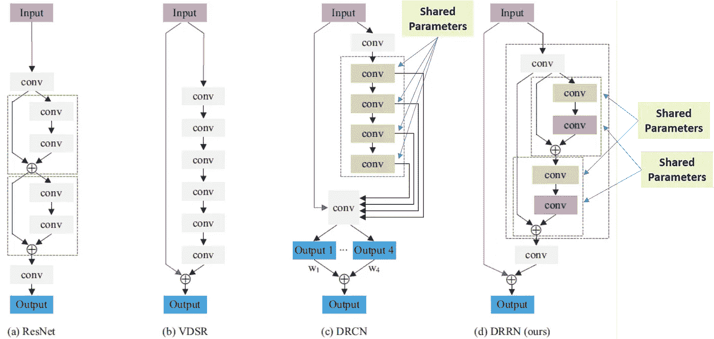

**Comparison of Different Architectures**

*   [**ResNet**](/review-resnet-winner-of-ilsvrc-2015-image-classification-localization-detection-e39402bfa5d8) : **残差单位**用于预测。对于每个残差单元，有使用两个卷积的**身份映射**(即跳过连接)和**残差映射**。
*   [**VDSR**](/review-vdsr-super-resolution-f8050d49362f) :残差学习用于输入低分辨率(LR)图像和输出高分辨率(HR)图像之间。这是一个**全局剩余学习(GRL)** 。剩余分支中叠加了 20 层 3×3 卷积。可获得 41×41 的大感受野。而 [VDSR](/review-vdsr-super-resolution-f8050d49362f) 实际上是 DRRN 的一个特例。(后面会提到)
*   [**DRCN**](https://medium.com/datadriveninvestor/review-drcn-deeply-recursive-convolutional-network-super-resolution-f0a380f79b20) :还有一种可以当作 GRL 的跳接。在剩余分支，使用递归卷积，即所有卷积共享参数(绿色)。每个递归卷积的输出负责生成 HR 图像。并且所有的 HR 图像被轻量级地组合以获得最终的输出。
*   **DRRN** : **GRL 由于在 [VDSR](/review-vdsr-super-resolution-f8050d49362f) 和 [DRCN](https://medium.com/datadriveninvestor/review-drcn-deeply-recursive-convolutional-network-super-resolution-f0a380f79b20) 中的有效性也被使用**。在残差分支处，不使用 [DRCN](https://medium.com/datadriveninvestor/review-drcn-deeply-recursive-convolutional-network-super-resolution-f0a380f79b20) 、**中的递归卷积，而是通过使用残差块**内的**递归卷积来使用一堆残差块**，如上所示。因此，**这里介绍**多路径局部残差学习(LRL)。

# **2。残差单元的数量(U) &递归块的数量(B)**

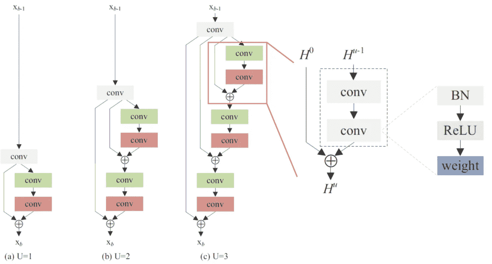

**Number of Residual Units (U)**

## 2.1.剩余单元数( *U* )

*   ***U*** : **递归块中剩余单元的数量**。 *U* ={1，2，3}的例子如上图所示。
*   注意，当 U 增加时，参数**没有增加。因为**参数是共享的**。**
*   并且使用**预激活剩余单元**，即 **BN-ReLU-Conv** ，而不是 Conv-BN-ReLU。这是建议在[预激活 ResNet](/resnet-with-identity-mapping-over-1000-layers-reached-image-classification-bb50a42af03e) 中对原 [ResNet](/review-resnet-winner-of-ilsvrc-2015-image-classification-localization-detection-e39402bfa5d8) 进行改进。

## 2.2.递归块数( *B* )

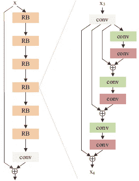

**B=6, 6 Recursive Blocks (Left), U=3, 3 Residual Units in a Recursive Block (right)**

*   上面显示了 *B* 的含义，即网络中使用了多少个递归块。
*   因此，可以根据 *B* 和 *U* 计算 DRRN *d* 的深度(卷积层数):

```
*d*=(1+2×*U*)×*B*+1
```

*   如果 *U* =0，DRRN 变为 [VDSR](/review-vdsr-super-resolution-f8050d49362f) 。
*   损失函数是标准 MSE:

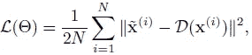

# 3.**消融研究**

## 3.1.一些细节

*   **训练集**:来自杨的 91 幅图像，来自伯克利分割数据集的 200 幅图像，共 291 幅图像。
*   **测试装置**:装置 5、装置 14、BSD100 和 Urban100。
*   **数据增加** : **翻转**和**旋转**版本，即 7 个附加增加版本。**比例**放大也用于不同的比例(×2、×3 和×4)。
*   使用跨距为 21 的 31×31 面片。小批量是 128 个。
*   每个卷积层有 128 个滤波器，大小为 3×3。
*   在 *d* =20 的情况下，用 2 个 Titan X GPUs 训练 4 天。
*   双三次插值在进入网络之前首先被应用。
*   仅亮度分量。
*   图像边界附近的像素在评估前被裁剪。

## 3.2.硼和铀的研究

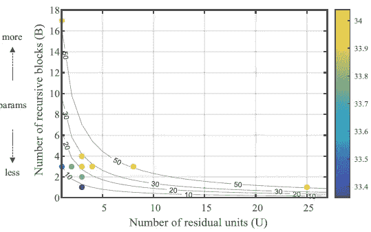

**Various combinations of *B* and *U (scaling factor* ×3 on Set5)**

*   **通过将一个参数固定为 3，并将另一个参数从 1 改为 4** ，上图显示**增加 *B* 或 *U*** **会导致更深的型号** **并获得更好的性能**，这表明更深还是更好。
*   **只要深度相近**，型号就有可比性，如 B2U3 ( *d* = 15，k = 784K)和 B3U2 ( *d* = 16，k = 1,182K)分别达到 33.76 和 33.77 dB。(*k*= #参数)
*   **通过固定一个参数为 1，改变另一个参数来构造**与 *d* = 52 的网络，我们可以得到 B1U25 ( *k* = 297K)和 b17u 1(*k*= 7375k)。对于 B1U25，只有一个具有 25 个剩余单元的递归块被递归学习。对于 B17U1，堆叠 17 个递归块，无需任何递归学习。
*   还构造了 B3U8 ( *d* = 52，*k*= 1182k)。
*   所有的 B17U1、B3U8、B1U25，具有 *d* =52，具有相似的性能。
*   **B1U25 使用的参数要少得多。因此，它被视为最佳模型。**

## 3.3.DRRN 变体

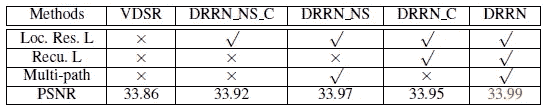

**DRRN Variants (NS: No Sharing of Weights, C: Chained, Not Multi-path)**

*   **DRRN_NS_C** :有 LRL 但没有多路径递归学习，33.92dB
*   **DRRN_NS** : DRRN 但无重量分担，33.97dB。
*   **DRRN_C:** DRRN 但不使用多径，仅在剩余分支处使用链式卷积，33.95dB。
*   **DRRN** : 33.99dB，这说明所有组件对改善结果都很重要。

# 4.结果

## 4.1.与最先进模型的比较

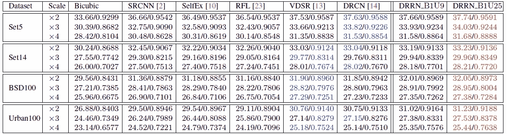

**Benchmark Results Using PSNR and SSIM**

*   DRRN_B1U9 ( *d* = 20， *k* = 297K):与 [VDSR](/review-vdsr-super-resolution-f8050d49362f) 和 [DRCN](https://medium.com/datadriveninvestor/review-drcn-deeply-recursive-convolutional-network-super-resolution-f0a380f79b20) 深度相同，但参数更少。
*   在所有数据集和缩放因子中，DRRN_B1U9 和 DRRN_B1U25 都优于所有方法，包括 [SRCNN](https://medium.com/coinmonks/review-srcnn-super-resolution-3cb3a4f67a7c) 、 [VDSR](/review-vdsr-super-resolution-f8050d49362f) 和 [DRCN](https://medium.com/datadriveninvestor/review-drcn-deeply-recursive-convolutional-network-super-resolution-f0a380f79b20) 。
*   特别是在 Urban100 数据集上，DRRN 大幅领先所有方法。

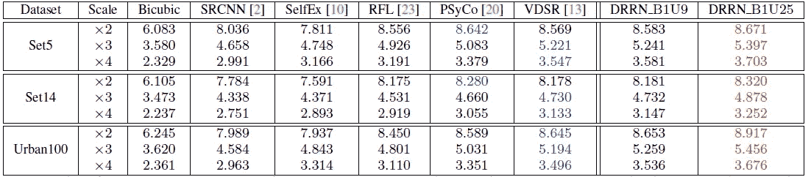

**Benchmark Results Using Information Fidelity Criterion (IFC) metric**

*   还评估与感知分数相关的度量**信息保真度标准(IFC)** 。
*   这里， [VDSR](/review-vdsr-super-resolution-f8050d49362f) 由作者重新实现，使用 BN。(原 [VDSR](/review-vdsr-super-resolution-f8050d49362f) 不使用 BN。)
*   DRRN 仍然优于所有方法。
*   **20 层 B1U9 DRRN 在 Titan X GPU 上处理 288×288 图像需要 0.25 秒**。

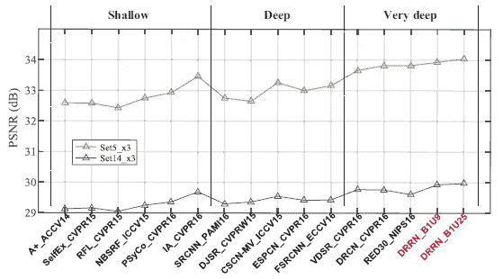

**PSNR for scale factor ×3 on Set5 and Set14**

*   结果表明，更深层次的模型是关键，DRRN 是最近三年所有模型中最好的，包括 [SRCNN](https://medium.com/coinmonks/review-srcnn-super-resolution-3cb3a4f67a7c) 、 [FSRCNN](/review-fsrcnn-super-resolution-80ca2ee14da4) 、 [ESPCN](https://medium.com/datadriveninvestor/review-espcn-real-time-sr-super-resolution-8dceca249350) 、 [VDSR](/review-vdsr-super-resolution-f8050d49362f) 、 [DRCN](https://medium.com/datadriveninvestor/review-drcn-deeply-recursive-convolutional-network-super-resolution-f0a380f79b20) 和[红网](https://medium.com/datadriveninvestor/review-red-net-residual-encoder-decoder-network-denoising-super-resolution-cb6364ae161e)。

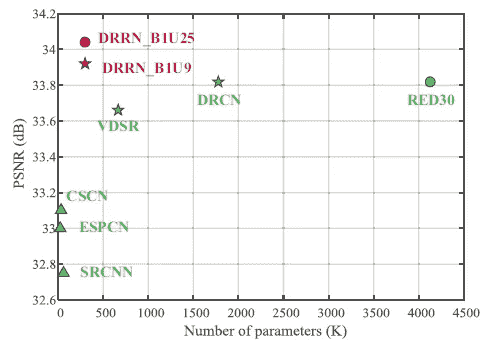

*   就参数数量而言，DRRN 具有最高的 PSNR，同时由于权重的共享而具有相对较少的参数。

## 4.2.定性结果

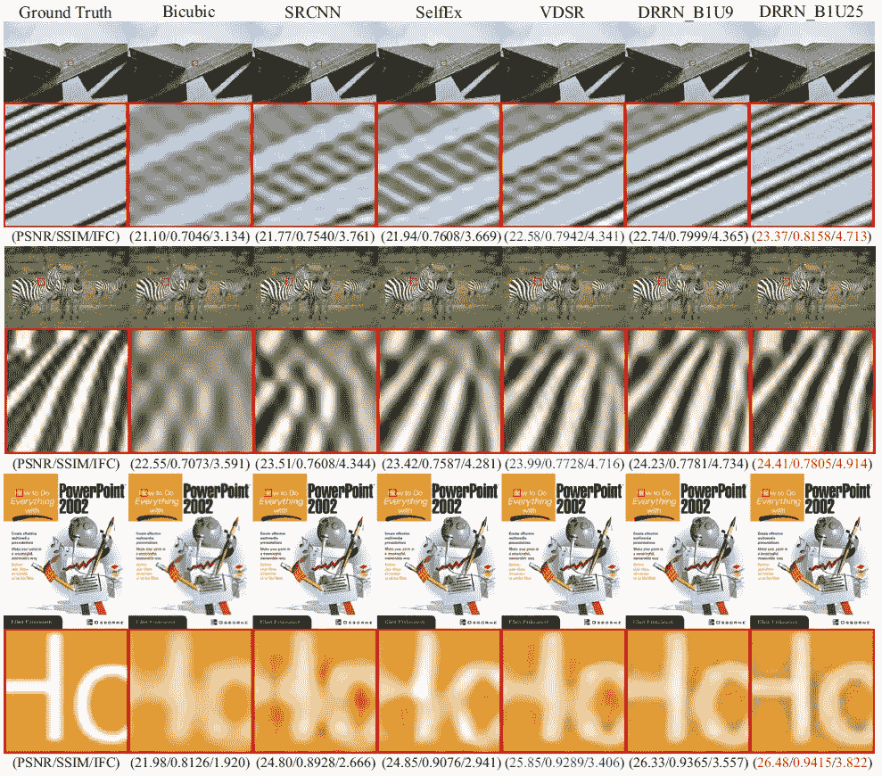

*   DRRN 可以获得更清晰的边缘，而其他边缘则很模糊。

GRL 和 LRL 让我想起了 [RoR](/review-ror-resnet-of-resnet-multilevel-resnet-image-classification-cd3b0fcc19bb) 和 [U-Net+ResNet](https://medium.com/datadriveninvestor/review-u-net-resnet-the-importance-of-long-short-skip-connections-biomedical-image-ccbf8061ff43) ，在这些地方使用了长短跳线连接来提高精度。但是当然，也有不同之处，例如，对于 LRL，跳过分支在这里总是接受相同的输入，并且在剩余分支的卷积中共享权重。

## 参考

【2017 CVPR】【DRRN】
[通过深度递归残差网络的图像超分辨率](http://cvlab.cse.msu.edu/pdfs/Tai_Yang_Liu_CVPR2017.pdf)

## 我以前的评论

)(我)(们)(都)(不)(想)(到)(这)(些)(人)(,)(我)(们)(都)(不)(想)(要)(到)(这)(些)(人)(,)(但)(是)(这)(些)(人)(还)(不)(想)(到)(这)(些)(人)(,)(我)(们)(还)(不)(想)(到)(这)(些)(人)(,)(我)(们)(们)(还)(不)(想)(到)(这)(些)(人)(们)(,)(我)(们)(们)(还)(不)(想)(到)(这)(些)(人)(,)(我)(们)(们)(还)(没)(想)(到)(这)(些)(人)(,)(我)(们)(还)(没)(想)(到)(这)(里)(来)(。 )(我)(们)(都)(不)(想)(到)(这)(些)(人)(,)(我)(们)(都)(不)(想)(要)(到)(这)(里)(去)(,)(我)(们)(还)(不)(想)(到)(这)(些)(人)(,)(我)(们)(都)(不)(想)(要)(到)(这)(里)(去)(了)(,)(我)(们)(还)(不)(想)(到)(这)(些)(人)(,)(我)(们)(都)(不)(想)(到)(这)(里)(来)(。

**物体检测** [过食](https://medium.com/coinmonks/review-of-overfeat-winner-of-ilsvrc-2013-localization-task-object-detection-a6f8b9044754)[R-CNN](https://medium.com/coinmonks/review-r-cnn-object-detection-b476aba290d1)[快 R-CNN](https://medium.com/coinmonks/review-fast-r-cnn-object-detection-a82e172e87ba)[快 R-CNN](/review-faster-r-cnn-object-detection-f5685cb30202)[DeepID-Net](/review-deepid-net-def-pooling-layer-object-detection-f72486f1a0f6)】[R-FCN](/review-r-fcn-positive-sensitive-score-maps-object-detection-91cd2389345c)】[离子](/review-ion-inside-outside-net-2nd-runner-up-in-2015-coco-detection-object-detection-da19993f4766)[多路径网](/review-multipath-mpn-1st-runner-up-in-2015-coco-detection-segmentation-object-detection-ea9741e7c413)[NoC](https://medium.com/datadriveninvestor/review-noc-winner-in-2015-coco-ilsvrc-detection-object-detection-d5cc84e372a)

**语义切分** [FCN](/review-fcn-semantic-segmentation-eb8c9b50d2d1)[de convnet](/review-deconvnet-unpooling-layer-semantic-segmentation-55cf8a6e380e)[deeplab v1&deeplab v2](/review-deeplabv1-deeplabv2-atrous-convolution-semantic-segmentation-b51c5fbde92d)[parse net](https://medium.com/datadriveninvestor/review-parsenet-looking-wider-to-see-better-semantic-segmentation-aa6b6a380990)】[dilated net](/review-dilated-convolution-semantic-segmentation-9d5a5bd768f5)[PSP net](/review-pspnet-winner-in-ilsvrc-2016-semantic-segmentation-scene-parsing-e089e5df177d)[deeplab v3](/review-deeplabv3-atrous-convolution-semantic-segmentation-6d818bfd1d74)

**生物医学图像分割** [[cumed vision 1](https://medium.com/datadriveninvestor/review-cumedvision1-fully-convolutional-network-biomedical-image-segmentation-5434280d6e6)][[cumed vision 2/DCAN](https://medium.com/datadriveninvestor/review-cumedvision2-dcan-winner-of-2015-miccai-gland-segmentation-challenge-contest-biomedical-878b5a443560)][[U-Net](/review-u-net-biomedical-image-segmentation-d02bf06ca760)][[CFS-FCN](https://medium.com/datadriveninvestor/review-cfs-fcn-biomedical-image-segmentation-ae4c9c75bea6)][[U-Net+ResNet](https://medium.com/datadriveninvestor/review-u-net-resnet-the-importance-of-long-short-skip-connections-biomedical-image-ccbf8061ff43)

**实例分割
[[深度掩码](/review-deepmask-instance-segmentation-30327a072339) ] [ [锐度掩码](/review-sharpmask-instance-segmentation-6509f7401a61) ] [ [多路径网络](/review-multipath-mpn-1st-runner-up-in-2015-coco-detection-segmentation-object-detection-ea9741e7c413) ] [ [MNC](/review-mnc-multi-task-network-cascade-winner-in-2015-coco-segmentation-instance-segmentation-42a9334e6a34) ] [ [实例中心](/review-instancefcn-instance-sensitive-score-maps-instance-segmentation-dbfe67d4ee92) ] [ [FCIS](/review-fcis-winner-in-2016-coco-segmentation-instance-segmentation-ee2d61f465e2)**

**超分辨率** [Sr CNN](https://medium.com/coinmonks/review-srcnn-super-resolution-3cb3a4f67a7c)[fsr CNN](/review-fsrcnn-super-resolution-80ca2ee14da4)[VDSR](/review-vdsr-super-resolution-f8050d49362f)[ESPCN](https://medium.com/datadriveninvestor/review-espcn-real-time-sr-super-resolution-8dceca249350)[红网](https://medium.com/datadriveninvestor/review-red-net-residual-encoder-decoder-network-denoising-super-resolution-cb6364ae161e)[DRCN](https://medium.com/datadriveninvestor/review-drcn-deeply-recursive-convolutional-network-super-resolution-f0a380f79b20)