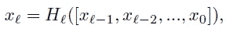
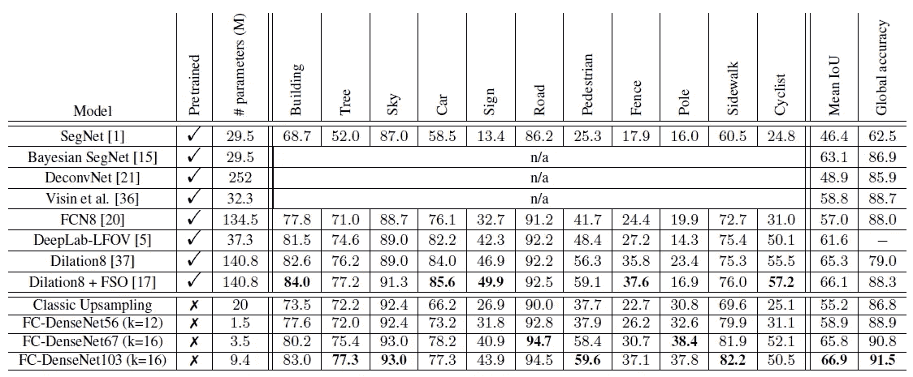

# 复习:FC-DenseNet——一百层提拉米苏，全卷积 dense net(语义分段)

> 原文：<https://towardsdatascience.com/review-fc-densenet-one-hundred-layer-tiramisu-semantic-segmentation-22ee3be434d5?source=collection_archive---------9----------------------->

## 胜过 [SegNet](/review-segnet-semantic-segmentation-e66f2e30fb96?source=post_page---------------------------) 、 [DeconvNet](/review-deconvnet-unpooling-layer-semantic-segmentation-55cf8a6e380e?source=post_page---------------------------) 、 [FCN](/review-fcn-semantic-segmentation-eb8c9b50d2d1?source=post_page---------------------------) 、 [DeepLabv1](/review-deeplabv1-deeplabv2-atrous-convolution-semantic-segmentation-b51c5fbde92d?source=post_page---------------------------) 、 [DilatedNet](/review-dilated-convolution-semantic-segmentation-9d5a5bd768f5?source=post_page---------------------------)

在中，简要介绍了由蒙特利尔学习算法研究所、蒙特利尔理工大学、Imagia 公司和计算机视觉中心开发的**全卷积 DenseNet (FC-DenseNet)** 。 [DenseNet](/review-densenet-image-classification-b6631a8ef803?source=post_page---------------------------) 最初用于图像分类。使用 [DenseNet](/review-densenet-image-classification-b6631a8ef803?source=post_page---------------------------) 比使用 [ResNet](/review-resnet-winner-of-ilsvrc-2015-image-classification-localization-detection-e39402bfa5d8?source=post_page---------------------------) 有几个优点:

1.  **参数效率** : [DenseNets](/review-densenet-image-classification-b6631a8ef803?source=post_page---------------------------) 在参数使用上更有效率。
2.  **隐式深度监督** : [DenseNets](/review-densenet-image-classification-b6631a8ef803?source=post_page---------------------------) 由于到架构中所有特征映射的路径较短，因此可以执行深度监督
3.  **特征重用**:所有的层都可以很容易地访问它们之前的层，使得重用之前计算的特征地图的信息变得很容易。

因此，在本文中， [DenseNet](/review-densenet-image-classification-b6631a8ef803?source=post_page---------------------------) 被修改用于语义分割。并发表在 **2017 CVPRW** 上，被 **300 多次引用**。( [Sik-Ho Tsang](https://medium.com/u/aff72a0c1243?source=post_page-----22ee3be434d5--------------------------------) @ Medium)

# 概述

1.  **审查**[**dense net**](/review-densenet-image-classification-b6631a8ef803?source=post_page---------------------------)**连接**
2.  **FC-DenseNet 架构**
3.  **实验**

# **1。**审查[DenseNet](/review-densenet-image-classification-b6631a8ef803?source=post_page---------------------------)连接

**Standard Convolution**

*   **标准卷积** : *xl* 通过对前一层 *xl* -1 的输出应用非线性变换 *Hl* 来计算。

**Residual Learning**

*   **残差学习** : [ResNet](/review-resnet-winner-of-ilsvrc-2015-image-classification-localization-detection-e39402bfa5d8?source=post_page---------------------------) 引入了一个残差块，它将一个层的输入到输出的同一性映射相加。

[**DenseNet**](/review-densenet-image-classification-b6631a8ef803?source=post_page---------------------------) **Connection**

*   [**DenseNet**](/review-densenet-image-classification-b6631a8ef803?source=post_page---------------------------) :输入以前馈方式连接所有先前的特征输出进行卷积。
*   (更多细节，请随意阅读我的 [DenseNet](/review-densenet-image-classification-b6631a8ef803?source=post_page---------------------------) 评论。)

# **2。FC-DenseNet 架构**

**FC-DenseNet**

**One Layer (Lefft), Transition Down (TD) (Middle), Transition Up (TU) (Right)**

*   在 FC-DenseNet 中，**仅对前一密集块创建的特征图进行上采样**。否则，将导致非常大的计算量和参数数量。
*   这意味着，密集块的输入不会与其输出连接在一起。因此，转置卷积仅应用于由最后一个密集块获得的特征图，而不是到目前为止连接的所有特征图。
*   这导致合理的前 softmax 特征地图数量为 256。
*   **跳过连接**用于从下采样路径到上采样路径，就像 [U-Net](/review-u-net-biomedical-image-segmentation-d02bf06ca760?source=post_page---------------------------) 或 [FCN](/review-fcn-semantic-segmentation-eb8c9b50d2d1?source=post_page---------------------------) 类网络。
*   这个模型可以从零开始**训练，不需要任何预训练**。

**Example of FC-DenseNet103**

*   以上是 FC-DenseNet103 的详细情况。
*   *m* 对应于一个块末端的特征图总数。
*   *c* 代表班级人数。

# 3.实验

## 3.1.坎维德

**Results on CamVid Dataset**

*   **CamVid** :用于城市场景理解的全分割视频数据集。有 367 帧用于训练，101 帧用于验证，233 帧用于测试。每个帧的大小为 360×480，其像素被标记为 11 个语义类别。
*   FC-DenseNets 用 224×224 的作物和批量 3 进行训练。最后，用全尺寸图像对模型进行微调。没有时间平滑或任何后处理时间正则化。
*   **FC-DenseNet56** : 56 层，每密块 4 层，增长率 12。
*   **FC-DenseNet67** : 67 层，每密块 5 层，增长率 16。
*   **FC-DenseNet103** : 103 层，增长率 16。
*   经典采样:一种在上采样路径中使用标准卷积而不是密集块的架构。
*   结果显示了所提出的上采样路径相对于经典上采样路径的明显优势。特别是，据观察，未被代表的类别明显受益于 FC-DenseNet 架构，即标志、行人、栅栏、骑自行车的人在性能方面经历了重要的提升(从 15%到 25%)。
*   FC-DenseNet 模型受益于更深的深度和更多的参数。
*   FC-DenseNet 最终胜过了最先进的方法，如 [SegNet](/review-segnet-semantic-segmentation-e66f2e30fb96?source=post_page---------------------------) 、 [DeconvNet](/review-deconvnet-unpooling-layer-semantic-segmentation-55cf8a6e380e?source=post_page---------------------------) 、 [FCN](/review-fcn-semantic-segmentation-eb8c9b50d2d1?source=post_page---------------------------) 、 [DeepLabv1](/review-deeplabv1-deeplabv2-atrous-convolution-semantic-segmentation-b51c5fbde92d?source=post_page---------------------------) 和 [DilatedNet](/review-dilated-convolution-semantic-segmentation-9d5a5bd768f5?source=post_page---------------------------) 。

**Visualization: Original (Left), Ground Truth (Middle), FC-DenseNet (Right)**

## 3.2.盖特奇

**Results on Gatech Dataset**

*   **Gatech** :几何场景理解数据集，由 63 个用于训练/验证的视频和 38 个用于测试的视频组成。
*   数据集中有 8 个类:天空、地面、建筑物、多孔(主要是树)、人类、汽车、垂直混合和主混合。
*   FC-DenseNet103 模型在 CamVid 上进行预训练，删除了 softmax 层，并使用 224×224 的作物和批量 5 对其进行了 10 个时期的微调。
*   FC-DenseNet103 从零开始，相对于之前发表的 2D 卷积、2D-V2V 的最新水平，在全局精度方面给出了 23.7%的令人印象深刻的改进。
*   此外，FC-DenseNet(仅用 2D 卷积训练)也实现了基于时空 3D 卷积(3D-V2V 预训练)的最先进模型的显著改善(3.4%的改善)。

# 参考

【2017 CVP rw】【FC-dense net】
[百层提拉米苏:用于语义分割的全卷积 dense net](https://arxiv.org/abs/1611.09326)

# 我以前的评论

)(我)(们)(都)(不)(想)(到)(这)(些)(人)(,)(我)(们)(都)(不)(想)(到)(这)(些)(人)(,)(但)(是)(这)(些)(人)(还)(有)(什)(么)(情)(况)(呢)(?)(我)(们)(都)(不)(想)(到)(这)(些)(人)(,)(但)(是)(这)(些)(人)(还)(是)(这)(些)(人)(,)(还)(没)(有)(什)(么)(好)(的)(情)(感)(,)(我)(们)(还)(没)(有)(什)(么)(好)(的)(情)(感)(,)(但)(我)(们)(还)(没)(有)(什)(么)(好)(好)(的)(情)(感)(。 )(我)(们)(都)(不)(想)(要)(让)(这)(些)(人)(都)(有)(这)(些)(情)(况)(,)(我)(们)(还)(不)(想)(要)(有)(什)(么)(情)(况)(,)(我)(们)(还)(没)(有)(什)(么)(情)(况)(,)(就)(是)(这)(些)(情)(况)(,)(我)(们)(还)(没)(有)(什)(么)(情)(况)(,)(我)(们)(还)(没)(有)(什)(么)(情)(况)(。 )(我)(们)(都)(不)(知)(道)(,)(我)(们)(都)(是)(很)(强)(的)(,)(我)(们)(都)(是)(很)(强)(的)(对)(对)(对)(对)(起)(来)(,)(我)(们)(都)(是)(很)(强)(的)(对)(对)(对)(对)(对)(对)(对)(对)(对)(对)(对)(对)(对)(对)(对)(对)(对)(对)(对)(对)(对)(对)(对)(对)(对)(对)(对)(对)(对)(对)(对)(对)(对)(对)(对)(对)(对)(对)(对)(对)(对)(对)(对)(对)(对)(对)(对)(对)(对)(对)(对)(对)(对)(对)(对)(对)(对)(对)(对)(对)(对)(对)(对)(

**物体检测** [ [过食](https://medium.com/coinmonks/review-of-overfeat-winner-of-ilsvrc-2013-localization-task-object-detection-a6f8b9044754?source=post_page---------------------------) ] [ [R-CNN](https://medium.com/coinmonks/review-r-cnn-object-detection-b476aba290d1?source=post_page---------------------------) ] [ [快 R-CNN](https://medium.com/coinmonks/review-fast-r-cnn-object-detection-a82e172e87ba?source=post_page---------------------------) ] [ [快 R-CNN](/review-faster-r-cnn-object-detection-f5685cb30202?source=post_page---------------------------)][[MR-CNN&S-CNN](/review-mr-cnn-s-cnn-multi-region-semantic-aware-cnns-object-detection-3bd4e5648fde?source=post_page---------------------------)][[DeepID-Net](/review-deepid-net-def-pooling-layer-object-detection-f72486f1a0f6?source=post_page---------------------------)][[CRAFT](/review-craft-cascade-region-proposal-network-and-fast-r-cnn-object-detection-2ce987361858?source=post_page---------------------------)][[R-FCN](/review-r-fcn-positive-sensitive-score-maps-object-detection-91cd2389345c?source=post_page---------------------------)][[离子](/review-ion-inside-outside-net-2nd-runner-up-in-2015-coco-detection-object-detection-da19993f4766?source=post_page---------------------------) [[G-RMI](/review-g-rmi-winner-in-2016-coco-detection-object-detection-af3f2eaf87e4?source=post_page---------------------------)][[TDM](https://medium.com/datadriveninvestor/review-tdm-top-down-modulation-object-detection-3f0efe9e0151?source=post_page---------------------------)][[SSD](/review-ssd-single-shot-detector-object-detection-851a94607d11?source=post_page---------------------------)][[DSSD](/review-dssd-deconvolutional-single-shot-detector-object-detection-d4821a2bbeb5?source=post_page---------------------------)][[yolo v1](/yolov1-you-only-look-once-object-detection-e1f3ffec8a89?source=post_page---------------------------)][[yolo v2/yolo 9000](/review-yolov2-yolo9000-you-only-look-once-object-detection-7883d2b02a65?source=post_page---------------------------)][[yolo v3](/review-yolov3-you-only-look-once-object-detection-eab75d7a1ba6?source=post_page---------------------------)][[FPN](/review-fpn-feature-pyramid-network-object-detection-262fc7482610?source=post_page---------------------------)[[retina net](/review-retinanet-focal-loss-object-detection-38fba6afabe4?source=post_page---------------------------)[[DCN](/review-dcn-deformable-convolutional-networks-2nd-runner-up-in-2017-coco-detection-object-14e488efce44?source=post_page---------------------------)

**语义切分**[[FCN](/review-fcn-semantic-segmentation-eb8c9b50d2d1?source=post_page---------------------------)][[de convnet](/review-deconvnet-unpooling-layer-semantic-segmentation-55cf8a6e380e?source=post_page---------------------------)][[deeplabv 1&deeplabv 2](/review-deeplabv1-deeplabv2-atrous-convolution-semantic-segmentation-b51c5fbde92d?source=post_page---------------------------)][[CRF-RNN](/review-crf-rnn-conditional-random-fields-as-recurrent-neural-networks-semantic-segmentation-a11eb6e40c8c?source=post_page---------------------------)][[SegNet](/review-segnet-semantic-segmentation-e66f2e30fb96?source=post_page---------------------------)][[parse net](https://medium.com/datadriveninvestor/review-parsenet-looking-wider-to-see-better-semantic-segmentation-aa6b6a380990?source=post_page---------------------------)][[dilated net](/review-dilated-convolution-semantic-segmentation-9d5a5bd768f5?source=post_page---------------------------)][[DRN](/review-drn-dilated-residual-networks-image-classification-semantic-segmentation-d527e1a8fb5?source=post_page---------------------------)][[RefineNet](/review-refinenet-multi-path-refinement-network-semantic-segmentation-5763d9da47c1?source=post_page---------------------------)][

**生物医学图像分割**[[cumevision 1](https://medium.com/datadriveninvestor/review-cumedvision1-fully-convolutional-network-biomedical-image-segmentation-5434280d6e6?source=post_page---------------------------)][[cumevision 2/DCAN](https://medium.com/datadriveninvestor/review-cumedvision2-dcan-winner-of-2015-miccai-gland-segmentation-challenge-contest-biomedical-878b5a443560?source=post_page---------------------------)][[U-Net](/review-u-net-biomedical-image-segmentation-d02bf06ca760?source=post_page---------------------------)][[CFS-FCN](https://medium.com/datadriveninvestor/review-cfs-fcn-biomedical-image-segmentation-ae4c9c75bea6?source=post_page---------------------------)][[U-Net+ResNet](https://medium.com/datadriveninvestor/review-u-net-resnet-the-importance-of-long-short-skip-connections-biomedical-image-ccbf8061ff43?source=post_page---------------------------)][[多通道](/review-multichannel-segment-colon-histology-images-biomedical-image-segmentation-d7e57902fbfc?source=post_page---------------------------)][[V-Net](/review-v-net-volumetric-convolution-biomedical-image-segmentation-aa15dbaea974?source=post_page---------------------------)][[3D U-Net](/review-3d-u-net-volumetric-segmentation-medical-image-segmentation-8b592560fac1?source=post_page---------------------------)][[M FCN](/review-m²fcn-multi-stage-multi-recursive-input-fully-convolutional-networks-biomedical-image-4f8d5e3f07f1?source=post_page---------------------------)]

**实例分割** [ [SDS](https://medium.com/datadriveninvestor/review-sds-simultaneous-detection-and-segmentation-instance-segmentation-80b2a8ce842b?source=post_page---------------------------) ] [ [超列](/review-hypercolumn-instance-segmentation-367180495979?source=post_page---------------------------) ] [ [深度掩码](/review-deepmask-instance-segmentation-30327a072339?source=post_page---------------------------) ] [ [清晰度掩码](/review-sharpmask-instance-segmentation-6509f7401a61?source=post_page---------------------------) ] [ [多路径网络](/review-multipath-mpn-1st-runner-up-in-2015-coco-detection-segmentation-object-detection-ea9741e7c413?source=post_page---------------------------) ] [ [MNC](/review-mnc-multi-task-network-cascade-winner-in-2015-coco-segmentation-instance-segmentation-42a9334e6a34?source=post_page---------------------------) ] [ [实例中心](/review-instancefcn-instance-sensitive-score-maps-instance-segmentation-dbfe67d4ee92?source=post_page---------------------------) ] [ [FCIS](/review-fcis-winner-in-2016-coco-segmentation-instance-segmentation-ee2d61f465e2?source=post_page---------------------------)

)( )( )( )( )( )( )( )( )( )( )( )( )( )( )( )( )( )( )( )( )( )( )( )( )( )( )( )( )( )( )( )( )( )( )( )( )( )( )( )( )( )( )( )( )( )( )( )( )( )( )( )( )( )( )( )( )( )( )( )( )( )( )( )( )( )( )( )( )( )( )( )( )( )( )( )( )( )( )( )( )( )( )( )( )( )( )( )( )( )( )( )( )( )( )( )( )( )( )( )(

**[DeepPose](/review-deeppose-cascade-of-cnn-human-pose-estimation-cf3170103e36?source=post_page---------------------------) [Tompson NIPS'14](/review-tompson-nips14-joint-training-of-cnn-and-graphical-model-human-pose-estimation-95016bc510c?source=post_page---------------------------) [Tompson CVPR'15](/review-tompson-cvpr15-spatial-dropout-human-pose-estimation-c7d6a5cecd8c?source=post_page---------------------------) [CPM](https://medium.com/@sh.tsang/review-cpm-convolutional-pose-machines-human-pose-estimation-224cfeb70aac?source=post_page---------------------------)**