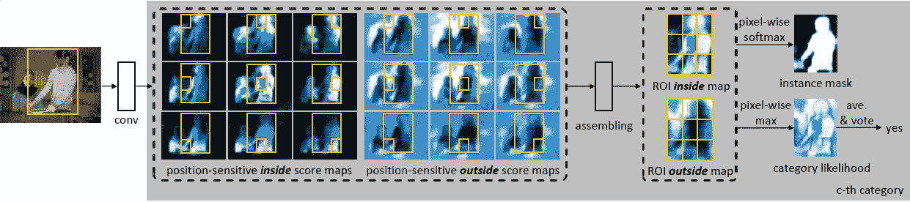
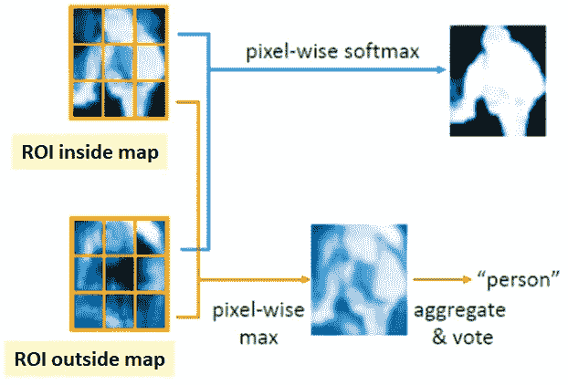
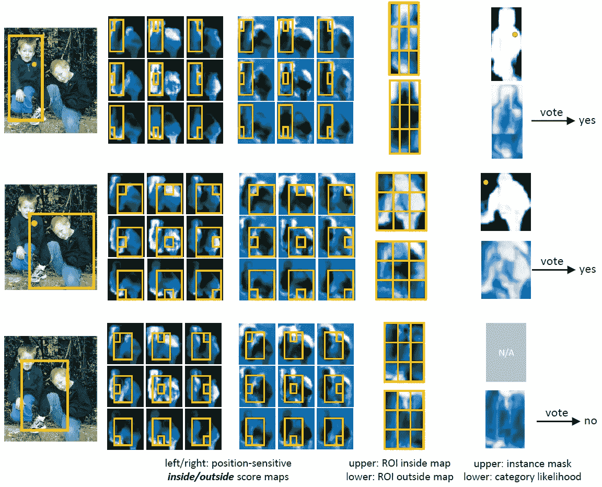
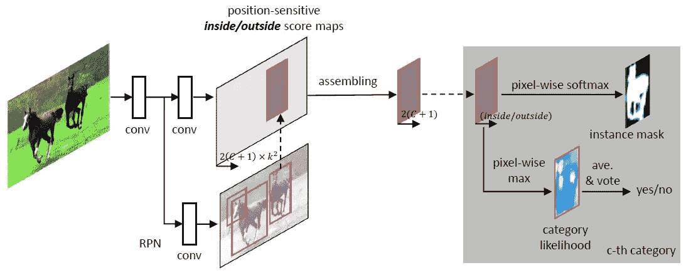
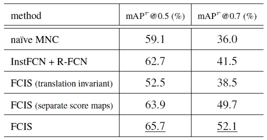
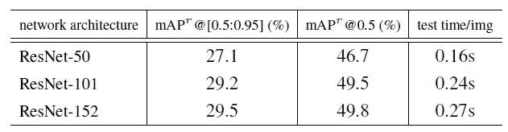
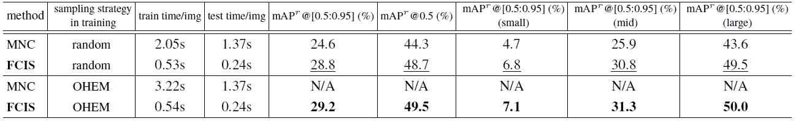
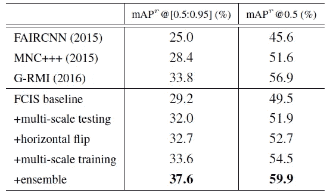
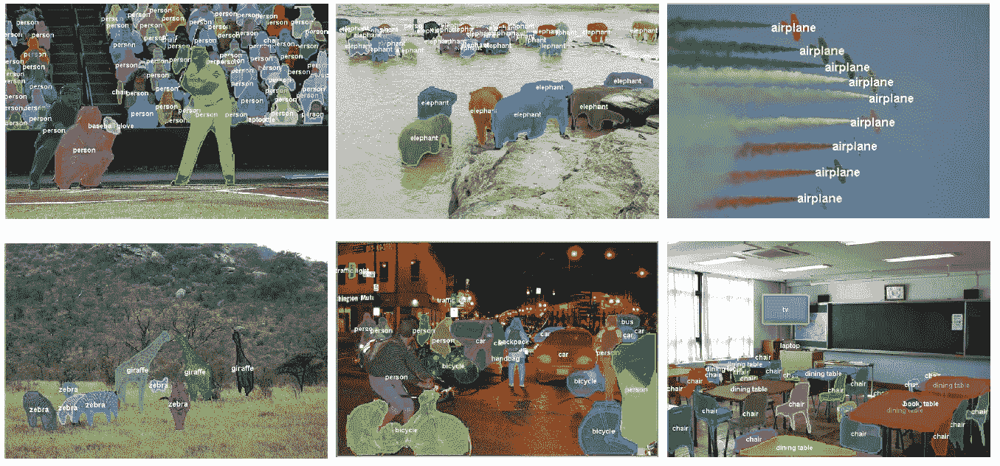
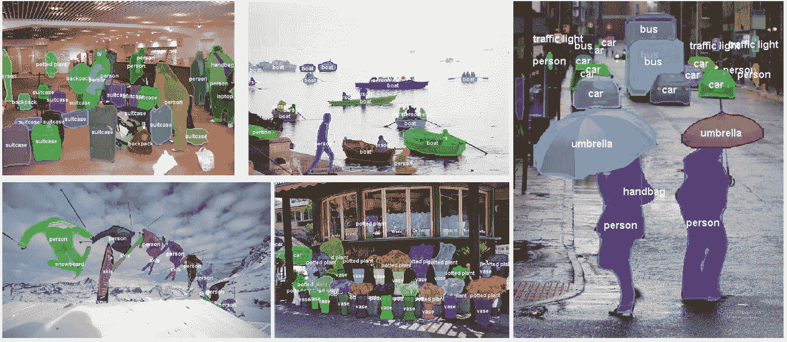

# 回顾:FCIS——2016 年 COCO 细分(实例细分)冠军

> 原文：<https://towardsdatascience.com/review-fcis-winner-in-2016-coco-segmentation-instance-segmentation-ee2d61f465e2?source=collection_archive---------19----------------------->

## 完全卷积的实例感知语义分段，具有位置敏感的内部/外部得分图

在这个故事中，**清华大学**和**微软亚洲研究院**的 **FCIS(全卷积实例感知语义分割)**进行了回顾。这是第一个完全卷积的端到端实例分段解决方案**。通过引入**位置敏感的内部/外部得分图**，卷积表示被检测和分割子任务完全共享。获得了高精度和高效率。**

最终，FCIS 在 2016 年 COCO 分段挑战赛中获得**第一名，准确率相对高出第二名 12%。**它也在那一刻**在 2016 COCO 检测排行榜上排名第二**。它最初被命名为**翻译感知的完全卷积实例分割(TA-FCN)** 。

[在 2015 年 COCO 分割挑战赛中获得第一名的 MNC](/review-mnc-multi-task-network-cascade-winner-in-2015-coco-segmentation-instance-segmentation-42a9334e6a34) ，每张图像花费 1.4 秒，其中 80%的时间都花在最后的每个 ROI 步骤上。 **FCIS 使用**[**ResNet-101**](/review-resnet-winner-of-ilsvrc-2015-image-classification-localization-detection-e39402bfa5d8)**(英伟达 K40)每张图像只需 0.24s，比**[**MNC**](/review-mnc-multi-task-network-cascade-winner-in-2015-coco-segmentation-instance-segmentation-42a9334e6a34)**快很多。**你可能认为推理时间仍然很慢，但是，COCO 分割挑战迫切需要最先进的地图。因此，FCIS 在减少推断时间的同时进一步提高地图并获得第一名已经很令人惊讶了。最终发表在 **2017 CVPR** 超过 **100 次引用**。( [Sik-Ho Tsang](https://medium.com/u/aff72a0c1243?source=post_page-----ee2d61f465e2--------------------------------) @中)

# 概述

1.  **位置敏感内/外得分图**
2.  **FCIS 建筑**
3.  **消融研究**
4.  **与最先进方法的比较**

# 1.位置敏感的内/外得分图

**k×k Position-Sensitive Inside/Outside Score Maps with k=3 here**

*   如果你已经知道了[R-FCN](/review-r-fcn-positive-sensitive-score-maps-object-detection-91cd2389345c)&[instance fcn](/review-instancefcn-instance-sensitive-score-maps-instance-segmentation-dbfe67d4ee92)，你会注意到他们也制作了类似于上面 FCIS 的分数地图。 [**R-FCN**](/review-r-fcn-positive-sensitive-score-maps-object-detection-91cd2389345c) **产生用于对象检测的正面敏感得分图**，而 [**实例敏感得分图**](/review-instancefcn-instance-sensitive-score-maps-instance-segmentation-dbfe67d4ee92) **产生用于生成分段建议的实例敏感得分图**。如果你已经理解了[R-FCN](/review-r-fcn-positive-sensitive-score-maps-object-detection-91cd2389345c)&[instance fcn](/review-instancefcn-instance-sensitive-score-maps-instance-segmentation-dbfe67d4ee92)，就更容易理解位置敏感的内外得分图。
*   在上面的例子中，**每个评分图负责预测对象实例的相对位置。**每个评分图负责捕捉对象实例的相对位置。例如:左上分数图负责捕捉对象实例的左上部分。组装后，可以生成分离的人物面具。
*   与[R-FCN](/review-r-fcn-positive-sensitive-score-maps-object-detection-91cd2389345c)&instance fcn 不同的是**有两套比分图**。
*   **为了组合 ROI 内部图，在每个正敏感内部得分图上捕捉左上、中上、右上…和右下部分。**类似于阳性敏感外评分图。
*   最后，生成两个得分图。一个是 **ROI 内图**。一个是**图外 ROI**。

**Two Pathways**

*   基于这两幅图，有**两条路径**，一条用于**实例遮罩**，逐像素 softmax 用于分割损失。一种是针对**类别似然度**，通过平均汇集所有像素的似然度来获得检测分数。因此，卷积表示对于检测和分割子任务是完全共享的。
*   一些例子:

# 2.FCIS 建筑

**FCIS (Fully Convolutional Instance-aware Semantic Segmentation) Architecture**

*   **ImageNet 预训练的**[**ResNet-101**](/review-resnet-winner-of-ilsvrc-2015-image-classification-localization-detection-e39402bfa5d8)**作为主干**，用 h **ole 算法**([DeepLab](/review-deeplabv1-deeplabv2-atrous-convolution-semantic-segmentation-b51c5fbde92d)/[dilated net](/review-dilated-convolution-semantic-segmentation-9d5a5bd768f5))将 conv5 的第一个块的步距从 2 增加到 1。因此，有效特征步距增加到 16。(即**增加输出特征图尺寸。**)
*   对于**区域提议网络(RPN)** ，为了与 [MNC](/review-mnc-multi-task-network-cascade-winner-in-2015-coco-segmentation-instance-segmentation-42a9334e6a34) 进行公平的比较，RPN 被**添加到 conv4 层之上，这与**[**MNC**](/review-mnc-multi-task-network-cascade-winner-in-2015-coco-segmentation-instance-segmentation-42a9334e6a34)**的方式相同。**
*   从 conv5 特征图中，使用 1×1 卷积生成**2*k*×(*C*+1)分数图**。( *k* =7 最后， *C* 类加 1 背景)
*   **ROI 汇集**在这些评分图上执行。
*   **对于每个 ROI** ，获得 2 个( *C* +1)图。**一个( *C* +1)是图内 ROI。一个( *C* +1)是图外 ROI。**然后我们可以计算分割损失和检测分数。
*   和 [R-FCN](/review-r-fcn-positive-sensitive-score-maps-object-detection-91cd2389345c) 一样，还有一个**兄弟 1×1 卷积用于包围盒(bbox)回归**。
*   在推断期间，RPN 生成 300 个具有最高分数的 ROI。然后，它们通过 bbox 回归分支，产生另外 300 个 ROI。
*   IoU 阈值 0.3 的非最大抑制(NMS)用于滤除高度重叠的 ROI。在剩余 ROI 的池中，对于每个 ROI，我们获得其分类分数和所有类别的前景遮罩(以概率计)。
*   在训练期间，如果 IoU 与最接近的地面实况大于 0.5，则 ROI 为正。有 **3 个损失项** : **一个超过 *C* +1 类别**，**一个仅地面实况类别的 softmax 分割损失**，以及**一个 bbox 回归损失**。后两者仅对正 ROI 有效。
*   因为每 ROI 计算仅涉及 k 细胞分割、分数图复制、softmax、max 和平均池。它既简单又快捷。

# 3.**消融研究**

## 3.1. **FCIS 变种**

**FCIS Variants on PASCAL VOC 2012 Val Set**

*   **幼稚 MNC** : [MNC](/review-mnc-multi-task-network-cascade-winner-in-2015-coco-segmentation-instance-segmentation-42a9334e6a34) ，59.1% mAP@0.5。
*   **inst fcn****+R-FCN**:使用 [InstanceFCN](/review-instancefcn-instance-sensitive-score-maps-instance-segmentation-dbfe67d4ee92) 进行分段提议，使用 [R-FCN](/review-r-fcn-positive-sensitive-score-maps-object-detection-91cd2389345c) 预测对象类别并回归包围盒，62.7% mAP@0.5。
*   **FCIS(平移不变量)**:即 *k* =1 的 FCIS，52.5% mAP@0.5，可见位置敏感的内外得分图很重要。
*   **FCIS(单独评分图)**:第一套 *k* 评分图仅用于分割，第二套仅用于分类，63.9% mAP@0.5，说明需要联合制定。
*   **FCIS** : 65.7% mAP@0.5，联合制定有效。

## 3.2.不同深度的 ResNet

**ResNet with Different Depths on COCO test-dev set**

*   虽然 [ResNet-152](/review-resnet-winner-of-ilsvrc-2015-image-classification-localization-detection-e39402bfa5d8) 具有更高的 mAP，但是 [ResNet-101](/review-resnet-winner-of-ilsvrc-2015-image-classification-localization-detection-e39402bfa5d8) 用于与最先进的方法进行比较。

## 3.3.OHEM(在线硬示例挖掘)

**Comparison with** [**MNC**](/review-mnc-multi-task-network-cascade-winner-in-2015-coco-segmentation-instance-segmentation-42a9334e6a34) **on COCO test-dev set with/without OHEM**

*   在 *N* 建议中，只有具有最高损失的顶部*B*ROI 用于反向传播。OHEM 将 MNC 的训练时间从 2.05 秒大幅提高到 3.22 秒，OHEM 对 FCIS 的训练时间影响不大，但改善了地图。这是因为每 ROI 计算对于 FCIS 来说是便宜的。

# 4.与最先进方法的比较

## 4.1.COCO 细分挑战

**COCO Segmentation Challenge Entry**

*   **FAIRCNN** :其实是 2015 年第二名 [MultiPathNet](/review-multipath-mpn-1st-runner-up-in-2015-coco-detection-segmentation-object-detection-ea9741e7c413) 的队名。
*   **mnc++**:[2015 年获得第一名的 MNC](/review-mnc-multi-task-network-cascade-winner-in-2015-coco-segmentation-instance-segmentation-42a9334e6a34) 提交结果。
*   **G-RMI**:2016 年第 2 名，由谷歌研究和机器智能团队。(该方法不是在对象检测挑战中获胜的方法。)
*   **FCIS 基线**:已经比[多路径](/review-multipath-mpn-1st-runner-up-in-2015-coco-detection-segmentation-object-detection-ea9741e7c413)和 [MNC](/review-mnc-multi-task-network-cascade-winner-in-2015-coco-segmentation-instance-segmentation-42a9334e6a34) 好了。
*   **+多尺度测试**:使用测试图像金字塔，短边为{480，576，688，864，1200，1400}像素进行测试。
*   **+水平翻转**:水平翻转图像，再次测试，然后平均结果。
*   **+多尺度训练**:应用与多尺度推理相同尺度的多尺度训练。
*   **+集合**:集合 6 个网络。
*   最后，具有上述技巧的 FCIS 比 G-RMI 高 3.8%(相对地高 11%)。

## 4.2.COCO 检测排行榜

*   通过将实例遮罩的包围盒作为检测到的包围盒，在 COCO 测试开发集上实现了 39.7%的物体检测准确率，在当时的 COCO 物体检测排行榜上名列第二。

## 4.3.定性结果

## 参考

【2017 CVPR】【FCIS】
[全卷积实例感知语义分割](https://arxiv.org/abs/1611.07709)

## 我的相关评论

)(我)(们)(都)(不)(想)(到)(这)(些)(人)(,)(我)(们)(都)(不)(想)(要)(到)(这)(些)(人)(,)(但)(是)(这)(些)(人)(还)(不)(想)(到)(这)(些)(人)(,)(我)(们)(还)(没)(想)(到)(这)(些)(事)(,)(我)(们)(就)(想)(到)(了)(这)(些)(人)(们)(,)(我)(们)(们)(都)(不)(想)(要)(到)(这)(些)(人)(,)(但)(我)(们)(还)(没)(想)(到)(这)(些)(事)(,)(我)(们)(还)(没)(想)(到)(这)(里)(来)(。 )(我)(们)(都)(不)(知)(道)(,)(我)(们)(还)(是)(不)(知)(道)(,)(我)(们)(还)(是)(不)(知)(道)(,)(我)(们)(还)(是)(不)(知)(道)(,)(我)(们)(还)(是)(不)(知)(道)(,)(我)(们)(还)(是)(不)(知)(道)(,)(我)(们)(还)(是)(不)(知)(道)(,)(我)(们)(还)(是)(不)(知)(道)(。

**物体检测** [过食](https://medium.com/coinmonks/review-of-overfeat-winner-of-ilsvrc-2013-localization-task-object-detection-a6f8b9044754)[R-CNN](https://medium.com/coinmonks/review-r-cnn-object-detection-b476aba290d1)[快 R-CNN](https://medium.com/coinmonks/review-fast-r-cnn-object-detection-a82e172e87ba)[快 R-CNN](/review-faster-r-cnn-object-detection-f5685cb30202)[DeepID-Net](/review-deepid-net-def-pooling-layer-object-detection-f72486f1a0f6)】[R-FCN](/review-r-fcn-positive-sensitive-score-maps-object-detection-91cd2389345c)】[离子](/review-ion-inside-outside-net-2nd-runner-up-in-2015-coco-detection-object-detection-da19993f4766)[多路径网](/review-multipath-mpn-1st-runner-up-in-2015-coco-detection-segmentation-object-detection-ea9741e7c413)[NoC](https://medium.com/datadriveninvestor/review-noc-winner-in-2015-coco-ilsvrc-detection-object-detection-d5cc84e372a)

**语义切分** [FCN](/review-fcn-semantic-segmentation-eb8c9b50d2d1)[de convnet](/review-deconvnet-unpooling-layer-semantic-segmentation-55cf8a6e380e)[deeplab v1&deeplab v2](/review-deeplabv1-deeplabv2-atrous-convolution-semantic-segmentation-b51c5fbde92d)】[parse net](https://medium.com/datadriveninvestor/review-parsenet-looking-wider-to-see-better-semantic-segmentation-aa6b6a380990)】[dilated net](/review-dilated-convolution-semantic-segmentation-9d5a5bd768f5)[PSPNet](/review-pspnet-winner-in-ilsvrc-2016-semantic-segmentation-scene-parsing-e089e5df177d)]

**生物医学图像分割** 

**实例分割** [ [深度掩码](/review-deepmask-instance-segmentation-30327a072339) ] [ [清晰度掩码](/review-sharpmask-instance-segmentation-6509f7401a61) ] [ [多路径网络](/review-multipath-mpn-1st-runner-up-in-2015-coco-detection-segmentation-object-detection-ea9741e7c413) ] [ [MNC](/review-mnc-multi-task-network-cascade-winner-in-2015-coco-segmentation-instance-segmentation-42a9334e6a34) ] [ [实例中心](/review-instancefcn-instance-sensitive-score-maps-instance-segmentation-dbfe67d4ee92) ]