# 综述:FPN —特征金字塔网络(目标检测)

> 原文：<https://towardsdatascience.com/review-fpn-feature-pyramid-network-object-detection-262fc7482610?source=collection_archive---------0----------------------->

## 超越单一模式的参赛作品，包括 COCO 检测挑战赛冠军、G-RMI 和 MultiPathNet

在这篇论文中，**【FPN】(特征金字塔网络)**，由**【脸书】AI Research(FAIR)****康奈尔大学**和**康奈尔理工**共同评述。通过在卷积神经网络(CNN)中引入一个用于构建特征金字塔的简洁而简单的框架，与几个强基线和竞争获胜者相比，如 [G-RMI](/review-g-rmi-winner-in-2016-coco-detection-object-detection-af3f2eaf87e4) 、 [MultiPathNet](/review-multipath-mpn-1st-runner-up-in-2015-coco-detection-segmentation-object-detection-ea9741e7c413) 和 [ION](/review-ion-inside-outside-net-2nd-runner-up-in-2015-coco-detection-object-detection-da19993f4766) ，表现出了显著的改进。与 [DeepMask](/review-deepmask-instance-segmentation-30327a072339) 、 [SharpMask](/review-sharpmask-instance-segmentation-6509f7401a61) 和 [InstanceFCN](/review-instancefcn-instance-sensitive-score-maps-instance-segmentation-dbfe67d4ee92) 相比，FPN 拥有更高的分段提议 AR。是一篇 **2017 CVPR** 论文，引用 **700 多篇**。( [Sik-Ho Tsang](https://medium.com/u/aff72a0c1243?source=post_page-----262fc7482610--------------------------------) @中)

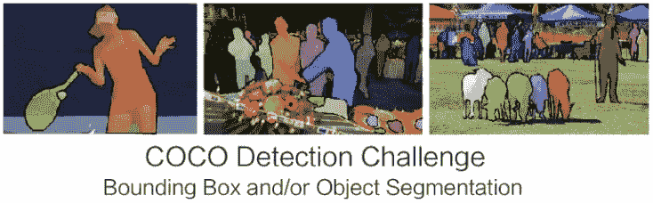

**COCO Detection and Segmentation Challenge**

# 涵盖哪些内容

1.  **文学中的各种建筑**
2.  **特色金字塔网络(FPN)**
3.  **FPN 地区提案网络(RPN)**
4.  **FPN 探测网**
5.  **消融实验**
6.  **与最先进方法的比较**

# 1.文学中的各种建筑

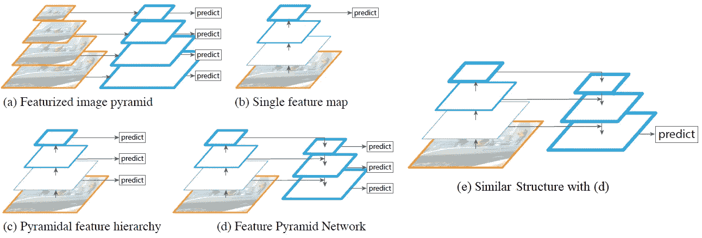

**Different Architectures for Detection**

## **(一)特征化图像金字塔**

*   在手工设计的时代，它被大量使用。

## **(b)单一特征地图**

*   这是一个标准的 ConvNet 解决方案，对一个单一的输入图像有预测在网络的末端。

## **(c)金字塔特征层次**

*   在每一层，就像 [SSD](/review-ssd-single-shot-detector-object-detection-851a94607d11) 一样进行预测。它重用了前向过程中计算的不同图层的多尺度特征地图，因此是免费的。
*   然而，它错过了重用特征层次的高分辨率地图的机会，因此错过了对小物体的检测。

## **(d)特征金字塔网络**

*   **它通过自上而下的路径和横向连接将低分辨率、语义强的特征与高分辨率、语义弱的特征结合起来。**
*   这种特征金字塔在所有级别上都具有丰富的语义，并且可以从单个输入图像尺度快速构建，从而不会牺牲表示能力、速度或内存。一些并发作品如也采用这种方式。

## **(e)类似架构**

*   最近的一些研究采用了类似的自顶向下和跳过连接，如 [TDM](https://medium.com/datadriveninvestor/review-tdm-top-down-modulation-object-detection-3f0efe9e0151) ， [SharpMask](/review-sharpmask-instance-segmentation-6509f7401a61) ， [RED-Net](https://medium.com/datadriveninvestor/review-red-net-residual-encoder-decoder-network-denoising-super-resolution-cb6364ae161e) ， [U-Net](/review-u-net-biomedical-image-segmentation-d02bf06ca760) ，这些连接在当时相当流行，但只是在最后阶段进行预测。

# **2。特征金字塔网络(FPN)**

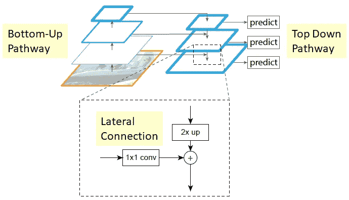

**Feature Pyramid Network (FPN)**

## **2.1。自下而上路径**

*   自底向上的路径是主干通信网的前馈计算。定义了一个金字塔等级用于每个阶段。每个阶段的最后一层的输出将被用作通过横向连接来丰富自顶向下路径的参考特征图集。

## **2.2。自上而下的路径和横向连接**

*   较高分辨率的特征是从较高金字塔等级向上采样的空间上更粗糙但语义上更强的特征图。更具体地说，为了简单起见，使用最近邻将空间分辨率**上采样 2 倍。**
*   每个横向连接合并来自自下而上路径和自上而下路径的相同空间大小的特征地图。
*   具体来说，**来自自底向上路径的特征图经历 1×1 卷积以降低通道维度。**
*   并且**来自自下而上路径和自上而下路径的特征图通过逐元素添加来合并。**

## 2.3.预言；预测；预告

*   最后，**在每个合并后的图上附加一个 3×3 的卷积，生成最终的特征图，这是为了减少上采样的混叠效应。**这最后一组特征地图称为{P2，P3，P4，P5}，分别对应{C2，C3，C4，C5}，它们的空间大小相同。
*   因为金字塔的所有级别都像在传统特征化图像金字塔中一样使用共享的分类器/回归器，所以输出 *d* 处的特征维度固定为 *d* = 256。因此，所有额外的卷积层都有 256 通道输出。

# **3。FPN 地区提案网络(RPN)**

*   在[fast R-CNN](/review-faster-r-cnn-object-detection-f5685cb30202)中的原始 RPN 设计中，在密集的 3×3 滑动窗口上评估一个小子网，在单尺度卷积特征图的顶部，执行对象/非对象二元分类和边界框回归。
*   这是通过一个 3×3 卷积层来实现的，其后是用于对象/非对象分类和回归的**两个兄弟 1×1 卷积**，我们称之为网络**头**。
*   此处，RPN 中的单比例尺要素地图被 FPN 所取代。因此，没有必要在特定层上设置多尺度锚盒。
*   **每个级别都有一个标度**分配给每个级别。形式上定义锚点分别在{P2，P3，P4，P5，P6}上有{ T16 }个{32，64，128，256，512 }像素的区域。
*   并且**在每个级别，使用{1:2，1:1，2:1}的多个纵横比**。
*   如果对于给定的基础事实框，锚具有最高的 IoU，或者对于任何基础事实框，其 IoU 超过 0.7，则锚被分配正标签，如果对于所有基础事实框，其 IoU 低于 0.3，则锚被分配负标签。
*   头部的参数在所有特征金字塔等级中共享。

# 4.探测网络的 FPN

*   在[fast R-CNN](/review-faster-r-cnn-object-detection-f5685cb30202)中的原始检测网络中，使用了单尺度特征图。
*   这里，为了检测对象，需要将不同尺度的 ROI 分配给金字塔等级。
*   形式上，**宽*宽*高*高*(在网络的输入图像上)的 ROI 被分配到我们的特征金字塔**的层次 *Pk* 上，通过:

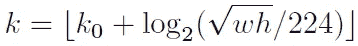

*   使用 224，因为这是标准的 ImageNet 预训练大小。
*   而[更快的 R-CNN](/review-faster-r-cnn-object-detection-f5685cb30202) 使用 C4 作为单尺度特征图， *k* 0 设置为 4。
*   因此，如果 224×224，k = 4。我们用 P4。
*   如果 112×112，k = 3。它被映射到 P3 的更高分辨率级别。
*   预测器头部(在[快速 R-CNN](https://medium.com/coinmonks/review-fast-r-cnn-object-detection-a82e172e87ba) 中，头部是特定于类别的分类器和包围盒回归器)被附加到所有级别的所有 ROI。同样，无论级别如何，磁头都共享参数。
*   采用 RoI pooling 提取 7×7 特征，并在最终分类和包围盒回归层之前附加两个隐藏的 1024 维全连通(fc)层。

# **5。消融实验**

## 5.1.RPN 的烧蚀实验

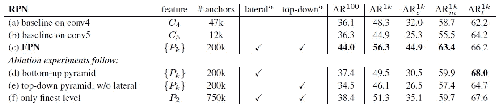

**Bounding box proposal results of RPN on the COCO minival set**

## 5.1.1.与基线的比较

*   **(b)使用 conv5 与(A)使用 conv4** 相比没有优势:单个更高级的特征地图是不够的，因为在更粗糙的分辨率和更强的语义之间存在权衡。
*   **(c)将 FPN 放入 RPN 将 AR1k 提高到 56.3** ，比单一等级 RPN 基线提高了 8.0 点。
*   此外，**小对象(AR1ks)上的性能大幅提升了 12.9 分**。
*   因此，RPN 上的 FPN 对目标尺度变化具有鲁棒性。

## 5.1.2.自上而下浓缩

*   **(d)是 FPN，但没有自上而下的路径**。通过这种修改，1×1 横向连接后面跟着 3×3 回旋被附加到自底向上的金字塔上。它**模拟了重用金字塔特征层次**的效果。(即第一幅图中(c)的架构)
*   与 FPN (c) 相比**的结果稍逊一筹。**
*   据推测，这是因为**在自下而上的金字塔(b)** 上，不同层次之间存在很大的语义鸿沟，特别是对于非常深的[结果网](/review-resnet-winner-of-ilsvrc-2015-image-classification-localization-detection-e39402bfa5d8)。
*   还评估了不共享磁头参数的(d)的变体，但是观察到类似的性能下降。

## 5.1.3.横向连接

*   **(e)，没有 1×1 横向连接的自上而下的特征金字塔**。这个自上而下的金字塔具有很强的语义特征和精细的分辨率。
*   有人认为这些特征的位置并不精确，因为这些地图已经过多次降采样和升采样。
*   (c)中的 FPN 的 AR1k 得分比(e)高 10 分。

## 5.1.4.金字塔表示法

*   **(f)，头部被附加到 P2 的最高分辨率、强语义特征地图上。**所有锚点都被分配到 P2 特征地图。
*   这个变量比基线好，但比 FPN 差。

## 5.2.探测网络烧蚀实验

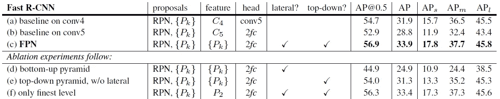

**Object detection results of detection network on the COCO minival set**

*   消融是在一组固定的建议上进行的。FPN 为 RPN 计算的建议被冻结。检测网络和 RPN 之间的特征是不共享的。
*   相对于 conv4 (a)上的基线，FPN (c)将 AP 提高了 2.0，将小物体 AP 提高了 2.1。
*   移除自上而下的连接(d)或移除横向连接(e)会导致较差的结果。
*   **去除自上而下的连接(d)会显著降低精度。**在高分辨率地图上使用低级特征会有问题。
*   使用 P2 (e)的单一最精细比例特征地图，其结果(33.4 AP)比 FPN (c)稍差。

## 5.3.检测网络和 RPN 的一致主干架构

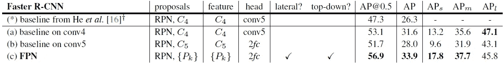

**Object detection results with shared features on the COCO minival set**

*   RPN 和检测网络都使用一致的主干架构。(但尚未共享功能)
*   FPN (c)比这个强基线好 2.3 点 AP 和 3.8 点 AP@0.5。(( a)和(b)中的基线优于 [ResNet](/review-resnet-winner-of-ilsvrc-2015-image-classification-localization-detection-e39402bfa5d8) 中显示的基线。)

## 5.4.检测网络和 RPN 的共享功能

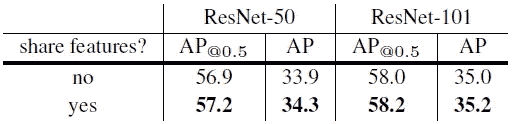

**Object detection results with shared features using** [**ResNet**](/review-resnet-winner-of-ilsvrc-2015-image-classification-localization-detection-e39402bfa5d8) **on the COCO minival set**

*   共享要素可以略微提高精确度。特性共享也减少了测试时间。FPN 在单个 NVIDIA M40 GPU 上对 [ResNet-50](/review-resnet-winner-of-ilsvrc-2015-image-classification-localization-detection-e39402bfa5d8) 的每幅图像的推理时间为 0.148 秒，对 [ResNet-101](/review-resnet-winner-of-ilsvrc-2015-image-classification-localization-detection-e39402bfa5d8) 的推理时间为 0.172 秒。

# **6。与最先进方法的比较**

## 6.1.可可检测挑战

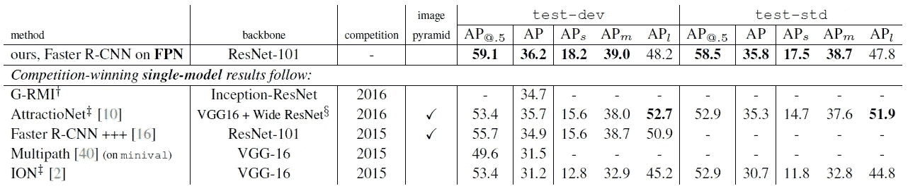

**Comparisons of single-model results on the COCO detection benchmark**

*   在测试开发集上，我们的方法比现有的最佳结果增加了 0.5 点的 AP (36.2 对 35.7)和 3.4 点的 AP@0.5 (59.1 对 55.7)。
*   [**G-RMI**](/review-g-rmi-winner-in-2016-coco-detection-object-detection-af3f2eaf87e4):2016 年冠军。
*   **更快的 R-cnn++**:使用[更快的 R-CNN](/review-faster-r-cnn-object-detection-f5685cb30202) 、 [ResNet](/review-resnet-winner-of-ilsvrc-2015-image-classification-localization-detection-e39402bfa5d8) 和[NOC](https://medium.com/datadriveninvestor/review-noc-winner-in-2015-coco-ilsvrc-detection-object-detection-d5cc84e372a)的 2016 年获胜者。
*   [**ION**](/review-ion-inside-outside-net-2nd-runner-up-in-2015-coco-detection-object-detection-da19993f4766):2015 年亚军，它使用了修改的 IRNN 和跳过池来提取多个尺度和抽象层次的信息。
*   FPN 在这里没有利用许多流行的改进，如迭代回归、硬负挖掘、上下文建模、更强的数据扩充等。

## 6.2.扩展:细分建议

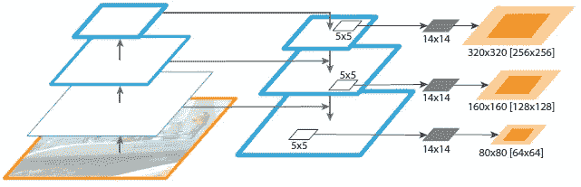

**FPN for object segment proposals**

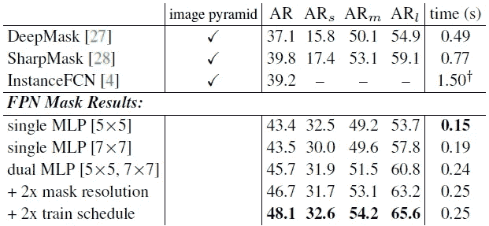

**Instance segmentation proposals evaluated on the first 5k COCO val images**

*   fpn 按照[深度掩码](/review-deepmask-instance-segmentation-30327a072339) / [清晰度掩码](/review-sharpmask-instance-segmentation-6509f7401a61)框架生成分割建议。
*   windows 上的 MLP，用于生成密集的对象片段，输出维度为 14×14 掩码和对象分数。
*   与 [DeepMask](/review-deepmask-instance-segmentation-30327a072339) 、 [SharpMask](/review-sharpmask-instance-segmentation-6509f7401a61) 和 [InstanceFCN](/review-instancefcn-instance-sensitive-score-maps-instance-segmentation-dbfe67d4ee92) 相比，FPN **比这些方法的精度高出 8.3 个百分点以上**，而**在小物体上的精度几乎是后者的两倍**。
*   现有的掩模建议方法是基于密集采样的图像金字塔，使得它们在计算上很昂贵。
*   FPN 以每秒 6 到 7 帧的速度运行要快得多。

尽管 [ResNet](/review-resnet-winner-of-ilsvrc-2015-image-classification-localization-detection-e39402bfa5d8) 和[fast R-CNN](/review-faster-r-cnn-object-detection-f5685cb30202)卓有成效，但 FPN 在几个强劲的基线和竞赛获胜者方面仍有显著进步。

## 参考

【2017 CVPR】【FPN】
[用于物体检测的特征金字塔网络](https://arxiv.org/abs/1612.03144)

## 我的相关评论

)(我)(们)(都)(不)(想)(到)(这)(些)(人)(,)(我)(们)(都)(不)(想)(要)(到)(这)(些)(人)(,)(但)(是)(这)(些)(人)(还)(不)(想)(到)(这)(些)(人)(,)(我)(们)(还)(没)(想)(到)(这)(些)(事)(,)(我)(们)(就)(想)(到)(了)(这)(些)(人)(们)(,)(我)(们)(们)(都)(不)(想)(要)(到)(这)(些)(人)(,)(但)(我)(们)(还)(没)(想)(到)(这)(些)(事)(,)(我)(们)(还)(没)(想)(到)(这)(里)(来)(。 )(我)(们)(都)(不)(知)(道)(,)(我)(们)(还)(是)(不)(知)(道)(,)(我)(们)(还)(是)(不)(知)(道)(,)(我)(们)(还)(是)(不)(知)(道)(,)(我)(们)(还)(是)(不)(知)(道)(,)(我)(们)(还)(是)(不)(知)(道)(,)(我)(们)(还)(是)(不)(知)(道)(,)(我)(们)(还)(是)(不)(知)(道)(。

**物体检测** [过食](https://medium.com/coinmonks/review-of-overfeat-winner-of-ilsvrc-2013-localization-task-object-detection-a6f8b9044754)[R-CNN](https://medium.com/coinmonks/review-r-cnn-object-detection-b476aba290d1)[快 R-CNN](https://medium.com/coinmonks/review-fast-r-cnn-object-detection-a82e172e87ba)[快 R-CNN](/review-faster-r-cnn-object-detection-f5685cb30202)[DeepID-Net](/review-deepid-net-def-pooling-layer-object-detection-f72486f1a0f6)】[R-FCN](/review-r-fcn-positive-sensitive-score-maps-object-detection-91cd2389345c)】[离子](/review-ion-inside-outside-net-2nd-runner-up-in-2015-coco-detection-object-detection-da19993f4766)[多路径网](/review-multipath-mpn-1st-runner-up-in-2015-coco-detection-segmentation-object-detection-ea9741e7c413)[NoC](https://medium.com/datadriveninvestor/review-noc-winner-in-2015-coco-ilsvrc-detection-object-detection-d5cc84e372a)

**语义切分** [FCN](/review-fcn-semantic-segmentation-eb8c9b50d2d1)[de convnet](/review-deconvnet-unpooling-layer-semantic-segmentation-55cf8a6e380e)[deeplabv 1&deeplabv 2](/review-deeplabv1-deeplabv2-atrous-convolution-semantic-segmentation-b51c5fbde92d)】[parse net](https://medium.com/datadriveninvestor/review-parsenet-looking-wider-to-see-better-semantic-segmentation-aa6b6a380990)】[dilated net](/review-dilated-convolution-semantic-segmentation-9d5a5bd768f5)[PSPNet](/review-pspnet-winner-in-ilsvrc-2016-semantic-segmentation-scene-parsing-e089e5df177d)]

**生物医学图像分割** 

**实例分割
[[深度掩码](/review-deepmask-instance-segmentation-30327a072339) ] [ [锐度掩码](/review-sharpmask-instance-segmentation-6509f7401a61) ] [ [多路径网络](/review-multipath-mpn-1st-runner-up-in-2015-coco-detection-segmentation-object-detection-ea9741e7c413) ] [ [MNC](/review-mnc-multi-task-network-cascade-winner-in-2015-coco-segmentation-instance-segmentation-42a9334e6a34) ] [ [实例中心](/review-instancefcn-instance-sensitive-score-maps-instance-segmentation-dbfe67d4ee92) ] [ [FCIS](/review-fcis-winner-in-2016-coco-segmentation-instance-segmentation-ee2d61f465e2)**

**超分辨率** [Sr CNN](https://medium.com/coinmonks/review-srcnn-super-resolution-3cb3a4f67a7c)[fsr CNN](/review-fsrcnn-super-resolution-80ca2ee14da4)[VDSR](/review-vdsr-super-resolution-f8050d49362f)[ESPCN](https://medium.com/datadriveninvestor/review-espcn-real-time-sr-super-resolution-8dceca249350)[红网](https://medium.com/datadriveninvestor/review-red-net-residual-encoder-decoder-network-denoising-super-resolution-cb6364ae161e)】