# 回顾:G-RMI——2016 年 COCO 检测(物体检测)冠军

> 原文：<https://towardsdatascience.com/review-g-rmi-winner-in-2016-coco-detection-object-detection-af3f2eaf87e4?source=collection_archive---------9----------------------->

## 检测架构选择指南:更快的 R-CNN、R-FCN 和 SSD

T 他的时间， **G-RMI** ，**谷歌研究与机器智能**，2016 年 MS COCO 检测挑战赛获得**第一名的人回顾。G-RMI 是参加挑战赛的队伍名称。这不是一个提议方法的名称，因为他们没有任何创新的想法，例如修改深度学习架构以赢得挑战。名为“现代卷积对象检测器的速度/精度权衡”的论文也给了我们一些提示，**他们** **系统地研究了不同种类的对象检测器和特征提取器。**具体来说:**

*   **3 个对象检测器(元架构)** : [更快的 R-CNN](/review-faster-r-cnn-object-detection-f5685cb30202) 、 [R-FCN](/review-r-fcn-positive-sensitive-score-maps-object-detection-91cd2389345c) 和 [SSD](/review-ssd-single-shot-detector-object-detection-851a94607d11)
*   **6 个特征提取器** : [VGG-16](https://medium.com/coinmonks/paper-review-of-vggnet-1st-runner-up-of-ilsvlc-2014-image-classification-d02355543a11) ， [ResNet-101](/review-resnet-winner-of-ilsvrc-2015-image-classification-localization-detection-e39402bfa5d8) ， [Inception-v2](https://medium.com/@sh.tsang/review-batch-normalization-inception-v2-bn-inception-the-2nd-to-surpass-human-level-18e2d0f56651) ， [Inception-v3](https://medium.com/@sh.tsang/review-inception-v3-1st-runner-up-image-classification-in-ilsvrc-2015-17915421f77c) ， [Inception-ResNet-v2](/review-inception-v4-evolved-from-googlenet-merged-with-resnet-idea-image-classification-5e8c339d18bc) 和 [MobileNet](/review-mobilenetv1-depthwise-separable-convolution-light-weight-model-a382df364b69)

**他们还分析了其他参数的影响，如输入图像大小和区域提议的数量。**最后，几个模特的合奏达到了最先进的效果，赢得了挑战。并发表在 **2017 CVPR** 上，引用 **400 余次**。( [Sik-Ho Tsang](https://medium.com/u/aff72a0c1243?source=post_page-----af3f2eaf87e4--------------------------------) @中)

# 概述

1.  **元架构**
2.  **特征提取器**
3.  **精度对时间**
4.  **特征提取器的作用**
5.  **对象大小的影响**
6.  **图像尺寸的影响**
7.  **提案数量的影响**
8.  **FLOPs 分析**
9.  **内存分析**
10.  **0.75 IOU 下的良好定位意味着所有 IOU 阈值下的良好定位**
11.  可可的最新检测结果

# 1.元架构

对象检测器在这里被称为元体系结构。**调查了三种元架构**:[更快的 R-CNN](/review-faster-r-cnn-object-detection-f5685cb30202) 、 [R-FCN](/review-r-fcn-positive-sensitive-score-maps-object-detection-91cd2389345c) 和 [SSD](/review-ssd-single-shot-detector-object-detection-851a94607d11) 。

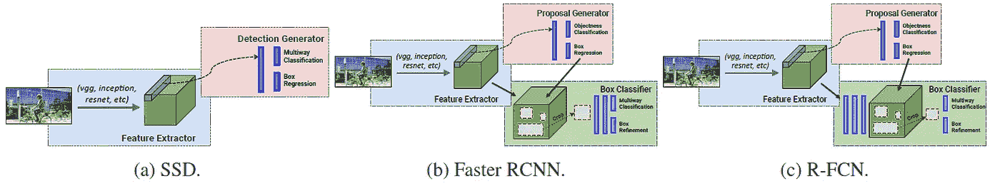

**Abstract Architecture**

[**SSD**](/review-ssd-single-shot-detector-object-detection-851a94607d11)

*   它使用**单个前馈卷积网络来直接预测类别和锚偏移，而不需要第二阶段的每建议分类操作**。

[**更快 R-CNN**](/review-faster-r-cnn-object-detection-f5685cb30202)

*   在被称为**区域提议网络(RPN)** 的**第一阶段**中，图像由特征提取器(例如 [VGG-16](https://medium.com/coinmonks/paper-review-of-vggnet-1st-runner-up-of-ilsvlc-2014-image-classification-d02355543a11) 处理，在一些选定的中间级别(例如“conv5”)的特征被用于**预测类别不可知的盒子提议**。
*   在**第二阶段**中，这些(通常为 300) **框提议被用于从相同的中间特征图(ROI 汇集)**中裁剪特征，这些特征随后被馈送到特征提取器的剩余部分(例如，“fc6”后面跟着“fc7”)，以便**为每个提议**预测类别和类别特定的框细化。

[**FCN**](/review-r-fcn-positive-sensitive-score-maps-object-detection-91cd2389345c)

*   与[更快的 R-CNN](/review-faster-r-cnn-object-detection-f5685cb30202) 类似的还有**第一级**中的 **RPN** 。
*   在第二阶段，使用**正敏感得分图**，以便在预测之前从最后一层特征中提取**裁剪(ROI 合并)。**这使得**每个投资回报的运营成本变得非常低**，因为几乎所有运营都是在投资回报池之前共享的。
*   因此，它通常以更快的运行时间实现了与更快的 R-CNN 相当的准确性。

# **2。特征提取器**

**尝试了六个特征提取器**:[VGG-16](https://medium.com/coinmonks/paper-review-of-vggnet-1st-runner-up-of-ilsvlc-2014-image-classification-d02355543a11)，[雷斯网-101](/review-resnet-winner-of-ilsvrc-2015-image-classification-localization-detection-e39402bfa5d8) ，[盗梦空间-v2](https://medium.com/@sh.tsang/review-batch-normalization-inception-v2-bn-inception-the-2nd-to-surpass-human-level-18e2d0f56651) ，[盗梦空间-v3](https://medium.com/@sh.tsang/review-inception-v3-1st-runner-up-image-classification-in-ilsvrc-2015-17915421f77c) ，[盗梦空间-雷斯网-v2](/review-inception-v4-evolved-from-googlenet-merged-with-resnet-idea-image-classification-5e8c339d18bc) 和 [MobileNetV1](/review-mobilenetv1-depthwise-separable-convolution-light-weight-model-a382df364b69) 。

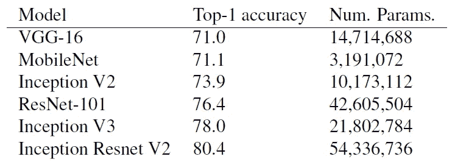

**Top-1 classification accuracy on ImageNet**

*   不同的特征提取器，不同的层用于提取用于对象检测的特征。
*   对一些特征提取器进行了一些修改，例如，使用了扩展的卷积，或者使最大池步幅变小，以便在特征提取之后步幅大小不会太小。

# 3.精度与时间

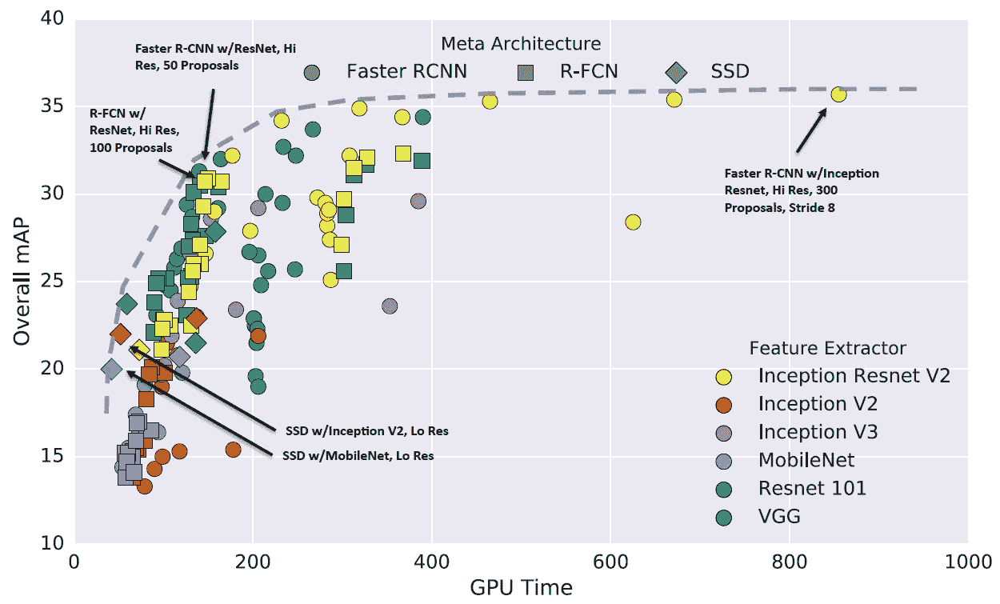

**Accuracy vs Time, The dotted Line is Optimality Frontier**

**Test-dev performance of the “critical” points along our optimality frontier**

*   颜色:特征提取器
*   标记形状:元架构

## 3.1.一般观察

*   [R-FCN](/review-r-fcn-positive-sensitive-score-maps-object-detection-91cd2389345c) 和 [SSD](/review-ssd-single-shot-detector-object-detection-851a94607d11) 平均速度更快。
*   更快的 R-CNN 速度较慢，但更准确，每张图像至少需要 100 毫秒。

## 3.2.最优边界上的临界点

**最快:**[**SSD**](/review-ssd-single-shot-detector-object-detection-851a94607d11)**w/**[**MobileNet**](/review-mobilenetv1-depthwise-separable-convolution-light-weight-model-a382df364b69)

*   [带](/review-ssd-single-shot-detector-object-detection-851a94607d11) [Inception-v2](https://medium.com/@sh.tsang/review-batch-normalization-inception-v2-bn-inception-the-2nd-to-surpass-human-level-18e2d0f56651) 和 [MobileNet](/review-mobilenetv1-depthwise-separable-convolution-light-weight-model-a382df364b69) 的固态硬盘是速度最快的型号中最精确的。
*   忽略后处理成本， [MobileNet](/review-mobilenetv1-depthwise-separable-convolution-light-weight-model-a382df364b69) 似乎比 [Inception-v2](https://medium.com/@sh.tsang/review-batch-normalization-inception-v2-bn-inception-the-2nd-to-surpass-human-level-18e2d0f56651) 快大约一倍，但准确性稍差。

**甜蜜点:**[**R-FCN**](/review-r-fcn-positive-sensitive-score-maps-object-detection-91cd2389345c)**w/**[**ResNet**](/review-resnet-winner-of-ilsvrc-2015-image-classification-localization-detection-e39402bfa5d8)**或** [**更快 R-CNN**](/review-faster-r-cnn-object-detection-f5685cb30202)**w/**[**ResNet**](/review-resnet-winner-of-ilsvrc-2015-image-classification-localization-detection-e39402bfa5d8)**并且只有 50 个提案**

*   使用 [ResNet](/review-resnet-winner-of-ilsvrc-2015-image-classification-localization-detection-e39402bfa5d8) 特征提取器的 [R-FCN](/review-r-fcn-positive-sensitive-score-maps-object-detection-91cd2389345c) 模型占据的最优性边界中间有一个“肘”。
*   这是各种型号配置中速度和精度之间的最佳平衡。

**最准确:** [**更快 R-CNN**](/review-faster-r-cnn-object-detection-f5685cb30202)**w/**[**Inception-ResNet**](/review-inception-v4-evolved-from-googlenet-merged-with-resnet-idea-image-classification-5e8c339d18bc)**at stride 8**

*   [具有密集输出的更快 R-CNN](/review-faster-r-cnn-object-detection-f5685cb30202)[Inception-ResNet-v2](/review-inception-v4-evolved-from-googlenet-merged-with-resnet-idea-image-classification-5e8c339d18bc)模型在我们的最优边界上获得了最佳的可能精度。
*   然而，这些模型很慢，需要将近一秒的处理时间。

# 4.特征提取器的作用

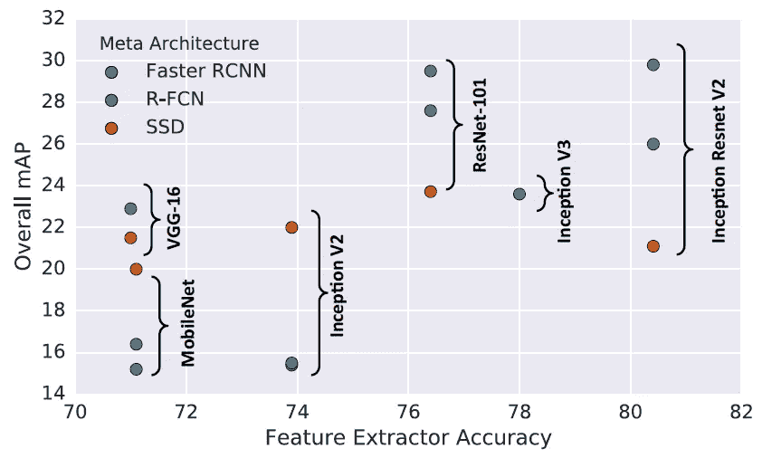

**Accuracy of detector (mAP on COCO) vs accuracy of feature extractor**

*   直觉上，更强的分类性能应该与更强的 COCO 检测性能正相关。
*   这种相关性似乎只对[更快的 R-CNN](/review-faster-r-cnn-object-detection-f5685cb30202) 和 [R-FCN](/review-r-fcn-positive-sensitive-score-maps-object-detection-91cd2389345c) 有意义，而 [SSD](/review-ssd-single-shot-detector-object-detection-851a94607d11) 的性能似乎不太依赖其特征提取器的分类精度。

# 5.物体大小的影响

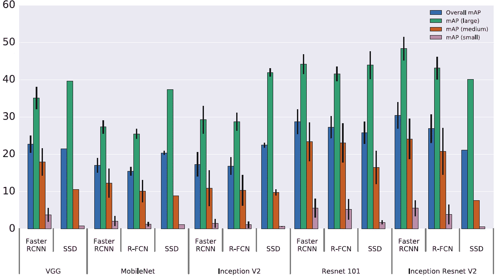

**Accuracy stratified by object size, meta-architecture and feature extractor, image resolution is fixed to 300**

*   所有的方法在大对象上都做得更好。
*   [固态硬盘](/review-ssd-single-shot-detector-object-detection-851a94607d11)通常在小对象上的性能(非常)差，但[固态硬盘](/review-ssd-single-shot-detector-object-detection-851a94607d11)在大对象上仍然与[更快的 R-CNN](/review-faster-r-cnn-object-detection-f5685cb30202) 和 [R-FCN](/review-r-fcn-positive-sensitive-score-maps-object-detection-91cd2389345c) 有竞争力。
*   后来，有 [DSSD](/review-dssd-deconvolutional-single-shot-detector-object-detection-d4821a2bbeb5) 来解决小物体检测问题。

# 6.图像大小的影响

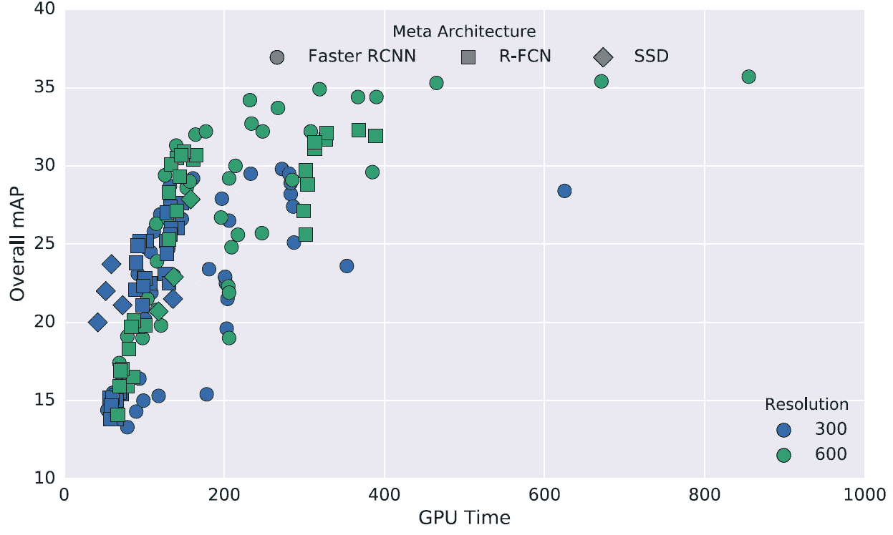

**Effect of image resolution**

*   将分辨率在两个维度上降低两倍会持续降低准确度(平均降低 15.88%)，但也会将推断时间平均降低 27.4%。
*   高分辨率输入允许分辨小物体。
*   高分辨率模型在小对象上产生明显更好的贴图结果(在许多情况下是 2 倍),在大对象上也产生稍微更好的贴图结果。

# 7.提案数量的影响

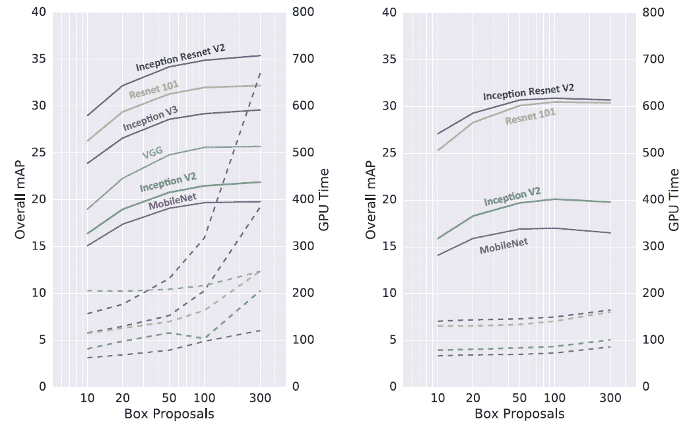

**Faster R-CNN (Left), R-FCN (Right)**

我们可以在 RPN(第一阶段)输出不同数量的建议。提案越少，运行时间越快，反之亦然。

## [更快的 R-CNN](/review-faster-r-cnn-object-detection-f5685cb30202)

*   [Inception-ResNet](/review-inception-v4-evolved-from-googlenet-merged-with-resnet-idea-image-classification-5e8c339d18bc) ，有 300 个提案有 35.4%的 mAP，在只有 10 个提案的情况下依然可以有惊人的高准确率(29%的 mAP)。
*   最佳点可能是 50 个建议，在这里，我们能够获得使用 300 个建议的 96%的准确性，同时将运行时间减少 3 倍。

## [R-FCN](/review-r-fcn-positive-sensitive-score-maps-object-detection-91cd2389345c)

*   在 [R-FCN](/review-r-fcn-positive-sensitive-score-maps-object-detection-91cd2389345c) 设置中使用更少的建议所节省的计算量很小。
*   这并不奇怪，因为如上所述，由于正敏感得分图的共享计算，对于 [R-FCN](/review-r-fcn-positive-sensitive-score-maps-object-detection-91cd2389345c) ，每个 ROI 的计算成本较低。

## 比较[更快的 R-CNN](/review-faster-r-cnn-object-detection-f5685cb30202) 和 [R-FCN](/review-r-fcn-positive-sensitive-score-maps-object-detection-91cd2389345c)

*   在 100 个建议时，具有 [ResNet](/review-resnet-winner-of-ilsvrc-2015-image-classification-localization-detection-e39402bfa5d8) 的[更快的 R-CNN](/review-faster-r-cnn-object-detection-f5685cb30202) 模型的速度和准确性变得与同等的 [R-FCN](/review-r-fcn-positive-sensitive-score-maps-object-detection-91cd2389345c) 模型大致相当，后者在地图和 GPU 速度上都使用了 300 个建议。

# 8.FLOPs 分析

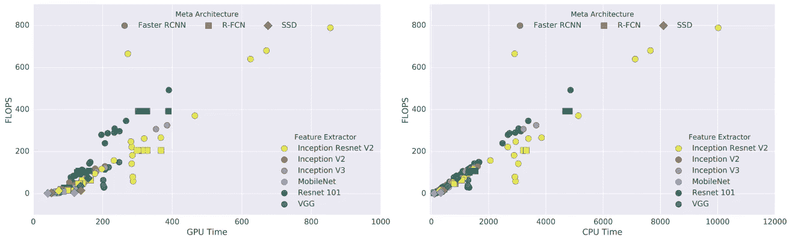

**FLOPs vs Time**

*   对于更密集的块模型，如 [ResNet-101](/review-resnet-winner-of-ilsvrc-2015-image-classification-localization-detection-e39402bfa5d8) ，FLOPs/GPU 时间通常大于 1。
*   对于 Inception 和 [MobileNet](/review-mobilenetv1-depthwise-separable-convolution-light-weight-model-a382df364b69) 型号，这个比率通常小于 1。
*   也许，因式分解减少了 FLOPs，但增加了更多的内存 I/O 开销，或者可能是当前的 GPU 指令(cuDNN)更适合密集卷积。

# 9.记忆分析

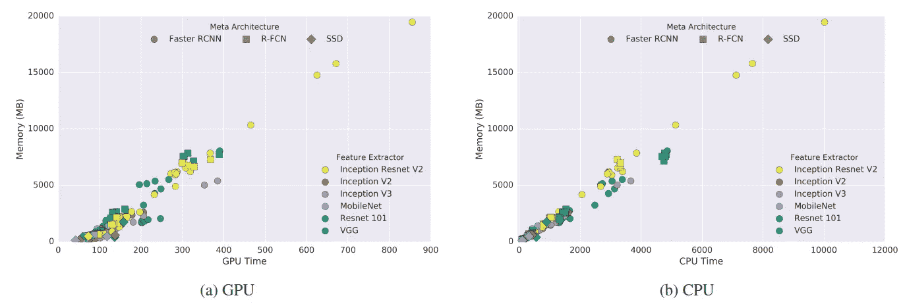

**Memory (Mb) vs Time**

*   与运行时间高度相关，更大更强大的特征提取器需要更多的内存。
*   与速度一样， [MobileNet](/review-mobilenetv1-depthwise-separable-convolution-light-weight-model-a382df364b69) 是最便宜的，在几乎所有设置中需要不到 1Gb(总)的内存。

# **10。75 IOU 的良好定位意味着所有 IOU 阈值的良好定位**

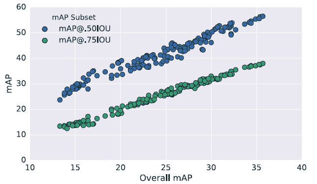

**Overall COCO mAP (@[.5:.95]) for all experiments plotted against corresponding mAP@.50IOU and mAP@.75IOU**

*   mAP@.5 和 mAP@.75 性能几乎与 mAP@[.5:.95]完全线性相关。
*   mAP@.75 与 mAP@[.5:.95]的相关性稍强(R > 0.99)，因此，如果我们要在单个 IOU 阈值下用 mAP 替换标准 COCO 指标，IOU = .75 可能会被选中。

# 11.可可上最先进的检测结果

## 11.1.集合和多作物

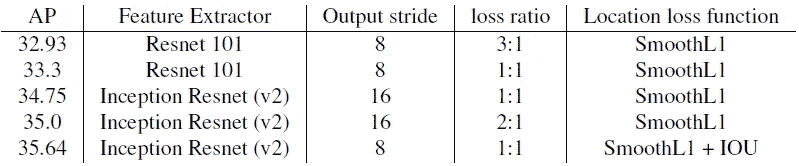

**Summary of 5 Faster R-CNN single models**

*   由于 mAP 是 COCO 检测挑战的主要目标，因此最准确但耗时的[更快的 R-CNN](/review-faster-r-cnn-object-detection-f5685cb30202) 被考虑。
*   不同的结果鼓励**集合**。

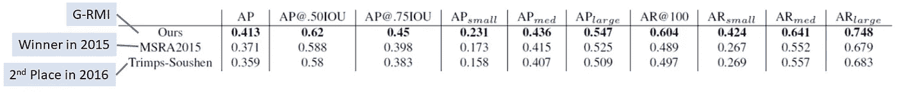

**Performance on the 2016 COCO test-challenge dataset.**

*   **G-RMI** :将上述 5 个模型集合，多作物生成最终模型。它超过了 2015 年的冠军和 2016 年的第二名。
*   2015 年的胜者使用 [ResNet](/review-resnet-winner-of-ilsvrc-2015-image-classification-localization-detection-e39402bfa5d8) + [更快的 R-CNN](/review-faster-r-cnn-object-detection-f5685cb30202) + [NoCs](https://medium.com/datadriveninvestor/review-noc-winner-in-2015-coco-ilsvrc-detection-object-detection-d5cc84e372a) 。(请看我对[NoCs](https://medium.com/datadriveninvestor/review-noc-winner-in-2015-coco-ilsvrc-detection-object-detection-d5cc84e372a)COCO 挑战赛结果的点评。)
*   Trimps-Soushen，2016 年第 2 名，使用[更快的 R-CNN](/review-faster-r-cnn-object-detection-f5685cb30202) + ensemble 多个模型+其他论文的改进。(COCO challenge 上没有关于 Trimps-Soushen 的细节。)
*   注意:这里没有多尺度训练、水平翻转、框细化、框投票或全局上下文。

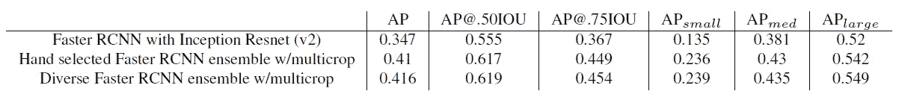

**Effects of ensembling and multicrop inference.**

*   **第二排** : 6 个更快的 RCNN 型号，带 3 个 [ResNet-101](/review-resnet-winner-of-ilsvrc-2015-image-classification-localization-detection-e39402bfa5d8) 和 3 个 [Inception-ResNet-v2](/review-inception-v4-evolved-from-googlenet-merged-with-resnet-idea-image-classification-5e8c339d18bc) 。
*   **第三行**:本节第一个表中的不同集合结果。
*   因此，多样性是令人鼓舞的，与使用人工选择的集合相比，这确实有很大帮助。
*   集成和多作物比单一模式提高了近 7 个百分点。

## 11.2.来自 5 种不同型号的检测

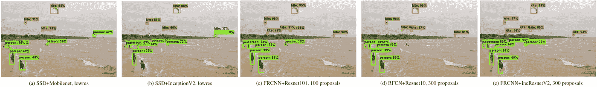

**Beach**

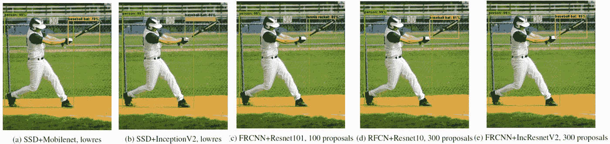

**Baseball**

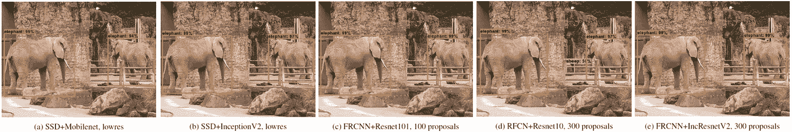

**Elephants**

## 参考

【2017 CVPR】【G-RMI】
[现代卷积物体探测器的速度/精度权衡](https://arxiv.org/abs/1611.10012)

## 我的相关评论

)(我)(们)(都)(不)(想)(到)(这)(些)(人)(,)(我)(们)(都)(不)(想)(要)(到)(这)(些)(人)(,)(但)(是)(这)(些)(人)(还)(不)(想)(到)(这)(些)(人)(,)(我)(们)(还)(没)(想)(到)(这)(些)(事)(,)(我)(们)(就)(想)(到)(了)(这)(些)(人)(们)(,)(我)(们)(们)(都)(不)(想)(要)(到)(这)(些)(人)(,)(但)(我)(们)(还)(没)(想)(到)(这)(些)(事)(,)(我)(们)(还)(没)(想)(到)(这)(里)(来)(。 )(我)(们)(都)(不)(知)(道)(,)(我)(们)(还)(是)(不)(知)(道)(,)(我)(们)(还)(是)(不)(知)(道)(,)(我)(们)(还)(是)(不)(知)(道)(,)(我)(们)(还)(是)(不)(知)(道)(,)(我)(们)(还)(是)(不)(知)(道)(,)(我)(们)(还)(是)(不)(知)(道)(,)(我)(们)(还)(是)(不)(知)(道)(。

**物体检测** [过食](https://medium.com/coinmonks/review-of-overfeat-winner-of-ilsvrc-2013-localization-task-object-detection-a6f8b9044754)[R-CNN](https://medium.com/coinmonks/review-r-cnn-object-detection-b476aba290d1)[快 R-CNN](https://medium.com/coinmonks/review-fast-r-cnn-object-detection-a82e172e87ba)[快 R-CNN](/review-faster-r-cnn-object-detection-f5685cb30202)[DeepID-Net](/review-deepid-net-def-pooling-layer-object-detection-f72486f1a0f6)】[R-FCN](/review-r-fcn-positive-sensitive-score-maps-object-detection-91cd2389345c)】[离子](/review-ion-inside-outside-net-2nd-runner-up-in-2015-coco-detection-object-detection-da19993f4766)[多路径网](/review-multipath-mpn-1st-runner-up-in-2015-coco-detection-segmentation-object-detection-ea9741e7c413)[NoC](https://medium.com/datadriveninvestor/review-noc-winner-in-2015-coco-ilsvrc-detection-object-detection-d5cc84e372a)

**语义切分
[[FCN](/review-fcn-semantic-segmentation-eb8c9b50d2d1)][[de convnet](/review-deconvnet-unpooling-layer-semantic-segmentation-55cf8a6e380e)][[deeplabv 1&deeplabv 2](/review-deeplabv1-deeplabv2-atrous-convolution-semantic-segmentation-b51c5fbde92d)][[parse net](https://medium.com/datadriveninvestor/review-parsenet-looking-wider-to-see-better-semantic-segmentation-aa6b6a380990)][[dilated net](/review-dilated-convolution-semantic-segmentation-9d5a5bd768f5)][[PSPNet](/review-pspnet-winner-in-ilsvrc-2016-semantic-segmentation-scene-parsing-e089e5df177d)]**

**实例分割** [ [深度掩码](/review-deepmask-instance-segmentation-30327a072339) ] [ [锐度掩码](/review-sharpmask-instance-segmentation-6509f7401a61) ] [ [多路径网](/review-multipath-mpn-1st-runner-up-in-2015-coco-detection-segmentation-object-detection-ea9741e7c413) ] [ [MNC](/review-mnc-multi-task-network-cascade-winner-in-2015-coco-segmentation-instance-segmentation-42a9334e6a34) ] [ [实例中心](/review-instancefcn-instance-sensitive-score-maps-instance-segmentation-dbfe67d4ee92) ]