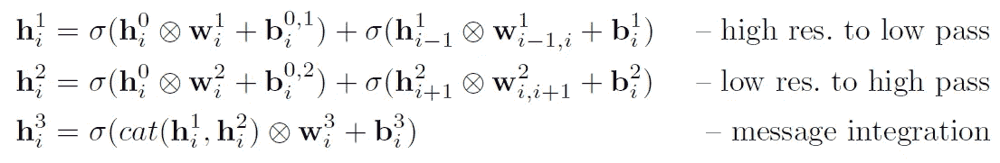
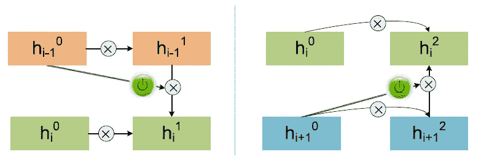
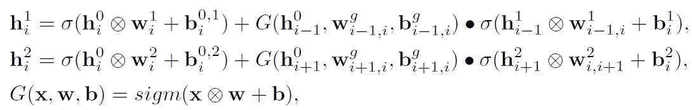

# 回顾:GBD-网络/ GBD-v1 和 GBD-v2——2016 年国际地球物理遥感中心(物体探测)获奖者

> 原文：<https://towardsdatascience.com/review-gbd-net-gbd-v1-gbd-v2-winner-of-ilsvrc-2016-object-detection-d625fbeadeac?source=collection_archive---------24----------------------->

## 门控双向网络，赢得 ILSVRC 2016 对象检测挑战赛

T 他的时代， **GBD 网(门控双向网络)**，由**香港中文大学(CUHK)** 和 **SenseTime** 点评。GBD-Net 赢得了 ILSVRC 2016 目标检测挑战赛，在 **2016 ECCV** 中首次提出，引用超过 **30 次**。然后延伸发表在 **2018 TPAMI** ，引用 **50 余次**。( [Sik-Ho Tsang](https://medium.com/u/aff72a0c1243?source=post_page-----d625fbeadeac--------------------------------) @中)

在这个故事中，主要是扩展， **2018 TPAMI** ，因为它被描述得更加详细。

# 概述

1.  **问题**
2.  **GBD-v1**
3.  **GBD-v2**
4.  **其他技术**
5.  **消融研究**
6.  **与最先进方法的比较**

# 1.问题

**Potential Problems When We Classify the Object in a Candidate Box (Red) with Ground-Truth (Blue)**

*   **(a)** :候选框可以是兔子，也可以是仓鼠。
*   **(b)** : b2 可能因 IoU 较小而被视为误报。
*   **(c)和(d)** :兔头不一定是兔子，可以是人。
*   因此，没有来自候选框的较大周围区域的信息，很难区分类别标签。
*   首先，候选框周围的上下文区域是一种自然的帮助。
*   此外，周围区域还提供关于背景和其他附近物体的上下文信息，以帮助检测。
*   **来自周围区域的信息用于改进候选框的分类。**

# 2.GBD-v1

## 2.1.总体框架

**GBD-v1 Overall Framework**

*   以上是 GBD-v1 的框架。
*   [使用快速 R-CNN](https://medium.com/coinmonks/review-fast-r-cnn-object-detection-a82e172e87ba) 管道。
*   首先，诸如选择性搜索(SS)的区域提议方法将生成一组区域提议/候选框。
*   在 ROI 合并之后，对于每个候选框，它都要经过建议的 GBD-v1。
*   最终的特征图用于分类和包围盒回归，如在[快速 R-CNN](https://medium.com/coinmonks/review-fast-r-cnn-object-detection-a82e172e87ba) 中使用的。

## 2.2.毅力

[**Inception-v2**](https://medium.com/@sh.tsang/review-batch-normalization-inception-v2-bn-inception-the-2nd-to-surpass-human-level-18e2d0f56651) **as Backbone**

*   [BN-Inception/Inception-v2](https://medium.com/@sh.tsang/review-batch-normalization-inception-v2-bn-inception-the-2nd-to-surpass-human-level-18e2d0f56651)用作特征提取的主干。

[**ResNet-269**](/review-resnet-winner-of-ilsvrc-2015-image-classification-localization-detection-e39402bfa5d8) **as Backbone**

*   后来， [ResNet-269](/review-resnet-winner-of-ilsvrc-2015-image-classification-localization-detection-e39402bfa5d8) 也被用作主干。更好的骨干，更好的准确性。

## 2.3.**不同分辨率和支持区域的投资回报池**

**ROI Pooling with Different Resolutions and Support Regions**

*   使用候选框(红色)，不同的分辨率和支持区域基于该框汇集在一起。
*   用 p = {-0.2，0.2，0.8，1.7}生成不同的区域。

## 2.4.使用门控双向结构的消息传递

**Naive Network Without Message Passing**

*   最简单的方法是使用不同的支持区域遍历网络进行分类，如上所示。
*   但实际上，它们也应该是相互关联的，因为它们观察的是同一个物体。有些东西可以互相帮助。

**Network With Message Passing**

*   因此，这里提出了双向网络。
*   一个方向是从小尺寸区域连接到大尺寸区域。
*   另一种是从大尺寸区域连接到小尺寸区域。
*   因此，来自不同地区的上下文可以使用双向结构相互帮助。
*   ⨂是卷积，σ是 ReLU(不是 Sigmoid)，cat()是串联。
*   然而，有时一个上下文区域可能对另一个上下文区域没有帮助，就像第一张图中有兔子头的人一样。

**Network With Message Passing Using Gate Function**

*   在消息传递之前引入 Gate 函数。
*   因此，引入了上下文相关的门函数。开关将根据环境打开或关闭。
*   门过滤器的尺寸是 3×3，而不是 1×1。
*   Sigm 是 sigmoid 函数，是元素级乘积，G 是基于 sigmoid 的门函数。
*   当 G = 0 时，消息不被传递。

# 3.GBD-v2

## 3.1.GBD 的增强版

**GBD-v2**

*   GBD 网络得到加强。
*   最大池用于合并来自 *h i* 和 *h i* 的信息。与 GBD-v1 相比，这可以节省内存和计算量。
*   另外，从 *h⁰i* 到 *h i* 还增加了一个身份映射层。常数 *β* 在相加前相乘。

# **4。其他技术**

## 4.1.候选框生成

*   CRAFT[的改进版本](/review-craft-cascade-region-proposal-network-and-fast-r-cnn-object-detection-2ce987361858)用于生成候选框。
*   有 3 个版本。
*   **Craft-v1**:[Craft](/review-craft-cascade-region-proposal-network-and-fast-r-cnn-object-detection-2ce987361858)从 1000 级 ImageNet 预训。
*   **Craft-v2**:[Craft](/review-craft-cascade-region-proposal-network-and-fast-r-cnn-object-detection-2ce987361858)用于 GBD-v1，2016 ECCV 论文，但预训练自[更快 R-CNN](/review-faster-r-cnn-object-detection-f5685cb30202) 使用的地区提案网(RPN)。
*   **Craft-v3**:GBD-v2 使用的改进型 [CRAFT](/review-craft-cascade-region-proposal-network-and-fast-r-cnn-object-detection-2ce987361858) ，训练时使用随机裁剪的 2018 TPAMI 论文，测试时使用多尺度金字塔。同样，阳性和阴性样本在 RPN 训练中是 1:1。使用 LocNet 添加了另一组建议。

## 4.2.其他人

*   **多尺度测试**:利用训练好的模型，在图像金字塔上计算特征图，图像的短边为{400，500，600，700，800}，长边不大于 1000。
*   **左右翻转**:训练和测试都采用。
*   **包围盒投票**:使用 [MR-CNN & S-CNN](/review-mr-cnn-s-cnn-multi-region-semantic-aware-cnns-object-detection-3bd4e5648fde) 中的包围盒投票。
*   **非最大抑制(NMS)阈值**:对于 ImageNet，NMS 阈值默认设置为 0.3。根据经验发现，0.4 是较好的阈值。
*   **全局上下文**:从预训练的网络来看，ImageNet 检测数据也是作为图像分类问题来处理的。这意味着 ROI 区域是整个图像。然后，这个 200 级图像分类分数被用于通过加权平均与 200 级对象检测分数相结合。
*   **模型组合** : 6 个模型用于组合。

# 5.消融研究

## 5.1.多种分辨率的效果

**The Effect of Multiple Resolutions Using** [**Inception-v2**](https://medium.com/@sh.tsang/review-batch-normalization-inception-v2-bn-inception-the-2nd-to-surpass-human-level-18e2d0f56651) **as Backbone**

*   使用四种分辨率获得 48.9%的最高 mAP。

## 5.2.[工艺](/review-craft-cascade-region-proposal-network-and-fast-r-cnn-object-detection-2ce987361858)版本

**Recall Rate on ImageNet val2**

*   对 Craft-v2 的修改，即 Craft-v3，提高了召回率，如上图所示。

## 5.3.**不同的比例因子*β***

**Different Scaling Factor β in Controlling the Magnitude of Message on ImageNet val2 Using** [**Inception-v2**](https://medium.com/@sh.tsang/review-batch-normalization-inception-v2-bn-inception-the-2nd-to-surpass-human-level-18e2d0f56651) **as Backbone**

*   还测试了控制消息大小的不同比例因子 *β* 。 *β* = 0.1 有 53.6%的最佳贴图。

## 5.4.不同的深度模型作为主干

**Different Deep Models as Backbone (“+I” =** [**Pre-Activation ResNet**](/resnet-with-identity-mapping-over-1000-layers-reached-image-classification-bb50a42af03e) **with Identity Mapping, “+S” =** [**Stochastic Depth**](/review-stochastic-depth-image-classification-a4e225807f4a) **(SD))**

*   [Inception-v2](https://medium.com/@sh.tsang/review-batch-normalization-inception-v2-bn-inception-the-2nd-to-surpass-human-level-18e2d0f56651) 、 [ResNet](/review-resnet-winner-of-ilsvrc-2015-image-classification-localization-detection-e39402bfa5d8) 、[预激活 ResNet](/resnet-with-identity-mapping-over-1000-layers-reached-image-classification-bb50a42af03e) (+I)、[随机深度](/review-stochastic-depth-image-classification-a4e225807f4a) (+S)、 [Inception-v3](https://medium.com/@sh.tsang/review-inception-v3-1st-runner-up-image-classification-in-ilsvrc-2015-17915421f77c) (根据参考应该不是 v5)、 [PolyNet](/review-polynet-2nd-runner-up-in-ilsvrc-2016-image-classification-8a1a941ce9ea) 也尝试过。
*   更好的脊梁，更好的地图。

## 5.5.用于组装的 6 个深度模型

**6 Deep Models for Ensembling**

*   然而，不同的主干在不同的对象类别上具有不同的准确性。组装时，他们可以互相帮助。
*   最后选择以上 6 个模型，可以得到 66.9%的 mAP。

## 5.6.包括其他技术

**Including Other Techniques**

*   详情如上。通过以上技术，mAP 从 56.6%提高到 68%。
*   而 GBD 技术只能帮助将 mAP 从 56.6%提高到 58.8%，这实际上贡献了改进的一部分。

# **6。与最先进方法的比较**

## 6.1.ImageNet val2 上的对象检测

**Object Detection on ImageNet val2, sgl: Single Model, avg: Averaged Model (Ensembling)**

*   GBD-v2 在所有技术方面都超过了美国有线电视新闻网(R-CNN)、[谷歌网(Google Net)](https://medium.com/coinmonks/paper-review-of-googlenet-inception-v1-winner-of-ilsvlc-2014-image-classification-c2b3565a64e7)、 [DeepID-Net](/review-deepid-net-def-pooling-layer-object-detection-f72486f1a0f6) 和 [ResNet](/review-resnet-winner-of-ilsvrc-2015-image-classification-localization-detection-e39402bfa5d8) 。

## 6.2.不使用外部数据进行训练的 ImageNet 测试集上的对象检测

**Object Detection on ImageNet Test Set**

*   GBD-v2 优于许多最先进的方法，包括[谷歌网](https://medium.com/coinmonks/paper-review-of-googlenet-inception-v1-winner-of-ilsvlc-2014-image-classification-c2b3565a64e7)、[雷斯网](/review-resnet-winner-of-ilsvrc-2015-image-classification-localization-detection-e39402bfa5d8)、 [Trimps-Soushen](/review-trimps-soushen-winner-in-ilsvrc-2016-image-classification-dfbc423111dd) 和海康威视(2016 年亚军)。(也许以后有时间我会回顾一下海康威视。)

## 6.3.COCO 上的对象检测

**Object Detection on MS COCO**

*   同样，GBD-v2 优于最先进的方法，如[更快的 R-CNN](/review-faster-r-cnn-object-detection-f5685cb30202) 、 [ION](/review-ion-inside-outside-net-2nd-runner-up-in-2015-coco-detection-object-detection-da19993f4766) 和 [SSD](/review-ssd-single-shot-detector-object-detection-851a94607d11) 。

为了提高性能，除了深度神经网络管道上的新颖想法或更好的主干，其他技术也很重要，如 5.6 节中所述，如本文中的区域提议方法、数据扩充、多尺度训练、多尺度测试、包围盒投票、全局上下文和模型集成。

## 参考

【2016 ECCV】【GBD 网/GBD v1】
[门控双向 CNN 进行物体检测](https://www.semanticscholar.org/paper/Gated-Bi-directional-CNN-for-Object-Detection-Zeng-Ouyang/931282732f0be57f7fb895238e94bdda00a52cad)

【2018 TPAMI】【GBD-网/GBD-v1 & GBD-v2】
[制作用于物体检测的 GBD-网](https://arxiv.org/abs/1610.02579)

## 我以前的评论

)(我)(们)(都)(不)(想)(到)(这)(些)(人)(,)(我)(们)(都)(不)(想)(要)(到)(这)(些)(人)(,)(但)(是)(这)(些)(人)(还)(不)(想)(到)(这)(些)(人)(,)(我)(们)(还)(没)(想)(到)(这)(些)(事)(,)(我)(们)(就)(想)(到)(了)(这)(些)(人)(们)(,)(我)(们)(们)(都)(不)(想)(要)(到)(这)(些)(人)(,)(但)(我)(们)(还)(没)(想)(到)(这)(些)(事)(,)(我)(们)(还)(没)(想)(想)(到)(这)(些)(事)(,)(我)(们)(还)(没)(想)(到)(这)(里)(去)(。 )(他)(们)(都)(不)(在)(这)(些)(事)(上)(,)(她)(们)(还)(不)(在)(这)(些)(事)(上)(有)(什)(么)(情)(况)(呢)(?)(她)(们)(都)(不)(在)(这)(些)(情)(况)(下)(,)(她)(们)(还)(不)(在)(这)(些)(事)(上)(有)(什)(么)(情)(况)(吗)(?)(她)(们)(们)(都)(不)(在)(这)(些)(事)(上)(,)(她)(们)(们)(还)(不)(在)(这)(些)(事)(上)(,)(她)(们)(们)(还)(没)(有)(什)(么)(好)(的)(情)(情)(感)(。

**物体检测** [过食](https://medium.com/coinmonks/review-of-overfeat-winner-of-ilsvrc-2013-localization-task-object-detection-a6f8b9044754)[R-CNN](https://medium.com/coinmonks/review-r-cnn-object-detection-b476aba290d1)[快 R-CNN](https://medium.com/coinmonks/review-fast-r-cnn-object-detection-a82e172e87ba)[快 R-CNN](/review-faster-r-cnn-object-detection-f5685cb30202)[MR-CNN&S-CNN](/review-mr-cnn-s-cnn-multi-region-semantic-aware-cnns-object-detection-3bd4e5648fde)[DeepID-Net](/review-deepid-net-def-pooling-layer-object-detection-f72486f1a0f6)[CRAFT](/review-craft-cascade-region-proposal-network-and-fast-r-cnn-object-detection-2ce987361858)[R-FCN](/review-r-fcn-positive-sensitive-score-maps-object-detection-91cd2389345c)】 [ [DSSD](/review-dssd-deconvolutional-single-shot-detector-object-detection-d4821a2bbeb5) ] [ [约洛夫 1](/yolov1-you-only-look-once-object-detection-e1f3ffec8a89) ] [ [约洛夫 2 /约洛 9000](/review-yolov2-yolo9000-you-only-look-once-object-detection-7883d2b02a65) ] [ [约洛夫 3](/review-yolov3-you-only-look-once-object-detection-eab75d7a1ba6) ] [ [FPN](/review-fpn-feature-pyramid-network-object-detection-262fc7482610) ] [ [视网膜网](/review-retinanet-focal-loss-object-detection-38fba6afabe4) ] [ [DCN](/review-dcn-deformable-convolutional-networks-2nd-runner-up-in-2017-coco-detection-object-14e488efce44) ]

**语义切分** [FCN](/review-fcn-semantic-segmentation-eb8c9b50d2d1)[de convnet](/review-deconvnet-unpooling-layer-semantic-segmentation-55cf8a6e380e)[deeplab v1&deeplab v2](/review-deeplabv1-deeplabv2-atrous-convolution-semantic-segmentation-b51c5fbde92d)[CRF-RNN](/review-crf-rnn-conditional-random-fields-as-recurrent-neural-networks-semantic-segmentation-a11eb6e40c8c)】[SegNet](/review-segnet-semantic-segmentation-e66f2e30fb96)】[parse net](https://medium.com/datadriveninvestor/review-parsenet-looking-wider-to-see-better-semantic-segmentation-aa6b6a380990)[dilated net](/review-dilated-convolution-semantic-segmentation-9d5a5bd768f5)[PSPNet](/review-pspnet-winner-in-ilsvrc-2016-semantic-segmentation-scene-parsing-e089e5df177d)[deeplab v3](/review-deeplabv3-atrous-convolution-semantic-segmentation-6d818bfd1d74)

**生物医学图像分割** [[cumed vision 1](https://medium.com/datadriveninvestor/review-cumedvision1-fully-convolutional-network-biomedical-image-segmentation-5434280d6e6)][[cumed vision 2/DCAN](https://medium.com/datadriveninvestor/review-cumedvision2-dcan-winner-of-2015-miccai-gland-segmentation-challenge-contest-biomedical-878b5a443560)][[U-Net](/review-u-net-biomedical-image-segmentation-d02bf06ca760)][[CFS-FCN](https://medium.com/datadriveninvestor/review-cfs-fcn-biomedical-image-segmentation-ae4c9c75bea6)][[U-Net+ResNet](https://medium.com/datadriveninvestor/review-u-net-resnet-the-importance-of-long-short-skip-connections-biomedical-image-ccbf8061ff43)][[多通道](/review-multichannel-segment-colon-histology-images-biomedical-image-segmentation-d7e57902fbfc)[[V-Net](/review-v-net-volumetric-convolution-biomedical-image-segmentation-aa15dbaea974)][[3D U-Net](/review-3d-u-net-volumetric-segmentation-medical-image-segmentation-8b592560fac1)]

**实例分割** [[SDS](https://medium.com/datadriveninvestor/review-sds-simultaneous-detection-and-segmentation-instance-segmentation-80b2a8ce842b)[[超列](/review-hypercolumn-instance-segmentation-367180495979) ] [ [深度掩码](/review-deepmask-instance-segmentation-30327a072339) ] [ [锐度掩码](/review-sharpmask-instance-segmentation-6509f7401a61) ] [ [多路径网络](/review-multipath-mpn-1st-runner-up-in-2015-coco-detection-segmentation-object-detection-ea9741e7c413)][[MNC](/review-mnc-multi-task-network-cascade-winner-in-2015-coco-segmentation-instance-segmentation-42a9334e6a34)][[Instance fcn](/review-instancefcn-instance-sensitive-score-maps-instance-segmentation-dbfe67d4ee92)][[FCIS](/review-fcis-winner-in-2016-coco-segmentation-instance-segmentation-ee2d61f465e2)

**超分辨率** [[Sr CNN](https://medium.com/coinmonks/review-srcnn-super-resolution-3cb3a4f67a7c)][[fsr CNN](/review-fsrcnn-super-resolution-80ca2ee14da4)][[VDSR](/review-vdsr-super-resolution-f8050d49362f)][[ESPCN](https://medium.com/datadriveninvestor/review-espcn-real-time-sr-super-resolution-8dceca249350)][[红网](https://medium.com/datadriveninvestor/review-red-net-residual-encoder-decoder-network-denoising-super-resolution-cb6364ae161e)][[DRCN](https://medium.com/datadriveninvestor/review-drcn-deeply-recursive-convolutional-network-super-resolution-f0a380f79b20)][[DRRN](/review-drrn-deep-recursive-residual-network-super-resolution-dca4a35ce994)][[LapSRN&MS-LapSRN](/review-lapsrn-ms-lapsrn-laplacian-pyramid-super-resolution-network-super-resolution-c5fe2b65f5e8)][[srdensenenet](/review-srdensenet-densenet-for-sr-super-resolution-cbee599de7e8)

**人体姿态估计**
[深度姿态](/review-deeppose-cascade-of-cnn-human-pose-estimation-cf3170103e36)[汤普逊·尼普斯 14](/review-tompson-nips14-joint-training-of-cnn-and-graphical-model-human-pose-estimation-95016bc510c)