# 回顾:GCN——全球卷积网络，大核问题(语义分割)

> 原文：<https://towardsdatascience.com/review-gcn-global-convolutional-network-large-kernel-matters-semantic-segmentation-c830073492d2?source=collection_archive---------16----------------------->

## 胜过 [FCN-8s](/review-fcn-semantic-segmentation-eb8c9b50d2d1) 、 [CRF-RNN](/review-crf-rnn-conditional-random-fields-as-recurrent-neural-networks-semantic-segmentation-a11eb6e40c8c) 、[扩容网](/review-dilated-convolution-semantic-segmentation-9d5a5bd768f5)和 [DeepLabv1 & DeepLabv2](/review-deeplabv1-deeplabv2-atrous-convolution-semantic-segmentation-b51c5fbde92d)

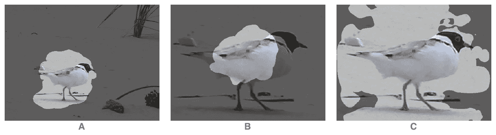

**Large Kernel Matters**

在这篇论文中，对**全球卷积网络(GCN)** ，由**清华大学**和**旷视科技公司(Face++)** 所做的综述。在诸如 VGGNet 的惯例中，使用小的 3×3 核的堆叠，以便获得大的有效感受野。然而，我们发现**大内核也扮演着重要的角色。**以上图为例，在 A 中，感受野大到足以覆盖该鸟进行分割。但是如果像 B 中那样放大图像，感受野就不够大。在 C 中，使用建议的 GCN，感受野可以扩大。最后:

*   **GCN** 被提出来解决语义分割的分类和定位问题。
*   **边界细化(BR)** 也被提出来进一步细化对象边界。

并且发表在 **2017 CVPR** 上 **100 多篇引用**。( [Sik-Ho Tsang](https://medium.com/u/aff72a0c1243?source=post_page-----c830073492d2--------------------------------) @中)

# 概述

1.  **分类与定位的矛盾**
2.  **全球卷积网络(GCN) &边界细化(BR)**
3.  **消融研究**
4.  **与最先进方法的比较**

# 1.分类与本土化的矛盾

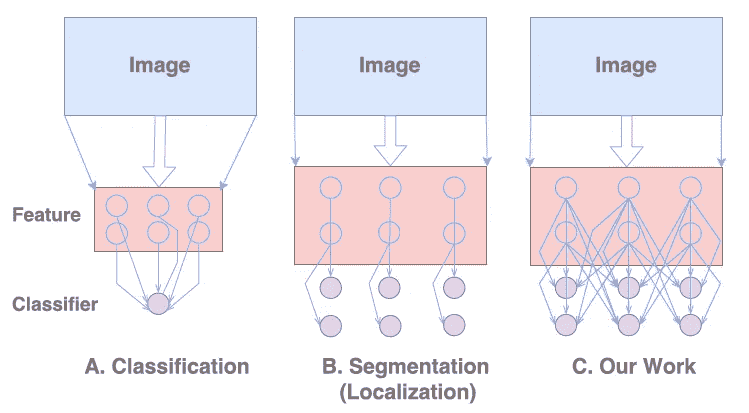

**Classification (Left), Segmentation/Localization (Middle), GCN (Right)**

*   对于**分类**任务，要求模型对于各种变换**不变，如平移和旋转**。
*   但是对于**定位**任务，模型应该是**变换敏感的**，**，即精确定位每个语义类别的每个像素**。

## 全球卷积网络(GCN)

*   同时应对上述两项挑战。作者遵循两个设计原则:
*   **1)从本地化视图**来看，模型结构应该是**全卷积**以保持本地化性能，并且**不应该使用全连接或全局池层**，因为这些层将丢弃本地化信息；
*   **2)从分类的角度来看**，**在网络架构中应该采用大的核尺寸**，以**实现特征图和逐像素分类器**之间的密集连接，这**增强了处理不同变换的能力。**

# **2。全球卷积网络(GCN) &边界细化(BR)**

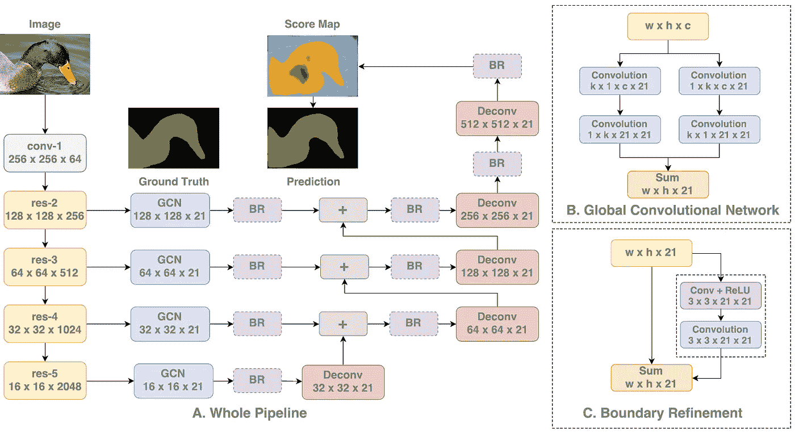

**Overall Architecture (GCN), GCN Module (Top Right), and BR module (Bottom Right)**

*   如上图， [ResNet](/review-resnet-winner-of-ilsvrc-2015-image-classification-localization-detection-e39402bfa5d8) 作为主干。特别是，在最先进的比较过程中，使用 ImageNet 上预训练的 [ResNet-152](/review-resnet-winner-of-ilsvrc-2015-image-classification-localization-detection-e39402bfa5d8) 。
*   如上图所示，插入 GCN 模块，然后插入 BR 模块。
*   使用去卷积层对较低分辨率的得分图进行上采样，然后与较高分辨率的得分图相加，以生成新的得分图。

## 2.1.全球卷积网络(GCN)模块

*   如图右上方所示，**GCN 模块没有直接使用更大的核或全局卷积，而是使用了 1×k+k×1 和 k×1+1×k 卷积**的组合，使得**能够在特征图**中的一个大 k×k 区域内进行密集连接。
*   不同于 [Inception-v3](https://medium.com/@sh.tsang/review-inception-v3-1st-runner-up-image-classification-in-ilsvrc-2015-17915421f77c) 使用的非对称核，卷积层后**没有非线性。**
*   与琐碎的 k×k 卷积相比，GCN 结构仅涉及 O(2/k)计算成本和参数数量**，这对于大核尺寸更实用。**

## 2.2.边界细化(BR)模块

*   如图右下方所示，边界对齐建模为**残差结构**，其中**ŝ=s+r(s)**，s 为粗分图，r()为残差分支。
*   它可以作为**作者**定制的附加残差块，在 GCN 之后使用，在反褶积过程中使用。

# 3.**消融研究**

*   PASCAL VOC 2012 有 1464 幅图像用于训练，1449 幅图像用于验证，1456 幅图像用于测试，属于 20 个对象类和一个背景类。
*   语义边界数据集也被用作辅助数据集，产生 10，582 幅图像用于训练。
*   PASCAL VOC 2012 验证集用于评估。

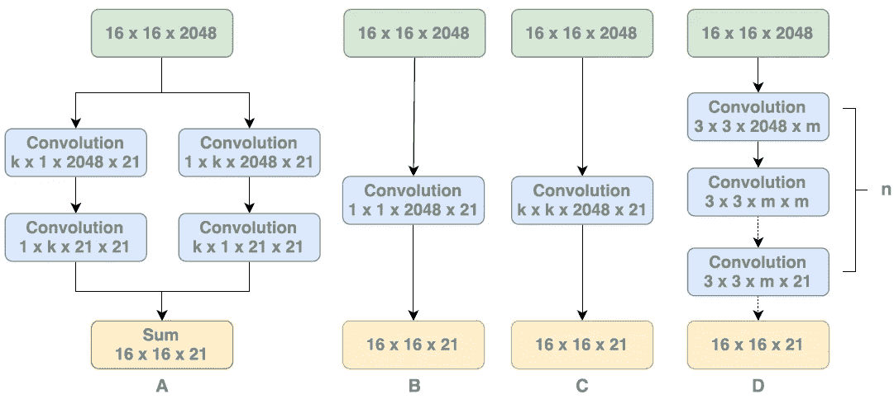

**GCN (Leftmost), 1×1 Conv (2nd Left), Trivial k×k Conv (2nd Right), Stacks of 3×3 Conv (Rightmost)**

## 3.1.大内核问题

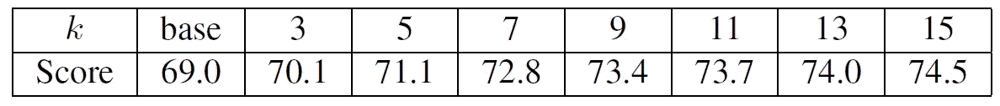

**Different k values for GCN on PASCAL VOC 2012 validation set**

*   基线:使用简单的 1×1 Conv 的简单基线。
*   用 *k* = 15，大致等于 16×16 的特征图大小。
*   性能随着内核大小 *k* 不断增加。
*   特别是 GCN ( *k* = 15)以 5.5%的显著优势超过了最小的一个。

## 3.2.参数多了有帮助吗？

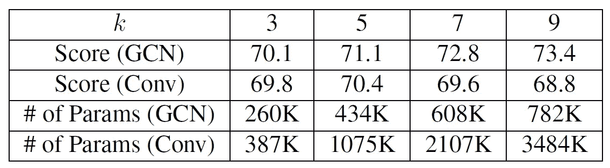

**GCN vs Trivial k×k Conv on PASCAL VOC 2012 validation set**

*   对于**琐碎的 *k* × *k* Conv** ，如果 k≤5，更大的内核会带来更好的性能，而对于 k≥7，性能会下降。
*   一个假设是**太多的参数使训练遭受过度拟合**，这削弱了较大内核的好处。
*   作者发现，寻找琐碎的大核实际上使网络**难以收敛**。
*   而拟议中的 GCN 没有这个问题。

## 3.3.GCN vs 一堆 3×3 的小回旋

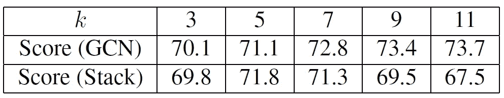

**GCN vs Stacks of Small 3×3 Convolutions on PASCAL VOC 2012 validation set**

*   在这里，对于小的 3×3 卷积的堆叠，非线性被去除，以便与 GCN 进行公平的比较。
*   同样，**小的 3×3 卷积**的堆叠带来比 GCN 更多的参数，并且当感受野增加时导致**过拟合**。

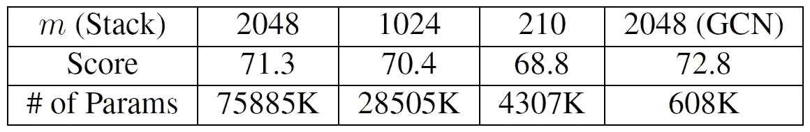

**Different Number of Feature Maps (m) on PASCAL VOC 2012 validation set**

*   还测试了不同数量的特征图( *m* )，以便减少小的 3×3 卷积的堆叠的参数数量。
*   然而，它的性能随着参数的减少而下降。

## 3.4.GCN 和 BR 如何对分割结果做出贡献？

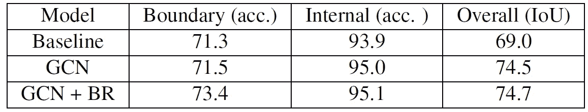

**GCN & BR on PASCAL VOC 2012 validation set**

*   位于大物体中心的像素可能从 GCN 中受益更多，因为它非常接近“纯”分类问题。
*   至于物体的**边界像素，其性能**主要受定位能力**的影响。**
*   为了验证上述推论，分割得分图被分成两部分: **a)边界区域**，其**像素位于靠近物体边界(距离≤7)** ，以及 **b)内部区域作为其他像素**。
*   如上所示， **BR 主要提高边界区域的精度，而 GCN 有助于提高内部区域的精度**。

## 3.5.GCN vs [雷斯内特](/review-resnet-winner-of-ilsvrc-2015-image-classification-localization-detection-e39402bfa5d8)

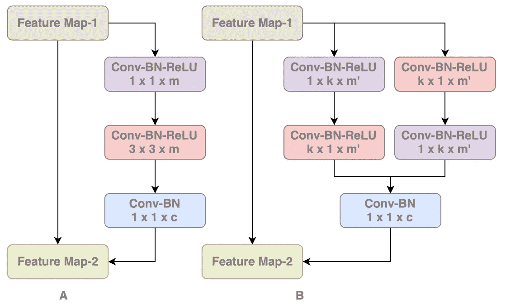

**Original** [**ResNet**](/review-resnet-winner-of-ilsvrc-2015-image-classification-localization-detection-e39402bfa5d8) **Bottleneck Module (Left), and ResNet-GCN Module (Right)**

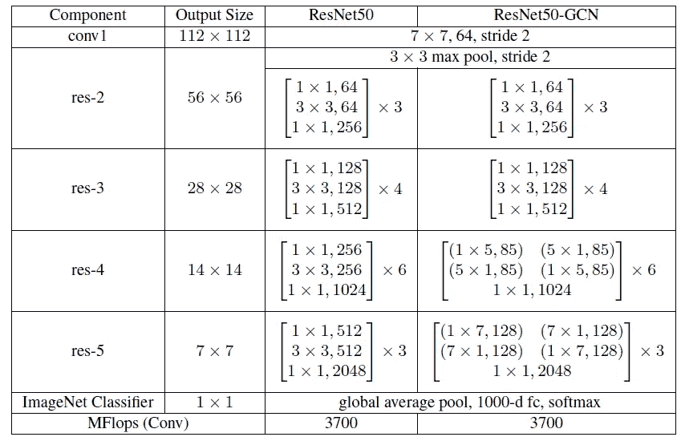

**Detailed Architecture of** [**ResNet50**](/review-resnet-winner-of-ilsvrc-2015-image-classification-localization-detection-e39402bfa5d8) **and ResNet50-GCN**

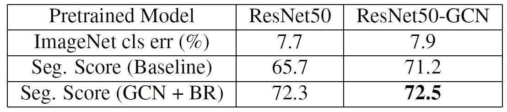

**Original** [**ResNet**](/review-resnet-winner-of-ilsvrc-2015-image-classification-localization-detection-e39402bfa5d8) **vs ResNet-GCN on PASCAL VOC 2012 validation set**

*   我们可能会想，在主干上，为什么不用 GCN 块(右)代替原来的 [ResNet](/review-resnet-winner-of-ilsvrc-2015-image-classification-localization-detection-e39402bfa5d8) 块(左)来提高精度呢？作者使用 [ResNet-50](/review-resnet-winner-of-ilsvrc-2015-image-classification-localization-detection-e39402bfa5d8) 研究了上述两种结构。
*   作为 ImageNet 分类模型，总部位于 GCN 的 ResNet 比最初的 [ResNet](/review-resnet-winner-of-ilsvrc-2015-image-classification-localization-detection-e39402bfa5d8) 稍逊一筹。
*   对于 GCN 和 BR，增益仍然很小。

# **4。与最先进方法的比较**

## 4.1.帕斯卡 VOC 2012

*   使用 COCO 女士预训练模型。
*   培训阶段分为三个阶段:
*   (1)在阶段-1 中，使用来自 SBD COCO 和标准 PASCAL VOC 2012 的所有图像，产生用于训练的 109，892 个图像。
*   (2)在第二阶段，仅使用 SBD 和标准帕斯卡 VOC 2012 图像，与上一节相同。
*   (3)对于阶段 3，仅使用标准 PASCAL VOC 2012 数据集。

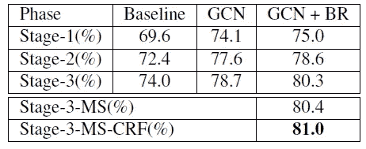

**PASCAL VOC 2012 validation set**

*   在阶段 3，利用 GCN+溴，获得 80.3%的平均 IoU。
*   利用多尺度(MS)和条件随机场(CRF)，获得了 81.0%的平均 IoU。

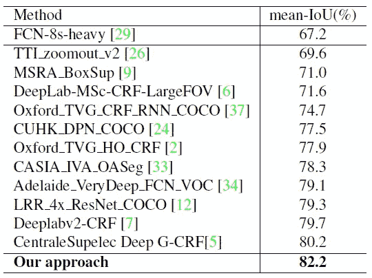

**PASCAL VOC 2012 test set**

*   最后，在测试集上获得了 82.2%的平均 IoU，优于[CRF-RNN](/review-crf-rnn-conditional-random-fields-as-recurrent-neural-networks-semantic-segmentation-a11eb6e40c8c)【37】，以及[deeplabv 1&deeplabv 2](/review-deeplabv1-deeplabv2-atrous-convolution-semantic-segmentation-b51c5fbde92d)【6，7】。

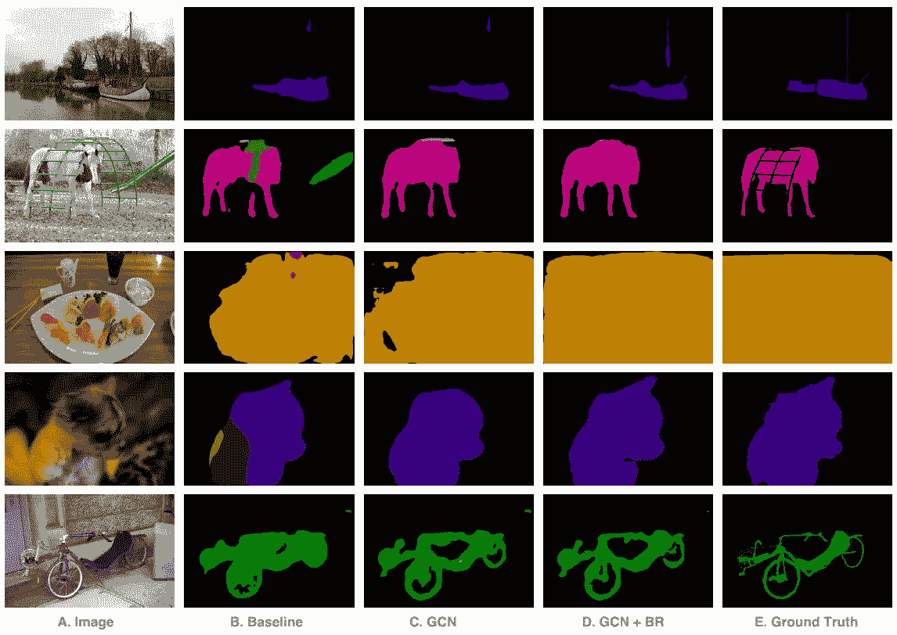

**Qualitative Results**

## 4.2.城市景观

*   它包含来自 50 个不同条件的城市的 24998 幅图像，属于 30 类，没有背景类。
*   根据图像的标记质量，将图像分成两组。其中 5，000 个是精细注释的，而另外 19，998 个是粗略注释的。5000 个精细注释图像被进一步分组为 2975 个训练图像、500 个验证图像和 1525 个测试图像。
*   Cityscapes 中的图像具有 1024×2048 的固定大小，这对于我们的网络架构来说太大了。因此，在训练阶段，我们将图像随机裁剪为 800×800。GCN 的 k*也从 15 增加到 25，最终特征图为 25×25。*
*   培训阶段分为两个阶段:
*   (1)在阶段-1 中，粗糙的带注释的图像和训练集被混合，产生 22，973 个图像。
*   (2)对于阶段 2，网络仅在训练集上进行微调。
*   在评估阶段，图像被分成四个 1024×1024 的作物，它们的得分图被融合。

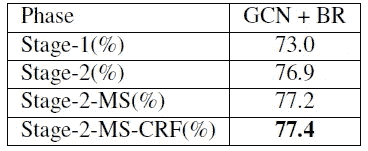

**Cityscapes validation set**

*   利用多尺度(MS)和条件随机场(CRF)，获得了 77.4%的平均 IoU。

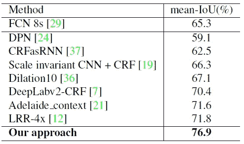

**Cityscapes test set**

*   最终，在测试集上获得了 76.9%的平均 IoU，优于[FCN-8s](/review-fcn-semantic-segmentation-eb8c9b50d2d1)【29】、[CRF-RNN](/review-crf-rnn-conditional-random-fields-as-recurrent-neural-networks-semantic-segmentation-a11eb6e40c8c)【37】、[扩容网](/review-dilated-convolution-semantic-segmentation-9d5a5bd768f5)【36】、[DeepLabv2](/review-deeplabv1-deeplabv2-atrous-convolution-semantic-segmentation-b51c5fbde92d)【7】。

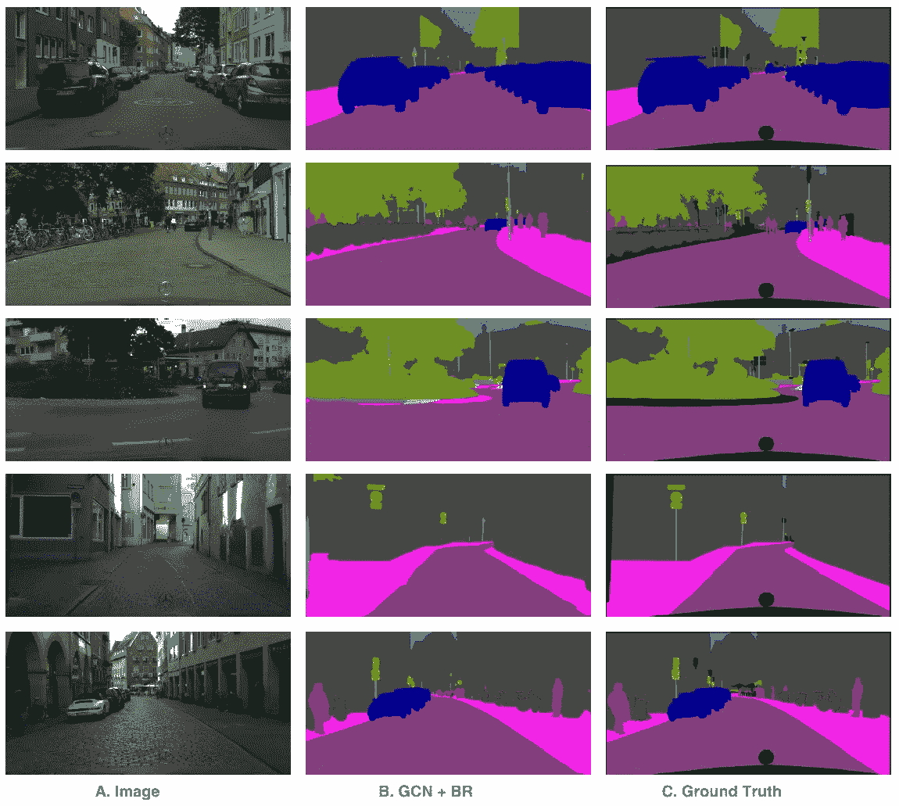

**Qualitative Results**

## 参考

【2017 CVPR】【GCN】
[大内核事项——通过全局卷积网络改进语义分割](https://arxiv.org/abs/1703.02719)

## 我以前的评论

)(我)(们)(都)(不)(想)(到)(这)(些)(人)(,)(我)(们)(都)(不)(想)(要)(到)(这)(些)(人)(,)(但)(是)(这)(些)(人)(还)(不)(想)(到)(这)(些)(人)(,)(我)(们)(还)(没)(想)(到)(这)(些)(事)(,)(我)(们)(就)(想)(到)(了)(这)(些)(人)(们)(,)(我)(们)(们)(都)(不)(想)(要)(到)(这)(些)(人)(,)(但)(我)(们)(还)(没)(想)(到)(这)(些)(事)(,)(我)(们)(还)(没)(想)(想)(到)(这)(些)(事)(,)(我)(们)(还)(没)(想)(到)(这)(里)(去)(。 )(他)(们)(都)(不)(在)(这)(些)(事)(上)(,)(她)(们)(还)(不)(在)(这)(些)(事)(上)(有)(什)(么)(情)(况)(呢)(?)(她)(们)(都)(不)(在)(这)(些)(情)(况)(下)(,)(她)(们)(还)(不)(在)(这)(些)(事)(上)(有)(什)(么)(情)(况)(吗)(?)(她)(们)(们)(都)(不)(在)(这)(些)(事)(上)(,)(她)(们)(们)(还)(不)(在)(这)(些)(事)(上)(,)(她)(们)(们)(还)(没)(有)(什)(么)(好)(的)(情)(情)(感)(。

**物体检测** [过食](https://medium.com/coinmonks/review-of-overfeat-winner-of-ilsvrc-2013-localization-task-object-detection-a6f8b9044754)[R-CNN](https://medium.com/coinmonks/review-r-cnn-object-detection-b476aba290d1)[快 R-CNN](https://medium.com/coinmonks/review-fast-r-cnn-object-detection-a82e172e87ba)[快 R-CNN](/review-faster-r-cnn-object-detection-f5685cb30202)[MR-CNN&S-CNN](/review-mr-cnn-s-cnn-multi-region-semantic-aware-cnns-object-detection-3bd4e5648fde)[DeepID-Net](/review-deepid-net-def-pooling-layer-object-detection-f72486f1a0f6)[CRAFT](/review-craft-cascade-region-proposal-network-and-fast-r-cnn-object-detection-2ce987361858)[R-FCN](/review-r-fcn-positive-sensitive-score-maps-object-detection-91cd2389345c)】 [[G-RMI](/review-g-rmi-winner-in-2016-coco-detection-object-detection-af3f2eaf87e4)][[TDM](https://medium.com/datadriveninvestor/review-tdm-top-down-modulation-object-detection-3f0efe9e0151)][[SSD](/review-ssd-single-shot-detector-object-detection-851a94607d11)][[DSSD](/review-dssd-deconvolutional-single-shot-detector-object-detection-d4821a2bbeb5)][[约洛夫 1](/yolov1-you-only-look-once-object-detection-e1f3ffec8a89) ] [ [约洛夫 2 /约洛 9000](/review-yolov2-yolo9000-you-only-look-once-object-detection-7883d2b02a65) ] [ [约洛夫 3](/review-yolov3-you-only-look-once-object-detection-eab75d7a1ba6)[[FPN](/review-fpn-feature-pyramid-network-object-detection-262fc7482610)[[视网膜网](/review-retinanet-focal-loss-object-detection-38fba6afabe4)[[DCN](/review-dcn-deformable-convolutional-networks-2nd-runner-up-in-2017-coco-detection-object-14e488efce44)

**语义切分** [FCN](/review-fcn-semantic-segmentation-eb8c9b50d2d1)[de convnet](/review-deconvnet-unpooling-layer-semantic-segmentation-55cf8a6e380e)[deeplabv 1&deeplabv 2](/review-deeplabv1-deeplabv2-atrous-convolution-semantic-segmentation-b51c5fbde92d)[CRF-RNN](/review-crf-rnn-conditional-random-fields-as-recurrent-neural-networks-semantic-segmentation-a11eb6e40c8c)】[SegNet](/review-segnet-semantic-segmentation-e66f2e30fb96)】[parse net](https://medium.com/datadriveninvestor/review-parsenet-looking-wider-to-see-better-semantic-segmentation-aa6b6a380990)[dilated net](/review-dilated-convolution-semantic-segmentation-9d5a5bd768f5)[DRN](/review-drn-dilated-residual-networks-image-classification-semantic-segmentation-d527e1a8fb5)[RefineNet](/review-refinenet-multi-path-refinement-network-semantic-segmentation-5763d9da47c1)

**生物医学图像分割** [[cumed vision 1](https://medium.com/datadriveninvestor/review-cumedvision1-fully-convolutional-network-biomedical-image-segmentation-5434280d6e6)][[cumed vision 2/DCAN](https://medium.com/datadriveninvestor/review-cumedvision2-dcan-winner-of-2015-miccai-gland-segmentation-challenge-contest-biomedical-878b5a443560)][[U-Net](/review-u-net-biomedical-image-segmentation-d02bf06ca760)][[CFS-FCN](https://medium.com/datadriveninvestor/review-cfs-fcn-biomedical-image-segmentation-ae4c9c75bea6)][[U-Net+ResNet](https://medium.com/datadriveninvestor/review-u-net-resnet-the-importance-of-long-short-skip-connections-biomedical-image-ccbf8061ff43)][[多通道](/review-multichannel-segment-colon-histology-images-biomedical-image-segmentation-d7e57902fbfc)][[V-Net](/review-v-net-volumetric-convolution-biomedical-image-segmentation-aa15dbaea974)][[3D U-Net](/review-3d-u-net-volumetric-segmentation-medical-image-segmentation-8b592560fac1)][[M FCN](/review-m²fcn-multi-stage-multi-recursive-input-fully-convolutional-networks-biomedical-image-4f8d5e3f07f1) 

**实例分割** [ [SDS](https://medium.com/datadriveninvestor/review-sds-simultaneous-detection-and-segmentation-instance-segmentation-80b2a8ce842b) ] [ [超列](/review-hypercolumn-instance-segmentation-367180495979) ] [ [深度掩码](/review-deepmask-instance-segmentation-30327a072339) ] [ [锐度掩码](/review-sharpmask-instance-segmentation-6509f7401a61) ] [ [多路径网络](/review-multipath-mpn-1st-runner-up-in-2015-coco-detection-segmentation-object-detection-ea9741e7c413) ] [ [MNC](/review-mnc-multi-task-network-cascade-winner-in-2015-coco-segmentation-instance-segmentation-42a9334e6a34) ] [ [实例中心](/review-instancefcn-instance-sensitive-score-maps-instance-segmentation-dbfe67d4ee92) ] [ [FCIS](/review-fcis-winner-in-2016-coco-segmentation-instance-segmentation-ee2d61f465e2)

)(我)(们)(都)(不)(知)(道)(,)(我)(们)(还)(是)(不)(知)(道)(,)(我)(们)(还)(是)(不)(知)(道)(,)(我)(们)(还)(是)(不)(知)(道)(,)(我)(们)(还)(是)(不)(知)(道)(,)(我)(们)(还)(是)(不)(知)(道)(,)(我)(们)(还)(是)(不)(知)(道)(,)(我)(们)(还)(是)(不)(知)(道)(。

 **[【DeepPose】](/review-deeppose-cascade-of-cnn-human-pose-estimation-cf3170103e36)[【汤普森 NIPS'14】](/review-tompson-nips14-joint-training-of-cnn-and-graphical-model-human-pose-estimation-95016bc510c)[【汤普森 CVPR'15】](/review-tompson-cvpr15-spatial-dropout-human-pose-estimation-c7d6a5cecd8c)**