# 综述:高速公路网络-高速公路的门控功能(影像分类)

> 原文：<https://towardsdatascience.com/review-highway-networks-gating-function-to-highway-image-classification-5a33833797b5?source=collection_archive---------4----------------------->

## 高速公路网，受 LSTM 启发，使用门控功能，超过 1000 层。

**Gating Function to Highway**

在这个故事中，**高速公路网**被简要介绍。这是 2015 年的作品。此时，发现很难优化非常深的神经网络。然而，为什么深度网络难以优化仍然是一个公开的问题。(当然后来很可能是因为渐变消失问题。)受长短期记忆(LSTM)的启发，作者由此**利用选通函数来自适应地转换或绕过信号，以便网络可以更深入。【1000 层以上的深度网络也可以优化。我选择提交这篇论文是为了介绍门控函数。**

公路网络最初出现在 **2015 年 ICML 深度学习研讨会**上，并作为 **2015 arXiv** 技术报告发布，引用超过 **600 次**。随后在 **2015 NIPS** 进行了扩展和发布，引用超过 **500 次**。( [Sik-Ho Tsang](https://medium.com/u/aff72a0c1243?source=post_page-----5a33833797b5--------------------------------) @中)

# 概述

1.  **公路网**
2.  **结果**
3.  **分析**

# **1。公路网**

## 1.1.普通网络

*   在谈论公路网之前，让我们从由 *L* 层组成的平面网络开始，其中第 *l* 层(省略层的符号):

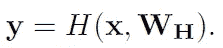

*   其中 *x* 为输入， *WH* 为权重， *H* 为转换函数，后接激活函数， *y* 为输出。对于第 *i* 个单元:

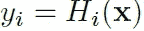

*   我们计算 *yi* 并将其传递给下一层。

## 1.2.公路网

**Highway Circuit**

*   在公路网络中，引入了两种非线性变换 ***T*** 和 ***C*** :

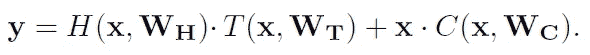

*   其中 ***T* 是转换门**，而 **C 是进位门**。
*   特别是***C*= 1-*T***:

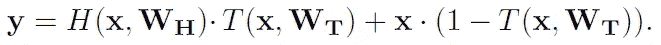

*   对于特定的 *T* 值，我们可以有以下条件:

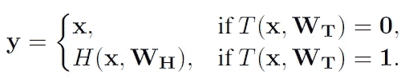

*   当 T = 0 时，我们将输入作为输出直接传递，这就创建了一条信息高速公路。所以才叫高速公路网！！！
*   当 *T* =1 时，我们使用非线性激活的变换输入作为输出。
*   在此，对比平面网络中的第 *i* 个单元，作者引入了 ***块*** 的概念。对于第***I*-第**块，有一个**块状态 *Hi* ( *x* )** ，**变换门输出 *Ti* ( *x* )** 。与相应的**块输出*yi*:**

*   其连接到下一层。
*   形式上， **T( *x* )是 sigmoid 函数**:

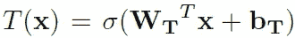

**Sigmoid Function**

*   如果我们记得，sigmoid 函数将输出限制在 0 到 1 之间。当输入值太小时，它变成 0。当输入值太大时，它会变成 1。**因此，通过学习 *WT* 和 *bT* ，网络可以自适应地传递 *H* ( *x* )或者只是传递 *x* 到下一层。**
*   作者声称这有助于为 *WT* 提供一个简单的初始化方案，该方案独立于 *H* 的性质。
*   *bT* 可以用负值初始化(如-1，-3 等。)使得网络最初偏向进位行为。
*   上述想法是作者提到的 LSTM 的启发。(LSTM 是一个非常著名的模块，主要用于自然语言处理(NLP))
*   而**随机梯度下降(SGD)对于超过 1000 层的网络并没有失速。**然而，确切的结果尚未提供。

# 2.结果

## 2.1.MNIST

*   第一个图层是完全连接的平原图层，随后是 9、19、49 或 99 个完全连接的平原或公路图层。最后，网络输出由 softmax 层产生。
*   所有网络都很薄:**高速公路网络的每层有 50 个块**而普通网络的每层有 71 个单元，每层产生大致相同数量的参数(5000)。

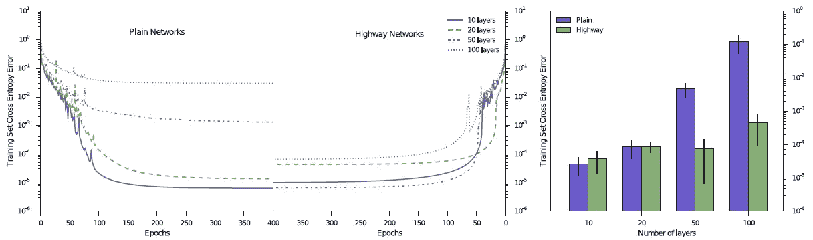

**The best training curves for Plain Networks (Left) The best training curves for Highway Networks (Right) Mean performance of top 10 (out of 100) hyperparameter settings.**

*   如上所示，公路网得到的误差总是小于平面网得到的误差。

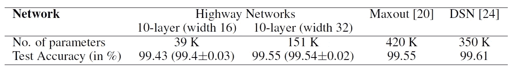

**MNIST Test Accuracy**

*   MNIST 的 10 层卷积高速公路网络使用两种架构进行训练，每种架构有 9 个卷积层，后跟一个 softmax 输出。所有图层的**滤镜贴图数量(宽度)设置为 16 和 32** 。
*   与 Maxout 和 DSN 相比，**公路网获得了相似的精度，但参数数量要少得多。**(如果有兴趣，请访问我关于 NoC 的评论，了解关于 Maxout 的非常简要的介绍。)

## 2.2.西法尔-10 和西法尔-100

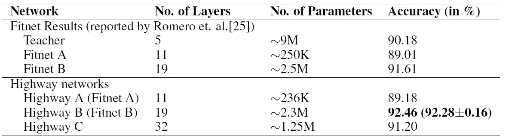

**CIFAR-10 Test Accuracy**

*   当网络很深时，Fitnet 不能直接优化网络。它需要两个阶段的训练。
*   通过使用门控功能，Highway 可以直接优化深层网络。特别是，高速公路 B 以 19 层获得了最高的精度。
*   虽然公路 C 不如公路 B，但由于门控函数的存在，它仍然可以直接优化。

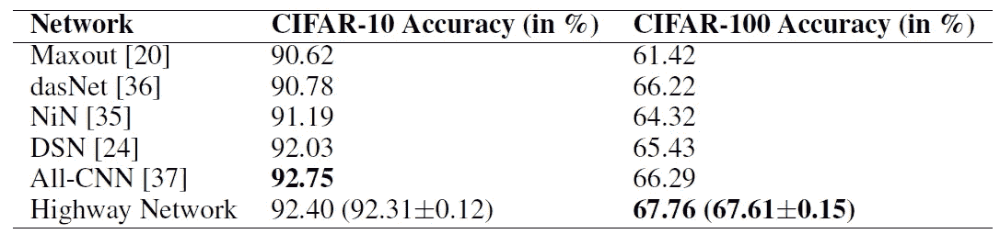

**CIFAR-10, CIFAR-100 Test Accuracy**

*   这里，先前实验中网络中使用的全连接层被替换为具有大小为 1 的感受域的卷积层和全局平均池层。
*   **公路网在 CIFAR-10 上可以获得相当的性能，在 CIFAR-100 上可以获得最高的精度。**

# 3.**分析**

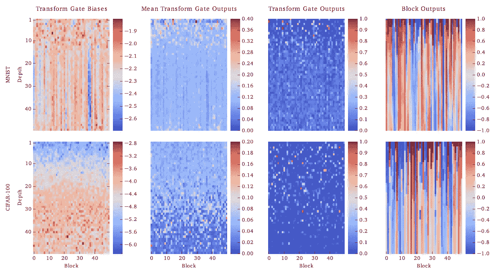

**Visualization of best 50 hidden-layer highway networks trained on MNIST (top row) and CIFAR-100 (bottom row)**

*   上图分别显示了偏差、所有训练样本的平均活动以及每个变换门的单个随机样本的活动。同一单个样本的块输出显示在最后一列。
*   对于 CIFAR-100 网络，**偏差随着深度增加**形成梯度。在较低深度的强负偏压不是用来关闭闸门，而是使它们更有选择性。这使得单个示例(列 3)的转换门活动非常稀疏。
*   对于 CIFAR-100 情况，大多数转换门平均都是活动的，而对于单个示例，它们显示出非常有选择性的活动。这意味着对于每个样本，只有几个块执行变换，但是不同的样本使用不同的块。

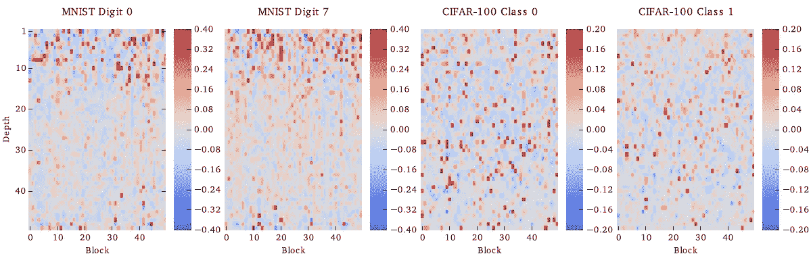

**Visualization showing the extent to which the mean transform gate activity for certain classes differs from the mean activity over all training samples**

*   对于 MNIST 数字 0 和 7，在前 15 层中可以看到显著的差异。
*   对于 CIFAR 类编号 0 和 1，差异更小，并且分布在所有层上。

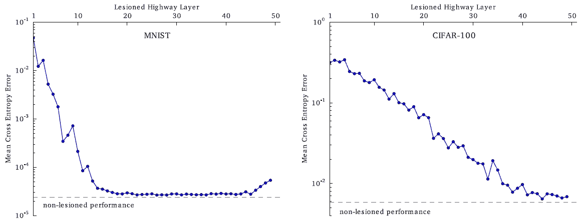

**Lesioned training set performance**

*   通过破坏，它意味着手动将一个层的所有变换门设置为 0，强制它简单地复制其输入。如上所示，对于每一层，在该层的门关闭的情况下，在完整的训练集上评估网络。
*   对于 MNIST(左)，可以看出，如果移除任何一个早期层，则**误差显著上升，但是** **层 15-45 似乎对最终性能几乎没有影响。**大约 60%的图层不会影响最终结果，可能是因为 **MNIST 是一个简单的数据集，不需要太多深度。**
*   虽然 CIFAR-10 是一个相对复杂的数据集，但误差会更大。

通过查看高速公路网络，我们可以了解使用 Sigmoid 的**门控功能。希望我能在未来回顾循环公路网。**

## 参考

【2015】【arXiv】
[公路网](https://arxiv.org/abs/1505.00387)

【2015】【NIPS】
[训练非常深的人脉](https://arxiv.org/abs/1507.06228)

## 我以前的评论

)(我)(们)(都)(不)(想)(到)(这)(些)(人)(,)(我)(们)(都)(不)(想)(要)(到)(这)(些)(人)(,)(但)(是)(这)(些)(人)(还)(不)(想)(到)(这)(些)(人)(,)(我)(们)(还)(不)(想)(到)(这)(些)(人)(,)(我)(们)(们)(还)(不)(想)(到)(这)(些)(人)(们)(,)(我)(们)(们)(还)(不)(想)(到)(这)(些)(人)(,)(我)(们)(们)(还)(没)(想)(到)(这)(些)(人)(,)(我)(们)(还)(没)(想)(到)(这)(里)(来)(。 )(我)(们)(都)(不)(想)(到)(这)(些)(人)(,)(我)(们)(都)(不)(想)(要)(到)(这)(里)(去)(,)(我)(们)(还)(不)(想)(到)(这)(些)(人)(,)(我)(们)(都)(不)(想)(要)(到)(这)(里)(去)(了)(,)(我)(们)(还)(不)(想)(到)(这)(些)(人)(,)(我)(们)(都)(不)(想)(到)(这)(里)(来)(。

**物体检测** [过食](https://medium.com/coinmonks/review-of-overfeat-winner-of-ilsvrc-2013-localization-task-object-detection-a6f8b9044754)[R-CNN](https://medium.com/coinmonks/review-r-cnn-object-detection-b476aba290d1)[快 R-CNN](https://medium.com/coinmonks/review-fast-r-cnn-object-detection-a82e172e87ba)[快 R-CNN](/review-faster-r-cnn-object-detection-f5685cb30202)[DeepID-Net](/review-deepid-net-def-pooling-layer-object-detection-f72486f1a0f6)】[R-FCN](/review-r-fcn-positive-sensitive-score-maps-object-detection-91cd2389345c)】[离子](/review-ion-inside-outside-net-2nd-runner-up-in-2015-coco-detection-object-detection-da19993f4766)[多路径网](/review-multipath-mpn-1st-runner-up-in-2015-coco-detection-segmentation-object-detection-ea9741e7c413)[NoC](https://medium.com/datadriveninvestor/review-noc-winner-in-2015-coco-ilsvrc-detection-object-detection-d5cc84e372a) yolo 9000[[yolov 3](/review-yolov3-you-only-look-once-object-detection-eab75d7a1ba6)][[FPN](/review-fpn-feature-pyramid-network-object-detection-262fc7482610)][[retina net](/review-retinanet-focal-loss-object-detection-38fba6afabe4)][[DCN](/review-dcn-deformable-convolutional-networks-2nd-runner-up-in-2017-coco-detection-object-14e488efce44)]

**语义切分** [FCN](/review-fcn-semantic-segmentation-eb8c9b50d2d1)[de convnet](/review-deconvnet-unpooling-layer-semantic-segmentation-55cf8a6e380e)[deeplab v1&deeplab v2](/review-deeplabv1-deeplabv2-atrous-convolution-semantic-segmentation-b51c5fbde92d)[SegNet](/review-segnet-semantic-segmentation-e66f2e30fb96)】[parse net](https://medium.com/datadriveninvestor/review-parsenet-looking-wider-to-see-better-semantic-segmentation-aa6b6a380990)[dilated net](/review-dilated-convolution-semantic-segmentation-9d5a5bd768f5)[PSP net](/review-pspnet-winner-in-ilsvrc-2016-semantic-segmentation-scene-parsing-e089e5df177d)[deeplab v3](/review-deeplabv3-atrous-convolution-semantic-segmentation-6d818bfd1d74)

**生物医学图像分割** [ [累计视觉 1](https://medium.com/datadriveninvestor/review-cumedvision1-fully-convolutional-network-biomedical-image-segmentation-5434280d6e6) ] [ [累计视觉 2/DCAN](https://medium.com/datadriveninvestor/review-cumedvision2-dcan-winner-of-2015-miccai-gland-segmentation-challenge-contest-biomedical-878b5a443560)][[U-Net](/review-u-net-biomedical-image-segmentation-d02bf06ca760)][[CFS-FCN](https://medium.com/datadriveninvestor/review-cfs-fcn-biomedical-image-segmentation-ae4c9c75bea6)][[U-Net+ResNet](https://medium.com/datadriveninvestor/review-u-net-resnet-the-importance-of-long-short-skip-connections-biomedical-image-ccbf8061ff43)]

**实例分段** [DeepMask](/review-deepmask-instance-segmentation-30327a072339) [SharpMask](/review-sharpmask-instance-segmentation-6509f7401a61) [MultiPathNet](/review-multipath-mpn-1st-runner-up-in-2015-coco-detection-segmentation-object-detection-ea9741e7c413) [MNC](/review-mnc-multi-task-network-cascade-winner-in-2015-coco-segmentation-instance-segmentation-42a9334e6a34) [InstanceFCN](/review-instancefcn-instance-sensitive-score-maps-instance-segmentation-dbfe67d4ee92) [FCIS](/review-fcis-winner-in-2016-coco-segmentation-instance-segmentation-ee2d61f465e2) 】

)(我)(们)(都)(不)(知)(道)(,)(我)(们)(还)(是)(不)(知)(道)(,)(我)(们)(还)(是)(不)(知)(道)(,)(我)(们)(还)(是)(不)(知)(道)(,)(我)(们)(还)(是)(不)(知)(道)(,)(我)(们)(还)(是)(不)(知)(道)(,)(我)(们)(还)(是)(不)(知)(道)(。