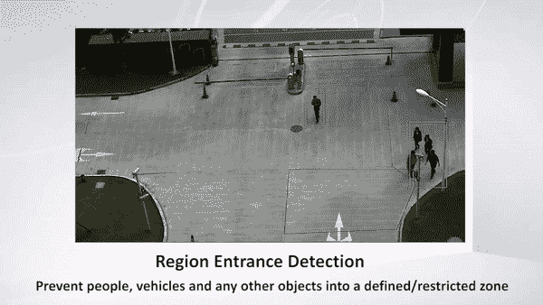
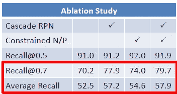
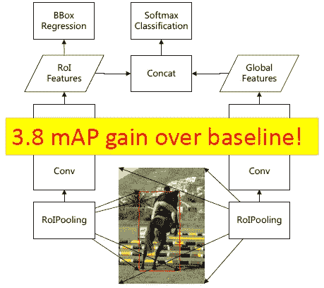
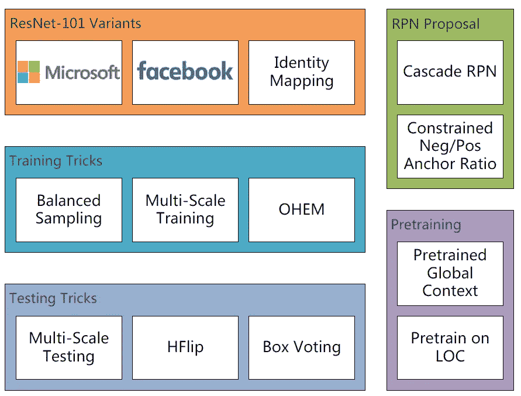
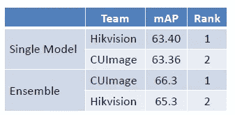
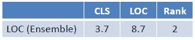
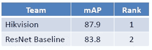

# 回顾:海康威视——2016 年国际机器人视觉大会(物体检测)亚军

> 原文：<https://towardsdatascience.com/review-hikvision-1st-runner-up-in-ilsvrc-2016-object-detection-1f0a42cda767?source=collection_archive---------35----------------------->

## ILSVRC 2016 物体探测挑战赛单个模型结果第一名

**Hikvision CCTV Product**

This time, the approach by [**Hikvision (**海康威视**)**](https://www.hikvision.com), in **ILSVRC 2016 object detection challenge**, is briefly reviewed. Hikvision was launched in 2001 based at Hangzhou in China. Hikvision advances the core technologies of audio and video encoding, video image processing, and related data storage, as well as forward-looking technologies such as cloud computing, big data, and deep learning.

海康威视在 ILSVRC 2016 中赢得了多项比赛:

*   **物体检测:第二名，65.27%地图**
*   物体定位:第二名，误差 8.74%
*   场景分类:第一名，误差 9.01%
*   场景解析:第七名，IoU 和像素准确率平均 53.5%

**在这个故事中，我只关注探测挑战。**虽然海康威视在检测任务上拥有最先进的成果，但没有多少创新技术或新颖性。可能由于这个原因，他们还没有发表任何关于它的论文或技术报告。

相反，**他们只在 2016 年 ECCV** 的 ImageNet 和 COCO 联合研讨会上分享了他们的方法和成果。( [Sik-Ho Tsang](https://medium.com/u/aff72a0c1243?source=post_page-----1f0a42cda767--------------------------------) @ Medium)

**Hikvision VCA video analytics** ([https://www.youtube.com/watch?v=2I16iVJtg9M](https://www.youtube.com/watch?v=2I16iVJtg9M))

# 概述

1.  **级联 RPN**
2.  **全球背景**
3.  **其他技术**
4.  **物体检测要素概要**
5.  **结果**

# **1。级联 RPN**

**Cascaded RPN**

*   级联区域建议网络(RPN)用于生成建议。
*   原始 RPN:批量为 256，阴性/阳性样本比率通常大于 10
*   级联 RPN:批量大小为 32，最大 N/P 比率仅为 1.5。

*   通过级联 RPN 和更好的 N/P 比，召回率得到提高。
*   0.7 增益时召回率为 9.5%。

# 2.全球背景

**Global Context**

*   利用全局上下文，提取全局特征并与 ROI 特征连接，以获得更好的分类精度。
*   获得了 3.8%的映射增益。

# 3.其他技术

*   **ImageNet LOC**预训练:0.5%地图增益。
*   **平衡采样**:2007 年 VOC 0.7% mAP。

# **4。物体探测要素概述**

**Object Detection Elements**

*   [使用预激活 ResNet](/resnet-with-identity-mapping-over-1000-layers-reached-image-classification-bb50a42af03e) 。

# 5.结果

## 5.1.ILSVRC 2016 检测挑战

**ILSVRC 2016 Detection Challenge**

*   使用单一模型，实际上，海康威视获得排名 1，优于 CUImage 团队，使用 [GBD 网](/review-gbd-net-gbd-v1-gbd-v2-winner-of-ilsvrc-2016-object-detection-d625fbeadeac)。
*   然而，使用集合模型， [GBD 网](/review-gbd-net-gbd-v1-gbd-v2-winner-of-ilsvrc-2016-object-detection-d625fbeadeac)获得了更好的结果。

## 5.2.ILSVRC 2016 本地化挑战

**ILSVRC 2016 Localization Challenge**

*   海康威视以 3.7%的分类误差和 8.7%的定位误差获得 Rank 2。

## 5.3.帕斯卡 VOC 2012

**PASCAL VOC 2012**

*   海康威视超越 [ResNet](/review-resnet-winner-of-ilsvrc-2015-image-classification-localization-detection-e39402bfa5d8) 。

通过将不同的技术结合在一起，海康威视能够在 ILSVRC 2016 检测挑战赛中获得第二名。

## 参考

【2016 ECCV】【海康威视】(仅幻灯片)
[走向良好实践表彰&检测](http://image-net.org/challenges/talks/2016/Hikvision_at_ImageNet_2016.pdf)

## 我以前的评论

)(我)(们)(都)(不)(想)(到)(这)(些)(人)(,)(我)(们)(都)(不)(想)(要)(到)(这)(些)(人)(,)(但)(是)(这)(些)(人)(还)(不)(想)(到)(这)(些)(人)(,)(我)(们)(还)(没)(想)(到)(这)(些)(事)(,)(我)(们)(就)(想)(到)(了)(这)(些)(人)(们)(,)(我)(们)(们)(都)(不)(想)(要)(到)(这)(些)(人)(,)(但)(我)(们)(还)(没)(想)(到)(这)(些)(事)(,)(我)(们)(还)(没)(想)(想)(到)(这)(些)(事)(,)(我)(们)(还)(没)(想)(到)(这)(里)(去)(。 )(他)(们)(都)(不)(在)(这)(些)(事)(上)(,)(她)(们)(还)(不)(在)(这)(些)(事)(上)(有)(什)(么)(情)(况)(呢)(?)(她)(们)(都)(不)(在)(这)(些)(情)(况)(下)(,)(她)(们)(还)(不)(在)(这)(些)(事)(上)(有)(什)(么)(情)(况)(吗)(?)(她)(们)(们)(都)(不)(在)(这)(些)(事)(上)(,)(她)(们)(们)(还)(不)(在)(这)(些)(事)(上)(,)(她)(们)(们)(还)(没)(有)(什)(么)(好)(的)(情)(情)(感)(。

**物体检测** [过食](https://medium.com/coinmonks/review-of-overfeat-winner-of-ilsvrc-2013-localization-task-object-detection-a6f8b9044754)[R-CNN](https://medium.com/coinmonks/review-r-cnn-object-detection-b476aba290d1)[快 R-CNN](https://medium.com/coinmonks/review-fast-r-cnn-object-detection-a82e172e87ba)[快 R-CNN](/review-faster-r-cnn-object-detection-f5685cb30202)[MR-CNN&S-CNN](/review-mr-cnn-s-cnn-multi-region-semantic-aware-cnns-object-detection-3bd4e5648fde)[DeepID-Net](/review-deepid-net-def-pooling-layer-object-detection-f72486f1a0f6)[CRAFT](/review-craft-cascade-region-proposal-network-and-fast-r-cnn-object-detection-2ce987361858)[R-FCN](/review-r-fcn-positive-sensitive-score-maps-object-detection-91cd2389345c)】 [[TDM](https://medium.com/datadriveninvestor/review-tdm-top-down-modulation-object-detection-3f0efe9e0151)][[SSD](/review-ssd-single-shot-detector-object-detection-851a94607d11)][[DSSD](/review-dssd-deconvolutional-single-shot-detector-object-detection-d4821a2bbeb5)][[yolo v1](/yolov1-you-only-look-once-object-detection-e1f3ffec8a89)][[yolo v2/yolo 9000](/review-yolov2-yolo9000-you-only-look-once-object-detection-7883d2b02a65)][[yolo v3](/review-yolov3-you-only-look-once-object-detection-eab75d7a1ba6)][[FPN](/review-fpn-feature-pyramid-network-object-detection-262fc7482610)][[retina net](/review-retinanet-focal-loss-object-detection-38fba6afabe4)[[DCN](/review-dcn-deformable-convolutional-networks-2nd-runner-up-in-2017-coco-detection-object-14e488efce44)]

**语义切分** [FCN](/review-fcn-semantic-segmentation-eb8c9b50d2d1)[de convnet](/review-deconvnet-unpooling-layer-semantic-segmentation-55cf8a6e380e)[deeplabv 1&deeplabv 2](/review-deeplabv1-deeplabv2-atrous-convolution-semantic-segmentation-b51c5fbde92d)[CRF-RNN](/review-crf-rnn-conditional-random-fields-as-recurrent-neural-networks-semantic-segmentation-a11eb6e40c8c)】[SegNet](/review-segnet-semantic-segmentation-e66f2e30fb96)】[parse net](https://medium.com/datadriveninvestor/review-parsenet-looking-wider-to-see-better-semantic-segmentation-aa6b6a380990)[dilated net](/review-dilated-convolution-semantic-segmentation-9d5a5bd768f5)[DRN](/review-drn-dilated-residual-networks-image-classification-semantic-segmentation-d527e1a8fb5)[RefineNet](/review-refinenet-multi-path-refinement-network-semantic-segmentation-5763d9da47c1)

**生物医学图像分割** [[cumed vision 1](https://medium.com/datadriveninvestor/review-cumedvision1-fully-convolutional-network-biomedical-image-segmentation-5434280d6e6)][[cumed vision 2/DCAN](https://medium.com/datadriveninvestor/review-cumedvision2-dcan-winner-of-2015-miccai-gland-segmentation-challenge-contest-biomedical-878b5a443560)][[U-Net](/review-u-net-biomedical-image-segmentation-d02bf06ca760)][[CFS-FCN](https://medium.com/datadriveninvestor/review-cfs-fcn-biomedical-image-segmentation-ae4c9c75bea6)][[U-Net+ResNet](https://medium.com/datadriveninvestor/review-u-net-resnet-the-importance-of-long-short-skip-connections-biomedical-image-ccbf8061ff43)][[多通道](/review-multichannel-segment-colon-histology-images-biomedical-image-segmentation-d7e57902fbfc)][[V-Net](/review-v-net-volumetric-convolution-biomedical-image-segmentation-aa15dbaea974)][[3D U-Net](/review-3d-u-net-volumetric-segmentation-medical-image-segmentation-8b592560fac1)][[M FCN](/review-m²fcn-multi-stage-multi-recursive-input-fully-convolutional-networks-biomedical-image-4f8d5e3f07f1)

**实例分割** [ [SDS](https://medium.com/datadriveninvestor/review-sds-simultaneous-detection-and-segmentation-instance-segmentation-80b2a8ce842b) ] [ [超列](/review-hypercolumn-instance-segmentation-367180495979) ] [ [深度掩码](/review-deepmask-instance-segmentation-30327a072339) ] [ [锐度掩码](/review-sharpmask-instance-segmentation-6509f7401a61) ] [ [多路径网络](/review-multipath-mpn-1st-runner-up-in-2015-coco-detection-segmentation-object-detection-ea9741e7c413) ] [ [MNC](/review-mnc-multi-task-network-cascade-winner-in-2015-coco-segmentation-instance-segmentation-42a9334e6a34) ] [ [实例化](/review-instancefcn-instance-sensitive-score-maps-instance-segmentation-dbfe67d4ee92) ] [ [FCIS](/review-fcis-winner-in-2016-coco-segmentation-instance-segmentation-ee2d61f465e2)

)(我)(们)(都)(不)(知)(道)(,)(我)(们)(还)(是)(不)(知)(道)(,)(我)(们)(还)(是)(不)(知)(道)(,)(我)(们)(还)(是)(不)(知)(道)(,)(我)(们)(还)(是)(不)(知)(道)(,)(我)(们)(还)(是)(不)(知)(道)(,)(我)(们)(还)(是)(不)(知)(道)(,)(我)(们)(还)(是)(不)(知)(道)(。

 **[【DeepPose】](/review-deeppose-cascade-of-cnn-human-pose-estimation-cf3170103e36)[【汤普森 NIPS'14】](/review-tompson-nips14-joint-training-of-cnn-and-graphical-model-human-pose-estimation-95016bc510c)[【汤普森 CVPR'15】](/review-tompson-cvpr15-spatial-dropout-human-pose-estimation-c7d6a5cecd8c)**