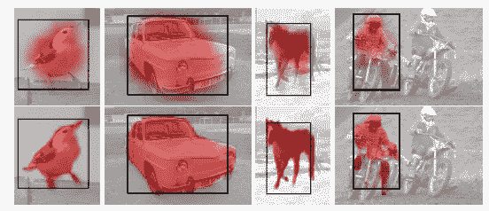

# 复习:超列(实例分段)

> 原文：<https://towardsdatascience.com/review-hypercolumn-instance-segmentation-367180495979?source=collection_archive---------16----------------------->

## **超柱，一个来自神经科学的术语，优于 SDS**

在这个故事里，**超柱**被点评。**“超柱”(Hypercolumn)**、**这一术语从神经科学**中借来，用来描述排列在柱状结构中的一组对多个方向和多个频率的边缘敏感的 V1 神经元。通过借用超柱的思想，提高了预测精度，发表在 **2015 CVPR** 上，引用超过 **800 次。本书在 CVPR 出版时，第一作者 Bharath Hariharan 博士正在加州大学伯克利分校攻读博士学位。当 Hypercolumn 后来在**扩展到 2017 TPAMI** 时，Hariharan 博士已经成为脸书人工智能研究(FAIR)的博士后研究员。之后，另一篇著名论文《特征金字塔网络》( [FPN](/review-fpn-feature-pyramid-network-object-detection-262fc7482610) )于 2017 年在 CVPR 发表。现在，他成为康奈尔大学的助理教授，从事三维空间的计算机视觉研究。( [Sik-Ho Tsang](https://medium.com/u/aff72a0c1243?source=post_page-----367180495979--------------------------------) @中)**

# 概述

1.  **超柱概念**
2.  **使用超柱的像素分类**
3.  **高效超柱**
4.  **快速超柱(2017 年 TPAMI)**
5.  **结果**

# 1.超圆柱概念

## 1.1.超圆柱表示

**Hypercolumn Representation**

*   此时，卷积神经网络(CNN)通常使用最后一层的输出**作为特征表示。然而，该层中的信息**在空间上过于粗糙，不允许精确定位**。**
*   **一个像素的超列是该像素上方所有 CNN 单元的激活向量**，如上图所示。
*   通过这种方式，**空间位置信息可以从更早的层**中获得，并且具有更准确的预测结果。

## 1.2.超列问题设置

*   首先，假设在非最大抑制(NMS)之后，我们从对象检测系统获得了一组检测。
*   然后，检测的包围盒被稍微扩展并在这个扩展的盒子上预测热图。
*   对于分割，热图编码了特定位置在对象内部的概率。由于它是在检测之后被分割的，因此，我在标题处将其声明为一种**实例分割**方法。
*   它也适用于**零件标记/关键点预测**，为每个零件/关键点预测一个单独的热图，其中每个热图是一个位置属于该零件/关键点的概率。
*   在每种情况下，预测一个 **50×50 的热图** **，然后调整**到扩展的边界框的大小，并将其放到图像上。

# 2.使用**超柱**的像素分类

*   该位置处的超柱是一个长向量，其连接了来自网络中的一些或所有特征地图的特征。
*   例如，使用来自 [AlexNet](https://medium.com/coinmonks/paper-review-of-alexnet-caffenet-winner-in-ilsvrc-2012-image-classification-b93598314160) 架构的 pool2 (256 通道)、conv4 (384 通道)和 fc7 (4096 通道)将导致 4736 维向量。
*   位置很重要，例如:对于被检测的人，头部应该在盒子的顶部。因此，最简单的方法是为 50×50 个位置中的每个位置训练单独的分类器，即在每个位置可以使用每个超列上的 1×1 卷积或全连接(FC)层。
*   但是有三个问题:1。通过一个点的数据量很少，这可能会导致过度拟合。2.训练如此多的分类器是计算昂贵的。3.相邻的像素应该彼此相似。

# 3.**高效超柱**

**Efficient Hypercolumn**

*   一种解决方案是使用卷积和上采样(调整大小)。
*   1×1 卷积被 n×n 卷积代替。这相当于不仅查看像素正上方的单元，而且查看该单元的邻域。
*   有几段谈到了如何将超列概念转变为高效的超列实现。(如果有兴趣，请看论文。)

**Hypercolumn Classifiers As a Neural Network**

*   最后，超列分类器如上图所示。
*   在使用双线性插值进行卷积和上采样之后，来自不同层的特征图被加在一起，并经过 sigmoid 函数。
*   然后结合热图给出最终输出。
*   它看起来像 FCN。

# 4.**快速超柱(2017 TPAMI 中)**

**Fast Hypercolumn Prediction Using the SPP Idea**

*   CNN(橙色)的卷积层只在整个图像上运行一次。因为卷积特征可以在所有盒子之间共享。
*   然后，对于每个盒子，空间金字塔池(SPP)图层使用空间金字塔格网来计算固定长度的矢量，然后将其传递给完全连接的图层(红色)。(SPP 层在 [SPPNet](https://medium.com/coinmonks/review-sppnet-1st-runner-up-object-detection-2nd-runner-up-image-classification-in-ilsvrc-906da3753679) 中提出。)
*   主要的加速来自所有机器共享的卷积特性。(橙色)
*   完全连接的图层要素仍按每个框单独计算。

# 5.结果

## 5.1.检测后分割

**Ablation Study on VOC2012 Val**

*   [**SDS**](https://medium.com/datadriveninvestor/review-sds-simultaneous-detection-and-segmentation-instance-segmentation-80b2a8ce842b)**【22】**:基线，47.7% mAP。
*   **Hypercolumn (Hyp)** :使用 10×10 网格，根据位置是否在原始候选区域内，还添加了额外的 1/0，51.2%地图。
*   用包围盒回归( **bbox-reg** )来细化盒子:51.9%贴图。
*   带微调( **FT** ): 52.8% mAP，远高于 [SDS](https://medium.com/datadriveninvestor/review-sds-simultaneous-detection-and-segmentation-instance-segmentation-80b2a8ce842b) 。
*   随着**一个或两个上采样路径被丢弃**，mAP 也被丢弃。
*   使用**不同的网格尺寸**来离散检测盒:使用 1×1 网格已经优于 [SDS](https://medium.com/datadriveninvestor/review-sds-simultaneous-detection-and-segmentation-instance-segmentation-80b2a8ce842b) 。使用 5×5 网格已经恢复了 10×10 网格的全部性能。

**Heatmap,Top Row: Baseline, Bottom Row: Hypercolumn**

**VOC2012 Val**

*   T-Net: [AlexNet](https://medium.com/coinmonks/paper-review-of-alexnet-caffenet-winner-in-ilsvrc-2012-image-classification-b93598314160) ，44.0%地图。
*   o 网: [VGGNet](https://medium.com/coinmonks/paper-review-of-vggnet-1st-runner-up-of-ilsvlc-2014-image-classification-d02355543a11) ，52.6%地图。
*   O-Net，Hyp: 56.5%图。
*   O-Net，Hyp+Rescore: 60.0% mAP。(围绕 NMS 阈值和区域重叠重新计分播放)

## 5.2.关键点预测

*   只有“人”的范畴。

**VOC2009 Val**

**Heatmap, Top Row: Baseline Only FC7, Bottom Row: Hypercolumns**

*   经过微调的超柱可获得最佳结果。

## 5.3.零件标签

*   人、马、牛、羊、猫、狗和鸟。

**PASCAL VOC**

**Heatmap, Top Row: Baseline Only FC7, Bottom Row: Hypercolumns**

*   除了 bird，超圆柱获得了最好的结果。

## 5.4.快速超圆柱

**Time Against Number of Boxes**

*   **慢速**系统所花费的时间随着箱子数量的增加而线性增加(256 个箱子可达 **6 秒)。**
*   无论我们在多少台机器上运行，使用 SPP 层的 **fast** 系统所花费的时间保持不变。特别是，它能够在不到 250 毫秒内分割 **256 个盒子。**

## 参考

【2015 CVPR】【超柱】
[用于对象分割和细粒度定位的超柱](https://arxiv.org/abs/1411.5752)

【2017 TPAMI】【超柱】
[使用超柱的对象实例分割和细粒度定位](https://ieeexplore.ieee.org/document/7486965)

## 我以前的评论

)(我)(们)(都)(不)(想)(到)(这)(些)(人)(,)(我)(们)(都)(不)(想)(要)(到)(这)(些)(人)(,)(但)(是)(这)(些)(人)(还)(不)(想)(到)(这)(些)(人)(,)(我)(们)(还)(没)(想)(到)(这)(些)(事)(,)(我)(们)(就)(想)(到)(了)(这)(些)(人)(们)(,)(我)(们)(们)(都)(不)(想)(要)(到)(这)(些)(人)(,)(但)(我)(们)(还)(没)(想)(到)(这)(些)(事)(,)(我)(们)(还)(没)(想)(想)(到)(这)(些)(事)(,)(我)(们)(还)(没)(想)(到)(这)(里)(去)(。 )(他)(们)(都)(不)(在)(这)(些)(事)(上)(,)(她)(们)(还)(不)(在)(这)(些)(事)(上)(有)(什)(么)(情)(况)(呢)(?)(她)(们)(都)(不)(在)(这)(些)(情)(况)(下)(,)(她)(们)(还)(不)(在)(这)(些)(事)(上)(有)(什)(么)(情)(况)(吗)(?)(她)(们)(们)(都)(不)(在)(这)(些)(事)(上)(,)(她)(们)(们)(还)(不)(在)(这)(些)(事)(上)(,)(她)(们)(们)(还)(没)(有)(什)(么)(好)(的)(情)(情)(感)(。

**物体检测** [过食](https://medium.com/coinmonks/review-of-overfeat-winner-of-ilsvrc-2013-localization-task-object-detection-a6f8b9044754)[R-CNN](https://medium.com/coinmonks/review-r-cnn-object-detection-b476aba290d1)[快 R-CNN](https://medium.com/coinmonks/review-fast-r-cnn-object-detection-a82e172e87ba)[快 R-CNN](/review-faster-r-cnn-object-detection-f5685cb30202)[MR-CNN&S-CNN](/review-mr-cnn-s-cnn-multi-region-semantic-aware-cnns-object-detection-3bd4e5648fde)[DeepID-Net](/review-deepid-net-def-pooling-layer-object-detection-f72486f1a0f6)[CRAFT](/review-craft-cascade-region-proposal-network-and-fast-r-cnn-object-detection-2ce987361858)[R-FCN](/review-r-fcn-positive-sensitive-score-maps-object-detection-91cd2389345c)】 [ [DSSD](/review-dssd-deconvolutional-single-shot-detector-object-detection-d4821a2bbeb5) ] [ [约洛夫 1](/yolov1-you-only-look-once-object-detection-e1f3ffec8a89) ] [ [约洛夫 2 /约洛 9000](/review-yolov2-yolo9000-you-only-look-once-object-detection-7883d2b02a65) ] [ [约洛夫 3](/review-yolov3-you-only-look-once-object-detection-eab75d7a1ba6) ] [ [FPN](/review-fpn-feature-pyramid-network-object-detection-262fc7482610) ] [ [视网膜网](/review-retinanet-focal-loss-object-detection-38fba6afabe4) ] [ [DCN](/review-dcn-deformable-convolutional-networks-2nd-runner-up-in-2017-coco-detection-object-14e488efce44) ]

**语义切分** [FCN](/review-fcn-semantic-segmentation-eb8c9b50d2d1)[de convnet](/review-deconvnet-unpooling-layer-semantic-segmentation-55cf8a6e380e)[deeplab v1&deeplab v2](/review-deeplabv1-deeplabv2-atrous-convolution-semantic-segmentation-b51c5fbde92d)[CRF-RNN](/review-crf-rnn-conditional-random-fields-as-recurrent-neural-networks-semantic-segmentation-a11eb6e40c8c)】[SegNet](/review-segnet-semantic-segmentation-e66f2e30fb96)】[parse net](https://medium.com/datadriveninvestor/review-parsenet-looking-wider-to-see-better-semantic-segmentation-aa6b6a380990)[dilated net](/review-dilated-convolution-semantic-segmentation-9d5a5bd768f5)[PSPNet](/review-pspnet-winner-in-ilsvrc-2016-semantic-segmentation-scene-parsing-e089e5df177d)[deeplab v3](/review-deeplabv3-atrous-convolution-semantic-segmentation-6d818bfd1d74)]

**生物医学图像分割** [[cumed vision 1](https://medium.com/datadriveninvestor/review-cumedvision1-fully-convolutional-network-biomedical-image-segmentation-5434280d6e6)][[cumed vision 2/DCAN](https://medium.com/datadriveninvestor/review-cumedvision2-dcan-winner-of-2015-miccai-gland-segmentation-challenge-contest-biomedical-878b5a443560)][[U-Net](/review-u-net-biomedical-image-segmentation-d02bf06ca760)][[CFS-FCN](https://medium.com/datadriveninvestor/review-cfs-fcn-biomedical-image-segmentation-ae4c9c75bea6)][[U-Net+ResNet](https://medium.com/datadriveninvestor/review-u-net-resnet-the-importance-of-long-short-skip-connections-biomedical-image-ccbf8061ff43)][[多通道](/review-multichannel-segment-colon-histology-images-biomedical-image-segmentation-d7e57902fbfc)[[V-Net](/review-v-net-volumetric-convolution-biomedical-image-segmentation-aa15dbaea974)]

**实例分割** [SDS](https://medium.com/datadriveninvestor/review-sds-simultaneous-detection-and-segmentation-instance-segmentation-80b2a8ce842b) [DeepMask](/review-deepmask-instance-segmentation-30327a072339) [SharpMask](/review-sharpmask-instance-segmentation-6509f7401a61) [MultiPathNet](/review-multipath-mpn-1st-runner-up-in-2015-coco-detection-segmentation-object-detection-ea9741e7c413) [MNC](/review-mnc-multi-task-network-cascade-winner-in-2015-coco-segmentation-instance-segmentation-42a9334e6a34) 】 [InstanceFCN](/review-instancefcn-instance-sensitive-score-maps-instance-segmentation-dbfe67d4ee92) [FCIS](/review-fcis-winner-in-2016-coco-segmentation-instance-segmentation-ee2d61f465e2)

)(我)(们)(都)(不)(知)(道)(,)(我)(们)(还)(是)(不)(知)(道)(,)(我)(们)(还)(是)(不)(知)(道)(,)(我)(们)(还)(是)(不)(知)(道)(,)(我)(们)(还)(是)(不)(知)(道)(,)(我)(们)(还)(是)(不)(知)(道)(,)(我)(们)(还)(是)(不)(知)(道)(。

(T38) 人类姿势估计 (T39)
[(T41) 汤普森 NIPS'14 [T42)]