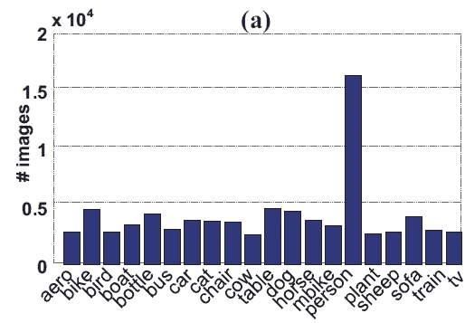
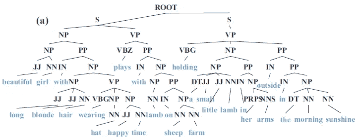
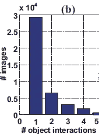
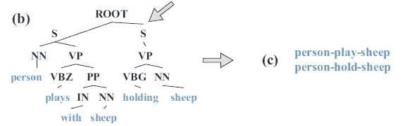
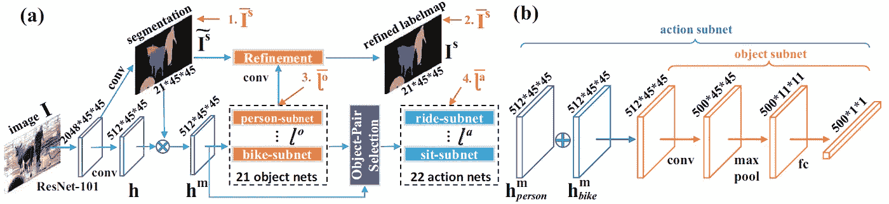
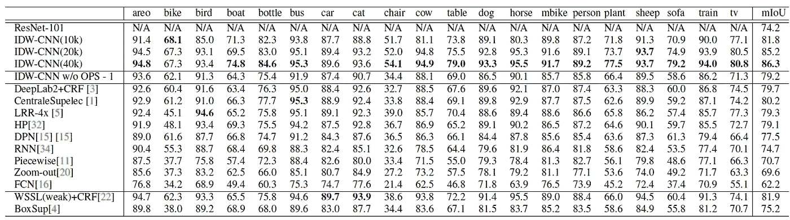
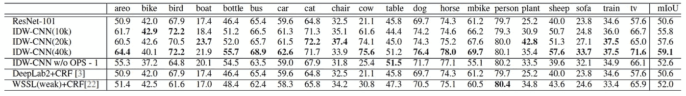
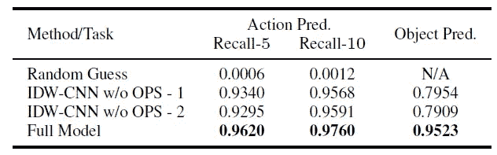
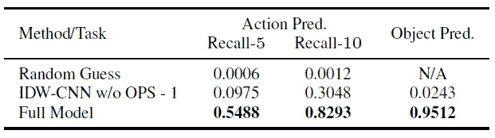
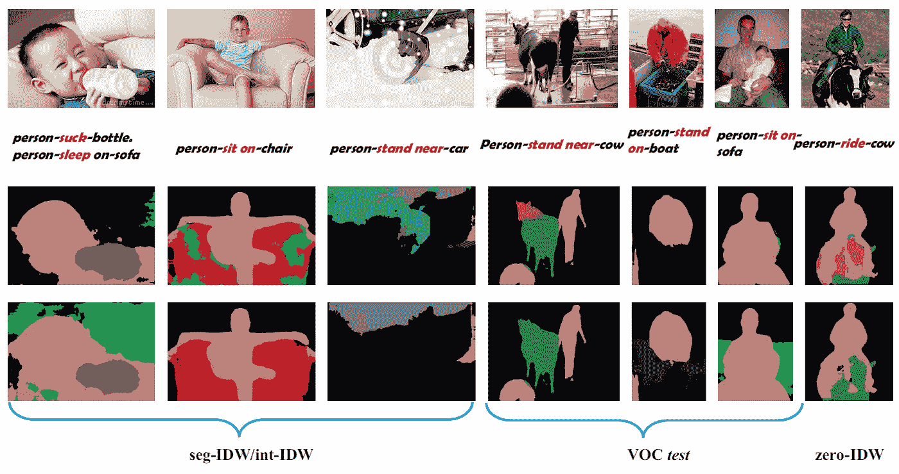

# 综述:IDW-CNN——从野生数据集中的图像描述中学习提高了准确性(语义分割)

> 原文：<https://towardsdatascience.com/review-idw-cnn-learning-from-image-descriptions-in-the-wild-dataset-boosts-the-accuracy-807eb5ffe371?source=collection_archive---------33----------------------->

## 胜过 [FCN](/review-fcn-semantic-segmentation-eb8c9b50d2d1?source=post_page---------------------------) 、 [CRF-RNN](/review-crf-rnn-conditional-random-fields-as-recurrent-neural-networks-semantic-segmentation-a11eb6e40c8c?source=post_page---------------------------) 和 [DeepLabv2](/review-deeplabv1-deeplabv2-atrous-convolution-semantic-segmentation-b51c5fbde92d?source=post_page---------------------------)

本文对中山大学、香港中文大学和商汤集团(有限公司)联合制作的 **IDW 有线电视新闻网**进行简要回顾。

*   **通过从野生(IDW)数据集中的图像描述进行学习，提高了分割精度。**
*   与以前的图像字幕数据集不同，在以前的图像字幕数据集中，字幕是手动密集注释的，**IDW 的图像及其描述是自动从互联网上下载的，无需任何手动清理和提炼。**

这是一篇 **2017 年 CVPR** 论文，引用**数十次**。( [Sik-Ho Tsang](https://medium.com/u/aff72a0c1243?source=post_page-----807eb5ffe371--------------------------------) @中)

# 概述

1.  **在野外(IDW)数据集中构建图像描述**
2.  **IDW-CNN 架构**
3.  **培训方式**
4.  **实验结果**

# **1。在野外(IDW)数据集构建图像描述**

*   IDW 分两级建造。

## 1.1.第一阶段的

*   **准备了**中经常出现的 21 个介词和动词，如“hold”、“play with”、“hug”、“ride”和“stand near”，以及来自 VOC12 的 20 个对象类别，如“person”、“cow”、“bike”、“sheep”和“table”，**。**
*   **他们在‘主语+动词/prep’方面的组合。“+ object”导致 20×21×20 = 8400 个不同的短语**，例如“骑自行车的人”、“坐在自行车附近的人”和“站在自行车附近的人”。
*   有些在实践中很少出现，例如“牛抱羊”。
*   在去除无意义的短语之后，收集了数百个有意义的短语。

## 1.2.第二级

*   这些短语被用作从因特网上搜索图像及其周围文本的关键词。
*   **无效短语，如“人骑牛”，如果其检索图像的数量小于 150，则被丢弃**，以防止可能导致训练中过拟合的罕见情况或异常值。
*   结果，获得了 59 个有效短语。最后， **IDW 有 41421 张图片和描述**。

**The number of images in IDW with respect to each object category in PASCAL VOC 2012**

*   上面的直方图揭示了现实世界中这些物体的图像分布，没有任何手动清理和细化。

## 1.3.图像描述表示

*   每一个图像描述都被自动转换成一个解析树，在这里我们选择有用的物体(例如名词)和动作(例如动词)作为训练过程中的监督。
*   两个对象的每个配置和它们之间的动作可以被认为是对象交互，这对于图像分割是有价值的信息，但是在 VOC12 的 labelmaps 中没有给出。

**The constituency tree generated by language parser**

*   首先，**斯坦福解析器用于解析图像描述并生成选区树**，如上所述。**但是它仍然包含不相关的词**，既不描述对象类别也不描述交互。
*   然后需要**将选区树转换成语义树**，语义树只包含对象及其交互。1)根据词类过滤叶节点，仅保留名词作为对象候选，保留动词和介词作为动作候选。2)名词转宾语。WordNet 中统一同义词的词汇关系数据。不属于 20 个对象类别的名词将从树中移除。3)使用 word2vec 将动词映射到定义的 21 个动作。4)通过节点从语义树中提取对象交互。
*   如‘姑娘玩小羊，牵着小羊’先被过滤出描写，再进一步转移成‘人玩小羊，牵着小羊’。
*   在解析了 IDW 中的所有图像描述之后，总共获得了 62，100 个对象交互。

**The number of images with respect to the number of interactions, showing that each image has 1.5 interactions on average.**

> 与之前的数据集相比，IDW 的构建无需人工干预且费用极低。

**The constituency tree after POS tag filtering (Left), and object interactions (Right)**

## 1.4.三个测试集

*   **int-IDW** :从 IDW 随机选择**1440 张图像作为物体交互预测的测试集。**
*   **seg-IDW** :在 int-IDW 中为每幅图像标注**每像素 labelmap，产生一个分割测试集。就每幅图像中的物体多样性而言，seg-IDW 比 VOC12 更具挑战性。**
*   **零 IDW** : **零拍摄测试集包括 1000 张看不见的物体相互作用的图像**。例如,“人骑牛”的形象很少见(如在斗牛中),在训练中不会出现。

# 2. **IDW-CNN 架构**

**(a) IDW-CNN, which has two streams, (b) Each subnet has the same network structure.**

*   该网络可以分为三个主要部分。

## 2.1.特征抽出

*   IDW-CNN 采用 [DeepLabv2](/review-deeplabv1-deeplabv2-atrous-convolution-semantic-segmentation-b51c5fbde92d?source=post_page---------------------------) 作为特征提取的构建模块。
*   **IDW-CNN 仅从** [**DeepLabv2**](/review-deeplabv1-deeplabv2-atrous-convolution-semantic-segmentation-b51c5fbde92d?source=post_page---------------------------) 继承了[**ResNet-101**](/review-resnet-winner-of-ilsvrc-2015-image-classification-localization-detection-e39402bfa5d8?source=post_page---------------------------)**，而**则去除了多尺度融合和 CRF** 等其他组件。**
*   给定一幅图像 *I* ， [ResNet-101](/review-resnet-winner-of-ilsvrc-2015-image-classification-localization-detection-e39402bfa5d8?source=post_page---------------------------) 产生 **2048 通道**的特征。每个通道的尺寸为 **45 × 45** 。

## 2.2.分段流

*   上述特征被卷积层用来预测**分割标签图**(表示为 Is)，其大小为 **21×45×45** 。

## 2.3.内部流

*   这条河流有三个阶段。
*   在**第一个**阶段，我们**通过一个卷积层将特征通道的数量从 2048 个减少到 512 个**，记为 ***h*** ，以减少后续阶段的计算量。
*   *hm* 、 *hm_i* 中的每个特征图都是通过预成型 *h* 和 *Is* 每个通道之间的元素乘积(“⊗”)得到的，代表一个掩膜。因此，512×45×45 的每个 *hm_i* ∈ *R* 代表第 *i* 个对象类的被屏蔽特征。
*   在**第二**阶段，利用每个 *hm_i* 作为输入来训练相应的对象子网，该子网输出表征对象 *i* 是否出现在图像 *I* 中的概率。
*   **训练了 21 个对象子网**，这些子网具有相同的网络结构，但其参数不共享，除非全连接层共享。在上图右侧的**橙色**处。
*   **总体来说，第二阶段决定了哪些对象出现在 *I* 中。**
*   在**第三**阶段，**训练了 22 个动作子网，**每个动作子网预测两个出现的对象之间的动作。上图右边的蓝色部分是。
*   例如，如果“人”和“自行车”都出现在 *I* 中，则它们的特征组合，512×45×45 的*hm _ person*⊕*hm _ bike*∈*r*被传播到所有动作子网。
*   最大的响应很可能是由以下动作子网之一产生的:“乘坐”、“坐在附近”和“站在附近”。

## 2.4.对象对选择

*   OPS **合并所呈现对象的特征**。在上图左侧的**紫色**处。
*   例如，如果“人”、“自行车”和“汽车”的对象子网具有高响应，则 *hm_person* 、 *hm_bike* 和 *hm_car* 中的每对特征被元素地加在一起，产生三个组合特征，分别表示为 *hm_person+bike* 、 *hm_person+car* 和 *hm_bike+car* 。
*   每个合并的特征然后被转发到所有 22 个动作子网。

## 2.5.精炼

*   第 *i* 个对象子网产生一个分数(概率)，所有 21 个分数串接成一个向量。
*   它被当作一个滤波器来使用卷积来改进分割图*和*。

## 3.培训方法

*   IDW 的每张图片都包含了物体间的相互作用，但是没有标签地图。
*   VOC12 中的每个图像都有 labelmap，但没有交互。
*   IDW-CNN 为每个样本估计一个伪标签，并将其视为 BP 中的基本事实。
*   对于 **Seg-stream** ，通过**结合预测分割图、 *Is_idw* 和预测对象标签、 *lo_idw*** ，将潜在的 *Is_idw* 估计为“**伪地真值**”。
*   对于 **Int-stream** ，针对每对对象之间的动作获得一个**先验分布**。对于“自行车”和“人”，这种先验产生的概率比上述四个动作高，比其他动作低。在训练阶段，如果预测动作是上述之一，损失函数提供**低惩罚，否则提供高惩罚。**

## 4.实验结果

**VOC12 test set**

*   [**ResNet-101**](/review-resnet-winner-of-ilsvrc-2015-image-classification-localization-detection-e39402bfa5d8?source=post_page---------------------------):74.2% mIoU。
*   **IDW-CNN(10k)** : 10k IDW 训练图像，81.8% mIoU。
*   **IDW-CNN(20k)** : 20k IDW 训练图像，85.2% mIoU。
*   **IDW-CNN(40k)** : 40k IDW 图像用于训练，86.3% mIoU。并且它胜过 SOTA 的方法，如 [FCN](/review-fcn-semantic-segmentation-eb8c9b50d2d1?source=post_page---------------------------) 、 [CRF-RNN](/review-crf-rnn-conditional-random-fields-as-recurrent-neural-networks-semantic-segmentation-a11eb6e40c8c?source=post_page---------------------------) 和 [DeepLabv2](/review-deeplabv1-deeplabv2-atrous-convolution-semantic-segmentation-b51c5fbde92d?source=post_page---------------------------) 。

**seg-IDW dataset**

*   类似地，在赛格-IDW 数据集上，IDW-CNN(40k)具有最好的性能。

**Recall of object interaction prediction**

*   回忆- *n* ( *n* = 5，10)，衡量真实交互在前 5 或 10 个预测交互中的可能性。
*   IDW-CNN 在 5 次召回中领先其他公司 3%。

**Recall on zero-IDW**

*   IDW-CNN 全模式仍然获得最高召回率。

**Some Visualizations**

# 参考

【2017 CVPR】【IDW-CNN】
[用于语义图像分割的学习对象交互和描述](http://personal.ie.cuhk.edu.hk/~pluo/pdf/wangLLWcvpr17.pdf)

# 我以前的评论

)(我)(们)(都)(不)(想)(到)(这)(些)(人)(,)(我)(们)(都)(不)(想)(到)(这)(些)(人)(,)(但)(是)(这)(些)(人)(还)(有)(什)(么)(情)(况)(呢)(?)(我)(们)(都)(不)(想)(到)(这)(些)(人)(,)(但)(是)(这)(些)(人)(还)(是)(这)(些)(人)(,)(还)(没)(有)(什)(么)(好)(的)(情)(感)(,)(我)(们)(还)(没)(有)(什)(么)(好)(的)(情)(感)(,)(但)(我)(们)(还)(没)(有)(什)(么)(好)(好)(的)(情)(感)(。 )(我)(们)(都)(不)(想)(要)(让)(这)(些)(人)(都)(有)(这)(些)(情)(况)(,)(我)(们)(还)(不)(想)(要)(有)(什)(么)(情)(况)(,)(我)(们)(还)(没)(有)(什)(么)(情)(况)(,)(就)(是)(这)(些)(情)(况)(,)(我)(们)(还)(没)(有)(什)(么)(情)(况)(,)(我)(们)(还)(没)(有)(什)(么)(情)(况)(。 )(我)(们)(都)(不)(知)(道)(,)(我)(们)(都)(是)(很)(强)(的)(,)(我)(们)(都)(是)(很)(强)(的)(对)(对)(对)(对)(起)(来)(,)(我)(们)(都)(是)(很)(强)(的)(对)(对)(对)(对)(对)(对)(对)(对)(对)(对)(对)(对)(对)(对)(对)(对)(对)(对)(对)(对)(对)(对)(对)(对)(对)(对)(对)(对)(对)(对)(对)(对)(对)(对)(对)(对)(对)(对)(对)(对)(对)(对)(对)(对)(对)(对)(对)(对)(对)(对)(对)(对)(对)(对)(对)(对)(对)(对)(对)(对)(对)(对)(对)(

**物体检测** [ [过食](https://medium.com/coinmonks/review-of-overfeat-winner-of-ilsvrc-2013-localization-task-object-detection-a6f8b9044754?source=post_page---------------------------) ] [ [R-CNN](https://medium.com/coinmonks/review-r-cnn-object-detection-b476aba290d1?source=post_page---------------------------) ] [ [快 R-CNN](https://medium.com/coinmonks/review-fast-r-cnn-object-detection-a82e172e87ba?source=post_page---------------------------) ] [ [快 R-CNN](/review-faster-r-cnn-object-detection-f5685cb30202?source=post_page---------------------------)][[MR-CNN&S-CNN](/review-mr-cnn-s-cnn-multi-region-semantic-aware-cnns-object-detection-3bd4e5648fde?source=post_page---------------------------)][[DeepID-Net](/review-deepid-net-def-pooling-layer-object-detection-f72486f1a0f6?source=post_page---------------------------)][[CRAFT](/review-craft-cascade-region-proposal-network-and-fast-r-cnn-object-detection-2ce987361858?source=post_page---------------------------)][[R-FCN](/review-r-fcn-positive-sensitive-score-maps-object-detection-91cd2389345c?source=post_page---------------------------)][[离子](/review-ion-inside-outside-net-2nd-runner-up-in-2015-coco-detection-object-detection-da19993f4766?source=post_page---------------------------) [[G-RMI](/review-g-rmi-winner-in-2016-coco-detection-object-detection-af3f2eaf87e4?source=post_page---------------------------)][[TDM](https://medium.com/datadriveninvestor/review-tdm-top-down-modulation-object-detection-3f0efe9e0151?source=post_page---------------------------)][[SSD](/review-ssd-single-shot-detector-object-detection-851a94607d11?source=post_page---------------------------)][[DSSD](/review-dssd-deconvolutional-single-shot-detector-object-detection-d4821a2bbeb5?source=post_page---------------------------)][[yolo v1](/yolov1-you-only-look-once-object-detection-e1f3ffec8a89?source=post_page---------------------------)][[yolo v2/yolo 9000](/review-yolov2-yolo9000-you-only-look-once-object-detection-7883d2b02a65?source=post_page---------------------------)][[yolo v3](/review-yolov3-you-only-look-once-object-detection-eab75d7a1ba6?source=post_page---------------------------)][[FPN](/review-fpn-feature-pyramid-network-object-detection-262fc7482610?source=post_page---------------------------)[[retina net](/review-retinanet-focal-loss-object-detection-38fba6afabe4?source=post_page---------------------------)[[DCN](/review-dcn-deformable-convolutional-networks-2nd-runner-up-in-2017-coco-detection-object-14e488efce44?source=post_page---------------------------)

**语义切分**[[FCN](/review-fcn-semantic-segmentation-eb8c9b50d2d1?source=post_page---------------------------)][[de convnet](/review-deconvnet-unpooling-layer-semantic-segmentation-55cf8a6e380e?source=post_page---------------------------)][[deeplabv 1&deeplabv 2](/review-deeplabv1-deeplabv2-atrous-convolution-semantic-segmentation-b51c5fbde92d?source=post_page---------------------------)][[CRF-RNN](/review-crf-rnn-conditional-random-fields-as-recurrent-neural-networks-semantic-segmentation-a11eb6e40c8c?source=post_page---------------------------)][[SegNet](/review-segnet-semantic-segmentation-e66f2e30fb96?source=post_page---------------------------)][[parse net](https://medium.com/datadriveninvestor/review-parsenet-looking-wider-to-see-better-semantic-segmentation-aa6b6a380990?source=post_page---------------------------)][[dilated net](/review-dilated-convolution-semantic-segmentation-9d5a5bd768f5?source=post_page---------------------------)][[DRN](/review-drn-dilated-residual-networks-image-classification-semantic-segmentation-d527e1a8fb5?source=post_page---------------------------)][[RefineNet](/review-refinenet-multi-path-refinement-network-semantic-segmentation-5763d9da47c1?source=post_page---------------------------)][

**生物医学图像分割**[[cumevision 1](https://medium.com/datadriveninvestor/review-cumedvision1-fully-convolutional-network-biomedical-image-segmentation-5434280d6e6?source=post_page---------------------------)][[cumevision 2/DCAN](https://medium.com/datadriveninvestor/review-cumedvision2-dcan-winner-of-2015-miccai-gland-segmentation-challenge-contest-biomedical-878b5a443560?source=post_page---------------------------)][[U-Net](/review-u-net-biomedical-image-segmentation-d02bf06ca760?source=post_page---------------------------)][[CFS-FCN](https://medium.com/datadriveninvestor/review-cfs-fcn-biomedical-image-segmentation-ae4c9c75bea6?source=post_page---------------------------)][[U-Net+ResNet](https://medium.com/datadriveninvestor/review-u-net-resnet-the-importance-of-long-short-skip-connections-biomedical-image-ccbf8061ff43?source=post_page---------------------------)][[多通道](/review-multichannel-segment-colon-histology-images-biomedical-image-segmentation-d7e57902fbfc?source=post_page---------------------------)][[V-Net](/review-v-net-volumetric-convolution-biomedical-image-segmentation-aa15dbaea974?source=post_page---------------------------)][[3D U-Net](/review-3d-u-net-volumetric-segmentation-medical-image-segmentation-8b592560fac1?source=post_page---------------------------)][[M FCN](/review-m²fcn-multi-stage-multi-recursive-input-fully-convolutional-networks-biomedical-image-4f8d5e3f07f1?source=post_page---------------------------)]

**实例分割** [ [SDS](https://medium.com/datadriveninvestor/review-sds-simultaneous-detection-and-segmentation-instance-segmentation-80b2a8ce842b?source=post_page---------------------------) ] [ [超列](/review-hypercolumn-instance-segmentation-367180495979?source=post_page---------------------------) ] [ [深度掩码](/review-deepmask-instance-segmentation-30327a072339?source=post_page---------------------------) ] [ [清晰度掩码](/review-sharpmask-instance-segmentation-6509f7401a61?source=post_page---------------------------) ] [ [多路径网络](/review-multipath-mpn-1st-runner-up-in-2015-coco-detection-segmentation-object-detection-ea9741e7c413?source=post_page---------------------------) ] [ [MNC](/review-mnc-multi-task-network-cascade-winner-in-2015-coco-segmentation-instance-segmentation-42a9334e6a34?source=post_page---------------------------) ] [ [实例中心](/review-instancefcn-instance-sensitive-score-maps-instance-segmentation-dbfe67d4ee92?source=post_page---------------------------) ] [ [FCIS](/review-fcis-winner-in-2016-coco-segmentation-instance-segmentation-ee2d61f465e2?source=post_page---------------------------)

)( )( )( )( )( )( )( )( )( )( )( )( )( )( )( )( )( )( )( )( )( )( )( )( )( )( )( )( )( )( )( )( )( )( )( )( )( )( )( )( )( )( )( )( )( )( )( )( )( )( )( )( )( )( )( )( )( )( )( )( )( )( )( )( )( )( )( )( )( )( )( )( )( )( )( )( )( )( )( )( )( )( )( )( )( )( )( )( )( )( )( )( )( )( )( )( )( )( )( )(

**[DeepPose](/review-deeppose-cascade-of-cnn-human-pose-estimation-cf3170103e36?source=post_page---------------------------) [Tompson NIPS'14](/review-tompson-nips14-joint-training-of-cnn-and-graphical-model-human-pose-estimation-95016bc510c?source=post_page---------------------------) [Tompson CVPR'15](/review-tompson-cvpr15-spatial-dropout-human-pose-estimation-c7d6a5cecd8c?source=post_page---------------------------) [CPM](https://medium.com/@sh.tsang/review-cpm-convolutional-pose-machines-human-pose-estimation-224cfeb70aac?source=post_page---------------------------)**