# 评审:实例分数图-实例敏感分数图(实例分段)

> 原文：<https://towardsdatascience.com/review-instancefcn-instance-sensitive-score-maps-instance-segmentation-dbfe67d4ee92?source=collection_archive---------20----------------------->

## 全卷积网络(FCN)，具有实例敏感得分图，优于 DeepMask，可与 MNC 竞争

在这个故事中，由**微软研究院**、**清华大学**和**中国科学技术大学**开发的**实例** ( **实例敏感全卷积网络**)被简要回顾。

通过使用**全卷积网络(** [**、FCN**](/review-fcn-semantic-segmentation-eb8c9b50d2d1) **)** 、**实例敏感得分映射**被引入，并且所有全连接(FC)层被移除。在 PASCAL VOC 和 MS COCO 上获得了**实例段提议**的竞争结果。发表在 **2016 ECCV** 上，被引用 **100 多次**。( [Sik-Ho Tsang](https://medium.com/u/aff72a0c1243?source=post_page-----dbfe67d4ee92--------------------------------) @中)

# 涵盖哪些内容

1.  **网络结构**
2.  **实例敏感得分图**
3.  **消融研究**
4.  **结果**

# 1.网络结构

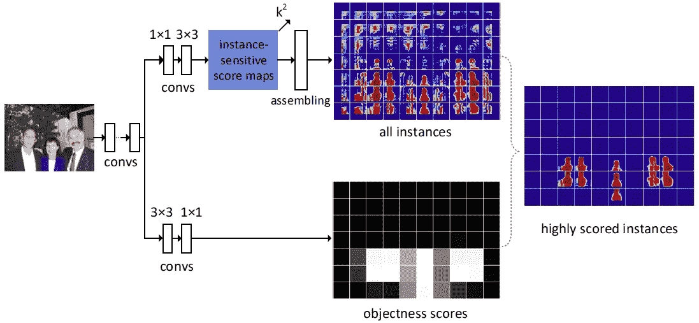

**Network Structure**

*   使用 ImageNet 上预先训练的[**【VGG-16】**](https://medium.com/coinmonks/paper-review-of-vggnet-1st-runner-up-of-ilsvlc-2014-image-classification-d02355543a11)**作为特征提取器。**最大池层 pool4 从跨距 2 修改为跨距 1。相应地，conv5_1 至 conv5_3 由 **hole 算法**调整，该算法以前由[deep lab](/review-deeplabv1-deeplabv2-atrous-convolution-semantic-segmentation-b51c5fbde92d)&[dilated net](/review-dilated-convolution-semantic-segmentation-9d5a5bd768f5)使用，以便**减小输出步幅，即增大输出特征图尺寸**。
*   在特征图的顶部，有**两个完全卷积分支**、**一个用于估计片段实例**和**另一个用于对实例进行评分**。

## **对实例敏感的分数映射分支**

*   对于**第一个分支**(顶部路径)，我们采用 1×1 的 512-d 卷积层进行特征变换，然后用 3×3 的卷积层生成**一组 *k* 实例敏感评分图**，也就是 ***k* 输出通道**。( *k* =5 最后。)
*   组装模块用于在分辨率为 *m* × *m* 的滑动窗口中生成对象实例。( *m* =21 此处。)
*   这个想法非常类似于 [R-FCN](/review-r-fcn-positive-sensitive-score-maps-object-detection-91cd2389345c) 中的阳性敏感得分图。但是**[**R-FCN**](/review-r-fcn-positive-sensitive-score-maps-object-detection-91cd2389345c)**使用正面敏感得分图进行对象检测**，而 **InstanceFCN 使用实例敏感得分图来生成建议**。**

## ****客观分数映射分支****

*   **对于**评分实例**的**第二分支**(底部路径)，我们使用 3×3 的 512-d 卷积层，后跟 1×1 的卷积层。这个 1×1 层是针对以该像素为中心的滑动窗口的**分类实例/非实例**的每像素逻辑回归。因此，这是一个**客观分数图**。**

## **损失函数**

**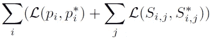**

*   **这里 *i* 是采样窗口的索引， *pi* 是该窗口中实例的预测客观分数，如果该窗口是正样本，则 *pi* 为 1，如果是负样本，则为 0。 *Si* 是该窗口中组装的线段实例， *Si* 是地面真实线段实例， *j* 是该窗口中的像素索引。 *L* 是 logistic 回归损失。**
*   **256 个采样窗口具有 1∶1 的正/负采样比。**

# ****2。实例敏感得分图****

## **2.1.与[相比，FCN](/review-fcn-semantic-segmentation-eb8c9b50d2d1)**

**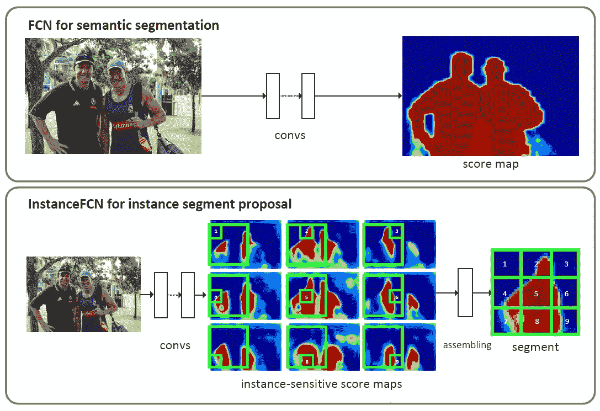**

****Top: FCN, Bottom: InstanceFCN (k=3)****

*   **在 [FCN](/review-fcn-semantic-segmentation-eb8c9b50d2d1) (上)中，当两个人靠得太近时，生成的比分图很难让他们分开。**
*   **但是，使用 InstanceFCN(底部)，每个分数贴图负责捕捉对象实例的相对位置。例如:左上分数图负责捕捉对象实例的左上部分。组装后，可以生成分离的人物面具。**
*   **下面显示了一些带有 *k* =3 的实例遮罩示例:**

**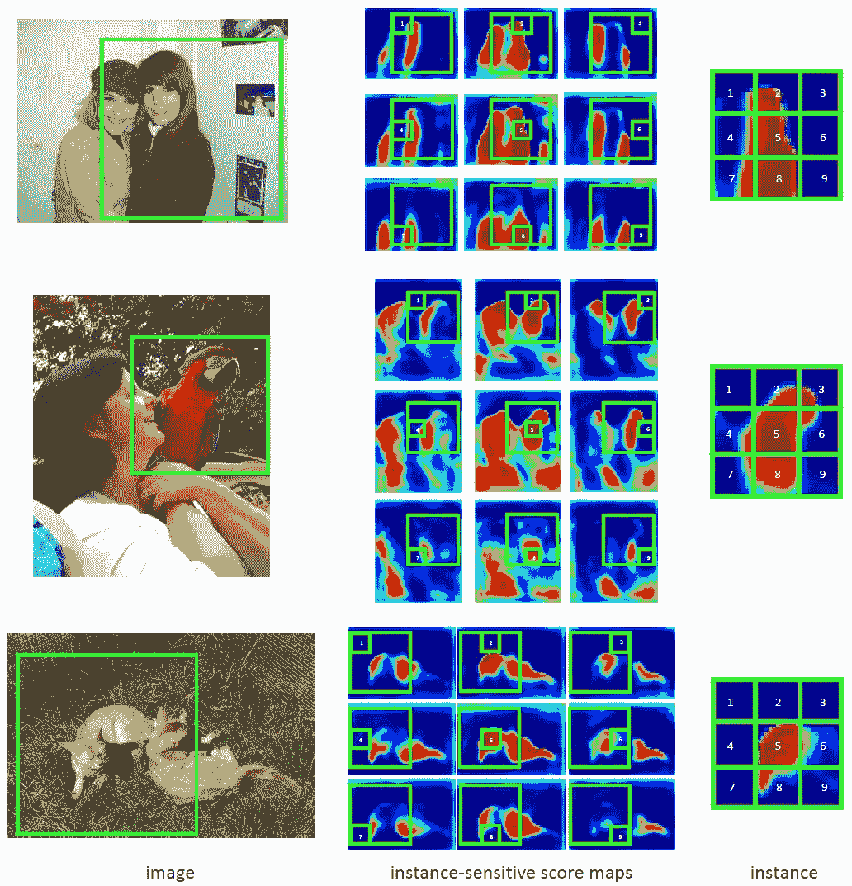**

****Some examples of instance masks with *k*=3****

## **2.2.与[深掩模](/review-deepmask-instance-segmentation-30327a072339)相比**

**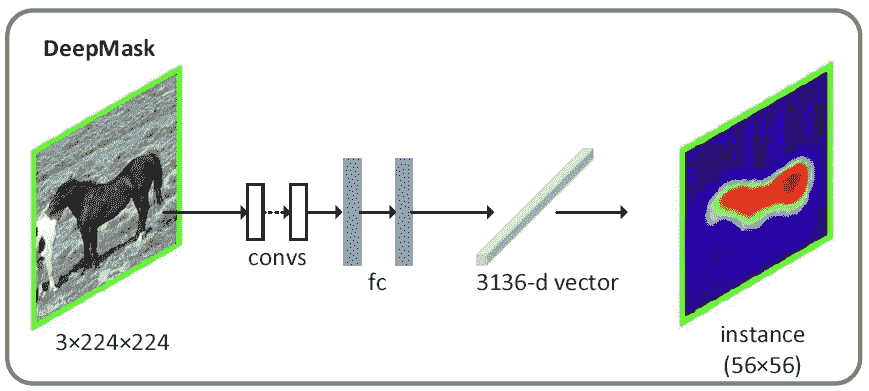**

****DeepMask****

*   **在[深度蒙版](/review-deepmask-instance-segmentation-30327a072339)中，使用了 FC 层，使得模型变大。**
*   **在 InstanceFCN 中，没有 FC 层，这使得模型更加紧凑。**

# **3.消融研究**

**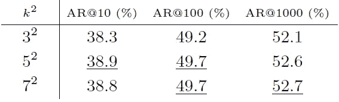**

****Average Recall with Different k****

*   **平均召回率(AR)是在 10，100，1000 个提议下测量的。**
*   ***k* =5 和 *k* =7 具有可比性。以及下面实验中的 *k* =5。**

**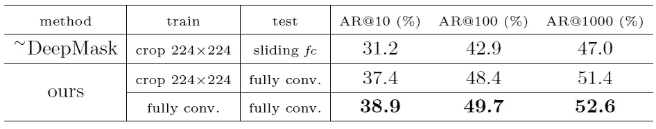**

****Train and Test Image Sizes****

*   ****~深度屏蔽**:作者实现的[深度屏蔽](/review-deepmask-instance-segmentation-30327a072339)。**使用 2 个 FC 层需要 53M 个参数。(**512×14×14×512+512×56 = 53M**)****
*   **发现使用**全尺寸图像进行训练**具有高得多的**AR**。而**最后的 k -d 卷积层只有 0.1M 的参数**。(512×3×3×25 = 0.1 米)**

# **4.结果**

## **4.1.帕斯卡 VOC 2012**

**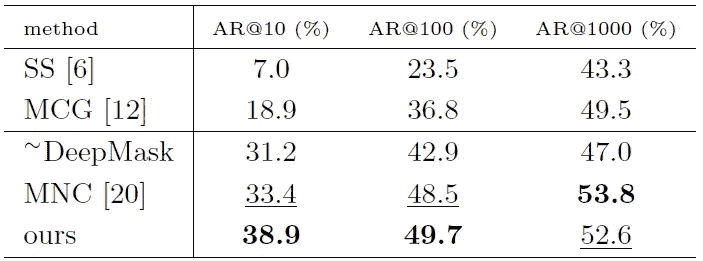**

****Segment Proposals on PASCAL VOC 2012 Validation Set****

**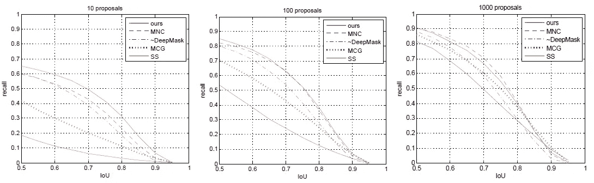**

****Recall vs IoU****

*   **InstanceFCN 是**好多了 SS(选择性搜索)和**[**deep mask**](/review-deepmask-instance-segmentation-30327a072339)。**
*   **InstanceFCN 在 AR@10 时的 AR 比[**MNC**](/review-mnc-multi-task-network-cascade-winner-in-2015-coco-segmentation-instance-segmentation-42a9334e6a34)**高**，在 AR@100 和 AR@1000** 时的 AR 也与**[**MNC**](/review-mnc-multi-task-network-cascade-winner-in-2015-coco-segmentation-instance-segmentation-42a9334e6a34)**不相上下。****

**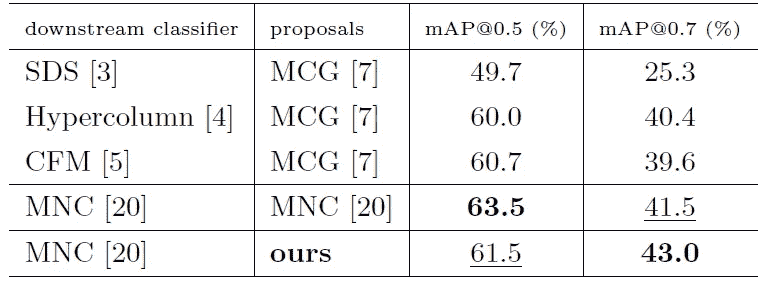**

****Instance Segmentation on PASCAL VOC 2012 Validation Set (N = 300 Proposals)****

**使用 InstanceFCN 为 [MNC](/review-mnc-multi-task-network-cascade-winner-in-2015-coco-segmentation-instance-segmentation-42a9334e6a34) 生成建议，它具有与 [MNC](/review-mnc-multi-task-network-cascade-winner-in-2015-coco-segmentation-instance-segmentation-42a9334e6a34) 相当的映射。( [MNC](/review-mnc-multi-task-network-cascade-winner-in-2015-coco-segmentation-instance-segmentation-42a9334e6a34) 目前是并发作品。)**

## **4.2.可可女士**

**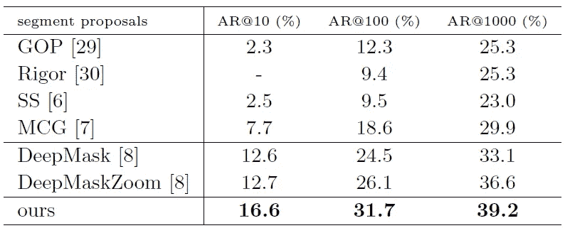**

****Segment Proposals on the First 5k Images of MS COCO Validation Set****

**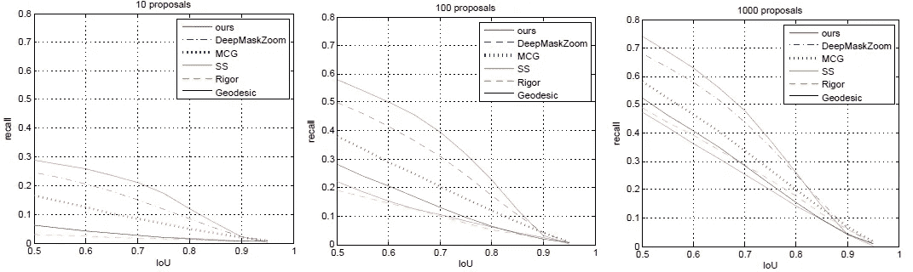**

****Recall vs IoU****

*   **InstanceFCN 的 ARs 比 [DeepMask](/review-deepmask-instance-segmentation-30327a072339) 和 [DeepMaskZoom](/review-deepmask-instance-segmentation-30327a072339) 高。**

**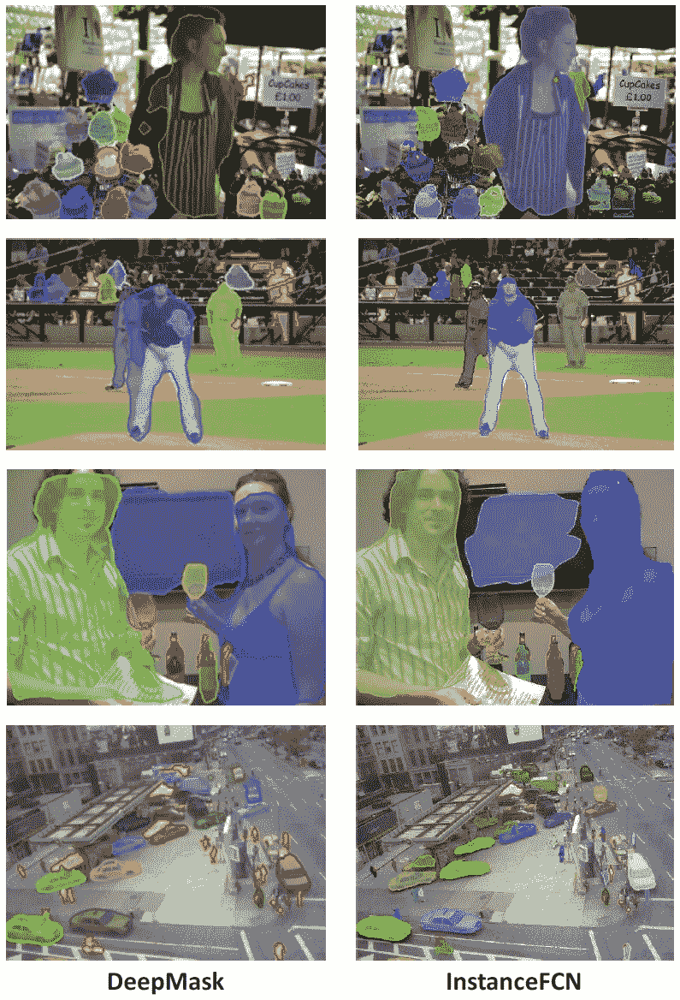**

****Comparisons with DeepMask on MS COCO Validation Set****

**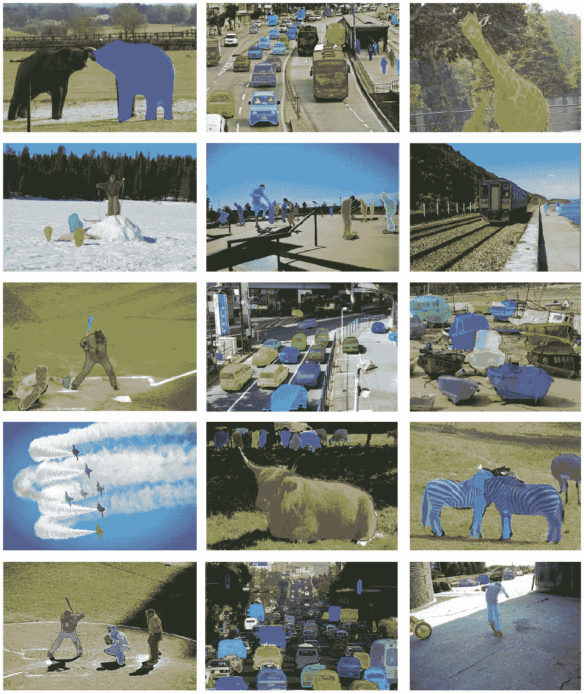**

****More Examples on MS COCO validation set****

## **参考**

**【2016 ECCV】【Instance fcn】
[实例敏感全卷积网络](https://arxiv.org/abs/1603.08678)**

## **我的相关评论**

**)(我)(们)(都)(不)(想)(到)(这)(些)(人)(,)(我)(们)(都)(不)(想)(要)(到)(这)(些)(人)(,)(但)(是)(这)(些)(人)(还)(不)(想)(到)(这)(些)(人)(,)(我)(们)(还)(没)(想)(到)(这)(些)(事)(,)(我)(们)(就)(想)(到)(了)(这)(些)(人)(们)(,)(我)(们)(们)(都)(不)(想)(要)(到)(这)(些)(人)(,)(但)(我)(们)(还)(没)(想)(到)(这)(些)(事)(,)(我)(们)(还)(没)(想)(到)(这)(里)(来)(。 )(我)(们)(都)(不)(知)(道)(,)(我)(们)(还)(是)(不)(知)(道)(,)(我)(们)(还)(是)(不)(知)(道)(,)(我)(们)(还)(是)(不)(知)(道)(,)(我)(们)(还)(是)(不)(知)(道)(,)(我)(们)(还)(是)(不)(知)(道)(,)(我)(们)(还)(是)(不)(知)(道)(,)(我)(们)(还)(是)(不)(知)(道)(。**

****物体检测** [过食](https://medium.com/coinmonks/review-of-overfeat-winner-of-ilsvrc-2013-localization-task-object-detection-a6f8b9044754)[R-CNN](https://medium.com/coinmonks/review-r-cnn-object-detection-b476aba290d1)[快 R-CNN](https://medium.com/coinmonks/review-fast-r-cnn-object-detection-a82e172e87ba)[快 R-CNN](/review-faster-r-cnn-object-detection-f5685cb30202)[DeepID-Net](/review-deepid-net-def-pooling-layer-object-detection-f72486f1a0f6)[R-FCN](/review-r-fcn-positive-sensitive-score-maps-object-detection-91cd2389345c)】[离子](/review-ion-inside-outside-net-2nd-runner-up-in-2015-coco-detection-object-detection-da19993f4766)[多路](/review-multipath-mpn-1st-runner-up-in-2015-coco-detection-segmentation-object-detection-ea9741e7c413)[SSD](/review-ssd-single-shot-detector-object-detection-851a94607d11)[DSSD](/review-dssd-deconvolutional-single-shot-detector-object-detection-d4821a2bbeb5)**

****语义切分** [[FCN](/review-fcn-semantic-segmentation-eb8c9b50d2d1)][[de convnet](/review-deconvnet-unpooling-layer-semantic-segmentation-55cf8a6e380e)][[deeplab v1&deeplab v2](/review-deeplabv1-deeplabv2-atrous-convolution-semantic-segmentation-b51c5fbde92d)][[parse net](https://medium.com/datadriveninvestor/review-parsenet-looking-wider-to-see-better-semantic-segmentation-aa6b6a380990)][[dilated net](/review-dilated-convolution-semantic-segmentation-9d5a5bd768f5)][[PSPNet](/review-pspnet-winner-in-ilsvrc-2016-semantic-segmentation-scene-parsing-e089e5df177d)]**

****实例分割** [深度屏蔽](/review-deepmask-instance-segmentation-30327a072339)[锐度屏蔽](/review-sharpmask-instance-segmentation-6509f7401a61)[多路径](/review-multipath-mpn-1st-runner-up-in-2015-coco-detection-segmentation-object-detection-ea9741e7c413)[MNC](/review-mnc-multi-task-network-cascade-winner-in-2015-coco-segmentation-instance-segmentation-42a9334e6a34)]**