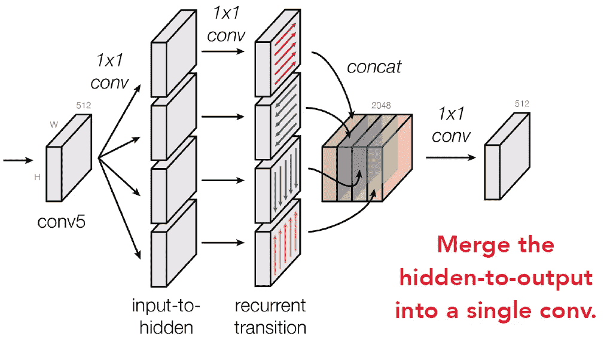

# 点评:离子—内外网，2015 年 COCO 探测(物体探测)亚军

> 原文：<https://towardsdatascience.com/review-ion-inside-outside-net-2nd-runner-up-in-2015-coco-detection-object-detection-da19993f4766?source=collection_archive---------26----------------------->

## 2015 年可可检测挑战赛最佳参赛学生和亚军

在这个故事里，**康乃尔大学**和**微软研究院**的 **ION(内外网)**进行了回顾。通过使用 skip pooling 在多个尺度和抽象级别提取信息，并使用递归神经网络(RNN)捕捉上下文特征，ion 在 **2015 MS COCO 检测挑战赛**中获得了**最佳学生参赛作品**和**第三名**。

*   **内部**:跳过 L2 正常化连接。
*   **外部**:上下文堆叠 4 向 rnn。

由于 ION 使用了一个简单的名为“IRNN”的 RNN，这也是了解 RNN 的一个良好开端。发表在 **2016 CVPR** 上，引用 **300 余次**。( [Sik-Ho Tsang](https://medium.com/u/aff72a0c1243?source=post_page-----da19993f4766--------------------------------) @中)

# 涵盖哪些内容

1.  **离子架构**
2.  **跳过池**
3.  **从香草 RNN 到四方 IRNN**
4.  **部分设计评估**
5.  **结果**

# **1。离子架构**

**ION Architecture**

## 1.1.快速 R-CNN

在最初的[快速 R-CNN](http://Fast R-CNN) 中，ROI 汇集仅在 conv5 中执行。

*   对于小对象，conv5 上的尺寸可能仅覆盖 1×1 单元，该单元可上采样至 7×7。
*   只有局部特征(ROI 内)用于分类。

## 1.2.离子

为了分别解决上述问题，

*   **内部**:con v3 至 conv5 的输出经过 L2 归一化、级联、重新缩放和 1×1 conv 降维。
*   **Outside** :在 conv5 的输出端，有 2 个堆叠的 IRNNs(一种 RNN，由 ReLUs 组成，用单位矩阵初始化。)以便利用 ROI 汇集区域之外的上下文特征。

注意，离子架构是基于 [**快速 R-CNN**](https://medium.com/coinmonks/review-fast-r-cnn-object-detection-a82e172e87ba) **使用** [**VGG16**](https://medium.com/coinmonks/paper-review-of-vggnet-1st-runner-up-of-ilsvlc-2014-image-classification-d02355543a11) **主干**开发的**。因此，网络始端的 conv1 至 conv5 和末端的全连接(FC)层均来自使用 [VGG16](https://medium.com/coinmonks/paper-review-of-vggnet-1st-runner-up-of-ilsvlc-2014-image-classification-d02355543a11) 主干的原始[快速 R-CNN](https://medium.com/coinmonks/review-fast-r-cnn-object-detection-a82e172e87ba) 。**

# 2.**跳过池**

*   **ROI 映射在多个层上执行，从 conv3 到 conv5** ，以及由 2 个 irnn 计算的**上下文特征。**
*   然而，为了匹配 FC 层的输入，需要 512×7×7 形状的尺寸。从而，在拼接之后，执行 **1×1 卷积**以**将维度**减少到 512×7×7。
*   但是**较早的层通常比后面的层**有更大的值，这一点在 [ParseNet](https://medium.com/datadriveninvestor/review-parsenet-looking-wider-to-see-better-semantic-segmentation-aa6b6a380990) 中有提到。因此，在拼接之前，每个汇集的 ROI 被 **L2 归一化** **并通过经验确定的比例重新按比例放大**。

# 3.**从香草 RNN 到四方 IRNN**

## 3.1.**香草 RNN(RNN 平原谭)**

在**香草 RNN** ( **普通 Tanh RNN** )中，Tanh 用于激活:

## 3.2.四向 IRNN

Hinton 教授的团队提出了 IRNN，它是一种 RNN，由 ReLUs 组成，并用单位矩阵初始化。(如果有兴趣，可以访问 arXiv 中的论文，论文名为“[初始化整流线性单元递归网络的简单方法](https://arxiv.org/abs/1504.00941)”。)

因为它是在一个图像内完成的，所以它是一个横向 RNN。下面是一个例子。对每一行(右/左)或每一列(下/上)重复该步骤。

和**使用基于 ReLU 的 IRNN 的 4 向 IRNN** 的简单版本如下:

上面的等式是针对右向 IRNN 的，对于左、上、下方向类似。为了提高效率，作者简化了上述四方向 IRNN。简而言之，首先，**隐藏到输出被合并到单个 conv 中，即级联之后是 1×1 卷积**:

第二，输入到隐藏也通过 **1×1 卷积被简化，并且与 4 个循环转换共享 conv**:

最后，**将两个改进的 IRNNs 堆叠在一起**以提取上下文特征:

**Two Stacked IRNN**

经过上述修改后，RNN 方程变成:

正如我们所见，**没有输入 *x* ，因为输入是由 1×1 卷积隐式完成的。**发现 ***W* 由于检测性能类似**也可以去掉:

这就像一个累加器，但是每一步之后都有 ReLU。因此，IRNN 由重复的步骤组成:积累，再积累，积累，等等。请注意，这与积分/区域图像不同，因为每一步都有 ReLU。

## 3.3.分割损失

如上图所示，由于对象检测数据集也包含语义分割标签，因此在训练过程中，**也使用上下文特征进行语义分割。**就像 [FCN](/review-fcn-semantic-segmentation-eb8c9b50d2d1) 一样，反卷积使用 32×32 的核进行 16×的上采样，并且增加了一个额外的 softmax 损失层，权重为 1。这种损失被用作**正则化器**。

在测试过程中，该分段路径被移除。因此，推理时间与没有分割损失的情况下训练的网络相同。

## 3.4.两阶段训练

如前所述，该网络基于[快速 R-CNN](https://medium.com/coinmonks/review-fast-r-cnn-object-detection-a82e172e87ba) ，使用 [VGG16](https://medium.com/coinmonks/paper-review-of-vggnet-1st-runner-up-of-ilsvlc-2014-image-classification-d02355543a11) 作为主干，因此，ImageNet 上预先训练的 [VGG16](https://medium.com/coinmonks/paper-review-of-vggnet-1st-runner-up-of-ilsvlc-2014-image-classification-d02355543a11) 用于那些公共层。并且用 conv1 至 conv5 冻结来训练网络。然后，在 conv1 和 conv2 冻结的情况下训练网络。

# 4.**部分设计评估**

消融研究在 PASCAL VOC 2007 数据集上进行。所有的训练都使用 2007 trainval 和 2012 trainval 的联合，并在 2007 测试集上进行测试。

## 4.1.泳池来自哪几层？

**Combining Features from Different Layers.**

*   如上所示，将 conv3、conv4 和 conv5 与 L2 归一化相结合，可获得最高性能的 74.6% mAP。

## 4.2.应该如何归一化特征幅度？

**Approaches to Normalizing Feature Amplitude.**

*   在 [ParseNet](https://medium.com/datadriveninvestor/review-parsenet-looking-wider-to-see-better-semantic-segmentation-aa6b6a380990) 中，它对通道求和，并对每个空间位置执行一次归一化。或者取而代之，对每个汇集的 ROI 中的所有条目求和，并将其归一化为单个斑点。
*   在缩放过程中，每个通道是固定比例还是学习比例？
*   发现所有这些方法的性能大致相同。

## 4.3.分割损失有多大帮助？

**Effect of Segmentation Loss.**

*   如上所示，分段丢失的情况下，性能始终更好。

## 4.4.我们应该如何融入语境？

**Receptive Field of Different Layer Types.**

**Comparing Approaches to Adding Context.**

*   在 conv5 之后，尝试不同类型的 conv。2 叠 3×3 和 2 叠 5×5 只是进一步的卷积。感受野是基于过滤器的大小。对于全球平均池，它有一个输入大小的感受野，但输出是相同的价值。对于 IRNN，它有一个输入大小的感受野，输出值在不同的位置是不同的。
*   当然，使用 IRNN 可以获得最高的地图。

## 4.5.哪个 IRNN 建筑？

**Varying The Hidden Transition.**

**Other Variations.**

*   包括 Whh 和具有 256 个隐藏单元获得最佳结果。并且对于第一 IRNN 仅使用左右方向的 IRNN，并且仅使用上下方向的 IRNN，具有与两个堆叠的 4 方向 IRNN 相同的结果。然而，排除 Whh，使用 512 个隐藏单元，并且最终使用两个堆叠的 4 方向 IRNN。

# 5.结果

## 5.1.帕斯卡 VOC 2007

**PASCAL VOC 2007 Test Set** (**07**: 07 trainval, **12**: 12 trainval, **S**: Segmentation labels, **R**: 4-Dir IRNN, **W**: Two rounds of box regression and weighted voting**, D**: remove all dropout, **SS**: SelectiveSearch, **EB**: EdgeBoxes**, RPN**: region proposal network, **Time**: per image, excluding proposal generation.)

*   包括所有技术在内，ION 获得了 80.1%的 mAP，并且每幅图像花费 2.0 秒，这比 30 秒的最先进的 MR-CNN 快得多。

## 5.2.帕斯卡 VOC 2012

**PASCAL VOC 2012 Test Set (07**: 07 trainval, **12**: 12 trainval, **S**: Segmentation labels, **R**: 4-Dir IRNN, **W**: Two rounds of box regression and weighted voting**, D**: remove all dropout, **SS**: SelectiveSearch, **EB**: EdgeBoxes**, RPN**: region proposal network, **Time**: per image, excluding proposal generation.)

*   与 VOC 2007 相似，包括所有技术，ION 获得 77.9%的 mAP。

## 5.3.可可女士

**MS COCO 2015 Test-Dev** (**comp**: competition submission result, **post**: post-competition result)

*   仅使用**单一模型**(无集合)，区域提案使用 MCG+RPN，**COCO 小姐竞赛提交结果获得 31.2% mAP** 。
*   并且**针对小对象的平均查准率(AP)和平均查全率(AR)分别比 [Fast R-CNN](https://medium.com/coinmonks/review-fast-r-cnn-object-detection-a82e172e87ba) (F-RCN)从 4.1%提高到 7.4%，从 7.4%提高到 11.7%。**
*   通过左右翻转和调整训练参数，对于**赛后成绩**得到 **33.1% mAP** 。

希望大家喜欢看我的故事，快乐深度学习，祝大家新年快乐！

## 参考

【2016 CVPR】【离子】
[内外网:用跳过池和递归神经网络检测上下文中的对象](https://arxiv.org/abs/1512.04143)

## 我的相关评论

)(我)(们)(都)(不)(想)(到)(这)(些)(人)(,)(我)(们)(都)(不)(想)(要)(到)(这)(些)(人)(,)(但)(是)(这)(些)(人)(还)(不)(想)(到)(这)(些)(人)(,)(我)(们)(还)(没)(想)(到)(这)(些)(事)(,)(我)(们)(就)(想)(到)(了)(这)(些)(人)(们)(,)(我)(们)(们)(都)(不)(想)(要)(到)(这)(些)(人)(,)(但)(我)(们)(还)(没)(想)(到)(这)(些)(事)(,)(我)(们)(还)(没)(想)(到)(这)(里)(来)(。 )(我)(们)(都)(不)(知)(道)(,)(我)(们)(还)(是)(不)(知)(道)(,)(我)(们)(还)(是)(不)(知)(道)(,)(我)(们)(还)(是)(不)(知)(道)(,)(我)(们)(还)(是)(不)(知)(道)(,)(我)(们)(还)(是)(不)(知)(道)(,)(我)(们)(还)(是)(不)(知)(道)(,)(我)(们)(还)(是)(不)(知)(道)(。

**物体检测** [过食](https://medium.com/coinmonks/review-of-overfeat-winner-of-ilsvrc-2013-localization-task-object-detection-a6f8b9044754)[R-CNN](https://medium.com/coinmonks/review-r-cnn-object-detection-b476aba290d1)[快 R-CNN](https://medium.com/coinmonks/review-fast-r-cnn-object-detection-a82e172e87ba)[快 R-CNN](/review-faster-r-cnn-object-detection-f5685cb30202)[DeepID-Net](/review-deepid-net-def-pooling-layer-object-detection-f72486f1a0f6)[R-FCN](/review-r-fcn-positive-sensitive-score-maps-object-detection-91cd2389345c)】[SSD](/review-ssd-single-shot-detector-object-detection-851a94607d11)[DSSD](/review-dssd-deconvolutional-single-shot-detector-object-detection-d4821a2bbeb5)[yolov 1](/yolov1-you-only-look-once-object-detection-e1f3ffec8a89)

**语义切分** [[FCN](/review-fcn-semantic-segmentation-eb8c9b50d2d1)][[de convnet](/review-deconvnet-unpooling-layer-semantic-segmentation-55cf8a6e380e)][[deeplab v1&deeplab v2](/review-deeplabv1-deeplabv2-atrous-convolution-semantic-segmentation-b51c5fbde92d)][[parse net](https://medium.com/datadriveninvestor/review-parsenet-looking-wider-to-see-better-semantic-segmentation-aa6b6a380990)][[dilated net](/review-dilated-convolution-semantic-segmentation-9d5a5bd768f5)][[PSP net](/review-pspnet-winner-in-ilsvrc-2016-semantic-segmentation-scene-parsing-e089e5df177d)]