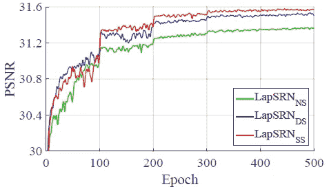

# 综述:LapSRN 和 MS-lap srn-拉普拉斯金字塔超分辨率网络(超分辨率)

> 原文：<https://towardsdatascience.com/review-lapsrn-ms-lapsrn-laplacian-pyramid-super-resolution-network-super-resolution-c5fe2b65f5e8?source=collection_archive---------10----------------------->

## 渐进重构残差、Charbonnier 损失、参数共享、局部残差学习，优于 SRCNN、VDSR、DRCN、DRRN


**32×, 16×, 8×, 4× and 2× SR**

在这个故事中，回顾了 **LapSRN(拉普拉斯金字塔超分辨率网络)**和 **MS-LapSRN** **(多尺度拉普拉斯金字塔超分辨率网络)**。通过**逐步重构子带残差**，利用**夏邦尼尔损失函数**，LapSRN 优于 [SRCNN](https://medium.com/coinmonks/review-srcnn-super-resolution-3cb3a4f67a7c) 、 [FSRCNN](/review-fsrcnn-super-resolution-80ca2ee14da4) 、 [VDSR](/review-vdsr-super-resolution-f8050d49362f) 和 [DRCN](https://medium.com/datadriveninvestor/review-drcn-deeply-recursive-convolutional-network-super-resolution-f0a380f79b20) 。有了**参数共享**、**局部残差学习**、**、**、**多尺度训练**，MS-LapSRN 甚至胜过 [DRRN](/review-drrn-deep-recursive-residual-network-super-resolution-dca4a35ce994) 。 **LapSRN** 和 **MS-LapSRN** 分别发表在 **2017 CVPR** 超过 **200 篇引用**和 **2018 TPAMI** 数十篇引用**。([曾植和](https://medium.com/u/aff72a0c1243?source=post_page-----c5fe2b65f5e8--------------------------------) @中)**

由于 MS-LapSRN 是 LapSRN 的扩展，我将只介绍 MS-LapSRN 论文中的内容，但它也涉及 LapSRN 和 MS-LapSRN 的方法和结果。

# 概述

1.  **以前方法中的问题**
2.  **LapSRN:架构**
3.  **LapSRN: Charbonnier 损失函数**
4.  **MS-LapSRN:参数共享**
5.  **MS-LapSRN:局部剩余学习(LRL)**
6.  **MS-LapSRN:多尺度训练**
7.  **消融研究**
8.  **与最先进结果的比较**

# **1。先前方法中的问题**

*   在以前的方法中有三个问题

## 1.1.双三次插值


**Bicubic Interpolation**

*   双三次插值用于在进入网络之前放大输入 LR 图像。然而，该预上采样步骤**增加了不必要的计算成本**并且**没有为重构 HR 图像**提供额外的高频信息。

## 1.2.L2 损失

*   现有方法利用 L2 损失(即，均方误差损失)来优化网络。
*   由于**同一个 LR 面片可能有多个对应的 HR 面片**而 **L2 损失未能捕捉到 HR 面片**的基本多模态分布，重建的 HR 图像往往**过平滑**和**与自然图像上的人类视觉感知**不一致。

## 1.3.单步上采样


**One-Step Upsampling**

*   这种一步上采样不能很好地超分辨精细结构，这使得学习大比例因子(例如 8 倍)的映射函数更加困难。

# **2。LapSRN:建筑**


**LapSRN / MS-LapSRN Architecture**

*   与一步上采样相反，**网络在多个金字塔等级，特别是在 log2( *S* 等级，其中 *S* 是比例因子(即 2，4，8)，渐进地重建高分辨率图像的子带残差。**
*   ****不使用双三次，直接从低分辨率输入图像中提取特征，从而降低计算负荷。****
*   **(拉普拉斯金字塔已经用了几十年。它被称为拉普拉斯金字塔，因为在特征提取分支，在每一级都有一个残余图像输出。如果感兴趣，请访问 [wiki 关于金字塔(图像处理)](https://en.wikipedia.org/wiki/Pyramid_(image_processing))，尤其是高斯金字塔&拉普拉斯金字塔。)**
*   **有**两个分支:** **特征提取&图像重建**。**

## **2.1.**特征提取****

*   ****在级别 *s* ，有 *d* 卷积层和一个转置卷积层**(或去卷积层)以 2 倍的比例对提取的特征进行上采样。**
*   **每个转置卷积层的输出**连接到两个不同的层** : **(1)用于在级别 *s*** 重构残差图像的卷积层，以及 **(2)用于在更精细级别 *s* +1** 提取特征的卷积层。**
*   ****较低级别的特征表示与较高级别**共享，因此**可以增加网络的非线性**以使**在更精细的级别学习复杂映射**。**

## **2.2.图像重建**

*   ****在级别 *s* ，输入图像通过转置卷积(上采样)层以 2 的比例上采样。**这一层用双线性内核初始化。**
*   ****上采样图像然后与来自特征提取分支的预测残差图像**组合(使用逐元素求和)以产生高分辨率输出图像。**
*   **级别 *s* 的输出 HR 图像然后被馈送到级别 *s* +1 的图像重建分支。**

# **3. **LapSRN: Charbonnier 损失函数****

****

**随着**

****

*   **LapSRN 不使用标准的 MSE 损失函数，而是使用上述损失函数。这个ρ函数是 Charbonnier 罚函数(l1 范数的可微变体)，它对于处理异常值是稳健的。**
*   ***N* :一批样品数， *L* ，金字塔级数， *ε* 设为 1e-3。**
*   **这种深度监督**指导网络训练预测不同级别的子带残差图像**和**产生多尺度输出图像**。**
*   **8 倍模型可以在一个前馈通道中产生 2 倍、4 倍和 8 倍的超分辨率结果。**
*   **上述拉普拉斯金字塔网络体系结构和 Charbonnier 损失函数被用在 LapSRN 和 MS-LapSRN 中。**

# **4. **MS-LapSRN:参数共享****

## **4.1.跨金字塔等级的参数共享**

****

****Parameter Sharing ACROSS Pyramid Levels****

*   **正如我们在图中看到的，特征嵌入子网络、上采样层和残差预测层的参数在所有金字塔等级上共享。**
*   **因此，网络参数的数量与上采样尺度无关。**

## **4.2.金字塔等级内的参数共享**

****

****Parameter Sharing WITHIN Pyramid Levels Using Recursive Blocks for the Feature Embedding Subnetwork****

*   ****特征嵌入子网具有 *R* 递归块**。**每个递归块都有 *D* 个不同的卷积层**，控制整个模型中参数的数量。**
*   ****预激活结构(** [**预激活 ResNet**](/resnet-with-identity-mapping-over-1000-layers-reached-image-classification-bb50a42af03e) **)但没有批处理规范化层被用于**递归块中。**
*   **因此，总深度变为:**

```
depth = (D × R + 1) × L + 2;
L = log2(S)
```

*   ***S* 是上采样比例因子。**
*   **括号中的 1 表示转置的卷积层。**
*   **末尾的 2 表示应用于输入图像的第一个卷积层和应用于残差的最后一个卷积层。**
*   **因此，**使用深度递归层来扩展特征嵌入子网络，以在不增加参数数量的情况下有效地增加网络深度。****

# ****5。MS-LapSRN:本地剩余学习(LRL)****

****

****Different Kinds of Local Residual Learning (LRL)****

*   **由于 LRL 是一种有效的成分，MS-LapSRN 还测试了如上所示的不同变体。**
*   ****(a) LapSRN_NS** :无跳跃连接。**
*   ****(b) LapSRN_DS** :使用与前一输出的跳过连接作为源输入，即不同源跳过连接。**
*   ****(c) LapSRN_SS** :使用跳过连接，将最开始的输出作为源，即共享源跳过连接。**

# ****6。MS-LapSRN:多尺度训练****

****

*   ****使用多尺度夏邦尼损失**。**
*   **比如说 3 级 LapSRN，所有 3 个音阶的 Charbonnier 损失加起来就是总损失。**
*   **要注意的是，这里的比例增加被限制在老 2^n×。不支持任意的上采样率。**

# ****7。消融研究****

## **7.1.一些细节**

*   **除了应用于输入图像的第一层、用于预测残差的层和图像上采样层之外的所有卷积层中的 64 个滤波器。**
*   **卷积和转置卷积层的滤波器大小分别为 3×3 和 4×4。**
*   **使用斜率为 0.2 的泄漏 ReLUs。**
*   **训练集:291 幅图像，其中 91 幅来自杨，200 幅来自 Berkeley 分割数据集。**
*   **批次大小为 64，HR 面片的大小裁剪为 128×128。**
*   **一个时期有 1000 次迭代。**
*   **数据扩充:(1)通过在[0.5，1.0]之间随机缩小图像进行缩放。(2)任意旋转 90 度、180 度或 270 度。(3)概率为 0.5 的随机水平翻转。**
*   **LR 训练面片由双三次下采样生成。**
*   **使用 MatConvNet 工具箱。**

## **7.2.金字塔结构**

****

****LapSRN with Different Components (Here, residual learning is talking about GRL or the image reconstruction branch, not LRL)****

****

****LapSRN with Different Components (Here, GRL is the image reconstruction branch, not LRL)****

*   **这里，网络使用了 10 个卷积层，测量了 4× SR 的 Set14 上的 PSNR。**
*   **与没有金字塔结构的网络(即类似于 [FSRCNN](/review-fsrcnn-super-resolution-80ca2ee14da4) )(棕色)的网络)相比，金字塔结构导致了相当大的性能提高，在 SET5 上提高了 0.7 dB，在 SET14 上提高了 0.4 dB。**

## **7.3.全球剩余学习(GRL)**

*   ****去除图像重建分支**，直接预测各级 HR 图像(蓝色)。**
*   ****蓝色曲线收敛缓慢**，训练时波动较大。**
*   **另一方面，**全 LapSRN(红色)在 10 个 epoches 内胜过** [**SRCNN**](https://medium.com/coinmonks/review-srcnn-super-resolution-3cb3a4f67a7c) **。****

## **7.4.Charbonnier 损失函数**

*   ****使用常规 L2 损失函数(绿色)的 LapSRN 比使用夏邦尼尔损失函数(红色)的 LapSRN 差**。**

## **7.5.跨金字塔等级的参数共享**

****

****Parameter Sharing Across Pyramid Levels for 4× SR model****

*   ****LapSRN 4×模型有 812k 参数。****
*   **通过跨金字塔等级共享参数，**参数的数量减少到 407k** 。**
*   **在没有 LRL 的情况下，这个模型有 **10 个卷积层( *D* )** )和 **1 个递归块( *R* )** ，称为 **LapSRN_NS-D10R1** 。**
*   ****LapSRN_NS-D10R1 在使用一半网络参数的情况下，取得了与 LapSRN 不相上下的性能。****

## **7.6.金字塔等级内的参数共享**

*   **与 **LapSRN_NS-D5R2** 和 **LapSRN_NS-D2R5** 一起，模型也共享金字塔内的参数，分别具有 222k 和 112k 参数。但是，**性能下降。****
*   **这是**，因为在金字塔等级中没有使用 LRL** 。**

## **7.7.本地剩余学习(LRL)**

****

****Different Kinds of Local Residual Learning (LRL) Using LapSRN-D5R5 on Set5 for 4× SR****

****

****Different Kinds of Local Residual Learning (LRL) Using Different Models on URBAN100 for 4× SR****

*   **如图和表所示，使用共享源的 **LapSRN_SS 具有最高的 PSNR。****

## **7.8.D 和 R 研究**

****

****Study of D and R****

****

****Study of D and R****

*   **测试不同的 *D* 和 *R* 值。**
*   **D2R5、D5R2 和 D10R1 表现不相上下。**
*   ****D4R8 在网络深度大于 80 的情况下，重建精度最好。****

## **7.9.多尺度训练**

*   **MS-LapSRN 支持多尺度训练，训练样本尺度组合为{2×} 、{4×} 、{8×} 、{2×、4×、{2×、8×、{4×、8×}和{2×、4×、8×}。**
*   ****用多尺度{2×，4×，8×}训练的 MS-LapSRN 产生最好的结果。****

# **8.**与最先进结果的比较****

## **8.1.SSIM PSNR 国际金融公司**

****

****Quantitative Results****

*   **测试了五个数据集:Set5，Set14，BSDS100，URBAN100，MANGA190。**
*   **LapSRN_SS-D5R2 的深度与 [VDSR](/review-vdsr-super-resolution-f8050d49362f) 、 [DRCN](https://medium.com/datadriveninvestor/review-drcn-deeply-recursive-convolutional-network-super-resolution-f0a380f79b20) 和 LapSRN 相似。**
*   **LapSRN_SS-D5R5 与 [DRRN](/review-drrn-deep-recursive-residual-network-super-resolution-dca4a35ce994) 深度相同。**
*   **LapSRN_SS-D5R8 对于 4× SR 有 84 层。**
*   **MS 表示使用{2×，4×，8×}的等级进行多等级训练。**
*   **LapSRN 尤其在 4 倍和 8 倍 SR 上表现良好。**
*   **LapSRN 不使用任何 3 个 SR 样本进行训练，但仍然生成与 [DRRN](/review-drrn-deep-recursive-residual-network-super-resolution-dca4a35ce994) 相当的结果。**

## **8.2.定性结果**

****

****4× SR on BSDS100, URBAN100 and MANGA109****

****

****8× SR on BSDS100, URBAN100 and MANGA109****

*   **如上图， **MS-LapSRN 精确重建平行直线、网格图案、文字。****
*   **在 8× SR 的情况下，那些使用双三次预上采样或使用一步上采样的现有技术不能很好地超分辨精细结构。**

## **8.3.执行时间**

****

****4× SR on URBAN100****

*   **使用了 3.4 GHz 英特尔 i7 CPU (32G RAM)和 NVidia Titan Xp GPU (12G 内存)。**
*   **[SRCNN](https://medium.com/coinmonks/review-srcnn-super-resolution-3cb3a4f67a7c) 和 [FSRCNN](/review-fsrcnn-super-resolution-80ca2ee14da4) 原本在 CPU 上，但被作者为 GPU 重建。**
*   **对于 URBAN100 上的 4× SR， **MS-LapSRN-D5R2 比除了**[**fsr CNN**](/review-fsrcnn-super-resolution-80ca2ee14da4)**之外的所有现有方法都要快。****
*   ****MS-LapSRN-D5R8 胜过**[**DRRN**](/review-drrn-deep-recursive-residual-network-super-resolution-dca4a35ce994)**。****

****

****2×, 4× and 8× SR****

*   **[SRCNN](https://medium.com/coinmonks/review-srcnn-super-resolution-3cb3a4f67a7c) 和 [VDSR](/review-vdsr-super-resolution-f8050d49362f) 复杂度取决于输出图像大小。对于 4×和 8× SR，它们的运行时间比 MS-LapSRN 增加得更多。**
*   **虽然 FSRCNN 速度最快，但 MS-LapSRN 的 SR 质量要高得多。**

## **8.6.模型参数**

****

****4× SR on URBAN100****

*   ****MS-LapSRN 的参数比 LapSRN 少约 73%，比**[**VDSR**](/review-vdsr-super-resolution-f8050d49362f)**少约 66%，比**[**【DRCN**](https://medium.com/datadriveninvestor/review-drcn-deeply-recursive-convolutional-network-super-resolution-f0a380f79b20)**少约 87%，比**[**DRRN**](/review-drrn-deep-recursive-residual-network-super-resolution-dca4a35ce994)**少约 25%。****

## **8.7.真实世界的照片(JPEG 压缩伪像)**

****

****4× SR****

*   **MS-LapSRN 重建出**更清晰**和**更精确**的图像。**

## **8.8.与 LAPGAN 的比较**

****

****LAPGAN ARchitecture****

****

****Comparison with LAPGAN****

*   **作者还与拉普根进行了比较。**
*   **LAPGAN 最初的目的不是为了超分辨率。它是一个用于图像纹理合成的生成式图像模型。在这里，作者使用与 LapSRN 相同的训练数据和设置来训练 LAPGAN。**
*   **最后，LapSRN 表现更好。**

## **8.9.对抗训练**

****

****4× SR****

*   **LapSRN 被扩展为一个生成网络，并使用 DCGAN 的鉴别器建立了一个鉴别网络。**
*   **具有对抗训练的网络生成关于不规则结构区域的更可信的细节，例如草和羽毛。**

## **8.10 限制**

****

****8× SR Failure Case****

*   **LapSRN 可为较大的上采样比例(例如 8 倍)生成清晰锐利的 HR 图像，它不会“幻觉”精细的细节。**

**渐进上采样让我想到了对象检测的渐进去卷积或上采样方法(如 [DSSD](/review-dssd-deconvolutional-single-shot-detector-object-detection-d4821a2bbeb5) 、 [FPN](/review-fpn-feature-pyramid-network-object-detection-262fc7482610) 、 [RetinaNet](/review-retinanet-focal-loss-object-detection-38fba6afabe4) )或语义分割(如[去卷积](/review-deconvnet-unpooling-layer-semantic-segmentation-55cf8a6e380e))。**

## **参考**

**【2017 CVPR】【LapSRN】
[深度拉普拉斯金字塔网络快速精确超分辨率](https://arxiv.org/abs/1704.03915)
& [补充材料](http://vllab.ucmerced.edu/wlai24/LapSRN/papers/cvpr17_LapSRN_supp.pdf)**

**【2018 TPAMI】【MS-LapSRN】
[深度拉普拉斯金字塔网络快速准确的图像超分辨率](https://arxiv.org/abs/1704.03915)**

## **我以前的评论**

**)(我)(们)(都)(不)(想)(到)(这)(些)(人)(,)(我)(们)(都)(不)(想)(要)(到)(这)(些)(人)(,)(但)(是)(这)(些)(人)(还)(不)(想)(到)(这)(些)(人)(,)(我)(们)(还)(不)(想)(到)(这)(些)(人)(,)(我)(们)(们)(还)(不)(想)(到)(这)(些)(人)(们)(,)(我)(们)(们)(还)(不)(想)(到)(这)(些)(人)(,)(我)(们)(们)(还)(没)(想)(到)(这)(些)(人)(,)(我)(们)(还)(没)(想)(到)(这)(里)(来)(。 )(我)(们)(都)(不)(想)(到)(这)(些)(人)(,)(我)(们)(都)(不)(想)(要)(到)(这)(里)(去)(,)(我)(们)(还)(不)(想)(到)(这)(些)(人)(,)(我)(们)(都)(不)(想)(要)(到)(这)(里)(去)(了)(,)(我)(们)(还)(不)(想)(到)(这)(些)(人)(,)(我)(们)(都)(不)(想)(到)(这)(里)(来)(。**

****物体检测** [过食](https://medium.com/coinmonks/review-of-overfeat-winner-of-ilsvrc-2013-localization-task-object-detection-a6f8b9044754)[R-CNN](https://medium.com/coinmonks/review-r-cnn-object-detection-b476aba290d1)[快 R-CNN](https://medium.com/coinmonks/review-fast-r-cnn-object-detection-a82e172e87ba)[快 R-CNN](/review-faster-r-cnn-object-detection-f5685cb30202)[DeepID-Net](/review-deepid-net-def-pooling-layer-object-detection-f72486f1a0f6)】[R-FCN](/review-r-fcn-positive-sensitive-score-maps-object-detection-91cd2389345c)】[离子](/review-ion-inside-outside-net-2nd-runner-up-in-2015-coco-detection-object-detection-da19993f4766)[多路径网](/review-multipath-mpn-1st-runner-up-in-2015-coco-detection-segmentation-object-detection-ea9741e7c413)[NoC](https://medium.com/datadriveninvestor/review-noc-winner-in-2015-coco-ilsvrc-detection-object-detection-d5cc84e372a)**

****语义切分** [FCN](/review-fcn-semantic-segmentation-eb8c9b50d2d1)[de convnet](/review-deconvnet-unpooling-layer-semantic-segmentation-55cf8a6e380e)[deeplab v1&deeplab v2](/review-deeplabv1-deeplabv2-atrous-convolution-semantic-segmentation-b51c5fbde92d)[parse net](https://medium.com/datadriveninvestor/review-parsenet-looking-wider-to-see-better-semantic-segmentation-aa6b6a380990)】[dilated net](/review-dilated-convolution-semantic-segmentation-9d5a5bd768f5)[PSP net](/review-pspnet-winner-in-ilsvrc-2016-semantic-segmentation-scene-parsing-e089e5df177d)[deeplab v3](/review-deeplabv3-atrous-convolution-semantic-segmentation-6d818bfd1d74)**

****生物医学图像分割** [[cumed vision 1](https://medium.com/datadriveninvestor/review-cumedvision1-fully-convolutional-network-biomedical-image-segmentation-5434280d6e6)][[cumed vision 2/DCAN](https://medium.com/datadriveninvestor/review-cumedvision2-dcan-winner-of-2015-miccai-gland-segmentation-challenge-contest-biomedical-878b5a443560)][[U-Net](/review-u-net-biomedical-image-segmentation-d02bf06ca760)][[CFS-FCN](https://medium.com/datadriveninvestor/review-cfs-fcn-biomedical-image-segmentation-ae4c9c75bea6)][[U-Net+ResNet](https://medium.com/datadriveninvestor/review-u-net-resnet-the-importance-of-long-short-skip-connections-biomedical-image-ccbf8061ff43)**

****实例分割
[[深度掩码](/review-deepmask-instance-segmentation-30327a072339) ] [ [锐度掩码](/review-sharpmask-instance-segmentation-6509f7401a61) ] [ [多路径网络](/review-multipath-mpn-1st-runner-up-in-2015-coco-detection-segmentation-object-detection-ea9741e7c413) ] [ [MNC](/review-mnc-multi-task-network-cascade-winner-in-2015-coco-segmentation-instance-segmentation-42a9334e6a34) ] [ [实例中心](/review-instancefcn-instance-sensitive-score-maps-instance-segmentation-dbfe67d4ee92) ] [ [FCIS](/review-fcis-winner-in-2016-coco-segmentation-instance-segmentation-ee2d61f465e2)****

**【解析度】: 【解析度】: 【解析度】: 【解析度】: 【解析度】: 【解析度】: 【解析度】: 【解析度】: 【解析度】: 【解析度】: 【解析度】: 【解析度】: 【解析度】: 【解析度】: 【解析度】: 【解析度】: 【解析度】: 【解析度】: 【解析度】: 【解析度】: 【解析度】: 【解析度】: 【解析度】: 【解析度】: 【解析度: 解析度: 【解析度】: 【解析度】: 【解析度: 解析度: 【解析度】: 【解析度】: 【解析度: 解析度: 解**