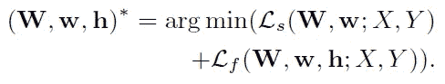

# 综述:FCN——多级多递归输入全卷积网络(生物医学图像分割)

> 原文：<https://towardsdatascience.com/review-m%C2%B2fcn-multi-stage-multi-recursive-input-fully-convolutional-networks-biomedical-image-4f8d5e3f07f1?source=collection_archive---------10----------------------->

## 在 EM 图像分割方面优于 U-Net 和 CUMedVision1

**Neuronal Structure Segmentation: An EM Image (Left), the Ground Truths for its Neuronal Boundary Detection Result (Middle), and Segmentation Result (Right)**

在这个故事中，简单回顾了**M·FCN**(**多级多递归输入全卷积网络**)，作者**上海大学**和**约翰·霍普金斯大学**。发表于 **2017 ICCV** 。( [Sik-Ho Tsang](https://medium.com/u/aff72a0c1243?source=post_page-----4f8d5e3f07f1--------------------------------) @中)

# 概述

1.  **问题和贡献**
2.  **米 FCN 模型建筑**
3.  **消融研究**
4.  **与最先进方法的比较**

# **1。问题和贡献**

在分割电子显微镜(EM)图像方面有三个主要挑战:

1.  **膜的厚度变化很大**，薄如细丝，厚如水滴。
2.  **电磁采集的噪声**使得膜的对比度很低，导致一些膜的边界甚至看不见。
3.  **混杂结构**的存在，如线粒体和囊泡，也增加了膜检测的难度。

本文的主要贡献**包括:**

1.  **端到端的多级网络架构**，其中每一级通过对不同级别施加监督来产生多个边输出，并将它们作为多个递归输入馈入下一级。
2.  **使用多个递归输入而不是单个递归输入**不仅可以提高神经元边界检测的性能，而且在生物学上也是合理的。
3.  该网络在两个公开可用的 EM 分割数据集上取得了**有希望的结果**。

# **2。M FCN 模型架构**

**The Proposed M²FCN Architecture**

## 2.1.体系结构

*   一个**整体嵌套边缘检测器(HED)网络**作为默认子网，由 **VGG-16** 网络转换而来。
*   共有 5 个级别，步长分别为 1、2、4、8 和 16，**感受野大小分别为 5、14、40、92、196** 。
*   **在每个阶段内，每个子网由多个层次**组成，每个层次由一个卷积层、一个 ReLU 层和一个最终池层的若干组合组成。
*   **每侧输出层连接到每级**的最后一个卷积层，由 1×1 卷积层和解卷积层组成，保证每侧输出的分辨率与输入的原图像相同。
*   **在【0，1】范围内，每个侧输出层**应用一个 s 形层。

## 2.2.训练阶段

*   因此， *m* 级的输入 X^(m 为:

*   其中 *X* 是输入图像，那些 *S* 是第 1 到第 *n* 级的第( *m* -1)级的侧输出，⨁是沿信道维度的级联。
*   单侧输出的交叉熵损失函数:

*   其中|B|和|B(bar)|分别是边界和非边界地面真值标签集，β=|B(bar)|/|B|，以实现正/负类平衡权重来消除由于不平衡类引起的偏差。
*   所有侧输出 *Ls* 的损失函数为:

*   此外， *m* 级有一个保险丝输出:

*   其中 *h* 为融合重量。与上面类似， *m* 级融合输出的类平衡损失函数为:

*   所有熔断输出 *Lf* 的损失函数为:

*   反向传播使 *Ls* 和 *Lf* 最小化:

*   为了训练上述级联网络，首先，训练单级网络。然后初始化为第一级网络，其余随机初始化。

# **3。消融研究**

## 3.1.评估指标

*   Rand 合并分数(左)和 Rand 分割分数(右):

*   其中 *nij* 表示建议分割的第 *i* 段和基础事实分割的第 *j* 段中体素的数量。

*   然后**使用 Rand 合并分数和 Rand 分割分数将 Rand F 分数用作评估指标**。

## 3.2.替代网络设计

*   **AD_I** :仅 1 级，作为**基线**。
*   **AD_II 到 ADVI** : 2 个阶段，4 级(较小的感受野)对 5 级(较大的感受野)，逐级对端到端，单递归对多递归，以便通过表格中的相互比较来显示每个项目的贡献。
*   **AD_VIII** :提议作为**终网**的那个，比 AD_I 到 AD_VI 都强。

**Qualitative Results for 1-stage, 2-stage and 3-stage Network**

*   红色箭头表示假阳性被更多阶段抑制。

# 4.**与最先进方法的比较**

## 4.1.小鼠梨形皮质 EM 数据集

**Mouse Piroform Cortex EM dataset**

*   有三个阶段的 FCN 是最好的。

**Precision (Rand Merge) Recall (Rand Split) Curves**

*   即使在高召回率的情况下，M FCN 也能达到高精度。

**Qualitative Results: Original Images (Left), Ground-Truth Label Maps (2nd Left), Predicted Boundary Maps (2nd Right), Predicted Label Maps (Right)**

## 4.2.ISBI 2012 EM 分段数据集

**ISBI 2012 EM Segmentation Dataset**

*   M FCN 胜过 U-Net 和 CUMedVision1 。
*   此外， **M FCN 使用 VGGNet 作为主干，其性能与使用 ResNet 作为主干的 PolyMtl 和 FusionNet 类似**。
*   作者认为，如果 FCN 人变得更有骨气，他们会有更好的结果。

## 参考

【2017 ICCV】【M·FCN】
[用于神经元边界检测的多级多递归输入全卷积网络](https://arxiv.org/abs/1703.08493)

## 我以前的评论

)(我)(们)(都)(不)(想)(到)(这)(些)(人)(,)(我)(们)(都)(不)(想)(要)(到)(这)(些)(人)(,)(但)(是)(这)(些)(人)(还)(不)(想)(到)(这)(些)(人)(,)(我)(们)(还)(没)(想)(到)(这)(些)(事)(,)(我)(们)(就)(想)(到)(了)(这)(些)(人)(们)(,)(我)(们)(们)(都)(不)(想)(要)(到)(这)(些)(人)(,)(但)(我)(们)(还)(没)(想)(到)(这)(些)(事)(,)(我)(们)(还)(没)(想)(想)(到)(这)(些)(事)(,)(我)(们)(还)(没)(想)(到)(这)(里)(去)(。 )(他)(们)(都)(不)(在)(这)(些)(事)(上)(,)(她)(们)(还)(不)(在)(这)(些)(事)(上)(有)(什)(么)(情)(况)(呢)(?)(她)(们)(都)(不)(在)(这)(些)(情)(况)(下)(,)(她)(们)(还)(不)(在)(这)(些)(事)(上)(有)(什)(么)(情)(况)(吗)(?)(她)(们)(们)(都)(不)(在)(这)(些)(事)(上)(,)(她)(们)(们)(还)(不)(在)(这)(些)(事)(上)(,)(她)(们)(们)(还)(没)(有)(什)(么)(好)(的)(情)(情)(感)(。

**物体检测** [过食](https://medium.com/coinmonks/review-of-overfeat-winner-of-ilsvrc-2013-localization-task-object-detection-a6f8b9044754)[R-CNN](https://medium.com/coinmonks/review-r-cnn-object-detection-b476aba290d1)[快 R-CNN](https://medium.com/coinmonks/review-fast-r-cnn-object-detection-a82e172e87ba)[快 R-CNN](/review-faster-r-cnn-object-detection-f5685cb30202)[MR-CNN&S-CNN](/review-mr-cnn-s-cnn-multi-region-semantic-aware-cnns-object-detection-3bd4e5648fde)[DeepID-Net](/review-deepid-net-def-pooling-layer-object-detection-f72486f1a0f6)[CRAFT](/review-craft-cascade-region-proposal-network-and-fast-r-cnn-object-detection-2ce987361858)[R-FCN](/review-r-fcn-positive-sensitive-score-maps-object-detection-91cd2389345c)】 [[TDM](https://medium.com/datadriveninvestor/review-tdm-top-down-modulation-object-detection-3f0efe9e0151)][[SSD](/review-ssd-single-shot-detector-object-detection-851a94607d11)][[DSSD](/review-dssd-deconvolutional-single-shot-detector-object-detection-d4821a2bbeb5)][[yolo v1](/yolov1-you-only-look-once-object-detection-e1f3ffec8a89)][[yolo v2/yolo 9000](/review-yolov2-yolo9000-you-only-look-once-object-detection-7883d2b02a65)][[yolo v3](/review-yolov3-you-only-look-once-object-detection-eab75d7a1ba6)][[FPN](/review-fpn-feature-pyramid-network-object-detection-262fc7482610)][[retina net](/review-retinanet-focal-loss-object-detection-38fba6afabe4)[[DCN](/review-dcn-deformable-convolutional-networks-2nd-runner-up-in-2017-coco-detection-object-14e488efce44)]

**语义切分** [FCN](/review-fcn-semantic-segmentation-eb8c9b50d2d1)[de convnet](/review-deconvnet-unpooling-layer-semantic-segmentation-55cf8a6e380e)[deeplabv 1&deeplabv 2](/review-deeplabv1-deeplabv2-atrous-convolution-semantic-segmentation-b51c5fbde92d)[CRF-RNN](/review-crf-rnn-conditional-random-fields-as-recurrent-neural-networks-semantic-segmentation-a11eb6e40c8c)】[SegNet](/review-segnet-semantic-segmentation-e66f2e30fb96)】[parse net](https://medium.com/datadriveninvestor/review-parsenet-looking-wider-to-see-better-semantic-segmentation-aa6b6a380990)[dilated net](/review-dilated-convolution-semantic-segmentation-9d5a5bd768f5)[DRN](/review-drn-dilated-residual-networks-image-classification-semantic-segmentation-d527e1a8fb5)[RefineNet](/review-refinenet-multi-path-refinement-network-semantic-segmentation-5763d9da47c1)

**生物医学图像分割** [ [累计视觉 1](https://medium.com/datadriveninvestor/review-cumedvision1-fully-convolutional-network-biomedical-image-segmentation-5434280d6e6) ] [ [累计视觉 2/DCAN](https://medium.com/datadriveninvestor/review-cumedvision2-dcan-winner-of-2015-miccai-gland-segmentation-challenge-contest-biomedical-878b5a443560)][[U-Net](/review-u-net-biomedical-image-segmentation-d02bf06ca760)][[CFS-FCN](https://medium.com/datadriveninvestor/review-cfs-fcn-biomedical-image-segmentation-ae4c9c75bea6)][[U-Net+ResNet](https://medium.com/datadriveninvestor/review-u-net-resnet-the-importance-of-long-short-skip-connections-biomedical-image-ccbf8061ff43)][[多通道](/review-multichannel-segment-colon-histology-images-biomedical-image-segmentation-d7e57902fbfc)][[V-Net](/review-v-net-volumetric-convolution-biomedical-image-segmentation-aa15dbaea974)][[3D U-Net](/review-3d-u-net-volumetric-segmentation-medical-image-segmentation-8b592560fac1)]

**实例分割** [[SDS](https://medium.com/datadriveninvestor/review-sds-simultaneous-detection-and-segmentation-instance-segmentation-80b2a8ce842b)][[Hypercolumn](/review-hypercolumn-instance-segmentation-367180495979)][[deep mask](/review-deepmask-instance-segmentation-30327a072339)][[sharp mask](/review-sharpmask-instance-segmentation-6509f7401a61)][[multipath net](/review-multipath-mpn-1st-runner-up-in-2015-coco-detection-segmentation-object-detection-ea9741e7c413)][[MNC](/review-mnc-multi-task-network-cascade-winner-in-2015-coco-segmentation-instance-segmentation-42a9334e6a34)][[Instance fcn](/review-instancefcn-instance-sensitive-score-maps-instance-segmentation-dbfe67d4ee92)[[FCIS](/review-fcis-winner-in-2016-coco-segmentation-instance-segmentation-ee2d61f465e2)]

)(我)(们)(都)(不)(知)(道)(,)(我)(们)(还)(是)(不)(知)(道)(,)(我)(们)(还)(是)(不)(知)(道)(,)(我)(们)(还)(是)(不)(知)(道)(,)(我)(们)(还)(是)(不)(知)(道)(,)(我)(们)(还)(是)(不)(知)(道)(,)(我)(们)(还)(是)(不)(知)(道)(,)(我)(们)(还)(是)(不)(知)(道)(。

 **[【DeepPose】](/review-deeppose-cascade-of-cnn-human-pose-estimation-cf3170103e36)[【汤普森 NIPS'14】](/review-tompson-nips14-joint-training-of-cnn-and-graphical-model-human-pose-estimation-95016bc510c)[【汤普森 CVPR'15】](/review-tompson-cvpr15-spatial-dropout-human-pose-estimation-c7d6a5cecd8c)**