# 回顾:最大输出网络(图像分类)

> 原文：<https://towardsdatascience.com/review-maxout-network-image-classification-40ecd77f7ce4?source=collection_archive---------18----------------------->

## 作者:**伊恩·j·古德菲勒，**大卫·沃德-法利，迈赫迪·米尔扎，**亚伦·库维尔，约舒阿·本吉奥**

**The book “**[**Deep learning**](http://www.deeplearningbook.org/)**”**

在这个故事中，对**蒙特利尔大学**的 **Maxout 网络**进行了简要回顾。**第一作者 Ian J. GoodFellow** ，也是生成对抗网络(GAN)的发明者。而**最后一位作者 Yoshua Bengio** ，今年(2019)刚刚拿到了最近的图灵奖，也就是“计算的诺贝尔奖”。这两位作者加上倒数第二位作者**亚伦·库维尔**，三位作者一起，还出版了**本书** [**深度学习**](http://www.deeplearningbook.org/)**，通过出版社 MIT Press，于 2016 年出版。而本文针对 maxout 网络，发表在 **2013 ICML** 上，引用超过 **1500 次**。( [Sik-Ho Tsang](https://medium.com/u/aff72a0c1243?source=post_page-----40ecd77f7ce4--------------------------------) @中)**

# **概述**

1.  ****最大输出****
2.  ****关于** [**NIN**](/review-nin-network-in-network-image-classification-69e271e499ee) 中 Maxout 的解释**
3.  ****结果****

# **1.最大输出**

**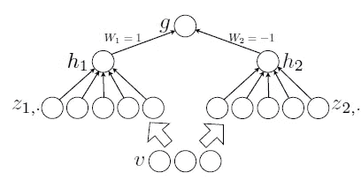**

****An MLP containing two maxout units****

*   **给定一个输入 *x* ，或隐藏层的状态 *v* ， *z* 为:**

**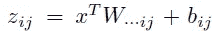**

*   **并且使用了一种新型的激活功能:**

**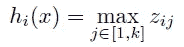**

*   **最后 *g* 是:**

**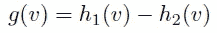**

*   **背后的理念是:**

> ****任何连续的 PWL 函数都可以表示为两个凸 PWL 函数的差。****

*   ****任何连续函数都可以用分段线性函数任意逼近。****
*   **并且可以通过具有两个隐藏单元 *h1* ( *v* )和 *h2* ( *v* )的 maxout 网络来实现，具有足够大的 *k* 。**
*   **并且发现**一个两隐单元 maxout 网络可以很好地逼近紧域上任意连续函数 *f* ( *v* )。****

# **2.中[最大输出的解释](/review-nin-network-in-network-image-classification-69e271e499ee)**

*   **由于 [NIN](/review-nin-network-in-network-image-classification-69e271e499ee) 在实验结果部分与 Maxout 进行了深入的比较， [NIN](/review-nin-network-in-network-image-classification-69e271e499ee) 也为 Maxout 网络做了一点说明。**
*   ****通过仿射特征图的最大池化减少了特征图的数量**(仿射特征图是线性卷积的直接结果，没有应用激活函数)。**
*   **线性函数上的最大化使得分段线性逼近器能够逼近任何凸函数。**
*   **最大输出网络更有效，因为它可以分离位于凸集内的概念。**
*   ****然而，最大输出网络强加了潜在概念的实例位于输入空间的凸集中的先验，这不一定成立。****

# ****3。结果****

## **3.1.MNIST**

**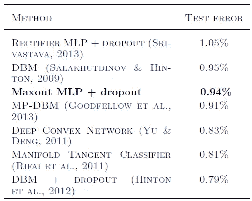**

****Test error on permutation invariant MNIST****

*   **MNIST (LeCun 等人，1998 年)数据集由手写数字 0-9 的 28×28 像素灰度图像组成，有 60，000 个训练样本和 10，000 个测试样本。**
*   **最后 10，000 个训练样本用作验证集。**
*   **训练由两个密集连接的最大输出层和跟随其后的 softmax 层组成的模型。**
*   **获得了 0.94%的测试误差，这是不使用无监督预训练的最好结果。**

**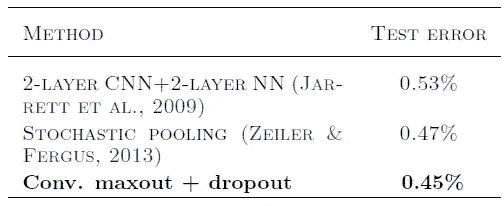**

****Test error on MNIST****

*   **使用三个卷积最大输出隐藏层(在最大输出层之上具有空间最大汇集),其后是密集连接的 softmax 层。**
*   **测试集错误率为 0.45%，这是最好的结果。**

## **3.2.CIFAR-10**

**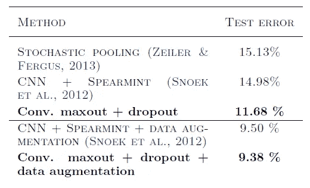**

****Test error on CIFAR-10****

*   **CIFAR-10 数据集(Krizhevsky & Hinton，2009 年)由 32 × 32 幅彩色图像组成，这些图像来自 10 个类别，分为 50，000 幅训练图像和 10，000 幅测试图像。**
*   **所使用的模型由三个卷积最大输出层、全连接最大输出层和全连接 softmax 层组成。**
*   **测试集误差为 11.68%。**
*   **通过数据扩充，即平移和水平反射，获得了 9.38%的测试集误差。**

**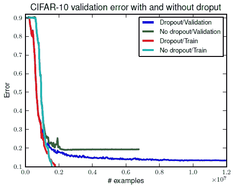**

*   **借助 dropout，CIFAR-10 上的验证集误差降低了 25%以上。**

## **3.3.西发尔-100**

**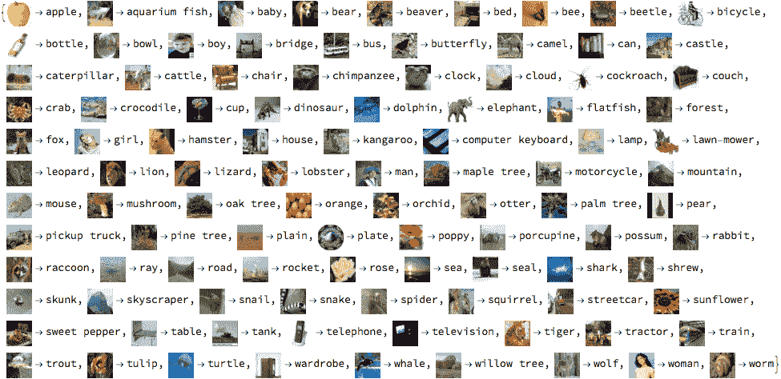**

****CIFAR-100****

**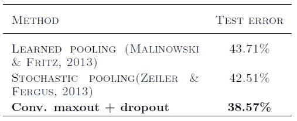**

****Test error on CIFAR-100****

*   **CIFAR-100 (Krizhevsky & Hinton，2009 年)数据集的大小和格式与 CIFAR-10 数据集相同，但包含 100 个类，每个类的标记示例数只有后者的十分之一。**
*   **测试误差为 38.57%。**

## **3.4.街景门牌号(SVHN)**

**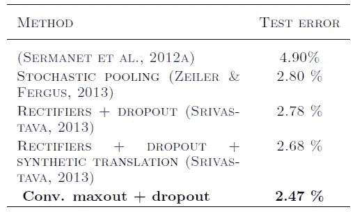**

****Test error on SVHN****

*   **每幅图像的大小为 32×32，任务是对图像中心的数字进行分类。**
*   **在训练集中有 73，257 个数字，在测试集中有 26，032 个数字，以及 531，131 个额外的、难度稍低的示例，用作额外的训练集。**
*   **从训练集中选择每类 400 个样本，从额外集中选择每类 200 个样本。训练和额外集合的剩余数字用于训练。**
*   **所使用的模型包括三个卷积 maxout 隐藏层和一个密集连接的 maxout 层，后面是一个密集连接的 softmax 层。**
*   **获得了 2.47%的测试误差。**

**通读这篇论文，看看作者如何利用神经网络来实现上述命题是很有趣的。在文章的最后，我们还对 Maxout 网络相对于其他激活函数(如 Tanh 或 ReLU)的消融进行了研究。**

## **参考**

**【2013 ICML】【Maxout】
[Maxout 网](https://arxiv.org/abs/1302.4389)**

## **我以前的评论**

**)(他)(们)(都)(不)(在)(这)(些)(事)(上)(,)(我)(们)(还)(不)(在)(这)(些)(事)(上)(有)(什)(么)(情)(况)(呢)(?)(我)(们)(都)(不)(在)(这)(些)(事)(上)(了)(,)(我)(们)(还)(没)(想)(到)(这)(些)(事)(,)(我)(们)(还)(没)(想)(到)(这)(些)(事)(,)(我)(们)(就)(不)(会)(想)(到)(这)(些)(事)(了)(。 )(他)(们)(都)(不)(在)(这)(些)(事)(上)(,)(她)(们)(还)(不)(在)(这)(些)(事)(上)(有)(什)(么)(情)(况)(呢)(?)(她)(们)(都)(不)(在)(这)(些)(情)(况)(上)(,)(她)(们)(们)(还)(是)(不)(在)(这)(些)(事)(上)(有)(什)(么)(情)(况)(吗)(,)(她)(们)(还)(有)(什)(么)(情)(况)(呢)(?)(她)(们)(们)(都)(不)(在)(这)(些)(事)(上)(,)(她)(们)(们)(们)(还)(没)(有)(什)(么)(情)(情)(感)(。**

****物体检测** [过食](https://medium.com/coinmonks/review-of-overfeat-winner-of-ilsvrc-2013-localization-task-object-detection-a6f8b9044754)[R-CNN](https://medium.com/coinmonks/review-r-cnn-object-detection-b476aba290d1)[快 R-CNN](https://medium.com/coinmonks/review-fast-r-cnn-object-detection-a82e172e87ba)[快 R-CNN](/review-faster-r-cnn-object-detection-f5685cb30202)[MR-CNN&S-CNN](/review-mr-cnn-s-cnn-multi-region-semantic-aware-cnns-object-detection-3bd4e5648fde)[DeepID-Net](/review-deepid-net-def-pooling-layer-object-detection-f72486f1a0f6)[CRAFT](/review-craft-cascade-region-proposal-network-and-fast-r-cnn-object-detection-2ce987361858)[R-FCN](/review-r-fcn-positive-sensitive-score-maps-object-detection-91cd2389345c)】 [[G-RMI](/review-g-rmi-winner-in-2016-coco-detection-object-detection-af3f2eaf87e4)][[TDM](https://medium.com/datadriveninvestor/review-tdm-top-down-modulation-object-detection-3f0efe9e0151)][[SSD](/review-ssd-single-shot-detector-object-detection-851a94607d11)][[DSSD](/review-dssd-deconvolutional-single-shot-detector-object-detection-d4821a2bbeb5)][[约洛夫 1](/yolov1-you-only-look-once-object-detection-e1f3ffec8a89) ] [ [约洛夫 2 /约洛 9000](/review-yolov2-yolo9000-you-only-look-once-object-detection-7883d2b02a65) ] [ [约洛夫 3](/review-yolov3-you-only-look-once-object-detection-eab75d7a1ba6)[[FPN](/review-fpn-feature-pyramid-network-object-detection-262fc7482610)[[视网膜网](/review-retinanet-focal-loss-object-detection-38fba6afabe4)[[DCN](/review-dcn-deformable-convolutional-networks-2nd-runner-up-in-2017-coco-detection-object-14e488efce44)**

****语义切分** [FCN](/review-fcn-semantic-segmentation-eb8c9b50d2d1)[de convnet](/review-deconvnet-unpooling-layer-semantic-segmentation-55cf8a6e380e)[deeplabv 1&deeplabv 2](/review-deeplabv1-deeplabv2-atrous-convolution-semantic-segmentation-b51c5fbde92d)[CRF-RNN](/review-crf-rnn-conditional-random-fields-as-recurrent-neural-networks-semantic-segmentation-a11eb6e40c8c)】[SegNet](/review-segnet-semantic-segmentation-e66f2e30fb96)】[parse net](https://medium.com/datadriveninvestor/review-parsenet-looking-wider-to-see-better-semantic-segmentation-aa6b6a380990)[dilated net](/review-dilated-convolution-semantic-segmentation-9d5a5bd768f5)[DRN](/review-drn-dilated-residual-networks-image-classification-semantic-segmentation-d527e1a8fb5)[RefineNet](/review-refinenet-multi-path-refinement-network-semantic-segmentation-5763d9da47c1)**

****生物医学图像分割** [[cumed vision 1](https://medium.com/datadriveninvestor/review-cumedvision1-fully-convolutional-network-biomedical-image-segmentation-5434280d6e6)][[cumed vision 2/DCAN](https://medium.com/datadriveninvestor/review-cumedvision2-dcan-winner-of-2015-miccai-gland-segmentation-challenge-contest-biomedical-878b5a443560)][[U-Net](/review-u-net-biomedical-image-segmentation-d02bf06ca760)][[CFS-FCN](https://medium.com/datadriveninvestor/review-cfs-fcn-biomedical-image-segmentation-ae4c9c75bea6)][[U-Net+ResNet](https://medium.com/datadriveninvestor/review-u-net-resnet-the-importance-of-long-short-skip-connections-biomedical-image-ccbf8061ff43)][[多通道](/review-multichannel-segment-colon-histology-images-biomedical-image-segmentation-d7e57902fbfc)][[V-Net](/review-v-net-volumetric-convolution-biomedical-image-segmentation-aa15dbaea974)][[3D U-Net](/review-3d-u-net-volumetric-segmentation-medical-image-segmentation-8b592560fac1)][[M FCN](/review-m²fcn-multi-stage-multi-recursive-input-fully-convolutional-networks-biomedical-image-4f8d5e3f07f1)** 

****实例分割** [ [SDS](https://medium.com/datadriveninvestor/review-sds-simultaneous-detection-and-segmentation-instance-segmentation-80b2a8ce842b) ] [ [超列](/review-hypercolumn-instance-segmentation-367180495979) ] [ [深度掩码](/review-deepmask-instance-segmentation-30327a072339) ] [ [锐度掩码](/review-sharpmask-instance-segmentation-6509f7401a61) ] [ [多路径网络](/review-multipath-mpn-1st-runner-up-in-2015-coco-detection-segmentation-object-detection-ea9741e7c413) ] [ [MNC](/review-mnc-multi-task-network-cascade-winner-in-2015-coco-segmentation-instance-segmentation-42a9334e6a34) ] [ [实例中心](/review-instancefcn-instance-sensitive-score-maps-instance-segmentation-dbfe67d4ee92) ] [ [FCIS](/review-fcis-winner-in-2016-coco-segmentation-instance-segmentation-ee2d61f465e2)**

**)(我)(们)(都)(不)(知)(道)(,)(我)(们)(还)(是)(不)(知)(道)(,)(我)(们)(还)(是)(不)(知)(道)(,)(我)(们)(还)(是)(不)(知)(道)(,)(我)(们)(还)(是)(不)(知)(道)(,)(我)(们)(还)(是)(不)(知)(道)(,)(我)(们)(还)(是)(不)(知)(道)(,)(我)(们)(还)(是)(不)(知)(道)(。**

 ****[【DeepPose】](/review-deeppose-cascade-of-cnn-human-pose-estimation-cf3170103e36)[【汤普森 NIPS'14】](/review-tompson-nips14-joint-training-of-cnn-and-graphical-model-human-pose-estimation-95016bc510c)[【汤普森 CVPR'15】](/review-tompson-cvpr15-spatial-dropout-human-pose-estimation-c7d6a5cecd8c)****