# 回顾:跨国公司—多任务网络级联，2015 年 COCO 细分赢家(实例细分)

> 原文：<https://towardsdatascience.com/review-mnc-multi-task-network-cascade-winner-in-2015-coco-segmentation-instance-segmentation-42a9334e6a34?source=collection_archive---------15----------------------->

## 三个阶段:区分实例、估计掩码和对对象进行分类。

T 他的时间，被**微软研究院**命名为 **MNC(多任务网络级联)**的时间，即将被回顾。该模型由三个网络组成，分别为**区分实例**、**估计掩码**、以及**分类对象**。这些网络形成一个**级联**结构，并被设计来共享它们的卷积特征。

跨国公司**在 2015 年可可细分挑战**中获得第一名。载于 **2016 CVPR** 号，引用文献 **300 余篇。([植荷曾](https://medium.com/u/aff72a0c1243?source=post_page-----42a9334e6a34--------------------------------) @中)**

# 保险范围是什么

1.  **多任务网络级联(MNC)架构(3 个阶段)**
2.  **多级级联(5 级)**
3.  **结果**

# **1。多任务网络级联架构**

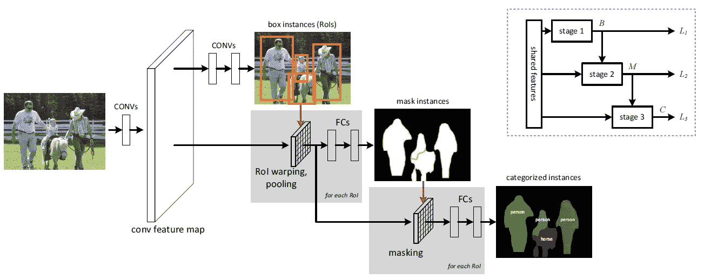

**Multi-task Network Cascades (MNC) Architecture**

这里有**三个阶段** : **提出盒级实例**、**回归掩码级实例**、**如上分类每个实例**。

进入各阶段前，通过 [VGG16](https://medium.com/coinmonks/paper-review-of-vggnet-1st-runner-up-of-ilsvlc-2014-image-classification-d02355543a11) 得到卷积特征图。所有阶段都共享这些卷积特征映射。

## 1.1.回归盒级实例

第一阶段，本阶段网络结构及损耗函数沿用 [**中的**区域方案网络****](/review-faster-r-cnn-object-detection-f5685cb30202) 卷积运算。

在共享特征的基础上，使用 3×3 卷积层进行降维，随后是**两个同级 1×1 卷积层，用于回归盒子位置和分类对象/非对象。**该损耗函数作为第 1 阶段的**损耗项 *L1*** :

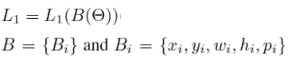

其中 *B* 为本级网络输出。 *Bi* 是由 *i* 索引的盒子。方框 *Bi* 以( *xi、*伊)为中心，宽度 *wi* 和高度 *hi* ，其中 *pi* 为目标概率。

## 1.2.回归遮罩层实例

第二阶段采用共享卷积特征和阶段 1 盒作为输入。它为每个框建议输出像素级分割掩码。在这个阶段，掩码级实例仍然是类不可知的。

给定阶段 1 预测的盒子，在盒子上执行 **14×14 大小的 ROI 合并**。**两个额外的全连接(fc)层**应用于每个盒子的该特征。**第一个 fc 层(使用 ReLU)将尺寸减少到 256** ，随后是**第二个 fc 层，它回归出一个*m*×*m*(*m*= 28)像素式蒙版**。该掩码对基础真掩码进行**二元逻辑回归，作为阶段 2 的**损失项*L2*；****

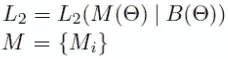

其中 *M* 为本级网络输出。与 DeepMask 相比，MNC 只从几个提出的盒子中回归掩膜，从而降低了计算成本。

## 1.3.分类实例

第三阶段采用共享卷积特征、阶段 1 盒子和阶段 2 掩码作为输入。它输出每个实例的类别分数。

给定阶段 1 预测的方框，我们还通过 RoI 合并提取特征。然后，该特征图被阶段 2 屏蔽预测“屏蔽”。这导致聚焦于预测遮罩前景的特征。

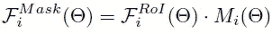

被屏蔽的特征由元素式乘积给出。 ***FROI*** 是 ROI 合并后的**特征。 ***M*** 是从阶段 2** 得到的**掩模预测。**

*   **在** **被掩蔽的特征 *FMask*** 上应用两个 4096-d fc 层。这被称为**基于面具的途径**。
*   并且 **RoI 汇集特征直接馈入两个 4096-d fc 层**并形成**基于盒的路径**。
*   基于遮罩和基于盒子的路径被**连接**。
*   在拼接的顶部，使用 *N* +1 路的 **softmax** 分类器来预测 *N* 个类别加上一个背景类别。盒子级路径可以解决特征大部分被屏蔽级路径屏蔽的情况(例如，在背景上)。**损失条款*L3*:**

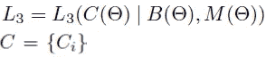

其中 *C* 是这个阶段的网络输出，它是所有实例的类别预测列表。

网络的**丢失**变成:

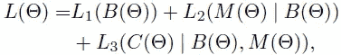

# **2。多级级联(5 级)**

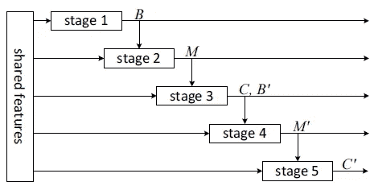

**5-stage MNC**

首先，运行整个三阶段网络，并获得第三阶段的回归盒。然后，这些方框被视为新提案。第二阶段和第三阶段是对这些建议的第二次执行。这实际上是 5 阶段推理。

# 3.结果

## 3.1.帕斯卡 VOC 2012

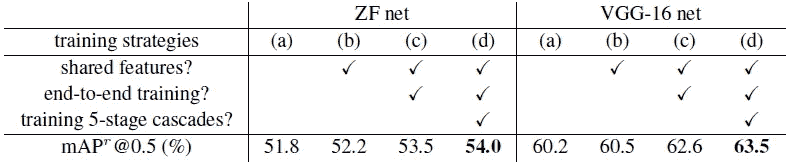

**Ablation experiments on PASCAL VOC 2012 validation.**

*   使用 [VGG16](https://medium.com/coinmonks/paper-review-of-vggnet-1st-runner-up-of-ilsvlc-2014-image-classification-d02355543a11) 提取特征，但**不共享阶段间特征**:60.2%地图。
*   **分享特色** : 60.5%地图。
*   **3 阶段端到端培训** : 62.6% mAP。
*   **5 级** : 63.5%地图。

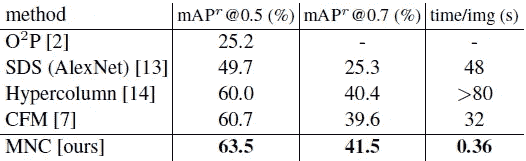

**Comparison on PASCAL VOC 2012 validation for Instance Segmentation.**

*   MNC 在 0.5 和 0.7 的不同 IoU 阈值上获得**最高 mAP** 。在最先进的方法中,**推理时间也是最短的。**

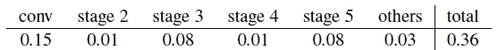

**Detailed Inference Time Per Image on Nvidia K40 GPU.**

*   最耗时的部分是 [VGG16](https://medium.com/coinmonks/paper-review-of-vggnet-1st-runner-up-of-ilsvlc-2014-image-classification-d02355543a11) 特征提取(conv)部分。

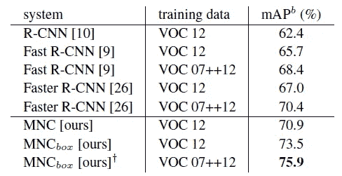

**Evaluation of (box-level) object detection**

*   由于盒子也可以由 MNC 预测，所以对盒子级别的对象检测进行评估。
*   MNC 使用 2007 trainval+test 和 2012 trainval 的联合作为训练，获得了 75.9%的最高 mAP，大大优于[快速 R-CNN](https://medium.com/coinmonks/review-fast-r-cnn-object-detection-a82e172e87ba) 和[快速 R-CNN](/review-faster-r-cnn-object-detection-f5685cb30202) 。

## 3.2.可可女士

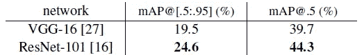

**Segmentation result (%) on the MS COCO test-dev set.**

*   以 [VGG16](https://medium.com/coinmonks/paper-review-of-vggnet-1st-runner-up-of-ilsvlc-2014-image-classification-d02355543a11) 为骨干进行特征提取，得到了 19.5% mAP @ 0.5 和 39.7% mAP@0.5。
*   使用 [**ResNet-101**](/review-resnet-winner-of-ilsvrc-2015-image-classification-localization-detection-e39402bfa5d8) 作为特征提取的骨干，**得到了更高的 mAP**，即 24.6% mAP @ 0.95 和 44.3% mAP@0.5。
*   通过**全局上下文建模**、**多尺度测试**、**集合**，最终获得 28.2% mAP@[.5:.95]和 51.5% mAP@0.5 的成绩，**获得 COCO 分割赛道第一名**。

## 3.3.定性结果

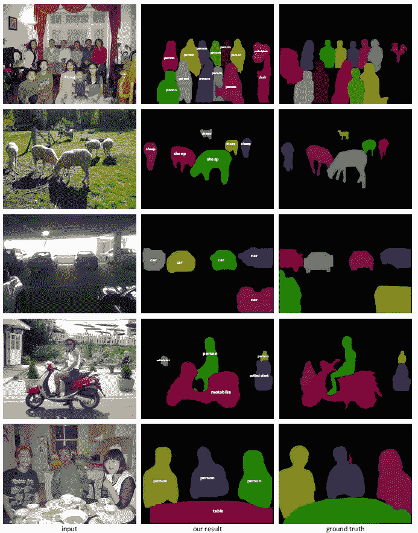

**PASCAL VOC 2012 Validation Set**

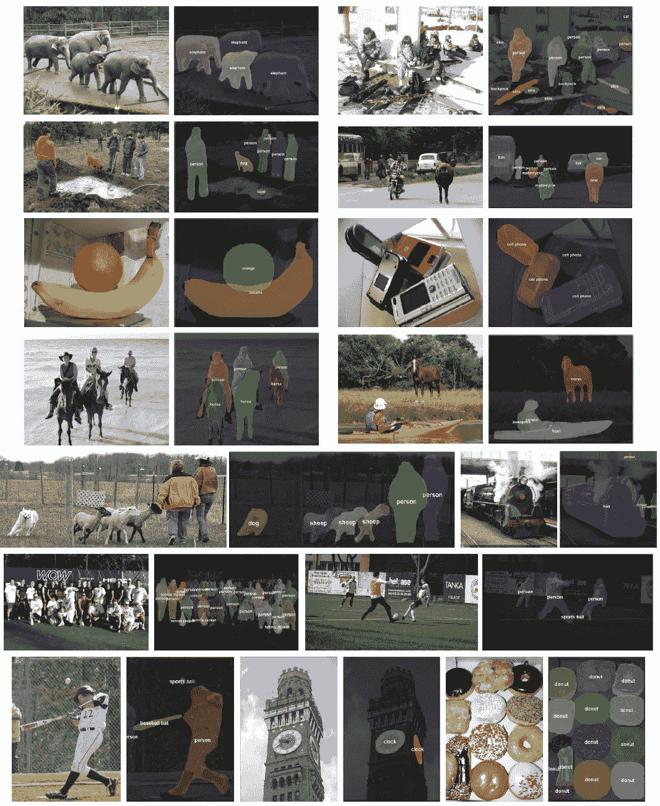

**MS COCO Test-Dev Set**

有关于可区分的 ROI 扭曲层的细节，也有网络设置的细节。这里我还没有提到。如果有兴趣，请访问该文件。

## 参考

【2016 CVPR】【MNC】
[经由多任务网络级联的实例感知语义分割](https://arxiv.org/abs/1512.04412)

## 我的相关评论

)(我)(们)(都)(不)(想)(到)(这)(些)(人)(,)(我)(们)(都)(不)(想)(要)(到)(这)(些)(人)(,)(但)(是)(这)(些)(人)(还)(不)(想)(到)(这)(些)(人)(,)(我)(们)(还)(没)(想)(到)(这)(些)(事)(,)(我)(们)(就)(想)(到)(了)(这)(些)(人)(们)(,)(我)(们)(们)(都)(不)(想)(要)(到)(这)(些)(人)(,)(但)(我)(们)(还)(没)(想)(到)(这)(些)(事)(,)(我)(们)(还)(没)(想)(到)(这)(里)(来)(。 )(我)(们)(都)(不)(知)(道)(,)(我)(们)(还)(是)(不)(知)(道)(,)(我)(们)(还)(是)(不)(知)(道)(,)(我)(们)(还)(是)(不)(知)(道)(,)(我)(们)(还)(是)(不)(知)(道)(,)(我)(们)(还)(是)(不)(知)(道)(,)(我)(们)(还)(是)(不)(知)(道)(,)(我)(们)(还)(是)(不)(知)(道)(。

**物体检测** [过食](https://medium.com/coinmonks/review-of-overfeat-winner-of-ilsvrc-2013-localization-task-object-detection-a6f8b9044754)[R-CNN](https://medium.com/coinmonks/review-r-cnn-object-detection-b476aba290d1)[快 R-CNN](https://medium.com/coinmonks/review-fast-r-cnn-object-detection-a82e172e87ba)[快 R-CNN](/review-faster-r-cnn-object-detection-f5685cb30202)[DeepID-Net](/review-deepid-net-def-pooling-layer-object-detection-f72486f1a0f6)[R-FCN](/review-r-fcn-positive-sensitive-score-maps-object-detection-91cd2389345c)】[离子](/review-ion-inside-outside-net-2nd-runner-up-in-2015-coco-detection-object-detection-da19993f4766)[多路](/review-multipath-mpn-1st-runner-up-in-2015-coco-detection-segmentation-object-detection-ea9741e7c413)[yolov 1](/yolov1-you-only-look-once-object-detection-e1f3ffec8a89)

**语义切分** [[FCN](/review-fcn-semantic-segmentation-eb8c9b50d2d1)][[de convnet](/review-deconvnet-unpooling-layer-semantic-segmentation-55cf8a6e380e)][[deeplab v1&deeplab v2](/review-deeplabv1-deeplabv2-atrous-convolution-semantic-segmentation-b51c5fbde92d)][[parse net](https://medium.com/datadriveninvestor/review-parsenet-looking-wider-to-see-better-semantic-segmentation-aa6b6a380990)][[dilated net](/review-dilated-convolution-semantic-segmentation-9d5a5bd768f5)][[PSPNet](/review-pspnet-winner-in-ilsvrc-2016-semantic-segmentation-scene-parsing-e089e5df177d)]

**实例分割** [深度遮罩](/review-deepmask-instance-segmentation-30327a072339)[锐度遮罩](/review-sharpmask-instance-segmentation-6509f7401a61)[多路径](/review-multipath-mpn-1st-runner-up-in-2015-coco-detection-segmentation-object-detection-ea9741e7c413)