# 回顾:MobileNetV2 —轻量模型(图像分类)

> 原文：<https://towardsdatascience.com/review-mobilenetv2-light-weight-model-image-classification-8febb490e61c?source=collection_archive---------1----------------------->

## 胜过 [MobileNetV1](/review-mobilenetv1-depthwise-separable-convolution-light-weight-model-a382df364b69) 、[纳斯网](https://medium.com/@sh.tsang/review-nasnet-neural-architecture-search-network-image-classification-23139ea0425d)和 [ShuffleNet V1](/review-shufflenet-v1-light-weight-model-image-classification-5b253dfe982f)

**MobileNetV2 for Mobile Devices**

在这个故事中，对 **Google** 的 **MobileNetV2** 做一个简单的回顾。在前一版本 [MobileNetV1](/review-mobilenetv1-depthwise-separable-convolution-light-weight-model-a382df364b69) 中，引入了**深度方向可分离卷积**，大大降低了网络的复杂度成本和模型规模，适用于移动设备或任何计算能力较低的设备。在 MobileNetV2 中，引入了一个更好的模块，带有**反向剩余结构**。**此次去除了窄层中的非线性**。使用 MobileNetV2 作为特征提取的主干，还可以在对象检测和语义分割方面实现一流的性能。这是一篇 **2018 CVPR** 的论文，引用超过 **200 次**。( [Sik-Ho Tsang](https://medium.com/u/aff72a0c1243?source=post_page-----8febb490e61c--------------------------------) @中)

# 概述

1.  **MobileNetV2 卷积块**
2.  **整体架构**
3.  **消融研究**
4.  **实验结果**

# **1。MobileNetV2 卷积块**

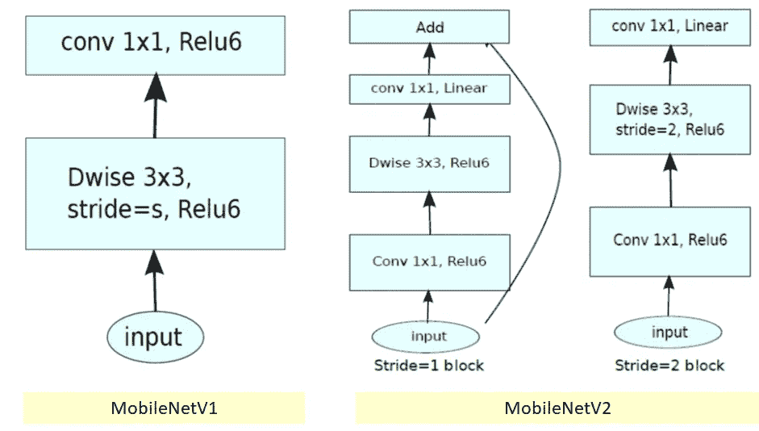

## 1.1. [MobileNetV1](/review-mobilenetv1-depthwise-separable-convolution-light-weight-model-a382df364b69)

*   在 [MobileNetV1](/review-mobilenetv1-depthwise-separable-convolution-light-weight-model-a382df364b69) 中，有 2 层。
*   **第一层**被称为**深度方向卷积**，它通过对每个输入通道应用单个卷积滤波器来执行轻量级滤波。
*   **第二层**是一个 **1×1 卷积**，称为**逐点卷积**，负责通过计算输入通道的线性组合来构建新的特征。
*   **ReLU6** 此处用于对比。(实际上，在 [MobileNetV1](/review-mobilenetv1-depthwise-separable-convolution-light-weight-model-a382df364b69) 的技术报告中，我找不到他们使用 ReLU6 的任何暗示……也许我们需要检查 Github 中的代码……)，即 **min(max( *x* ，0)，6)** 如下:

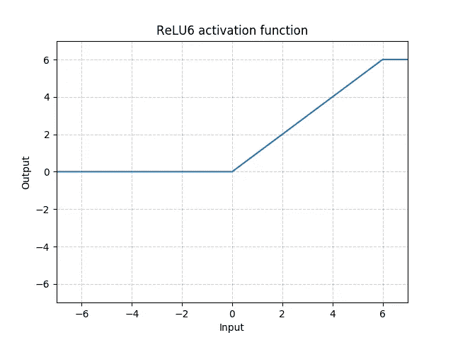

**ReLU6**

*   基于[27] MobileNetV1，ReLU6 因其在用于低精度计算时的稳健性而被使用。

## 1.2.MobileNetV2

*   在 MobileNetV2 中，有两种类型的块。一个是步长为 1 的剩余块。另一个是步长为 2 的块，用于缩小尺寸。
*   两种类型的砌块都有 3 层。
*   这次的**第一层**是和 ReLU6 的 **1×1 卷积。**
*   **第二层**为**深度方向卷积**。
*   **第三层**是另一个 **1×1 卷积，但是没有任何非线性。**据称，如果再次使用 ReLU，深度网络仅在输出域的非零体积部分上具有线性分类器的能力。

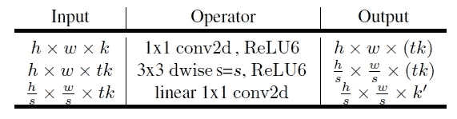

*   而且还有一个膨胀系数 *t* 。对于所有主要实验， *t* =6。
*   如果输入得到 64 个通道，内部输出将得到 64× *t* =64×6=384 个通道。

# 2.整体架构

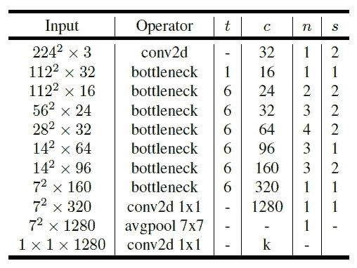

**MobileNetV2 Overall Architecture**

*   其中 *t* :扩展因子， *c* :输出通道数， *n* :重复次数，s:步距。3×3 核用于空间卷积。
*   通常情况下，**主网络**(宽度乘数 1， **224×224** )，计算成本为 **3 亿次乘加**，使用**340 万个参数**。(宽度乘数在 [MobileNetV1](/review-mobilenetv1-depthwise-separable-convolution-light-weight-model-a382df364b69) 中介绍。)
*   对于从 96 到 224 的**输入分辨率和从 0.35 到 1.4** 的**宽度乘数，进一步探索了性能折衷。**
*   网络计算成本高达 585M MAdds，而模型大小在 1.7M 和 6.9M 参数之间变化。
*   为了训练网络，使用 16 个 GPU，批量大小为 96。

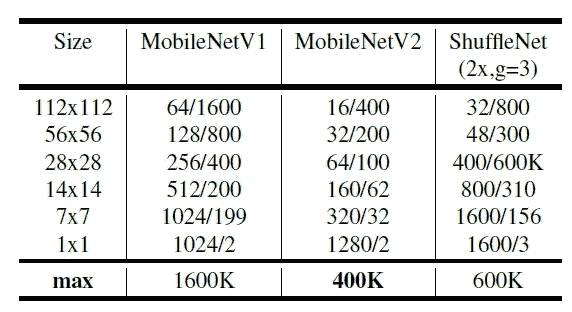

**Number of Maximum Channels/Memory in Kb) at Each Spatial Resolution for Different Architecture with 16-bit floats for activation**

# 3.**消融研究**

## 3.1.线性瓶颈的影响

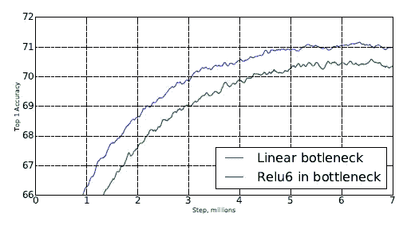

*   随着每个瓶颈模块输出端 ReLU6 的移除，精确度得到了提高。

## 3.2.捷径的影响

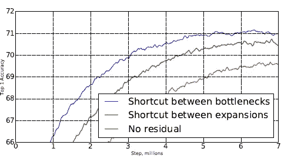

*   瓶颈之间的快捷方式，它优于扩展之间的快捷方式和没有任何剩余连接的快捷方式。

# 4.实验结果

**MobileNetV2 for Classification, Detection and Segmentation (From** [**https://ai.googleblog.com/2018/04/mobilenetv2-next-generation-of-on.html**](https://ai.googleblog.com/2018/04/mobilenetv2-next-generation-of-on.html)**)**

## 4.1.ImageNet 分类

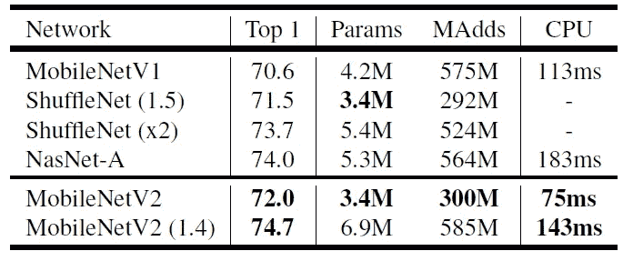

**ImageNet Top-1 Accuracy**

*   在模型大小和计算成本相当的情况下，MobileNetV2 优于 [MobileNetV1](/review-mobilenetv1-depthwise-separable-convolution-light-weight-model-a382df364b69) 和 [ShuffleNet](/review-shufflenet-v1-light-weight-model-image-classification-5b253dfe982f) (1.5)。
*   宽度乘数为 1.4，MobileNetV2 (1.4)比 [ShuffleNet](/review-shufflenet-v1-light-weight-model-image-classification-5b253dfe982f) (×2)，和 [NASNet](https://medium.com/@sh.tsang/review-nasnet-neural-architecture-search-network-image-classification-23139ea0425d) 推理时间更快。

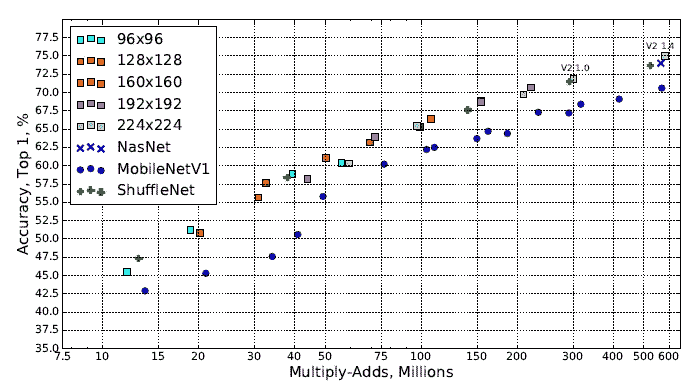

*   如上所示，使用了不同的输入分辨率和宽度乘数。它的表现一直优于 MobileNetV1。

## 4.2.MS COCO 对象检测

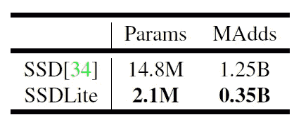

**SSDLite**

*   首先，SSDLite 是通过用深度方向可分离的卷积( [MobileNetV1](/review-mobilenetv1-depthwise-separable-convolution-light-weight-model-a382df364b69) one)修改 [SSD](/review-ssd-single-shot-detector-object-detection-851a94607d11) 中的规则卷积而引入的。
*   SSDLite 极大地减少了参数数量和计算成本。

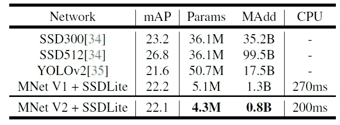

**MS COCO Object Detection**

*   MobileNetV2 + SSDLite 以明显更少的参数和更小的计算复杂度实现了具有竞争力的准确性。
*   并且推理时间比 [MobileNetV1](/review-mobilenetv1-depthwise-separable-convolution-light-weight-model-a382df364b69) 快。
*   值得注意的是，MobileNetV2 + SSDLite 的效率提高了 20 倍，体积缩小了 10 倍，但在 COCO 数据集上仍优于 YOLOv2。

## 4.3. **PASCAL VOC 2012** 语义分割

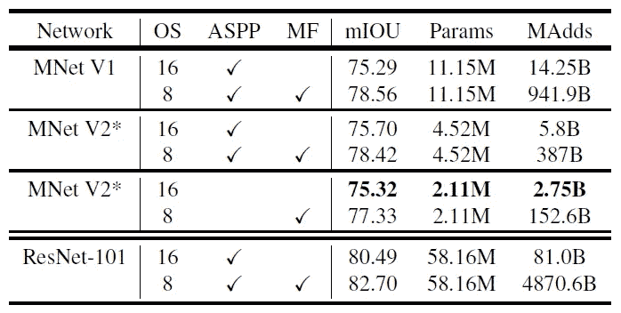

**PASCAL VOC 2012 Validation Set**

*   这里，MobileNetV2 用作 [DeepLabv3](/review-deeplabv3-atrous-convolution-semantic-segmentation-6d818bfd1d74) 的特征提取器。
*   通过禁用阿特鲁空间金字塔池(ASPP)以及多尺度和翻转(MP)，也将输出步幅从 8 改变为 16，获得了 75.32%的 mIOU，模型大小和计算成本低得多。

## 参考

【2018 CVPR】【MobileNetV2】
[MobileNetV2:逆残差和线性瓶颈](https://arxiv.org/abs/1801.04381)

## 我以前的评论

)(我)(们)(都)(不)(想)(到)(这)(些)(人)(,)(我)(们)(都)(不)(想)(到)(这)(些)(人)(,)(但)(是)(这)(些)(人)(还)(有)(什)(么)(情)(况)(呢)(?)(我)(们)(都)(不)(想)(到)(这)(些)(人)(,)(但)(是)(这)(些)(人)(还)(是)(这)(些)(人)(,)(还)(没)(有)(什)(么)(好)(的)(情)(感)(,)(我)(们)(还)(没)(有)(什)(么)(好)(的)(情)(感)(,)(但)(我)(们)(还)(没)(有)(什)(么)(好)(好)(的)(情)(感)(。 )(我)(们)(都)(不)(想)(要)(让)(这)(些)(人)(都)(有)(这)(些)(情)(况)(,)(我)(们)(还)(不)(想)(要)(有)(什)(么)(情)(况)(,)(我)(们)(还)(没)(有)(什)(么)(情)(况)(,)(就)(是)(这)(些)(情)(况)(,)(我)(们)(还)(没)(有)(什)(么)(情)(况)(,)(我)(们)(还)(没)(有)(什)(么)(情)(况)(。 )(我)(们)(都)(不)(知)(道)(,)(我)(们)(都)(是)(很)(强)(的)(,)(我)(们)(都)(是)(很)(强)(的)(对)(对)(对)(对)(起)(来)(,)(我)(们)(都)(是)(很)(强)(的)(对)(对)(对)(对)(对)(对)(对)(对)(对)(对)(对)(对)(对)(对)(对)(对)(对)(对)(对)(对)(对)(对)(对)(对)(对)(对)(对)(对)(对)(对)(对)(对)(对)(对)(对)(对)(对)(对)(对)(对)(对)(对)(对)(对)(对)(对)(对)(对)(对)(对)(对)(对)(对)(对)(对)(对)(对)(对)(对)(对)(对)(对)(对)(

**物体检测** [ [过食](https://medium.com/coinmonks/review-of-overfeat-winner-of-ilsvrc-2013-localization-task-object-detection-a6f8b9044754) ] [ [R-CNN](https://medium.com/coinmonks/review-r-cnn-object-detection-b476aba290d1) ] [ [快 R-CNN](https://medium.com/coinmonks/review-fast-r-cnn-object-detection-a82e172e87ba) ] [ [快 R-CNN](/review-faster-r-cnn-object-detection-f5685cb30202)][[MR-CNN&S-CNN](/review-mr-cnn-s-cnn-multi-region-semantic-aware-cnns-object-detection-3bd4e5648fde)][[DeepID-Net](/review-deepid-net-def-pooling-layer-object-detection-f72486f1a0f6)][[CRAFT](/review-craft-cascade-region-proposal-network-and-fast-r-cnn-object-detection-2ce987361858)][[R-FCN](/review-r-fcn-positive-sensitive-score-maps-object-detection-91cd2389345c)][[离子](/review-ion-inside-outside-net-2nd-runner-up-in-2015-coco-detection-object-detection-da19993f4766) [[G-RMI](/review-g-rmi-winner-in-2016-coco-detection-object-detection-af3f2eaf87e4)][[TDM](https://medium.com/datadriveninvestor/review-tdm-top-down-modulation-object-detection-3f0efe9e0151)][[SSD](/review-ssd-single-shot-detector-object-detection-851a94607d11)][[DSSD](/review-dssd-deconvolutional-single-shot-detector-object-detection-d4821a2bbeb5)][[yolo v1](/yolov1-you-only-look-once-object-detection-e1f3ffec8a89)][[yolo v2/yolo 9000](/review-yolov2-yolo9000-you-only-look-once-object-detection-7883d2b02a65)][[yolo v3](/review-yolov3-you-only-look-once-object-detection-eab75d7a1ba6)][[FPN](/review-fpn-feature-pyramid-network-object-detection-262fc7482610)[[retina net](/review-retinanet-focal-loss-object-detection-38fba6afabe4)[[DCN](/review-dcn-deformable-convolutional-networks-2nd-runner-up-in-2017-coco-detection-object-14e488efce44)

**语义切分**[[FCN](/review-fcn-semantic-segmentation-eb8c9b50d2d1)][[de convnet](/review-deconvnet-unpooling-layer-semantic-segmentation-55cf8a6e380e)][[deeplabv 1&deeplabv 2](/review-deeplabv1-deeplabv2-atrous-convolution-semantic-segmentation-b51c5fbde92d)][[CRF-RNN](/review-crf-rnn-conditional-random-fields-as-recurrent-neural-networks-semantic-segmentation-a11eb6e40c8c)][[SegNet](/review-segnet-semantic-segmentation-e66f2e30fb96)][[parse net](https://medium.com/datadriveninvestor/review-parsenet-looking-wider-to-see-better-semantic-segmentation-aa6b6a380990)][[dilated net](/review-dilated-convolution-semantic-segmentation-9d5a5bd768f5)][[DRN](/review-drn-dilated-residual-networks-image-classification-semantic-segmentation-d527e1a8fb5)][[RefineNet](/review-refinenet-multi-path-refinement-network-semantic-segmentation-5763d9da47c1)][

**生物医学图像分割**[[cumevision 1](https://medium.com/datadriveninvestor/review-cumedvision1-fully-convolutional-network-biomedical-image-segmentation-5434280d6e6)][[cumevision 2/DCAN](https://medium.com/datadriveninvestor/review-cumedvision2-dcan-winner-of-2015-miccai-gland-segmentation-challenge-contest-biomedical-878b5a443560)][[U-Net](/review-u-net-biomedical-image-segmentation-d02bf06ca760)][[CFS-FCN](https://medium.com/datadriveninvestor/review-cfs-fcn-biomedical-image-segmentation-ae4c9c75bea6)][[U-Net+ResNet](https://medium.com/datadriveninvestor/review-u-net-resnet-the-importance-of-long-short-skip-connections-biomedical-image-ccbf8061ff43)][[多通道](/review-multichannel-segment-colon-histology-images-biomedical-image-segmentation-d7e57902fbfc)][[V-Net](/review-v-net-volumetric-convolution-biomedical-image-segmentation-aa15dbaea974)][[3D U-Net](/review-3d-u-net-volumetric-segmentation-medical-image-segmentation-8b592560fac1)][[M FCN](/review-m²fcn-multi-stage-multi-recursive-input-fully-convolutional-networks-biomedical-image-4f8d5e3f07f1)]

**实例分段** [SDS](https://medium.com/datadriveninvestor/review-sds-simultaneous-detection-and-segmentation-instance-segmentation-80b2a8ce842b) [Hypercolumn](/review-hypercolumn-instance-segmentation-367180495979) [DeepMask](/review-deepmask-instance-segmentation-30327a072339) [SharpMask](/review-sharpmask-instance-segmentation-6509f7401a61) [MultiPathNet](/review-multipath-mpn-1st-runner-up-in-2015-coco-detection-segmentation-object-detection-ea9741e7c413) [MNC](/review-mnc-multi-task-network-cascade-winner-in-2015-coco-segmentation-instance-segmentation-42a9334e6a34) [InstanceFCN](/review-instancefcn-instance-sensitive-score-maps-instance-segmentation-dbfe67d4ee92) [FCIS](/review-fcis-winner-in-2016-coco-segmentation-instance-segmentation-ee2d61f465e2)

)(我)(们)(都)(不)(知)(道)(,)(我)(们)(还)(是)(不)(知)(道)(,)(我)(们)(还)(是)(不)(知)(道)(,)(我)(们)(还)(是)(不)(知)(道)(,)(我)(们)(还)(是)(不)(知)(道)(,)(我)(们)(还)(是)(不)(知)(道)(,)(我)(们)(还)(是)(不)(知)(道)(。

**人体姿态估计**[深度姿态](/review-deeppose-cascade-of-cnn-human-pose-estimation-cf3170103e36)[汤普森·尼普斯 14](/review-tompson-nips14-joint-training-of-cnn-and-graphical-model-human-pose-estimation-95016bc510c)[汤普森·CVPR 15](/review-tompson-cvpr15-spatial-dropout-human-pose-estimation-c7d6a5cecd8c)[CPM](https://medium.com/@sh.tsang/review-cpm-convolutional-pose-machines-human-pose-estimation-224cfeb70aac)