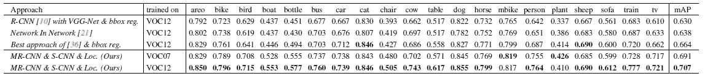

# 综述:MR-CNN 和 S-CNN——多区域语义感知 CNN(目标检测)

> 原文：<https://towardsdatascience.com/review-mr-cnn-s-cnn-multi-region-semantic-aware-cnns-object-detection-3bd4e5648fde?source=collection_archive---------15----------------------->

## 利用多区域特征和语义分割特征进行目标检测

**PASCAL VOC 2012 Dataset**

在这个故事中，回顾了**巴黎东方大学**使用 **MR-CNN & S-CNN** 的物体检测方法。提出了两条卷积神经网络(CNN)路径:

*   **多区域 CNN (MR-CNN)** :使用多个区域捕捉一个对象的几个不同方面的对象表示。
*   **分割感知 CNN (S-CNN)** :语义分割信息也被用来提高对象检测的准确性。

此外，还提出了细化包围盒的**定位机制。而这是一篇 **2015 ICCV** 论文，有超过 **200 篇引用**。( [Sik-Ho Tsang](https://medium.com/u/aff72a0c1243?source=post_page-----3bd4e5648fde--------------------------------) @中)**

# 概述

1.  **多区域 CNN (MR-CNN)**
2.  **分段感知 CNN (S-CNN)**
3.  **物体定位**
4.  **迭代定位机制**
5.  **结果**

# **1。多区域 CNN (MR-CNN)**

**Multi-Region CNN (MR-CNN)**

## 1.1.网络体系结构

*   首先，输入图像通过激活图模块，如上所示，并输出激活图。
*   使用选择性搜索生成区域提议或边界框候选。
*   对于每个候选包围盒 *B* ，生成一组区域{ *Ri* }，其中 *i* =1 到 *k，*，这就是为什么它被称为多区域。下一小节将详细介绍多区域选择。
*   在每个区域适配模块中，对每个区域 *Ri* 执行 ROI 合并，合并或裁剪的区域经过完全连接的(FC)层。
*   最后，来自所有 FC 层的输出被连接在一起以形成 1D 特征向量，该向量是边界框 *B* 的对象表示。
*   这里使用的是 [VGG-16](https://medium.com/coinmonks/paper-review-of-vggnet-1st-runner-up-of-ilsvlc-2014-image-classification-d02355543a11) ImageNet 预训练模型。移除最后一个 conv 图层后的最大池化图层。

## 1.2.区域组件

**Regions Used in Multi-Region CNN**

*   区域有两种类型:**矩形((a)-(f))** 和**矩形圆环((g)-(j))** ，如上图。
*   **原盒(a)**:R-CNN 中使用的那个。
*   **半框，(b)-(e)** :这些区域旨在使对象表示相对于遮挡更加**健壮。**
*   **中心区域，(f)-(g)** :这些区域是为了使物体表现**较少受到它旁边的其他物体或其背景**的干扰。
*   **边界区域，(h)-(i)** :这些区域旨在使对象表示**对不准确的定位**更加敏感。
*   **上下文区域(j)** :该区域**聚焦围绕对象**的上下文外观。
*   使用这些区域有帮助的原因有两个。
*   被屏蔽区域被设置为零。

## 区别特征多样化

*   这有助于使整体识别模型捕获的区别因素多样化。此处进行消融研究的模型 A 使用(A)和(I ),模型 B 使用(A)和与(A)尺寸相同的改良(I)。在 PASCAL VOC 2007 测试集上，模型 A 得到 64.1%的 mAP，模型 B 得到 62.9%，比模型 A 低 1.2 个百分点。

## 本地化感知表示

*   对于给定的候选检测框，多区域的使用对每种类型的区域上允许的可视内容施加了软约束。

# **2。分段感知 CNN (S-CNN)**

**Multi-Region CNN (MR-CNN) Extended with Segmentation-aware CNN (S-CNN)**

*   分割和检测之间有着密切的联系。和分割相关的线索通常有助于对象检测。
*   增加了两个模块:**支持语义分割特征的激活图模块**和**支持语义分割特征的区域自适应模块。**
*   这里没有用于训练的附加注释。
*   [FCN](/review-fcn-semantic-segmentation-eb8c9b50d2d1) 用于激活地图模块。
*   最后一个 FC7 层通道数从 4096 更改为 512。

**Bounding Box (Left), Segmentation Mask Based on Bounding Box (Middle), Foreground Probabilities (Right)**

*   **使用弱监督训练**策略。**使用边界框注释**创建人工前景特定类别分割掩模。
*   更具体地说，图像的地面真实边界框被投影到 [FCN](/review-fcn-semantic-segmentation-eb8c9b50d2d1) 的最后一个隐藏层的空间域上，位于投影框内的“像素”被标记为前景，而其余的被标记为背景。
*   在使用掩码训练 [FCN](/review-fcn-semantic-segmentation-eb8c9b50d2d1) 之后，最后一个分类层被删除。只有剩余的 [FCN](/review-fcn-semantic-segmentation-eb8c9b50d2d1) 被使用。
*   尽管它是弱监督训练，如上所示的前景概率仍然携带一些信息，如上所示。
*   使用的边界框比原始边界框大 1.5 倍。

# **3。物体定位**

## 3.1.用于包围盒回归的 CNN 区域适应模块

*   训练额外的区域适应模块来预测对象边界框。
*   它由两个隐藏的 FC 层和一个预测层组成，每个类别输出 4 个值(即边界框)。
*   将候选框放大 1.3 倍提供了显著的提升。

## 3.2.迭代定位

*   *Bt_c* :类 *c* 和图像 *X* 迭代 *t* 生成的 *Nc，t* 包围盒集合。
*   一开始， *t* =1，建议 *B0_c* 通过选择性搜索产生。
*   对于从 t=1 开始的每次迭代，…，T， *Bt_c* 被更新。T=2 通常就足够了。

## 3.3.包围盒投票

*   在迭代定位之后，执行包围盒投票。
*   最后一次迭代 *T* 后，从 *t* =1 到 *t* = *T* 的候选检测{ *Dt_c* }合并形成 *D_c* 。 *D_c* = { *st_i，c* ， *Bt_i，c* }其中 *s* 为分类得分， *B* 为对应的边界框。
*   首先，非最大抑制(NMS)应用于 *D_c* ，使用 0.3 的 IoU 阈值，并产生检测 *Y_c* 。
*   然后基于权重执行进一步的细化:

*   权重 *w* =max(0， *s* )，其中 *s* 为分类分数。

## 3.4.程序总结

**Object Localization: Candidates (Blue), Ground Truth (Green), and False Positives (Red)**

*   第 1 步:初始箱式建议书(仅显示相关的建议书)。
*   第二步:第一次 CNN 包围盒回归后。
*   第三步:第二次 CNN 包围盒回归后。
*   步骤 4:步骤 2 中的包围盒加上步骤 3 中的包围盒。
*   步骤 5:投票后的边界框。

# 4.结果

## 4.1.PASCAL VOC2007

**PASCAL VOC2007 Test Set**

*   所提出的方法单独使用原始盒优于所有其他单独使用的盒，并且也优于单独使用语义感知区域。

**PASCAL VOC2007 Test Set**

*   **只有单个原盒** : 61.7%图。
*   **MR-CNN** :采用多区域，66.2%地图，可见其新颖之处。
*   **MR-CNN&S-CNN**:67.5%图。
*   **MR-CNN&S-CNN&Loc**:74.9% mAP，胜过 [R-CNN](https://medium.com/coinmonks/review-r-cnn-object-detection-b476aba290d1) 。

**PASCAL VOC2007 Test Set**

*   使用 0.7 IoU 阈值，**MR-CNN&S-CNN&Loc**依然表现最佳。

**PASCAL VOC2007 Test Set, Trained with Extra Data**

*   经过额外数据训练， **MR-CNN & S-CNN & Loc** 获得 78.2%的 mAP，优于 [NoC](https://medium.com/datadriveninvestor/review-noc-winner-in-2015-coco-ilsvrc-detection-object-detection-d5cc84e372a) 、 [Fast R-CNN](https://medium.com/coinmonks/review-fast-r-cnn-object-detection-a82e172e87ba) 和[Fast R-CNN](/review-faster-r-cnn-object-detection-f5685cb30202)。

## 4.2.帕斯卡 VOC2012

**PASCAL VOC2012 Test Set**

*   与 VOC2007 类似， **MR-CNN & S-CNN & Loc** 以 70.7%的 mAP 表现最好。

**PASCAL VOC2012 Test Set, Trained with Extra Data**

*   经过额外数据训练，**MR-CNN&S-CNN&Loc**获得 73.9% mAP，优于 [NoC](https://medium.com/datadriveninvestor/review-noc-winner-in-2015-coco-ilsvrc-detection-object-detection-d5cc84e372a) 、 [YOLOv1](/yolov1-you-only-look-once-object-detection-e1f3ffec8a89) 、 [Fast R-CNN](https://medium.com/coinmonks/review-fast-r-cnn-object-detection-a82e172e87ba) 和[更快 R-CNN](/review-faster-r-cnn-object-detection-f5685cb30202) 。

## 参考

【2015 ICCV】【MR-CNN & S-CNN】
[通过多区域的对象检测&语义分割感知的 CNN 模型](https://arxiv.org/abs/1505.01749)

## 我以前的评论

)(我)(们)(都)(不)(想)(到)(这)(些)(人)(,)(我)(们)(都)(不)(想)(要)(到)(这)(些)(人)(,)(但)(是)(这)(些)(人)(还)(不)(想)(到)(这)(些)(人)(,)(我)(们)(还)(没)(想)(到)(这)(些)(事)(,)(我)(们)(就)(想)(到)(了)(这)(些)(人)(们)(,)(我)(们)(们)(都)(不)(想)(要)(到)(这)(些)(人)(,)(但)(我)(们)(还)(没)(想)(到)(这)(些)(事)(,)(我)(们)(还)(没)(想)(想)(到)(这)(些)(事)(,)(我)(们)(还)(没)(想)(到)(这)(里)(去)(。 )(我)(们)(都)(不)(想)(到)(这)(些)(人)(,)(我)(们)(都)(不)(想)(到)(这)(些)(人)(,)(但)(是)(这)(些)(人)(还)(有)(什)(么)(情)(况)(呢)(?)(我)(们)(都)(不)(想)(到)(这)(些)(人)(,)(但)(是)(这)(些)(人)(还)(是)(这)(些)(人)(,)(还)(是)(这)(些)(人)(,)(还)(没)(有)(什)(么)(好)(的)(情)(情)(况)(,)(还)(是)(这)(些)(人)(,)(我)(们)(还)(没)(想)(到)(这)(里)(来)(。

**物体检测** [过食](https://medium.com/coinmonks/review-of-overfeat-winner-of-ilsvrc-2013-localization-task-object-detection-a6f8b9044754)[R-CNN](https://medium.com/coinmonks/review-r-cnn-object-detection-b476aba290d1)[快 R-CNN](https://medium.com/coinmonks/review-fast-r-cnn-object-detection-a82e172e87ba)[快 R-CNN](/review-faster-r-cnn-object-detection-f5685cb30202)[DeepID-Net](/review-deepid-net-def-pooling-layer-object-detection-f72486f1a0f6)】[CRAFT](/review-craft-cascade-region-proposal-network-and-fast-r-cnn-object-detection-2ce987361858)[R-FCN](/review-r-fcn-positive-sensitive-score-maps-object-detection-91cd2389345c)[ION](/review-ion-inside-outside-net-2nd-runner-up-in-2015-coco-detection-object-detection-da19993f4766)[multipath Net](/review-multipath-mpn-1st-runner-up-in-2015-coco-detection-segmentation-object-detection-ea9741e7c413)【T21 [ [约洛夫 1](/yolov1-you-only-look-once-object-detection-e1f3ffec8a89) ] [ [约洛夫 2 /约洛 9000](/review-yolov2-yolo9000-you-only-look-once-object-detection-7883d2b02a65) ] [ [约洛夫 3](/review-yolov3-you-only-look-once-object-detection-eab75d7a1ba6) ] [ [FPN](/review-fpn-feature-pyramid-network-object-detection-262fc7482610) ] [ [视网膜网](/review-retinanet-focal-loss-object-detection-38fba6afabe4) ] [ [DCN](/review-dcn-deformable-convolutional-networks-2nd-runner-up-in-2017-coco-detection-object-14e488efce44) ]

**语义切分** [FCN](/review-fcn-semantic-segmentation-eb8c9b50d2d1)[de convnet](/review-deconvnet-unpooling-layer-semantic-segmentation-55cf8a6e380e)[deeplab v1&deeplab v2](/review-deeplabv1-deeplabv2-atrous-convolution-semantic-segmentation-b51c5fbde92d)[CRF-RNN](/review-crf-rnn-conditional-random-fields-as-recurrent-neural-networks-semantic-segmentation-a11eb6e40c8c)】[SegNet](/review-segnet-semantic-segmentation-e66f2e30fb96)】[parse net](https://medium.com/datadriveninvestor/review-parsenet-looking-wider-to-see-better-semantic-segmentation-aa6b6a380990)[dilated net](/review-dilated-convolution-semantic-segmentation-9d5a5bd768f5)[PSPNet](/review-pspnet-winner-in-ilsvrc-2016-semantic-segmentation-scene-parsing-e089e5df177d)[deeplab v3](/review-deeplabv3-atrous-convolution-semantic-segmentation-6d818bfd1d74)]

**生物医学图像分割** [[cumed vision 1](https://medium.com/datadriveninvestor/review-cumedvision1-fully-convolutional-network-biomedical-image-segmentation-5434280d6e6)][[cumed vision 2/DCAN](https://medium.com/datadriveninvestor/review-cumedvision2-dcan-winner-of-2015-miccai-gland-segmentation-challenge-contest-biomedical-878b5a443560)][[U-Net](/review-u-net-biomedical-image-segmentation-d02bf06ca760)][[CFS-FCN](https://medium.com/datadriveninvestor/review-cfs-fcn-biomedical-image-segmentation-ae4c9c75bea6)][[U-Net+ResNet](https://medium.com/datadriveninvestor/review-u-net-resnet-the-importance-of-long-short-skip-connections-biomedical-image-ccbf8061ff43)][[多通道](/review-multichannel-segment-colon-histology-images-biomedical-image-segmentation-d7e57902fbfc)[[V-Net](/review-v-net-volumetric-convolution-biomedical-image-segmentation-aa15dbaea974)]

**实例分割** [SDS](https://medium.com/datadriveninvestor/review-sds-simultaneous-detection-and-segmentation-instance-segmentation-80b2a8ce842b) [DeepMask](/review-deepmask-instance-segmentation-30327a072339) [SharpMask](/review-sharpmask-instance-segmentation-6509f7401a61) [MultiPathNet](/review-multipath-mpn-1st-runner-up-in-2015-coco-detection-segmentation-object-detection-ea9741e7c413) [MNC](/review-mnc-multi-task-network-cascade-winner-in-2015-coco-segmentation-instance-segmentation-42a9334e6a34) 】 [InstanceFCN](/review-instancefcn-instance-sensitive-score-maps-instance-segmentation-dbfe67d4ee92) [FCIS](/review-fcis-winner-in-2016-coco-segmentation-instance-segmentation-ee2d61f465e2)

)(我)(们)(都)(不)(知)(道)(,)(我)(们)(还)(是)(不)(知)(道)(,)(我)(们)(还)(是)(不)(知)(道)(,)(我)(们)(还)(是)(不)(知)(道)(,)(我)(们)(还)(是)(不)(知)(道)(,)(我)(们)(还)(是)(不)(知)(道)(,)(我)(们)(还)(是)(不)(知)(道)(。

(T38) 人类姿势估计 (T39)
[(T41) 汤普森 NIPS'14 [T42)]