# 综述:MSDNet——多尺度密集网络(图像分类)

> 原文：<https://towardsdatascience.com/review-msdnet-multi-scale-dense-networks-image-classification-4d949955f6d5?source=collection_archive---------9----------------------->

## 用于有限计算能力设备的使用多尺度 DenseNet 的资源有效的图像分类

在这个故事里， **MSDNet(多尺度密集网络)**，由**康乃尔大学**、**复旦大学**、**清华大学**、**脸书 AI Research (FAIR)** 进行回顾。作者在 2017 年 CVPR 发明了 [DenseNet](/review-densenet-image-classification-b6631a8ef803) (超过 2900 次引用的最佳论文奖)，他们在 **2018 ICLR** 提出了**数十次引用**的 MSDNet，这是一个**多尺度**[**dense net**](/review-densenet-image-classification-b6631a8ef803)。( [Sik-Ho Tsang](https://medium.com/u/aff72a0c1243?source=post_page-----4d949955f6d5--------------------------------) @中)

利用 MSDNet，训练具有不同资源需求的多个分类器，使得测试时间可以自适应地变化。因此，**借助高计算设备，图像可以通过网络进行图像分类**。**利用资源有限的设备，图像可以提前退出网络，进行相对较粗的图像分类**。让我们看看它是如何工作的。

# 概述

1.  **具有计算约束的图像分类概念**
2.  **MSDNet 架构**
3.  **随时分类和预算批量分类中的评估**
4.  **网络约简与懒评**
5.  **结果**

# **1。具有计算约束的图像分类概念**

具有计算约束的影像分类有两种设置

## **1.1。随时分类**

*   网络可以被强制在任何给定的时间点输出预测。
*   比如:**安卓设备上的移动应用**。

## **1.2。预算批次分类**

*   一个固定的计算预算在大量的例子中共享，在“简单”和“困难”的例子中花费不均衡。这对**大规模机器学习应用**很有用。
*   比如:**搜索引擎**，**社交媒体公司**，**网络广告代理**，都必须在有限的硬件资源上处理大量的数据。
*   截至 2010 年，谷歌图片搜索已经索引了超过 100 亿张图片，此后可能会增长到超过 1 万亿张。即使处理这些图像的新模型只比每幅图像慢 1/10 秒，这一额外成本也会增加 3170 年的 CPU 时间。
*   在预算批次分类设置中，公司可以**通过减少花费在“简单”案例上的计算量来提高平均准确性，从而为“困难”案例节省计算量。**

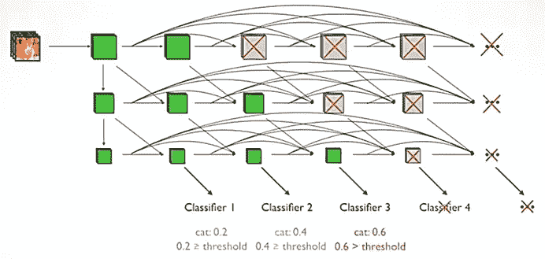

**An Illustrative Example of MSDNet**

*   如上图，MSDNet 是多尺度 [DenseNet](/review-densenet-image-classification-b6631a8ef803) 。上面的路径用于未缩小的图像，下面的路径用于较小比例的图像。
*   比如说，有一个我们想要分类的猫的图像，通过网络，也许**猫的分类有一个大于阈值的 0.6 的分类置信度，我们可以提前退出。**下面的网络可以跳过**节省“简易”图像的计算时间。**
*   另一方面，对于“硬”图像，我们可以通过更深的网络，直到分类置信度高于阈值。
*   因此，通过利用花费在“容易”和“困难”图像上的时间，可以节省计算时间。

# **2。MSDNet 架构**

## 2.1.体系结构

**MSDNet Architecture**

*   其纵向布局如同一个微型的***S*-layers”卷积网络( *S* =3)** 。
*   对于第一层( *l* = 1)，通过下采样获得较粗尺度的特征图。
*   对于 *l* =1 且比例 *s* 的后续图层，来自比例 *s* 和 *s* -1 的所有先前特征地图的特征地图被连接。使用 conv(1×1)-BN-ReLU-conv(3×3)-BN-ReLU。
*   更准确地说，下图和下表显示了在某些 *s* 和 *l* 处使用的特征图。

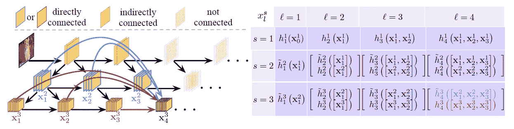

**The feature maps used at certain *s* and *l***

*   **在某些位置，有一些中间分类器被插入到网络的中间。**
*   每个分类器有两个带 128 维 3×3 滤波器的下采样卷积层，后面是一个 2×2 平均池层和一个线性层。
*   在训练过程中，**逻辑损失函数 *L* ( *fk* )用于每个分类器**，使加权累积损失最小化:

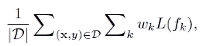

*   其中 d 表示训练集， *wk* ⩾ 0 表示分类器的权重 *k* 。
*   *wk* =1 凭经验。

## 2.2.使用不同网络的中间分类器的评估

*   **你可能会问，为什么不直接在 [ResNet](/review-resnet-winner-of-ilsvrc-2015-image-classification-localization-detection-e39402bfa5d8) 或者 [DenseNet](/review-densenet-image-classification-b6631a8ef803) 中插入中间分类器呢？为什么我们必须需要 MSDNet？作者也对此进行了评估。主要有两个原因。**

**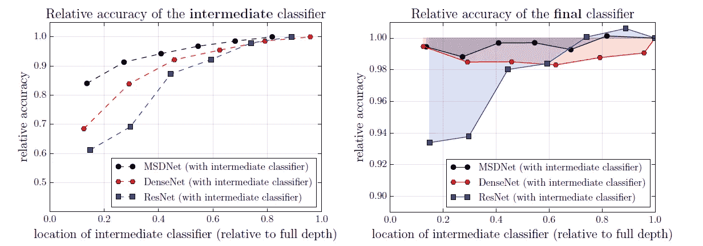**

****Evaluation of Intermediate Classifiers Using Different Networks on CIFAR-100 Dataset****

## **2.2.1.第一个原因**

*   ****问题:缺乏粗层次的特征。**传统的神经网络学习早期层的细尺度和后期层的粗尺度的特征。早期层缺乏粗级别特征，并且附属于这些层的早期退出分类器将可能产生不令人满意的高错误率。**
*   **上图左侧显示了中间分类器的结果，它们也被插入到 [ResNet](/review-resnet-winner-of-ilsvrc-2015-image-classification-localization-detection-e39402bfa5d8) 和 [DenseNet](/review-densenet-image-classification-b6631a8ef803) 中。**分类器的准确性与其在网络中的位置高度相关。**特别是在 [ResNet](/review-resnet-winner-of-ilsvrc-2015-image-classification-localization-detection-e39402bfa5d8) (蓝线)的情况下，可以观察到一个可见的“楼梯”图案，在第二和第四分类器之后有很大的改进——位于合并层之后。**
*   ****解决方案:多尺度特征图**。MSDNet 在整个网络中保持多个尺度的特征表示，并且所有分类器仅使用粗级别的特征。**
*   ****横向连接保存并推进高分辨率信息**，有利于后续图层高质量粗特征的构建。**垂直连接产生易于分类的粗糙特征**。**

## **2.2.2.第二个原因**

*   ****问题:前期量词干扰后期量词。**上图右侧显示了作为单个中间分类器位置的函数的最终分类器的精度，相对于没有中间分类器的网络的精度。**
*   ****一个中间分类器的引入损害了最终的** [**ResNet**](/review-resnet-winner-of-ilsvrc-2015-image-classification-localization-detection-e39402bfa5d8) **分类器(蓝线)，降低其准确率高达 7%。在 [ResNet](/review-resnet-winner-of-ilsvrc-2015-image-classification-localization-detection-e39402bfa5d8) 中，这种精度下降可能是由影响早期特征的中间分类器引起的，这些早期特征是为短期而不是为最终层优化的。****
*   ****解决方案:密集连接。**相比之下， [DenseNet](/review-densenet-image-classification-b6631a8ef803) (红线)受此影响要小得多。这是因为在 [DenseNet](/review-densenet-image-classification-b6631a8ef803) 中，特征图是使用连接而不是在 [ResNet](/review-resnet-winner-of-ilsvrc-2015-image-classification-localization-detection-e39402bfa5d8) 中使用加法来组合的。早期图层的要素地图可以通过密集连接绕过后期图层。最终分类器的性能变得(或多或少)独立于中间分类器的位置。**

# **3.**随时分类和预算批量分类中的评估****

## **3.1.随时分类**

*   **在任意时间分类中，每个测试实例都有 **a 有限的计算预算*B*0 可用。****
*   **在任意时间设置的测试期间，**输入通过网络传播，直到预算 *B* 用尽，并输出最近的预测。****

## **3.2.预算批分类**

*   **在预算批量分类中，模型需要**在预先已知的有限计算预算*B*0**内对一组实例 Dtest = { *x* 1，…， *xM* }进行分类。**
*   **它可以通过**花费少于 *B* / *M* 的计算对一个“简单”的例子**进行分类，而**使用多于 *B* / *M* 的计算对一个“困难”的例子**进行分类。**
*   **所以这里考虑的预算 *B* 是我们有大批量测试样本时的软约束。**
*   **然后，使用**动态评估**来解决这个问题:**
*   **在测试时间，**如果一个示例的预测置信度**(作为置信度度量的 softmax 概率的最大值)**超过预定阈值 *θk* ，则该示例遍历网络并在分类器 *fk* 之后退出。****
*   ****在训练之前，我们计算处理网络直到第 *k* 个分类器所需的计算成本 *Ck* 。****
*   **我们用 **0 < q ≤ 1 表示一个固定的退出概率，即到达分类器的样本将获得一个有足够置信度退出**的分类。**
*   ****样本在分类器*k*处存在的概率:****

**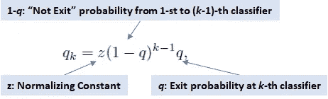**

*   **其中 z 是归一化常数，使得:**

****

*   **我们需要确保在 Dtest 中对所有样本进行分类的总成本不超过我们的预算 B，这就产生了约束条件:**

**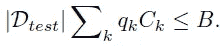**

*   **然后，我们可以**为 *q* 解决上述问题，并在保留/确认集合上分配阈值 *θk* ，使得大约一小部分 *qk* 确认样本在第 *k* 分类器处退出。****

# ****4。网络还原和懒评****

*   **有两种简单的方法可以进一步降低 MSDNets 的计算要求。**

**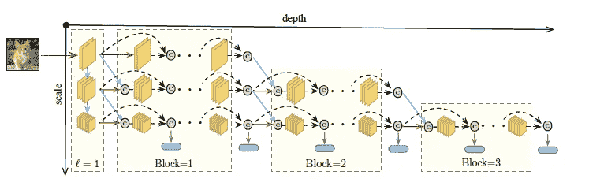**

*   **首先，在网络的最后一层之前维护所有更精细的尺度是低效的。减小网络大小的一个简单策略是通过沿着深度维度将其分成 *S* 个块，并且**仅保留第 *i* 个块中的最粗略的( *S* - *i* +1)尺度，如上所示。**这降低了训练和测试的计算成本。**
*   **第二，由于层 *l* 的分类器仅使用来自最粗尺度的特征，层 *l* 中的更精细特征图(以及先前的 *S* -2 层中的一些更精细特征图)不影响该分类器的预测。因此，**“对角块”中的计算被分组为**，使得我们**仅沿着下一个分类器的评估所需的路径传播该示例。当我们因为计算预算耗尽而需要停止时，这可以最大限度地减少不必要的计算。这个策略叫做**懒评估。******

# ****5。结果****

## **5.1.数据集**

*   ****CIFAR-10 & CIFAR-100** :两个 CIFAR 数据集包含 50000 个训练和 10000 个 32×32 像素的测试图像。**5000 幅训练图像作为验证集。**数据集分别包括 10 个和 100 个类。标准数据扩充、随机裁剪和水平翻转被应用于训练集。小批量是 64 个。**
*   ****ImageNet**:ImageNet 数据集包含 1000 个类，共有 120 万张训练图像和 5 万张验证图像。**从训练集中挑选出 50，000 幅图像来估计 MSDNet 中分类器的置信度阈值。**应用标准数据扩充。在测试时，224×224 中心裁剪的图像被调整为 256×256 像素用于分类。小批量是 256 个。**
*   **在 ImageNet 上，使用了 4 种比例尺，即 *S* =4，每层分别生成 16、32、64 和 64 幅特征图。原始图像在进入第一层 MSDNets 之前，首先通过 7×7 卷积和 3×3 最大池(都具有步长 2)进行变换。**

## **5.2.消融研究**

**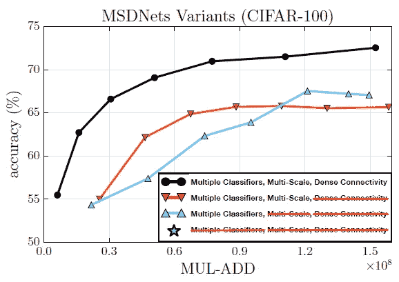**

****Ablation Study on CIFAR-100****

*   **使用具有六个中间分类器的 MSDNet，并且三个主要组件，**多尺度特征图**、**密集连通性**和**中间分类器**被一次移除一个。**
*   **如果去掉 MSDNet 中的所有三个部分，就得到一个规则的类似 VGG 的卷积网络。**
*   **为了使我们的比较公平，我们通过调整网络宽度，即每层输出通道的数量，使整个网络的计算成本保持相似，约为 3.0×10⁸浮点。**
*   **最初的 MSDNet(黑色)当然具有最高的准确性。**
*   **移除密集连接(橙色)后，整体精度会受到严重影响。**
*   **加上移除的多尺度卷积(浅蓝色)，精度仅在较低预算区域受到损害。这与作者的动机一致，即多尺度设计在早期引入了区别性特征。**
*   **作者还提到，去掉所有 3 个组件后，在特定预算下，它(Star)的性能与 MSDNet 相似。(但是我在图上找不到星星……)**

## **5.3.随时分类**

*   **MSDNet 网络有 24 层。**
*   **分类器对第 2×( *i* +1)层的输出进行操作，其中 *i* =1，…，11。**
*   **在 ImageNet 上，第 *i* 个分类器对第( *k* × *i* +3)层进行操作，i=1，…，5，其中 k=4，6，7。**

**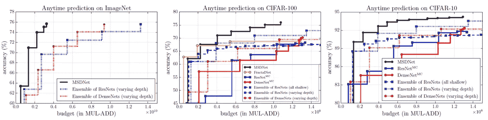**

****Top-1 Accuracy of Anytime Classification on ImageNet (Left),CIFAR-100 (Middle) & CIFAR-10 (Right)****

*   ****ResNetMC** : [ResNet](/review-resnet-winner-of-ilsvrc-2015-image-classification-localization-detection-e39402bfa5d8) 具有 MC(多分类器)，62 层，每个空间分辨率具有 10 个残差块(对于三个分辨率):早期退出分类器在每个分辨率的第 4 和第 8 个残差块的输出上，产生总共 6 个中间分类器(加上最终分类层)。**
*   ****dense netm**:[dense netm](/review-densenet-image-classification-b6631a8ef803)带 MC，52 层，三个密集区块，每个区块 16 层。六个中间分类器被附加到每个块中的第 6 和第 12 层，也与该块中的所有先前层紧密连接。**
*   **完全评估时，ResNetMC 和 DenseNetMC 都需要大约 1.3×10⁸浮点运算。**
*   ****具有不同深度**的[**resnet**](/review-resnet-winner-of-ilsvrc-2015-image-classification-localization-detection-e39402bfa5d8)**/**[**dense net**](/review-densenet-image-classification-b6631a8ef803)**的系综也被评估。在测试时，按顺序(按网络大小的升序)评估网络，以获得测试数据的预测。所有预测在评估的分类器上平均。在 ImageNet 上，[和](/review-resnet-winner-of-ilsvrc-2015-image-classification-localization-detection-e39402bfa5d8)[的集合分别生成深度从 10 层到 50 层和 36 层到 121 层不等的](/review-densenet-image-classification-b6631a8ef803)和[的集合。](/review-densenet-image-classification-b6631a8ef803)****
*   **在 CIFAR-100 上，MSDNet 在任何范围内都大大优于 ResNetMC 和 DenseNetMC。这是由于在仅仅几层之后，MSDNets 已经产生了低分辨率特征图，这些低分辨率特征图比 [ResNets](/review-resnet-winner-of-ilsvrc-2015-image-classification-localization-detection-e39402bfa5d8) 或 [DenseNets](/review-densenet-image-classification-b6631a8ef803) 的早期层中的高分辨率特征图更适合分类。**
*   **在极低预算制度下，集合具有优势，因为它们的预测是由第一(小)网络执行的，该网络专门针对低预算进行优化。然而，当预算增加时，集合的精度不会增加得那么快。**
*   **与 MSDNets 不同，**集成重复相似的低级特征的计算。****
*   ****当所有的网络都很浅时，集合精度很快饱和。****

## **5.4.预算批分类**

*   **在 CIFAR-10 和 CIFAR-100 上，MSDNet 网络从 10 层到 36 层不等。第 *k* 个分类器被附加到{1+...+ *k* }层。**
*   **在 ImageNet 上，使用与任何时候分类中的网络相同的网络。**

**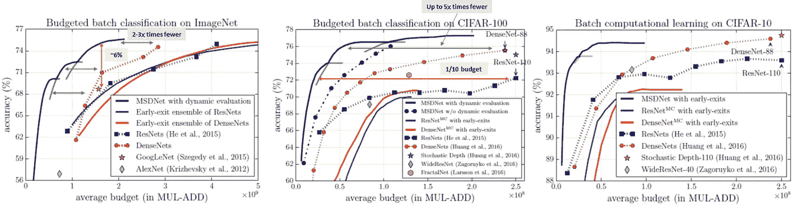**

****Top-1 Accuracy of Budgeted Batch Classification on ImageNet (Left),CIFAR-100 (Middle) & CIFAR-10 (Right)****

*   **在预算批分类中，预测模型接收一批 *M* 实例和用于分类所有 *M* 实例的计算预算 *B* 。使用动态评估。**
*   **在 ImageNet 上， *M* =128，比较了五个[densenet](/review-densenet-image-classification-b6631a8ef803)，五个[resnet](/review-resnet-winner-of-ilsvrc-2015-image-classification-localization-detection-e39402bfa5d8)，一个 AlexNet，一个 GoogLeNet。**
*   ****五个**[**ResNet**](/review-resnet-winner-of-ilsvrc-2015-image-classification-localization-detection-e39402bfa5d8)**的集合:“易”图像仅通过最小的**[**ResNet-10**](/review-resnet-winner-of-ilsvrc-2015-image-classification-localization-detection-e39402bfa5d8)传播，而**“难”图像由所有五个**[**ResNet**](/review-resnet-winner-of-ilsvrc-2015-image-classification-localization-detection-e39402bfa5d8)**模型分类。**(预测是集合中所有评估网络的平均值)。**
*   **在 CIFAR-100 上， *M* =256， [ResNets](/review-resnet-winner-of-ilsvrc-2015-image-classification-localization-detection-e39402bfa5d8) ， [DenseNets](/review-densenet-image-classification-b6631a8ef803) ，[随机深度网](/review-stochastic-depth-image-classification-a4e225807f4a)，[宽 ResNets](/review-wrns-wide-residual-networks-image-classification-d3feb3fb2004) ， [FractalNets](https://medium.com/datadriveninvestor/review-fractalnet-image-classification-c5bdd855a090) ，ResNetMC 和 DenseNetMC 进行了比较。**
*   **如上图所示，**使用了三个不同深度的 MSD net**，这样它们就可以组合在一起覆盖大范围的计算预算。**
*   **例如，在 ImageNet 上，**以 1.7×10⁹ FLOPs 的平均预算，MSDNet 实现了大约 75%的顶级精度，比具有相同 FLOPs 数量的** [**ResNet**](/review-resnet-winner-of-ilsvrc-2015-image-classification-localization-detection-e39402bfa5d8) **实现的精度高大约 6%。****
*   ****与计算效率高的**[**dense nets**](/review-densenet-image-classification-b6631a8ef803)**相比，MSDNet 使用约 2 至 3 倍的 FLOPs** 来实现相同的分类精度。**
*   **在 CIFAR-100 上，MSDNets 在所有预算中的表现始终优于所有基准。**
*   ****MSDNet 的性能与 110 层的**[**ResNet**](/review-resnet-winner-of-ilsvrc-2015-image-classification-localization-detection-e39402bfa5d8)**不相上下，只使用 1/10 的计算预算。****
*   ****MSDNet 比**[**dense nets**](/review-densenet-image-classification-b6631a8ef803)**[**随机深度网络**](/review-stochastic-depth-image-classification-a4e225807f4a)**[**宽 ResNets**](/review-wrns-wide-residual-networks-image-classification-d3feb3fb2004)**[**fractal nets**](https://medium.com/datadriveninvestor/review-fractalnet-image-classification-c5bdd855a090)**效率高达 5 倍。**********
*   ******与任意时间预测设置中的结果相似， **MSDNet 通过多个中间分类器**显著优于 ResNetsMC 和 DenseNetsMC，这进一步证明了 MSDNet 中的粗糙特征对于早期层中的高性能非常重要。******

## ******5.5.形象化******

******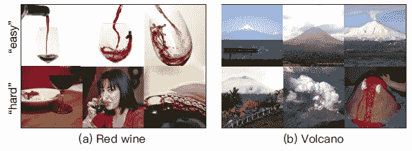******

********Visualization on Easy and Hard Images on ImageNet********

*   ******简单图像(顶行):在第一个分类器处退出并被正确分类。******
*   ******硬图像(底行):在第一个分类器处退出，并且被错误分类，而被最后一个分类器正确分类，其中它们是非典型图像。******

## ******5.6.计算效率更高 [DenseNets](/review-densenet-image-classification-b6631a8ef803)******

*   ******发现并研究了一种更有效的 [DenseNet](/review-densenet-image-classification-b6631a8ef803) 。作者还认为这是探索 MSDNet 的一个有趣的发现。******

******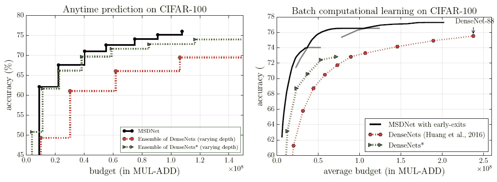******

********Anytime Classification (Left) and Budgeted Batch Classification (Right)********

*   ******[**dense net**](/review-densenet-image-classification-b6631a8ef803)*****:对原来的[dense net](/review-densenet-image-classification-b6631a8ef803)进行修改，在每一个过渡层之后增加一倍的增长率，从而对低分辨率的特征地图应用更多的滤镜。******
*   ******[DenseNet](/review-densenet-image-classification-b6631a8ef803) *(绿色)在计算效率上明显优于原来的 [DenseNet](/review-densenet-image-classification-b6631a8ef803) (红色)。******
*   ******在 anytime 分类中，不同深度的 [DenseNets](/review-densenet-image-classification-b6631a8ef803) *的集合仅比 MSDNets 稍差。******
*   ******在预算的批量分类中，MSDNets 仍然大大优于不同深度的 [DenseNets](/review-densenet-image-classification-b6631a8ef803) *的集合。******

******对于未来的工作，作者计划在分类(例如:图像分割)之外进行研究，将 MSDNets 与模型压缩、空间自适应计算和更有效的卷积运算相结合。对我来说，这篇论文有许多重要的事实和概念，这使我写了这么长的故事。******

## ******参考******

******【2018 ICLR】【MSDNet】
[用于资源高效图像分类的多尺度密集网络](https://arxiv.org/abs/1703.09844)******

## ******我以前的评论******

******)(我)(们)(都)(不)(想)(到)(这)(些)(人)(,)(我)(们)(都)(不)(想)(要)(到)(这)(些)(人)(,)(但)(是)(这)(些)(人)(还)(不)(想)(到)(这)(些)(人)(,)(我)(们)(还)(没)(想)(到)(这)(些)(事)(,)(我)(们)(就)(想)(到)(了)(这)(些)(人)(们)(,)(我)(们)(们)(都)(不)(想)(要)(到)(这)(些)(人)(,)(但)(我)(们)(还)(没)(想)(到)(这)(些)(事)(,)(我)(们)(还)(没)(想)(想)(到)(这)(些)(事)(,)(我)(们)(还)(没)(想)(到)(这)(里)(去)(。 )(他)(们)(都)(不)(在)(这)(些)(事)(上)(,)(她)(们)(还)(不)(在)(这)(些)(事)(上)(有)(什)(么)(情)(况)(呢)(?)(她)(们)(都)(不)(在)(这)(些)(情)(况)(下)(,)(她)(们)(还)(是)(不)(在)(这)(些)(事)(上)(有)(什)(么)(情)(况)(吗)(?)(她)(们)(都)(不)(在)(这)(些)(事)(上)(,)(她)(们)(们)(还)(不)(在)(这)(些)(事)(上)(,)(她)(们)(们)(还)(不)(在)(这)(些)(事)(上)(有)(什)(么)(好)(的)(情)(情)(情)(况)(。******

********物体检测** [过食](https://medium.com/coinmonks/review-of-overfeat-winner-of-ilsvrc-2013-localization-task-object-detection-a6f8b9044754)[R-CNN](https://medium.com/coinmonks/review-r-cnn-object-detection-b476aba290d1)[快 R-CNN](https://medium.com/coinmonks/review-fast-r-cnn-object-detection-a82e172e87ba)[快 R-CNN](/review-faster-r-cnn-object-detection-f5685cb30202)[DeepID-Net](/review-deepid-net-def-pooling-layer-object-detection-f72486f1a0f6)】[CRAFT](/review-craft-cascade-region-proposal-network-and-fast-r-cnn-object-detection-2ce987361858)[R-FCN](/review-r-fcn-positive-sensitive-score-maps-object-detection-91cd2389345c)[ION](/review-ion-inside-outside-net-2nd-runner-up-in-2015-coco-detection-object-detection-da19993f4766)[multipath Net](/review-multipath-mpn-1st-runner-up-in-2015-coco-detection-segmentation-object-detection-ea9741e7c413)【T21 [ [约洛夫 1](/yolov1-you-only-look-once-object-detection-e1f3ffec8a89) ] [ [约洛夫 2 /约洛 9000](/review-yolov2-yolo9000-you-only-look-once-object-detection-7883d2b02a65) ] [ [约洛夫 3](/review-yolov3-you-only-look-once-object-detection-eab75d7a1ba6) ] [ [FPN](/review-fpn-feature-pyramid-network-object-detection-262fc7482610) ] [ [视网膜网](/review-retinanet-focal-loss-object-detection-38fba6afabe4) ] [ [DCN](/review-dcn-deformable-convolutional-networks-2nd-runner-up-in-2017-coco-detection-object-14e488efce44) ]******

********语义切分** [FCN](/review-fcn-semantic-segmentation-eb8c9b50d2d1)[de convnet](/review-deconvnet-unpooling-layer-semantic-segmentation-55cf8a6e380e)[deeplab v1&deeplab v2](/review-deeplabv1-deeplabv2-atrous-convolution-semantic-segmentation-b51c5fbde92d)】[CRF-RNN](/review-crf-rnn-conditional-random-fields-as-recurrent-neural-networks-semantic-segmentation-a11eb6e40c8c)】[SegNet](/review-segnet-semantic-segmentation-e66f2e30fb96)】[parse net](https://medium.com/datadriveninvestor/review-parsenet-looking-wider-to-see-better-semantic-segmentation-aa6b6a380990)[dilated net](/review-dilated-convolution-semantic-segmentation-9d5a5bd768f5)[PSPNet](/review-pspnet-winner-in-ilsvrc-2016-semantic-segmentation-scene-parsing-e089e5df177d)[deeplab v3](/review-deeplabv3-atrous-convolution-semantic-segmentation-6d818bfd1d74)]******

********生物医学图像分割** [[cumed vision 1](https://medium.com/datadriveninvestor/review-cumedvision1-fully-convolutional-network-biomedical-image-segmentation-5434280d6e6)][[cumed vision 2/DCAN](https://medium.com/datadriveninvestor/review-cumedvision2-dcan-winner-of-2015-miccai-gland-segmentation-challenge-contest-biomedical-878b5a443560)][[U-Net](/review-u-net-biomedical-image-segmentation-d02bf06ca760)][[CFS-FCN](https://medium.com/datadriveninvestor/review-cfs-fcn-biomedical-image-segmentation-ae4c9c75bea6)][[U-Net+ResNet](https://medium.com/datadriveninvestor/review-u-net-resnet-the-importance-of-long-short-skip-connections-biomedical-image-ccbf8061ff43)][[多通道](/review-multichannel-segment-colon-histology-images-biomedical-image-segmentation-d7e57902fbfc)******

********实例分段** [DeepMask](/review-deepmask-instance-segmentation-30327a072339) [SharpMask](/review-sharpmask-instance-segmentation-6509f7401a61) [MultiPathNet](/review-multipath-mpn-1st-runner-up-in-2015-coco-detection-segmentation-object-detection-ea9741e7c413) [MNC](/review-mnc-multi-task-network-cascade-winner-in-2015-coco-segmentation-instance-segmentation-42a9334e6a34) [InstanceFCN](/review-instancefcn-instance-sensitive-score-maps-instance-segmentation-dbfe67d4ee92) [FCIS](/review-fcis-winner-in-2016-coco-segmentation-instance-segmentation-ee2d61f465e2) 】******

******)(我)(们)(都)(不)(知)(道)(,)(我)(们)(还)(是)(不)(知)(道)(,)(我)(们)(还)(是)(不)(知)(道)(,)(我)(们)(还)(是)(不)(知)(道)(,)(我)(们)(还)(是)(不)(知)(道)(,)(我)(们)(还)(是)(不)(知)(道)(,)(我)(们)(还)(是)(不)(知)(道)(。******

******(T36) 人类姿势估计 (T37) (T38) (T39) 汤普森 NIPS'14 (T40)******