# 综述:多通道—分割结肠组织学图像(生物医学图像分割)

> 原文：<https://towardsdatascience.com/review-multichannel-segment-colon-histology-images-biomedical-image-segmentation-d7e57902fbfc?source=collection_archive---------15----------------------->

## 使用 FCN 的前景分割+使用 HED 的边缘检测+使用更快的 R-CNN 的对象检测

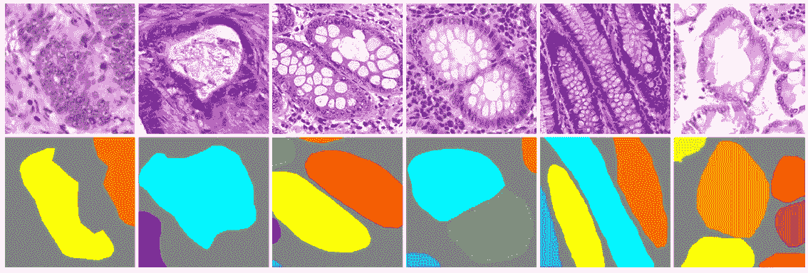

**Gland Haematoxylin and Eosin (H&E) stained slides and ground truth labels**

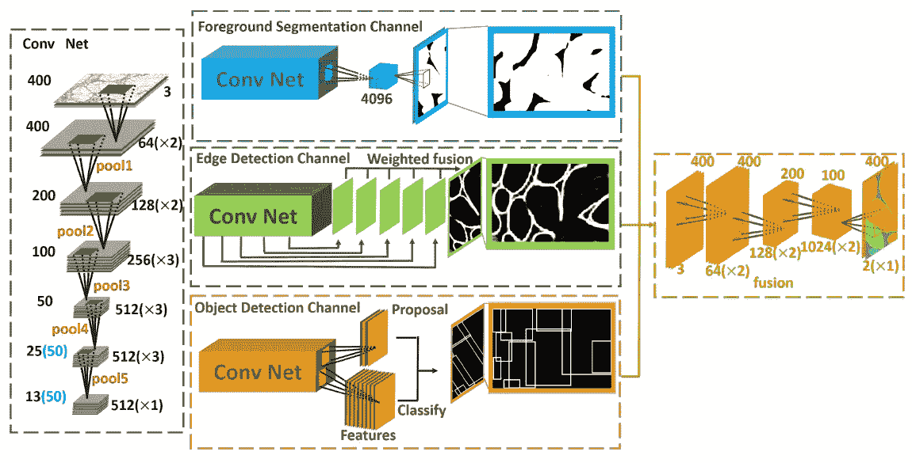

**Foreground Segmentation using** [**FCN**](/review-fcn-semantic-segmentation-eb8c9b50d2d1) **+ Edge Detection Using HED + Object Detection Using** [**Faster R-CNN**](/review-faster-r-cnn-object-detection-f5685cb30202)

在这个故事里，**多路**简要回顾。它是一个**深度多通道神经网络**，用于**腺体实例分割**。这种方法，如上图所示，**融合来自 3 个子网络的结果:前景分割使用** [**FCN**](/review-fcn-semantic-segmentation-eb8c9b50d2d1) **，边缘检测使用 HED，对象检测使用** [**更快的 R-CNN**](/review-faster-r-cnn-object-detection-f5685cb30202) **。**使用 2015 MICCAI 腺体分割挑战数据集获得了最先进的结果。**作者在 2016 年首次发表多通道 MICCAI** ，仅使用 2 个子网络:使用 [FCN](/review-fcn-semantic-segmentation-eb8c9b50d2d1) 的前景分割和使用 hed 的边缘检测。然后他们增强了会议版本，使用更快的 R-CNN 添加了对象检测。**本增强版于 2017 年 TBME** 出版。由于事务版本要详细得多，虽然我已经阅读了这两个版本，但我将在这里呈现事务版本。( [Sik-Ho Tsang](https://medium.com/u/aff72a0c1243?source=post_page-----d7e57902fbfc--------------------------------) @中)

# 概述

1.  **第一子网:前景分割通道**
2.  **第二子网:边缘检测通道**
3.  **第三子网:物体检测通道**
4.  **定影多通道**
5.  **与最先进方法的比较**
6.  **进一步消融研究**

# **1。第一子网:前景分割通道**

**1st Sub-Network: Foreground Segmentation Channel**

*   [**FCN-32s**](/review-fcn-semantic-segmentation-eb8c9b50d2d1) **用作网络中前景分割通道。**
*   然而，由于 [FCN-32s](/review-fcn-semantic-segmentation-eb8c9b50d2d1) 产生的输出特征图较小，不利于分割。在[的扩展网](/review-dilated-convolution-semantic-segmentation-9d5a5bd768f5)中提出的扩展卷积用于增强[的 FCN](/review-fcn-semantic-segmentation-eb8c9b50d2d1) 。
*   pool4 和 pool5 的步距是 1。
*   并且随后的回旋层通过扩大的回旋来扩大感受野。
*   训练时使用 Softmax 交叉熵损失。
*   使用预先训练好的 [FCN-32s](/review-fcn-semantic-segmentation-eb8c9b50d2d1) 。

# 2.第二子网:**边缘检测通道**

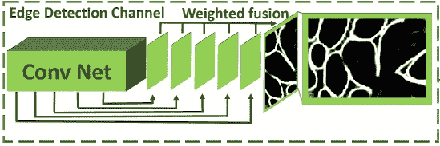

**2nd Sub-Network: Edge Detection Channel**

*   **边缘通道基于整体嵌套的边缘检测器(HED)。**
*   它学习分层嵌入的多尺度边缘场，以说明轮廓和对象边界的低级、中级和高级信息。
*   对于第 *m* 次预测:

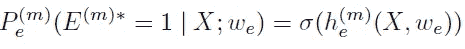

*   输出为特征图 *h* () 的 **sigmoid 函数** **σ** **。**
*   最后是不同尺度边缘场的加权融合。
*   在训练期间使用 Sigmoid 交叉熵损失。
*   使用 Xavier 初始化。
*   地面实况边缘标签由区域标签生成。如果所有相邻(上、下、左、右)像素都是前景或背景，则该像素不是边缘。

**3。第三子网:物体检测通道**

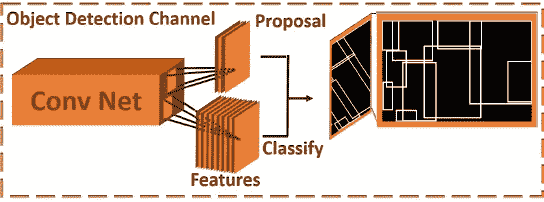

**3rd Sub-Network: Object Detection Channel**

*   [**更快 R-CNN**](/review-faster-r-cnn-object-detection-f5685cb30202) **这里用的是，但是有修饰。**
*   **填充操作**在生成区域建议后完成。
*   边界框覆盖的区域中的每个像素的值等于它所属的边界框的数量。
*   例如，如果一个像素位于三个边界框的重叠区域，则该像素的值将为 3。

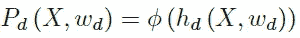

*   𝜙是灌装操作。
*   损耗与[fast R-CNN](/review-faster-r-cnn-object-detection-f5685cb30202)中的一样，即分类损耗和回归损耗之和。
*   使用预训练的[更快的 R-CNN](/review-faster-r-cnn-object-detection-f5685cb30202) 。
*   使用包围每个腺体的最小矩形来生成地面真实边界框。

# **4。定影多通道**

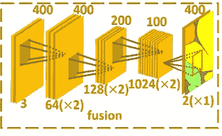

**Fusing Multichannel**

*   使用 7 层 CNN。
*   同样，在 [DilatedNet](/review-dilated-convolution-semantic-segmentation-9d5a5bd768f5) 中使用的扩张卷积在这里被用来代替下采样。
*   使用 Xavier 初始化。

# **5。与最先进方法的比较**

## 5.1.资料组

*   MICCAI 2015 腺体分割挑战大赛
*   165 标记的结肠直肠癌组织学图像
*   原图，大部分是 775×522。
*   训练集:85 幅图像
*   测试集:80 幅图像。(测试集 A 包含 60 幅图像，测试集 B 包含 20 幅图像)。训练集中有 37 个良性部分和 48 个恶性部分，测试集 A 中有 33 个良性部分和 27 个恶性部分，测试集 b 中有 4 个良性部分和 16 个恶性部分

## 5.2.数据扩充

*   数据增强策略一:水平翻转和 0、90、180、270°旋转。
*   数据扩充策略二:弹性转换就像 [U-Net](/review-u-net-biomedical-image-segmentation-d02bf06ca760) 里的那个。

## 5.3.估价

*   使用了三个指标: **F1 得分**、 **ObjectDice** 和 **ObjectHausdorff** 。
*   **F1 得分**:由 precision P 和 recall R 测得的得分，超过 50%的重叠定义为真阳性。
*   **ObjectDice** :分割的度量标准。
*   **ObjectHausdorff** :测量形状相似度的度量。
*   (详情请看我对 [CUMedVision2 / DCAN](https://medium.com/datadriveninvestor/review-cumedvision2-dcan-winner-of-2015-miccai-gland-segmentation-challenge-contest-biomedical-878b5a443560) 的点评。)

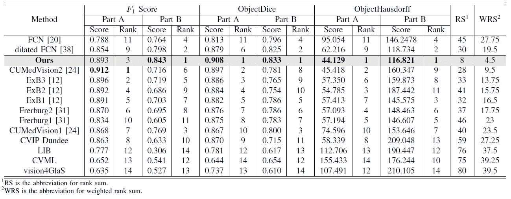

*   RS 和 WRS 分别是基于 F1 评分的秩和与加权秩和，ObjectDice 和 ObjectHausdorff。
*   我们可以看到，在 A 部分和 B 部分测试集中，多通道几乎获得了所有的 rank 1，这意味着多通道优于， [CUMedVision1](https://medium.com/datadriveninvestor/review-cumedvision1-fully-convolutional-network-biomedical-image-segmentation-5434280d6e6) ， [CUMedVision2 / DCAN](https://medium.com/datadriveninvestor/review-cumedvision2-dcan-winner-of-2015-miccai-gland-segmentation-challenge-contest-biomedical-878b5a443560) ， [FCN](/review-fcn-semantic-segmentation-eb8c9b50d2d1) 和[expanded FCN(DeepLab)](/review-deeplabv1-deeplabv2-atrous-convolution-semantic-segmentation-b51c5fbde92d)。
*   一些定性结果:

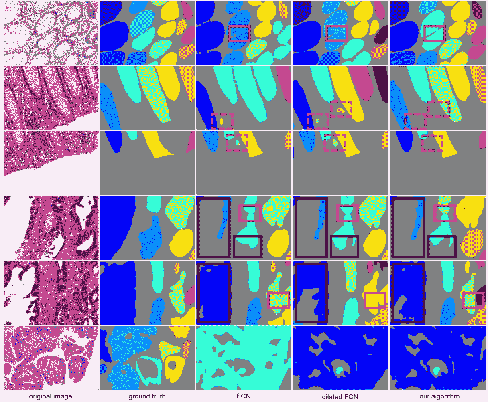

## 5.3.与实例分割方法的比较

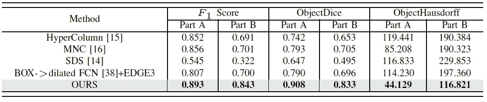

*   多通道比所有的实例分割方法都要好，例如 [MNC](/review-mnc-multi-task-network-cascade-winner-in-2015-coco-segmentation-instance-segmentation-42a9334e6a34) 。
*   当仅在边界框内(即倒数第二行)分割时，结果也不如融合方法。
*   边缘 3 表示边缘被半径为 3 的圆盘过滤器扩大。
*   一些定性结果:

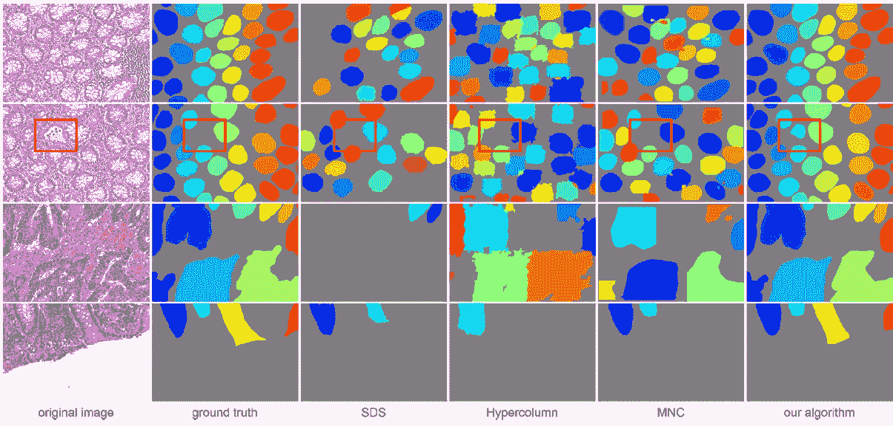

# **6。进一步消融研究**

## 6.1.数据扩充

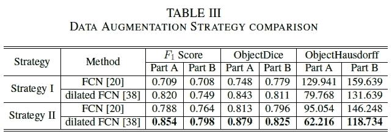

*   使用数据增强策略 II(弹性变换)更好。

## 6.2.多通道的不同融合变体

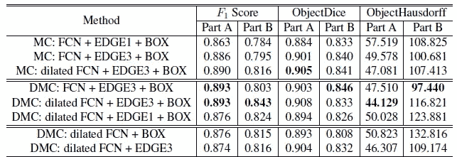

*   边缘 3 表示边缘被半径为 3 的圆盘过滤器扩大。这意味着增加边缘的宽度，以处理训练过程中边缘和非边缘像素的不平衡。
*   **前 3 行**:不使用扩张卷积，性能较差。
*   **最后 2 排**:只有 2 个通道(或子网)进行融合，性能也较逊色。
*   **中间 3 排:带扩张卷积，加 3 个通道，性能最好。**

## 参考

【2016 MICCAI】【多通道】
[汽封实例分割由深多通道侧监督](https://arxiv.org/abs/1607.03222)

【2017 TBE】【多通道】
[利用深度多通道神经网络进行腺体实例分割](https://arxiv.org/abs/1611.06661)

## 我以前的评论

)(我)(们)(都)(不)(想)(到)(这)(些)(人)(,)(我)(们)(都)(不)(想)(要)(到)(这)(些)(人)(,)(但)(是)(这)(些)(人)(还)(不)(想)(到)(这)(些)(人)(,)(我)(们)(还)(没)(想)(到)(这)(些)(事)(,)(我)(们)(就)(想)(到)(了)(这)(些)(人)(们)(,)(我)(们)(们)(都)(不)(想)(要)(到)(这)(些)(人)(,)(但)(我)(们)(还)(没)(想)(到)(这)(些)(事)(,)(我)(们)(还)(没)(想)(想)(到)(这)(些)(事)(,)(我)(们)(还)(没)(想)(到)(这)(里)(去)(。 )(他)(们)(都)(不)(在)(这)(些)(事)(上)(,)(她)(们)(还)(不)(在)(这)(些)(事)(上)(有)(什)(么)(情)(况)(呢)(?)(她)(们)(都)(不)(在)(这)(些)(情)(况)(下)(,)(她)(们)(还)(是)(不)(在)(这)(些)(事)(上)(有)(什)(么)(情)(况)(吗)(?)(她)(们)(都)(不)(在)(这)(些)(事)(上)(,)(她)(们)(们)(还)(不)(在)(这)(些)(事)(上)(,)(她)(们)(们)(还)(不)(在)(这)(些)(事)(上)(有)(什)(么)(好)(的)(情)(情)(情)(况)(。

**物体检测** [过食](https://medium.com/coinmonks/review-of-overfeat-winner-of-ilsvrc-2013-localization-task-object-detection-a6f8b9044754)[R-CNN](https://medium.com/coinmonks/review-r-cnn-object-detection-b476aba290d1)[快 R-CNN](https://medium.com/coinmonks/review-fast-r-cnn-object-detection-a82e172e87ba)[快 R-CNN](/review-faster-r-cnn-object-detection-f5685cb30202)[DeepID-Net](/review-deepid-net-def-pooling-layer-object-detection-f72486f1a0f6)】[R-FCN](/review-r-fcn-positive-sensitive-score-maps-object-detection-91cd2389345c)】[离子](/review-ion-inside-outside-net-2nd-runner-up-in-2015-coco-detection-object-detection-da19993f4766)[多路径网](/review-multipath-mpn-1st-runner-up-in-2015-coco-detection-segmentation-object-detection-ea9741e7c413)[NoC](https://medium.com/datadriveninvestor/review-noc-winner-in-2015-coco-ilsvrc-detection-object-detection-d5cc84e372a) yolo 9000[[yolov 3](/review-yolov3-you-only-look-once-object-detection-eab75d7a1ba6)][[FPN](/review-fpn-feature-pyramid-network-object-detection-262fc7482610)][[retina net](/review-retinanet-focal-loss-object-detection-38fba6afabe4)][[DCN](/review-dcn-deformable-convolutional-networks-2nd-runner-up-in-2017-coco-detection-object-14e488efce44)]

**语义切分** [FCN](/review-fcn-semantic-segmentation-eb8c9b50d2d1)[de convnet](/review-deconvnet-unpooling-layer-semantic-segmentation-55cf8a6e380e)[deeplab v1&deeplab v2](/review-deeplabv1-deeplabv2-atrous-convolution-semantic-segmentation-b51c5fbde92d)[SegNet](/review-segnet-semantic-segmentation-e66f2e30fb96)】【parse net[dilated net](/review-dilated-convolution-semantic-segmentation-9d5a5bd768f5)[PSP net](/review-pspnet-winner-in-ilsvrc-2016-semantic-segmentation-scene-parsing-e089e5df177d)[deeplab v3](/review-deeplabv3-atrous-convolution-semantic-segmentation-6d818bfd1d74)[DRN](/review-drn-dilated-residual-networks-image-classification-semantic-segmentation-d527e1a8fb5)

**生物医学图像分割** [[cumed vision 1](https://medium.com/datadriveninvestor/review-cumedvision1-fully-convolutional-network-biomedical-image-segmentation-5434280d6e6)][[cumed vision 2/DCAN](https://medium.com/datadriveninvestor/review-cumedvision2-dcan-winner-of-2015-miccai-gland-segmentation-challenge-contest-biomedical-878b5a443560)][[U 网](/review-u-net-biomedical-image-segmentation-d02bf06ca760)][[CFS-FCN](https://medium.com/datadriveninvestor/review-cfs-fcn-biomedical-image-segmentation-ae4c9c75bea6)][[U 网+ResNet](https://medium.com/datadriveninvestor/review-u-net-resnet-the-importance-of-long-short-skip-connections-biomedical-image-ccbf8061ff43) ]

**实例分段** [DeepMask](/review-deepmask-instance-segmentation-30327a072339) [SharpMask](/review-sharpmask-instance-segmentation-6509f7401a61) [MultiPathNet](/review-multipath-mpn-1st-runner-up-in-2015-coco-detection-segmentation-object-detection-ea9741e7c413) [MNC](/review-mnc-multi-task-network-cascade-winner-in-2015-coco-segmentation-instance-segmentation-42a9334e6a34) [InstanceFCN](/review-instancefcn-instance-sensitive-score-maps-instance-segmentation-dbfe67d4ee92) [FCIS](/review-fcis-winner-in-2016-coco-segmentation-instance-segmentation-ee2d61f465e2) 】

)(我)(们)(都)(不)(知)(道)(,)(我)(们)(还)(是)(不)(知)(道)(,)(我)(们)(还)(是)(不)(知)(道)(,)(我)(们)(还)(是)(不)(知)(道)(,)(我)(们)(还)(是)(不)(知)(道)(,)(我)(们)(还)(是)(不)(知)(道)(,)(我)(们)(还)(是)(不)(知)(道)(。