# 点评:多路径网络/多路径/MPN—2015 年 COCO 检测和分割(对象检测/实例分割)亚军

> 原文：<https://towardsdatascience.com/review-multipath-mpn-1st-runner-up-in-2015-coco-detection-segmentation-object-detection-ea9741e7c413?source=collection_archive---------24----------------------->

## 多个网络层，视网膜中央凹结构和整体损失，信息在网络中沿多条路径流动

在这个故事中，**脸书 AI 研究**的**MultiPath net/MultiPath/MPN**进行了回顾。这种方法在 [GitHub](https://github.com/facebookresearch/multipathnet) 中被命名为 MultiPathNet，在本文中称为 MultiPath。在 [SharpMask](/review-sharpmask-instance-segmentation-6509f7401a61) 中它也被称为 MPN。**对**做了三处修改，以改进[快速 R-CNN](https://medium.com/coinmonks/review-fast-r-cnn-object-detection-a82e172e87ba) :

1.  **视网膜中央凹结构**以多种物体分辨率利用物体环境。
2.  **跳过连接**，该连接允许探测器访问多个网络层的功能。
3.  **积分损失函数**和改善定位的相应网络调整。

再加上 [SharpMask](/review-sharpmask-instance-segmentation-6509f7401a61) 天体提议，组合系统**将**的结果提高到超过**基线** [**快速 R-CNN**](https://medium.com/coinmonks/review-fast-r-cnn-object-detection-a82e172e87ba) 探测器，选择性搜索**总体提高 66%** ，小天体提高 4 倍**。**它在 COCO 2015 检测和细分挑战中均获得第二名。**发表在 **2016 BMVC** 上，被 **100 多次引用**。( [Sik-Ho Tsang](https://medium.com/u/aff72a0c1243?source=post_page-----ea9741e7c413--------------------------------) @中)**

# 涵盖哪些内容

1.  **视网膜中央凹结构**
2.  **跳过连接**
3.  **积分损失函数**
4.  **消融研究**
5.  **结果**

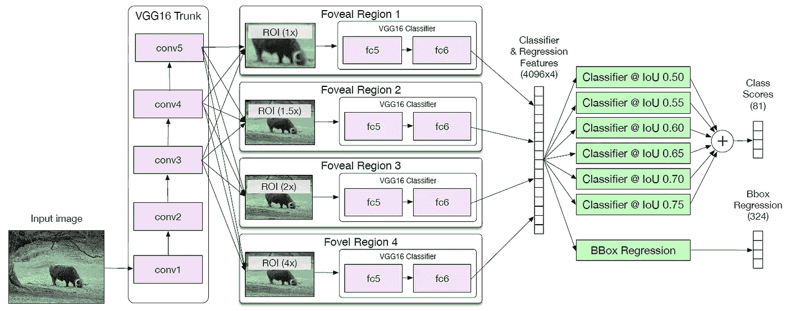

**MultiPath Architecture**

# **1。视网膜中央凹结构**

除了原来的**1×**ROI 集中区域尺寸外，还开发了如上图所示的**额外的 1.5×、2×和 4× ROI 集中区域**。这提供了**不同大小的视网膜中央凹区域**。

这四个 ROI 汇集区域经过完全连接的(FC)层(FC5 和 FC6)，然后**连接成单个长特征向量(4096×4)** 。

# 2.跳过连接

在使用 [VGG16](https://medium.com/coinmonks/paper-review-of-vggnet-1st-runner-up-of-ilsvlc-2014-image-classification-d02355543a11) 作为主干的原始[快速 R-CNN](https://medium.com/coinmonks/review-fast-r-cnn-object-detection-a82e172e87ba) 中，只有 conv5 层用于 ROI 合并。在此图层中，要素的缩减采样系数为 16。然而， **40%的 COCO 对象的面积小于 32×32 像素，20%小于 16×16 像素**，因此这些对象将在此阶段分别被**缩减采样为 2×2 或 1×1。RoI-pooling 会将它们上采样到 7×7，但是由于对特征的 16 倍下采样，大多数空间信息将会丢失。**

因此，由[或](/review-ion-inside-outside-net-2nd-runner-up-in-2015-coco-detection-object-detection-da19993f4766)建议的跳过池在 conv3 执行，con4 和 conv5 也用于 ROI 池。这个想法是**早期层通常比后期层**有更大的值，这在 [ParseNet](https://medium.com/datadriveninvestor/review-parsenet-looking-wider-to-see-better-semantic-segmentation-aa6b6a380990) 中提到过。因此，在拼接之前，每个汇集的 ROI 被 **L2 归一化** **并通过经验确定的比例重新按比例放大**。之后，执行 **1×1 卷积**以**降低维度**以适应分类器输入维度。

这些跳跃连接使分类器能够以多种分辨率访问来自要素的信息。

# 3.**积分损失函数**

在 PASCAL 和 ImageNet 数据集中，评分标准仅关注 50 以上的交集(IoU ),即 AP⁵⁰.然而，COCO 数据集在从 50 到 95 的 IoU 范围内评估 AP。

在最初的[快速 R-CNN](https://medium.com/coinmonks/review-fast-r-cnn-object-detection-a82e172e87ba) 中，损失函数只关注优化 AP⁵⁰:

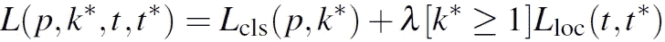

第一项 *Lcls* 是分类对数损失，而第二项 *Lloc* 是边界框定位损失。 *k** ≥1 仅当 IoU 大于 50。否则 *k** =0，忽略第二项损失。

总的来说， *Lcls* 被修改以适应 COCO 评估指标:

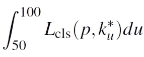

上述等式将积分近似为一个和，其中 *du* = 5。

具体来说，只考虑 6 个 IoU 阈值，从 50、55、…、到 75。修改后的损失变成:

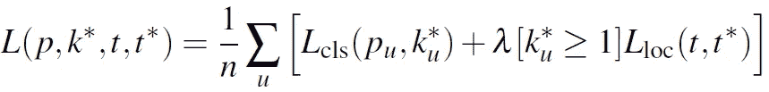

其中 *n* =6， *u* 从 50，55，…，到 75。在培训期间，随着 *u* 的增加，与实际情况相重叠的建议会减少。因此，它被限制为 *u* ≤75，否则，建议包含的用于训练的总正样本太少。

这个积分损失函数显示在上图的右边。

## 一些训练细节

在训练期间，每批有 4 个图像，每个图像有 64 个对象提议。在 4 个 NVIDIA Titan X GPUs 上大概需要 3 天。使用每个图像 30，1000 个建议的非最大抑制阈值。并且没有重量衰减。该网络需要 150 毫秒来计算特征，350 毫秒来评估视网膜中央凹区域，因此每个 COCO 图像总共需要 500 毫秒。

# 4.消融研究

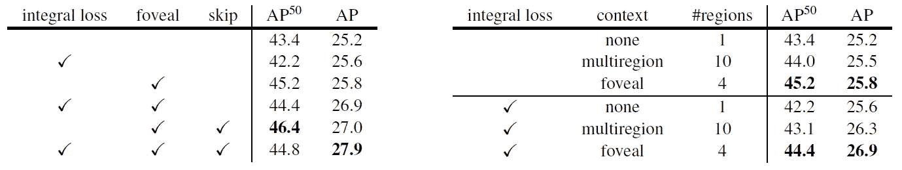

**Left: Model improvements of our MultiPath network, Right: 4-region foveal setup versus the 10 regions used in multiregion**

*   **左**:采用视网膜中央凹结构和跳跃连接，AP⁵⁰.获得 46.4%的 mAP 积分损失后，AP⁵⁰的平均积分下降到了 44.8%。这是因为积分损失是专门为 COCO 评估指标设计的。因此，我们可以看到**使用积分损失后，总 AP 从 27.0 提高到 27.9**。
*   **右** : multiregion [9]在每个对象周围使用十个具有不同裁剪的上下文区域。在多路径中，仅使用 4 个视网膜中央凹区域。在没有积分损失的情况下，多径对于 AP⁵⁰.具有 45.2%的 mAP 在积分损失的情况下，获得了 26.9%的总 mAP。多路径总是比多区域好。

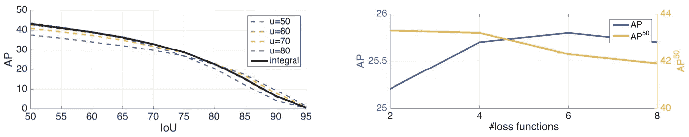

**Left: MultiPath with different IoU thresholds and with Integral loss, Right: Integral loss with different number of u.**

*   **左**:每个标准模型在用于训练的阈值下表现最佳，而使用积分损失在所有设置下产生良好的结果。
*   **右**:积分损失达到 6 头最佳 AP。

# 5.结果

## 5.1.区域提议技术

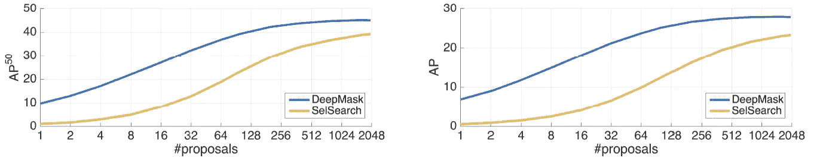

**AP⁵⁰ and overall AP versus number and type of proposals.**

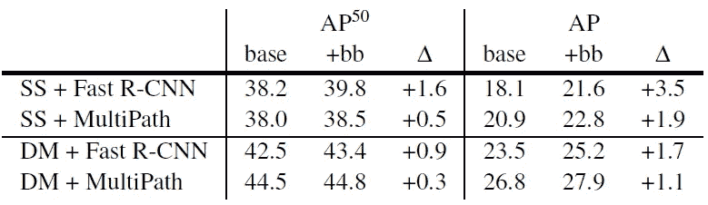

**AP⁵⁰ and overall AP with different approaches. (SS: Selective Search, DM:** [DeepMask](/review-deepmask-instance-segmentation-30327a072339)**)**

*   在最初的[快速 R-CNN](https://medium.com/coinmonks/review-fast-r-cnn-object-detection-a82e172e87ba) 中，第一步是使用选择性搜索(SelSearch)来生成多个区域提议。对于每个提案，ROI 池在 conv5 上执行，并通过 FC 层进行分类和定位。
*   因此，求婚技巧至关重要。
*   结果是每张图片有大约 400 个[深度蒙版](/review-deepmask-instance-segmentation-30327a072339)提议。
*   仅使用 50 个[深度屏蔽](/review-deepmask-instance-segmentation-30327a072339)建议就可以匹配 2000 个选择性搜索建议的准确性。

## 5.2.其他技术

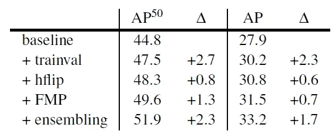

*   **trainval** :追加训练用 COCO 验证数据。
*   **hflip** :水平翻转，平均结果。
*   **FMP** :分数最大汇集，简而言之，是多个 ROI 汇集操作，具有扰动的汇集参数并平均 softmax 输出。
*   **组合**:采用 6 模组合。
*   通过以上 4 项技术，AP⁵⁰和整体 AP 都有了很大的提高。

## 5.3.COCO 2015 检测和分割

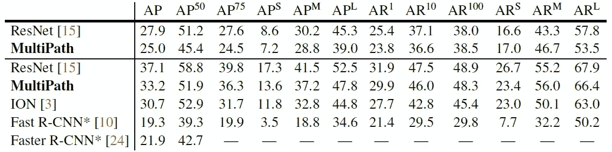

**Top: Segmentation Results, Bottom: Detection Results**

*   多路径在检测和分段挑战中位居第二。
*   小对象的整体 AP 提高了 4 倍，AP⁵⁰提高了 82%。
*   如果使用 [ResNet](/review-resnet-winner-of-ilsvrc-2015-image-classification-localization-detection-e39402bfa5d8) 主干网，AP 可以进一步提高。

## 5.4.定性结果

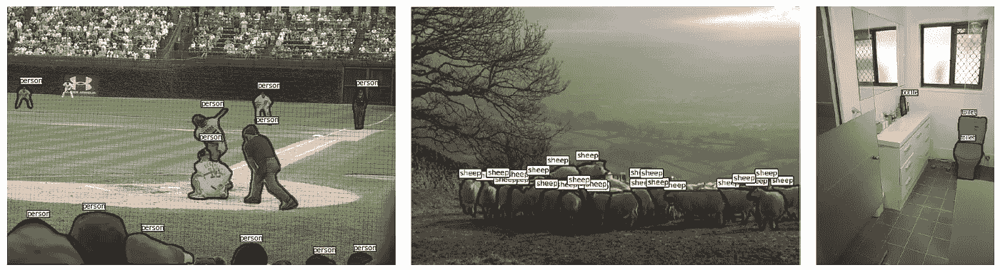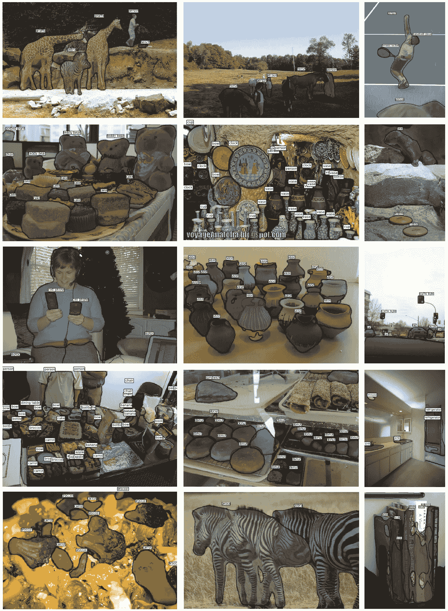

虽然存在遗漏对象和误报，但其中许多都相当不错。

论文和 [COCO 检测排行榜](http://cocodataset.org/#detection-leaderboard)中的结果略有不同。但是 [SharpMask](/review-sharpmask-instance-segmentation-6509f7401a61) 中的结果与排行榜中的结果相同。(我不确定，但是)也许，在最后， [SharpMask](/review-sharpmask-instance-segmentation-6509f7401a61) ，一个改进的 [DeepMask](/review-deepmask-instance-segmentation-30327a072339) ，被用作具有多路径提交的区域提议。

## 参考

【2016 BMVC】【多路径/MPN】
[用于物体检测的多路径网络](https://arxiv.org/abs/1604.02135)

)(我)(们)(都)(不)(想)(到)(这)(些)(人)(,)(我)(们)(都)(不)(想)(要)(到)(这)(些)(人)(,)(但)(是)(这)(些)(人)(还)(不)(想)(到)(这)(些)(人)(,)(我)(们)(还)(没)(想)(到)(这)(些)(事)(,)(我)(们)(就)(想)(到)(了)(这)(些)(人)(们)(,)(我)(们)(们)(都)(不)(想)(要)(到)(这)(些)(人)(,)(但)(我)(们)(还)(没)(想)(到)(这)(些)(事)(,)(我)(们)(还)(没)(想)(到)(这)(里)(来)(。 )(我)(们)(都)(不)(知)(道)(,)(我)(们)(还)(是)(不)(知)(道)(,)(我)(们)(还)(是)(不)(知)(道)(,)(我)(们)(还)(是)(不)(知)(道)(,)(我)(们)(还)(是)(不)(知)(道)(,)(我)(们)(还)(是)(不)(知)(道)(,)(我)(们)(还)(是)(不)(知)(道)(,)(我)(们)(还)(是)(不)(知)(道)(。

**物体检测** [过食](https://medium.com/coinmonks/review-of-overfeat-winner-of-ilsvrc-2013-localization-task-object-detection-a6f8b9044754)[R-CNN](https://medium.com/coinmonks/review-r-cnn-object-detection-b476aba290d1)[快 R-CNN](https://medium.com/coinmonks/review-fast-r-cnn-object-detection-a82e172e87ba)[快 R-CNN](/review-faster-r-cnn-object-detection-f5685cb30202)[DeepID-Net](/review-deepid-net-def-pooling-layer-object-detection-f72486f1a0f6)[R-FCN](/review-r-fcn-positive-sensitive-score-maps-object-detection-91cd2389345c)】[离子](/review-ion-inside-outside-net-2nd-runner-up-in-2015-coco-detection-object-detection-da19993f4766)[固态硬盘](/review-ssd-single-shot-detector-object-detection-851a94607d11)[DSSD](/review-dssd-deconvolutional-single-shot-detector-object-detection-d4821a2bbeb5)[约尔](/yolov1-you-only-look-once-object-detection-e1f3ffec8a89)

**语义切分** [[FCN](/review-fcn-semantic-segmentation-eb8c9b50d2d1)][[de convnet](/review-deconvnet-unpooling-layer-semantic-segmentation-55cf8a6e380e)][[deeplab v1&deeplab v2](/review-deeplabv1-deeplabv2-atrous-convolution-semantic-segmentation-b51c5fbde92d)][[parse net](https://medium.com/datadriveninvestor/review-parsenet-looking-wider-to-see-better-semantic-segmentation-aa6b6a380990)][[dilated net](/review-dilated-convolution-semantic-segmentation-9d5a5bd768f5)][[PSPNet](/review-pspnet-winner-in-ilsvrc-2016-semantic-segmentation-scene-parsing-e089e5df177d)]

**实例分割** [深度遮罩](/review-deepmask-instance-segmentation-30327a072339)[锐度遮罩](/review-sharpmask-instance-segmentation-6509f7401a61)