# 综述:NIN —网络中的网络(图像分类)

> 原文：<https://towardsdatascience.com/review-nin-network-in-network-image-classification-69e271e499ee?source=collection_archive---------9----------------------->

## 使用具有 1×1 卷积核的卷积层

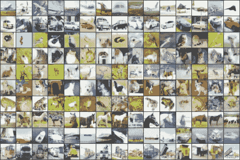

**A few example images from the CIFAR10 dataset.**

在这个故事中，对**综合科学与工程研究生院**和**新加坡国立大学**的**网络中的网络(NIN)** 进行了简要回顾。具有复杂结构的微型神经网络，用于提取感受野内的数据。这是一篇 **2014 ICLR** 论文，引用超过 **2300 次**。( [Sik-Ho Tsang](https://medium.com/u/aff72a0c1243?source=post_page-----69e271e499ee--------------------------------) @中)

# 概述

1.  **线性卷积层 VS mlpconv 层**
2.  **全连接层 VS 全球平均池层**
3.  **网络中网络的整体结构(NIN)**
4.  **结果**

# **1。线性卷积层 VS mlpconv 层**

## 1.1.线性卷积层

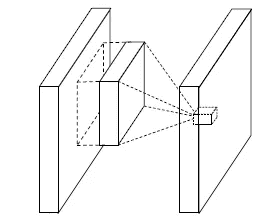

**Linear Convolutional Layer**

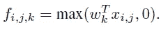

*   这里( *i* ， *j* )是特征图中的像素索引， *xij* 代表以位置( *i* ， *j* )为中心的输入面片， *k* 用于索引特征图的通道。
*   然而，实现良好抽象的表示通常是输入数据的高度非线性函数。
*   作者认为，在将它们组合成更高层次的概念之前，对每个局部补丁进行更好的抽象是有益的。

## 1.2.mlpconv 层

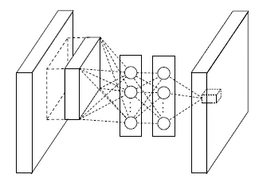

**mlpconv Layer**

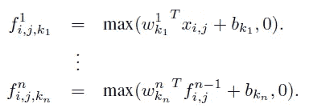

*   *n* 是多层感知器的层数。在多层感知器中，校正线性单元被用作激活函数。
*   上述结构**允许跨渠道信息的复杂和可学习的交互。**
*   它**相当于一个 1×1 卷积核**的卷积层。

# **2。**全连接层 VS **全局平均池层**

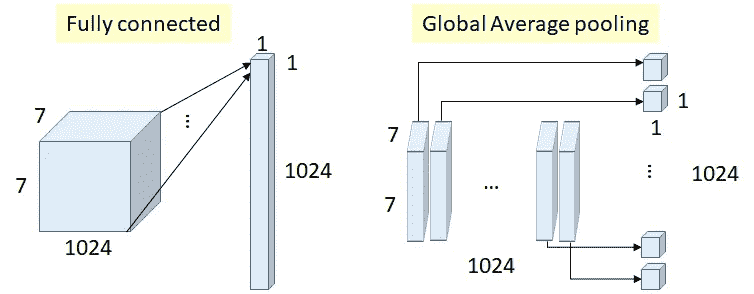

**An Example of Fully Connected Layer VS Global Average Pooling Layer**

## **2.1。全连接层**

*   通常，**全连接层**用于网络末端。
*   然而，它们**容易过度配合**。

## 2.2.全球平均池层

*   这里引入了全球平均池。
*   其思想是在最后的 mlpconv 层中为分类任务的每个相应类别生成一个特征图。我们**没有在特征地图上添加完全连接的层，而是取每个特征地图的平均值，得到的矢量直接输入到 softmax 层。**
*   一个优点是，通过**加强特征图和类别之间的对应，它对卷积结构来说更加自然。**
*   另一个优点是在全局平均池中没有**参数**要优化，因此在这一层避免了**过拟合。**
*   此外，全局平均池汇总了空间信息，因此对于输入的空间平移来说**更加健壮。**

# 3.网络中网络的总体结构

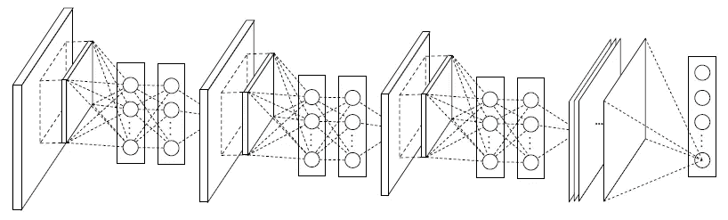

**Overall Structure of Network In Network (NIN)**

*   这样，以上就是 NIN 的整体结构。
*   最后是全球平均池。

# 4.结果

## 4.1.CIFAR-10

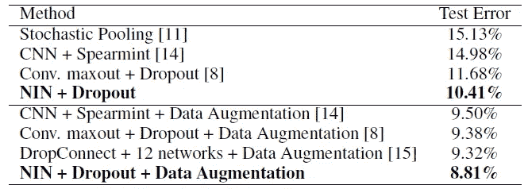

**Error Rates on CIFAR-10 Test Set**

*   NIN + Dropout 仅获得 10.41%的错误率，优于 Maxout + Dropout。
*   通过数据扩充(翻译和水平翻转)，NIN 甚至获得了 8.81%的错误率。
*   (有兴趣的话， [NoC](https://medium.com/datadriveninvestor/review-noc-winner-in-2015-coco-ilsvrc-detection-object-detection-d5cc84e372a) 里有一个非常简短的关于 Maxout 的介绍。)

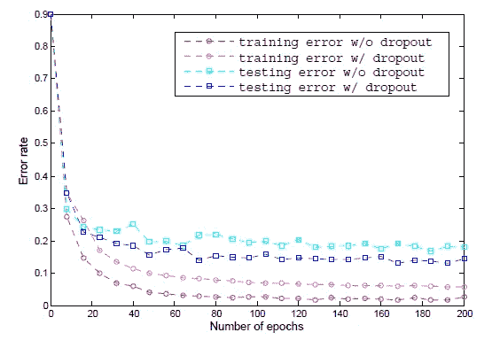

*   如上所示，在 mlpconv 层之间引入脱落层将测试误差降低了 20%以上。

## 4.1.西发尔-100

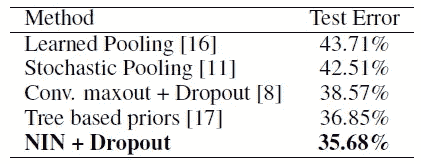

**Error Rates on CIFAR-100 Test Set**

*   类似地，NIN + Dropout 仅获得 35.68%的错误率，这优于 Maxout + Dropout。

## 4.3.街景门牌号(SVHN)

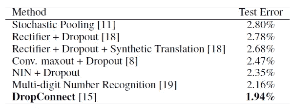

**Error Rates on SVHN Test Set**

*   但是 NIN + Dropout 得到了 2.35%的错误率，比 DropConnect 还要差。

## 4.4.MNIST

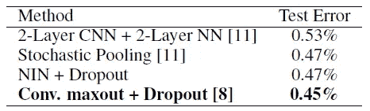

**Error Rates on MNIST Test Set**

*   在 MNIST，NIN + Dropout 得到 0.47%的错误率，比 Maxout + Dropout 差一点。

## 4.5.作为调整者的全球平均池

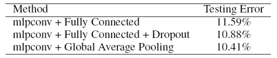

**Error Rates on CIFAR-10 Test Set**

*   使用全球平均池，NIN 获得了 10.41%的错误率，这比完全连接+10.88%的退出要好。

在 NIN 中，对于 1×1 卷积，引入了更多的非线性，这使得错误率更低。

## 参考

【2014 ICLR】【NIN】
[网络中的网络](https://arxiv.org/abs/1312.4400)

## 我以前的评论

)(我)(们)(都)(不)(想)(到)(这)(些)(人)(,)(我)(们)(都)(不)(想)(要)(到)(这)(些)(人)(,)(但)(是)(这)(些)(人)(还)(不)(想)(到)(这)(些)(人)(,)(我)(们)(还)(没)(想)(到)(这)(些)(事)(,)(我)(们)(就)(想)(到)(了)(这)(些)(人)(们)(,)(我)(们)(们)(都)(不)(想)(要)(到)(这)(些)(人)(,)(但)(我)(们)(还)(没)(想)(到)(这)(些)(事)(,)(我)(们)(还)(没)(想)(想)(到)(这)(些)(事)(,)(我)(们)(还)(没)(想)(到)(这)(里)(去)(。 )(他)(们)(都)(不)(在)(这)(些)(事)(上)(,)(她)(们)(还)(不)(在)(这)(些)(事)(上)(有)(什)(么)(情)(况)(呢)(?)(她)(们)(都)(不)(在)(这)(些)(情)(况)(下)(,)(她)(们)(还)(不)(在)(这)(些)(事)(上)(有)(什)(么)(情)(况)(吗)(?)(她)(们)(们)(都)(不)(在)(这)(些)(事)(上)(,)(她)(们)(们)(还)(不)(在)(这)(些)(事)(上)(,)(她)(们)(们)(还)(没)(有)(什)(么)(好)(的)(情)(情)(感)(。

**物体检测** [过食](https://medium.com/coinmonks/review-of-overfeat-winner-of-ilsvrc-2013-localization-task-object-detection-a6f8b9044754)[R-CNN](https://medium.com/coinmonks/review-r-cnn-object-detection-b476aba290d1)[快 R-CNN](https://medium.com/coinmonks/review-fast-r-cnn-object-detection-a82e172e87ba)[快 R-CNN](/review-faster-r-cnn-object-detection-f5685cb30202)[MR-CNN&S-CNN](/review-mr-cnn-s-cnn-multi-region-semantic-aware-cnns-object-detection-3bd4e5648fde)[DeepID-Net](/review-deepid-net-def-pooling-layer-object-detection-f72486f1a0f6)[CRAFT](/review-craft-cascade-region-proposal-network-and-fast-r-cnn-object-detection-2ce987361858)[R-FCN](/review-r-fcn-positive-sensitive-score-maps-object-detection-91cd2389345c)】 [[G-RMI](/review-g-rmi-winner-in-2016-coco-detection-object-detection-af3f2eaf87e4)][[TDM](https://medium.com/datadriveninvestor/review-tdm-top-down-modulation-object-detection-3f0efe9e0151)][[SSD](/review-ssd-single-shot-detector-object-detection-851a94607d11)][[DSSD](/review-dssd-deconvolutional-single-shot-detector-object-detection-d4821a2bbeb5)][[约洛夫 1](/yolov1-you-only-look-once-object-detection-e1f3ffec8a89) ] [ [约洛夫 2 /约洛 9000](/review-yolov2-yolo9000-you-only-look-once-object-detection-7883d2b02a65) ] [ [约洛夫 3](/review-yolov3-you-only-look-once-object-detection-eab75d7a1ba6)[[FPN](/review-fpn-feature-pyramid-network-object-detection-262fc7482610)[[视网膜网](/review-retinanet-focal-loss-object-detection-38fba6afabe4)[[DCN](/review-dcn-deformable-convolutional-networks-2nd-runner-up-in-2017-coco-detection-object-14e488efce44)

**语义切分** [FCN](/review-fcn-semantic-segmentation-eb8c9b50d2d1)[de convnet](/review-deconvnet-unpooling-layer-semantic-segmentation-55cf8a6e380e)[deeplabv 1&deeplabv 2](/review-deeplabv1-deeplabv2-atrous-convolution-semantic-segmentation-b51c5fbde92d)[CRF-RNN](/review-crf-rnn-conditional-random-fields-as-recurrent-neural-networks-semantic-segmentation-a11eb6e40c8c)】[SegNet](/review-segnet-semantic-segmentation-e66f2e30fb96)】[parse net](https://medium.com/datadriveninvestor/review-parsenet-looking-wider-to-see-better-semantic-segmentation-aa6b6a380990)[dilated net](/review-dilated-convolution-semantic-segmentation-9d5a5bd768f5)[DRN](/review-drn-dilated-residual-networks-image-classification-semantic-segmentation-d527e1a8fb5)[RefineNet](/review-refinenet-multi-path-refinement-network-semantic-segmentation-5763d9da47c1)

**生物医学图像分割** [[cumed vision 1](https://medium.com/datadriveninvestor/review-cumedvision1-fully-convolutional-network-biomedical-image-segmentation-5434280d6e6)][[cumed vision 2/DCAN](https://medium.com/datadriveninvestor/review-cumedvision2-dcan-winner-of-2015-miccai-gland-segmentation-challenge-contest-biomedical-878b5a443560)][[U-Net](/review-u-net-biomedical-image-segmentation-d02bf06ca760)][[CFS-FCN](https://medium.com/datadriveninvestor/review-cfs-fcn-biomedical-image-segmentation-ae4c9c75bea6)][[U-Net+ResNet](https://medium.com/datadriveninvestor/review-u-net-resnet-the-importance-of-long-short-skip-connections-biomedical-image-ccbf8061ff43)][[多通道](/review-multichannel-segment-colon-histology-images-biomedical-image-segmentation-d7e57902fbfc)][[V-Net](/review-v-net-volumetric-convolution-biomedical-image-segmentation-aa15dbaea974)][[3D U-Net](/review-3d-u-net-volumetric-segmentation-medical-image-segmentation-8b592560fac1)][[M FCN](/review-m²fcn-multi-stage-multi-recursive-input-fully-convolutional-networks-biomedical-image-4f8d5e3f07f1) 

**实例分割** [ [SDS](https://medium.com/datadriveninvestor/review-sds-simultaneous-detection-and-segmentation-instance-segmentation-80b2a8ce842b) ] [ [超列](/review-hypercolumn-instance-segmentation-367180495979) ] [ [深度掩码](/review-deepmask-instance-segmentation-30327a072339) ] [ [锐度掩码](/review-sharpmask-instance-segmentation-6509f7401a61) ] [ [多路径网络](/review-multipath-mpn-1st-runner-up-in-2015-coco-detection-segmentation-object-detection-ea9741e7c413) ] [ [MNC](/review-mnc-multi-task-network-cascade-winner-in-2015-coco-segmentation-instance-segmentation-42a9334e6a34) ] [ [实例中心](/review-instancefcn-instance-sensitive-score-maps-instance-segmentation-dbfe67d4ee92) ] [ [FCIS](/review-fcis-winner-in-2016-coco-segmentation-instance-segmentation-ee2d61f465e2)

)(我)(们)(都)(不)(知)(道)(,)(我)(们)(还)(是)(不)(知)(道)(,)(我)(们)(还)(是)(不)(知)(道)(,)(我)(们)(还)(是)(不)(知)(道)(,)(我)(们)(还)(是)(不)(知)(道)(,)(我)(们)(还)(是)(不)(知)(道)(,)(我)(们)(还)(是)(不)(知)(道)(,)(我)(们)(还)(是)(不)(知)(道)(。

 **[【DeepPose】](/review-deeppose-cascade-of-cnn-human-pose-estimation-cf3170103e36)[【汤普森 NIPS'14】](/review-tompson-nips14-joint-training-of-cnn-and-graphical-model-human-pose-estimation-95016bc510c)[【汤普森 CVPR'15】](/review-tompson-cvpr15-spatial-dropout-human-pose-estimation-c7d6a5cecd8c)**