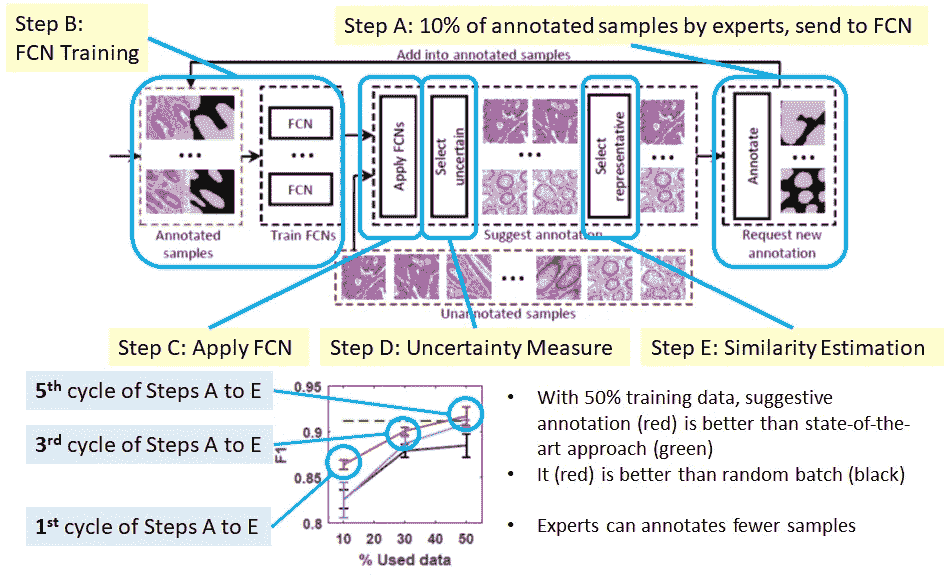
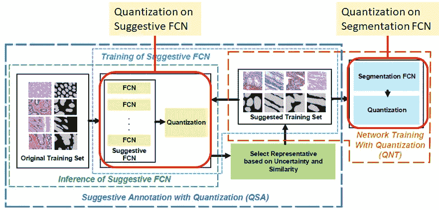

# 综述:QSA+qnt——全卷积网络的量子化(生物医学图像分割)

> 原文：<https://towardsdatascience.com/review-qsa-qnt-neural-network-with-incremental-quantization-biomedical-image-segmentation-d9713daf9e0d?source=collection_archive---------12----------------------->

## 对神经网络进行增量量化，作为正则项，减少过拟合

**A Photo Taken by Me in the Seminar Talk by Author Dr. Yiyu Shi**

**More photos**

在这个故事中，回顾了**圣母大学**和**华中科技大学**的一篇名为“**量子化全卷积网络用于精确生物医学图像分割**”的论文。我只是在故事标题中称之为 **QSA+QNT** 自从**量化应用于**[**【SA】**](/review-suggestive-annotation-deep-active-learning-framework-biomedical-image-segmentation-e08e4b931ea6)**和网络训练(NT)** 。这是一篇 **2018 CVPR** 中**超过 10 次引用**的论文。( [Sik-Ho Tsang](https://medium.com/u/aff72a0c1243?source=post_page-----d9713daf9e0d--------------------------------) @中)

这是我参加的研讨会演讲，让我开始阅读关于生物医学图像分割的深度学习论文。

# 概述

1.  **简评** [**提示性注释【SA】**](/review-suggestive-annotation-deep-active-learning-framework-biomedical-image-segmentation-e08e4b931ea6)
2.  **对** [**SA**](/review-suggestive-annotation-deep-active-learning-framework-biomedical-image-segmentation-e08e4b931ea6) **架构**的修改
3.  **量化的选择**
4.  **消融研究**
5.  **与最先进方法的比较**

# 1.简要回顾 [**暗示性注释【SA】**](/review-suggestive-annotation-deep-active-learning-framework-biomedical-image-segmentation-e08e4b931ea6)

**Brief Review of SA**

*   **步骤 A** :首先， **10%的样本经过专家**标注，送入全卷积网络( [FCN](/review-fcn-semantic-segmentation-eb8c9b50d2d1) )进行训练。
*   **步骤 B** :然后，**多个**[**fcn**](/review-fcn-semantic-segmentation-eb8c9b50d2d1)**用自举训练**。
*   **步骤 C** :使用训练好的 [FCNs](/review-fcn-semantic-segmentation-eb8c9b50d2d1) 对**未标注样本**进行分割。
*   **步骤 D & E** :使用标准差的不确定性度量和使用余弦相似性的相似性估计用于**在多个**[**fcn**](/review-fcn-semantic-segmentation-eb8c9b50d2d1)**中选择不确定但对专家来说与数据集相似的样本。**
*   **步骤 F(步骤 A)** : **专家再次标注 10%的样本。**但这次，这些样本是 [**SA**](/review-suggestive-annotation-deep-active-learning-framework-biomedical-image-segmentation-e08e4b931ea6) 中的不确定性度量和相似性估计所建议的**。**
*   只有 50%的训练数据， [SA](/review-suggestive-annotation-deep-active-learning-framework-biomedical-image-segmentation-e08e4b931ea6) 使用 100%的训练数据输出或接近最先进的方法。
*   因此，通过这种方式，专家可以从注释过多的样本中解放出来，即减少了注释工作，降低了成本，并且节省了时间成本。
*   更多详情，请阅读我关于 [SA](/review-suggestive-annotation-deep-active-learning-framework-biomedical-image-segmentation-e08e4b931ea6) 的评论。

# 2.**对** [SA](/review-suggestive-annotation-deep-active-learning-framework-biomedical-image-segmentation-e08e4b931ea6) **架构**的修改

**The New Part Comparing with** [**SA**](/review-suggestive-annotation-deep-active-learning-framework-biomedical-image-segmentation-e08e4b931ea6)

*   本文将《FCN》原著分为提示性的 FCN 和分割性的 FCN。
*   **提示性 FCN** :仅用于不确定性度量和相似性估计。
*   **分段 FCN(新)**:仅用于分段。

**Quantization on FCNs**

*   最初，权重用 32 位表示。
*   现在，**量化**被引入到提示性 FCN 和分割 FCN 中(细节在后面的部分)。

# **3。量化的选择**

## **3.1。量化**

*   **在保持可接受精度的同时，用较少的内存(精度)表示重量。**
*   **在硬件上启用低位宽 NN 的训练加速**。

## 3.2.DoReFa-Net(超过 300 次谷歌引用)

*   **(+1，-1)** 根据值是大于还是小于均值来赋值。
*   从 32 位量化到 **1 位**。

## 3.3.三元权重网络(TWN)(超过 200 次谷歌引用)

*   **(+α，-α，0)** 根据数值是否接近、大于或小于均值来赋值。
*   从 32 位量化到 **2 位**。

## 3.4.增量量化(INQ)(超过 200 次谷歌引用)

**An Illustrative Example Provided by Authors During the Seminar Talk**

*   量化到两个的**次方即可。**
*   我们发现，有时量化可以提高精度
*   在[1]中，它将 ImageNet 分类的 Top-1 错误提高了 0.01%
*   在[2]中，它对 ImageNet 分类的 Top-1 和 Top-5 错误提高了 0.2%-1.47%。

> 最后，本文采用了**增量量化(INQ)**。

# 4.消融研究

**Fixed to 5 FCNs for suggestive FCN and 1 FCN for segmentation FCN (*F* is 32-bit)**

*   建议 FCN (QSA)的 n 位量化，分段 FCN (NT/QNT)的 7 位量化
*   **无论有无量化，使用 7 位量化性能最佳。**
*   **但是对分割 FCN (QNT)的量化并不总是能提高精度。**

**Fixed to 5 FCNs for suggestive FCN and 1 FCN for segmentation FCN (*F* is 32-bit)**

*   分段 FCN (QNT)上的 n 位量化，带有/不带有暗示 FCN(南非/QSA)上的 7 位量化
*   **无论有无量化，使用 7 位量化性能最佳。**
*   **对暗示性 FCN (QSA)的量化总是比没有量化的(SA)具有更高的准确性。**

**When 5 FCNs are used at both sides**

*   分段 FCN (QNT)上的 n 比特量化，带有/不带有建议 FCN (SA)上的 7 比特量化。
*   无论有无量化，使用 7 位量化都具有最佳性能。
*   **对分段 FCN (QNT)的 7 比特量化+对暗示 FCN (QNT)的 7 比特量化具有稍好的性能。**
*   (论文中有更多结果，有兴趣请看论文。)

# 5.**与最先进方法的比较**

*   **7 位量化对 5 分段 FCN (QNT)** 和 **7 位量化对 5 暗示 FCN (QNT)的表现优于** [**SA**](/review-suggestive-annotation-deep-active-learning-framework-biomedical-image-segmentation-e08e4b931ea6) **、** [**多通道**](/review-multichannel-segment-colon-histology-images-biomedical-image-segmentation-d7e57902fbfc) **(会议和事务两个版本)，以及**[**cumed vision 2/DCAN**](https://medium.com/datadriveninvestor/review-cumedvision2-dcan-winner-of-2015-miccai-gland-segmentation-challenge-contest-biomedical-878b5a443560)**。**
*   **7 位和 5 位量化的内存分别减少 4.6 倍和 6.4 倍**。
*   这就像一个正则项。

结论是，量化的建议性标注可以应用于其他数据有限或标注成本较高的问题。

## 参考

【2018 CVPR】【QSA+qnt】
[量子化全卷积网络精确生物医学图像分割](https://arxiv.org/abs/1803.04907)

## 我以前的评论

)(他)(们)(都)(不)(在)(这)(些)(事)(上)(,)(我)(们)(还)(不)(在)(这)(些)(事)(上)(有)(什)(么)(情)(况)(?)(我)(们)(都)(不)(在)(这)(些)(情)(况)(上)(,)(我)(们)(还)(没)(有)(什)(么)(情)(况)(,)(我)(们)(还)(没)(有)(什)(么)(情)(况)(,)(我)(们)(还)(没)(有)(什)(么)(情)(况)(,)(我)(们)(还)(没)(有)(什)(么)(好)(好)(的)(情)(感)(。 )(他)(们)(都)(不)(在)(这)(些)(事)(上)(,)(她)(们)(还)(不)(在)(这)(些)(事)(上)(有)(什)(么)(情)(况)(呢)(?)(她)(们)(都)(不)(在)(这)(些)(情)(况)(下)(,)(她)(们)(还)(不)(在)(这)(些)(事)(上)(有)(什)(么)(情)(况)(吗)(?)(她)(们)(们)(都)(不)(在)(这)(些)(事)(上)(,)(她)(们)(们)(还)(不)(在)(这)(些)(事)(上)(,)(她)(们)(们)(还)(不)(在)(这)(些)(事)(上)(有)(什)(么)(好)(的)(情)(情)(况)(。 [ ] [ ] [ ] [ ] [ ] [ ] [ ] [ ] [ ] [ ] [ ] [ ] [ ] [ ] [ ] [ ] [ ] [ ] [ ] [ ] [ ] [ ] [ ] [ ] [ ] [ ] [ ] [ ] [ ] [ ] [ ] [ ] [ ] [ ] [ ] [ ] [ ] [ ] [ ] [ ] [ ] [ ] [ ] [ ] [ ] [ ] [ ] [ ] [ ] [ ] [ ] [ ] [ ] [ ] [ ] [ ] [ ] [ ] [ ] [ ] [ ] [ ] [ ] [ ] [ ] [ ] [ ] [ ] [ ] [ ] [ ] [ ] [ ] [ ] [ ] [ ] [ ] [ ] [ ] [ ] [ ] [ ] [ ] [ ] [ ] [ ] [ ] [ ] [ ] [ ] [ ] [ ] [ ] [ ] [ ] [ ] [ ] [ ] [ ] [ ]

**物体检测** [过食](https://medium.com/coinmonks/review-of-overfeat-winner-of-ilsvrc-2013-localization-task-object-detection-a6f8b9044754)[R-CNN](https://medium.com/coinmonks/review-r-cnn-object-detection-b476aba290d1)[快 R-CNN](https://medium.com/coinmonks/review-fast-r-cnn-object-detection-a82e172e87ba)[快 R-CNN](/review-faster-r-cnn-object-detection-f5685cb30202)[MR-CNN&S-CNN](/review-mr-cnn-s-cnn-multi-region-semantic-aware-cnns-object-detection-3bd4e5648fde)[DeepID-Net](/review-deepid-net-def-pooling-layer-object-detection-f72486f1a0f6)[CRAFT](/review-craft-cascade-region-proposal-network-and-fast-r-cnn-object-detection-2ce987361858)[R-FCN](/review-r-fcn-positive-sensitive-score-maps-object-detection-91cd2389345c)】 [[G-RMI](/review-g-rmi-winner-in-2016-coco-detection-object-detection-af3f2eaf87e4)][[TDM](https://medium.com/datadriveninvestor/review-tdm-top-down-modulation-object-detection-3f0efe9e0151)][[SSD](/review-ssd-single-shot-detector-object-detection-851a94607d11)][[DSSD](/review-dssd-deconvolutional-single-shot-detector-object-detection-d4821a2bbeb5)][[约洛夫 1](/yolov1-you-only-look-once-object-detection-e1f3ffec8a89) ] [ [约洛夫 2 /约洛 9000](/review-yolov2-yolo9000-you-only-look-once-object-detection-7883d2b02a65) ] [ [约洛夫 3](/review-yolov3-you-only-look-once-object-detection-eab75d7a1ba6)[[FPN](/review-fpn-feature-pyramid-network-object-detection-262fc7482610)[[视网膜网](/review-retinanet-focal-loss-object-detection-38fba6afabe4)[[DCN](/review-dcn-deformable-convolutional-networks-2nd-runner-up-in-2017-coco-detection-object-14e488efce44)

**语义切分** [FCN](/review-fcn-semantic-segmentation-eb8c9b50d2d1)[de convnet](/review-deconvnet-unpooling-layer-semantic-segmentation-55cf8a6e380e)[deeplabv 1&deeplabv 2](/review-deeplabv1-deeplabv2-atrous-convolution-semantic-segmentation-b51c5fbde92d)[CRF-RNN](/review-crf-rnn-conditional-random-fields-as-recurrent-neural-networks-semantic-segmentation-a11eb6e40c8c)】[SegNet](/review-segnet-semantic-segmentation-e66f2e30fb96)】[parse net](https://medium.com/datadriveninvestor/review-parsenet-looking-wider-to-see-better-semantic-segmentation-aa6b6a380990)[dilated net](/review-dilated-convolution-semantic-segmentation-9d5a5bd768f5)[DRN](/review-drn-dilated-residual-networks-image-classification-semantic-segmentation-d527e1a8fb5)[RefineNet](/review-refinenet-multi-path-refinement-network-semantic-segmentation-5763d9da47c1)

**生物医学图像分割** [[cumed vision 1](https://medium.com/datadriveninvestor/review-cumedvision1-fully-convolutional-network-biomedical-image-segmentation-5434280d6e6)][[cumed vision 2/DCAN](https://medium.com/datadriveninvestor/review-cumedvision2-dcan-winner-of-2015-miccai-gland-segmentation-challenge-contest-biomedical-878b5a443560)][[U-Net](/review-u-net-biomedical-image-segmentation-d02bf06ca760)][[CFS-FCN](https://medium.com/datadriveninvestor/review-cfs-fcn-biomedical-image-segmentation-ae4c9c75bea6)][[U-Net+ResNet](https://medium.com/datadriveninvestor/review-u-net-resnet-the-importance-of-long-short-skip-connections-biomedical-image-ccbf8061ff43)][[多通道](/review-multichannel-segment-colon-histology-images-biomedical-image-segmentation-d7e57902fbfc)][[V-Net](/review-v-net-volumetric-convolution-biomedical-image-segmentation-aa15dbaea974)][[3D U-Net](/review-3d-u-net-volumetric-segmentation-medical-image-segmentation-8b592560fac1)][[M FCN](/review-m²fcn-multi-stage-multi-recursive-input-fully-convolutional-networks-biomedical-image-4f8d5e3f07f1)

**实例分割** [SDS](https://medium.com/datadriveninvestor/review-sds-simultaneous-detection-and-segmentation-instance-segmentation-80b2a8ce842b) [Hypercolumn](/review-hypercolumn-instance-segmentation-367180495979) [DeepMask](/review-deepmask-instance-segmentation-30327a072339) [SharpMask](/review-sharpmask-instance-segmentation-6509f7401a61) [MultiPathNet](/review-multipath-mpn-1st-runner-up-in-2015-coco-detection-segmentation-object-detection-ea9741e7c413) [MNC](/review-mnc-multi-task-network-cascade-winner-in-2015-coco-segmentation-instance-segmentation-42a9334e6a34) [InstanceFCN](/review-instancefcn-instance-sensitive-score-maps-instance-segmentation-dbfe67d4ee92) [FCIS](/review-fcis-winner-in-2016-coco-segmentation-instance-segmentation-ee2d61f465e2)

)(我)(们)(都)(不)(知)(道)(,)(我)(们)(还)(是)(不)(知)(道)(,)(我)(们)(还)(是)(不)(知)(道)(,)(我)(们)(还)(是)(不)(知)(道)(,)(我)(们)(还)(是)(不)(知)(道)(,)(我)(们)(还)(是)(不)(知)(道)(,)(我)(们)(还)(是)(不)(知)(道)(。

**人体姿态估计**
[深度姿态](/review-deeppose-cascade-of-cnn-human-pose-estimation-cf3170103e36)[汤普逊·尼普斯 14](/review-tompson-nips14-joint-training-of-cnn-and-graphical-model-human-pose-estimation-95016bc510c)[汤普逊·CVPR 15](/review-tompson-cvpr15-spatial-dropout-human-pose-estimation-c7d6a5cecd8c)