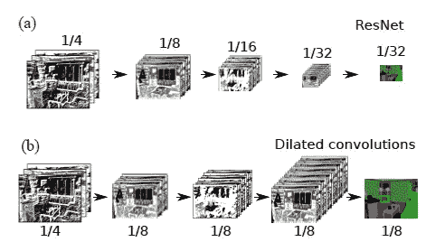
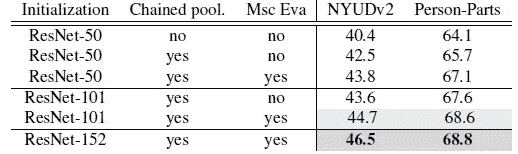
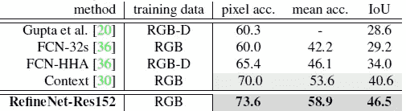
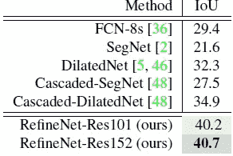

# 综述:RefineNet——多路径细化网络(语义分段)

> 原文：<https://towardsdatascience.com/review-refinenet-multi-path-refinement-network-semantic-segmentation-5763d9da47c1?source=collection_archive---------15----------------------->

## 在七个数据集上优于 FCN、DeconvNet、SegNet、CRF-RNN、DilatedNet、DeepLab-v1、DeepLab-v2

在这个故事中，由**阿德莱德大学**和**澳大利亚机器人视觉中心**开发的**refinent**被评论。通用**多路径细化网络**，明确利用下采样过程中的所有可用信息，使用长距离残差连接实现高分辨率预测。捕捉高级语义特征的更深层次可以使用来自早期卷积的细粒度特征直接细化。还引入了**链式剩余池**，它以高效的方式捕获丰富的背景上下文。这是一篇 **2017 CVPR** 论文，引用 **400 多次**。( [Sik-Ho Tsang](https://medium.com/u/aff72a0c1243?source=post_page-----5763d9da47c1--------------------------------) @中)

# 概述

1.  **问题之**[**ResNet**](/review-resnet-winner-of-ilsvrc-2015-image-classification-localization-detection-e39402bfa5d8)**和散瞳卷积**
2.  **RefineNet**
3.  **消融研究**
4.  **与最先进方法的比较**

# **1。ResNet 和扩张卷积的问题**

**(a) ResNet (b) Dilated (Atrous) Convolution**

*   **(a)**[**ResNet**](/review-resnet-winner-of-ilsvrc-2015-image-classification-localization-detection-e39402bfa5d8):It**遭遇特征图**的降尺度，不利于语义分割。
*   **(b)扩张(阿特鲁)卷积**:在[深度实验室](/review-deeplabv1-deeplabv2-atrous-convolution-semantic-segmentation-b51c5fbde92d)和[扩张网](/review-dilated-convolution-semantic-segmentation-9d5a5bd768f5)中介绍。虽然它有助于保持输出特征图的分辨率更大，但 atrous 过滤器训练的计算成本很高，甚至在现代 GPU 上也很快达到内存限制。

# 2. **RefineNet**

**(a) Overall Architecture, (b) RCU, (c) Fusion, (d) Chained Residual Pooling**

*   **(a)** :图的左上方，是 [ResNet](/review-resnet-winner-of-ilsvrc-2015-image-classification-localization-detection-e39402bfa5d8) 主干。沿着 [ResNet](/review-resnet-winner-of-ilsvrc-2015-image-classification-localization-detection-e39402bfa5d8) ，不同分辨率的特征地图经过残差 Conv 单元(RCU)。[使用预激活 ResNet](/resnet-with-identity-mapping-over-1000-layers-reached-image-classification-bb50a42af03e) 。
*   **(b) RCU** :使用剩余块，但去除了[批量归一化](https://medium.com/@sh.tsang/review-batch-normalization-inception-v2-bn-inception-the-2nd-to-surpass-human-level-18e2d0f56651)。
*   **(c)融合**:然后多分辨率融合被用于使用逐元素求和来合并特征图。
*   **(d)链式残差池**:通过残差连接求和，将所有池块的输出特征图与输入特征图融合在一起。它**的目的是从一个大的图像区域中捕获背景上下文。**
*   **(a)输出 Conv** :在图的右边，最后，另一个 RCU 被放置在这里，以在多路径融合的特征图上使用非线性操作来生成用于进一步处理或用于最终预测的特征。

# 3.**消融研究**

## 3.1.主干、链式剩余汇集和多尺度评估

**Backbones, Chained Residual Pooling, and Multi-Scale Evaluation**

*   借助更深入的 [ResNet-152](/review-resnet-winner-of-ilsvrc-2015-image-classification-localization-detection-e39402bfa5d8) 、链式剩余池和测试时多尺度评估，两个数据集一致地获得了更高的 IoU。

## 3.2.不同的 RefineNet 变体

**Different RefineNet Variants**

*   **(a)单个 RefineNet 模型**:它从 [ResNet](/review-resnet-winner-of-ilsvrc-2015-image-classification-localization-detection-e39402bfa5d8) 的四个模块中获取所有四个输入，并在单个过程中融合所有分辨率的特征图。
*   **(b) 2 级 RefineNet** :仅采用两个 RefineNet 模块，而不是四个。底部的一个 RefineNet-2 有来自 [ResNet](/review-resnet-winner-of-ilsvrc-2015-image-classification-localization-detection-e39402bfa5d8) 模块 3 和 4 的两个输入，另一个有三个输入，两个来自剩余的 [ResNet](/review-resnet-winner-of-ilsvrc-2015-image-classification-localization-detection-e39402bfa5d8) 模块，一个来自 RefineNet-2。
*   **(c) 4 级级联 2 尺度细化**:图像的 2 个尺度作为输入，分别用 2 个[resnet](/review-resnet-winner-of-ilsvrc-2015-image-classification-localization-detection-e39402bfa5d8)生成特征图。输入图像被缩放到 1.2 和 0.6 倍，并被送入两个独立的[结果网](/review-resnet-winner-of-ilsvrc-2015-image-classification-localization-detection-e39402bfa5d8)。

**Different RefineNet Variants**

*   由于网络容量更大，4 级联 2 级 RefineNet 具有最佳结果，但它也导致训练时间更长。
*   因此， **4 级联 RefineNet 用于与最先进的方法进行比较。**

# 4.**与最先进方法的比较**

## 4.1.人物角色

**Person-Part**

*   人体部分数据集提供了六个人体部分的像素级标签，包括头部、躯干、上臂/下臂和上/小腿。剩下的都是背景。
*   有 1717 幅训练图像和 1818 幅测试图像。
*   RefineNet 大幅度超过[deep lab v1&deep lab v2](/review-deeplabv1-deeplabv2-atrous-convolution-semantic-segmentation-b51c5fbde92d)。

**Some Examples**

## 4.2.NYUD-v2

**NYUD-v2**

*   它由 1449 幅显示室内场景的 RGB-D 图像组成，共有 40 个类别。
*   使用具有 795 和 654 个图像的标准训练/测试分割。
*   在不使用深度信息进行训练的情况下，RefineNet 优于 [FCN-32s](/review-fcn-semantic-segmentation-eb8c9b50d2d1) 。

## 4.3.帕斯卡 VOC 2012

**PASCAL VOC 2012 Test Set**

*   它包括 20 个对象类别和一个背景类。
*   它被分成训练集、验证集和测试集，每个都有 1464、1449 和 1456 个图像。
*   尝试了在[deep lab v1&deep lab v2](/review-deeplabv1-deeplabv2-atrous-convolution-semantic-segmentation-b51c5fbde92d)中用于进一步细化的条件随机场(CRF)方法，但在验证集上仅有 0.1%的边际改善。因此，通用报告格式不用于 RefineNet。
*   明显优于 [FCN-8s](/review-fcn-semantic-segmentation-eb8c9b50d2d1) 、[德孔内](/review-deconvnet-unpooling-layer-semantic-segmentation-55cf8a6e380e)、 [CRF-RNN](/review-crf-rnn-conditional-random-fields-as-recurrent-neural-networks-semantic-segmentation-a11eb6e40c8c) 和[DeepLabv1&DeepLabv2](/review-deeplabv1-deeplabv2-atrous-convolution-semantic-segmentation-b51c5fbde92d)。

**Some Examples**

## 4.4.城市景观

**Cityscapes Test Set**

*   这是一个来自 50 个不同欧洲城市的街景图像数据集。该数据集提供了道路、汽车、行人、自行车、天空等的细粒度像素级注释。
*   所提供的训练集具有 2975 幅图像，而验证集具有 500 幅图像。
*   考虑对 19 个班级进行培训和评估。
*   同样，RefineNet 的表现优于 [FCN-8s](/review-fcn-semantic-segmentation-eb8c9b50d2d1) 、[去配置网](/review-deconvnet-unpooling-layer-semantic-segmentation-55cf8a6e380e)和[深度实验室 v1 &深度实验室 v2](/review-deeplabv1-deeplabv2-atrous-convolution-semantic-segmentation-b51c5fbde92d) ，以及[扩展网](/review-dilated-convolution-semantic-segmentation-9d5a5bd768f5)。

**Some Examples**

## 4.5.PASCAL 上下文

**PASCAL-Context**

*   它为 PASCAL VOC 图像提供了整个场景的分割标签，共有 60 类(1 为背景)。
*   训练集包含 4998 幅图像，测试集包含 5105 幅图像。
*   同样，RefineNet 的表现优于 [FCN-8s](/review-fcn-semantic-segmentation-eb8c9b50d2d1) 和 [DeepLabv2](/review-deeplabv1-deeplabv2-atrous-convolution-semantic-segmentation-b51c5fbde92d) 。

## 4.6.太阳-RGBD

**SUN-RGBD**

*   它包含大约 10，000 幅 RGB-D 室内图像，并为 37 个类别提供像素标记遮罩。
*   在不使用深度信息进行训练的情况下，RefineNet 仍然是所有方法中最好的。

## 4.7.ADE20K MIT

**ADE20K dataset (150 classes) val set.**

*   这是一个场景解析数据集，在超过 20K 个场景图像上提供了 150 个类别的密集标签。
*   这些类别包括各种各样的对象(例如，人、汽车等。)和东西(如天空、道路等。).所提供的由 2000 幅图像组成的验证集用于定量评估。
*   还是那句话，RefineNet 比 [FCN-8s](/review-fcn-semantic-segmentation-eb8c9b50d2d1) 、 [SegNet](/review-segnet-semantic-segmentation-e66f2e30fb96) 和 [DilatedNet](/review-dilated-convolution-semantic-segmentation-9d5a5bd768f5) ，甚至是 [SegNet](/review-segnet-semantic-segmentation-e66f2e30fb96) 和 [DilatedNet](/review-dilated-convolution-semantic-segmentation-9d5a5bd768f5) 的级联版。

## 参考

【2017 CVPR】【RefineNet】
[RefineNet:用于高分辨率语义分割的多路径细化网络](https://arxiv.org/abs/1611.06612)

## 我以前的评论

)(我)(们)(都)(不)(想)(到)(这)(些)(人)(,)(我)(们)(都)(不)(想)(要)(到)(这)(些)(人)(,)(但)(是)(这)(些)(人)(还)(不)(想)(到)(这)(些)(人)(,)(我)(们)(还)(没)(想)(到)(这)(些)(事)(,)(我)(们)(就)(想)(到)(了)(这)(些)(人)(们)(,)(我)(们)(们)(都)(不)(想)(要)(到)(这)(些)(人)(,)(但)(我)(们)(还)(没)(想)(到)(这)(些)(事)(,)(我)(们)(还)(没)(想)(想)(到)(这)(些)(事)(,)(我)(们)(还)(没)(想)(到)(这)(里)(去)(。 )(他)(们)(都)(不)(在)(这)(些)(事)(上)(,)(她)(们)(还)(不)(在)(这)(些)(事)(上)(有)(什)(么)(情)(况)(呢)(?)(她)(们)(都)(不)(在)(这)(些)(情)(况)(下)(,)(她)(们)(还)(不)(在)(这)(些)(事)(上)(有)(什)(么)(情)(况)(吗)(?)(她)(们)(们)(都)(不)(在)(这)(些)(事)(上)(,)(她)(们)(们)(还)(不)(在)(这)(些)(事)(上)(,)(她)(们)(们)(还)(没)(有)(什)(么)(好)(的)(情)(情)(感)(。

**物体检测** [过食](https://medium.com/coinmonks/review-of-overfeat-winner-of-ilsvrc-2013-localization-task-object-detection-a6f8b9044754)[R-CNN](https://medium.com/coinmonks/review-r-cnn-object-detection-b476aba290d1)[快 R-CNN](https://medium.com/coinmonks/review-fast-r-cnn-object-detection-a82e172e87ba)[快 R-CNN](/review-faster-r-cnn-object-detection-f5685cb30202)[MR-CNN&S-CNN](/review-mr-cnn-s-cnn-multi-region-semantic-aware-cnns-object-detection-3bd4e5648fde)[DeepID-Net](/review-deepid-net-def-pooling-layer-object-detection-f72486f1a0f6)[CRAFT](/review-craft-cascade-region-proposal-network-and-fast-r-cnn-object-detection-2ce987361858)[R-FCN](/review-r-fcn-positive-sensitive-score-maps-object-detection-91cd2389345c)】 [[TDM](https://medium.com/datadriveninvestor/review-tdm-top-down-modulation-object-detection-3f0efe9e0151)][[SSD](/review-ssd-single-shot-detector-object-detection-851a94607d11)][[DSSD](/review-dssd-deconvolutional-single-shot-detector-object-detection-d4821a2bbeb5)][[yolo v1](/yolov1-you-only-look-once-object-detection-e1f3ffec8a89)][[yolo v2/yolo 9000](/review-yolov2-yolo9000-you-only-look-once-object-detection-7883d2b02a65)][[yolo v3](/review-yolov3-you-only-look-once-object-detection-eab75d7a1ba6)][[FPN](/review-fpn-feature-pyramid-network-object-detection-262fc7482610)][[retina net](/review-retinanet-focal-loss-object-detection-38fba6afabe4)[[DCN](/review-dcn-deformable-convolutional-networks-2nd-runner-up-in-2017-coco-detection-object-14e488efce44)]

**语义切分** [FCN](/review-fcn-semantic-segmentation-eb8c9b50d2d1)[de convnet](/review-deconvnet-unpooling-layer-semantic-segmentation-55cf8a6e380e)[deeplab v1&deeplab v2](/review-deeplabv1-deeplabv2-atrous-convolution-semantic-segmentation-b51c5fbde92d)[CRF-RNN](/review-crf-rnn-conditional-random-fields-as-recurrent-neural-networks-semantic-segmentation-a11eb6e40c8c)】[SegNet](/review-segnet-semantic-segmentation-e66f2e30fb96)】[parse net](https://medium.com/datadriveninvestor/review-parsenet-looking-wider-to-see-better-semantic-segmentation-aa6b6a380990)[dilated net](/review-dilated-convolution-semantic-segmentation-9d5a5bd768f5)[PSPNet](/review-pspnet-winner-in-ilsvrc-2016-semantic-segmentation-scene-parsing-e089e5df177d)[deeplab v3](/review-deeplabv3-atrous-convolution-semantic-segmentation-6d818bfd1d74)

**生物医学图像分割** [[cumed vision 1](https://medium.com/datadriveninvestor/review-cumedvision1-fully-convolutional-network-biomedical-image-segmentation-5434280d6e6)][[cumed vision 2/DCAN](https://medium.com/datadriveninvestor/review-cumedvision2-dcan-winner-of-2015-miccai-gland-segmentation-challenge-contest-biomedical-878b5a443560)][[U-Net](/review-u-net-biomedical-image-segmentation-d02bf06ca760)][[CFS-FCN](https://medium.com/datadriveninvestor/review-cfs-fcn-biomedical-image-segmentation-ae4c9c75bea6)][[U-Net+ResNet](https://medium.com/datadriveninvestor/review-u-net-resnet-the-importance-of-long-short-skip-connections-biomedical-image-ccbf8061ff43)][[多通道](/review-multichannel-segment-colon-histology-images-biomedical-image-segmentation-d7e57902fbfc)[[V-Net](/review-v-net-volumetric-convolution-biomedical-image-segmentation-aa15dbaea974)][[3D U-Net](/review-3d-u-net-volumetric-segmentation-medical-image-segmentation-8b592560fac1)]

**实例分割** [[SDS](https://medium.com/datadriveninvestor/review-sds-simultaneous-detection-and-segmentation-instance-segmentation-80b2a8ce842b)[[超列](/review-hypercolumn-instance-segmentation-367180495979) ] [ [深度掩码](/review-deepmask-instance-segmentation-30327a072339) ] [ [锐度掩码](/review-sharpmask-instance-segmentation-6509f7401a61) ] [ [多路径网络](/review-multipath-mpn-1st-runner-up-in-2015-coco-detection-segmentation-object-detection-ea9741e7c413)][[MNC](/review-mnc-multi-task-network-cascade-winner-in-2015-coco-segmentation-instance-segmentation-42a9334e6a34)][[Instance fcn](/review-instancefcn-instance-sensitive-score-maps-instance-segmentation-dbfe67d4ee92)][[FCIS](/review-fcis-winner-in-2016-coco-segmentation-instance-segmentation-ee2d61f465e2)

**超分辨率** [[Sr CNN](https://medium.com/coinmonks/review-srcnn-super-resolution-3cb3a4f67a7c)][[fsr CNN](/review-fsrcnn-super-resolution-80ca2ee14da4)][[VDSR](/review-vdsr-super-resolution-f8050d49362f)][[ESPCN](https://medium.com/datadriveninvestor/review-espcn-real-time-sr-super-resolution-8dceca249350)][[红网](https://medium.com/datadriveninvestor/review-red-net-residual-encoder-decoder-network-denoising-super-resolution-cb6364ae161e)][[DRCN](https://medium.com/datadriveninvestor/review-drcn-deeply-recursive-convolutional-network-super-resolution-f0a380f79b20)][[DRRN](/review-drrn-deep-recursive-residual-network-super-resolution-dca4a35ce994)][[LapSRN&MS-LapSRN](/review-lapsrn-ms-lapsrn-laplacian-pyramid-super-resolution-network-super-resolution-c5fe2b65f5e8)][[srdensenenet](/review-srdensenet-densenet-for-sr-super-resolution-cbee599de7e8)

**人体姿态估计**
[深度姿态](/review-deeppose-cascade-of-cnn-human-pose-estimation-cf3170103e36)[汤普逊·尼普斯 14](/review-tompson-nips14-joint-training-of-cnn-and-graphical-model-human-pose-estimation-95016bc510c)