# 综述:剩余注意网络——注意感知特征(图像分类)

> 原文：<https://towardsdatascience.com/review-residual-attention-network-attention-aware-features-image-classification-7ae44c4f4b8?source=collection_archive---------12----------------------->

## 胜过[预激活 ResNet](/resnet-with-identity-mapping-over-1000-layers-reached-image-classification-bb50a42af03e) 、 [WRN](/review-wrns-wide-residual-networks-image-classification-d3feb3fb2004) 、[盗梦空间 ResNet](/review-inception-v4-evolved-from-googlenet-merged-with-resnet-idea-image-classification-5e8c339d18bc) 、 [ResNeXt](/review-resnext-1st-runner-up-of-ilsvrc-2016-image-classification-15d7f17b42ac)

在这个故事中，**余额宝关注网**，由 **SenseTime** 、**清华大学**、**香港中文大学(CUHK)** 、**北京邮电大学**，进行回顾。**多个注意力模块叠加生成注意力感知特征**。注意力剩余学习用于非常深的网络。最后，这是一篇 **2017 CVPR** 论文，引用超过 **200 次**。( [Sik-Ho Tsang](https://medium.com/u/aff72a0c1243?source=post_page-----7ae44c4f4b8--------------------------------) @中)

# 概述

1.  **关注网络**
2.  **注意力剩余学习**
3.  **软面膜分支**
4.  **整体架构**
5.  **消融研究**
6.  **与最先进方法的比较**

# **1。关注网络**

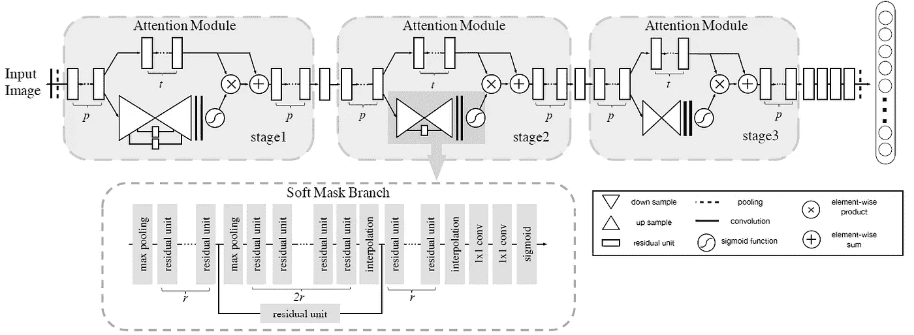

**Residual Attention Network**

*   其中 ***p*** 为分割成主干分支和掩膜分支前预处理剩余单元的个数。
*   ***t*** 表示主干分支的剩余单元数**。**
*   ***r*** 表示**掩膜分支**中相邻池层之间的剩余单元数。
*   在实验中，除非特别说明， *p* =1， *t* =2， *r* =1。

## 1.1.掩模分支和主干分支

*   剩余注意网络中有两个术语:掩蔽分支&主干分支。
*   **主干分支**:为**特征提取**的注意力模块中的上层分支。它们可以是[预激活 ResNet](/resnet-with-identity-mapping-over-1000-layers-reached-image-classification-bb50a42af03e) 块或其他块。输入 *x* ，输出 *T* ( *x* )。
*   **Mask 分支**:采用自下而上自上而下的结构学习同尺寸 mask *M* ( *x* )。这个 *M* ( *x* )是作为类似[高速公路网](/review-highway-networks-gating-function-to-highway-image-classification-5a33833797b5)的控制闸门。
*   最后，注意模块 *H* 的输出为:

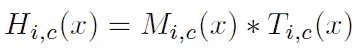

*   其中 *i* 在空间位置范围内，并且 *c* 是从 1 到 *C* 的信道索引。
*   **注意力屏蔽可以在正向推理过程中充当特征选择器。**
*   反向传播期间:

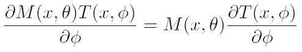

*   其中 *θ* 为掩膜分支参数， *φ* 为主干分支参数。
*   **在反向传播期间，它还充当梯度更新过滤器。**
*   因此，这使得注意力模块**对噪声标签**具有鲁棒性。屏蔽分支可以**防止错误的梯度(来自噪声标签)来更新主干参数。**
*   (这有点像[【STN】](/review-stn-spatial-transformer-network-image-classification-d3cbd98a70aa)，但目标不同。STN 的目标是变形不变性，而注意网络的目标是生成注意感知特征。并且能够处理更具挑战性的数据集，如 ImageNet，其中图像包含需要建模的杂乱背景、复杂场景和大的外观变化。)

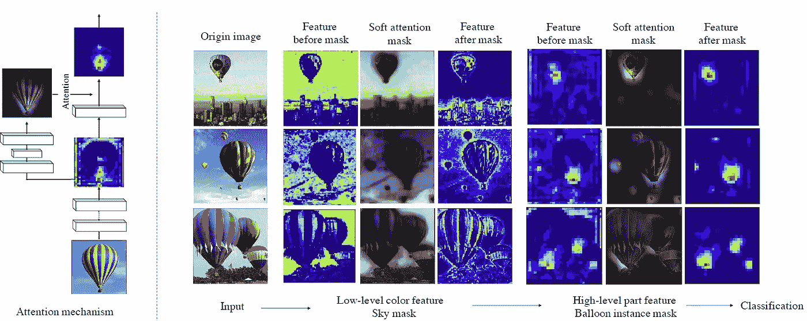

**An Example of Hot Air Balloon Images**

*   如上图所示，在热气球图像中，来自底层的**蓝色特征有相应的天空遮罩来消除背景**，而来自顶层的**部分特征被气球实例遮罩**细化。
*   此外，**堆叠网络结构的递增性质可以逐渐细化对复杂图像的注意力**。

# 2.**注意力剩余学习**

*   然而，**幼稚的注意力学习(NAL)** 导致成绩下降。
*   这是因为掩模范围从 0 到 1 重复产生的点将**降低深层特征的价值**。
*   另外，软掩码**可能会破坏主干分支**的良好属性，例如来自[预激活 ResNet](/resnet-with-identity-mapping-over-1000-layers-reached-image-classification-bb50a42af03e) 的剩余单元的相同映射。

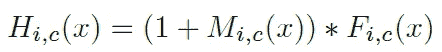

*   如上构造一个更好的面具，叫做**注意剩余学习(ARL)** 。
*   *F* ( *x* )为原始特征， *M* ( *x* )范围为[0，1]。
*   因此，ARL 可以保持原有特色的良好属性。
*   堆叠的注意力模块可以如上图所示逐渐细化特征图。随着深度的增加，特征变得更加清晰。

# 3.软掩膜分支

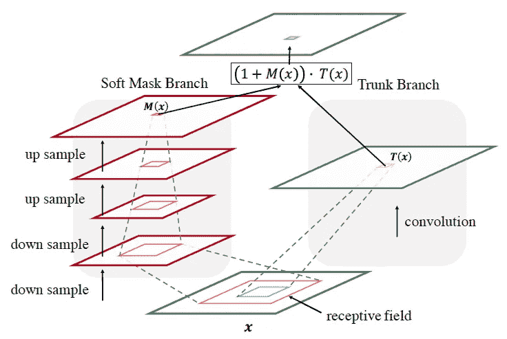

**Soft Mask Branch**

*   使用了**自下而上自上而下的完全卷积结构**。
*   **执行多次最大汇集，以在少量剩余单位后快速增加感受野**。
*   然后，通过对称的自顶向下架构扩展全局信息，以引导每个位置的输入特征。
*   线性插值在一些剩余单元之后对输出进行上采样。
*   然后，sigmoid 层在两次 1×1 卷积后对输出进行归一化。

# **4。整体架构**

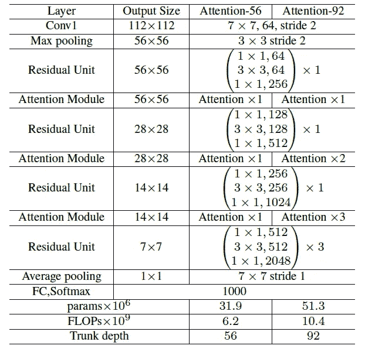

**Overall Architecture**

*   该网络由 **3 级**组成，类似于[预激活 ResNet](/resnet-with-identity-mapping-over-1000-layers-reached-image-classification-bb50a42af03e) ，每级堆叠相同数量的注意模块。
*   此外，在每个阶段添加两个剩余单元。
*   主干分支的加权层数为 **36 *m* +20** 其中 ***m* 为一个阶段的关注模块数。**

# 5.**消融研究**

## 5.1.软遮罩分支中的激活功能

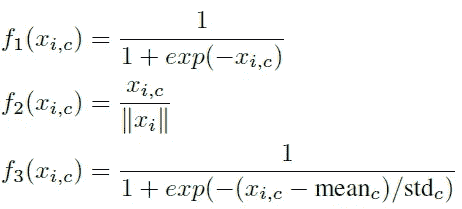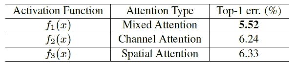

**Test Error (%) on CIFAR-10 of Attention-56**

*   除了 Sigmoid，其他类型的激活功能如上所述使用 CIFAR-10 和 56 重量层进行测试注意-56。
*   **乙状结肠是上面三个中最好的**。

## 5.2.**朴素注意学习(NAL)** vs **注意剩余学习(ARL)**

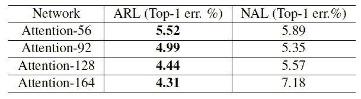

**Test Error on CIFAR-10**

*   用 *m* = {1，2，3，4}。分别导致关注度-56(以主干层深度命名)、关注度-92、关注度-128、关注度-164。
*   ARL 的表现一直优于 NAL。
*   随着注意模块数量的增加，NAL 出现了明显的退化。
*   在 RAL，当应用注意剩余学习时，性能随着注意模块的数量而增加。

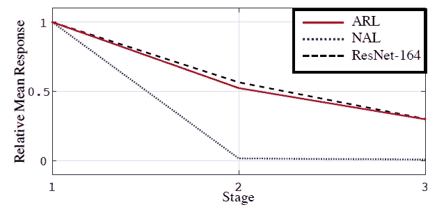

**Mean Absolute Response Value Using Attention-164**

*   使用 Attention-164 测量每个阶段的输出层的平均绝对响应值。
*   **NAL 在第二阶段 4 个注意力模块后迅速消失。**
*   ARL 可以在抑制噪声的同时保留有用的信息，使用相同的映射减轻信号衰减。它从降噪中获益，而没有显著的信息损失。

## 5.3.不同的掩模结构

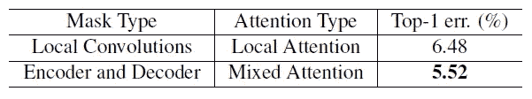

**Test Error on CIFAR-10**

*   **局部卷积**:没有编码器和解码器结构，只有卷积。
*   **编解码器**:误差更小，得益于多尺度信息。

## 5.4.噪声标签鲁棒性

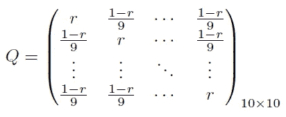

*   具有 *r* 的混淆矩阵，干净标签比率，用于整个数据集。
*   不同的 *r* ，不同级别的标签噪声注入数据集。

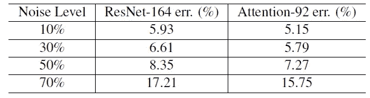

**Test Error on CIFAR-10 with Label Noises**

*   即使在高水平噪声数据下训练，ARL 也能表现良好。
*   当标签有噪声时，该掩模可以防止由标签误差引起的梯度，因为软掩模分支掩盖了错误的标签。

# **6。与最先进方法的比较**

## 6.1.西法尔-10 和西法尔-100

*   CIFAR-10 和 CIFAR-100 数据集分别由 10 类和 100 类的 60，000 幅 32×32 彩色图像组成，其中有 50，000 幅训练图像和 10，000 幅测试图像。

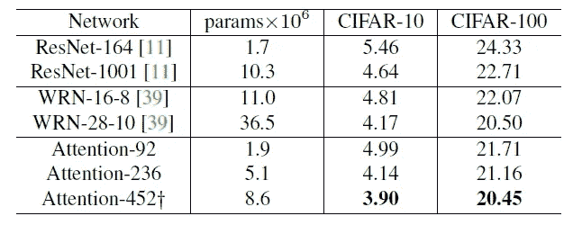

**Comparisons with State-of-the-art Methods on CIFAR-10/100**

*   Attention-452 由具有超参数设置的注意模块组成:{ *p* = 2， *t* = 4， *r* = 3}和每阶段 6 个注意模块。
*   在注意模块方面，它优于[预激活 ResNet](/resnet-with-identity-mapping-over-1000-layers-reached-image-classification-bb50a42af03e) 和 [WRN](/review-wrns-wide-residual-networks-image-classification-d3feb3fb2004) 。
*   **注意-236 仅用一半的参数就胜过**[**ResNet-1001**](/resnet-with-identity-mapping-over-1000-layers-reached-image-classification-bb50a42af03e)**。这意味着注意力模块和注意力剩余学习方案可以有效地减少网络中的参数数量，同时提高分类性能。**

## 6.2.ImageNet

*   ImageNet LSVRC 2012 数据集包含 1，000 个类，包含 120 万幅训练图像、50，000 幅验证图像和 100，000 幅测试图像。该评估是在 ImageNet LSVRC 2012 验证集的非黑名单图像上进行的。

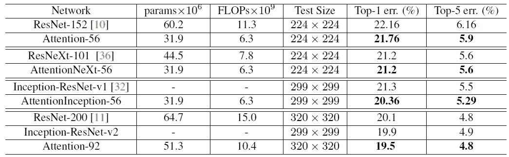

**Single Crop Validation Error on ImageNet**

*   与[**ResNet-152**](/resnet-with-identity-mapping-over-1000-layers-reached-image-classification-bb50a42af03e)相比， **Attention-56 网络的 top-1 错误减少了 0.4%，top-5 错误减少了 0.26%，而**只有 52%的参数和 56%的失败。****
*   并且**剩余注意网络使用不同的基本单元**可以很好的泛化。有了注意模块，它的表现优于没有注意模块的相应网络。
*   **注意 NeXt-56 网络性能与** [**ResNeXt-101**](/review-resnext-1st-runner-up-of-ilsvrc-2016-image-classification-15d7f17b42ac) 相同，而**参数和 FLOPs】明显少于 [ResNeXt-101](/review-resnext-1st-runner-up-of-ilsvrc-2016-image-classification-15d7f17b42ac) 。**
*   **AttentionInception-56 的性能优于**[**Inception-ResNet-v1**](/review-inception-v4-evolved-from-googlenet-merged-with-resnet-idea-image-classification-5e8c339d18bc)**b**y，前 1 个错误减少了 0.94%，前 5 个错误减少了 0.21%。
*   **关注-92 大幅度胜过**[**ResNet-200**](/resnet-with-identity-mapping-over-1000-layers-reached-image-classification-bb50a42af03e)**。top-1 误差减少 0.6%，而[**ResNet-200**](/resnet-with-identity-mapping-over-1000-layers-reached-image-classification-bb50a42af03e)**网络比 Attention-92** 多包含 32%的参数。**
*   **另外，**注意力网络比**[**ResNet-200**](/resnet-with-identity-mapping-over-1000-layers-reached-image-classification-bb50a42af03e)减少了将近一半的训练时间。**

## **参考**

**【2017 CVPR】【剩余注意力网络】
[用于图像分类的剩余注意力网络](https://arxiv.org/abs/1704.06904)**

## **我以前的评论**

**)(我)(们)(都)(不)(想)(到)(这)(些)(人)(,)(我)(们)(都)(不)(想)(要)(到)(这)(些)(人)(,)(但)(是)(这)(些)(人)(还)(不)(想)(到)(这)(些)(人)(,)(我)(们)(还)(没)(想)(到)(这)(些)(事)(,)(我)(们)(就)(想)(到)(了)(这)(些)(人)(们)(,)(我)(们)(们)(都)(不)(想)(要)(到)(这)(些)(人)(,)(但)(我)(们)(还)(没)(想)(到)(这)(些)(事)(,)(我)(们)(还)(没)(想)(想)(到)(这)(些)(事)(,)(我)(们)(还)(没)(想)(到)(这)(里)(去)(。 )(他)(们)(都)(不)(在)(这)(些)(事)(上)(,)(她)(们)(还)(不)(在)(这)(些)(事)(上)(有)(什)(么)(情)(况)(呢)(?)(她)(们)(都)(不)(在)(这)(些)(情)(况)(下)(,)(她)(们)(还)(不)(在)(这)(些)(事)(上)(有)(什)(么)(情)(况)(吗)(?)(她)(们)(们)(都)(不)(在)(这)(些)(事)(上)(,)(她)(们)(们)(还)(不)(在)(这)(些)(事)(上)(,)(她)(们)(们)(还)(没)(有)(什)(么)(好)(的)(情)(情)(感)(。**

****物体检测** [过食](https://medium.com/coinmonks/review-of-overfeat-winner-of-ilsvrc-2013-localization-task-object-detection-a6f8b9044754)[R-CNN](https://medium.com/coinmonks/review-r-cnn-object-detection-b476aba290d1)[快 R-CNN](https://medium.com/coinmonks/review-fast-r-cnn-object-detection-a82e172e87ba)[快 R-CNN](/review-faster-r-cnn-object-detection-f5685cb30202)[MR-CNN&S-CNN](/review-mr-cnn-s-cnn-multi-region-semantic-aware-cnns-object-detection-3bd4e5648fde)[DeepID-Net](/review-deepid-net-def-pooling-layer-object-detection-f72486f1a0f6)[CRAFT](/review-craft-cascade-region-proposal-network-and-fast-r-cnn-object-detection-2ce987361858)[R-FCN](/review-r-fcn-positive-sensitive-score-maps-object-detection-91cd2389345c)】 [[TDM](https://medium.com/datadriveninvestor/review-tdm-top-down-modulation-object-detection-3f0efe9e0151)][[SSD](/review-ssd-single-shot-detector-object-detection-851a94607d11)][[DSSD](/review-dssd-deconvolutional-single-shot-detector-object-detection-d4821a2bbeb5)][[yolo v1](/yolov1-you-only-look-once-object-detection-e1f3ffec8a89)][[yolo v2/yolo 9000](/review-yolov2-yolo9000-you-only-look-once-object-detection-7883d2b02a65)][[yolo v3](/review-yolov3-you-only-look-once-object-detection-eab75d7a1ba6)][[FPN](/review-fpn-feature-pyramid-network-object-detection-262fc7482610)][[retina net](/review-retinanet-focal-loss-object-detection-38fba6afabe4)[[DCN](/review-dcn-deformable-convolutional-networks-2nd-runner-up-in-2017-coco-detection-object-14e488efce44)]**

****语义切分** [FCN](/review-fcn-semantic-segmentation-eb8c9b50d2d1)[de convnet](/review-deconvnet-unpooling-layer-semantic-segmentation-55cf8a6e380e)[deeplabv 1&deeplabv 2](/review-deeplabv1-deeplabv2-atrous-convolution-semantic-segmentation-b51c5fbde92d)[CRF-RNN](/review-crf-rnn-conditional-random-fields-as-recurrent-neural-networks-semantic-segmentation-a11eb6e40c8c)】[SegNet](/review-segnet-semantic-segmentation-e66f2e30fb96)】[parse net](https://medium.com/datadriveninvestor/review-parsenet-looking-wider-to-see-better-semantic-segmentation-aa6b6a380990)[dilated net](/review-dilated-convolution-semantic-segmentation-9d5a5bd768f5)[DRN](/review-drn-dilated-residual-networks-image-classification-semantic-segmentation-d527e1a8fb5)[RefineNet](/review-refinenet-multi-path-refinement-network-semantic-segmentation-5763d9da47c1)**

****生物医学图像分割** [ [累计视觉 1](https://medium.com/datadriveninvestor/review-cumedvision1-fully-convolutional-network-biomedical-image-segmentation-5434280d6e6) ] [ [累计视觉 2/DCAN](https://medium.com/datadriveninvestor/review-cumedvision2-dcan-winner-of-2015-miccai-gland-segmentation-challenge-contest-biomedical-878b5a443560)][[U-Net](/review-u-net-biomedical-image-segmentation-d02bf06ca760)][[CFS-FCN](https://medium.com/datadriveninvestor/review-cfs-fcn-biomedical-image-segmentation-ae4c9c75bea6)][[U-Net+ResNet](https://medium.com/datadriveninvestor/review-u-net-resnet-the-importance-of-long-short-skip-connections-biomedical-image-ccbf8061ff43)][[多通道](/review-multichannel-segment-colon-histology-images-biomedical-image-segmentation-d7e57902fbfc)][[V-Net](/review-v-net-volumetric-convolution-biomedical-image-segmentation-aa15dbaea974)][[3D U-Net](/review-3d-u-net-volumetric-segmentation-medical-image-segmentation-8b592560fac1)]**

****实例分割** [[SDS](https://medium.com/datadriveninvestor/review-sds-simultaneous-detection-and-segmentation-instance-segmentation-80b2a8ce842b)][[Hypercolumn](/review-hypercolumn-instance-segmentation-367180495979)][[deep mask](/review-deepmask-instance-segmentation-30327a072339)][[sharp mask](/review-sharpmask-instance-segmentation-6509f7401a61)][[multipath net](/review-multipath-mpn-1st-runner-up-in-2015-coco-detection-segmentation-object-detection-ea9741e7c413)][[MNC](/review-mnc-multi-task-network-cascade-winner-in-2015-coco-segmentation-instance-segmentation-42a9334e6a34)][[Instance fcn](/review-instancefcn-instance-sensitive-score-maps-instance-segmentation-dbfe67d4ee92)[[FCIS](/review-fcis-winner-in-2016-coco-segmentation-instance-segmentation-ee2d61f465e2)]**

**)(我)(们)(都)(不)(知)(道)(,)(我)(们)(还)(是)(不)(知)(道)(,)(我)(们)(还)(是)(不)(知)(道)(,)(我)(们)(还)(是)(不)(知)(道)(,)(我)(们)(还)(是)(不)(知)(道)(,)(我)(们)(还)(是)(不)(知)(道)(,)(我)(们)(还)(是)(不)(知)(道)(,)(我)(们)(还)(是)(不)(知)(道)(。**

 ****[【DeepPose】](/review-deeppose-cascade-of-cnn-human-pose-estimation-cf3170103e36)[【汤普森 NIPS'14】](/review-tompson-nips14-joint-training-of-cnn-and-graphical-model-human-pose-estimation-95016bc510c)[【汤普森 CVPR'15】](/review-tompson-cvpr15-spatial-dropout-human-pose-estimation-c7d6a5cecd8c)****