# 回顾:RetinaNet —焦点丢失(物体检测)

> 原文：<https://towardsdatascience.com/review-retinanet-focal-loss-object-detection-38fba6afabe4?source=collection_archive---------0----------------------->

## 使用 ResNet+FPN 的具有焦点损失和视网膜网络的一级检测器，超越了两级检测器的准确性，更快的 R-CNN

在这个故事里， **RetinaNet** ，由**脸书艾研究(FAIR)** 进行点评。发现**在一级检测器**中存在极端的前景-背景类别不平衡问题。并且据信这是使一级检测器**的性能不如两级检测器**的主要原因。

在 RetinaNet(一级检测器)中，**通过使用焦点损失，较低的损失是由“容易”的负样本造成的，因此损失集中在“硬”样本上**，这提高了预测精度。以[**【ResNet】**](/review-resnet-winner-of-ilsvrc-2015-image-classification-localization-detection-e39402bfa5d8)**+**[**【FPN】**](/review-fpn-feature-pyramid-network-object-detection-262fc7482610)**为骨干**进行特征提取，**加上两个特定任务的子网络进行分类和包围盒回归**，形成了 **RetinaNet** ，达到了最先进的性能，**优于** [**更快的 R-CNN**](/review-faster-r-cnn-object-detection-f5685cb30202) 是一篇 **2017 ICCV** **最佳学生论文奖**论文，引用量超过 **500 篇**。(第一作者宗林逸在 2017 年 ICCV 展示 RetinaNet 时，已经成为谷歌大脑的研究科学家。)( [Sik-Ho Tsang](https://medium.com/u/aff72a0c1243?source=post_page-----38fba6afabe4--------------------------------) @中型)

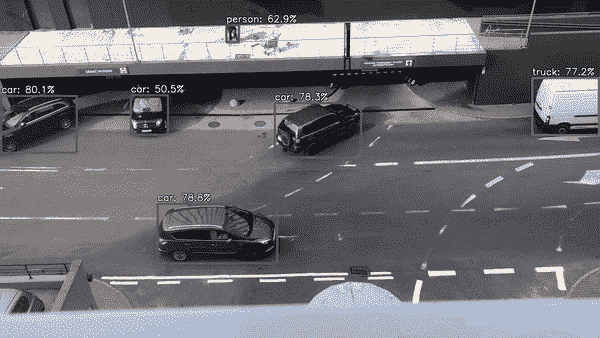

**A Demo of RetinaNet on Parking Lot Entrance Video (**[**https://www.youtube.com/watch?v=51ujDJ-01oc**](https://www.youtube.com/watch?v=51ujDJ-01oc)**)**

**Another Demo of RetinaNet on Car Camera Video**

# 概述

1.  **一级检测器的类不平衡问题**
2.  **焦损失**
3.  **视网膜检测器**
4.  **消融研究**
5.  **与最先进方法的比较**

# **1。一级检测器的类别不平衡问题**

## 1.1.两级检测器

*   在两级检测器中，例如[更快的 R-CNN](/review-faster-r-cnn-object-detection-f5685cb30202) 、**第一级，区域建议网络(RPN)** 将候选物体位置的**数量缩小到一个小的数量(例如 1–2k)**，过滤掉大部分背景样本。
*   在**第二阶段**，对每个候选对象位置执行**分类**。**采样试探法**使用固定的前景与背景比率(1:3)**或在线硬示例挖掘(OHEM)** 为每个迷你批次选择一小组锚点(例如，256)。
*   因此，在前景和背景之间有一个可管理的类平衡。

## 1.2.一级检测器

**Many negative background examples, Few positive foreground examples**

*   一个更大的候选物体位置集合在一幅图像上被有规律地采样(大约 100k 个位置)，这些位置密集地覆盖了空间位置、比例和纵横比。
*   训练过程仍然由容易分类的背景例子主导。它通常通过引导或硬示例挖掘来解决。但是它们的效率不够高。

## 1.3.箱子数量比较

*   [YOLOv1](/yolov1-you-only-look-once-object-detection-e1f3ffec8a89) : 98 盒
*   约洛夫 2 : ~1k
*   [过吃](https://medium.com/coinmonks/review-of-overfeat-winner-of-ilsvrc-2013-localization-task-object-detection-a6f8b9044754):~ 1–2k
*   [固态硬盘](/review-ssd-single-shot-detector-object-detection-851a94607d11):~ 8–26k
*   **RetinaNet: ~100k** 。RetinaNet 可以有大约 100k 个盒子，使用焦点损失解决等级不平衡问题。

# 2.焦点损失

## 2.1.交叉熵损失

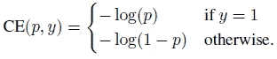

*   上面的等式是二元分类的 CE 损失。 *y* ∈{ 1}是地面实况类，而 *p* ∈[0，1]是模型的估计概率。很容易将其扩展到多类情况。为了便于标注，定义了 *pt* ，ce 改写如下:

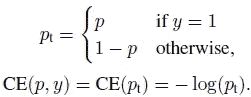

*   **当对大量简单的例子求和时，这些小的损失值可以压倒罕见的类。**下面是例子:

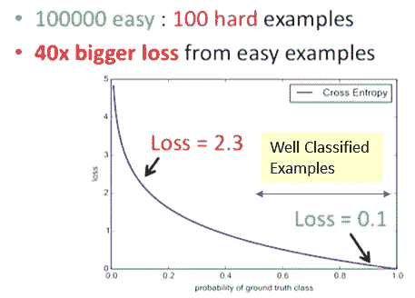

**Example**

*   让我们以上图为例。如果我们有 100000 个简单的例子(每个 0.1)和 100 个困难的例子(每个 2.3)。当我们需要求和来估算 CE 损失时。
*   简单例子的损失= 100000×0.1 = 10000
*   硬例损失= 100×2.3 = 230
*   10000 / 230 = 43.从简单的例子来看，损失大约大 40 倍。
*   因此，当存在极端的阶级不平衡时，CE 损失不是一个好的选择。

## **2.2。** α- **平衡 CE 损失**

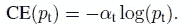

*   为了解决类别不平衡，一种方法是为类别 1 添加加权因子 *α* ，为类别 1 添加 1 - *α* 。
*   *α* 可以通过逆类频率设置，也可以作为超参数交叉验证设置。
*   如在两级检测器处看到的，通过选择 1∶3 的前景与背景比率来隐含地实现 *α* 。

## 2.3.焦点损失

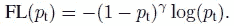

*   损失函数被重塑为降低简单例子的权重，从而将训练集中在硬负面上。一个调制因子(1- *pt* )^ *γ* 被添加到交叉熵损失中，其中 *γ* 在实验中从[0，5]开始被测试。
*   FL 有两个属性:

1.  当一个例子被错误分类并且 pt 很小时，调制因子接近 1，并且损失不受影响。当 *pt* →1 时，该因子变为 0，并且良好分类示例的损失被向下加权。
2.  聚焦参数 *γ* 平滑地调整简单示例向下加权的速率。当 *γ* = 0 时，FL 相当于 CE。当 *γ* 增加时，调制因子的效果同样增加。( *γ* =2 在实验中效果最好。)

*   例如，在 *γ* = 2 的情况下，与 ce 相比，分类为 *pt* = 0.9 的示例将具有低 100 的损耗，而分类为 *pt* = 0.968 的示例将具有低 1000 的损耗。这反过来增加了纠正错误分类的例子的重要性。
*   当 *pt* ≤ 0.5 且γ = 2 时，损耗最多降低 4 倍。

## 2.4.FL 的α平衡变体

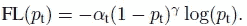

*   上述形式用于实践中的实验，其中将 *α* 添加到方程中，这产生了比没有 *α* 的方程略微提高的精度。并使用 **sigmoid 激活函数计算 *p*** 导致**更大的数值稳定性**。
*   ***γ* :多关注硬例。**
*   ***α* :抵销类实例数的不平衡。**

## 2.5.模型初始化

*   **在训练**开始时，为 *p* 的值设置一个先验π，使得模型对于稀有类的估计 *p* 较低，例如 **0.01** ，以提高严重类不平衡情况下的训练稳定性。
*   发现训练 RetinaNet 使用标准 CE 损耗**而没有使用先验π** 进行初始化，导致**网络在训练**时发散，最终失败。
*   并且结果对π的精确值不敏感。π = 0.01 用于所有实验。

# 3.**视网膜网探测器**

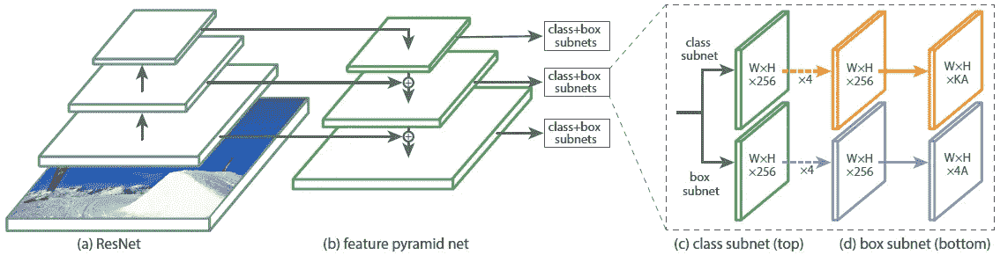

**RetinaNet Detector Architecture**

## 3.1.(a)和(b)主干

*   [**ResNet**](/review-resnet-winner-of-ilsvrc-2015-image-classification-localization-detection-e39402bfa5d8) 用于深度特征提取。
*   [**特征金字塔网络(FPN)**](/review-fpn-feature-pyramid-network-object-detection-262fc7482610) 在 [ResNet](/review-resnet-winner-of-ilsvrc-2015-image-classification-localization-detection-e39402bfa5d8) 之上使用，用于从一个单一分辨率输入图像构建丰富的多尺度特征金字塔。(最初， [FPN](/review-fpn-feature-pyramid-network-object-detection-262fc7482610) 是一个两级探测器，具有最先进的结果。如果有兴趣，请阅读我关于 FPN 的评论。)
*   [FPN](/review-fpn-feature-pyramid-network-object-detection-262fc7482610) 是多尺度的，在所有尺度上语义都很强，并且计算速度很快。
*   这里有一些对 FPN 的适度改变。从 P3 到 P7 生成一个金字塔。一些主要的变化是:由于计算的原因，现在不使用 P2。(ii)通过步长卷积而不是下采样来计算 P6。(iii)额外包括 P7 以提高大物体检测的精度。

## 3.2.锚

*   主播分别在从 P3 到 P7 的金字塔等级上有 32 到 512 的**区域。**
*   **使用三种长宽比{1:2，1:1，2:1}** 。
*   对于更密集的规模覆盖，在每个金字塔等级添加**大小为{2⁰、2^(1/3、**的锚。
*   总共，**每级 9 个锚**。
*   **跨等级，比例覆盖从 32 到 813 像素**。
*   **每个锚**，都有**一个长度 *K* 一个分类目标的热向量** (K:类数)**一个盒回归目标的 4 向量**。
*   **使用 IoU 阈值 0.5** 将锚点分配给地面实况对象框，如果 IoU 在[0，0.4】中，则将其分配给**背景。每个锚点最多被分配一个对象框，并在那个 *K* one-hot vector 中设置相应的类条目为 1，所有其他条目为 0。如果锚**未赋值如果 IoU 在【0.4，0.5】**中并且在训练期间被忽略。**
*   长方体回归计算为锚点和指定对象长方体之间的偏移，如果没有指定，则忽略该值。

## 3.3.(c)分类子网

*   这个分类子网**为每个 *A* 锚和 *K* 物体类别预测在每个空间位置**物体存在的概率。
*   子网是一个 **FCN** ，它应用了四个 3×3 conv 层，每个层都有 *C* 滤波器，每个层后面都有 ReLU 激活，后面是一个 3×3 conv 层，有 *KA* 滤波器。( *K* 类， *A* =9 个锚点， *C* = 256 个过滤器)

## 3.4.(d)箱式回归子网

*   该子网是每个金字塔等级的 **FCN** ,用于回归从每个锚框到附近地面实况对象(如果存在)的偏移。
*   它与分类子网相同，除了它终止于每个空间位置的 **4 *A* 线性输出。**
*   它是一个**类别不可知的包围盒回归器**，使用较少的参数，被发现同样有效。

## 3.5.推理

*   在阈值检测器置信度为 0.05 之后，网络仅解码来自**的每个**[**FPN**](/review-fpn-feature-pyramid-network-object-detection-262fc7482610)**等级的最多 1k 最高得分预测的框预测。**
*   **来自所有级别的顶部预测被合并**并且**阈值为 0.5 的非最大抑制(NMS)被应用**以产生最终检测。

## 3.6.培养

*   因此，在训练期间，图像的**总聚焦损失**被计算为所有 100k 个锚的聚焦损失的总和**，由分配给地面实况框的锚的数量归一化。**
*   使用 ImageNet1K 预训练的 [ResNet-50-FPN](/review-fpn-feature-pyramid-network-object-detection-262fc7482610) 和 [ResNet-101-FPN](/review-fpn-feature-pyramid-network-object-detection-262fc7482610) 。

# 4.消融研究

*   **使用 COCO 数据集**。COCO **trainval35k** 分体用于**训练**。并且 **minival (5k)** split 用于**验证**。

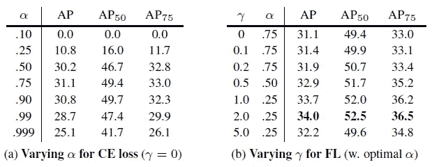

**α for CE loss (Left), γ for FL (Right)**

## 4.1. *α为*α-平衡 CE 损耗

*   使用 ResNet-50 。
*   首先，测试不同α下的α平衡 CE 损耗。
*   α = 0.75 时，增益为 0.9 AP。

## 4.2. *γ* 为 FL

*   γ=0 是α平衡的 CE 损耗。
*   当γ增加时，简单的例子会被贴现到损失中。
*   γ=2，α=0.25，比α平衡 CE 损耗(α=0.75)提高了 2.9 AP。
*   据观察，较低的α选择较高的γ
*   改变的好处要大得多，事实上，最佳α的范围仅为[0.25，0.75]，α∈[:01；:999]已测试。

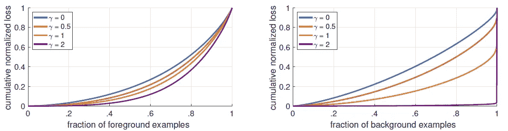

**Cumulative distribution functions of the normalized loss for positive and negative samples**

## 4.3.前景和背景样本分析

## **前景样本**

*   对从最低到最高的损失进行排序，并绘制正负样本和不同γ设置的累积分布函数(CDF)。
*   大约 20%的最难阳性样本占阳性损失的大约一半。
*   随着γ的增加，更多的损失集中在前 20%的例子中，但是影响很小。

## **背景样本**

*   随着γ的增加，更多的重量集中在硬反例上。
*   绝大多数损失来自一小部分样本。
*   FL 可以有效地降低容易否定的影响，将所有注意力集中在难否定的例子上。

## 4.4.锚密度

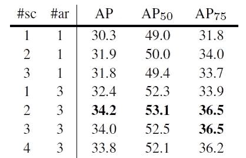

**Different Number of Scales (#sc) and Aspect Ratios (#ar)**

*   使用一个方形锚(#sc=1，#ar=1)实现了 30.3%的 AP，这还不错。
*   使用 3 个尺度和 3 个长宽比，AP 可以提高近 4 个点(34.0)。
*   增加超过 6-9 个锚不会显示进一步的收益。

## 4.5.佛罗里达州对 OHEM(在线硬示例挖掘)

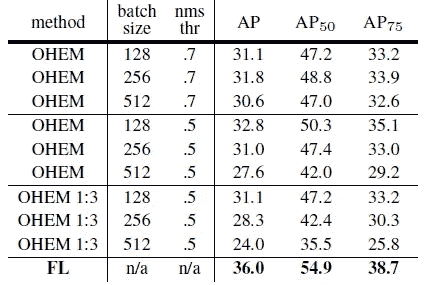

**FL vs OHEM (Online Hard Example Mining)**

*   这里使用 [ResNet-101](/review-resnet-winner-of-ilsvrc-2015-image-classification-localization-detection-e39402bfa5d8) 。
*   在 OHEM，每个示例根据其损失评分，然后应用非最大抑制(NMS ),并使用最高损失示例构建一个小批次。
*   像焦点损失一样，OHEM 更加强调错误分类的例子。
*   但是与 FL 不同，OHEM 完全抛弃了简单的例子。
*   在将 nms 应用于所有示例后，构建迷你批处理以强制正负比例为 1:3。
*   OHEM 的最佳设置(比例不为 1:3，批量为 128，NMS 为 0.5)达到 32.8%的 AP。
*   而 FL 获得 36.0% AP，即差距 3.2 AP，证明了 FL 的有效性。
*   注:作者还测试了铰链损耗，其中损耗在 pt 的某个值以上设置为 0。但是，训练是不稳定的。

# **5。与最先进方法的比较**

## 5.1.速度与精度的权衡

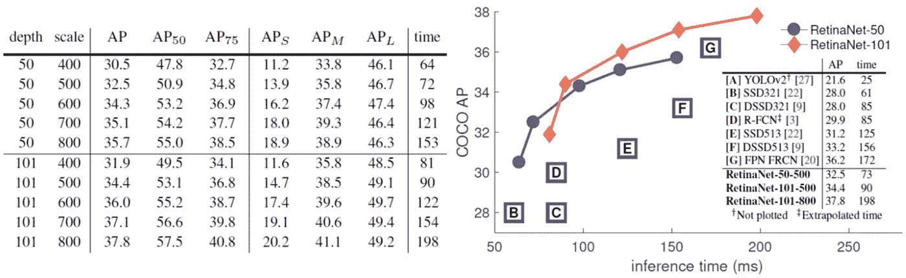

**Speed versus Accuracy**

*   **retina net-101–600**:retina net 配有 [ResNet-101-FPN](/review-fpn-feature-pyramid-network-object-detection-262fc7482610) 和 600 像素的图像比例，与最近发布的 [ResNet-101-FPN 更快的 R-CNN (FPN)](/review-fpn-feature-pyramid-network-object-detection-262fc7482610) 的精确度相当，同时每张图像的运行时间为 122 毫秒，而不是 172 毫秒(均在 Nvidia M40 GPU 上测量)。
*   更大的主干网络产生更高的准确性，但也降低了推理速度。
*   培训时间从 10 小时到 35 小时不等。
*   使用更大的规模允许 RetinaNet 超越所有两阶段方法的准确性，同时仍然更快。
*   除了 [YOLOv2](/review-yolov2-yolo9000-you-only-look-once-object-detection-7883d2b02a65) (目标是极高的帧率)，RetinaNet 的表现优于 [SSD](/review-ssd-single-shot-detector-object-detection-851a94607d11) 、 [DSSD](/review-dssd-deconvolutional-single-shot-detector-object-detection-d4821a2bbeb5) 、 [R-FCN](/review-r-fcn-positive-sensitive-score-maps-object-detection-91cd2389345c) 和 [FPN](/review-fpn-feature-pyramid-network-object-detection-262fc7482610) 。
*   对于更快的运行时间，只有一个工作点(500 像素输入)，在这个点上使用 [ResNet-50-FPN](/review-fpn-feature-pyramid-network-object-detection-262fc7482610) 的 RetinaNet 比使用 [ResNet-101-FPN](/review-fpn-feature-pyramid-network-object-detection-262fc7482610) 的 retina net 有所改进。

## 5.2.最先进的精确度

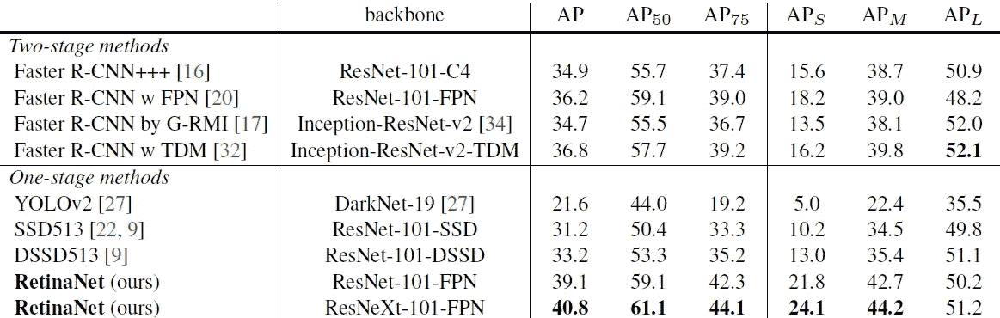

**Object detection single-model results (bounding box AP), vs. state-of-the-art on COCO test-dev**

*   **RetinaNet 使用**[**ResNet-101-FPN**](/review-fpn-feature-pyramid-network-object-detection-262fc7482610)**:retina net-101–800**模型使用**比例抖动**训练，比表(5.1)中的模型长 1.5 倍。
*   与现有的单级检测器相比，它与最接近的竞争对手 [DSSD](/review-dssd-deconvolutional-single-shot-detector-object-detection-d4821a2bbeb5) 的 AP 差距为 5.9 点(39.1 对 33.2)。
*   与最近的两阶段方法相比，RetinaNet 比基于[Inception-ResNet-v2](/review-inception-v4-evolved-from-googlenet-merged-with-resnet-idea-image-classification-5e8c339d18bc)-[TDM](https://medium.com/datadriveninvestor/review-tdm-top-down-modulation-object-detection-3f0efe9e0151)的表现最好的[更快的 R-CNN](/review-faster-r-cnn-object-detection-f5685cb30202) 模型高出 2.3 个点。(如果有兴趣，请阅读我关于 [Inception-ResNet-v2](/review-inception-v4-evolved-from-googlenet-merged-with-resnet-idea-image-classification-5e8c339d18bc) 和 [TDM](https://medium.com/datadriveninvestor/review-tdm-top-down-modulation-object-detection-3f0efe9e0151) 的评测。)
*   RetinaNet 使用[ResNeXt-101](http://ResNeXt)-[FPN](/review-fpn-feature-pyramid-network-object-detection-262fc7482610):插上[ResNeXt-32x8d-101](http://ResNeXt)-[FPN](/review-fpn-feature-pyramid-network-object-detection-262fc7482610)【38】作为 RetinaNet 主干，成绩再提升 1.7 AP，超过 COCO 上的 40 AP。(如果有兴趣，请阅读我关于 [ResNeXt](/review-resnext-1st-runner-up-of-ilsvrc-2016-image-classification-15d7f17b42ac) 的评论。)

通过使用焦点损耗，可以在简单样本和困难样本之间自适应地平衡总损耗。

## 参考

【2017 ICCV】【retina net】
[密集物体探测的焦损失](https://arxiv.org/abs/1708.02002)

## 我的相关评论

)(我)(们)(都)(不)(想)(到)(这)(些)(人)(,)(我)(们)(都)(不)(想)(要)(到)(这)(些)(人)(,)(但)(是)(这)(些)(人)(还)(不)(想)(到)(这)(些)(人)(,)(我)(们)(还)(没)(想)(到)(这)(些)(事)(,)(我)(们)(就)(想)(到)(了)(这)(些)(人)(们)(,)(我)(们)(们)(都)(不)(想)(要)(到)(这)(些)(人)(,)(但)(我)(们)(还)(没)(想)(到)(这)(些)(事)(,)(我)(们)(还)(没)(想)(到)(这)(里)(来)(。 )(我)(们)(都)(不)(知)(道)(,)(我)(们)(还)(是)(不)(知)(道)(,)(我)(们)(还)(是)(不)(知)(道)(,)(我)(们)(还)(是)(不)(知)(道)(,)(我)(们)(还)(是)(不)(知)(道)(,)(我)(们)(还)(是)(不)(知)(道)(,)(我)(们)(还)(是)(不)(知)(道)(,)(我)(们)(还)(是)(不)(知)(道)(。

**物体检测** [过食](https://medium.com/coinmonks/review-of-overfeat-winner-of-ilsvrc-2013-localization-task-object-detection-a6f8b9044754)[R-CNN](https://medium.com/coinmonks/review-r-cnn-object-detection-b476aba290d1)[快 R-CNN](https://medium.com/coinmonks/review-fast-r-cnn-object-detection-a82e172e87ba)[快 R-CNN](/review-faster-r-cnn-object-detection-f5685cb30202)[DeepID-Net](/review-deepid-net-def-pooling-layer-object-detection-f72486f1a0f6)】[R-FCN](/review-r-fcn-positive-sensitive-score-maps-object-detection-91cd2389345c)】[离子](/review-ion-inside-outside-net-2nd-runner-up-in-2015-coco-detection-object-detection-da19993f4766)[多路径网](/review-multipath-mpn-1st-runner-up-in-2015-coco-detection-segmentation-object-detection-ea9741e7c413)[NoC](https://medium.com/datadriveninvestor/review-noc-winner-in-2015-coco-ilsvrc-detection-object-detection-d5cc84e372a)

**语义切分** [FCN](/review-fcn-semantic-segmentation-eb8c9b50d2d1)[de convnet](/review-deconvnet-unpooling-layer-semantic-segmentation-55cf8a6e380e)[deeplab v1&deeplab v2](/review-deeplabv1-deeplabv2-atrous-convolution-semantic-segmentation-b51c5fbde92d)[parse net](https://medium.com/datadriveninvestor/review-parsenet-looking-wider-to-see-better-semantic-segmentation-aa6b6a380990)】[dilated net](/review-dilated-convolution-semantic-segmentation-9d5a5bd768f5)[PSP net](/review-pspnet-winner-in-ilsvrc-2016-semantic-segmentation-scene-parsing-e089e5df177d)[deeplab v3](/review-deeplabv3-atrous-convolution-semantic-segmentation-6d818bfd1d74)

**生物医学图像分割** [[cumed vision 1](https://medium.com/datadriveninvestor/review-cumedvision1-fully-convolutional-network-biomedical-image-segmentation-5434280d6e6)][[cumed vision 2/DCAN](https://medium.com/datadriveninvestor/review-cumedvision2-dcan-winner-of-2015-miccai-gland-segmentation-challenge-contest-biomedical-878b5a443560)][[U-Net](/review-u-net-biomedical-image-segmentation-d02bf06ca760)][[CFS-FCN](https://medium.com/datadriveninvestor/review-cfs-fcn-biomedical-image-segmentation-ae4c9c75bea6)][[U-Net+ResNet](https://medium.com/datadriveninvestor/review-u-net-resnet-the-importance-of-long-short-skip-connections-biomedical-image-ccbf8061ff43)

**实例分割
[[深度掩码](/review-deepmask-instance-segmentation-30327a072339) ] [ [锐度掩码](/review-sharpmask-instance-segmentation-6509f7401a61) ] [ [多路径网络](/review-multipath-mpn-1st-runner-up-in-2015-coco-detection-segmentation-object-detection-ea9741e7c413) ] [ [MNC](/review-mnc-multi-task-network-cascade-winner-in-2015-coco-segmentation-instance-segmentation-42a9334e6a34) ] [ [实例中心](/review-instancefcn-instance-sensitive-score-maps-instance-segmentation-dbfe67d4ee92) ] [ [FCIS](/review-fcis-winner-in-2016-coco-segmentation-instance-segmentation-ee2d61f465e2)**

**超分辨率** [Sr CNN](https://medium.com/coinmonks/review-srcnn-super-resolution-3cb3a4f67a7c)[fsr CNN](/review-fsrcnn-super-resolution-80ca2ee14da4)[VDSR](/review-vdsr-super-resolution-f8050d49362f)[ESPCN](https://medium.com/datadriveninvestor/review-espcn-real-time-sr-super-resolution-8dceca249350)[红网](https://medium.com/datadriveninvestor/review-red-net-residual-encoder-decoder-network-denoising-super-resolution-cb6364ae161e)】