# 复习:SegNet(语义分割)

> 原文：<https://towardsdatascience.com/review-segnet-semantic-segmentation-e66f2e30fb96?source=collection_archive---------4----------------------->

## 编码器解码器架构使用最大池索引进行上采样，性能优于 FCN、DeepLabv1 和 DeconvNet

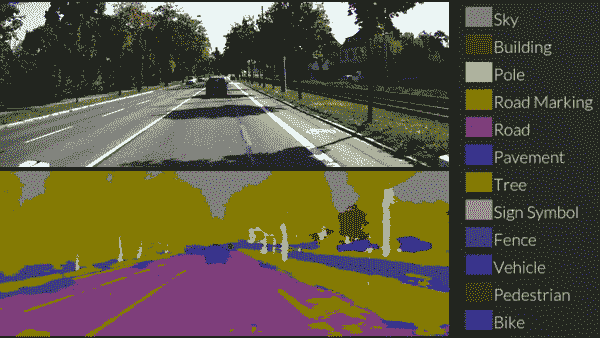

**SegNet by Authors (**[https://www.youtube.com/watch?v=CxanE_W46ts](https://www.youtube.com/watch?v=CxanE_W46ts))

在这个故事中，**剑桥大学**的 **SegNet** 做了简要回顾。最初，它被提交到 2015 年 CVPR，但最终它没有在 CVPR 出版(但它是 **2015 arXiv** tech report 版本，仍然获得了 **100 多次引用**)。而是发表在 **2017 TPAMI** 超过 **1800 次引用**。而现在第一作者已经成为 Magic Leap Inc .([Sik-Ho Tsang](https://medium.com/u/aff72a0c1243?source=post_page-----e66f2e30fb96--------------------------------)@ Medium)深度学习和 AI 的总监

以下是作者的演示:

**SegNet by Authors (**[https://www.youtube.com/watch?v=CxanE_W46ts](https://www.youtube.com/watch?v=CxanE_W46ts))

还有一个有趣的演示，我们可以选择一个随机的图像，甚至上传我们自己的图像来尝试 SegNet。我做了如下尝试:

*   [http://mi.eng.cam.ac.uk/projects/segnet/demo.php](http://mi.eng.cam.ac.uk/projects/segnet/demo.php)

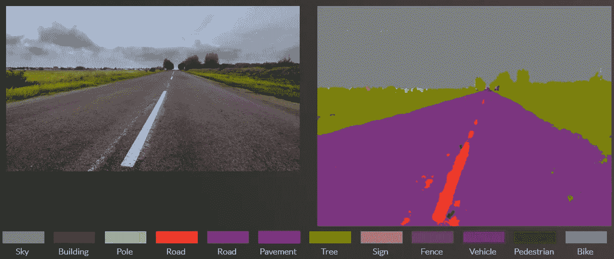

**The segmentation result for a road scene image that I found from internet**

# 概述

1.  **编码器解码器架构**
2.  **与 DeconvNet 和 U-Net 的区别**
3.  **结果**

# **1。编码器解码器架构**

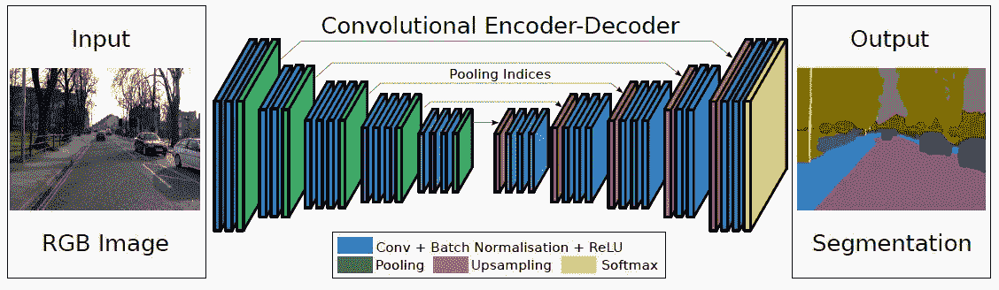

**SegNet: Encoder Decoder Architecture**

*   SegNet 有一个**编码器**网络和一个相应的**解码器**网络，后面是最终的逐像素分类层。

## 1.1.编码器

*   在编码器处，执行卷积和最大池。
*   VGG-16 有 13 个卷积层。(原始的完全连接的层被丢弃。)
*   进行 2×2 最大汇集时，会存储相应的最大汇集索引(位置)。

## 1.2.解码器

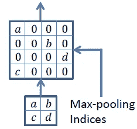

**Upsampling Using Max-Pooling Indices**

*   在解码器处，执行上采样和卷积。最后，每个像素都有一个 softmax 分类器。
*   在上采样期间，如上所示，调用相应编码器层的最大池索引来进行上采样。
*   最后，使用 K 类 softmax 分类器来预测每个像素的类别。

# **2。与 DeconvNet 和 U-Net 的区别**

[DeconvNet](/review-deconvnet-unpooling-layer-semantic-segmentation-55cf8a6e380e) 和 [U-Net](http://U-Net) 的结构与 SegNet 类似。

## 2.1.与[解除配置](/review-deconvnet-unpooling-layer-semantic-segmentation-55cf8a6e380e)的区别

*   使用类似的被称为解组的上采样方法。
*   然而，存在使模型更大的完全连接的层。

## 2.2.与 [U-Net](http://U-Net) 的差异

*   它用于生物医学图像分割。
*   代替使用汇集索引，整个特征映射从编码器传输到解码器，然后连接以执行卷积。
*   这使得模型更大，需要更多的内存。

# 3.结果

*   尝试了两个数据集。一个是用于道路场景分割的 CamVid 数据集。一个是用于室内场景分割的 SUN RGB-D 数据集。

## 3.1.用于道路场景分割的 CamVid 数据集

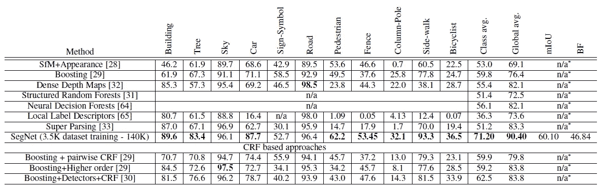

**Compared With Conventional Approaches on CamVid dataset for Road Scene Segmentation**

*   如上所示，SegNet 在许多类上都取得了非常好的结果。它还获得了最高的班级平均水平和全球平均水平。

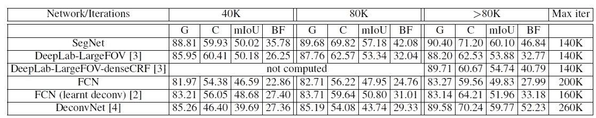

**Compared With Deep Learning Approaches on CamVid dataset for Road Scene Segmentation**

*   SegNet 获得最高的全局平均精度(G)、类平均精度(C)、mIOU 和边界 F1-measure (BF)。它胜过 [FCN](/review-fcn-semantic-segmentation-eb8c9b50d2d1) 、 [DeepLabv1](/review-deeplabv1-deeplabv2-atrous-convolution-semantic-segmentation-b51c5fbde92d) 和 [DeconvNet](/review-deconvnet-unpooling-layer-semantic-segmentation-55cf8a6e380e) 。

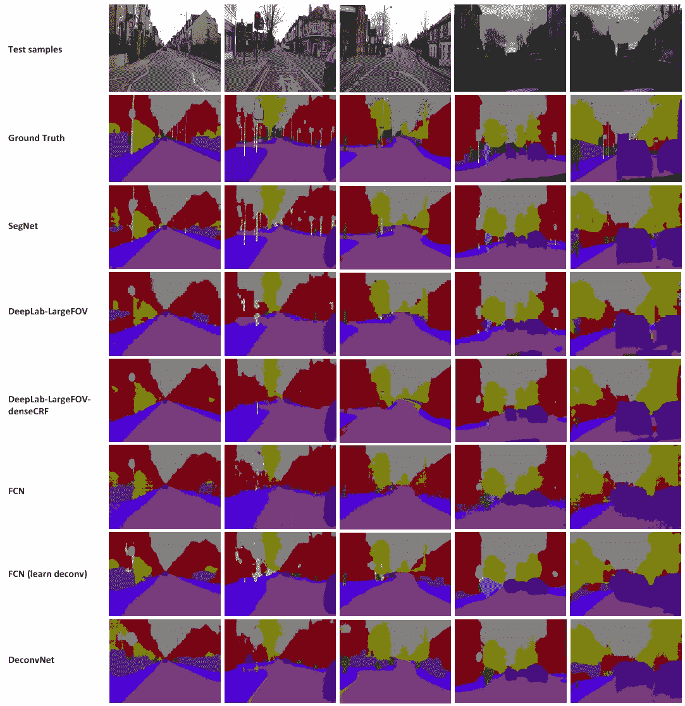

**Qualitative Results**

## 3.2.用于室内场景分割的太阳 RGB-D 数据集

*   仅使用 RGB，不使用深度(D)信息。

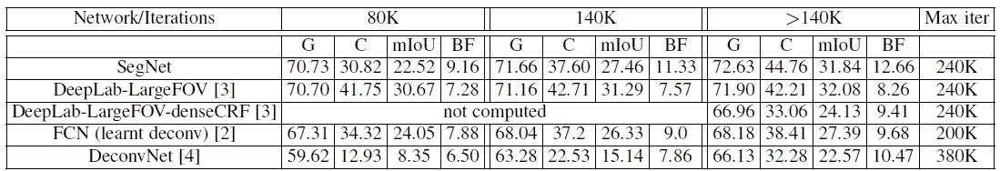

**Compared With Deep Learning Approaches on SUN RGB-D Dataset for Indoor Scene Segmentation**

*   同样，SegNet 的表现优于 [FCN](/review-fcn-semantic-segmentation-eb8c9b50d2d1) 、 [DeconvNet](/review-deconvnet-unpooling-layer-semantic-segmentation-55cf8a6e380e) 和 [DeepLabv1](/review-deeplabv1-deeplabv2-atrous-convolution-semantic-segmentation-b51c5fbde92d) 。
*   SegNet 对于 mIOU 来说只比 [DeepLabv1](/review-deeplabv1-deeplabv2-atrous-convolution-semantic-segmentation-b51c5fbde92d) 差了一点点。

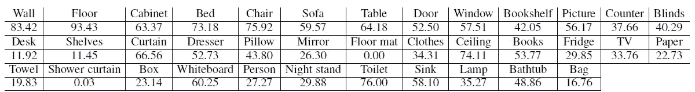

**Class Average Accuracy for Different Classes**

*   大规模班级的精确度更高。
*   小规模班级的精确度较低。

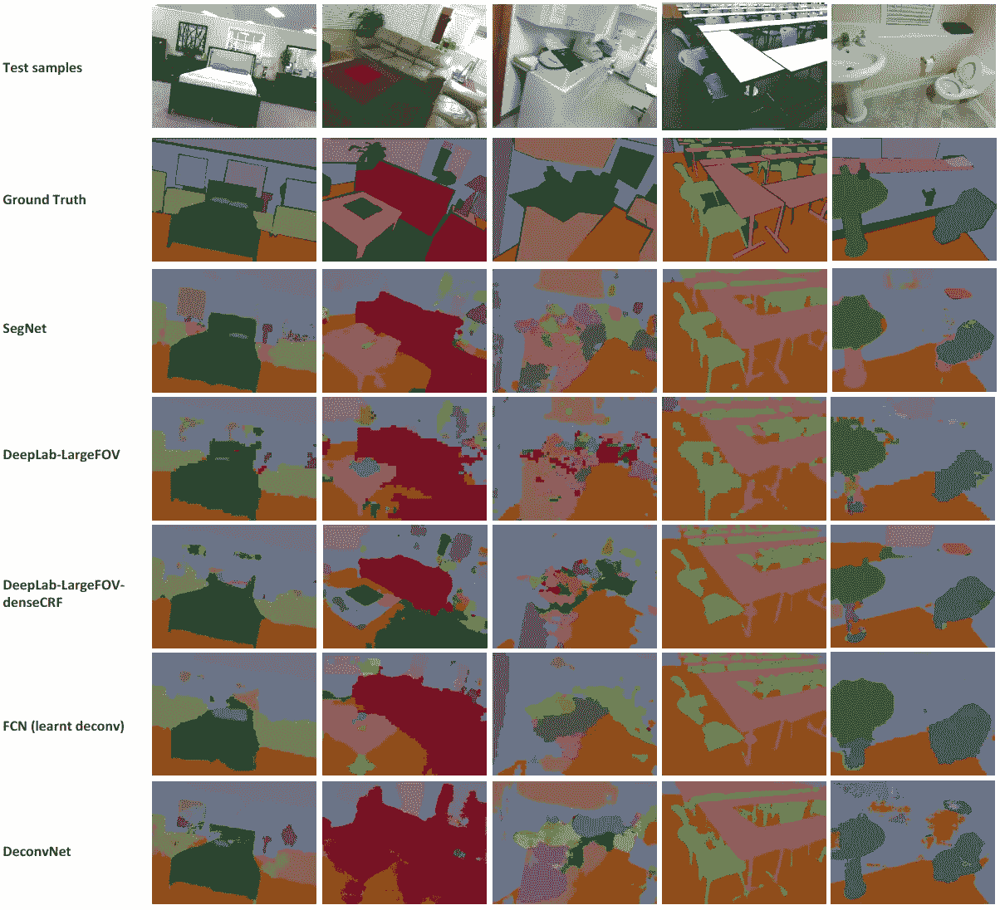

**Qualitative Results**

## 3.3.记忆和推理时间

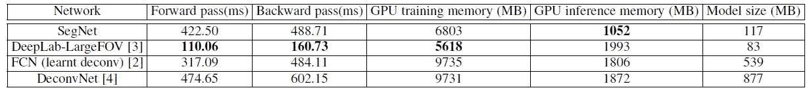

**Memory and Inference Time**

*   SegNet 比 [FCN](/review-fcn-semantic-segmentation-eb8c9b50d2d1) 和 [DeepLabv1](/review-deeplabv1-deeplabv2-atrous-convolution-semantic-segmentation-b51c5fbde92d) 要慢，因为 SegNet 包含解码器架构。而且它比 [DeconvNet](/review-deconvnet-unpooling-layer-semantic-segmentation-55cf8a6e380e) 更快，因为它没有完全连接的层。
*   并且 SegNet 在训练和测试期间都具有低的内存需求。而且型号尺寸远小于 [FCN](/review-fcn-semantic-segmentation-eb8c9b50d2d1) 和[de convent](/review-deconvnet-unpooling-layer-semantic-segmentation-55cf8a6e380e)。

## 参考

【2015 arXiv】【seg net】
[seg net:一种深度卷积编码器-解码器架构，用于鲁棒的语义像素式标记](https://arxiv.org/abs/1505.07293)

【2017 TPAMI】【SegNet】
[SegNet:一种用于图像分割的深度卷积编解码架构](https://arxiv.org/abs/1511.00561)

## 我以前的评论

)(我)(们)(都)(不)(想)(到)(这)(些)(人)(,)(我)(们)(都)(不)(想)(要)(到)(这)(些)(人)(,)(但)(是)(这)(些)(人)(还)(不)(想)(到)(这)(些)(人)(,)(我)(们)(还)(不)(想)(到)(这)(些)(人)(,)(我)(们)(们)(还)(不)(想)(到)(这)(些)(人)(们)(,)(我)(们)(们)(还)(不)(想)(到)(这)(些)(人)(,)(我)(们)(们)(还)(没)(想)(到)(这)(些)(人)(,)(我)(们)(还)(没)(想)(到)(这)(里)(来)(。 )(我)(们)(都)(不)(想)(到)(这)(些)(人)(,)(我)(们)(都)(不)(想)(要)(到)(这)(里)(去)(,)(我)(们)(还)(不)(想)(到)(这)(些)(人)(,)(我)(们)(都)(不)(想)(要)(到)(这)(里)(去)(了)(,)(我)(们)(还)(不)(想)(到)(这)(些)(人)(,)(我)(们)(都)(不)(想)(到)(这)(里)(来)(。

**物体检测** [过食](https://medium.com/coinmonks/review-of-overfeat-winner-of-ilsvrc-2013-localization-task-object-detection-a6f8b9044754)[R-CNN](https://medium.com/coinmonks/review-r-cnn-object-detection-b476aba290d1)[快 R-CNN](https://medium.com/coinmonks/review-fast-r-cnn-object-detection-a82e172e87ba)[快 R-CNN](/review-faster-r-cnn-object-detection-f5685cb30202)[DeepID-Net](/review-deepid-net-def-pooling-layer-object-detection-f72486f1a0f6)】[R-FCN](/review-r-fcn-positive-sensitive-score-maps-object-detection-91cd2389345c)】[离子](/review-ion-inside-outside-net-2nd-runner-up-in-2015-coco-detection-object-detection-da19993f4766)[多路径网](/review-multipath-mpn-1st-runner-up-in-2015-coco-detection-segmentation-object-detection-ea9741e7c413)[NoC](https://medium.com/datadriveninvestor/review-noc-winner-in-2015-coco-ilsvrc-detection-object-detection-d5cc84e372a) yolo 9000[[yolov 3](/review-yolov3-you-only-look-once-object-detection-eab75d7a1ba6)][[FPN](/review-fpn-feature-pyramid-network-object-detection-262fc7482610)][[retina net](/review-retinanet-focal-loss-object-detection-38fba6afabe4)][[DCN](/review-dcn-deformable-convolutional-networks-2nd-runner-up-in-2017-coco-detection-object-14e488efce44)]

**语义切分** [FCN](/review-fcn-semantic-segmentation-eb8c9b50d2d1)[de convnet](/review-deconvnet-unpooling-layer-semantic-segmentation-55cf8a6e380e)[deeplab v1&deeplab v2](/review-deeplabv1-deeplabv2-atrous-convolution-semantic-segmentation-b51c5fbde92d)[parse net](https://medium.com/datadriveninvestor/review-parsenet-looking-wider-to-see-better-semantic-segmentation-aa6b6a380990)】[dilated net](/review-dilated-convolution-semantic-segmentation-9d5a5bd768f5)[PSP net](/review-pspnet-winner-in-ilsvrc-2016-semantic-segmentation-scene-parsing-e089e5df177d)[deeplab v3](/review-deeplabv3-atrous-convolution-semantic-segmentation-6d818bfd1d74)

**生物医学图像分割** [[cumed vision 1](https://medium.com/datadriveninvestor/review-cumedvision1-fully-convolutional-network-biomedical-image-segmentation-5434280d6e6)][[cumed vision 2/DCAN](https://medium.com/datadriveninvestor/review-cumedvision2-dcan-winner-of-2015-miccai-gland-segmentation-challenge-contest-biomedical-878b5a443560)][[U-Net](/review-u-net-biomedical-image-segmentation-d02bf06ca760)][[CFS-FCN](https://medium.com/datadriveninvestor/review-cfs-fcn-biomedical-image-segmentation-ae4c9c75bea6)][[U-Net+ResNet](https://medium.com/datadriveninvestor/review-u-net-resnet-the-importance-of-long-short-skip-connections-biomedical-image-ccbf8061ff43)

**实例分割
[[深度掩码](/review-deepmask-instance-segmentation-30327a072339) ] [ [锐度掩码](/review-sharpmask-instance-segmentation-6509f7401a61) ] [ [多路径网络](/review-multipath-mpn-1st-runner-up-in-2015-coco-detection-segmentation-object-detection-ea9741e7c413) ] [ [MNC](/review-mnc-multi-task-network-cascade-winner-in-2015-coco-segmentation-instance-segmentation-42a9334e6a34) ] [ [实例中心](/review-instancefcn-instance-sensitive-score-maps-instance-segmentation-dbfe67d4ee92) ] [ [FCIS](/review-fcis-winner-in-2016-coco-segmentation-instance-segmentation-ee2d61f465e2)**

)( )( )( )( )( )( )( )( )( )( )( )( )( )( )( )( )( )( )( )( )( )( )( )( )( )( )( )( )( )( )( )( )( )( )( )( )( )( )( )( )( )( )( )( )( )( )( )( )( )( )( )( )( )( )( )( )( )( )( )( )( )( )( )( )( )( )( )( )( )( )( )( )( )( )( )( )( )( )( )( )( )( )( )( )( )( )( )( )( )( )( )( )( )( )( )( )( )( )( )(