# 综述:SENet —挤压和激励网络，ILSVRC 2017(图像分类)获奖者

> 原文：<https://towardsdatascience.com/review-senet-squeeze-and-excitation-network-winner-of-ilsvrc-2017-image-classification-a887b98b2883?source=collection_archive---------6----------------------->

## 凭借 SE 积木，超越 [ResNet](/review-resnet-winner-of-ilsvrc-2015-image-classification-localization-detection-e39402bfa5d8) 、[盗梦空间-v4](/review-inception-v4-evolved-from-googlenet-merged-with-resnet-idea-image-classification-5e8c339d18bc) 、 [PolyNet](/review-polynet-2nd-runner-up-in-ilsvrc-2016-image-classification-8a1a941ce9ea) 、 [ResNeXt](/review-resnext-1st-runner-up-of-ilsvrc-2016-image-classification-15d7f17b42ac) 、 [MobileNetV1](/review-mobilenetv1-depthwise-separable-convolution-light-weight-model-a382df364b69) 、 [DenseNet](/review-densenet-image-classification-b6631a8ef803) 、 [PyramidNet](https://medium.com/@sh.tsang/review-pyramidnet-deep-pyramidal-residual-networks-image-classification-85a87b60ae78) 、 [DPN](/review-dpn-dual-path-networks-image-classification-d0135dce8817) 、 [ShuffleNet V1](/review-shufflenet-v1-light-weight-model-image-classification-5b253dfe982f)

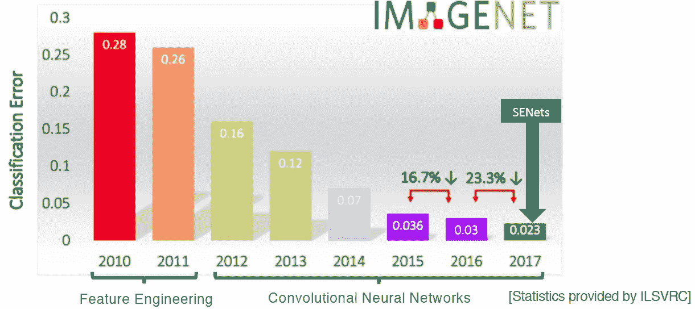

**SENet got the first place in ILSVRC 2017 Classification Challenge**

在这个故事里，回顾了**牛津大学**的**压缩-激发网络(SENet)** 。利用“挤压-激励”(SE)模块**，通过显式模拟通道之间的相互依赖性**，自适应地重新校准通道式特征响应，构建 SENet。并且**在 ILSVRC 2017 分类挑战赛**中以 2.251%的前 5 名误差获得第一名，相对于 2016 年的获奖参赛作品有大约 **25%的提升**。而这是一篇在 **2018 CVPR** 超过 **600 次引用**的论文。最近还发表在 **2019 TPAMI** 上。( [Sik-Ho Tsang](https://medium.com/u/aff72a0c1243?source=post_page-----a887b98b2883--------------------------------) @中)

# 概述

1.  **挤压和激励(SE)块**
2.  **SE-Inception&SE-ResNet**
3.  **与最先进方法的比较**
4.  **分析解释**

# **1。挤压和激励(SE)模块**

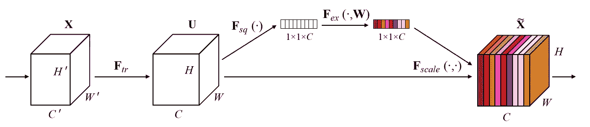

**Squeeze-and-Excitation (SE) Block**

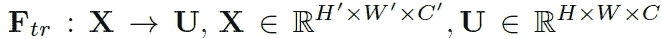

*   其中 *Ftr* 是将 *X* 转换为 *U* 的卷积算子。
*   这个 *Ftr* 可以是残差块或者 Inception 块，后面会更详细的提到。

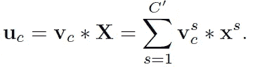

*   其中 *V* =[ *v* 1， *v* 2，…， *v* c]为学习后的滤波器核集合。

## 1.1.挤压:全球信息嵌入

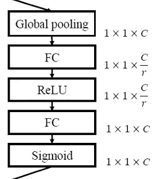

**SE Path, Same as the Upper Path at the Figure Above**

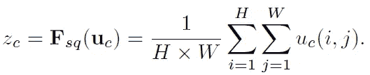

*   变换输出 *U* 可以被解释为**局部描述符的集合，其统计表示整个图像**。
*   建议**将全局空间信息压缩到通道描述符**中。
*   这是通过使用**全局平均池**生成渠道统计数据来实现的。

## 1.2.激发:自适应重新校准

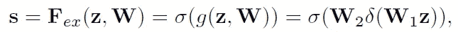

*   其中，δ是 ReLU 函数。
*   使用了一个使用 sigmoid 激活*σ*T21**的简单浇口机制。**
*   提出了一种**激励**操作，以便**完全捕获通道相关**，并且**学习通道之间的非线性和非互斥关系**。
*   我们可以看到有 *W* 1 和 *W* 2，输入 z 是全局平均池化后的通道描述符，有**两个全连接(FC)层**。
*   使用缩减比率*r*通过**维度缩减形成具有两个 FC 层的瓶颈。**

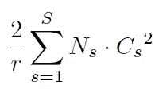

*   **引入的附加参数的数量取决于如上所述的 *r*** 其中 ***S*** 指的是**级的数量**(其中每一级指的是在公共空间维度的特征图上操作的块的集合) ***Cs*** 表示**输出通道的维度**和 ***Ns*** 表示

**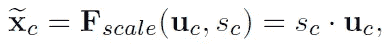**

*   ****块的最终输出是通过用激活**重新调整变换输出 *U* 获得的，如上所示。**
*   **激活充当适应于输入特定描述符 z 的通道权重。在这方面， **SE 模块本质上引入了以输入**为条件的动态，有助于提高特征的可辨性。**

# ****2。SE-Inception & SE-ResNet****

**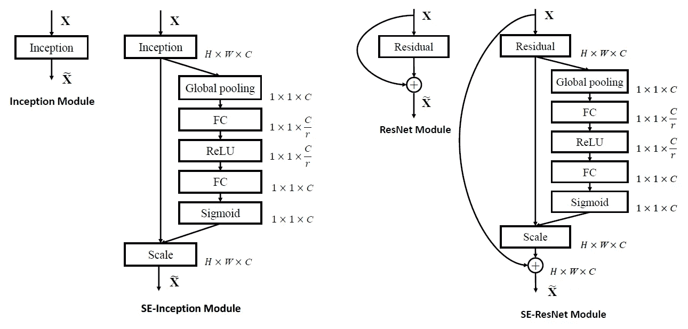**

****Left: SE-Inception, Right: SE-ResNet****

*   **如上图所示，SE 块可以作为 **SE-Inception** 和 **SE-ResNet** 轻松添加到 Inception 和 [ResNet](/review-resnet-winner-of-ilsvrc-2015-image-classification-localization-detection-e39402bfa5d8) 块中。**
*   **特别是在 SE-ResNet 中，压缩和激发都在同分支求和之前起作用。**
*   ****更多与** [**ResNeXt**](/review-resnext-1st-runner-up-of-ilsvrc-2016-image-classification-15d7f17b42ac) **，**[**Inception-ResNet**](/review-inception-v4-evolved-from-googlenet-merged-with-resnet-idea-image-classification-5e8c339d18bc)**，**[**mobilenetv 1**](/review-mobilenetv1-depthwise-separable-convolution-light-weight-model-a382df364b69)**和**[**shuffle net V1**](/review-shufflenet-v1-light-weight-model-image-classification-5b253dfe982f)**可以按照类似的方案构造**。**
*   ****SE-ResNet-50** 和 **SE-ResNeXt-50 (32×4d)** 更详细的架构如下:**

**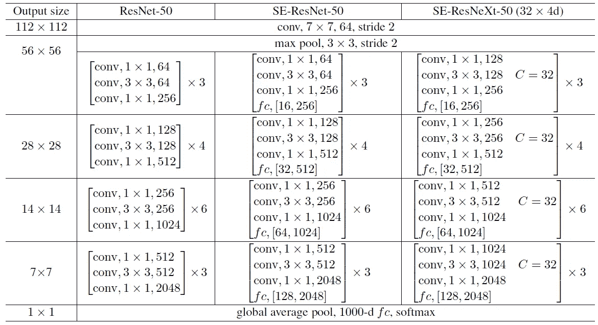**

**[**ResNet-50**](/review-resnet-winner-of-ilsvrc-2015-image-classification-localization-detection-e39402bfa5d8) **(Left), SE-ResNet-50 (Middle), SE-ResNeXt-50 (32×4d) (Right)****

# **3.**与最先进方法的比较****

## **3.1\. ImageNet 验证集的单作物**错误率****

**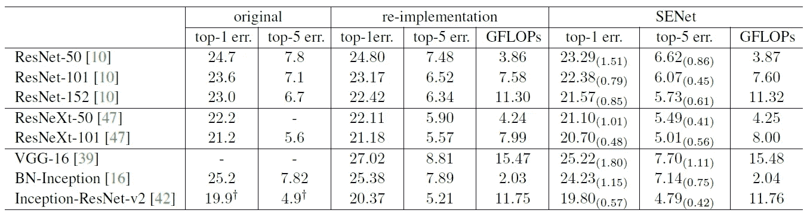**

****Single-Crop Error Rates (%) on ImageNet Validation Set****

*   **SE 块被添加到 [ResNet](/review-resnet-winner-of-ilsvrc-2015-image-classification-localization-detection-e39402bfa5d8) 、 [ResNeXt](/review-resnext-1st-runner-up-of-ilsvrc-2016-image-classification-15d7f17b42ac) 、 [VGGNet](https://medium.com/coinmonks/paper-review-of-vggnet-1st-runner-up-of-ilsvlc-2014-image-classification-d02355543a11) 、 [BN-Inception](https://medium.com/@sh.tsang/review-batch-normalization-inception-v2-bn-inception-the-2nd-to-surpass-human-level-18e2d0f56651) 和 [Inception-ResNet-v2](/review-inception-v4-evolved-from-googlenet-merged-with-resnet-idea-image-classification-5e8c339d18bc) 。对于 [VGGNet](https://medium.com/coinmonks/paper-review-of-vggnet-1st-runner-up-of-ilsvlc-2014-image-classification-d02355543a11) 来说，为了更容易训练，在每次卷积后增加了批量归一化层。**
*   **在训练期间，使用**256 个图像的小批量**，通过 [**ResNet-50**](/review-resnet-winner-of-ilsvrc-2015-image-classification-localization-detection-e39402bfa5d8) **的单次前后传递需要 190 毫秒**，相比之下，SE-ResNet-50 的**需要 209 毫秒(这两个计时都是在具有 **8 个 NVIDIA Titan X GPU**的服务器上执行的)。****
*   **在测试过程中，对于 224 × 224 像素的输入图像，每个型号的 **CPU 推断时间**:[**ResNet-50**](/review-resnet-winner-of-ilsvrc-2015-image-classification-localization-detection-e39402bfa5d8)**需要 164 ms** ，相比之下，SE-ResNet-50 的**需要 167 ms。****
*   **值得注意的是， **SE-ResNet-50** 实现了 6.62%**的**单作物 top-5 验证误差，超过**[**ResNet-50**](/review-resnet-winner-of-ilsvrc-2015-image-classification-localization-detection-e39402bfa5d8)**(7.48%)0.86%****接近**更深层次的 [**ResNet-101**](/review-resnet-winner-of-ilsvrc-2015-image-classification-localization-detection-e39402bfa5d8) 网络实现的性能****
*   **而 **SE-ResNet-101 (6.07% top-5 误差)**不仅匹配，而且跑赢更深层次的[**ResNet-152**](/review-resnet-winner-of-ilsvrc-2015-image-classification-localization-detection-e39402bfa5d8)**网络(6.34% top-5 误差)0.27%** 。**
*   **同样， **SE-ResNeXt-50** 的 top-5 误差为 **5.49%** ，不仅优于其直接对应的[**ResNeXt-50**](/review-resnext-1st-runner-up-of-ilsvrc-2016-image-classification-15d7f17b42ac)(**5.90%**top-5 误差)，也优于更深层次的[**ResNeXt-101**](/review-resnext-1st-runner-up-of-ilsvrc-2016-image-classification-15d7f17b42ac)(**5.57%【T6)****
*   ****SE-Inception-ResNet-v2**(**4.79%**top-5 error)优于重新实现的**[**Inception-ResNet-v2**](/review-inception-v4-evolved-from-googlenet-merged-with-resnet-idea-image-classification-5e8c339d18bc)**(**5.21%**top-5 error)0.42%(相对提高 8.1%)******
*   ******在一系列不同深度的训练中，性能改进是一致的**，这表明 SE 模块带来的改进可以与增加基础架构的深度结合使用。****

****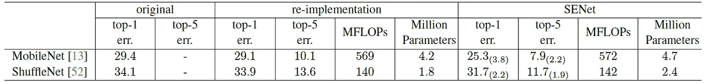****

******Single-Crop Error Rates (%) on ImageNet Validation Set******

*   ****对于轻量级模型， [MobileNetV1](/review-mobilenetv1-depthwise-separable-convolution-light-weight-model-a382df364b69) 和 [ShuffleNet V1](/review-shufflenet-v1-light-weight-model-image-classification-5b253dfe982f) ， **SE 模块可以在最小的计算成本增加下持续大幅度提高精度**。****

## ****3.2.ILSVRC 2017 分类竞赛****

****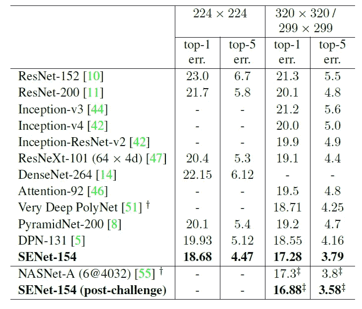****

******Single-Crop Error Rates (%) on ImageNet Validation Set******

*   ****使用了多尺度、多作物和集合。****
*   ****在测试集上得到 2.251%的 top-5 误差。****
*   ****在验证集 **SENet-154 上，使用 224 × 224 中心作物评估，具有修改的**[**ResNeXt**](/review-resnext-1st-runner-up-of-ilsvrc-2016-image-classification-15d7f17b42ac)**，**的 SE 块实现了 18.68%的前 1 误差和 4.47%的前 5 误差**。******
*   ******比 [ResNet](/review-resnet-winner-of-ilsvrc-2015-image-classification-localization-detection-e39402bfa5d8) 、 [Inception-v3](https://medium.com/@sh.tsang/review-inception-v3-1st-runner-up-image-classification-in-ilsvrc-2015-17915421f77c) 、 [Inception-v4](/review-inception-v4-evolved-from-googlenet-merged-with-resnet-idea-image-classification-5e8c339d18bc) 、 [Inception-ResNet-v2](/review-inception-v4-evolved-from-googlenet-merged-with-resnet-idea-image-classification-5e8c339d18bc) 、 [ResNeXt](/review-resnext-1st-runner-up-of-ilsvrc-2016-image-classification-15d7f17b42ac) 、 [DenseNet](/review-densenet-image-classification-b6631a8ef803) 、[剩余注意力网络](/review-residual-attention-network-attention-aware-features-image-classification-7ae44c4f4b8)、 [PolyNet](/review-polynet-2nd-runner-up-in-ilsvrc-2016-image-classification-8a1a941ce9ea) 、 [PyramidNet](https://medium.com/@sh.tsang/review-pyramidnet-deep-pyramidal-residual-networks-image-classification-85a87b60ae78) 、 [DPN](/review-dpn-dual-path-networks-image-classification-d0135dce8817) 。******

## ******3.3.场景分类******

******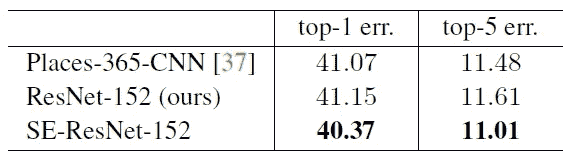******

********Single-crop error rates (%) on Places365 validation set********

*   ********SE-ResNet-152**(**11.01%**top-5 误差)实现了比[**ResNet-152**](/review-resnet-winner-of-ilsvrc-2015-image-classification-localization-detection-e39402bfa5d8)**(**11.61%**top-5 误差)更低的验证误差，提供了 SE 块可以在不同数据集上表现良好的证据。********
*   ****并且 SENet 超过了之前最先进的模型 place 365-CNN，其前 5 名误差为 11.48%。****

## ****3.4.COCO 上的对象检测****

****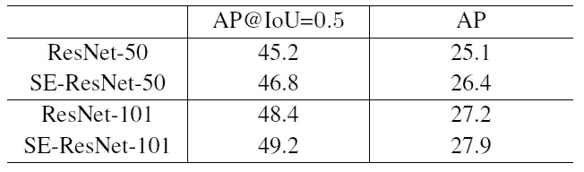****

******Object detection results on the COCO 40k validation set by using the basic** [**Faster R-CNN**](/review-faster-r-cnn-object-detection-f5685cb30202)****

*   ****[更快的 R-CNN](/review-faster-r-cnn-object-detection-f5685cb30202) 用作检测网络。****
*   ****在 COCO 的标准指标 **AP** 和 AP@IoU=0.5 上， **SE-ResNet-50 比**[**ResNet-50**](/review-resnet-winner-of-ilsvrc-2015-image-classification-localization-detection-e39402bfa5d8)**高出 1.3%** (相对提高了 5.2%)。****
*   ****重要的是，在 AP 指标上，SE 模块能够使更深层的架构 [**ResNet-101**](/review-resnet-winner-of-ilsvrc-2015-image-classification-localization-detection-e39402bfa5d8) 受益 0.7%(相对提高 2.6%)。****

# ******4。分析和解释******

## ****4.1.减速比 r****

****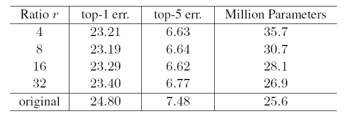****

******Single-Crop Error Rates (%) on ImageNet Validation Set******

*   *******r* = 16 在准确性和复杂性**之间取得了良好的平衡，因此，该值用于所有实验。****

## ****4.2.激励的作用****

****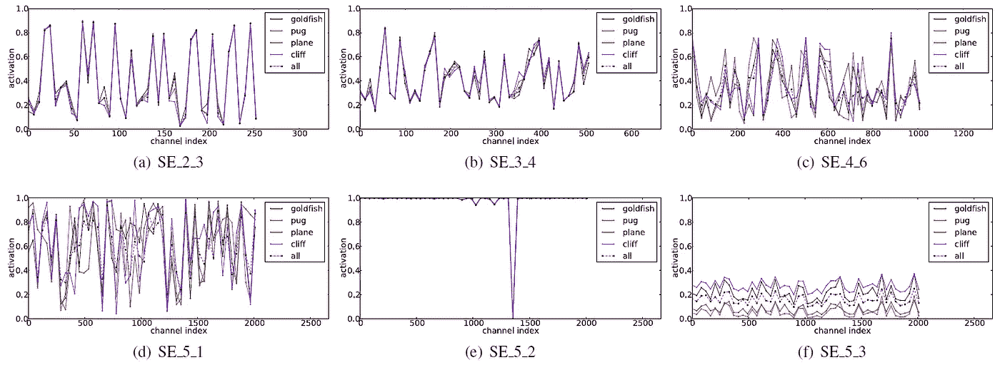****

******Activations induced by Excitation in the different modules of SE-ResNet-50 on ImageNet.******

*   ****对于上述 5 个类别，从验证集中为每个类别抽取 50 个样本，并计算每个阶段中最后 SE 块中 50 个均匀采样的通道的平均激活。****
*   ****首先，在**较低层**，例如 SE_2_3，**特征信道的重要性可能由网络早期阶段的不同类别**共享。****
*   ****第二，在**更大的深度**，例如 SE_4_6 和 SE_5_1，每个通道的值变得更加特定于类别，因为不同的类别对特征的区别值表现出不同的偏好。****
*   ****结果，表示学习受益于由 SE 块引起的重新校准，这在需要的程度上自适应地促进了特征提取和专门化。****
*   ****最后，**最后一级**，即 SE_5_2，呈现出一种有趣的趋势**趋向饱和状态**，其中大部分激活接近 1，其余接近 0。在 SE_5_3 中也发现了类似的模式，只是尺度略有变化。****
*   ****这表明在向网络提供重新校准时，SE 5 2 和 SE 5 3 没有以前的模块重要。****
*   ******通过移除最后一级**的 SE 模块，可以显著减少总参数数量，而性能损失很小。****

****SE 模块通过使网络能够执行动态的逐通道特征再校准来提高网络的代表性容量。****

## ****参考****

****【2018 CVPR】【塞内】
[压缩-激发网络](https://arxiv.org/abs/1709.01507)****

****【2019 TPAMI】【SENet】
[压缩和激励网络](https://ieeexplore.ieee.org/document/8701503)****

## ****我以前的评论****

****)(他)(们)(都)(不)(在)(这)(些)(事)(上)(,)(我)(们)(还)(不)(在)(这)(些)(事)(上)(有)(什)(么)(情)(况)(?)(我)(们)(都)(不)(在)(这)(些)(情)(况)(上)(,)(我)(们)(还)(没)(有)(什)(么)(情)(况)(,)(我)(们)(还)(没)(有)(什)(么)(情)(况)(,)(我)(们)(还)(没)(有)(什)(么)(情)(况)(,)(我)(们)(还)(没)(有)(什)(么)(好)(好)(的)(情)(感)(。 )(他)(们)(都)(不)(在)(这)(些)(事)(上)(,)(她)(们)(还)(不)(在)(这)(些)(事)(上)(有)(什)(么)(情)(况)(呢)(?)(她)(们)(都)(不)(在)(这)(些)(情)(况)(下)(,)(她)(们)(还)(不)(在)(这)(些)(事)(上)(有)(什)(么)(情)(况)(吗)(?)(她)(们)(们)(都)(不)(在)(这)(些)(事)(上)(,)(她)(们)(们)(还)(不)(在)(这)(些)(事)(上)(,)(她)(们)(们)(还)(不)(在)(这)(些)(事)(上)(有)(什)(么)(好)(的)(情)(情)(况)(。 [PyramidNet](https://medium.com/@sh.tsang/review-pyramidnet-deep-pyramidal-residual-networks-image-classification-85a87b60ae78) [DRN](/review-drn-dilated-residual-networks-image-classification-semantic-segmentation-d527e1a8fb5) [DPN](/review-dpn-dual-path-networks-image-classification-d0135dce8817) [残留注意网络](/review-residual-attention-network-attention-aware-features-image-classification-7ae44c4f4b8) [MSDNet](/review-msdnet-multi-scale-dense-networks-image-classification-4d949955f6d5) [ShuffleNet V1](/review-shufflenet-v1-light-weight-model-image-classification-5b253dfe982f)****

******物体检测** [过食](https://medium.com/coinmonks/review-of-overfeat-winner-of-ilsvrc-2013-localization-task-object-detection-a6f8b9044754)[R-CNN](https://medium.com/coinmonks/review-r-cnn-object-detection-b476aba290d1)[快 R-CNN](https://medium.com/coinmonks/review-fast-r-cnn-object-detection-a82e172e87ba)[快 R-CNN](/review-faster-r-cnn-object-detection-f5685cb30202)[MR-CNN&S-CNN](/review-mr-cnn-s-cnn-multi-region-semantic-aware-cnns-object-detection-3bd4e5648fde)[DeepID-Net](/review-deepid-net-def-pooling-layer-object-detection-f72486f1a0f6)[CRAFT](/review-craft-cascade-region-proposal-network-and-fast-r-cnn-object-detection-2ce987361858)[R-FCN](/review-r-fcn-positive-sensitive-score-maps-object-detection-91cd2389345c)】 [[G-RMI](/review-g-rmi-winner-in-2016-coco-detection-object-detection-af3f2eaf87e4)][[TDM](https://medium.com/datadriveninvestor/review-tdm-top-down-modulation-object-detection-3f0efe9e0151)][[SSD](/review-ssd-single-shot-detector-object-detection-851a94607d11)][[DSSD](/review-dssd-deconvolutional-single-shot-detector-object-detection-d4821a2bbeb5)][[约洛夫 1](/yolov1-you-only-look-once-object-detection-e1f3ffec8a89) ] [ [约洛夫 2 /约洛 9000](/review-yolov2-yolo9000-you-only-look-once-object-detection-7883d2b02a65) ] [ [约洛夫 3](/review-yolov3-you-only-look-once-object-detection-eab75d7a1ba6)[[FPN](/review-fpn-feature-pyramid-network-object-detection-262fc7482610)[[视网膜网](/review-retinanet-focal-loss-object-detection-38fba6afabe4)[[DCN](/review-dcn-deformable-convolutional-networks-2nd-runner-up-in-2017-coco-detection-object-14e488efce44)****

******语义切分** [FCN](/review-fcn-semantic-segmentation-eb8c9b50d2d1)[de convnet](/review-deconvnet-unpooling-layer-semantic-segmentation-55cf8a6e380e)[deeplabv 1&deeplabv 2](/review-deeplabv1-deeplabv2-atrous-convolution-semantic-segmentation-b51c5fbde92d)[CRF-RNN](/review-crf-rnn-conditional-random-fields-as-recurrent-neural-networks-semantic-segmentation-a11eb6e40c8c)】[SegNet](/review-segnet-semantic-segmentation-e66f2e30fb96)】[parse net](https://medium.com/datadriveninvestor/review-parsenet-looking-wider-to-see-better-semantic-segmentation-aa6b6a380990)[dilated net](/review-dilated-convolution-semantic-segmentation-9d5a5bd768f5)[DRN](/review-drn-dilated-residual-networks-image-classification-semantic-segmentation-d527e1a8fb5)[RefineNet](/review-refinenet-multi-path-refinement-network-semantic-segmentation-5763d9da47c1)****

******生物医学图像分割** [[cumed vision 1](https://medium.com/datadriveninvestor/review-cumedvision1-fully-convolutional-network-biomedical-image-segmentation-5434280d6e6)][[cumed vision 2/DCAN](https://medium.com/datadriveninvestor/review-cumedvision2-dcan-winner-of-2015-miccai-gland-segmentation-challenge-contest-biomedical-878b5a443560)][[U-Net](/review-u-net-biomedical-image-segmentation-d02bf06ca760)][[CFS-FCN](https://medium.com/datadriveninvestor/review-cfs-fcn-biomedical-image-segmentation-ae4c9c75bea6)][[U-Net+ResNet](https://medium.com/datadriveninvestor/review-u-net-resnet-the-importance-of-long-short-skip-connections-biomedical-image-ccbf8061ff43)][[多通道](/review-multichannel-segment-colon-histology-images-biomedical-image-segmentation-d7e57902fbfc)][[V-Net](/review-v-net-volumetric-convolution-biomedical-image-segmentation-aa15dbaea974)][[3D U-Net](/review-3d-u-net-volumetric-segmentation-medical-image-segmentation-8b592560fac1)][[M FCN](/review-m²fcn-multi-stage-multi-recursive-input-fully-convolutional-networks-biomedical-image-4f8d5e3f07f1)****

******实例分割** [SDS](https://medium.com/datadriveninvestor/review-sds-simultaneous-detection-and-segmentation-instance-segmentation-80b2a8ce842b) [Hypercolumn](/review-hypercolumn-instance-segmentation-367180495979) [DeepMask](/review-deepmask-instance-segmentation-30327a072339) [SharpMask](/review-sharpmask-instance-segmentation-6509f7401a61) [MultiPathNet](/review-multipath-mpn-1st-runner-up-in-2015-coco-detection-segmentation-object-detection-ea9741e7c413) [MNC](/review-mnc-multi-task-network-cascade-winner-in-2015-coco-segmentation-instance-segmentation-42a9334e6a34) [InstanceFCN](/review-instancefcn-instance-sensitive-score-maps-instance-segmentation-dbfe67d4ee92) [FCIS](/review-fcis-winner-in-2016-coco-segmentation-instance-segmentation-ee2d61f465e2)****

****)(我)(们)(都)(不)(知)(道)(,)(我)(们)(还)(是)(不)(知)(道)(,)(我)(们)(还)(是)(不)(知)(道)(,)(我)(们)(还)(是)(不)(知)(道)(,)(我)(们)(还)(是)(不)(知)(道)(,)(我)(们)(还)(是)(不)(知)(道)(,)(我)(们)(还)(是)(不)(知)(道)(。****

******人体姿态估计**
[深度姿态](/review-deeppose-cascade-of-cnn-human-pose-estimation-cf3170103e36)[汤普逊·尼普斯 14](/review-tompson-nips14-joint-training-of-cnn-and-graphical-model-human-pose-estimation-95016bc510c)[汤普逊·CVPR 15](/review-tompson-cvpr15-spatial-dropout-human-pose-estimation-c7d6a5cecd8c)****