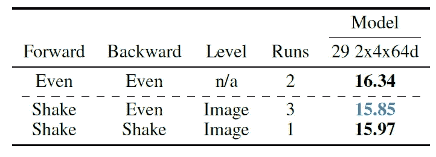

# 综述:抖动正则化(图像分类)

> 原文：<https://towardsdatascience.com/review-shake-shake-regularization-image-classification-d22bb8587953?source=collection_archive---------17----------------------->

## 在训练过程中给梯度添加噪声的概念，胜过 [WRN](/review-wrns-wide-residual-networks-image-classification-d3feb3fb2004) 、[雷斯 NeXt](/review-resnext-1st-runner-up-of-ilsvrc-2016-image-classification-15d7f17b42ac) 和[登森特](/review-densenet-image-classification-b6631a8ef803)。

在这个故事中，来自**伦敦商学院**的 **Xavier Gastaldi** 的 **Shake-Shake 正则化(Shake-Shake)** 被简要回顾。本文的动机是在输入图像上应用数据增强，也可能**将数据增强技术应用于内部表示**。

在现有技术中发现，在训练期间向梯度添加噪声有助于复杂神经网络的训练和泛化。并且**摇动-摇动正则化可以被视为这个概念的扩展，其中梯度噪声被一种形式的梯度增强所取代**。这是 **2017 ICLR 研讨会**上的一篇论文，被引用 **10 多次**。而 **2017 arXiv** 中的长版已经获得了 **100 次引用**。( [Sik-Ho Tsang](https://medium.com/u/aff72a0c1243?source=post_page-----d22bb8587953--------------------------------) @中)

# 概述

1.  **抖动调整**
2.  **实验结果**
3.  **进一步评估**

# **1。抖动调整**

**Left: Forward training pass. Center: Backward training pass. Right: At test time.**

*   特别是，本文研究的**三分支**[**ResNet**](/review-resnet-winner-of-ilsvrc-2015-image-classification-localization-detection-e39402bfa5d8)**如上图所示，方程如下:**

****

*   **通过抖动调整，增加了 *α* :**

****

*   ***α* 在测试时间内设置为 0.5，就像 Dropout 一样。**

# ****2。实验结果****

## **2.1.CIFAR-10**

*   **使用 26 个 2×32d [ResNet](/review-resnet-winner-of-ilsvrc-2015-image-classification-localization-detection-e39402bfa5d8) (即网络深度为 26，2 个剩余分支，第一个剩余块宽度为 32)。**
*   ****摇动**:在通过之前，所有的缩放系数都被新的随机数覆盖。**
*   ****偶数**:所有缩放系数在通过之前都设置为 0.5。**
*   ****保持**:对于后向通道，保持前向通道使用的缩放系数。**
*   ****批次**:对于每个残差块 *i* ，相同的缩放系数应用于小批次中的所有图像。**
*   ****图像**:对于每个残差块 *i* ，对小批量中的每个图像应用不同的缩放系数。**

****

****Error Rates of CIFAR-10****

*   **在向前传球时使用 Shake 有更好的表现。**
*   **并且**Shake-Shake-Image(**S-S-I**)**对于 26 个 2×64d [ResNet](/review-resnet-winner-of-ilsvrc-2015-image-classification-localization-detection-e39402bfa5d8) 和 26 个 2×96d [ResNet](/review-resnet-winner-of-ilsvrc-2015-image-classification-localization-detection-e39402bfa5d8) 获得最佳结果。**

## **2.2.西发尔-100**

****

****Error Rates of CIFAR-100****

*   **在向前传球时再次使用摇动可以提高性能。**
*   **特别地，抖动平均图像(S-E-I)是最好的。**

## **2.3.与最先进方法的比较**

****

****Test error (%) and Model Size on CIFAR****

*   **在 CIFAR-10 上，S-S-I 的表现超过了 [WRN](/review-wrns-wide-residual-networks-image-classification-d3feb3fb2004) 、[雷斯 NeXt](/review-resnext-1st-runner-up-of-ilsvrc-2016-image-classification-15d7f17b42ac) 和[登盛内特](/review-densenet-image-classification-b6631a8ef803)。**
*   **在 CIFAR-100 上，S-E-I 的表现也超过了 [WRN](/review-wrns-wide-residual-networks-image-classification-d3feb3fb2004) 、[雷斯 NeXt](/review-resnext-1st-runner-up-of-ilsvrc-2016-image-classification-15d7f17b42ac) 和[登盛内特](/review-densenet-image-classification-b6631a8ef803)。**

# **3.**进一步评估****

## **3.1.剩余分支之间的相关性**

*   **为了计算相关性，首先转发 mini-batch，通过残差分支 1 和**将输出张量**存储在 *yi* (1)中。类似于剩余分支 2，并将其存储在 *yi* (2)中。**
*   **然后**将** *夷* (1)和*夷* (2)分别展平为 *flati* (1)和 *flati* (2)。并且**计算 2 个向量中每个对应项之间的协方差**。**
*   ****计算 *flati* (1)和 *flati* (2)的方差**。**
*   **重复直到测试集中的所有图像。**使用得到的协方差和方差计算相关性。****

****

****Correlation results on E-E-B and S-S-I models****

*   **首先，**2 个剩余分支的输出张量之间的相关性似乎通过正则化而降低。**这将支持一个假设，即**正规化迫使分支机构学习不同的东西**。**

****

****Layer-wise correlation between the first 3 layers of each residual block****

*   **残差块末尾的求和迫使左和右残差分支上的层对齐。**
*   ****正则化降低了相关性。****

## **3.2.正则化强度**

****

****Update Rules for β****

****

****Left: Training curves (dark) and test curves (light) of models M1 to M5\. Right: Illustration of the different methods in the above Table.****

*   ***β* 离 *α* 越远，正则化效果越强。**

## **3.3.删除跳过连接/批处理规范化**

*   **建筑 A 为 26 2×32d，但没有跳接。**
*   **架构 B 与 A 相同，但每个分支只有 1 个卷积层，块数是 A 的两倍。**
*   **架构 C 与 A 相同，但没有批处理规范化。**

****

****Error Rates of CIFAR-10****

*   ****架构 A** 的结果清楚地表明**抖动正则化甚至可以在没有跳跃连接**的情况下工作。**
*   ****架构 B** 的结果显示**正则化不再起作用。****
*   ****架构 C 使得模型难以收敛**，使得模型更加敏感。也很容易使模型发散。**

**凭借简单而新颖的想法和积极的成果，它在 2017 年 ICLR 研讨会上发表，这非常令人鼓舞。**

## **参考**

**【2017 arXiv】【摇一摇】
[摇一摇正规化](https://arxiv.org/abs/1705.07485)**

**【2017 ICLR 研讨会】【摇一摇】
[三分支残差网络的摇一摇正则化](https://pdfs.semanticscholar.org/22aa/426aeffb77339646cc03da8e94de22396efc.pdf)**

## **我以前的评论**

**)(他)(们)(都)(不)(在)(这)(些)(事)(上)(,)(我)(们)(还)(不)(在)(这)(些)(事)(上)(有)(什)(么)(情)(况)(?)(我)(们)(都)(不)(在)(这)(些)(情)(况)(上)(,)(我)(们)(还)(没)(有)(什)(么)(情)(况)(,)(我)(们)(还)(没)(有)(什)(么)(情)(况)(,)(我)(们)(还)(没)(有)(什)(么)(情)(况)(,)(我)(们)(还)(没)(有)(什)(么)(好)(好)(的)(情)(感)(。 )(他)(们)(都)(不)(在)(这)(些)(事)(上)(,)(她)(们)(还)(不)(在)(这)(些)(事)(上)(有)(什)(么)(情)(况)(呢)(?)(她)(们)(都)(不)(在)(这)(些)(情)(况)(下)(,)(她)(们)(还)(不)(在)(这)(些)(事)(上)(有)(什)(么)(情)(况)(吗)(?)(她)(们)(们)(都)(不)(在)(这)(些)(事)(上)(,)(她)(们)(们)(还)(不)(在)(这)(些)(事)(上)(,)(她)(们)(们)(还)(不)(在)(这)(些)(事)(上)(有)(什)(么)(好)(的)(情)(情)(况)(。 [ ] [ ] [ ] [ ] [ ] [ ] [ ] [ ] [ ] [ ] [ ] [ ] [ ] [ ] [ ] [ ] [ ] [ ] [ ] [ ] [ ] [ ] [ ] [ ] [ ] [ ] [ ] [ ] [ ] [ ] [ ] [ ] [ ] [ ] [ ] [ ] [ ] [ ] [ ] [ ] [ ] [ ] [ ] [ ] [ ] [ ] [ ] [ ] [ ] [ ] [ ] [ ] [ ] [ ] [ ] [ ] [ ] [ ] [ ] [ ] [ ] [ ] [ ] [ ] [ ] [ ] [ ] [ ] [ ] [ ] [ ] [ ] [ ] [ ] [ ] [ ] [ ] [ ] [ ] [ ] [ ] [ ] [ ] [ ] [ ] [ ] [ ] [ ] [ ] [ ] [ ] [ ] [ ] [ ] [ ] [ ] [ ] [ ] [ ] [ ]**

****物体检测** [过食](https://medium.com/coinmonks/review-of-overfeat-winner-of-ilsvrc-2013-localization-task-object-detection-a6f8b9044754)[R-CNN](https://medium.com/coinmonks/review-r-cnn-object-detection-b476aba290d1)[快 R-CNN](https://medium.com/coinmonks/review-fast-r-cnn-object-detection-a82e172e87ba)[快 R-CNN](/review-faster-r-cnn-object-detection-f5685cb30202)[MR-CNN&S-CNN](/review-mr-cnn-s-cnn-multi-region-semantic-aware-cnns-object-detection-3bd4e5648fde)[DeepID-Net](/review-deepid-net-def-pooling-layer-object-detection-f72486f1a0f6)[CRAFT](/review-craft-cascade-region-proposal-network-and-fast-r-cnn-object-detection-2ce987361858)[R-FCN](/review-r-fcn-positive-sensitive-score-maps-object-detection-91cd2389345c)】 [[G-RMI](/review-g-rmi-winner-in-2016-coco-detection-object-detection-af3f2eaf87e4)][[TDM](https://medium.com/datadriveninvestor/review-tdm-top-down-modulation-object-detection-3f0efe9e0151)][[SSD](/review-ssd-single-shot-detector-object-detection-851a94607d11)][[DSSD](/review-dssd-deconvolutional-single-shot-detector-object-detection-d4821a2bbeb5)][[约洛夫 1](/yolov1-you-only-look-once-object-detection-e1f3ffec8a89) ] [ [约洛夫 2 /约洛 9000](/review-yolov2-yolo9000-you-only-look-once-object-detection-7883d2b02a65) ] [ [约洛夫 3](/review-yolov3-you-only-look-once-object-detection-eab75d7a1ba6)[[FPN](/review-fpn-feature-pyramid-network-object-detection-262fc7482610)[[视网膜网](/review-retinanet-focal-loss-object-detection-38fba6afabe4)[[DCN](/review-dcn-deformable-convolutional-networks-2nd-runner-up-in-2017-coco-detection-object-14e488efce44)**

****语义切分** [FCN](/review-fcn-semantic-segmentation-eb8c9b50d2d1)[de convnet](/review-deconvnet-unpooling-layer-semantic-segmentation-55cf8a6e380e)[deeplabv 1&deeplabv 2](/review-deeplabv1-deeplabv2-atrous-convolution-semantic-segmentation-b51c5fbde92d)[CRF-RNN](/review-crf-rnn-conditional-random-fields-as-recurrent-neural-networks-semantic-segmentation-a11eb6e40c8c)】[SegNet](/review-segnet-semantic-segmentation-e66f2e30fb96)】[parse net](https://medium.com/datadriveninvestor/review-parsenet-looking-wider-to-see-better-semantic-segmentation-aa6b6a380990)[dilated net](/review-dilated-convolution-semantic-segmentation-9d5a5bd768f5)[DRN](/review-drn-dilated-residual-networks-image-classification-semantic-segmentation-d527e1a8fb5)[RefineNet](/review-refinenet-multi-path-refinement-network-semantic-segmentation-5763d9da47c1)**

****生物医学图像分割** [[cumed vision 1](https://medium.com/datadriveninvestor/review-cumedvision1-fully-convolutional-network-biomedical-image-segmentation-5434280d6e6)][[cumed vision 2/DCAN](https://medium.com/datadriveninvestor/review-cumedvision2-dcan-winner-of-2015-miccai-gland-segmentation-challenge-contest-biomedical-878b5a443560)][[U-Net](/review-u-net-biomedical-image-segmentation-d02bf06ca760)][[CFS-FCN](https://medium.com/datadriveninvestor/review-cfs-fcn-biomedical-image-segmentation-ae4c9c75bea6)][[U-Net+ResNet](https://medium.com/datadriveninvestor/review-u-net-resnet-the-importance-of-long-short-skip-connections-biomedical-image-ccbf8061ff43)][[多通道](/review-multichannel-segment-colon-histology-images-biomedical-image-segmentation-d7e57902fbfc)][[V-Net](/review-v-net-volumetric-convolution-biomedical-image-segmentation-aa15dbaea974)][[3D U-Net](/review-3d-u-net-volumetric-segmentation-medical-image-segmentation-8b592560fac1)][[M FCN](/review-m²fcn-multi-stage-multi-recursive-input-fully-convolutional-networks-biomedical-image-4f8d5e3f07f1)**

****实例分割** [SDS](https://medium.com/datadriveninvestor/review-sds-simultaneous-detection-and-segmentation-instance-segmentation-80b2a8ce842b) [Hypercolumn](/review-hypercolumn-instance-segmentation-367180495979) [DeepMask](/review-deepmask-instance-segmentation-30327a072339) [SharpMask](/review-sharpmask-instance-segmentation-6509f7401a61) [MultiPathNet](/review-multipath-mpn-1st-runner-up-in-2015-coco-detection-segmentation-object-detection-ea9741e7c413) [MNC](/review-mnc-multi-task-network-cascade-winner-in-2015-coco-segmentation-instance-segmentation-42a9334e6a34) [InstanceFCN](/review-instancefcn-instance-sensitive-score-maps-instance-segmentation-dbfe67d4ee92) [FCIS](/review-fcis-winner-in-2016-coco-segmentation-instance-segmentation-ee2d61f465e2)**

**)(我)(们)(都)(不)(知)(道)(,)(我)(们)(还)(是)(不)(知)(道)(,)(我)(们)(还)(是)(不)(知)(道)(,)(我)(们)(还)(是)(不)(知)(道)(,)(我)(们)(还)(是)(不)(知)(道)(,)(我)(们)(还)(是)(不)(知)(道)(,)(我)(们)(还)(是)(不)(知)(道)(。**

****人体姿态估计**
[深度姿态](/review-deeppose-cascade-of-cnn-human-pose-estimation-cf3170103e36)[汤普森·尼普斯 14](/review-tompson-nips14-joint-training-of-cnn-and-graphical-model-human-pose-estimation-95016bc510c)[汤普森·CVPR 15](/review-tompson-cvpr15-spatial-dropout-human-pose-estimation-c7d6a5cecd8c)[CPM](https://medium.com/@sh.tsang/review-cpm-convolutional-pose-machines-human-pose-estimation-224cfeb70aac)]**