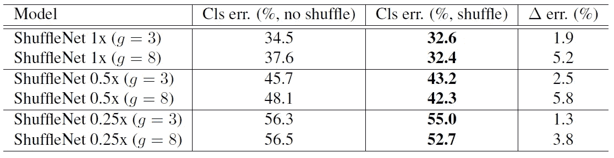

# 回顾:shuffle net V1-轻量级模型(图像分类)

> 原文：<https://towardsdatascience.com/review-shufflenet-v1-light-weight-model-image-classification-5b253dfe982f?source=collection_archive---------7----------------------->

## 通过频道洗牌，性能优于 [MobileNetV1](/review-mobilenetv1-depthwise-separable-convolution-light-weight-model-a382df364b69)

**ShuffleNet, Light Weight Models for Limited Computational Budget Devices such as Drones** ([https://unsplash.com/photos/DiTiYQx0mh4](https://unsplash.com/photos/DiTiYQx0mh4))

在这个故事里，对**旷视科技公司【Face ++】**出品的 **ShuffleNet V1** 进行了简要回顾。ShuffleNet 在数十或数百 MFLOPs 的非常有限的计算预算中追求**最佳精度，专注于常见的移动平台，如**无人机**、**机器人**和**智能手机**。通过混洗频道，ShuffleNet 胜过了 [MobileNetV1](/review-mobilenetv1-depthwise-separable-convolution-light-weight-model-a382df364b69) 。在 ARM 设备中，ShuffleNet 比 [AlexNet](https://medium.com/coinmonks/paper-review-of-alexnet-caffenet-winner-in-ilsvrc-2012-image-classification-b93598314160) 实现了 13 倍的实际加速，同时保持了相当的精度。这是一篇 **2018 CVPR** 的论文，引用超过 **300 次**。( [Sik-Ho Tsang](https://medium.com/u/aff72a0c1243?source=post_page-----5b253dfe982f--------------------------------) @中)**

# 概述

1.  **群组卷积的信道混洗**
2.  **洗牌机单元**
3.  **ShuffleNet 架构**
4.  **消融研究**
5.  **与最先进方法的比较**

# **1。群组卷积的信道混洗**

**(a) Two Stacked Group Convolutions (GConv1 & GConv2), (b) Shuffle the channels before convolution, (c) Equivalent implementation of (b)**

*   **组卷积用于**[**Alex net**](https://medium.com/coinmonks/paper-review-of-alexnet-caffenet-winner-in-ilsvrc-2012-image-classification-b93598314160)**和**[**ResNeXt**](/review-resnext-1st-runner-up-of-ilsvrc-2016-image-classification-15d7f17b42ac)**。**
*   **(a)** :没有通道混洗，**每个输出通道只与组内的输入通道相关。**这个特性**阻断了通道组之间的信息流，削弱了代表性**。
*   **(b)** :如果我们**允许组卷积获得不同组的输入数据，那么输入和输出通道将完全相关。**
*   **【c】**:( b)中的操作可以通过信道混洗操作来高效且优雅地**实现。**假设一个卷积层有 *g* 个组，其输出有 *g* × *n* 个信道；我们先用**将**输出的通道尺寸整形为( *g* ， *n* )，**转置**，然后**将其展平**作为下一层的输入。
*   信道混洗也是**可微分的**，这意味着它可以嵌入到网络结构中用于**端到端训练**。

# 2.**洗牌机单元**

**(a) bottleneck unit with depthwise convolution (DWConv), (b) ShuffleNet unit with pointwise group convolution (GConv) and channel shuffle, (c) ShuffleNet unit with stride = 2.**

*   **(a)瓶颈单元**:这是一个标准的剩余瓶颈单元，但是使用了深度方向卷积。(**深度方向卷积用于**[**MobileNetV1**](/review-mobilenetv1-depthwise-separable-convolution-light-weight-model-a382df364b69)**)。**)使用 1×1 然后 3×3 DW 然后 1×1 卷积，它也可以被视为 [MobileNetV2](/review-mobilenetv2-light-weight-model-image-classification-8febb490e61c) 中使用的深度方向可分离卷积的瓶颈类型。
*   **(b) ShuffleNet 单元**:第一个和第二个 1×1 卷积被组卷积替换。在第一个 1×1 卷积之后，应用通道混洗。
*   **(c)Stride = 2 的 ShuffleNet 单元:**应用 Stride 时，在快捷路径上添加 3×3 平均池。此外，逐元素相加被信道级联取代，这使得很容易以很少的额外计算成本来扩大信道维度。
*   给定输入*c*×*h*×*w*和瓶颈通道 *m* ， [ResNet](/review-resnet-winner-of-ilsvrc-2015-image-classification-localization-detection-e39402bfa5d8) 单元要求*HW*(2*cm*+9*m*)FLOPs 和 [ResNeXt](/review-resnext-1st-runner-up-of-ilsvrc-2016-image-classification-15d7f17b42ac) 要求 *hw* (2 *cm*
*   换句话说，给定计算预算， **ShuffleNet 可以使用更宽的特征地图**。我们发现这对小型网络来说**至关重要，因为小型网络通常没有足够数量的通道来处理信息。**

# **3。ShuffleNet 架构**

**ShuffleNet Architecture**

*   所提出的网络主要由分成三级的一堆洗牌网络单元组成。
*   对于每个洗牌机单元，瓶颈通道的数量被设置为输出通道的 1/4。
*   一个**比例因子 *s*** 应用于通道的数量。上表中的网络表示为“ShuffleNet 1×”,那么“ShuffleNet *s* ×”意味着将 ShuffleNet 1×中的滤波器数量缩放了 *s* 倍，因此总体复杂度将大致为 ShuffleNet 1×的 *s* 倍。

# **4。消融研究**

*   使用 ImageNet 2012 分类验证集。

## 4.1.不同数量的组卷积 *g*

**Different number of group convolutions g**

*   其中 *g* = 1，即没有逐点群卷积。
*   具有组卷积( *g* > 1)的模型始终比没有点态组卷积( *g* = 1)的模型表现得更好。
*   较小的模型往往从群体中获益更多。
*   例如，对于 ShuffleNet 1 倍的最佳条目( *g* = 8)比对应条目好 1.2%，而对于 ShuffleNet 0.5 倍和 0.25 倍，差距分别变为 3.5%和 4.4%。
*   对于某些型号(如 ShuffleNet 0.5×)当**组数变得相对较大(如 *g* = 8)时，分类得分饱和甚至下降。**随着组号的增加(因此特征映射更宽)，**每个卷积滤波器的输入通道变得更少，这可能损害表示能力。**

## 4.2.洗牌还是不洗牌

**Shuffle vs No Shuffle**

*   频道洗牌持续提升不同设置的分类分数，这显示了跨组信息交换的重要性。

# **5。与最先进方法的比较**

## 5.1.与其他结构单元的比较

**Comparison with Other Structure Units**

*   [VGGNet](https://medium.com/coinmonks/paper-review-of-vggnet-1st-runner-up-of-ilsvlc-2014-image-classification-d02355543a11) 、 [ResNet](/review-resnet-winner-of-ilsvrc-2015-image-classification-localization-detection-e39402bfa5d8) 、[exception](/review-xception-with-depthwise-separable-convolution-better-than-inception-v3-image-dc967dd42568)和 [ResNeXt](/review-resnext-1st-runner-up-of-ilsvrc-2016-image-classification-15d7f17b42ac) 没有完全探索低复杂度条件。
*   为了公平比较，在上表中，具有其他结构的阶段 2-4 中的洗牌网络单元被其他网络的单元替换，然后调整通道的数量以确保复杂度保持不变。
*   在不同的复杂性下，ShuffleNet 模型的表现远远超过大多数其他模型。
*   例如，在 38 MFLOPs 的复杂度下，[类 VGG](https://medium.com/coinmonks/paper-review-of-vggnet-1st-runner-up-of-ilsvlc-2014-image-classification-d02355543a11) 、 [ResNet](/review-resnet-winner-of-ilsvrc-2015-image-classification-localization-detection-e39402bfa5d8) 、 [ResNeXt](/review-resnext-1st-runner-up-of-ilsvrc-2016-image-classification-15d7f17b42ac) 、[exception](/review-xception-with-depthwise-separable-convolution-better-than-inception-v3-image-dc967dd42568)类 ShuffleNet 模型的阶段 4(见表 1)的输出通道分别为 50、192、192、288、576，这与精度的提高是一致的。
*   由于需要调整的超参数太多，GoogLeNet 或 Inception 系列不包括在内。
*   另一个名为 PVANET 的轻量级网络结构的分类误差为 29.7%，计算复杂度为 557 MFLOPs，而我们的 shuffle net 2×model(*g*= 3)的分类误差为 26.3%，计算复杂度为 524 MFLOPs。

## 5.2.与 [MobileNetV1](/review-mobilenetv1-depthwise-separable-convolution-light-weight-model-a382df364b69) 的比较

**Comparison with** [**MobileNetV1**](/review-mobilenetv1-depthwise-separable-convolution-light-weight-model-a382df364b69)

*   ShuffleNet 模型在所有复杂性方面都优于 [MobileNetV1](/review-mobilenetv1-depthwise-separable-convolution-light-weight-model-a382df364b69) 。
*   虽然 ShuffleNet 网络是专门为小模型设计的(< 150 MFLOPs), it is still better than [MobileNetV1](/review-mobilenetv1-depthwise-separable-convolution-light-weight-model-a382df364b69) 计算成本较高，例如比 [MobileNetV1](/review-mobilenetv1-depthwise-separable-convolution-light-weight-model-a382df364b69) 高 3.1%的精度，成本为 500 MFLOPs。
*   简单的架构设计也使得为 ShuffeNets 配备最新技术变得容易，例如挤压和激励(SE)模块。(希望以后可以复习 SENet。)
*   具有 SE 模块的 ShuffleNet 将 shuffle net 的 top-1 误差提高了 2 倍至 24.7%，但通常比移动设备上的“原始”shuffle net 慢 25%至 40%，这意味着实际加速评估对低成本架构设计至关重要。

## 5.3.与其他模型的比较

**Comparison with Other Models**

*   在准确率差不多的情况下，ShuffleNet 比 [VGGNet](https://medium.com/coinmonks/paper-review-of-vggnet-1st-runner-up-of-ilsvlc-2014-image-classification-d02355543a11) 、 [GoogLeNet](https://medium.com/coinmonks/paper-review-of-googlenet-inception-v1-winner-of-ilsvlc-2014-image-classification-c2b3565a64e7) 、 [AlexNet](https://medium.com/coinmonks/paper-review-of-alexnet-caffenet-winner-in-ilsvrc-2012-image-classification-b93598314160) 和 [SqueezeNet](/review-squeezenet-image-classification-e7414825581a) 效率要高得多。

## 5.4.概括能力

**Object detection results on MS COCO**

*   这里，COCO minival 女士的图像用于测试。
*   [使用更快的 R-CNN](/review-faster-r-cnn-object-detection-f5685cb30202) 作为检测框架。
*   将 ShuffleNet 2×与复杂度相当(524 对 569 MFLOPs)的 [MobileNetV1](/review-mobilenetv1-depthwise-separable-convolution-light-weight-model-a382df364b69) 进行比较，我们的 ShuffleNet 2×在两种分辨率上都远远超过 [MobileNetV1](/review-mobilenetv1-depthwise-separable-convolution-light-weight-model-a382df364b69) 。
*   ShuffleNet 1×在 600×分辨率上也获得了与 MobileNet 相当的结果，但复杂度降低了约 4 倍。
*   作者推测这种显著的收益部分是由于 ShuffleNet 的简单的架构设计。

## 5.5.实际加速评估

**Actual Speedup Evaluation on ARM device**

*   经验上 *g* = 3 通常在准确性和实际推断时间之间有一个适当的权衡。
*   由于内存访问和其他开销，我们发现在我们的实现中，每 4 倍的理论复杂度降低通常会导致 2.6 倍的实际加速。
*   与 [AlexNet](https://medium.com/coinmonks/paper-review-of-alexnet-caffenet-winner-in-ilsvrc-2012-image-classification-b93598314160) 相比，ShuffleNet 0.5×模型在分类精度相当的情况下仍然实现了~13×的实际加速比(理论加速比 18×)。

希望我能在未来的日子里回顾 V2 沙狐球网。:)

## 参考

【2018 CVPR】【shuffle net V1】
[shuffle net:一种针对移动设备的极其高效的卷积神经网络](https://arxiv.org/abs/1707.01083)

## 我以前的评论

)(他)(们)(都)(不)(在)(这)(些)(事)(上)(,)(我)(们)(还)(不)(在)(这)(些)(事)(上)(有)(什)(么)(情)(况)(?)(我)(们)(都)(不)(在)(这)(些)(情)(况)(上)(,)(我)(们)(还)(没)(有)(什)(么)(情)(况)(,)(我)(们)(还)(没)(有)(什)(么)(情)(况)(,)(我)(们)(还)(没)(有)(什)(么)(情)(况)(,)(我)(们)(还)(没)(有)(什)(么)(好)(好)(的)(情)(感)(。 )(他)(们)(都)(不)(在)(这)(些)(事)(上)(,)(她)(们)(还)(不)(在)(这)(些)(事)(上)(有)(什)(么)(情)(况)(呢)(?)(她)(们)(都)(不)(在)(这)(些)(情)(况)(下)(,)(她)(们)(还)(不)(在)(这)(些)(事)(上)(有)(什)(么)(情)(况)(吗)(?)(她)(们)(们)(都)(不)(在)(这)(些)(事)(上)(,)(她)(们)(们)(还)(不)(在)(这)(些)(事)(上)(,)(她)(们)(们)(还)(不)(在)(这)(些)(事)(上)(有)(什)(么)(好)(的)(情)(情)(况)(。 [ ] [ ] [ ] [ ] [ ] [ ] [ ] [ ] [ ] [ ] [ ] [ ] [ ] [ ] [ ] [ ] [ ] [ ] [ ] [ ] [ ] [ ] [ ] [ ] [ ] [ ] [ ] [ ] [ ] [ ] [ ] [ ] [ ] [ ] [ ] [ ] [ ] [ ] [ ] [ ] [ ] [ ] [ ] [ ] [ ] [ ] [ ] [ ] [ ] [ ] [ ] [ ] [ ] [ ] [ ] [ ] [ ] [ ] [ ] [ ] [ ] [ ] [ ] [ ] [ ] [ ] [ ] [ ] [ ] [ ] [ ] [ ] [ ] [ ] [ ] [ ] [ ] [ ] [ ] [ ] [ ] [ ] [ ] [ ] [ ] [ ] [ ] [ ] [ ] [ ] [ ] [ ] [ ] [ ] [ ] [ ] [ ] [ ] [ ] [ ]

**物体检测** [过食](https://medium.com/coinmonks/review-of-overfeat-winner-of-ilsvrc-2013-localization-task-object-detection-a6f8b9044754)[R-CNN](https://medium.com/coinmonks/review-r-cnn-object-detection-b476aba290d1)[快 R-CNN](https://medium.com/coinmonks/review-fast-r-cnn-object-detection-a82e172e87ba)[快 R-CNN](/review-faster-r-cnn-object-detection-f5685cb30202)[MR-CNN&S-CNN](/review-mr-cnn-s-cnn-multi-region-semantic-aware-cnns-object-detection-3bd4e5648fde)[DeepID-Net](/review-deepid-net-def-pooling-layer-object-detection-f72486f1a0f6)[CRAFT](/review-craft-cascade-region-proposal-network-and-fast-r-cnn-object-detection-2ce987361858)[R-FCN](/review-r-fcn-positive-sensitive-score-maps-object-detection-91cd2389345c)】 [[G-RMI](/review-g-rmi-winner-in-2016-coco-detection-object-detection-af3f2eaf87e4)][[TDM](https://medium.com/datadriveninvestor/review-tdm-top-down-modulation-object-detection-3f0efe9e0151)][[SSD](/review-ssd-single-shot-detector-object-detection-851a94607d11)][[DSSD](/review-dssd-deconvolutional-single-shot-detector-object-detection-d4821a2bbeb5)][[约洛夫 1](/yolov1-you-only-look-once-object-detection-e1f3ffec8a89) ] [ [约洛夫 2 /约洛 9000](/review-yolov2-yolo9000-you-only-look-once-object-detection-7883d2b02a65) ] [ [约洛夫 3](/review-yolov3-you-only-look-once-object-detection-eab75d7a1ba6)[[FPN](/review-fpn-feature-pyramid-network-object-detection-262fc7482610)[[视网膜网](/review-retinanet-focal-loss-object-detection-38fba6afabe4)[[DCN](/review-dcn-deformable-convolutional-networks-2nd-runner-up-in-2017-coco-detection-object-14e488efce44)

**语义切分** [FCN](/review-fcn-semantic-segmentation-eb8c9b50d2d1)[de convnet](/review-deconvnet-unpooling-layer-semantic-segmentation-55cf8a6e380e)[deeplabv 1&deeplabv 2](/review-deeplabv1-deeplabv2-atrous-convolution-semantic-segmentation-b51c5fbde92d)[CRF-RNN](/review-crf-rnn-conditional-random-fields-as-recurrent-neural-networks-semantic-segmentation-a11eb6e40c8c)】[SegNet](/review-segnet-semantic-segmentation-e66f2e30fb96)】[parse net](https://medium.com/datadriveninvestor/review-parsenet-looking-wider-to-see-better-semantic-segmentation-aa6b6a380990)[dilated net](/review-dilated-convolution-semantic-segmentation-9d5a5bd768f5)[DRN](/review-drn-dilated-residual-networks-image-classification-semantic-segmentation-d527e1a8fb5)[RefineNet](/review-refinenet-multi-path-refinement-network-semantic-segmentation-5763d9da47c1)

**生物医学图像分割** [[cumed vision 1](https://medium.com/datadriveninvestor/review-cumedvision1-fully-convolutional-network-biomedical-image-segmentation-5434280d6e6)][[cumed vision 2/DCAN](https://medium.com/datadriveninvestor/review-cumedvision2-dcan-winner-of-2015-miccai-gland-segmentation-challenge-contest-biomedical-878b5a443560)][[U-Net](/review-u-net-biomedical-image-segmentation-d02bf06ca760)][[CFS-FCN](https://medium.com/datadriveninvestor/review-cfs-fcn-biomedical-image-segmentation-ae4c9c75bea6)][[U-Net+ResNet](https://medium.com/datadriveninvestor/review-u-net-resnet-the-importance-of-long-short-skip-connections-biomedical-image-ccbf8061ff43)][[多通道](/review-multichannel-segment-colon-histology-images-biomedical-image-segmentation-d7e57902fbfc)][[V-Net](/review-v-net-volumetric-convolution-biomedical-image-segmentation-aa15dbaea974)][[3D U-Net](/review-3d-u-net-volumetric-segmentation-medical-image-segmentation-8b592560fac1)][[M FCN](/review-m²fcn-multi-stage-multi-recursive-input-fully-convolutional-networks-biomedical-image-4f8d5e3f07f1) 

**实例分割** [ [SDS](https://medium.com/datadriveninvestor/review-sds-simultaneous-detection-and-segmentation-instance-segmentation-80b2a8ce842b) ] [ [超列](/review-hypercolumn-instance-segmentation-367180495979) ] [ [深度掩码](/review-deepmask-instance-segmentation-30327a072339) ] [ [锐度掩码](/review-sharpmask-instance-segmentation-6509f7401a61) ] [ [多路径网络](/review-multipath-mpn-1st-runner-up-in-2015-coco-detection-segmentation-object-detection-ea9741e7c413) ] [ [MNC](/review-mnc-multi-task-network-cascade-winner-in-2015-coco-segmentation-instance-segmentation-42a9334e6a34) ] [ [实例中心](/review-instancefcn-instance-sensitive-score-maps-instance-segmentation-dbfe67d4ee92) ] [ [FCIS](/review-fcis-winner-in-2016-coco-segmentation-instance-segmentation-ee2d61f465e2)

)(我)(们)(都)(不)(知)(道)(,)(我)(们)(还)(是)(不)(知)(道)(,)(我)(们)(还)(是)(不)(知)(道)(,)(我)(们)(还)(是)(不)(知)(道)(,)(我)(们)(还)(是)(不)(知)(道)(,)(我)(们)(还)(是)(不)(知)(道)(,)(我)(们)(还)(是)(不)(知)(道)(,)(我)(们)(还)(是)(不)(知)(道)(。

 **[【DeepPose】](/review-deeppose-cascade-of-cnn-human-pose-estimation-cf3170103e36)[【汤普森 NIPS'14】](/review-tompson-nips14-joint-training-of-cnn-and-graphical-model-human-pose-estimation-95016bc510c)[【汤普森 CVPR'15】](/review-tompson-cvpr15-spatial-dropout-human-pose-estimation-c7d6a5cecd8c)**