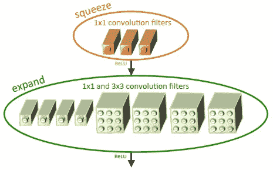
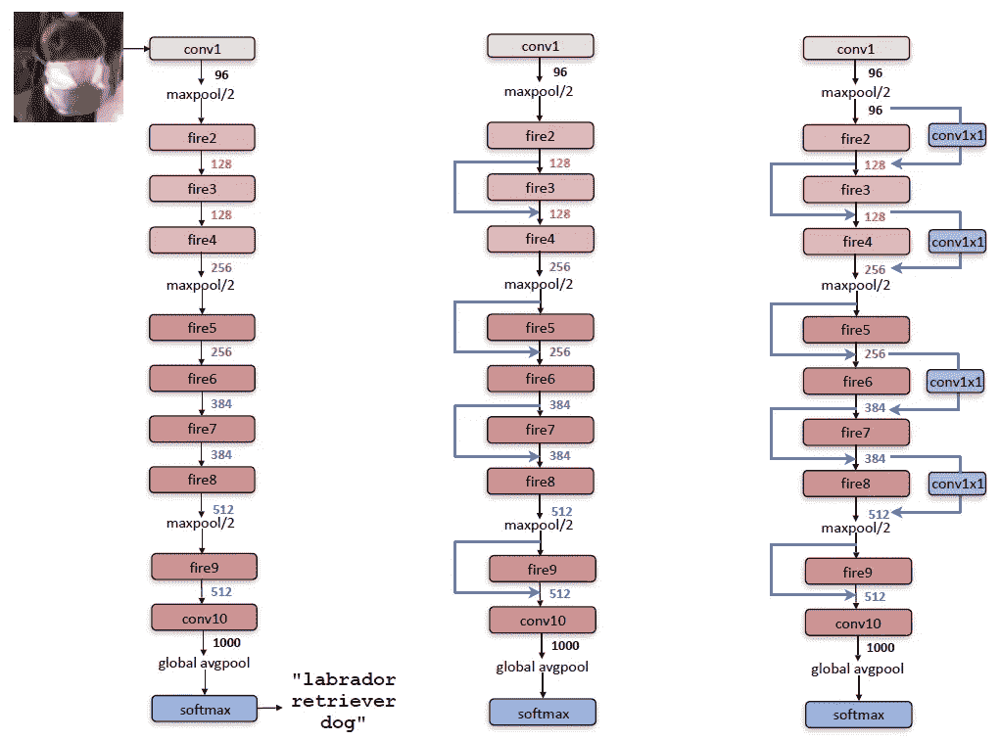
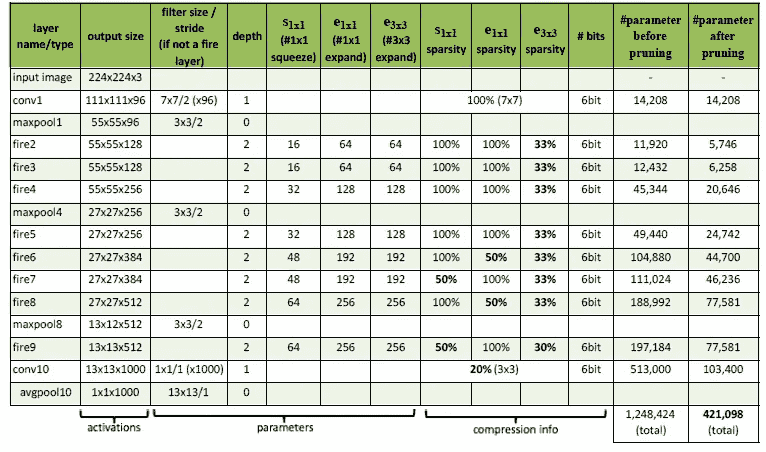
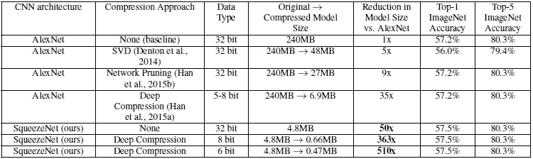
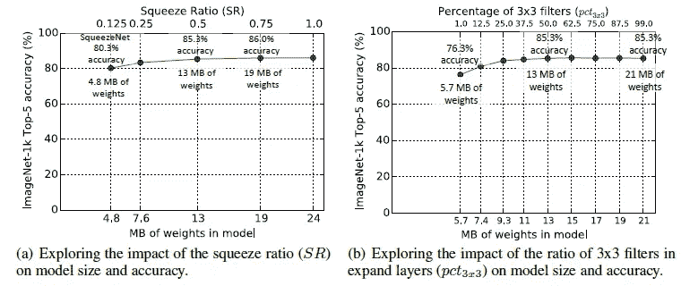
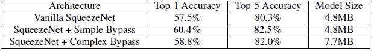

# 回顾:挤压网(图像分类)

> 原文：<https://towardsdatascience.com/review-squeezenet-image-classification-e7414825581a?source=collection_archive---------4----------------------->

## AlexNet 级精度，参数减少 50 倍

[**Jason Blackeye @jeisblack**](https://unsplash.com/@jeisblack) **(Unsplash)**

在这个故事里， **SqueezeNet** ，由 **DeepScale** 、 **UC Berkeley** 和 **Stanford University** 进行回顾。在精度相当的情况下，较小的 CNN 架构至少有三个优势

1.  较小的卷积神经网络(CNN)在分布式训练中需要**较少的跨服务器通信**。
2.  更小的 CNN 需要更少的带宽来从云端向自动驾驶汽车输出新的模型。
3.  较小的 CNN 更适合部署在 FPGAs 和其他内存有限的硬件上。

这是 2016 年关于 **arXiv** 的技术报告，引用超过 **1100 次**。( [Sik-Ho Tsang](https://medium.com/u/aff72a0c1243?source=post_page-----e7414825581a--------------------------------) @中)

# 概述

1.  **建筑设计策略**
2.  **消防模块**
3.  **SqueezeNet 架构**
4.  **对 SqueezeNet 的评估**

# **1。建筑设计策略**

## 策略一。用 1×1 过滤器替换 3×3 过滤器

*   给定一定数量卷积滤波器的预算，我们可以选择将大多数滤波器设为 1×1，**，因为 1×1 滤波器的参数比 3×3 滤波器少 9 倍**。

## 策略二。将输入通道的数量减少到 3 个**×3 个滤波器**

*   考虑一个完全由 3 个**×3 个滤镜组成的卷积层。该层中的参数总数为:**
*   (输入通道数) **×** (滤波器数) **×** (3 **×** 3)
*   我们可以**使用挤压层**将输入通道的数量减少到 3×3 滤波器，这将在下一节中提到。

## 策略三。在网络后期进行下采样，以便卷积图层具有较大的激活图

*   直觉是**大的激活图(由于延迟的下采样)可以导致更高的分类精度**。

## 摘要

*   策略 1 和 2 是关于明智地减少 CNN 中的参数数量，同时试图保持准确性。
*   策略 3 是在有限的参数预算下最大限度地提高精度。

# **2。消防模块**

**Fire Module with hyperparameters: s1x1 = 3, e1x1 = 4, and e3x3 = 4**

*   Fire 模块包括:**一个挤压卷积层(只有 1×1 个滤波器)，进入一个扩展层，该层混合了 1×1 和 3×3 个卷积滤波器**。
*   Fire 模块中有三个可调维度(超参数):s1×1、e1×1 和 e3×3。
*   s1×1:挤压层中 1×1 的个数。
*   e1×1 和 e3×3:膨胀层中 1×1 和 3×3 的数量。
*   当我们使用 Fire 模块时，我们将 s1×1 设置为小于(e1×1 + e3×3)，因此挤压层有助于限制 3×3 滤波器的输入通道数量，如前一节中的策略 2 所示。
*   对我来说，这很像《T2》的《盗梦空间》模块。

# 3. **SqueezeNet 架构**

**SqueezeNet (Left), SqueezeNet with simple bypass (Middle), SqueezeNet with complex bypass (Right)**

**Details of SqueezeNet Architecture**

*   **SqueezeNet(左)**:从一个独立的卷积层(conv1)开始，接着是 8 个 Fire 模块(Fire 2–9)，最后是一个 conv 层(conv10)。
*   从网络的起点到终点，每个消防模块的过滤器数量逐渐增加。
*   跨距为 2 的最大池在层 conv1、fire4、fire8 和 conv10 之后执行。
*   **带简单旁路的 SqueezeNet(中)和带复杂旁路的 SqueezeNet(右)**:旁路的使用灵感来自 [ResNet](/review-resnet-winner-of-ilsvrc-2015-image-classification-localization-detection-e39402bfa5d8) 。

# 4.**对 SqueezeNet 的评估**

## 4.1.SqueezeNet 与模型压缩方法的比较

**Comparing SqueezeNet to model compression approaches**

*   **与**[**Alex net**](https://medium.com/coinmonks/paper-review-of-alexnet-caffenet-winner-in-ilsvrc-2012-image-classification-b93598314160)**相比，使用 SqueezeNet，我们实现了 50 倍的模型尺寸缩减，同时满足或超过了**[**Alex net**](https://medium.com/coinmonks/paper-review-of-alexnet-caffenet-winner-in-ilsvrc-2012-image-classification-b93598314160)**的前 1 和前 5 精度。**
*   并且模型规模缩减远高于 SVD、网络剪枝和深度压缩。
*   应用 8 位量化的深度压缩，SqueezeNet 产生了一个 0.66 MB 的模型(比 32 位的 Alex net 小 363 倍)，其精度与 T2 的 Alex net 相当。此外，在 SqueezeNet 上应用 6 位量化和 33%稀疏度的深度压缩，这是一个 0.47MB 的模型(比 32 位 [AlexNet](https://medium.com/coinmonks/paper-review-of-alexnet-caffenet-winner-in-ilsvrc-2012-image-classification-b93598314160) 小 510 倍)，具有同等的精度。SqueezeNet 确实经得起压缩。

## 4.2.超参数

**Different Hyperparameter Values for SqueezeNet**

*   **挤压比(SR)(左)**:挤压层中的过滤器数量与膨胀层中的过滤器数量之比。
*   **将 SR 提高到 0.125 以上，可以进一步将 ImageNet top-5 的准确率从 4.8MB 模型的 80.3%(即**[**Alex net**](https://medium.com/coinmonks/paper-review-of-alexnet-caffenet-winner-in-ilsvrc-2012-image-classification-b93598314160)**-级)提高到 19MB 模型的 86.0%。**精度稳定在 86.0%，SR = 0.75(19MB 模型)，设置 SR=1.0 会进一步增加模型大小，但不会提高精度。
*   **3×3 过滤器的百分比(右)**:使用 50%的 3×3 过滤器时，前 5 名的精确度稳定在 85.6%，进一步增加 3×3 过滤器的百分比会导致更大的模型尺寸，但不会提高 ImageNet 的精确度。

## 4.3.挤压网变体

**SqueezeNet accuracy and model size using different macroarchitecture configurations**

*   复杂和简单的旁路连接都比普通的 SqueezeNet 架构有了更高的精度。
*   **有趣的是，简单旁路比复杂旁路能够实现更高的准确度。**
*   在不增加模型尺寸的情况下，增加简单的旁路连接使前 1 名精度提高了 2.9 个百分点，前 5 名精度提高了 2.2 个百分点。

使用 Fire 模块，可以在保持预测精度的同时减小模型尺寸。

## 参考

【2016 arXiv】【SqueezeNet】
[SqueezeNet:Alex net 级别的精度，参数少 50 倍，< 0.5MB 模型大小](https://arxiv.org/abs/1602.07360)

## 我以前的评论

)(我)(们)(都)(不)(想)(到)(这)(些)(人)(,)(我)(们)(都)(不)(想)(要)(到)(这)(些)(人)(,)(但)(是)(这)(些)(人)(还)(不)(想)(到)(这)(些)(人)(,)(我)(们)(还)(没)(想)(到)(这)(些)(事)(,)(我)(们)(就)(想)(到)(了)(这)(些)(人)(们)(,)(我)(们)(们)(都)(不)(想)(要)(到)(这)(些)(人)(,)(但)(我)(们)(还)(没)(想)(到)(这)(些)(事)(,)(我)(们)(还)(没)(想)(想)(到)(这)(些)(事)(,)(我)(们)(还)(没)(想)(到)(这)(里)(去)(。 )(他)(们)(都)(不)(在)(这)(些)(事)(上)(,)(她)(们)(还)(不)(在)(这)(些)(事)(上)(有)(什)(么)(情)(况)(呢)(?)(她)(们)(都)(不)(在)(这)(些)(情)(况)(下)(,)(她)(们)(还)(不)(在)(这)(些)(事)(上)(有)(什)(么)(情)(况)(吗)(?)(她)(们)(们)(都)(不)(在)(这)(些)(事)(上)(,)(她)(们)(们)(还)(不)(在)(这)(些)(事)(上)(,)(她)(们)(们)(还)(没)(有)(什)(么)(好)(的)(情)(情)(感)(。

**物体检测** [过食](https://medium.com/coinmonks/review-of-overfeat-winner-of-ilsvrc-2013-localization-task-object-detection-a6f8b9044754)[R-CNN](https://medium.com/coinmonks/review-r-cnn-object-detection-b476aba290d1)[快 R-CNN](https://medium.com/coinmonks/review-fast-r-cnn-object-detection-a82e172e87ba)[快 R-CNN](/review-faster-r-cnn-object-detection-f5685cb30202)[MR-CNN&S-CNN](/review-mr-cnn-s-cnn-multi-region-semantic-aware-cnns-object-detection-3bd4e5648fde)[DeepID-Net](/review-deepid-net-def-pooling-layer-object-detection-f72486f1a0f6)[CRAFT](/review-craft-cascade-region-proposal-network-and-fast-r-cnn-object-detection-2ce987361858)[R-FCN](/review-r-fcn-positive-sensitive-score-maps-object-detection-91cd2389345c)】 [[G-RMI](/review-g-rmi-winner-in-2016-coco-detection-object-detection-af3f2eaf87e4)][[TDM](https://medium.com/datadriveninvestor/review-tdm-top-down-modulation-object-detection-3f0efe9e0151)][[SSD](/review-ssd-single-shot-detector-object-detection-851a94607d11)][[DSSD](/review-dssd-deconvolutional-single-shot-detector-object-detection-d4821a2bbeb5)][[约洛夫 1](/yolov1-you-only-look-once-object-detection-e1f3ffec8a89) ] [ [约洛夫 2 /约洛 9000](/review-yolov2-yolo9000-you-only-look-once-object-detection-7883d2b02a65) ] [ [约洛夫 3](/review-yolov3-you-only-look-once-object-detection-eab75d7a1ba6)[[FPN](/review-fpn-feature-pyramid-network-object-detection-262fc7482610)[[视网膜网](/review-retinanet-focal-loss-object-detection-38fba6afabe4)[[DCN](/review-dcn-deformable-convolutional-networks-2nd-runner-up-in-2017-coco-detection-object-14e488efce44)

**语义切分** [FCN](/review-fcn-semantic-segmentation-eb8c9b50d2d1)[de convnet](/review-deconvnet-unpooling-layer-semantic-segmentation-55cf8a6e380e)[deeplabv 1&deeplabv 2](/review-deeplabv1-deeplabv2-atrous-convolution-semantic-segmentation-b51c5fbde92d)[CRF-RNN](/review-crf-rnn-conditional-random-fields-as-recurrent-neural-networks-semantic-segmentation-a11eb6e40c8c)】[SegNet](/review-segnet-semantic-segmentation-e66f2e30fb96)】[parse net](https://medium.com/datadriveninvestor/review-parsenet-looking-wider-to-see-better-semantic-segmentation-aa6b6a380990)[dilated net](/review-dilated-convolution-semantic-segmentation-9d5a5bd768f5)[DRN](/review-drn-dilated-residual-networks-image-classification-semantic-segmentation-d527e1a8fb5)[RefineNet](/review-refinenet-multi-path-refinement-network-semantic-segmentation-5763d9da47c1)

**生物医学图像分割** [[cumed vision 1](https://medium.com/datadriveninvestor/review-cumedvision1-fully-convolutional-network-biomedical-image-segmentation-5434280d6e6)][[cumed vision 2/DCAN](https://medium.com/datadriveninvestor/review-cumedvision2-dcan-winner-of-2015-miccai-gland-segmentation-challenge-contest-biomedical-878b5a443560)][[U-Net](/review-u-net-biomedical-image-segmentation-d02bf06ca760)][[CFS-FCN](https://medium.com/datadriveninvestor/review-cfs-fcn-biomedical-image-segmentation-ae4c9c75bea6)][[U-Net+ResNet](https://medium.com/datadriveninvestor/review-u-net-resnet-the-importance-of-long-short-skip-connections-biomedical-image-ccbf8061ff43)][[多通道](/review-multichannel-segment-colon-histology-images-biomedical-image-segmentation-d7e57902fbfc)][[V-Net](/review-v-net-volumetric-convolution-biomedical-image-segmentation-aa15dbaea974)][[3D U-Net](/review-3d-u-net-volumetric-segmentation-medical-image-segmentation-8b592560fac1)][[M FCN](/review-m²fcn-multi-stage-multi-recursive-input-fully-convolutional-networks-biomedical-image-4f8d5e3f07f1) 

**实例分割** [ [SDS](https://medium.com/datadriveninvestor/review-sds-simultaneous-detection-and-segmentation-instance-segmentation-80b2a8ce842b) ] [ [超列](/review-hypercolumn-instance-segmentation-367180495979) ] [ [深度掩码](/review-deepmask-instance-segmentation-30327a072339) ] [ [锐度掩码](/review-sharpmask-instance-segmentation-6509f7401a61) ] [ [多路径网络](/review-multipath-mpn-1st-runner-up-in-2015-coco-detection-segmentation-object-detection-ea9741e7c413) ] [ [MNC](/review-mnc-multi-task-network-cascade-winner-in-2015-coco-segmentation-instance-segmentation-42a9334e6a34) ] [ [实例中心](/review-instancefcn-instance-sensitive-score-maps-instance-segmentation-dbfe67d4ee92) ] [ [FCIS](/review-fcis-winner-in-2016-coco-segmentation-instance-segmentation-ee2d61f465e2)

)(我)(们)(都)(不)(知)(道)(,)(我)(们)(还)(是)(不)(知)(道)(,)(我)(们)(还)(是)(不)(知)(道)(,)(我)(们)(还)(是)(不)(知)(道)(,)(我)(们)(还)(是)(不)(知)(道)(,)(我)(们)(还)(是)(不)(知)(道)(,)(我)(们)(还)(是)(不)(知)(道)(,)(我)(们)(还)(是)(不)(知)(道)(。

 **[【DeepPose】](/review-deeppose-cascade-of-cnn-human-pose-estimation-cf3170103e36)[【汤普森 NIPS'14】](/review-tompson-nips14-joint-training-of-cnn-and-graphical-model-human-pose-estimation-95016bc510c)[【汤普森 CVPR'15】](/review-tompson-cvpr15-spatial-dropout-human-pose-estimation-c7d6a5cecd8c)**