# 回顾:SRDenseNet —用于 SR 的 DenseNet(超分辨率)

> 原文：<https://towardsdatascience.com/review-srdensenet-densenet-for-sr-super-resolution-cbee599de7e8?source=collection_archive---------14----------------------->

## 带跳跃连接的 DenseNet 块优于 SRCNN、VDSR 和 DRCN

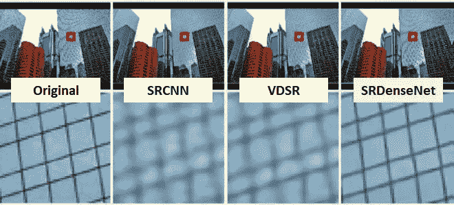

**SRDenseNet has much better quality**

在这个故事里，**帝国视觉科技**的 **SRDenseNet** 在**福洲中国**进行了回顾。在 SRDenseNet 中， [DenseNet](/review-densenet-image-classification-b6631a8ef803) 建议的密集块用于提取高层特征。此外，在密集块之间增加了跳跃连接。瓶颈层和解卷积层用于在重构高分辨率(HR)图像之前进行放大。发表在 **2017 ICCV** 上，引用 **70 余次**。( [Sik-Ho Tsang](https://medium.com/u/aff72a0c1243?source=post_page-----cbee599de7e8--------------------------------) @中)

1.  **密集块**
2.  **SRDenseNet 变体**
3.  **反褶积、瓶颈层和重建层**
4.  **消融研究**
5.  **结果**

# **1。密集块**

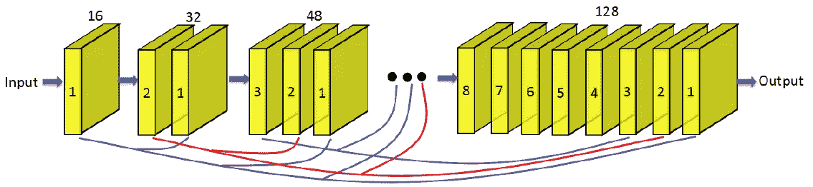

**Dense Block (The paths at the bottom are copied from previous layers to deeper layers.**

## 1.1.串联而不是求和

*   与 [ResNet](/review-resnet-winner-of-ilsvrc-2015-image-classification-localization-detection-e39402bfa5d8) ，**不同的是，特征图在**[**dense net**](/review-densenet-image-classification-b6631a8ef803)**中串接，而不是直接求和。**
*   因此，第 *i* 层接收所有前面层的特征图作为输入:

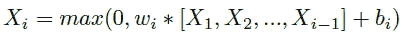

*   其中[ *X* 1， *X* 2，…，*Xi*1]表示在前面的卷积层 1，2，…，*I*1 中生成的特征图的连接。
*   这种 [DenseNet](/review-densenet-image-classification-b6631a8ef803) 结构缓解了消失梯度问题。
*   重用已经学习过的特征地图迫使当前层学习补充信息，从而避免学习冗余特征。
*   此外，在所提出的网络中，每一层都有一条通向损耗的短路径，从而导致隐含的深度监督。

## 1.2.增长率

*   本次工作在一个致密区块中有 **8 个褶积层。**
*   **当密集块中每个卷积层产生 *k 个*特征图作为输出时，一个** [**密集块**](/review-densenet-image-classification-b6631a8ef803) **产生的特征图总数为 *k* ×8** ，其中 *k* 称为**增长率**。
*   **增长率 *k* 调节每层对最终重建贡献多少新信息。**
*   在上图中，**每个块由 8 个卷积层**组成。为了防止网络增长过宽，**增长率设置为 16** 和**每个块的输出有 128 个特征图**。

# **2。SRDenseNet 变体**

## 2.1.SRDenseNet_H

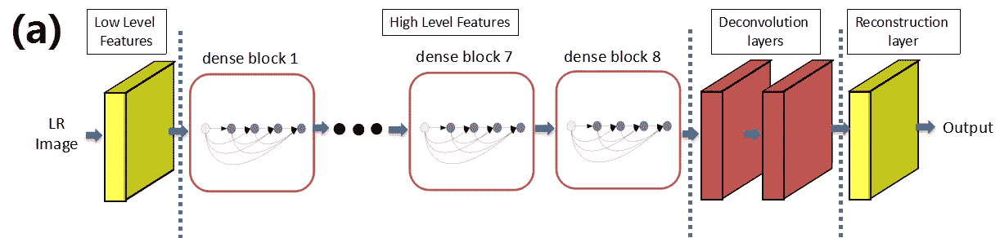

**SRDenseNet_H**

*   这是基本的 SRDenseNet。
*   8 个密集块用于提取高级特征。

## 2.2.SRDenseNet_HL

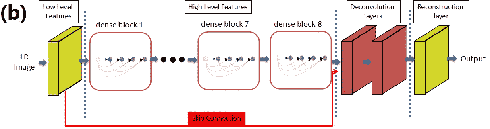

**SRDenseNet_HL**

*   **跳过连接**用于连接低级和高级特征。
*   然后，连接的要素地图将用作反卷积图层的输入。

## 2.3.SRDenseNet_All

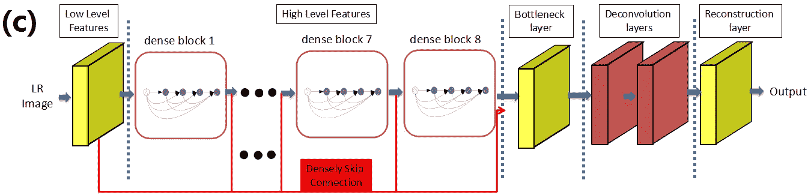

**SRDenseNet_All**

*   **密集跳过连接**用于组合所有卷积层产生的特征图，用于 SR 重建。
*   **反褶积层前还增加了**瓶颈层。
*   SRDenseNet_All 有 **69 个重量层**和 68 个激活层。
*   **感受野的大小与深度成正比，可以利用 LR 图像中的大量上下文信息来推断 HR 图像中的高频信息**。
*   **由于使用了许多 ReLU 层，可以在非常深的网络中利用高度非线性**来模拟 LR 图像和 HR 图像之间的复杂映射函数。

# **3。反卷积、瓶颈和重建层**

## 3.1.瓶颈层

*   网络中的所有要素地图连接在 SRDenseNet_All 中，为后续反卷积图层生成许多输入。
*   **具有 1×1 内核的卷积层被用作瓶颈层**以减少输入特征图的数量。
*   使用 1×1 瓶颈层，特征地图的数量减少到 256 个。
*   之后，去卷积层将 256 个特征图从 LR 空间变换到 HR 空间。

## 3.2.去卷积层

*   在 [SRCNN](https://medium.com/coinmonks/review-srcnn-super-resolution-3cb3a4f67a7c) 和 [VDSR](/review-vdsr-super-resolution-f8050d49362f) 中，双三次插值用于在卷积之前将低分辨率(LR)图像提升到 HR 空间。
*   所有卷积都在 HR 空间中进行，这增加了 SR 的计算复杂度。
*   此外，插值方法没有为解决随机共振问题带来新的信息。
*   因此，在卷积之后，使用去卷积层来学习放大滤波器。有两个好处。
*   首先，**它加速了 SR 重建过程。**在网络末端增加反褶积层后，整个计算过程在 LR 空间进行。如果放大因子是 *r* ，那么它将减少因子 *r* 的计算成本。
*   此外，**来自 LR 图像的大量上下文信息用于推断高频细节**。
*   在这项工作中，**两个连续的 3×3 内核的反褶积层**和 **256 个特征图**用于向上扩展。

## 3.3.重建层

*   重建层**是一个 3×3 核**和**一路输出**的卷积层。

# 4.消融研究

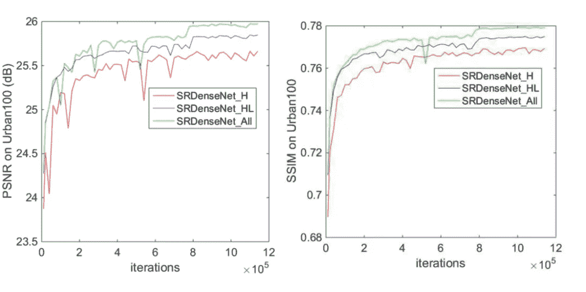

**PSNR/SSIM on Urban100**

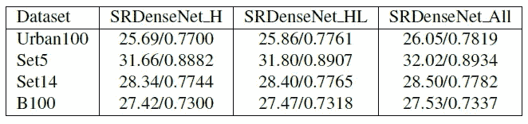

**PSNR/SSIM on 4 Datasets**

*   从 ImageNet 中随机选择 50，000 幅图像用于训练。
*   在 HR 空间中裁剪尺寸为 100×100 的非重叠子图像。LR 图像是通过使用比例因子为 4 倍的双三次曲线对 HR 图像进行下采样而获得的。只有 Y 通道用于训练。
*   ReLU 用于所有权重层，并使用 Adam 优化器。
*   使用 32 的小批量。
*   在测试过程中，数据集 **Set5，Set14** ， **B100，**来自 Berkeley 分割数据集，由 **100 幅自然图像**， **Urban100** 组成，其中包含 **100 幅挑战图像**。
*   测试了 LR 和 HR 图像之间的 4 倍比例因子。
*   PSNR 和 SSIM 是在图像的 Y 通道上计算的。
*   用的是英伟达 Titan X GPU。
*   SRDenseNet_All 在 SRDenseNet 变体中具有最高的 PSNR 和 SSIM。

# 5.结果

## **5.1。定量结果**

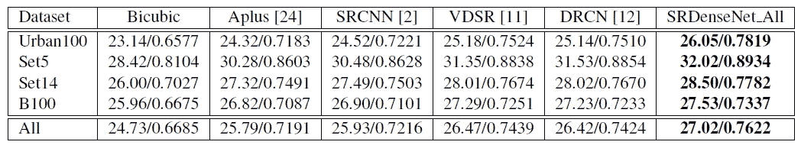

**PSNR/SSIM on 4 Datasets**

*   对于 [SRCNN](https://medium.com/coinmonks/review-srcnn-super-resolution-3cb3a4f67a7c) ，使用最佳 9–5–5 图像模型。
*   至于 A+方法，它没有预测图像边界。为了公平比较，HR 图像的边界被裁剪，以便所有结果具有相同的区域。
*   就 PSNR 而言，所提出的方法在不同的数据集上比最新的结果实现了 0.2dB-0.8dB 的改善。
*   平均起来，**比具有 3 层的**[**SRCNN**](https://medium.com/coinmonks/review-srcnn-super-resolution-3cb3a4f67a7c)**提高了大约 1.0 dB，比具有 20 层的[**【VDSR】**](/review-vdsr-super-resolution-f8050d49362f)**提高了大约 0.5 dB。****
*   ****所有方法中最显著的改进，包括 [SRCNN](https://medium.com/coinmonks/review-srcnn-super-resolution-3cb3a4f67a7c) 、 [VDSR](/review-vdsr-super-resolution-f8050d49362f) 和 [DRCN](https://medium.com/datadriveninvestor/review-drcn-deeply-recursive-convolutional-network-super-resolution-f0a380f79b20) ，都是在极具挑战性的数据集 Urban100 上获得的。****

## ****5.2.定性结果****

****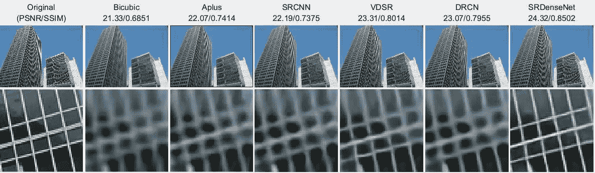****

******Urban100 img096******

****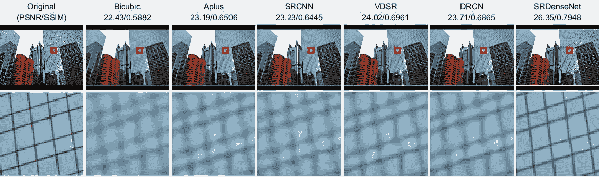****

******Urban100 img099******

****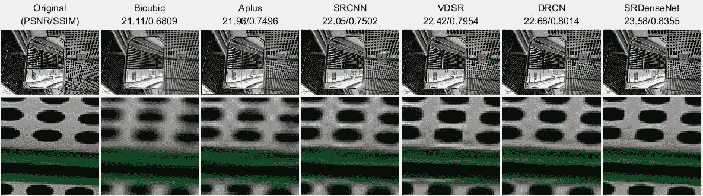****

******Urban100 img004******

********

******B100 148026******

****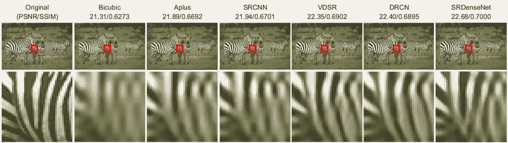****

******B100 253027******

****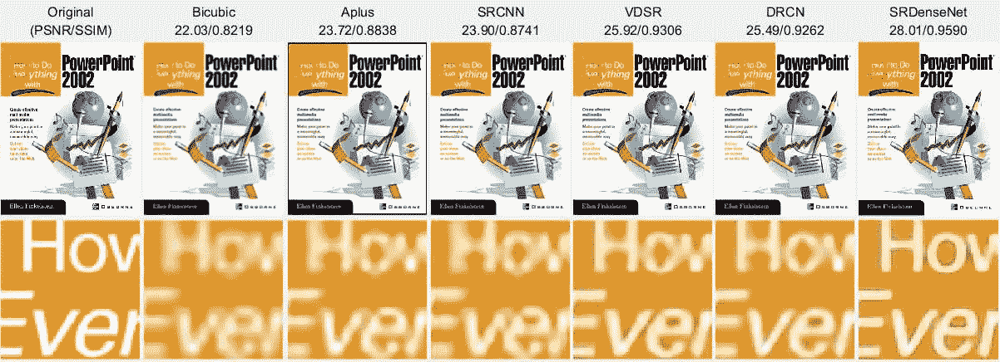****

******Set14 ppt3******

*   ****对于 Urban100 上的上述图像，SRDenseNet 可以很好地重建线条和轮廓，而其他方法会产生模糊的结果。****
*   ****对于 B100 和 Set14 上的上述图像，SRDenseNet 可以重建纹理图案并避免失真。****
*   ******在 Titan X GPU 上实现超分辨 **B100** 的平均速度为 36ms** ，达到 4 倍缩放因子的实时 SR。****

**最后，作者提到，目前的研究趋势是研究 SR 问题的感知损失，如 SRGAN，它“伪造”纹理，使其具有更好的人眼感知质量，尽管 PSNR 较低。他们也会对此进行调查。**

## **参考**

**【2017 ICCV】【SRDenseNet】
[使用密集跳跃连接的图像超分辨率](http://openaccess.thecvf.com/content_ICCV_2017/papers/Tong_Image_Super-Resolution_Using_ICCV_2017_paper.pdf)**

## **我以前的评论**

**)(我)(们)(都)(不)(想)(到)(这)(些)(人)(,)(我)(们)(都)(不)(想)(要)(到)(这)(些)(人)(,)(但)(是)(这)(些)(人)(还)(不)(想)(到)(这)(些)(人)(,)(我)(们)(还)(没)(想)(到)(这)(些)(事)(,)(我)(们)(就)(想)(到)(了)(这)(些)(人)(们)(,)(我)(们)(们)(都)(不)(想)(要)(到)(这)(些)(人)(,)(但)(我)(们)(还)(没)(想)(到)(这)(些)(事)(,)(我)(们)(还)(没)(想)(想)(到)(这)(些)(事)(,)(我)(们)(还)(没)(想)(到)(这)(里)(去)(。 )(他)(们)(都)(不)(在)(这)(些)(事)(上)(,)(她)(们)(还)(不)(在)(这)(些)(事)(上)(有)(什)(么)(情)(况)(呢)(?)(她)(们)(都)(不)(在)(这)(些)(情)(况)(下)(,)(她)(们)(还)(是)(不)(在)(这)(些)(事)(上)(有)(什)(么)(情)(况)(吗)(?)(她)(们)(都)(不)(在)(这)(些)(事)(上)(,)(她)(们)(们)(还)(不)(在)(这)(些)(事)(上)(,)(她)(们)(们)(还)(不)(在)(这)(些)(事)(上)(有)(什)(么)(好)(的)(情)(情)(情)(况)(。**

****物体检测** [过食](https://medium.com/coinmonks/review-of-overfeat-winner-of-ilsvrc-2013-localization-task-object-detection-a6f8b9044754)[R-CNN](https://medium.com/coinmonks/review-r-cnn-object-detection-b476aba290d1)[快 R-CNN](https://medium.com/coinmonks/review-fast-r-cnn-object-detection-a82e172e87ba)[快 R-CNN](/review-faster-r-cnn-object-detection-f5685cb30202)[DeepID-Net](/review-deepid-net-def-pooling-layer-object-detection-f72486f1a0f6)】[CRAFT](/review-craft-cascade-region-proposal-network-and-fast-r-cnn-object-detection-2ce987361858)[R-FCN](/review-r-fcn-positive-sensitive-score-maps-object-detection-91cd2389345c)[ION](/review-ion-inside-outside-net-2nd-runner-up-in-2015-coco-detection-object-detection-da19993f4766)[multipath Net](/review-multipath-mpn-1st-runner-up-in-2015-coco-detection-segmentation-object-detection-ea9741e7c413)【T21 [ [约洛夫 1](/yolov1-you-only-look-once-object-detection-e1f3ffec8a89) ] [ [约洛夫 2 /约洛 9000](/review-yolov2-yolo9000-you-only-look-once-object-detection-7883d2b02a65) ] [ [约洛夫 3](/review-yolov3-you-only-look-once-object-detection-eab75d7a1ba6) ] [ [FPN](/review-fpn-feature-pyramid-network-object-detection-262fc7482610) ] [ [视网膜网](/review-retinanet-focal-loss-object-detection-38fba6afabe4) ] [ [DCN](/review-dcn-deformable-convolutional-networks-2nd-runner-up-in-2017-coco-detection-object-14e488efce44) ]**

****语义切分** [FCN](/review-fcn-semantic-segmentation-eb8c9b50d2d1)[de convnet](/review-deconvnet-unpooling-layer-semantic-segmentation-55cf8a6e380e)[deeplab v1&deeplab v2](/review-deeplabv1-deeplabv2-atrous-convolution-semantic-segmentation-b51c5fbde92d)[SegNet](/review-segnet-semantic-segmentation-e66f2e30fb96)】【parse net[dilated net](/review-dilated-convolution-semantic-segmentation-9d5a5bd768f5)[PSP net](/review-pspnet-winner-in-ilsvrc-2016-semantic-segmentation-scene-parsing-e089e5df177d)[deeplab v3](/review-deeplabv3-atrous-convolution-semantic-segmentation-6d818bfd1d74)[DRN](/review-drn-dilated-residual-networks-image-classification-semantic-segmentation-d527e1a8fb5)**

****生物医学图像分割** [cumed vision 1](https://medium.com/datadriveninvestor/review-cumedvision1-fully-convolutional-network-biomedical-image-segmentation-5434280d6e6)[cumed vision 2/DCAN](https://medium.com/datadriveninvestor/review-cumedvision2-dcan-winner-of-2015-miccai-gland-segmentation-challenge-contest-biomedical-878b5a443560)[U-Net](/review-u-net-biomedical-image-segmentation-d02bf06ca760)[CFS-FCN](https://medium.com/datadriveninvestor/review-cfs-fcn-biomedical-image-segmentation-ae4c9c75bea6)[U-Net+ResNet](https://medium.com/datadriveninvestor/review-u-net-resnet-the-importance-of-long-short-skip-connections-biomedical-image-ccbf8061ff43)[多通道](/review-multichannel-segment-colon-histology-images-biomedical-image-segmentation-d7e57902fbfc)**

****实例分段** [DeepMask](/review-deepmask-instance-segmentation-30327a072339) [SharpMask](/review-sharpmask-instance-segmentation-6509f7401a61) [MultiPathNet](/review-multipath-mpn-1st-runner-up-in-2015-coco-detection-segmentation-object-detection-ea9741e7c413) [MNC](/review-mnc-multi-task-network-cascade-winner-in-2015-coco-segmentation-instance-segmentation-42a9334e6a34) [InstanceFCN](/review-instancefcn-instance-sensitive-score-maps-instance-segmentation-dbfe67d4ee92) [FCIS](/review-fcis-winner-in-2016-coco-segmentation-instance-segmentation-ee2d61f465e2) 】**

**)(我)(们)(都)(不)(知)(道)(,)(我)(们)(还)(是)(不)(知)(道)(,)(我)(们)(还)(是)(不)(知)(道)(,)(我)(们)(还)(是)(不)(知)(道)(,)(我)(们)(还)(是)(不)(知)(道)(,)(我)(们)(还)(是)(不)(知)(道)(,)(我)(们)(还)(是)(不)(知)(道)(。**