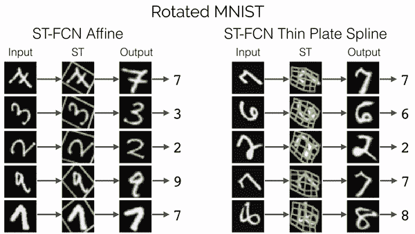
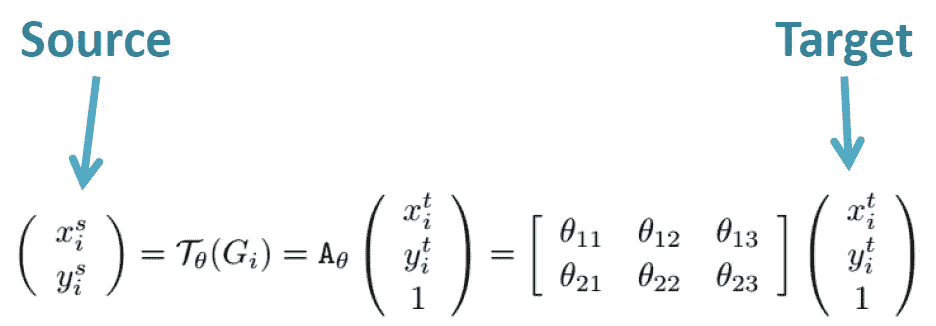
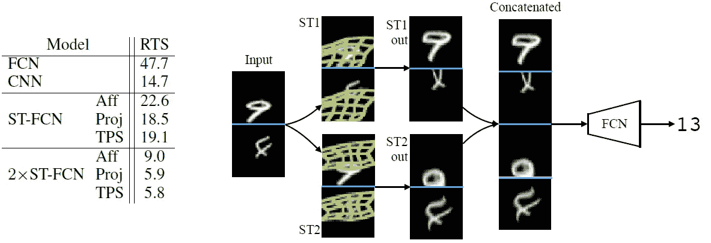
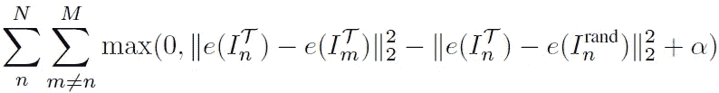

# 复习:STN —空间变换网络(图像分类)

> 原文：<https://towardsdatascience.com/review-stn-spatial-transformer-network-image-classification-d3cbd98a70aa?source=collection_archive---------4----------------------->

## 使用 STN，网络内的空间转换数据，学习对平移、缩放、旋转和更一般的扭曲的不变性。

在这个故事中， **Google DeepMind** 的**空间转换网络(STN)** 做了简要回顾。STN 有助于剔除适当的区域并对其进行尺度归一化，这可以简化后续的分类任务并带来更好的分类性能，如下所示:

**(a) Input Image with Random Translation, Scale, Rotation, and Clutter, (b) STN Applied to Input Image, (c) Output of STN, (d) Classification Prediction**

它发表在 **2015 NIPS** 上，被引用超过 **1300 次**。诸如仿射变换和单应配准的空间变换已经研究了几十年。但在本文中，空间变换是用神经网络来处理的。对于基于学习的空间变换，根据输入或要素地图应用变换。并且与另一篇名为“[可变形卷积网络](https://arxiv.org/abs/1703.06211)”(2017 ICCV)的论文高度相关。因此，我决定先读这本书。( [Sik-Ho Tsang](https://medium.com/u/aff72a0c1243?source=post_page-----d3cbd98a70aa--------------------------------) @中)

# 概述

1.  **快速回顾空间变换矩阵**
2.  **空间变压器网络**
3.  **采样内核**
4.  **实验结果**
5.  **其他一些任务**

# **1。快速回顾空间变换矩阵**

STN 在论文中主要学习了 3 种变换。事实上，也可以应用更复杂的变换。

## 1.1 仿射变换

**Affine Transform**

*   根据矩阵中的值，我们可以用不同的效果将(X1，Y1)变换为(X2，Y2)，如下所示:

**Translation, Scaling, Rotation, and Shearing**

*   如果有兴趣，请谷歌“**注册**”、“**单应矩阵**”，或者“**仿射变换**”。

## 1.2 射影变换

*   投影变换也可以在 STN 中学习，如下所示:

**Projective Transformation**

## 1.3.薄板样条(TPS)变换

**Thin Plate Spline (TPS) Transformation**

**An example**

*   对于 TPS 改造来说，相对于前两次改造更为复杂。(之前学过仿射和射影映射，关于 TPS 没接触过，如有错误，请告知。)
*   简而言之，假设我们在不同于输入点(xi，易)的位置有一个点(x，y)，我们使用右边的等式基于偏差、x 和 y 的加权和以及(x，y)和(xi，易)之间的距离函数来变换该点。(这里一个**径向基函数 RBF** 。)
*   所以如果我们用 TPS，网络需要学习 a0，a1，a2，b0，b1，b2，Fi，Gi，这是 6+2N 个数的参数。
*   正如我们所看到的，TPS 可以实现更灵活或更高自由度的变形或转换。

# **2。空间变压器网络**

**Affine Transformation**

*   STN 由**定位网**、**网格生成器**和**采样器**组成。

## **2.1。本地化网络**

*   用**输入特征图*U*，用 *W* ，高度 *H* 和 *C* 通道，**输出为*θ*，变换的参数 *Tθ* 。它可以被学习为如上的仿射变换。或者更受约束，例如用于注意力的，其仅包含缩放和平移，如下:****

**Only scaling and translation**

## 2.2.电网发电机

*   假设我们有一个规则的网格 G，这个 G 是目标坐标为**(XT _ I，yt_i)** 的点的集合。
*   然后我们**对 G** 应用变换 *Tθ* ，即 *Tθ* ( *G* )。
*   在 *Tθ* ( *G* 之后，输出一组带有**目的坐标(xt_i，yt_i)的点**。这些点已根据变换参数进行了更改。它可以是平移、缩放、旋转或更一般的扭曲，这取决于我们如何如上所述设置 *θ* 。

## 2.3.取样器

**(a) Identity Transformation, (b) Affine Transformation**

*   **基于新的一组坐标(xt_i，yt_i)，我们生成变换后的输出特征图 *V*** 。这个 *V* 被平移、缩放、旋转、扭曲、投影变换或仿射，无论什么。
*   注意，STN 不仅可以应用于输入图像，还可以应用于中间特征图。

# 3.采样内核

*   正如我们在上面的例子中看到的，如果我们需要对一个变换的网格进行采样，我们会遇到采样问题，我们如何对这些子像素位置进行采样取决于我们将要使用的采样核。
*   **通用格式**:

*   **整数采样内核**(四舍五入到最接近的整数):

*   **双线性采样内核**:

*   这是一种(次)可微的采样机制，因此便于反向传播:

# **4。实验结果**

## 4.1.扭曲的 MNIST

**Errors of distorted MNIST datasets (Left), Some examples that are failed in CNN but successfully classified in STN (Right)**

*   **应用的扭曲** : **TC** :平移和杂乱， **R** :旋转， **RTS** :旋转、平移和缩放， **P** :投影扭曲， **E** :弹性扭曲。
*   **空间变换** : **Aff** :仿射变换， **Proj** :射影变换， **TPS** :薄板样条变换。
*   **FCN** :这里的 FCN 是指**没有卷积的全连接网络**(这里不是全卷积网络。)
*   正如我们所见，圣 FCN 胜过 FCN，圣 CNN 胜过 CNN。
*   ST-CNN 在各方面都比 ST-FCN 好。

## 4.2.街景门牌号码

**Errors of SVHN datasets (Left), Some examples use in ST-CNN (Right)**

*   **ST-CNN 单个**:网络开头只有一个 ST。
*   **ST-CNN Multi** :每个 conv 前一个 ST。
*   这里使用仿射变换。
*   同样，ST-CNN 也胜过 Maxout 和 CNN。(我在 [NoC](https://medium.com/datadriveninvestor/review-noc-winner-in-2015-coco-ilsvrc-detection-object-detection-d5cc84e372a) 里有一个非常简单的关于 Maxout 的介绍，有兴趣的可以看看。)
*   和 ST-CNN 多优于 ST-CNN 单一一点。

## 4.3.精细分类

**Fine-Grained Bird Classification. Accuracy(left), 2×ST-CNN (Top Right Row), 4×ST-CNN (Bottom Right Row)**

*   这里，ImageNet 预训练的 [Inception-v2](https://medium.com/@sh.tsang/review-batch-normalization-inception-v2-bn-inception-the-2nd-to-surpass-human-level-18e2d0f56651) 被用作对 200 个物种进行分类的主干，具有 82.3%的准确率。
*   **2/4×ST-CNN** : 2/4 **平行** STs，精度更高。
*   有趣的是，其中一只(红色)学会了头部探测器，而另外三只(绿色)学会了鸟身体的中心部分。

# 5.一些其他任务

## 5.1.MNIST 加成

**MNIST Addition**

*   有趣的是，虽然每个 ST 也接收两个输入数字，但是每个 ST 都学习转换每个数字。

## 5.2.协同定位

**Co-localisation**

*   **三重损失**:铰链损失用于强制 ST 的两个输出之间的距离小于到随机作物的距离，希望鼓励空间转换器定位公共对象。

## 5.3.高维变压器

*   STN 还可以扩展为 **3D 仿射变换**。

不同的数据集有不同的网络架构和设置。如果你想了解细节，最好去看看报纸。接下来我大概会回顾一下关于[可变形卷积网络](https://arxiv.org/abs/1703.06211)。

## 参考

【2015 NIPS】【ST】
[空间变压器网络](https://arxiv.org/abs/1506.02025)

## 我的相关评论

)(我)(们)(都)(不)(想)(到)(这)(些)(人)(,)(我)(们)(都)(不)(想)(要)(到)(这)(些)(人)(,)(但)(是)(这)(些)(人)(还)(不)(想)(到)(这)(些)(人)(,)(我)(们)(还)(没)(想)(到)(这)(些)(事)(,)(我)(们)(就)(想)(到)(了)(这)(些)(人)(们)(,)(我)(们)(们)(都)(不)(想)(要)(到)(这)(些)(人)(,)(但)(我)(们)(还)(没)(想)(到)(这)(些)(事)(,)(我)(们)(还)(没)(想)(到)(这)(里)(来)(。 )(他)(们)(都)(不)(是)(真)(实)(实)(实)(实)(实)(实)(实)(实)(实)(实)(实)(实)(实)(实)(实)(实)(实)(实)(实)(实)(实)(实)(实)(实)(实)(实)(实)(实)(实)(实)(实)(实)(实)(实)(实)(实)(实)(实)(实)(实)(实)(实)(实)(实)(实)(实)(实)(实)(实)(实)(实)(实)(实)(实)(实)(实)(实)(实)(实)(实)(实)(实)(实)(实)(实)(实)(实)(实)(实)(实)(实)(实)(实)(实)(实)(实)(实)(实)(实)(实)(实)(实)(实)(实)(实)(实)(实)(实)(实)(实)(实)(实)(实)(

**物体检测** [过食](https://medium.com/coinmonks/review-of-overfeat-winner-of-ilsvrc-2013-localization-task-object-detection-a6f8b9044754)[R-CNN](https://medium.com/coinmonks/review-r-cnn-object-detection-b476aba290d1)[快 R-CNN](https://medium.com/coinmonks/review-fast-r-cnn-object-detection-a82e172e87ba)[快 R-CNN](/review-faster-r-cnn-object-detection-f5685cb30202)[DeepID-Net](/review-deepid-net-def-pooling-layer-object-detection-f72486f1a0f6)】[R-FCN](/review-r-fcn-positive-sensitive-score-maps-object-detection-91cd2389345c)】[离子](/review-ion-inside-outside-net-2nd-runner-up-in-2015-coco-detection-object-detection-da19993f4766)[多路径网](/review-multipath-mpn-1st-runner-up-in-2015-coco-detection-segmentation-object-detection-ea9741e7c413)[NoC](https://medium.com/datadriveninvestor/review-noc-winner-in-2015-coco-ilsvrc-detection-object-detection-d5cc84e372a)

**语义切分** [FCN](/review-fcn-semantic-segmentation-eb8c9b50d2d1)[de convnet](/review-deconvnet-unpooling-layer-semantic-segmentation-55cf8a6e380e)[deeplab v1&deeplab v2](/review-deeplabv1-deeplabv2-atrous-convolution-semantic-segmentation-b51c5fbde92d)[parse net](https://medium.com/datadriveninvestor/review-parsenet-looking-wider-to-see-better-semantic-segmentation-aa6b6a380990)】[dilated net](/review-dilated-convolution-semantic-segmentation-9d5a5bd768f5)[PSP net](/review-pspnet-winner-in-ilsvrc-2016-semantic-segmentation-scene-parsing-e089e5df177d)[deeplab v3](/review-deeplabv3-atrous-convolution-semantic-segmentation-6d818bfd1d74)

**生物医学图像分割** [[cumed vision 1](https://medium.com/datadriveninvestor/review-cumedvision1-fully-convolutional-network-biomedical-image-segmentation-5434280d6e6)][[cumed vision 2/DCAN](https://medium.com/datadriveninvestor/review-cumedvision2-dcan-winner-of-2015-miccai-gland-segmentation-challenge-contest-biomedical-878b5a443560)][[U-Net](/review-u-net-biomedical-image-segmentation-d02bf06ca760)][[CFS-FCN](https://medium.com/datadriveninvestor/review-cfs-fcn-biomedical-image-segmentation-ae4c9c75bea6)][[U-Net+ResNet](https://medium.com/datadriveninvestor/review-u-net-resnet-the-importance-of-long-short-skip-connections-biomedical-image-ccbf8061ff43)

**实例分割
[[深度掩码](/review-deepmask-instance-segmentation-30327a072339) ] [ [锐度掩码](/review-sharpmask-instance-segmentation-6509f7401a61) ] [ [多路径网络](/review-multipath-mpn-1st-runner-up-in-2015-coco-detection-segmentation-object-detection-ea9741e7c413) ] [ [MNC](/review-mnc-multi-task-network-cascade-winner-in-2015-coco-segmentation-instance-segmentation-42a9334e6a34) ] [ [实例中心](/review-instancefcn-instance-sensitive-score-maps-instance-segmentation-dbfe67d4ee92) ] [ [FCIS](/review-fcis-winner-in-2016-coco-segmentation-instance-segmentation-ee2d61f465e2)**

**超分辨率** [Sr CNN](https://medium.com/coinmonks/review-srcnn-super-resolution-3cb3a4f67a7c)[fsr CNN](/review-fsrcnn-super-resolution-80ca2ee14da4)[VDSR](/review-vdsr-super-resolution-f8050d49362f)[ESPCN](https://medium.com/datadriveninvestor/review-espcn-real-time-sr-super-resolution-8dceca249350)[红网](https://medium.com/datadriveninvestor/review-red-net-residual-encoder-decoder-network-denoising-super-resolution-cb6364ae161e)】