# 综述:提示性注释—深度主动学习框架(生物医学图像分割)

> 原文：<https://towardsdatascience.com/review-suggestive-annotation-deep-active-learning-framework-biomedical-image-segmentation-e08e4b931ea6?source=collection_archive---------15----------------------->

## 减少生物医学专家(如放射技师)的注释工作和成本

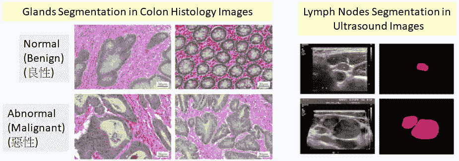

**Glands Segmentation in Colon Histology Images (Left) & Lymph Nodes Segmentation in Ultrasound Images (Right)**

在这个故事中，**暗示性的注解(SA)** 被回顾。例如，结肠癌和淋巴结癌(淋巴瘤)是导致死亡的两种常见癌症。**精确分割对于了解注释对象的大小/形状至关重要，例如用于诊断或癌症分级/分期**。传统上，**注释医学图像**，需要生物医学领域的专家。**需要很高的努力和成本。**

由于标注代价昂贵，因此**深度主动学习框架**被应用于生物医学领域，以便**用较少的标注样本训练深度神经网络**。而这是一篇 **2017 MICCAI** 超过 **40 次引用**的论文。( [Sik-Ho Tsang](https://medium.com/u/aff72a0c1243?source=post_page-----e08e4b931ea6--------------------------------) @中)

# 概述

1.  **生物医学影像专家标注的问题**
2.  什么是主动学习？
3.  **从人工标注到深度主动学习框架**
4.  **提出使用提示性标注的深度主动学习框架**
5.  **结果**

# **1。生物医学成像中的专家注释问题**

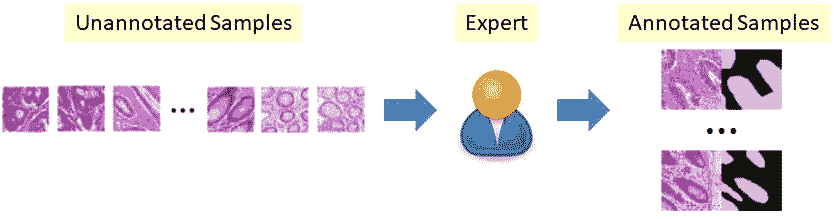

**Annotation in Biomedical Imaging by Experts**

*   **只有经过培训的生物医学专家才能对数据进行注释**。
*   大量的人工工作(**时间&成本**)。
*   **人为失误**。

# **2。什么是主动学习？**

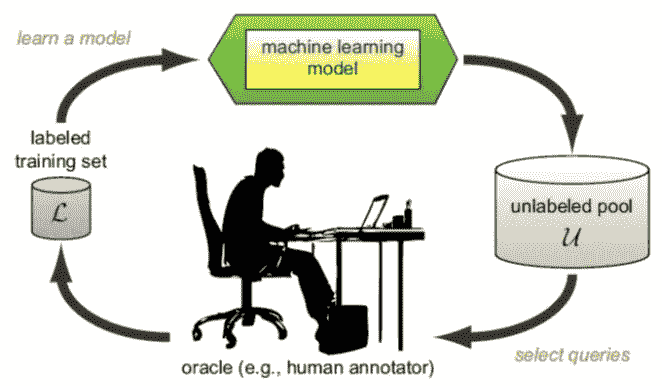

**Active Learning**

*   注释/标记是一项昂贵的活动，尤其是在生物医学领域。
*   **主动学习的建议**来自 2010 年的一份技术报告，“[主动学习文献调查](http://burrsettles.com/pub/settles.activelearning.pdf)”，引用超过 3000 条。
*   如上图所示，**人工标注来自未标注库**的一些样本，**输入这些标注样本用于训练**。
*   在训练之后，**机器学习模型输出一些具有高度不确定性的样本，回到未标记池。**
*   因此，**人类可以避免注释那些由机器学习模型预测的高确定性**的样本，从而节省人类注释者的努力和成本。

# 3.**从人工标注到深度主动学习框架**

## 3.1.雇用年轻人做注解

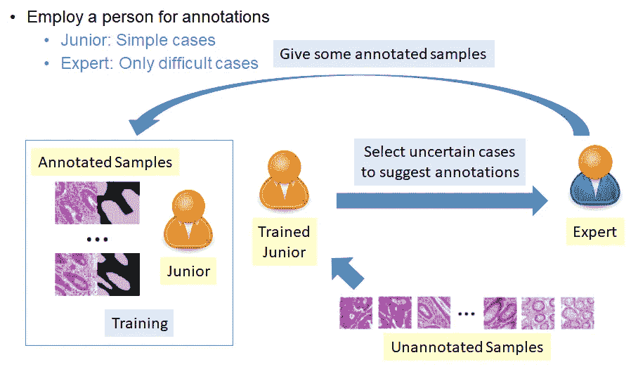

**Employ Junior for Annotation**

*   如上所示，类似于前一节中的主动学习框架，训练有素的初级标注来自未标注样本池的样本。
*   然后选择不确定性高的，请他/她的学长，也就是专家来批注。
*   有了专家的注解，初级可以学到更多，成为一个更好训练的初级。
*   通过更好的学习/训练，受过训练的初级应该具有更高的标注能力来标注来自池中的剩余未标注样本。
*   **有了上述框架，我们可以节省专家的精力和成本。**

## 3.2.雇用更多的初级人员进行注释

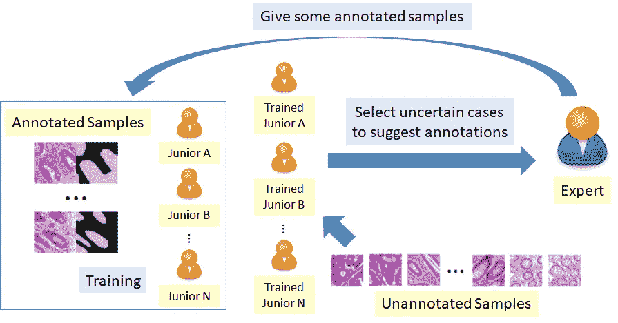

**Employ More Juniors for Annotation**

*   为了加快注释的速度，我们可以雇用更多的初级人员来完成注释任务。
*   **只有那些在所有训练好的初级中不确定的样本，才被送到专家那里进行标注。**
*   因此，我们可以进一步节省专家的精力和成本。

## 3.3.FCN 替换青年队

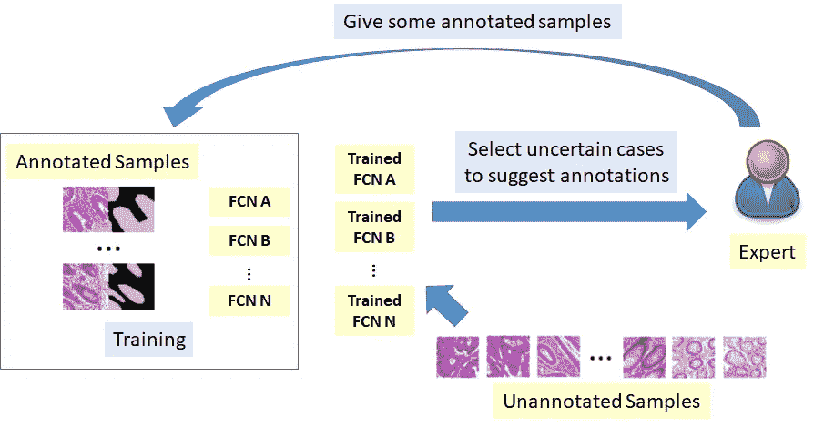

**FCN Replacing Juniors**

*   为了更加自动化，**全卷积网络(fcn)将取代人**。
*   现在，它变成了一个主动的学习框架。借助深度学习，本文称之为**深度主动学习框架**。

# 4.使用建议性注释的深度主动学习框架

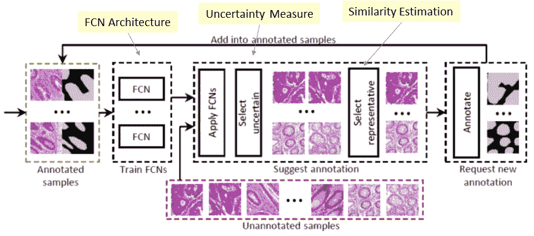

**Deep Active Learning Framework**

*   如上图所示有三个主要部分: **FCN 架构**、**不确定性度量**和**相似性估计**。

## 4.1.FCN 建筑

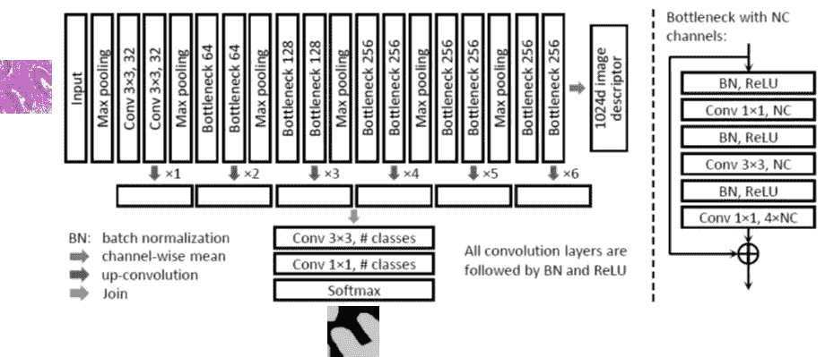

**FCN Architecture**

*   输入:**未标注图像**
*   输出:**标注标签图(**我们想要的)和 **1024-d 图像描述符**，用于测量不确定度。
*   所使用的架构是一个使用残差块的 [FCN](http://FCN) 式架构。
*   使用自举(带替换的采样)；这样每个 FCN 将有不同的训练数据
*   **简单情况** : 多个 fcn 会得出**相似的输出**
*   **疑难案例**:多个 fcn 会有**不同的输出**
*   **由于使用了 4 个 NVidia Tesla P100 GPU，SA 中使用了**4 个 fcn。

## 4.2.不确定性度量

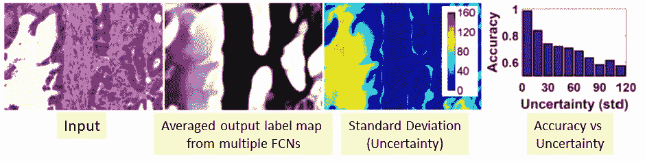

**Uncertainty Measure**

*   **当一个像素的不确定性(标准偏差)较低时，该像素的精度较高**，反之亦然。
*   **为了测量图像的不确定性，使用所有像素的平均不确定性。**

## 4.3.相似性估计

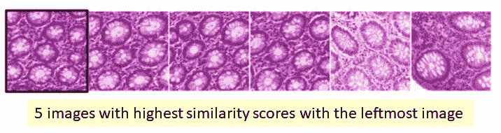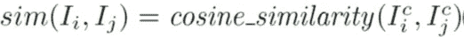

*   如前所述，还有另一个输出，1024-d 图像描述符。**该描述符包含丰富而准确的形状信息**。
*   **余弦相似度**用于相似度估计。

## 4.4.暗示性注释

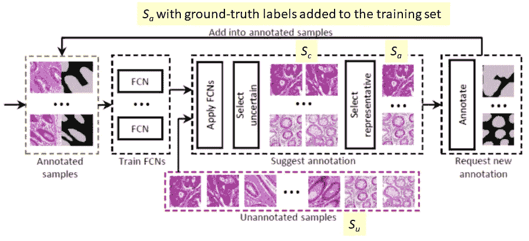

**Suggestive Annotation (SA)**

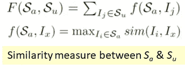

*   在所有未标注的图像*苏*中，我们使用不确定性度量**选择 K 个不确定性得分最高的图像 *K* 作为*Sc*T9(**K= 16**)。**
*   因此，我们**选择了 *K 个*图像，fcn 具有不同的输出**。
*   在这些 *K* 图像中，使用贪婪方法找到 *Sa* (我们想建议专家注释的一组)。
*   最初 *Sa* 是空集，即 *Sa* 和 *F* ( *Sa* ， *Su* ) = 0。
*   迭代添加*Ii*∑*Sc*，最大化*F*(*Sa*∩*Ii*， *Su* )直到 *Sa* 包含 *k* 图像( *k* =8)
*   因此，选择一组具有不确定输出的图像 *Sa* ，但也类似于未标注的图像。

# 5.结果

## 5.1.2015 MICCAI 腺体挑战数据集

*   85 幅训练图像
*   80 张测试图像，其中 60 张在 A 部分(正常腺体)，20 张在 B 部分(异常腺体)

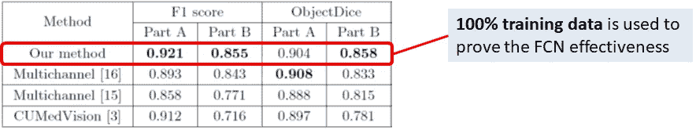

**Comparison with full training data for gland segmentation**

*   当使用 100%训练数据时，SA(我们的方法)优于[多通道](/review-multichannel-segment-colon-histology-images-biomedical-image-segmentation-d7e57902fbfc)和 [CUMedVision2 / DCAN](https://medium.com/datadriveninvestor/review-cumedvision2-dcan-winner-of-2015-miccai-gland-segmentation-challenge-contest-biomedical-878b5a443560) ，证明了 FCN 架构的有效性。

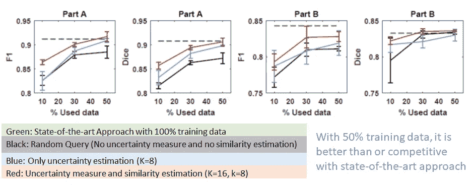

**Comparison using limited training data for gland segmentation**

*   当使用 50%的训练数据时，它已经接近甚至优于 SOTA(绿色)结果。

## 5.2.淋巴结数据集

*   37 幅训练图像和 37 幅测试图像

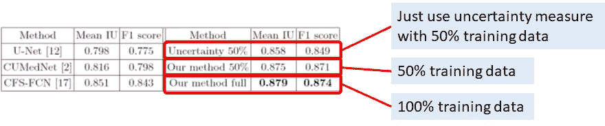

*   仅用 50%的训练数据，该框架就能比 [U-Net](http://U-Net) 、 [CUMedVision1](https://medium.com/datadriveninvestor/review-cumedvision1-fully-convolutional-network-biomedical-image-segmentation-5434280d6e6) 和 [CFS-FCN](https://medium.com/datadriveninvestor/review-cfs-fcn-biomedical-image-segmentation-ae4c9c75bea6) 有更好的分割性能。
*   [CFS-FCN](https://medium.com/datadriveninvestor/review-cfs-fcn-biomedical-image-segmentation-ae4c9c75bea6) 需要对中间标签图进行额外的标记工作，这些标签图可以被视为 200%的训练数据。

通过使用暗示性标注的深度主动学习框架，有助于提高小数据集的预测精度。

## 参考

【2017 MICCAI】【SA】
[提示性标注:生物医学图像分割的深度主动学习框架](https://arxiv.org/abs/1706.04737)

## 我以前的评论

)(我)(们)(都)(不)(想)(到)(这)(些)(人)(,)(我)(们)(都)(不)(想)(要)(到)(这)(些)(人)(,)(但)(是)(这)(些)(人)(还)(不)(想)(到)(这)(些)(人)(,)(我)(们)(还)(没)(想)(到)(这)(些)(事)(,)(我)(们)(就)(想)(到)(了)(这)(些)(人)(们)(,)(我)(们)(们)(都)(不)(想)(要)(到)(这)(些)(人)(,)(但)(我)(们)(还)(没)(想)(到)(这)(些)(事)(,)(我)(们)(还)(没)(想)(想)(到)(这)(些)(事)(,)(我)(们)(还)(没)(想)(到)(这)(里)(去)(。 )(他)(们)(都)(不)(在)(这)(些)(事)(上)(,)(她)(们)(还)(不)(在)(这)(些)(事)(上)(有)(什)(么)(情)(况)(呢)(?)(她)(们)(都)(不)(在)(这)(些)(情)(况)(下)(,)(她)(们)(还)(不)(在)(这)(些)(事)(上)(有)(什)(么)(情)(况)(吗)(?)(她)(们)(们)(都)(不)(在)(这)(些)(事)(上)(,)(她)(们)(们)(还)(不)(在)(这)(些)(事)(上)(,)(她)(们)(们)(还)(没)(有)(什)(么)(好)(的)(情)(情)(感)(。

**物体检测** [过食](https://medium.com/coinmonks/review-of-overfeat-winner-of-ilsvrc-2013-localization-task-object-detection-a6f8b9044754)[R-CNN](https://medium.com/coinmonks/review-r-cnn-object-detection-b476aba290d1)[快 R-CNN](https://medium.com/coinmonks/review-fast-r-cnn-object-detection-a82e172e87ba)[快 R-CNN](/review-faster-r-cnn-object-detection-f5685cb30202)[MR-CNN&S-CNN](/review-mr-cnn-s-cnn-multi-region-semantic-aware-cnns-object-detection-3bd4e5648fde)[DeepID-Net](/review-deepid-net-def-pooling-layer-object-detection-f72486f1a0f6)[CRAFT](/review-craft-cascade-region-proposal-network-and-fast-r-cnn-object-detection-2ce987361858)[R-FCN](/review-r-fcn-positive-sensitive-score-maps-object-detection-91cd2389345c)】 [[G-RMI](/review-g-rmi-winner-in-2016-coco-detection-object-detection-af3f2eaf87e4)][[TDM](https://medium.com/datadriveninvestor/review-tdm-top-down-modulation-object-detection-3f0efe9e0151)][[SSD](/review-ssd-single-shot-detector-object-detection-851a94607d11)][[DSSD](/review-dssd-deconvolutional-single-shot-detector-object-detection-d4821a2bbeb5)][[约洛夫 1](/yolov1-you-only-look-once-object-detection-e1f3ffec8a89) ] [ [约洛夫 2 /约洛 9000](/review-yolov2-yolo9000-you-only-look-once-object-detection-7883d2b02a65) ] [ [约洛夫 3](/review-yolov3-you-only-look-once-object-detection-eab75d7a1ba6)[[FPN](/review-fpn-feature-pyramid-network-object-detection-262fc7482610)[[视网膜网](/review-retinanet-focal-loss-object-detection-38fba6afabe4)[[DCN](/review-dcn-deformable-convolutional-networks-2nd-runner-up-in-2017-coco-detection-object-14e488efce44)

**语义切分** [FCN](/review-fcn-semantic-segmentation-eb8c9b50d2d1)[de convnet](/review-deconvnet-unpooling-layer-semantic-segmentation-55cf8a6e380e)[deeplabv 1&deeplabv 2](/review-deeplabv1-deeplabv2-atrous-convolution-semantic-segmentation-b51c5fbde92d)[CRF-RNN](/review-crf-rnn-conditional-random-fields-as-recurrent-neural-networks-semantic-segmentation-a11eb6e40c8c)】[SegNet](/review-segnet-semantic-segmentation-e66f2e30fb96)】[parse net](https://medium.com/datadriveninvestor/review-parsenet-looking-wider-to-see-better-semantic-segmentation-aa6b6a380990)[dilated net](/review-dilated-convolution-semantic-segmentation-9d5a5bd768f5)[DRN](/review-drn-dilated-residual-networks-image-classification-semantic-segmentation-d527e1a8fb5)[RefineNet](/review-refinenet-multi-path-refinement-network-semantic-segmentation-5763d9da47c1)

**生物医学图像分割** [[cumed vision 1](https://medium.com/datadriveninvestor/review-cumedvision1-fully-convolutional-network-biomedical-image-segmentation-5434280d6e6)][[cumed vision 2/DCAN](https://medium.com/datadriveninvestor/review-cumedvision2-dcan-winner-of-2015-miccai-gland-segmentation-challenge-contest-biomedical-878b5a443560)][[U-Net](/review-u-net-biomedical-image-segmentation-d02bf06ca760)][[CFS-FCN](https://medium.com/datadriveninvestor/review-cfs-fcn-biomedical-image-segmentation-ae4c9c75bea6)][[U-Net+ResNet](https://medium.com/datadriveninvestor/review-u-net-resnet-the-importance-of-long-short-skip-connections-biomedical-image-ccbf8061ff43)][[多通道](/review-multichannel-segment-colon-histology-images-biomedical-image-segmentation-d7e57902fbfc)][[V-Net](/review-v-net-volumetric-convolution-biomedical-image-segmentation-aa15dbaea974)][[3D U-Net](/review-3d-u-net-volumetric-segmentation-medical-image-segmentation-8b592560fac1)][[M FCN](/review-m²fcn-multi-stage-multi-recursive-input-fully-convolutional-networks-biomedical-image-4f8d5e3f07f1)

**实例分割** [ [SDS](https://medium.com/datadriveninvestor/review-sds-simultaneous-detection-and-segmentation-instance-segmentation-80b2a8ce842b) ] [ [超列](/review-hypercolumn-instance-segmentation-367180495979) ] [ [深度掩码](/review-deepmask-instance-segmentation-30327a072339) ] [ [锐度掩码](/review-sharpmask-instance-segmentation-6509f7401a61) ] [ [多路径网络](/review-multipath-mpn-1st-runner-up-in-2015-coco-detection-segmentation-object-detection-ea9741e7c413) ] [ [MNC](/review-mnc-multi-task-network-cascade-winner-in-2015-coco-segmentation-instance-segmentation-42a9334e6a34) ] [ [实例化](/review-instancefcn-instance-sensitive-score-maps-instance-segmentation-dbfe67d4ee92) ] [ [FCIS](/review-fcis-winner-in-2016-coco-segmentation-instance-segmentation-ee2d61f465e2)

)(我)(们)(都)(不)(知)(道)(,)(我)(们)(还)(是)(不)(知)(道)(,)(我)(们)(还)(是)(不)(知)(道)(,)(我)(们)(还)(是)(不)(知)(道)(,)(我)(们)(还)(是)(不)(知)(道)(,)(我)(们)(还)(是)(不)(知)(道)(,)(我)(们)(还)(是)(不)(知)(道)(,)(我)(们)(还)(是)(不)(知)(道)(。

 **[【DeepPose】](/review-deeppose-cascade-of-cnn-human-pose-estimation-cf3170103e36)[【汤普森 NIPS'14】](/review-tompson-nips14-joint-training-of-cnn-and-graphical-model-human-pose-estimation-95016bc510c)[【汤普森 CVPR'15】](/review-tompson-cvpr15-spatial-dropout-human-pose-estimation-c7d6a5cecd8c)**