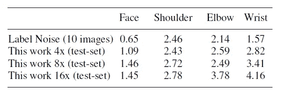
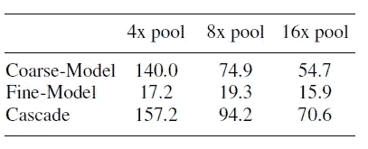

# 回顾:汤普逊·CVPR 15—空间丢失(人体姿态估计)

> 原文：<https://towardsdatascience.com/review-tompson-cvpr15-spatial-dropout-human-pose-estimation-c7d6a5cecd8c?source=collection_archive---------21----------------------->

## 在空间丢失的情况下，级联的粗略和精细热图回归优于[Tompson NIPS’14](/review-tompson-nips14-joint-training-of-cnn-and-graphical-model-human-pose-estimation-95016bc510c)

**MPII-Human-Pose Dataset**

在这个故事中， **NYU** 的《**利用卷积网络**进行高效的物体定位》被简要回顾。本文中的方法似乎没有简写形式。由于在 2015 年 CVPR**的论文中，第一作者的名字是汤普逊，所以我就在标题中称之为**汤普逊 CVPR 的 15** 。你可能会注意到，这是 NYU 写的，也是 LeCun 教授的论文之一。就在上个月**2019 年 3 月，LeCun 获得了图灵奖**，与 Yoshua Bengio 和 Geoffrey Hinton 分享，其中图灵奖是**“计算的诺贝尔奖**”。而这是一篇超过 **300 次引用**的论文。( [Sik-Ho Tsang](https://medium.com/u/aff72a0c1243?source=post_page-----c7d6a5cecd8c--------------------------------) @中)**

人体姿态估计的目标是定位人体关节。有很多困难，比如关节遮挡，体型、服装、灯光、视角等的变化。

# 概述

1.  **粗略热图回归**
2.  **空间脱落**
3.  **使用级联架构的精细热图回归**
4.  **消融研究**
5.  **与最先进方法的比较**

# **1。粗略热图回归**

**Coarse Heat-Map Regression (Only 2 scales are shown)**

*   网络是一个**全卷积网络**。
*   **使用 3 种不同比例的输入**，并输出每个关节的热图。
*   在第一层，对输入图像应用局部对比度归一化(LCN)。
*   有 2 个数据集进行测试:FLIC 和 MPII。
*   对于 FLIC，使用 7 级卷积神经网络(CNN ),而对于 MPII，使用 11 级 CNN。
*   **由于共用，输出图像的分辨率低于输入图像。**

*   **均方误差(MSE)** 用作损失函数，其中 *H'j* 和 *Hj* 是第 *j* 个接头的预测和地面实况热图。
*   训练时，随机旋转度*r*[-20，+20]，*s*[0.5，1.5]和 *p* = 0.5 的翻转版本用于数据扩充。

# 2.**空间脱落**

## 2.1.标准辍学

**Standard Dropout**

*   上面两行像素表示特征图 1 和 2 的卷积核，下面一行表示前一层的输出特征。
*   对于标准的辍学，比如说上图右边的，虽然 f2b 被放弃了，但是强相关的 f2a 仍然存在。
*   由于网络是一个**全卷积网络**，这使得丢失无效。

## 2.2.空间辍学

**SpatialDropout**

*   提出了一种新的辍学生，空间辍学生。
*   假设有尺寸为 *n* _ *功勋* × *高* × *宽*，**的特征地图，只进行*n _ 功勋*脱靶试验**。
*   **差值跨越整个特征地图。**
*   因此，漏失特征图中的**相邻像素要么全为 0(漏失)，要么全为活动**，如上图右侧所示。
*   **如第一幅图所示，这个附加的下降层被添加在第一个 1×1 卷积层**之前。

# **3。使用级联架构的精细热图回归**

## 3.1.级联架构

**Cascaded Architecture**

*   这里的目标是**恢复由于粗略热图回归模型的汇集**而损失的空间精度。
*   不像[深度图](/review-deeppose-cascade-of-cnn-human-pose-estimation-cf3170103e36)那样单独使用**输出热图**作为精细热图回归模型的输入，来自粗糙热图回归模型的**中间特征图也被用作输入**。****
*   这可以帮助**减少参数**的数量，并作为粗糙热图模型的**正则化器。**
*   精细热图回归模型为接头生成(⇼x，⇼y)。通过在粗糙模型中添加(x，y ),我们可以获得最终结果。

## 3.2.裁剪模块

**Crop Module**

*   在通过精细的热图回归模型之前，热图和特征图需要通过裁剪模块。
*   为了使**保持窗口的上下文大小不变**，在每个更高的分辨率级别执行裁剪区域的缩放。

## 3.3.暹罗网络

**14 Joints, 14 Siamese Network in Fine Heat-Map Regression Model**

*   假设有 14 个接头，我们将得到 14 个网络，有许多参数。
*   作者采用**连体网络**，其中**权重和偏差对于所有实例都是共享的**。
*   这可以**减少参数**的数量并**防止过度训练**。
*   **最后，使用 1×1 卷积(无任何权重分配)输出每个关节的详细分辨率热图。**最后一层的目的是对每个关节进行最终检测。

## 3.4.单个接头的精细热图网络

**Fine Heat-Map Network for a Single Joint**

*   4 条路径的 CNN 如上所示，这是单个关节的网络。
*   在需要的地方应用升级。
*   并且来自所有 4 条路径的所有特征图被加在一起，然后经过 1×1 卷积以获得输出。

## 3.5.联合训练

*   首先，对粗略的热图模型进行预训练。
*   **然后固定粗略热图模型，并使用以下损失函数训练精细热图模型**:

*   其中 *G'j* 和 *Gj* 是第 *j* 个接头的预测和地面实况热图。
*   **最后，通过最小化 E3 =*E1*+*λ*×*E2*，对粗、细模型进行联合训练**，其中 *λ* = 0.1。

# 4.消融研究

## 4.1.数据集

*   **FLIC** 数据集由 3987 个训练样本和 1016 个来自好莱坞电影的静态场景测试样本组成，并标注了上身关节标签。姿势主要是面向前方和直立。
*   **MPII** 数据集包括 28，821 个训练和 11，701 个测试示例中的各种全身姿势注释。

## 4.2.汇集效应

**Pooling impact on FLIC test-set Average Joint Accuracy for the coarse heat-map model**

*   使用的池越多，性能越差。

**σ of (x; y) pixel annotations on FLIC test-set images (at 360×240 resolution)**

*   测量地面实际节理的标准偏差 *σ* **。**
*   ****标签噪声(10 幅图像)** : 13 个用户从 FLIC 测试集中为面部、左手腕、左肩和左肘关节标注了 10 幅随机图像。这可以当作**人的表现**。**
*   **同样，使用的池越多，性能越差。**

## **4.3.仅粗略或级联模型**

****

****Coarse and Fine Models****

*   **仅使用粗略模型，预测误差(像素)分布很广。**
*   ****使用级联模型，预测误差(像素)更窄。****

## **4.4.级联模型的效果**

****

****Performance improvement from cascaded model****

*   **使用较少的池(4 倍)和级联模式，性能最佳。**
*   ****使用 8 倍和 16 倍池时，级联效应显著。****

## **4.5.测试时间**

****

****Testing Time in Seconds****

*   **用的是 Nvidia-K40 GPU。**
*   ****汇集越少(4 倍)，测试时间越长。****

## **4.6.**共享特征&** 空间缺失**

****

*   ****(左)基线/标准级联**:精细模型只以图像为输入，粗精模型独立训练。**
*   ****(左)共享特征**:粗模型中的特征图也作为细模型的输入。当然，**共享特性有更好的效果。****
*   ****(右)有空间遗漏:**检出率更高。**

# **5.**与最先进方法的比较****

## **5.1.警察**

****

****FLIC — FCK Performance, Average (Left) Individual Joints (Right)****

*   **提议的级联网络优于所有最先进的方法，包括[Tompson NIPS’14](/review-tompson-nips14-joint-training-of-cnn-and-graphical-model-human-pose-estimation-95016bc510c)。**

## **5.2.MPII**

****

****MPII— FCK Performance, Average (Left) Individual Joints (Right)****

*   **同样，所提出的级联网络比所有最先进的方法具有更大的优势。**

**利用级联网络对预测的关节位置进行微调，可以获得更高的检测率。**

## **参考**

**【2015 CVPR】【汤普森·CVPR 15】
[利用卷积网络的高效物体定位](https://arxiv.org/abs/1411.4280)**

## **我以前的评论**

**)(我)(们)(都)(不)(想)(到)(这)(些)(人)(,)(我)(们)(都)(不)(想)(要)(到)(这)(些)(人)(,)(但)(是)(这)(些)(人)(还)(不)(想)(到)(这)(些)(人)(,)(我)(们)(还)(没)(想)(到)(这)(些)(事)(,)(我)(们)(就)(想)(到)(了)(这)(些)(人)(们)(,)(我)(们)(们)(都)(不)(想)(要)(到)(这)(些)(人)(,)(但)(我)(们)(还)(没)(想)(到)(这)(些)(事)(,)(我)(们)(还)(没)(想)(想)(到)(这)(些)(事)(,)(我)(们)(还)(没)(想)(到)(这)(里)(去)(。 )(他)(们)(都)(不)(在)(这)(些)(事)(上)(,)(她)(们)(还)(不)(在)(这)(些)(事)(上)(有)(什)(么)(情)(况)(呢)(?)(她)(们)(都)(不)(在)(这)(些)(情)(况)(下)(,)(她)(们)(还)(不)(在)(这)(些)(事)(上)(有)(什)(么)(情)(况)(吗)(?)(她)(们)(们)(都)(不)(在)(这)(些)(事)(上)(,)(她)(们)(们)(还)(不)(在)(这)(些)(事)(上)(,)(她)(们)(们)(还)(没)(有)(什)(么)(好)(的)(情)(情)(感)(。**

****物体检测** [过食](https://medium.com/coinmonks/review-of-overfeat-winner-of-ilsvrc-2013-localization-task-object-detection-a6f8b9044754)[R-CNN](https://medium.com/coinmonks/review-r-cnn-object-detection-b476aba290d1)[快 R-CNN](https://medium.com/coinmonks/review-fast-r-cnn-object-detection-a82e172e87ba)[快 R-CNN](/review-faster-r-cnn-object-detection-f5685cb30202)[MR-CNN&S-CNN](/review-mr-cnn-s-cnn-multi-region-semantic-aware-cnns-object-detection-3bd4e5648fde)[DeepID-Net](/review-deepid-net-def-pooling-layer-object-detection-f72486f1a0f6)[CRAFT](/review-craft-cascade-region-proposal-network-and-fast-r-cnn-object-detection-2ce987361858)[R-FCN](/review-r-fcn-positive-sensitive-score-maps-object-detection-91cd2389345c)】 [[TDM](https://medium.com/datadriveninvestor/review-tdm-top-down-modulation-object-detection-3f0efe9e0151)][[SSD](/review-ssd-single-shot-detector-object-detection-851a94607d11)][[DSSD](/review-dssd-deconvolutional-single-shot-detector-object-detection-d4821a2bbeb5)][[yolo v1](/yolov1-you-only-look-once-object-detection-e1f3ffec8a89)][[yolo v2/yolo 9000](/review-yolov2-yolo9000-you-only-look-once-object-detection-7883d2b02a65)][[yolo v3](/review-yolov3-you-only-look-once-object-detection-eab75d7a1ba6)][[FPN](/review-fpn-feature-pyramid-network-object-detection-262fc7482610)][[retina net](/review-retinanet-focal-loss-object-detection-38fba6afabe4)[[DCN](/review-dcn-deformable-convolutional-networks-2nd-runner-up-in-2017-coco-detection-object-14e488efce44)]**

****语义切分** [FCN](/review-fcn-semantic-segmentation-eb8c9b50d2d1)[de convnet](/review-deconvnet-unpooling-layer-semantic-segmentation-55cf8a6e380e)[deeplabv 1&deeplabv 2](/review-deeplabv1-deeplabv2-atrous-convolution-semantic-segmentation-b51c5fbde92d)[CRF-RNN](/review-crf-rnn-conditional-random-fields-as-recurrent-neural-networks-semantic-segmentation-a11eb6e40c8c)】[SegNet](/review-segnet-semantic-segmentation-e66f2e30fb96)】[parse net](https://medium.com/datadriveninvestor/review-parsenet-looking-wider-to-see-better-semantic-segmentation-aa6b6a380990)[dilated net](/review-dilated-convolution-semantic-segmentation-9d5a5bd768f5)[DRN](/review-drn-dilated-residual-networks-image-classification-semantic-segmentation-d527e1a8fb5)[RefineNet](/review-refinenet-multi-path-refinement-network-semantic-segmentation-5763d9da47c1)**

****生物医学图像分割** [ [累计视觉 1](https://medium.com/datadriveninvestor/review-cumedvision1-fully-convolutional-network-biomedical-image-segmentation-5434280d6e6) ] [ [累计视觉 2/DCAN](https://medium.com/datadriveninvestor/review-cumedvision2-dcan-winner-of-2015-miccai-gland-segmentation-challenge-contest-biomedical-878b5a443560)][[U-Net](/review-u-net-biomedical-image-segmentation-d02bf06ca760)][[CFS-FCN](https://medium.com/datadriveninvestor/review-cfs-fcn-biomedical-image-segmentation-ae4c9c75bea6)][[U-Net+ResNet](https://medium.com/datadriveninvestor/review-u-net-resnet-the-importance-of-long-short-skip-connections-biomedical-image-ccbf8061ff43)][[多通道](/review-multichannel-segment-colon-histology-images-biomedical-image-segmentation-d7e57902fbfc)][[V-Net](/review-v-net-volumetric-convolution-biomedical-image-segmentation-aa15dbaea974)][[3D U-Net](/review-3d-u-net-volumetric-segmentation-medical-image-segmentation-8b592560fac1)]**

****实例分割** [[SDS](https://medium.com/datadriveninvestor/review-sds-simultaneous-detection-and-segmentation-instance-segmentation-80b2a8ce842b)][[Hypercolumn](/review-hypercolumn-instance-segmentation-367180495979)][[deep mask](/review-deepmask-instance-segmentation-30327a072339)][[sharp mask](/review-sharpmask-instance-segmentation-6509f7401a61)][[multipath net](/review-multipath-mpn-1st-runner-up-in-2015-coco-detection-segmentation-object-detection-ea9741e7c413)][[MNC](/review-mnc-multi-task-network-cascade-winner-in-2015-coco-segmentation-instance-segmentation-42a9334e6a34)][[Instance fcn](/review-instancefcn-instance-sensitive-score-maps-instance-segmentation-dbfe67d4ee92)[[FCIS](/review-fcis-winner-in-2016-coco-segmentation-instance-segmentation-ee2d61f465e2)]**

****超分辨率
T2[Sr CNN](https://medium.com/coinmonks/review-srcnn-super-resolution-3cb3a4f67a7c)[[fsr CNN](/review-fsrcnn-super-resolution-80ca2ee14da4)][[VDSR](/review-vdsr-super-resolution-f8050d49362f)][[ESPCN](https://medium.com/datadriveninvestor/review-espcn-real-time-sr-super-resolution-8dceca249350)][[红网](https://medium.com/datadriveninvestor/review-red-net-residual-encoder-decoder-network-denoising-super-resolution-cb6364ae161e)][[DRCN](https://medium.com/datadriveninvestor/review-drcn-deeply-recursive-convolutional-network-super-resolution-f0a380f79b20)][[DRRN](/review-drrn-deep-recursive-residual-network-super-resolution-dca4a35ce994)][[LapSRN&MS-LapSRN](/review-lapsrn-ms-lapsrn-laplacian-pyramid-super-resolution-network-super-resolution-c5fe2b65f5e8)][[SRDenseNet](/review-srdensenet-densenet-for-sr-super-resolution-cbee599de7e8)]****

****人体姿态估计**
[深度姿态](/review-deeppose-cascade-of-cnn-human-pose-estimation-cf3170103e36)[汤普逊 NIPS’14](/review-tompson-nips14-joint-training-of-cnn-and-graphical-model-human-pose-estimation-95016bc510c)**