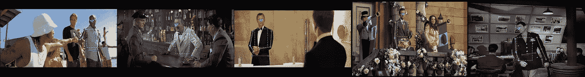
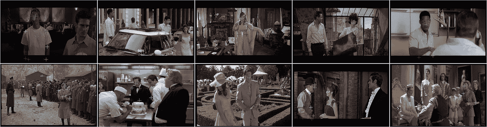
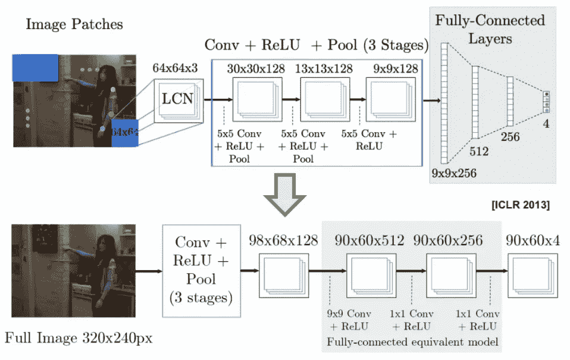
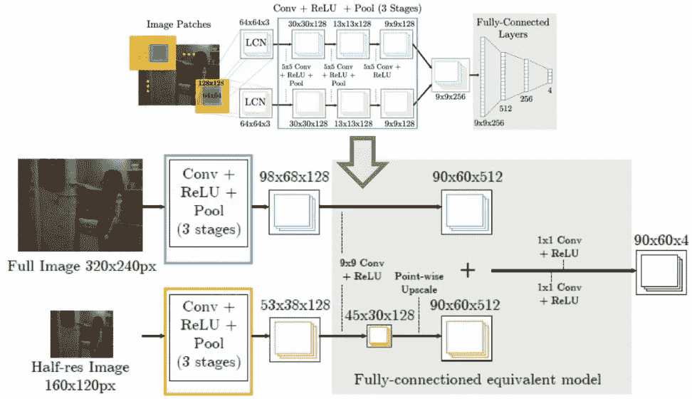
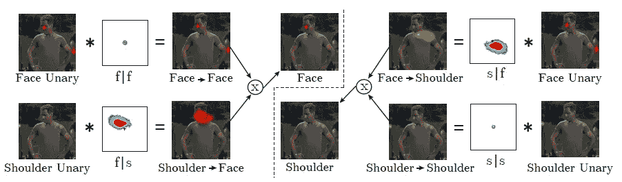
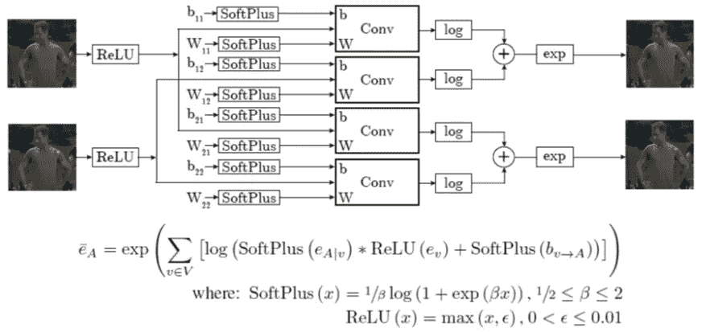
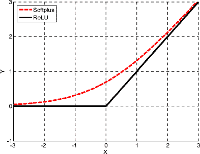
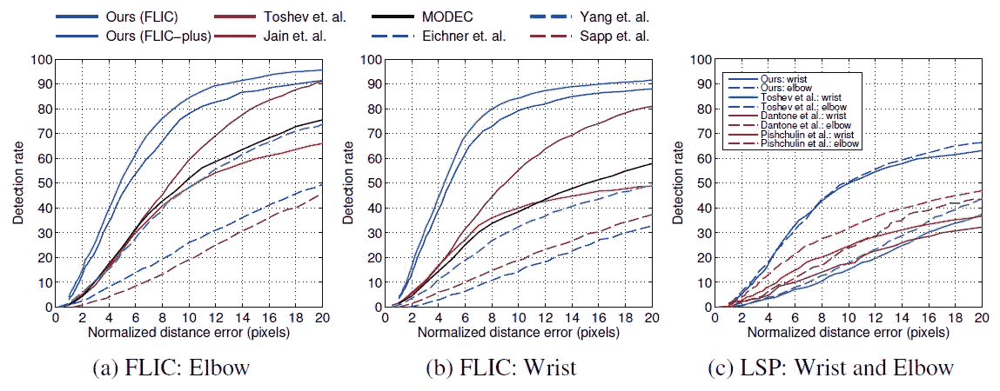
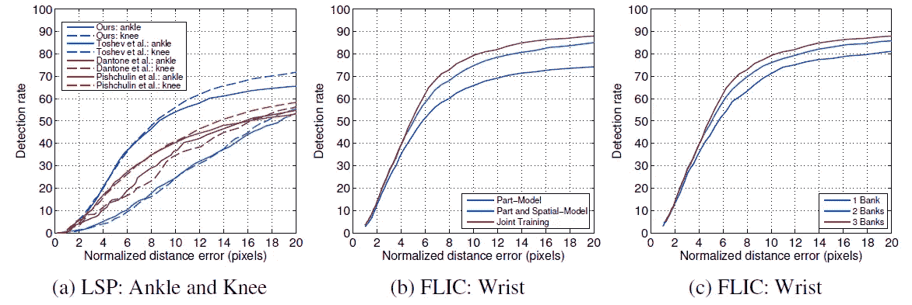
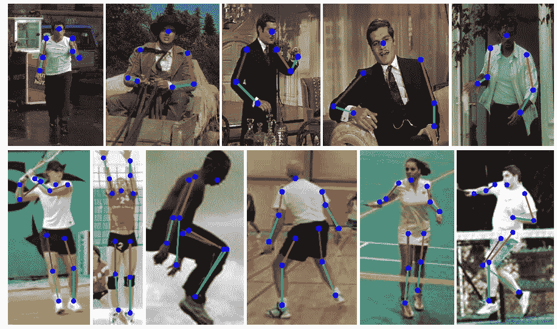

# 综述:Tompson NIPS ' 14—CNN 和图形模型的联合训练(人体姿态估计)

> 原文：<https://towardsdatascience.com/review-tompson-nips14-joint-training-of-cnn-and-graphical-model-human-pose-estimation-95016bc510c?source=collection_archive---------18----------------------->

## 又名{多人/人/人/人体} {姿势估计/关键点检测}，NYU

**FLIC (Frames Labeled In Cinema) Dataset for Human Pose Estimation (**[https://bensapp.github.io/flic-dataset.html](https://bensapp.github.io/flic-dataset.html))

**FLIC Plus Dataset for Human Pose Estimation**

在这个故事中， **NYU** 的《**卷积网络和人体姿态估计图形模型的联合训练**》做了简要回顾。本文中的方法似乎没有简写形式。由于在 2014 NIPS 的**论文中第一作者的名字是汤普逊，所以我就在标题上称之为**汤普逊 NIPS’14**。你可能会注意到，这是 NYU 写的，也是勒村教授的论文之一。而这是一篇超过 **600 次引用**的论文。( [Sik-Ho Tsang](https://medium.com/u/aff72a0c1243?source=post_page-----95016bc510c--------------------------------) @中)**

**人体姿态估计的目标是定位人体关节。**有很多困难，比如关节遮挡、体型变化、服装、灯光、视角等。

# 概述

1.  **零件检测器:模型架构**
2.  **空间模型:关节间的消息传递**
3.  **结果**

# 1.零件检测器:模型架构

## 1.1.从滑动窗口到全图像卷积—单一分辨率

**From Sliding Window to Full Image Convolution — Single Resolution**

*   作者通过**对完整图像**执行卷积而不是使用滑动窗口卷积来改进 2013 ICLR 架构。
*   此外，不是使用全连接层来预测 4 个接头(红、黄、绿和蓝)，而是使用 **1×1 卷积**来替换全连接层，以将特征图的数量从 512 个减少到 4 个。因此，**最后，为 4 个关节**生成了 4 个热图。

## 1.2.从滑动窗口到全图像卷积—多分辨率

**From Sliding Window to Full Image Convolution — Multi-Resolution**

*   此外，为了提高网络的鲁棒性，使用了多分辨率输入图像。与顶部的相比，底部不需要两次滑动窗口卷积。对于底部的网络，在对输入图像进行下采样之后，我们得到 2 个输入图像，网络可以一次性执行。

# **2。空间模型:关节间的消息传递**

**Message Passing Between Face and Shoulder Joints**

*   一个关节位置可以帮助细化另一个关节位置，例如，通过肩部位置，我们可以知道在正常情况下面部应该在肩部之上。基于这一思想，可以消除假阳性。

**Single Round Message Passing Network**

**SoftPlus and ReLU**

*   **作者设计了一个消息传递网络来逼近马尔可夫随机场(MRF)。**该网络用于**模拟一元电位和成对电位**的估计，以完善结果。
*   使用 SoftPlus 代替 ReLU。两者具有相似的效果，但是 SofPlus 可以提供平滑的曲线。

# 3.结果

## 3.1.培养

*   首先单独训练零件检测器，并存储热图输出。然后，这些热图被用来训练一个空间模型。最后，将经过训练的部分检测器和空间模型结合起来，用于整个网络的反向传播。

## 3.2.新的 FLIC **(电影中标记的帧)**加上数据集

*   为了公平起见，作者对原始 FLIC 数据集进行了微调，以生成新的 FLIC Plus 数据集，使其不与测试集重叠。

## 3.3.估价

*   对于给定的归一化像素半径，评估测试集中预测关节位置到地面实况位置的距离落在给定半径内的图像的数量。

## 3.4.FLIC 测试集和 LSP 测试集

**FLIC Test Set (Left & Middle) & LSP (Leeds Sports Pose) Test Set (**[http://sam.johnson.io/research/lsp.html](http://sam.johnson.io/research/lsp.html)) **(Right)**

**LSP Test Set (Left) & Further Study on Proposed Models**

*   曲线越高，模型越好。
*   我们可以看到，对于 FLIC(顶行，左和中间)和 LSP(右上和左下)测试集，与其他方法相比，所提出的方法(我们的方法)具有较大的优势。
*   进一步研究空间模型和联合训练的有效性(底部中间)，我们可以看到两个网络的联合训练具有最高的检测率。
*   此外，使用 3 种分辨率的图像输入网络会产生最佳结果(右下角)。

**Predicted Joint Positions, Top Row: FLIC Test-Set, Bottom Row: LSP Test-Set**

## 参考

【2014 NIPS】【Tompson NIPS’14】
[卷积网络和人体姿态估计图形模型的联合训练](https://arxiv.org/abs/1406.2984)

## 我以前的评论

)(我)(们)(都)(不)(想)(到)(这)(些)(人)(,)(我)(们)(都)(不)(想)(要)(到)(这)(些)(人)(,)(但)(是)(这)(些)(人)(还)(不)(想)(到)(这)(些)(人)(,)(我)(们)(还)(没)(想)(到)(这)(些)(事)(,)(我)(们)(就)(想)(到)(了)(这)(些)(人)(们)(,)(我)(们)(们)(都)(不)(想)(要)(到)(这)(些)(人)(,)(但)(我)(们)(还)(没)(想)(到)(这)(些)(事)(,)(我)(们)(还)(没)(想)(想)(到)(这)(些)(事)(,)(我)(们)(还)(没)(想)(到)(这)(里)(去)(。 )(他)(们)(都)(不)(在)(这)(些)(事)(上)(,)(她)(们)(还)(不)(在)(这)(些)(事)(上)(有)(什)(么)(情)(况)(呢)(?)(她)(们)(都)(不)(在)(这)(些)(情)(况)(下)(,)(她)(们)(还)(是)(不)(在)(这)(些)(事)(上)(有)(什)(么)(情)(况)(吗)(?)(她)(们)(都)(不)(在)(这)(些)(事)(上)(,)(她)(们)(们)(还)(不)(在)(这)(些)(事)(上)(,)(她)(们)(们)(还)(不)(在)(这)(些)(事)(上)(有)(什)(么)(好)(的)(情)(情)(情)(况)(。

**物体检测** [过食](https://medium.com/coinmonks/review-of-overfeat-winner-of-ilsvrc-2013-localization-task-object-detection-a6f8b9044754)[R-CNN](https://medium.com/coinmonks/review-r-cnn-object-detection-b476aba290d1)[快 R-CNN](https://medium.com/coinmonks/review-fast-r-cnn-object-detection-a82e172e87ba)[快 R-CNN](/review-faster-r-cnn-object-detection-f5685cb30202)[DeepID-Net](/review-deepid-net-def-pooling-layer-object-detection-f72486f1a0f6)】[CRAFT](/review-craft-cascade-region-proposal-network-and-fast-r-cnn-object-detection-2ce987361858)[R-FCN](/review-r-fcn-positive-sensitive-score-maps-object-detection-91cd2389345c)[ION](/review-ion-inside-outside-net-2nd-runner-up-in-2015-coco-detection-object-detection-da19993f4766)[multipath Net](/review-multipath-mpn-1st-runner-up-in-2015-coco-detection-segmentation-object-detection-ea9741e7c413)【T21 [ [约洛夫 1](/yolov1-you-only-look-once-object-detection-e1f3ffec8a89) ] [ [约洛夫 2 /约洛 9000](/review-yolov2-yolo9000-you-only-look-once-object-detection-7883d2b02a65) ] [ [约洛夫 3](/review-yolov3-you-only-look-once-object-detection-eab75d7a1ba6) ] [ [FPN](/review-fpn-feature-pyramid-network-object-detection-262fc7482610) ] [ [视网膜网](/review-retinanet-focal-loss-object-detection-38fba6afabe4) ] [ [DCN](/review-dcn-deformable-convolutional-networks-2nd-runner-up-in-2017-coco-detection-object-14e488efce44) ]

**语义切分** [FCN](/review-fcn-semantic-segmentation-eb8c9b50d2d1)[de convnet](/review-deconvnet-unpooling-layer-semantic-segmentation-55cf8a6e380e)[deeplab v1&deeplab v2](/review-deeplabv1-deeplabv2-atrous-convolution-semantic-segmentation-b51c5fbde92d)】[CRF-RNN](/review-crf-rnn-conditional-random-fields-as-recurrent-neural-networks-semantic-segmentation-a11eb6e40c8c)】[SegNet](/review-segnet-semantic-segmentation-e66f2e30fb96)】[parse net](https://medium.com/datadriveninvestor/review-parsenet-looking-wider-to-see-better-semantic-segmentation-aa6b6a380990)[dilated net](/review-dilated-convolution-semantic-segmentation-9d5a5bd768f5)[PSPNet](/review-pspnet-winner-in-ilsvrc-2016-semantic-segmentation-scene-parsing-e089e5df177d)[deeplab v3](/review-deeplabv3-atrous-convolution-semantic-segmentation-6d818bfd1d74)]

**生物医学图像分割** [[cumed vision 1](https://medium.com/datadriveninvestor/review-cumedvision1-fully-convolutional-network-biomedical-image-segmentation-5434280d6e6)][[cumed vision 2/DCAN](https://medium.com/datadriveninvestor/review-cumedvision2-dcan-winner-of-2015-miccai-gland-segmentation-challenge-contest-biomedical-878b5a443560)][[U-Net](/review-u-net-biomedical-image-segmentation-d02bf06ca760)][[CFS-FCN](https://medium.com/datadriveninvestor/review-cfs-fcn-biomedical-image-segmentation-ae4c9c75bea6)][[U-Net+ResNet](https://medium.com/datadriveninvestor/review-u-net-resnet-the-importance-of-long-short-skip-connections-biomedical-image-ccbf8061ff43)][[多通道](/review-multichannel-segment-colon-histology-images-biomedical-image-segmentation-d7e57902fbfc)

**实例分段** [DeepMask](/review-deepmask-instance-segmentation-30327a072339) [SharpMask](/review-sharpmask-instance-segmentation-6509f7401a61) [MultiPathNet](/review-multipath-mpn-1st-runner-up-in-2015-coco-detection-segmentation-object-detection-ea9741e7c413) [MNC](/review-mnc-multi-task-network-cascade-winner-in-2015-coco-segmentation-instance-segmentation-42a9334e6a34) [InstanceFCN](/review-instancefcn-instance-sensitive-score-maps-instance-segmentation-dbfe67d4ee92) [FCIS](/review-fcis-winner-in-2016-coco-segmentation-instance-segmentation-ee2d61f465e2) 】

)(我)(们)(都)(不)(知)(道)(,)(我)(们)(还)(是)(不)(知)(道)(,)(我)(们)(还)(是)(不)(知)(道)(,)(我)(们)(还)(是)(不)(知)(道)(,)(我)(们)(还)(是)(不)(知)(道)(,)(我)(们)(还)(是)(不)(知)(道)(,)(我)(们)(还)(是)(不)(知)(道)(。