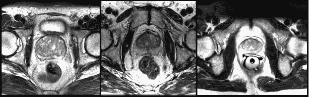
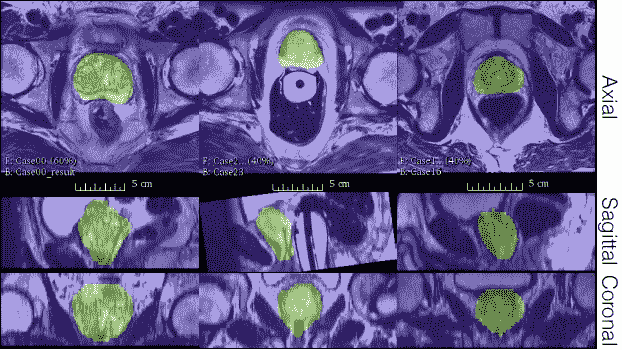
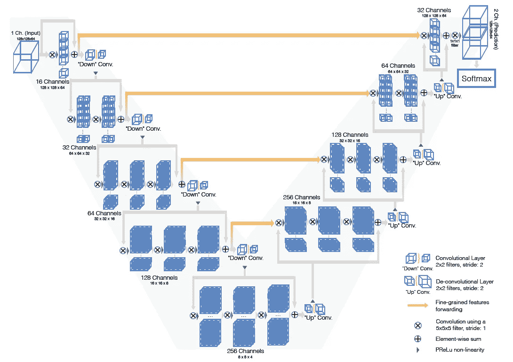
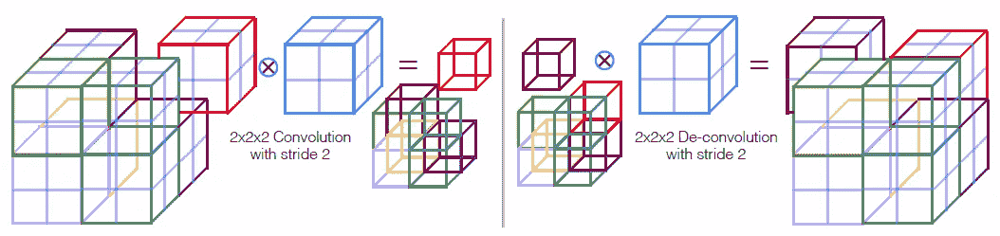
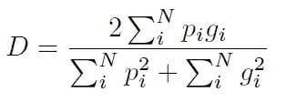
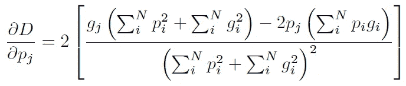
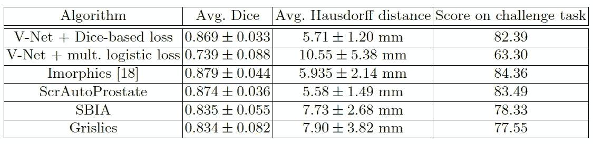
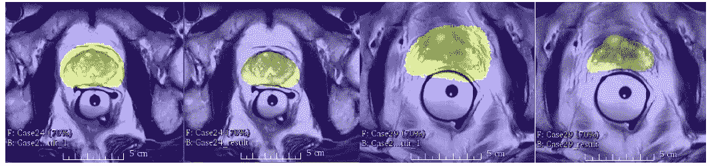

# 综述:V-Net —体积卷积(生物医学图像分割)

> 原文：<https://towardsdatascience.com/review-v-net-volumetric-convolution-biomedical-image-segmentation-aa15dbaea974?source=collection_archive---------5----------------------->

## 用于体积医学图像分割的全卷积网络

**Slices from MRI volumes depicting prostate (PROMISE 2012 challenge dataset)**

**Qualitative results (PROMISE 2012 challenge dataset)**

在这个故事中， **V-Net** 被简要回顾。临床实践中使用的大多数医学数据由 3D 体积组成，例如描绘前列腺的 MRI 体积，而大多数方法仅能够处理 2D 图像。提出了一种基于体完全卷积神经网络的三维图像分割方法。

前列腺 MRI 体积分割是一项具有挑战性的任务，由于广泛的外观，以及不同的扫描方法。强度分布的变形和变化也会发生。

**注释医学卷并不容易。注释需要专家，这产生了高成本。自动分段有助于降低成本。**

然而，前列腺分割是一项重要的任务，在诊断期间和治疗计划期间都具有临床相关性，在诊断期间需要评估前列腺的体积，在治疗计划期间需要精确估计解剖边界。这是一篇 **2016 3DV** 论文，引用 **600 多篇**。( [Sik-Ho Tsang](https://medium.com/u/aff72a0c1243?source=post_page-----aa15dbaea974--------------------------------) @中)

1.  **虚拟网络架构**
2.  **骰子损失**
3.  **结果**

# **1。虚拟网络架构**

**V-Net Architecture**

*   v 网如上图。网络的**左边部分**由**压缩路径**组成，而**右边部分对信号**进行解压缩，直到达到其原始大小。
*   如你所见，它类似于 [U-Net](/review-u-net-biomedical-image-segmentation-d02bf06ca760) ，但有一些不同。

## 1.1.左边的

*   网络的左侧分为以不同分辨率运行的不同阶段。每一级包括一到三个卷积层。
*   在每个阶段，学习一个剩余函数。每一级的输入在卷积层中使用，通过非线性处理，并加到该级的最后一个卷积层的输出上，以便能够学习剩余函数。这种架构与 [U-Net](/review-u-net-biomedical-image-segmentation-d02bf06ca760) 等无残差学习网络相比，保证了收敛性。
*   在每个阶段执行的**卷积**使用大小为 **5×5×5 体素**的**体积核**。(体素代表 3D 空间中规则网格上的值。术语体素通常用于 3D 空间，就像点云中的体素化一样。)
*   沿着压缩路径，**分辨率通过与步长为 2** 的 2×2×2 体素宽内核进行卷积而降低。因此，生成的要素地图的大小减半，其目的**与汇集图层**相似。并且**特征通道的数量在 V-Net 的压缩路径的每个阶段**加倍。
*   由于反向传播不需要将池层的输出映射回它们的输入的开关，所以用卷积运算代替池运算有助于在训练期间具有更小的内存占用。
*   下采样有助于增加感受野。
*   **PReLU** 用作非线性激活功能。(预走建议在[预走网](https://medium.com/coinmonks/review-prelu-net-the-first-to-surpass-human-level-performance-in-ilsvrc-2015-image-f619dddd5617)中)。)

## 1.2.对吧

*   网络提取特征，并且**扩展较低分辨率特征图的空间支持**,以便收集和组合必要的信息来输出双通道体积分割。

**Convolution for Downsampling (Left), Deconvolution for Upsampling (Right)**

*   在每个阶段，使用**去卷积**操作，以便**增加输入的大小，随后是一到三个卷积层，**涉及在前一层中使用的 5×5×5 核**的一半数量。**
*   **剩余函数**被学习，类似于网络的左侧部分。
*   这两个特征映射由最后一个卷积层的**计算，具有 **1×1×1 核大小**并产生与输入卷大小相同的**输出。****
*   这两个输出特征图是**通过应用软最大体素法**对前景和背景区域的概率分割。

## 1.3.水平连接

*   与 [U-Net](/review-u-net-biomedical-image-segmentation-d02bf06ca760) 类似，**位置信息在压缩路径中丢失(左)。**
*   因此，从 CNN 左边部分的早期阶段提取的特征通过水平连接被转发到右边部分。
*   这可以帮助**向正确的部分提供位置信息，并提高最终轮廓预测的质量。**
*   并且这些连接改善了模型的收敛时间。

# 2.骰子损失

*   上面是两个二进制卷之间的**骰子系数 *D* 。(范围在 0 和 1 之间)**
*   用 *N* 体素， *pi* :预测体素， *gi* :地面真实体素。
*   如上所述，在 softmax 之后的网络末端，我们得到的输出是每个体素属于前景和背景的概率。
*   和骰子可以被区分，产生梯度:

*   使用骰子损失，不需要对不同类别的样本进行加权来建立前景和背景体素之间的正确平衡。

# 3.结果

## 3.1.培养

*   网络处理的所有体积都具有 128×128×64 体素的**固定尺寸和 1**×1**×1.5 毫米的空间分辨率。******
*   数据集很小，因为需要一个或多个专家来手动追踪可靠的基本事实注释，并且存在与他们的获取相关联的成本。
*   **只有 50 个 MRI 体积用于训练**，相对手动地面实况标注从 **PROMISE 2012 challenge 数据集**获得。
*   该数据集包含在**不同医院**采集的医疗数据，使用**不同设备**和**不同采集协议**，以表示临床可变性。
*   因此，需要增加数据。对于每次迭代，使用通过 2×2×2 控制点网格和 B 样条插值获得的**密集变形场**的训练图像的随机变形版本。
*   此外，**通过使用直方图匹配使每次迭代中使用的训练体积的强度分布适应属于数据集的其他随机选择的扫描的强度分布，来改变数据的强度分布**。
*   小批量，只有 2 卷，由于内存要求高。

## 3.2.测试

*   处理不可见的 30 个 MRI 体积。
*   softmax 之后的体素属于前景的概率高于属于背景的概率(> 0.5)，被认为是解剖结构的一部分。
*   测量了 Dice 系数和 Hausdorff 距离。
*   Hausdorff 距离是用来衡量形状相似性的。Hausdorff 距离是获得两个形状之间的最大距离。(如果感兴趣，关于豪斯多夫距离的非常简要的介绍在 [CUMedVision2 / DCAN](https://medium.com/datadriveninvestor/review-cumedvision2-dcan-winner-of-2015-miccai-gland-segmentation-challenge-contest-biomedical-878b5a443560) 。)

**Quantitative Comparison on the PROMISE 2012 Challenge Dataset**

**Dice Loss (Green) Logistic Loss (Yellow)**

*   如上所示，使用骰子损失的 V-Net 优于使用逻辑损失的 V-Net。
*   并且 V-Net 优于大多数现有技术，但不仅仅是 Imorphics。
*   作者在未来的工作中提到，他们将致力于在其他模态(如超声)中分割包含多个区域的体积，并通过在多个 GPU 上分割网络来实现更高的分辨率。

## 参考

【2016 3DV】【V-Net】
[V-Net:用于体医学图像分割的全卷积神经网络](https://arxiv.org/abs/1606.04797)

## 我以前的评论

)(我)(们)(都)(不)(想)(到)(这)(些)(人)(,)(我)(们)(都)(不)(想)(要)(到)(这)(些)(人)(,)(但)(是)(这)(些)(人)(还)(不)(想)(到)(这)(些)(人)(,)(我)(们)(还)(没)(想)(到)(这)(些)(事)(,)(我)(们)(就)(想)(到)(了)(这)(些)(人)(们)(,)(我)(们)(们)(都)(不)(想)(要)(到)(这)(些)(人)(,)(但)(我)(们)(还)(没)(想)(到)(这)(些)(事)(,)(我)(们)(还)(没)(想)(想)(到)(这)(些)(事)(,)(我)(们)(还)(没)(想)(到)(这)(里)(去)(。 )(我)(们)(都)(不)(想)(到)(这)(些)(人)(,)(我)(们)(都)(不)(想)(到)(这)(些)(人)(,)(但)(是)(这)(些)(人)(还)(有)(什)(么)(情)(况)(呢)(?)(我)(们)(都)(不)(想)(到)(这)(些)(人)(,)(但)(是)(这)(些)(人)(还)(是)(这)(些)(人)(,)(还)(是)(这)(些)(人)(,)(还)(没)(有)(什)(么)(好)(的)(情)(情)(况)(,)(还)(是)(这)(些)(人)(,)(我)(们)(还)(没)(想)(到)(这)(里)(来)(。

**物体检测** [过食](https://medium.com/coinmonks/review-of-overfeat-winner-of-ilsvrc-2013-localization-task-object-detection-a6f8b9044754)[R-CNN](https://medium.com/coinmonks/review-r-cnn-object-detection-b476aba290d1)[快 R-CNN](https://medium.com/coinmonks/review-fast-r-cnn-object-detection-a82e172e87ba)[快 R-CNN](/review-faster-r-cnn-object-detection-f5685cb30202)[DeepID-Net](/review-deepid-net-def-pooling-layer-object-detection-f72486f1a0f6)】[CRAFT](/review-craft-cascade-region-proposal-network-and-fast-r-cnn-object-detection-2ce987361858)[R-FCN](/review-r-fcn-positive-sensitive-score-maps-object-detection-91cd2389345c)[ION](/review-ion-inside-outside-net-2nd-runner-up-in-2015-coco-detection-object-detection-da19993f4766)[multipath Net](/review-multipath-mpn-1st-runner-up-in-2015-coco-detection-segmentation-object-detection-ea9741e7c413)【T21 [ [约洛夫 1](/yolov1-you-only-look-once-object-detection-e1f3ffec8a89) ] [ [约洛夫 2 /约洛 9000](/review-yolov2-yolo9000-you-only-look-once-object-detection-7883d2b02a65) ] [ [约洛夫 3](/review-yolov3-you-only-look-once-object-detection-eab75d7a1ba6) ] [ [FPN](/review-fpn-feature-pyramid-network-object-detection-262fc7482610) ] [ [视网膜网](/review-retinanet-focal-loss-object-detection-38fba6afabe4) ] [ [DCN](/review-dcn-deformable-convolutional-networks-2nd-runner-up-in-2017-coco-detection-object-14e488efce44) ]

**语义切分** [FCN](/review-fcn-semantic-segmentation-eb8c9b50d2d1)[de convnet](/review-deconvnet-unpooling-layer-semantic-segmentation-55cf8a6e380e)[deeplab v1&deeplab v2](/review-deeplabv1-deeplabv2-atrous-convolution-semantic-segmentation-b51c5fbde92d)】[CRF-RNN](/review-crf-rnn-conditional-random-fields-as-recurrent-neural-networks-semantic-segmentation-a11eb6e40c8c)】[SegNet](/review-segnet-semantic-segmentation-e66f2e30fb96)】[parse net](https://medium.com/datadriveninvestor/review-parsenet-looking-wider-to-see-better-semantic-segmentation-aa6b6a380990)[dilated net](/review-dilated-convolution-semantic-segmentation-9d5a5bd768f5)[PSPNet](/review-pspnet-winner-in-ilsvrc-2016-semantic-segmentation-scene-parsing-e089e5df177d)[deeplab v3](/review-deeplabv3-atrous-convolution-semantic-segmentation-6d818bfd1d74)]

**生物医学图像分割** [[cumed vision 1](https://medium.com/datadriveninvestor/review-cumedvision1-fully-convolutional-network-biomedical-image-segmentation-5434280d6e6)][[cumed vision 2/DCAN](https://medium.com/datadriveninvestor/review-cumedvision2-dcan-winner-of-2015-miccai-gland-segmentation-challenge-contest-biomedical-878b5a443560)][[U-Net](/review-u-net-biomedical-image-segmentation-d02bf06ca760)][[CFS-FCN](https://medium.com/datadriveninvestor/review-cfs-fcn-biomedical-image-segmentation-ae4c9c75bea6)][[U-Net+ResNet](https://medium.com/datadriveninvestor/review-u-net-resnet-the-importance-of-long-short-skip-connections-biomedical-image-ccbf8061ff43)][[多通道](/review-multichannel-segment-colon-histology-images-biomedical-image-segmentation-d7e57902fbfc)

**实例分割** [SDS](https://medium.com/datadriveninvestor/review-sds-simultaneous-detection-and-segmentation-instance-segmentation-80b2a8ce842b) [DeepMask](/review-deepmask-instance-segmentation-30327a072339) [SharpMask](/review-sharpmask-instance-segmentation-6509f7401a61) [MultiPathNet](/review-multipath-mpn-1st-runner-up-in-2015-coco-detection-segmentation-object-detection-ea9741e7c413) [MNC](/review-mnc-multi-task-network-cascade-winner-in-2015-coco-segmentation-instance-segmentation-42a9334e6a34) 】 [InstanceFCN](/review-instancefcn-instance-sensitive-score-maps-instance-segmentation-dbfe67d4ee92) [FCIS](/review-fcis-winner-in-2016-coco-segmentation-instance-segmentation-ee2d61f465e2)

)(我)(们)(都)(不)(知)(道)(,)(我)(们)(还)(是)(不)(知)(道)(,)(我)(们)(还)(是)(不)(知)(道)(,)(我)(们)(还)(是)(不)(知)(道)(,)(我)(们)(还)(是)(不)(知)(道)(,)(我)(们)(还)(是)(不)(知)(道)(,)(我)(们)(还)(是)(不)(知)(道)(。

(T38) 人类姿势估计 (T39)
[(T41) 汤普森 NIPS'14 [T42)]