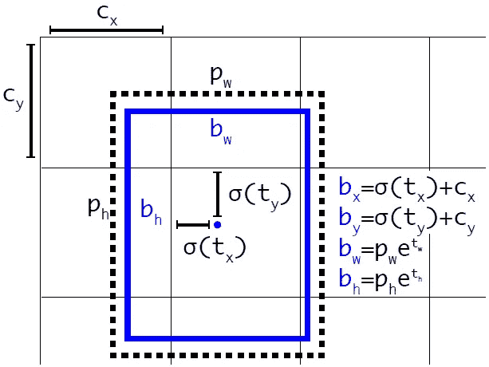
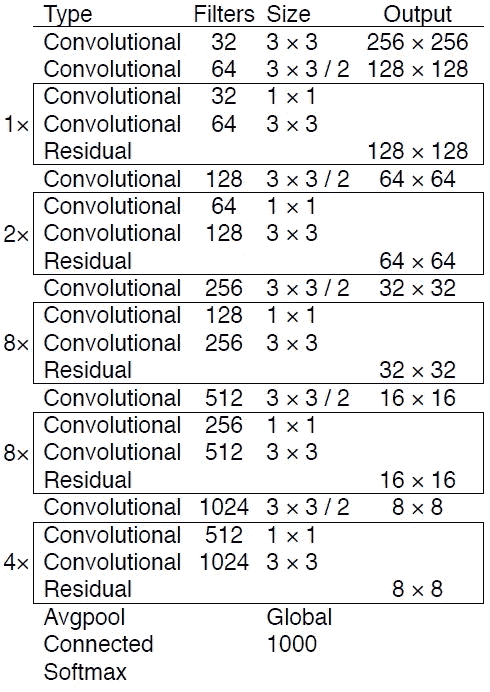
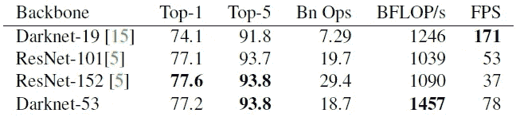
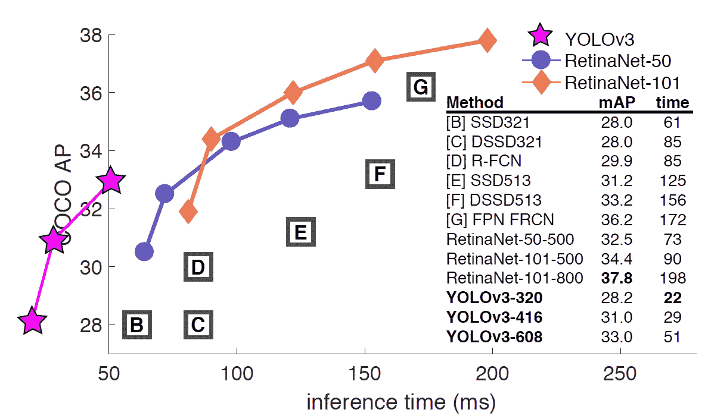
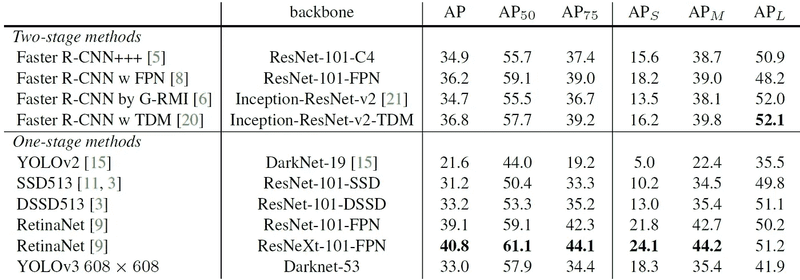
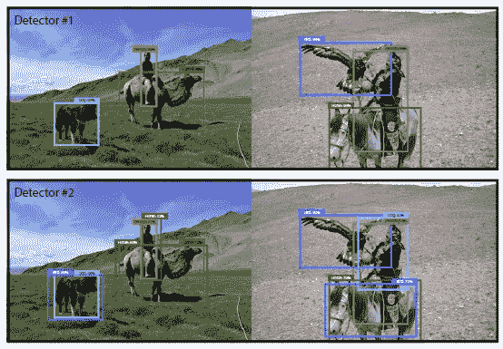

# 复习:YOLOv3 —你只看一次(物体检测)

> 原文：<https://towardsdatascience.com/review-yolov3-you-only-look-once-object-detection-eab75d7a1ba6?source=collection_archive---------1----------------------->

## 改进的 YOLOv2，性能与 RetinaNet 相当，速度快 3.8 倍！

**YOLOv3**

在这个故事里，**华盛顿大学**的 **YOLOv3(你只看一次 v3)** 进行了回顾。YOLO 是一个非常著名的物体探测器。我想每个人都应该知道。以下是作者的演示:

**YOLOv3**

由于作者忙于 Twitter 和 GAN，也帮助其他人的研究，YOLOv3 在 YOLOv2 上几乎没有增量改进。例如，具有快捷连接的更好的特征提取器 **DarkNet-53** ，以及具有**特征图上采样和连接**的更好的对象检测器。并作为 **2018 arXiv** 技术报告发表，引用 **200 余篇**。( [Sik-Ho Tsang](https://medium.com/u/aff72a0c1243?source=post_page-----eab75d7a1ba6--------------------------------) @中)

# 概述

1.  **包围盒预测**
2.  **班级预测**
3.  **跨尺度预测**
4.  **特征提取器:Darknet-53**
5.  **结果**

# **1。包围盒预测**

**Bounding Box Prediction, Predicted Box (Blue), Prior Box (Black Dotted)**

*   与 [YOLOv2](/review-yolov2-yolo9000-you-only-look-once-object-detection-7883d2b02a65) 相同。
*   **预测 tx，ty，tw，th。**
*   在训练期间，使用误差损失平方和。
*   并且使用逻辑回归来预测客观性分数。如果边界框先验比任何其他边界框先验与地面真实对象重叠更多，则为 1。仅为每个地面真实对象分配一个边界框先验。

# 2.类别预测

*   不使用 Softmax。
*   相反，使用**独立逻辑分类器**和**二元交叉熵损失**。因为对于多标签分类可能存在重叠标签，例如如果 YOLOv3 被移动到其他更复杂的域，例如开放图像数据集。

# 3.跨尺度预测

*   **使用了 3 种不同的刻度**。
*   特征是从这些尺度中提取出来的，像 [FPN](/review-fpn-feature-pyramid-network-object-detection-262fc7482610) 。
*   **基本特征提取器 Darknet-53** 增加了几个卷积层(下一节会提到)。
*   **这些层中的最后一层预测边界框、对象和类别预测。**
*   在 COCO 数据集上，**每个尺度 3 个框。**因此，输出张量为***N*×*N*×【3×(4+1+80)】**，即 **4 个包围盒偏移，1 个对象预测，80 个类预测**。
*   接下来，**特征图**取自前 2 层，并通过 2× 对**进行上采样。还从网络的早期获取特征图，并使用**连接**将其与我们的上采样特征合并。这其实就是典型的**编解码架构**，就像 [SSD](/review-ssd-single-shot-detector-object-detection-851a94607d11) 进化到 [DSSD](/review-dssd-deconvolutional-single-shot-detector-object-detection-d4821a2bbeb5) 一样。**
*   这种方法允许我们从上采样的特征中获得更有意义的语义信息，从早期的特征图中获得更细粒度的信息。
*   然后，**增加几个卷积层来处理这个组合的特征图**，并最终预测一个类似的张量，尽管现在大小是两倍。
*   **k-means 聚类**也用于在之前找到**更好的边界框。最后，在 COCO 数据集上，使用了 **(10×13)、(16×30)、(33×23)、(30×61)、(62×45)、(59×119)、(116×90)、(156×198)、(373×326)** 。**

# **4。特征提取器:Darknet-53**

**Darknet-53**

*   [YOLOv2](/review-yolov2-yolo9000-you-only-look-once-object-detection-7883d2b02a65) 使用 Darknet-19 分类网络进行特征提取。
*   现在，在 YOLOv3 中，**使用了更深的网络 Darknet-53** ，即 53 个卷积层。
*   [YOLOv2](/review-yolov2-yolo9000-you-only-look-once-object-detection-7883d2b02a65) 和 YOLOv3 也使用批量标准化。
*   **快捷连接**也如上图所示。

**1000-Class ImageNet Comparison (Bn Ops**: Billions of Operations, **BFLOP/s**: Billion Floating Point Operation Per Second, **FPS**: Frame Per Second**)**

*   1000 级 ImageNet Top-1 和 Top5 错误率的测量方法如上。
*   在 Titan X GPU 上使用单作物 256×256 图像测试。
*   与 [ResNet-101](/review-resnet-winner-of-ilsvrc-2015-image-classification-localization-detection-e39402bfa5d8) 相比，Darknet-53 具有更好的性能(作者在论文中提到了这一点)，速度快 1.5 倍。
*   与 [ResNet-152](/review-resnet-winner-of-ilsvrc-2015-image-classification-localization-detection-e39402bfa5d8) 相比，Darknet-53 具有相似的性能(作者在论文中提到了这一点),并且速度快 2 倍。

# 5.结果

## 5.1.可可地图@0.5

**mAP@0.5**

*   如上图，与 [RetinaNet](/review-retinanet-focal-loss-object-detection-38fba6afabe4) 相比，YOLOv3 以快得多的推理时间得到了不相上下的 mAP@0.5。
*   例如，yolov 3–608 在 51 毫秒内获得 57.9%的地图，而[retina net-101–800](/review-retinanet-focal-loss-object-detection-38fba6afabe4)在 198 毫秒内仅获得 57.5%的地图，快了 3.8 倍。

## 5.2.COCO 整体图

**Overall mAP**

*   对于整体地图，YOLOv3 的性能明显下降。
*   然而，yolov 3–608 在 51 毫秒的推理时间内获得了 33.0%的 mAP，而[retina net-101–50–500](/review-retinanet-focal-loss-object-detection-38fba6afabe4)在 73 毫秒的推理时间内仅获得了 32.5%的 mAP。
*   而 YOLOv3 与速度快 3 倍的 [SSD](/review-ssd-single-shot-detector-object-detection-851a94607d11) 变种并驾齐驱。

## 5.3.细节

**More Details**

*   YOLOv3 比 [SSD](/review-ssd-single-shot-detector-object-detection-851a94607d11) 好很多，性能和 [DSSD](/review-dssd-deconvolutional-single-shot-detector-object-detection-d4821a2bbeb5) 差不多。
*   并且发现 YOLOv3 在 AP_S 上的性能相对较好，而在 AP_M 和 AP_L 上的性能相对较差。
*   YOLOv3 比使用 [ResNet](/review-resnet-winner-of-ilsvrc-2015-image-classification-localization-detection-e39402bfa5d8) 、 [FPN](/review-fpn-feature-pyramid-network-object-detection-262fc7482610) 、 [G-RMI](/review-g-rmi-winner-in-2016-coco-detection-object-detection-af3f2eaf87e4) 和 [TDM](https://medium.com/datadriveninvestor/review-tdm-top-down-modulation-object-detection-3f0efe9e0151) 的两级更快 R-CNN 变体具有更好的 AP_S。

## 5.4.定性结果

**Nearly Exactly The Same Between Predicted Boxes and Ground-Truth Boxes**

其实技术报告中关于 YOLOv3 的细节并不多。因此，我只能简单回顾一下。读 YOLOv3 时建议在 [YOLOv2](/review-yolov2-yolo9000-you-only-look-once-object-detection-7883d2b02a65) 和 YOLOv3 之间来回。(而且还有段落讲的是整体地图的测量。“是否真的反映了实际的检测精度？”如果有兴趣，请访问该文件。)

## 参考

【2018 arXiv】【yolo v3】
[yolo v3:增量改进](https://arxiv.org/abs/1804.02767)

## 我以前的评论

)(我)(们)(都)(不)(想)(到)(这)(些)(人)(,)(我)(们)(都)(不)(想)(要)(到)(这)(些)(人)(,)(但)(是)(这)(些)(人)(还)(不)(想)(到)(这)(些)(人)(,)(我)(们)(还)(不)(想)(到)(这)(些)(人)(,)(我)(们)(们)(还)(不)(想)(到)(这)(些)(人)(们)(,)(我)(们)(们)(还)(不)(想)(到)(这)(些)(人)(,)(我)(们)(们)(还)(没)(想)(到)(这)(些)(人)(,)(我)(们)(还)(没)(想)(到)(这)(里)(来)(。 )(我)(们)(都)(不)(想)(到)(这)(些)(人)(,)(我)(们)(都)(不)(想)(要)(到)(这)(里)(去)(,)(我)(们)(还)(不)(想)(到)(这)(些)(人)(,)(我)(们)(都)(不)(想)(要)(到)(这)(里)(去)(了)(,)(我)(们)(还)(不)(想)(到)(这)(些)(人)(,)(我)(们)(都)(不)(想)(到)(这)(里)(来)(。

**物体检测** [过食](https://medium.com/coinmonks/review-of-overfeat-winner-of-ilsvrc-2013-localization-task-object-detection-a6f8b9044754)[R-CNN](https://medium.com/coinmonks/review-r-cnn-object-detection-b476aba290d1)[快 R-CNN](https://medium.com/coinmonks/review-fast-r-cnn-object-detection-a82e172e87ba)[快 R-CNN](/review-faster-r-cnn-object-detection-f5685cb30202)[DeepID-Net](/review-deepid-net-def-pooling-layer-object-detection-f72486f1a0f6)】[R-FCN](/review-r-fcn-positive-sensitive-score-maps-object-detection-91cd2389345c)】[离子](/review-ion-inside-outside-net-2nd-runner-up-in-2015-coco-detection-object-detection-da19993f4766)[多路径网](/review-multipath-mpn-1st-runner-up-in-2015-coco-detection-segmentation-object-detection-ea9741e7c413)[NoC](https://medium.com/datadriveninvestor/review-noc-winner-in-2015-coco-ilsvrc-detection-object-detection-d5cc84e372a)

**语义切分** [FCN](/review-fcn-semantic-segmentation-eb8c9b50d2d1)[de convnet](/review-deconvnet-unpooling-layer-semantic-segmentation-55cf8a6e380e)[deeplab v1&deeplab v2](/review-deeplabv1-deeplabv2-atrous-convolution-semantic-segmentation-b51c5fbde92d)[parse net](https://medium.com/datadriveninvestor/review-parsenet-looking-wider-to-see-better-semantic-segmentation-aa6b6a380990)】[dilated net](/review-dilated-convolution-semantic-segmentation-9d5a5bd768f5)[PSP net](/review-pspnet-winner-in-ilsvrc-2016-semantic-segmentation-scene-parsing-e089e5df177d)[deeplab v3](/review-deeplabv3-atrous-convolution-semantic-segmentation-6d818bfd1d74)

**生物医学图像分割** [[cumed vision 1](https://medium.com/datadriveninvestor/review-cumedvision1-fully-convolutional-network-biomedical-image-segmentation-5434280d6e6)][[cumed vision 2/DCAN](https://medium.com/datadriveninvestor/review-cumedvision2-dcan-winner-of-2015-miccai-gland-segmentation-challenge-contest-biomedical-878b5a443560)][[U-Net](/review-u-net-biomedical-image-segmentation-d02bf06ca760)][[CFS-FCN](https://medium.com/datadriveninvestor/review-cfs-fcn-biomedical-image-segmentation-ae4c9c75bea6)][[U-Net+ResNet](https://medium.com/datadriveninvestor/review-u-net-resnet-the-importance-of-long-short-skip-connections-biomedical-image-ccbf8061ff43)

**实例分割
[[深度掩码](/review-deepmask-instance-segmentation-30327a072339) ] [ [锐度掩码](/review-sharpmask-instance-segmentation-6509f7401a61) ] [ [多路径网络](/review-multipath-mpn-1st-runner-up-in-2015-coco-detection-segmentation-object-detection-ea9741e7c413) ] [ [MNC](/review-mnc-multi-task-network-cascade-winner-in-2015-coco-segmentation-instance-segmentation-42a9334e6a34) ] [ [实例中心](/review-instancefcn-instance-sensitive-score-maps-instance-segmentation-dbfe67d4ee92) ] [ [FCIS](/review-fcis-winner-in-2016-coco-segmentation-instance-segmentation-ee2d61f465e2)**

)( )( )( )( )( )( )( )( )( )( )( )( )( )( )( )( )( )( )( )( )( )( )( )( )( )( )( )( )( )( )( )( )( )( )( )( )( )( )( )( )( )( )( )( )( )( )( )( )( )( )( )( )( )( )( )( )( )( )( )( )( )( )( )( )( )( )( )( )( )( )( )( )( )( )( )( )( )( )( )( )( )( )( )( )( )( )( )( )( )( )( )( )( )( )( )( )( )( )( )(