# 查看 Python 可视化包

> 原文：<https://towardsdatascience.com/reviewing-python-visualization-packages-fa7fe12e622b?source=collection_archive---------1----------------------->

## 哪些解决方案在哪些情况下是好的？

使用 Python 创建图形的方法有很多，但是哪种方法是最好的呢？当我们进行可视化时，问一些关于图形目标的问题是很重要的:你是想对你的数据有一个初步的感觉吗？也许你正试图在一次演讲中给某人留下深刻印象？也许你想给别人展示一个内在的形象，想要一个中庸的形象？在这篇文章中，我将介绍一些流行的 Python 可视化包，它们的优缺点，以及它们各自的优势所在。我将把这次审查的范围扩大到 2D 图，为 3D 图形和仪表板留有余地，尽管这些包中有许多对两者都支持得相当好。

# Matplotlib、Seaborn 和 Pandas:

我将这些放在一起有几个原因，首先是 Seaborn 和 Pandas 绘图是建立在 Matplotlib 之上的——当你在 Pandas 中使用 Seaborn 或 df.plot()时，你实际上是在利用人们用 Matplotlib 编写的代码。由此产生的美感是相似的，定制你的情节的方式会使用相似的语法。

当我想到这些可视化工具时，我会想到三个词:探索性数据分析。这些软件包对于初步了解您的数据来说非常棒，但在演示方面却很欠缺。Matplotlib 是一个低级的库，允许不可思议的定制级别(所以不要简单地将其排除在演示之外！)，但是还有许多其他工具可以使具有演示价值的图形变得更加容易。Matplotlib 也有一套[风格选择](https://matplotlib.org/users/style_sheets.html)，模仿其他流行的美学，如 ggplot2 和 xkcd。下面是一些使用 Matplotlib 及其类似工具制作的图表示例:

在处理篮球工资数据时，我希望找到工资数据中值最高的球队。为了表明这一点，我用颜色标记了一个条形图，下面是每个球队的工资，以显示球员应该加入哪个球队，才能加入一个工资高的球队。

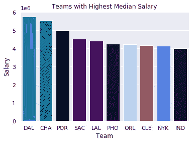

第二个图是回归实验残差的 Q-Q 图。这种可视化的主要目的是展示，即使美学并不令人瞠目结舌，也只需要很少的线条就能做出有用的可视化效果。

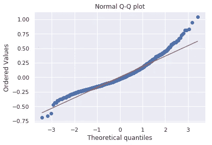

最终，Matplotlib 及其相关产品非常高效，但通常不是演示的最终产品。

# ggplot(2):

我呻吟着写道。“Aaron，你为什么要谈论最流行的 R 可视化软件包 ggplot？这不是 Python 包审核吗？”你可能会问。开发人员用 Python 实现了 ggplot2，复制了从美学到语法的一切。从我看到的所有材料来看，它看起来和感觉上都像 ggplot2，但有一个额外的好处，即依赖于 Pandas Python 包，该包最近否决了一些导致 ggplot 的 Python 版本不相关的方法。如果你想在 R 中使用真正的 ggplot(它有所有相同的外观、感觉和语法，没有依赖性)，[我在这里讨论它的一些额外好处](/how-to-transfer-sql-knowledge-to-r-e9ec951f33dc)！也就是说，如果你真的必须在 Python 中使用 ggplot，你必须安装 Pandas 版本 0.19.2，但是我要警告不要降级你的 Pandas，这样你就可以使用一个劣质的绘图包。

使 ggplot2(我猜还有 Python 的 ggplot)改变游戏规则的是他们使用“图形的语法”来构造图形。基本前提是，您可以实例化您的绘图，然后单独向其添加不同的功能，即标题、轴、数据点和趋势线都是单独添加的，具有各自的美学属性。下面是一些 ggplot 代码的简单示例。首先，我们用 ggplot 实例化我们的图形，设置我们的美学和数据，然后添加点、主题和轴/标题标签。

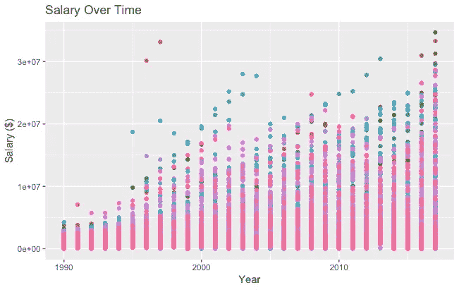

# 散景:

散景很美。在概念上与 ggplot 类似，它使用图形的语法来构造图形，Bokeh 有一个易于使用的界面，可以制作非常专业的图形和仪表板。以*说明*我的观点(抱歉！)，下面是从 538 男子气概调查数据集制作直方图的代码示例。

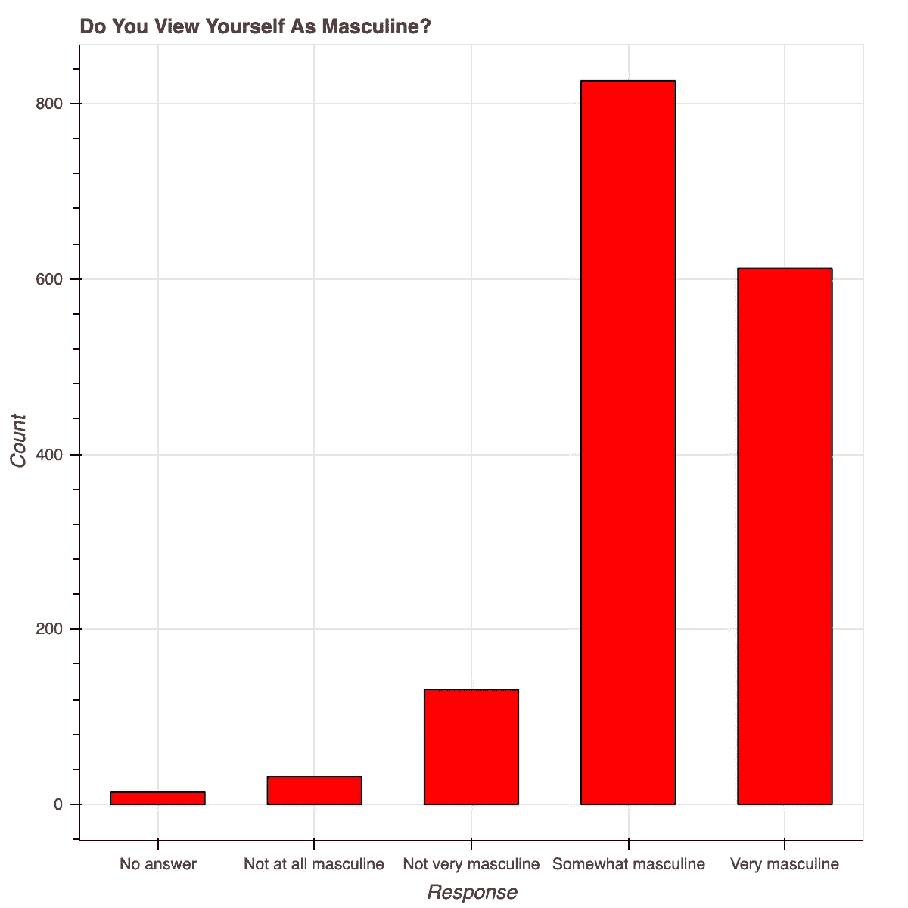

Using Bokeh to represent survey responses

左边的条形图显示了 538 在最近的一次调查中对“你认为自己是男性吗”这个问题的回答。第 9–14 行中的散景代码创建了一个优雅而专业的响应计数直方图，具有合理的字体大小、y 刻度和格式。我写的大部分代码都用来标记轴和标题，以及给条块加上颜色和边框。当制作漂亮、像样的人物时，我非常倾向于使用散景——很多美学工作已经为我们完成了！

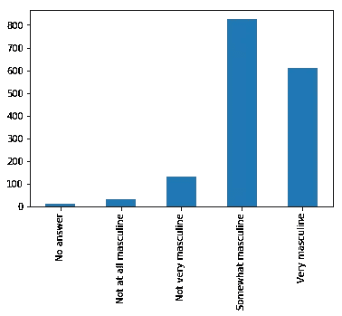

Using Pandas to represent the same data

左边的蓝色图是来自上面要点的第 17 行的一行代码。两个直方图具有相同的值，但是用于不同的目的。在探索性的环境中，用熊猫写一行来查看数据要方便得多，但是散景的美学显然更胜一筹。散景提供的每一个便利都需要在 Matplotlib 中进行定制，无论是 x 轴标签的角度、背景线、y 轴刻度、字体大小/斜体/粗体等。下图显示了一些随机趋势，其中使用了图例和不同的线型和颜色进行了一些自定义:

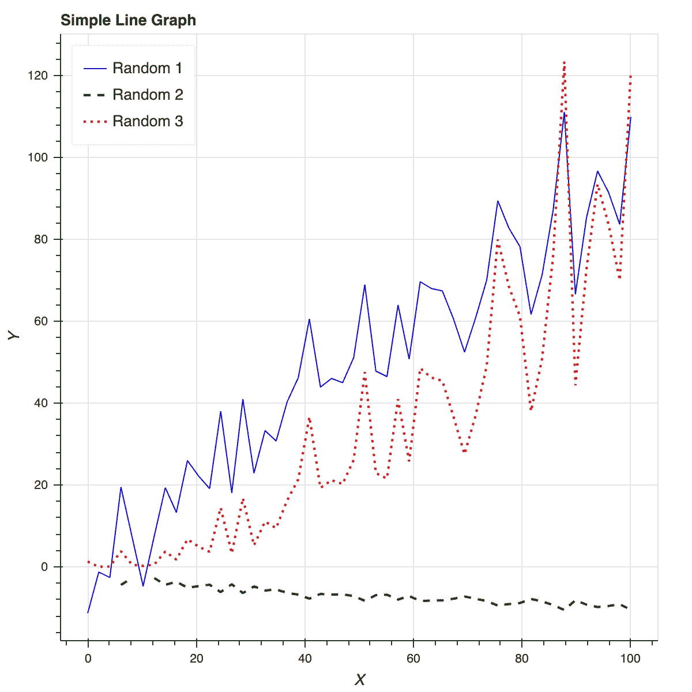

散景也是制作交互式仪表盘的好工具。我不想在这篇文章中讨论 dashboarding，但有一些很棒的文章( [**就像这个**](/data-visualization-with-bokeh-in-python-part-iii-a-complete-dashboard-dc6a86aa6e23) )更深入地讨论了散景仪表板的应用和实现。

# Plotly:

Plotly 非常强大，但设置和创建图形都需要大量时间，而且都不直观。在花了大半个上午的时间研究完 Plotly 之后，我去吃午饭，结果几乎一无所获。我创建了一个没有轴标签的条形图和一个“散点图”,其中有我无法删除的线条。开始使用 Plotly 时有一些值得注意的缺点:

*   它需要一个 API 密钥和注册，而不仅仅是一个 pip 安装
*   它打印 Plotly 特有的非直观的数据/布局对象
*   剧情布局对我来说还没起作用(40 行代码字面上什么都没有！)

然而，对于它的所有设置缺点，也有优点和解决方法:

*   您可以在 Plotly 网站以及 Python 环境中编辑地块
*   对交互式图形/仪表板有很多支持
*   Plotly 与 Mapbox 合作，允许定制地图
*   伟大的图形有惊人的整体潜力

对我来说，只是抱怨 Plotly 而不展示一些代码和我能够完成的与更有能力使用这个包的人所做的相比是不公平的。

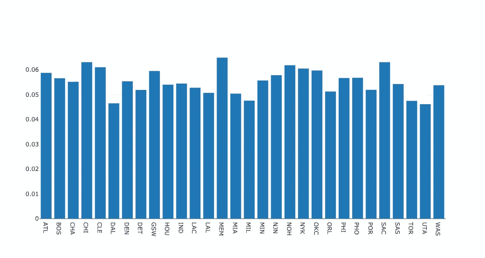

A bar graph representing average turnovers per minute by different NBA teams

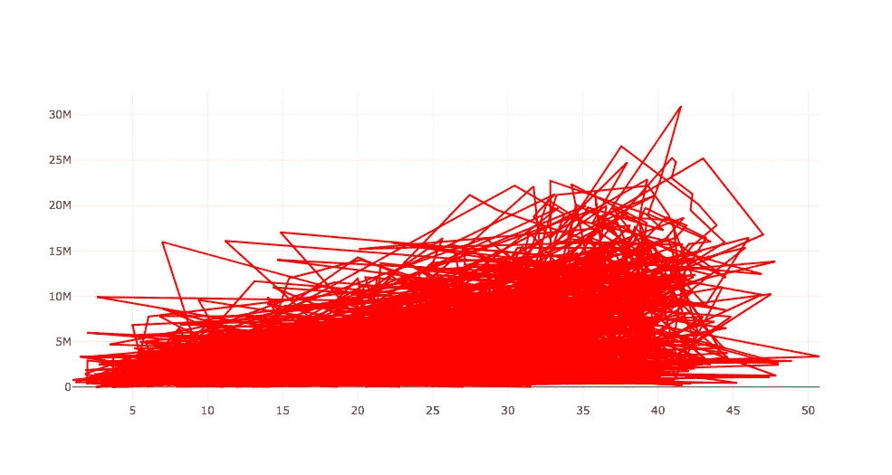

An attempt at a scatterplot representing salary as a function of playing time in the NBA

总的来说，开箱即用的美学看起来不错，但是多次尝试修复轴标签，逐字复制文档，没有产生任何变化。然而，正如我之前承诺的那样，这里有一些展示 Plotly 潜力的情节，以及为什么花几个小时以上可能是值得的:

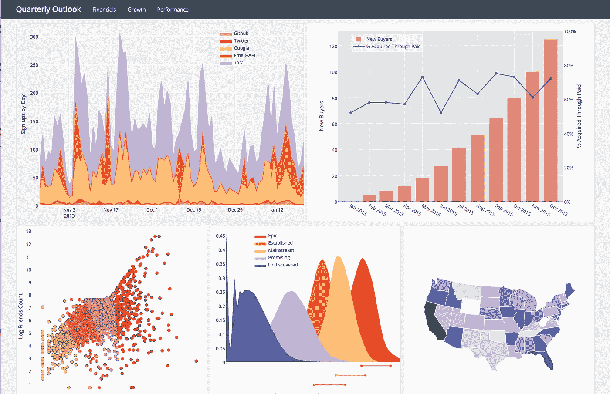

Some sample plots from [the Plotly page](https://plot.ly/products/on-premise/)

# Pygal:

Pygal 是一个鲜为人知的绘图包，和其他流行的包一样，它使用图形框架的语法来构造图像。这是一个相对简单的软件包，因为绘图对象非常简单。使用 Pygal 非常简单:

1.  举例说明你的身材
2.  使用图形对象的属性格式化
3.  使用 figure.add()符号将数据添加到图形中

我和 Pygal 之间的主要问题是如何渲染这些数字。我必须使用他们的 render_to_file 选项，然后在 web 浏览器中打开该文件，看看我构建了什么。它最终是值得的，因为数字是互动的，有一个愉快的和容易定制的美感。总的来说，这个包看起来不错，但是有一些文件创建/渲染的怪癖限制了它的吸引力。

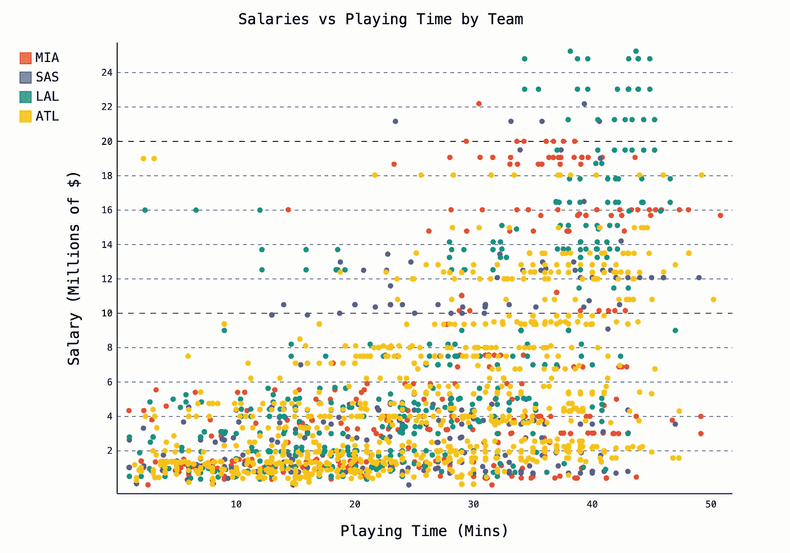

# 网络 x:

Networkx 是分析和可视化图形的一个很好的解决方案，尽管它在视觉上基于 matplotlib。图形和网络不是我的专业领域，但是 Networkx 允许快速简单地用图形表示连接的网络。下面是我构建的一个简单图形的几种不同表示，以及一些开始绘制一个小型脸书网络的代码。

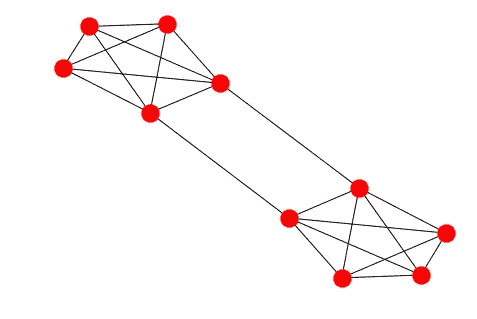

我用编号(1-10)对每个节点进行颜色编码的代码如下:

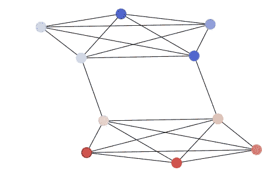

下面是我写的用来可视化上面提到的稀疏脸书图的代码:

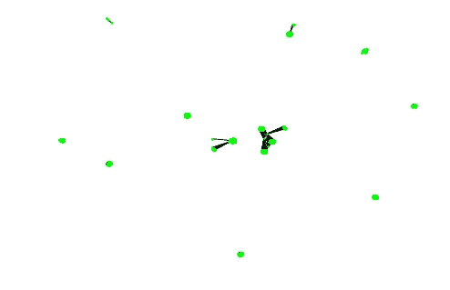

This graph is quite sparse, Networkx shows it by giving each cluster maximum separation

有这么多的软件包来可视化数据，但没有明确的最佳软件包。希望在阅读完这篇评论后，您可以看到各种美学和代码如何适用于不同的情况，从 EDA 到演示。