# 使雪花与众不同的革命性特征——深度潜水

> 原文：<https://towardsdatascience.com/revolutionary-features-of-snowflake-that-sets-it-apart-a-deep-dive-773ba52ee694?source=collection_archive---------12----------------------->

## 雪花提供了足够的功能来投入时间和资源吗？有周围炒作的那么好吗？让我们深潜，看看是什么让它与众不同。

最近，我有机会参加在悉尼举行的雪花峰会。我学到了一些东西，并想在实际数据上尝试一下。起初是试探性的，但在对 40GB 的数据使用它后，我意识到有一些功能使雪花在市场上与 Redshift，Azure SQL 或类似的 MPP 数据仓库竞争。

因此，这篇文章涵盖了 snowflake 的一些特性，这些特性在其他 MPP 仓库中要么没有实现，要么部分实现，或者工程师在进行 ETL 时必须实现，还有一些特性是很好的，但如果没有，也不会产生任何影响。

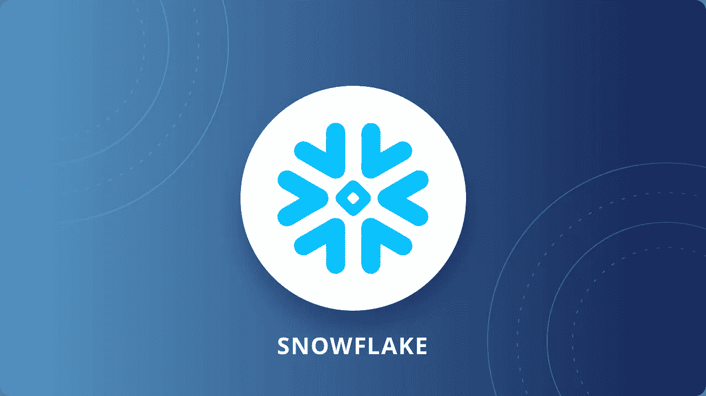

# **区分特征**

排名不分先后，以下是一些有用的特性，这些特性让雪花有别于其他 MPP 仓库。

**克隆桌子**

雪花称之为‘零拷贝克隆’。雪花的区别特征之一。让我们来看一个用例，工程师或分析师必须克隆一个表，要么进一步修改它，要么只对它进行快照。现在，正如我们所知，任何 MPP 仓库都会创建表的深层副本，这会消耗额外的空间，而当您在雪花中克隆它时，它只会将原始表的指针存储在新表中。换句话说，数据实际上是相同的，但是通过两个不同的表引用。

现在，当您更改新表时，它将只存储该列，而其余的列仍然使用相同的指针。因为，雪花像其他 MPP 仓库一样，以列格式存储数据，这个特性变得非常有用。

**放下&取消放下桌子**

顾名思义，可以在这个命令的帮助下*取消*已删除的表格。如果您有一个工程师正在处理一个对资源有 drop 访问权限的表，并且意外地删除了它，那么这个特性可能会很有用。起初，这个特性没有任何意义，因为您不会将 drop 访问权授予无意中删除了一个有用表的工程师。但是考虑到一些公司更喜欢对他们的数据环境采用分散的方法，你可能会遇到由不太有经验的人来处理不同的账户，这些人可能会在他们的实例中丢失一个有用的表。相信我，这种事情现在已经发生了很多次了。

因此，以下命令允许您取消删除表格:

```
Undrop table {table_name};
```

一旦执行了上述命令，输出/结果窗格将显示以下响应。

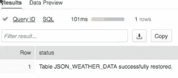

默认情况下，雪花有 24 小时的时间来取消桌面，但如果您使用企业版，则有 90 天的时间。

**提交后回滚一个表**

本质上，这个特性是对 *update* 语句的回滚，即使是在提交之后。或者换句话说

```
update {table_name} set {column_name} = ‘value’;
```

**更改基于每个查询的计算**

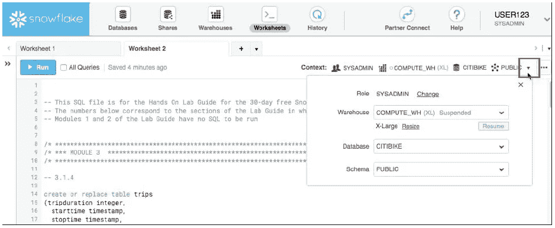

正如在上面的窗口中可以看到的，我们可以在执行特定查询之前更改集群配置，以便让雪花使用更高的计算能力，如果我们将要执行的查询是繁重的，反之亦然。因此，当您想要运行查询时，只需选择查询，更改仓库并单击 run。最好的部分是您可以将它包含在您的 ETL 中，并充分利用它。我将把它留给你去探索。是的，这里的仓库和我们所知道的有所不同。

**自动缩小比例**

所以，这确实引起了我的注意。在深入研究这一点之前，让我首先告诉您，雪花就是这样一种数据仓库功能，其中计算和存储是分开计费的。或者换句话说，如果集群(这里是仓库)在不使用的时候被挂起，那么您将会节省很多钱。

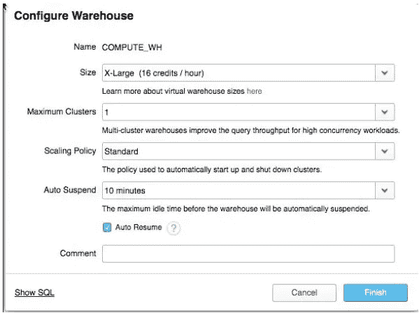

在配置仓库时，您可以指定 Auto suspend 特性，这实际上意味着如果集群在特定时间内处于非活动状态，它的计算将缩减到 none。您还可以指定扩展策略，以便动态地来回扩展集群/仓库。最棒的是，您甚至可以通过脚本动态缩放它。

**所有云提供商集中在一个地方**

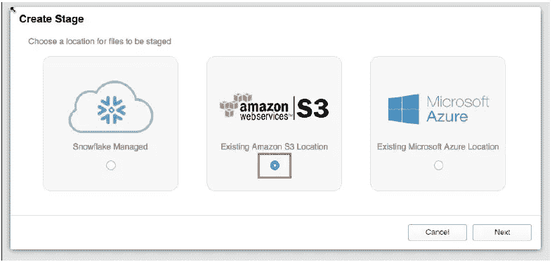

您需要让雪花知道数据当前存放的现有暂存区域。最好的部分是我们可以在数据库中有一个模式，它指向 AWS 中的 s3 位置，而其他模式可以指向 Azure blob。通过单击“Create ”,您可以创建让您选择 s3 位置的模式。对于 Azure Blob 也是如此。

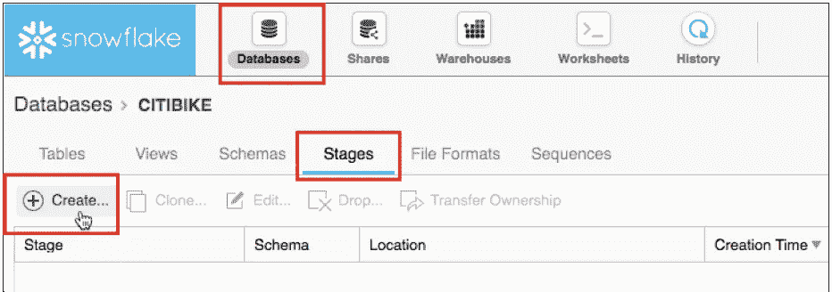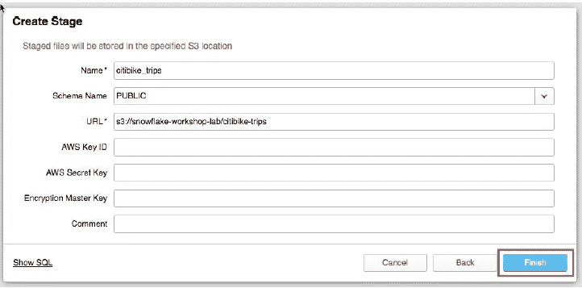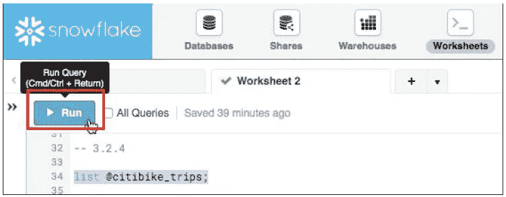

当您运行如上所示的查询时，它将显示特定路径下的所有键/文件/blob。

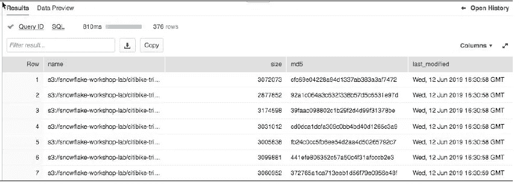

据我所知，谷歌云存储的整合还在进行中，很快就会推出。

也可以使用以下命令创建阶段:

```
create stage {stage_name} url = {s3_location};
```

**复制拼花文件**

在写这篇文章的时候，AWS 在 Copy 语句中没有 parquet 选项，你需要启动 ADLA 在 Azure 中做同样的事情。而在 snowflake 中，您可以借助以下步骤将 staging 中的拼花数据复制到表中:

首先，您需要创建文件格式，这实质上是您让雪花知道的模式，以便它在将数据加载到表中之前正确地解析数据。

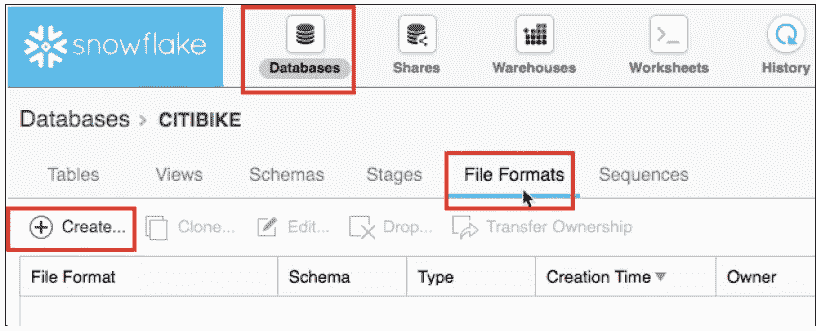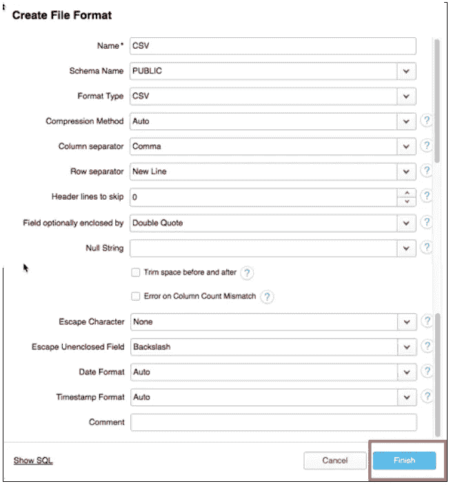

在这里，您可以指定格式类型(拼花)、压缩、分隔符等。这些选项或多或少与 Redshift Copy 语句中的选项相同。

**在加载到表格**之前查看 s3 数据

Snowflake 允许您在将临时区域加载到表中之前查询它。它会让您知道暂存区中有哪些记录。我会让你知道怎么做。不用说，这对于避免表中的加载错误非常有帮助。

# **有特色真好**

这些是 snowflake 中的特性，在其他 MPP 仓库中也很好，但是如果没有这些特性也不会有太大的不同。

**缓存查询结果**

雪花缓存过去 24 小时内执行的每个查询的结果。因此，除非表中的下划线数据已经改变，否则相同的查询将给出相同的结果。然而，除非数据发生变化，否则几乎没有任何人需要再次执行相同查询的情况，但不管怎样，拥有这个特性还是很好的。

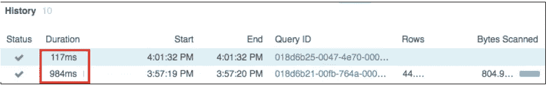

当您检查历史记录时，可以看到第二个查询比第一个查询执行得快得多，而两个查询完全相同。

**在一个用户界面中进行计算、操作和存储**

大多数云提供商已经处理了计算、操作和存储，但是当您想要了解集群配置时，您必须单独打开云提供商的门户来查看。而在 snowflake 中，同一个窗口将给出执行了什么查询，什么时候执行的，以及通过哪个集群配置执行的。都在一个地方。再说一遍，有功能是好事，但没有增加多少价值。

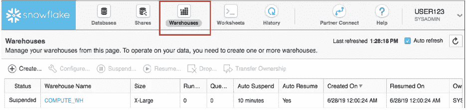

在上面的窗口中,“Warehouses”窗格将让您知道什么是集群配置,“Databases”将列出具有所需功能(如 create)的数据库，Worksheets 实际上是它的 SQL 编辑器,“History”给出了过去 1 年中执行的查询列表,“Shares”将让您知道您共享了什么以及与谁共享了什么。

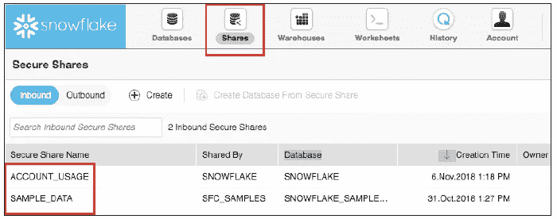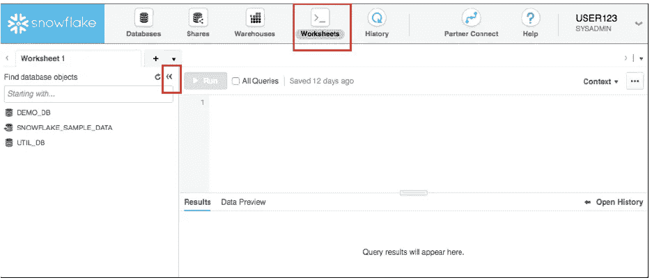

**历史浏览界面**

到目前为止，如果我们需要从历史中提取值，要么我们需要运行系统查询，要么创建一个单独的 ETL，它接收历史日志并将数据推入所需的历史表中。但是在 snowflake 中，您可以查看您和其他用户(如果您是 sysadmin 或更高级别的用户)在过去 1 年中执行的查询列表。从数据治理的角度来看，这是一个有用的特性。

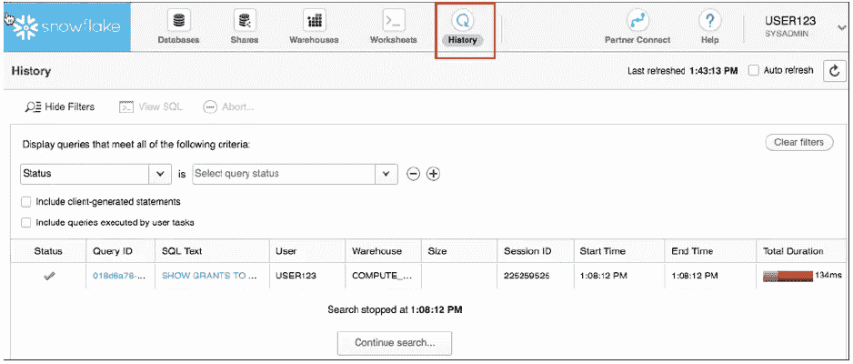

**转换角色**

如果您是 sysadmin 或 accountadmin，您可以承担其他角色，并检查您创建的角色是否具有足够的治理。

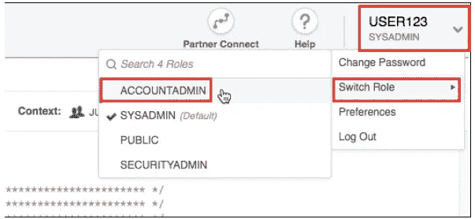

**共享表到另一个账户**

我们经常会遇到这样的情况，我们需要与分析师、数据科学家或业务分析师共享一个特定的表，而这个团队有一个不同的雪花帐户。雪花让您安全地共享表，以便其他团队可以根据需要处理数据。

# 包裹

我不应该称之为特色，而应该称之为实践。Snowflake 试图促进的一个实践是，它有目的地让您在冷存储中创建暂存区，以便您可以在将数据加载到其中之前看到数据的样子。这是一个非常有用的实践，但恐怕还没有多少公司采用。然而，现在，结果窗口只显示最近的结果，并且 GUI 没有能力提供选项卡式的多个结果来比较一个输出与另一个输出。从我的角度来看，这是 snowflake 目前缺乏的一个主要特性，但我不能责怪他们，因为没有其他云供应商将 sql 编辑器完全嵌入其中，更不用说多个查询结果了。

最后，我只在 40GB 的数据上使用了它，没有机会在我们 20TB 的数据仓库上使用它，但据我所知，如果不明智地使用，雪花会变得有点昂贵。好吧，伟大的特性是有代价的。