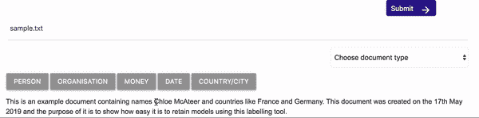

# 革新编辑——我最后一年的项目

> 原文：<https://towardsdatascience.com/revolutionising-redaction-my-final-year-project-fe664e28ef84?source=collection_archive---------22----------------------->

现在，随着法规的重大变化，确保个人数据的安全并仅由正确的人查看变得更加重要。由于这是一个现在如此热门的话题，我非常渴望在最后一年的项目中挖掘这个日益增加的问题。

我目前正在贝尔法斯特皇后大学完成我最后一年的软件工程学习，并且得到了 T2 凯诺斯公司的赞助来完成这个项目。在这篇博客中，我计划带你开始我的项目之旅，包括它的必要性和所用技术的高层次概述。

# 那么，问题是什么呢？

修订是从文档中删除敏感信息的实际过程，它需要跨许多不同的行业来完成。它通常需要有人手动逐字浏览文档，寻找要删除的敏感信息，这当然是一项非常耗时、乏味且容易出现人为错误的任务

我相信我们都见过一些文档，它们看起来是这样的:

编校的一个主要问题是，当许多单词被删除时，文档的整个上下文可能会丢失。

# 我的解决方案

这个项目的总体目标是识别和删除文档中的敏感信息，同时仍然保留其整体上下文。该项目分为 3 个主要特点:

1.**自动校订器**——旨在获取用户的文档，自动识别和替换敏感词，并向他们呈现文档的校订副本

2.**用户选择修订** —旨在获取用户的文档，自动识别敏感词，并将这些词发送回用户，让他们选择要删除哪些词。

3. **Labeller** —旨在使重新训练模型识别更多单词的过程更加容易和快速。

# 如何识别敏感词？

这个项目围绕着识别文档中敏感词的能力。为此，我正在利用自然语言处理(NLP)，这是人工智能的一个子领域，它是计算机处理、分析和理解人类语言的能力。

在 NLP 中，该项目特别关注命名实体识别(NER ),它搜索文本主体并将命名实体分类到预定义的类别中。这些类别可以是不同类型的敏感词，例如人名、组织、货币价值、位置和日期。

为了帮助我完成这项任务，我遇到了一个非常棒的开源 python 库，名为 [spaCy](https://spacy.io) ，这是一个用于高级自然语言处理的库。

spaCy 是惊人的，有助于通过一系列语言注释显示文本的语法结构。它可以识别关于文本的不同属性，例如:基本单词形式；如果单词包含字母字符或数字；句子边界检测，并可以标记词类，例如，如果该词是名词，动词，形容词等。

# 处理不同类型的文档

由于修订发生在如此多不同类型的行业，我希望该项目能够迎合可能上传的不同风格的文档。例如，法律文件中的措辞可能与医院报告中的不同。为了能够处理这个问题，我需要利用多种人工智能模型——但这些是什么呢？

人工智能模型是二进制数据，这些数据是通过向系统展示足够多的例子来产生的，这些例子使系统能够做出跨语言的预测。对于这个项目，我使用了默认的[空间模型](https://spacy.io/usage/models)，并以我自己的训练数据为基础。

该项目由三个独立的模型组成，因此可以使用特定于领域的模型来编辑文档。比如说；如果用户正在上传法律文档，它将使用专门针对法律文档训练的模型。该项目包含的三个模型是法律、保险和一般模型。

# 自动编辑程序

项目中的主要功能之一是自动编校器。我已经建立了它，以便一旦用户上传一个文件，他们需要选择其类型，如法律，保险或一般，为应用程序找出应该使用哪个模型。

一旦文档被上传，就会发生一系列不同的过程，以便对文档中不同类型的单词/短语进行预测。如果你有兴趣听到更多关于这个过程的信息，深入的描述和例子可以在[这里](https://spacy.io/usage/linguistic-features)找到。

我使用自动编校器的主要目的是让它不仅能删除文档中的敏感信息，还能保留文档的上下文。为了达到这个目的，一旦敏感词被识别出来，我就用它们的标签来代替它们。例如，如果一个名字被识别出来，它就会被删除，取而代之的是“人”这个词。这确保了文档的内容仍然完好无损，但是文档不再包含任何敏感信息。

# 用户选择编辑

在最初的项目研究中，我发现有时并不是所有的敏感词都需要从文档中删除。例如，如果一家企业与某个特定的客户合作，可能需要删除关于该客户的信息，但可以保留关于企业本身的信息。

为了能够处理这个用例，我创建了一个名为用户选择修订的功能，它通过让用户选择预览已经识别的敏感词来工作。

当用户上传文档时，如果他们选择了预览选项，那么已经被模型识别的敏感词列表将被发送回给他们。

然后，用户可以简单地选择他们想要从文档中删除的单词。然后，只有选中的单词会被它们的标签替换，用户会收到可以下载的修订文档的副本。

# 再培训模型

这个项目的另一个主要功能是贴标机。我构建了这个工具，试图让重新训练模型识别更多单词的过程变得更容易、更快。

重新训练模型不是让它们记住更多的例子，而是让单个模型改进它们的算法，以便它们可以用于概括越来越多的文档。在自动编校器中，模型根据他们看到的文档进行预测，因此提高识别文档中所有敏感词的准确性的唯一方法是用更多的数据进行重新训练。

标签器允许用户通过选择一个单词，然后点击他们希望分配给它的标签的按钮来高亮显示该单词。

为了实际使用这些单词来重新训练现有的模型，需要获取与整个文件相关的每个单词的开始索引和结束索引。这些索引和每个敏感词的标签用于与原始文件一起建立训练数据。

在不涉及太多细节的情况下，该过程获取训练数据中的每个单词，并使用该模型对它认为该单词是什么命名实体进行预测，然后查看训练数据中该单词所附的标签，以查看该预测是否正确。如果预测不正确，它会调整其权重，以便下次获得正确的结果。然后，对模型的更新被保存到模型中以更新它。

# 项目完成

完成后，可以清楚地看到，像这样的项目在私营和公共部门都有很大的潜力，因为它可以在符合 GDPR 标准的位置呈现文本数据。

这个项目不仅使编辑过程更快更容易，而且也有可能成为人工智能行业的革命。当数据包含敏感信息时，很难找到可用的数据来训练人工智能模型。目前，有许多任务人工智能可以协助，但不能，因为所需的数据集包含个人信息，导致它是可牺牲的。有了这样的产品，数据集很容易被匿名化，因此可以被使用。

接近完成时，该项目被列为久负盛名的 Megaw 纪念讲座的决赛选手之一，这是皇后大学内部的一项竞赛，面向电子、电气工程和计算机科学学院的所有毕业班学生开放，以展示他们的毕业班项目。

在介绍了该项目的业务需求和创建该项目所使用的技术后，该项目被评为总赢家，并由[工程技术研究院](https://www.theiet.org) (IET)授予 Megaw 纪念奖。

我还想说，我非常感谢 Kainos 赞助这个项目，并为我提供了[乔丹麦克唐纳](https://twitter.com/jordantoaster)作为项目导师，他在整个项目期间的指导是非常宝贵的。