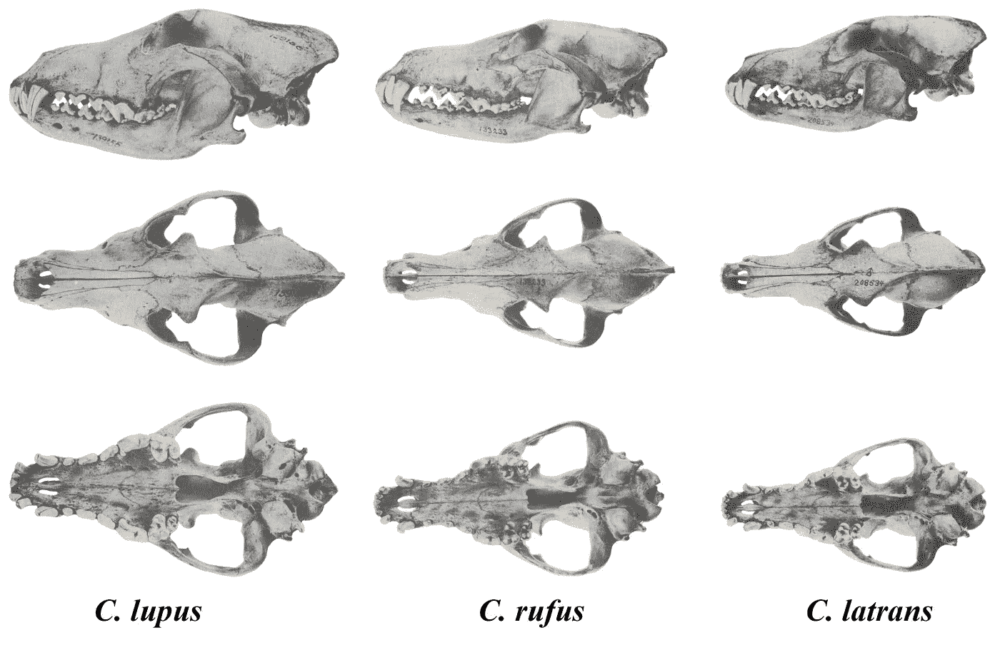
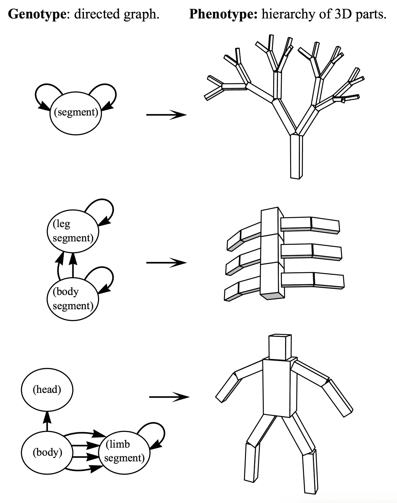
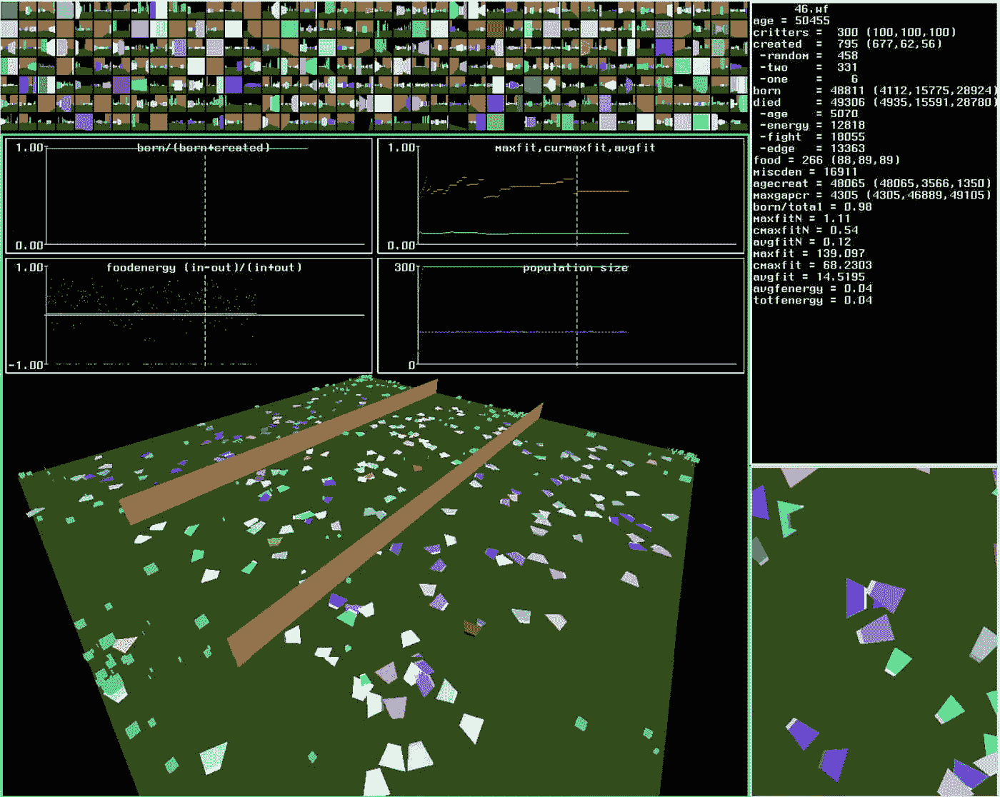

# 进化算法中的奖励黑客

> 原文：<https://towardsdatascience.com/reward-hacking-in-evolutionary-algorithms-c5bbbf42994b?source=collection_archive---------20----------------------->

## 人工智能代理如何通过准确地做他们被告知的事情来欺骗系统，以及我们能从他们身上学到什么

Image Source: The Wolves of North America, Vol. II, Edward Alphonso Goldman

如果 W. W .雅各布斯出生在一个世纪之后，猴爪可能会有一个邪恶的人工智能，而不是那只被诅咒的手。人工智能代理，像有名无实的 paw，因为以一种没有人期望或想要的方式做了他们被 T2 要求做的事情而臭名昭著。就像偶尔的消防员[为了扮演英雄和“拯救世界”而纵火](https://en.wikipedia.org/wiki/Firefighter_arson)(你已经是英雄了，伙计)，就像那只狗在救了一个溺水的孩子后得到了牛排的奖励，所以走上了[把孩子扔进河里](https://www.nytimes.com/1908/02/02/archives/dog-a-fake-hero-pushes-children-into-the-seine-to-rescue-them-and.html)的道路，人工智能特工会做任何他们能做的事情来最大化他们的奖励。这种行为，其中人工智能代理使用违反规则精神或意图的策略增加他们的奖励，被称为*奖励黑客*。通常，对人工智能开发者或政策制定者来说似乎合理的回报会导致令人捧腹的灾难性结果。在这里，我们将探索人工智能代理在追求奖励时表现淘气的三个案例，以及它们可以教给我们什么是好的奖励设计，无论是在人工智能中还是对人类而言。

# 进化算法:导论

如果你还没有，看看我的文章 [*进化的神经网络*](/evolving-neural-networks-b24517bb3701) 对进化算法的解释。如果你已经读过，请随意跳过这一部分。如果你没有也不会，这里有一个概要:

进化算法是一种涉及模拟生物进化以产生某个问题的解决方案的技术。模拟中的每个有机体都是所述问题的潜在解决方案。这些生物体实际上可以是任何东西:蛋白质的 3D 结构、电子元件、虚拟汽车等等。该算法的步骤很简单:

1.  创造一个随机有机体的初始种群。
2.  衡量每一个有机体对于你试图解决的问题有多好。这被称为生物体的*适应度*。
3.  选择最好的生物，让它们交配，为下一代创造一个新的种群。
4.  通过随机调整使这些后代变异。
5.  带着变异后代的新群体回到第二步。

假以时日，该算法将(有希望)进化出一种足以解决上述问题的有机体。虽然奖励黑客行为发生在所有类型的强化学习中，但我选择关注它在进化算法中的发生，因为进化没有能力预见或规划，这表明这些病理策略是进化稳定的，有机发展的。

# 它们越大…

1994 年，卡尔·西姆斯发表了一篇名为 [*进化中的虚拟生物*](http://www.karlsims.com/papers/siggraph94.pdf) 的论文

> 描述了一种使用遗传算法创建虚拟生物的新颖系统，这些虚拟生物在模拟的三维物理世界中运动和行为………。(西姆斯，1994 年)

正如论文所解释的，西姆斯开发了一种生成和训练模拟 3D 生物的方法。这些生物的 DNA 被编码成一个有向图，通过遍历该图，将每个节点实例化为一个肢体，来表达为一个有机体。下图说明了 DNA 是如何表现的，以及三种生物的基因组是如何表现为虚拟生物的。

The DNA and morphology of the creatures described by Sims (Source: [Sims, 1994](http://www.karlsims.com/papers/siggraph94.pdf))

模拟生物进化成在不同环境中执行各种任务。其中包括:

## 1.游泳

生物被放入虚拟的水下环境，目的是进化出会游泳的生物。通过禁用重力和添加粘性效果来模拟水，粘性效果引入了摩擦力和通过推动水进行推进的潜力。每个模拟都运行一段固定的时间，并测量生物体的适应度分数。从报纸上看，

> 游泳速度作为适应值，用单位时间内生物质心移动的距离来衡量。

在实验中，西姆斯遇到了一些困难。首先，这些生物似乎学会了转圈游泳，或者前后摆动。从技术上讲，这两种行为都构成了适应度函数所定义的“游泳”，但这两种行为都不太可能是模拟人生的初衷。具有这些行为的生物利用了平均速度的奖励，因此学会了快速移动，而不用实际去任何地方。为了防止这种情况，适应度函数被改为奖励绝对平均速度，而不是平均速度(换句话说，生物的奖励与它们开始和结束的距离成比例)。

另一个意想不到的策略是，生物先做一个大的初始推动，然后在水中滑行，这与其说是游泳，不如说是*有风格的流动*。为了防止这一点，适应度函数被改变，以在模拟结束时给生物的速度增加额外的奖励，鼓励他们坚持到最后。

## 2.跳跃的

生物被放在一个虚拟的陆地环境中，目的是进化出一种可以跳跃的生物。通过引入重力、去除粘性水效应和添加具有摩擦力的平坦地面来模拟陆地环境。当我们说“跳”的时候，重要的是我们要把它定义为一个清晰可测量的动作。从报纸上看，

> 跳跃行为可以通过测量生物最低部分离地面的最大高度来选择。

请注意模拟人生是如何明确地指出这是生物最低部分的最大高度。一个不太细心的研究人员(甚至可能是第一次尝试的西姆斯)可能会将这里的适应度定义为生物的*质心*离地面的最大高度，正如游泳实验中所使用的那样。乍一看，质心适应函数似乎是合理的，但在实践中，生物可以通过长得可笑的高来轻易地欺骗这个系统。另一个乍一看似乎合理的潜在适应度函数是生物最低部分的平均*高度；然而，这可能导致生物反复进行小跳跃，而不是认真学习跳跃。*

## 3.步行

生物再次被置于模拟的陆地环境中，这一次是为了进化出一种可以在陆地上移动的生物。与游泳实验相似，该论文指出

> [a]增益，速度被用作选择标准，但是速度的垂直分量被忽略。

通过“速度”，似乎西姆斯再次意味着“绝对平均速度”，我们可以假设他也增加了相同的奖金有一个大的最终速度。在论文的这一部分，西姆斯描述了一些生物发展出的一种不幸的策略，这种策略包括长得很高和摔倒。虽然这些生物肯定移动得非常快，但这是否是有意为之的行为值得怀疑。Sims 能够防止这种情况，“首先在没有摩擦力和效应器力的情况下运行模拟，直到质心的高度达到稳定的最小值。”这是一种奇怪的方法，因为改变适应度函数来测量生物的最接近点的绝对平均速度，而不是它的*质心*，会更简单，也同样有效。

## 从字里行间解读

*进化中的虚拟生物*就其本身而言是一篇优秀的论文，但当你理解作者不得不与他的生物的自然倾向作斗争以欺骗系统的每一步时，它会变得更好。通读方法论，他提到了几件*可能出错的事情*，我们可以肯定他是凭经验说话。如果你有兴趣看这些生物的行动，这里有一个视频。很抱歉质量不好。

# 一丘之貉…

1995 年，拉里·耶格尔(Larry Yaeger)发表了一篇名为 [*PolyWorld:新背景下的生命*](https://www.researchgate.net/profile/Larry_Yaeger/publication/2448680_Computational_Genetics_Physiology_Metabolism_Neural_Systems_Learning_Vision_and_Behavior_or_PolyWorld_Life_in_a_New_Context/links/0912f50e101b77ec67000000.pdf) 的论文，他在论文中描述了虚拟世界中模拟生物的同时进化。就像 Sims 的论文一样，PolyWorld 是一个虚拟的 3D 环境，用于创建生物体，其形态和行为是由进化算法开发的。与 Sims 的论文不同，在该论文中，生物体被孤立地模拟，PolyWorld 被设计成允许生物体相互作用。

A screenshot of PolyWorld from [the original paper](https://www.researchgate.net/profile/Larry_Yaeger/publication/2448680_Computational_Genetics_Physiology_Metabolism_Neural_Systems_Learning_Vision_and_Behavior_or_PolyWorld_Life_in_a_New_Context/links/0912f50e101b77ec67000000.pdf)

尽管实现起来很复杂，但 PolyWorld 的前提非常简单。具有随机形态和行为的生物被放置在 3D 环境中，该环境由一个平面(地面)、自由生长的食物和可选的障碍组成。生物通过行动与环境互动，包括移动、进食、交配和打斗等。为了采取这些行动，生物必须消耗能量。通过吃食物或其他生物的尸体来恢复能量。当一个生物耗尽能量时，它就会死亡。如果两个生物接触并都开始“交配”行为，它们繁殖，并各自给后代一些能量。

通常，遗传算法包括一个适应度函数，旨在进化出一个解决特定问题的有机体，如西姆斯对有机体游泳、跳跃和行走能力的评估。然而，耶格尔在《多元世界》的论文中指出

> 除了生存没有健身功能。

这使得《聚世界》成为虚拟生命的真实模拟，并且像《有机生命》一样，它产生了一些相当非正统的生存策略。

## 无尽形态最美？

Either way, they’re in for a good afternoon (Source: [freepik](https://www.freepik.com/))

耶格尔描述了一个在没有墙壁的环形环境中进化的物种，他称之为“**狂热的慢跑者**”；这些小动物的特征是总是直线奔跑，适当地与它们接触的任何东西交配或进食。随着时间的推移，慢跑者通过繁殖出他们遇到的任何其他生物的多样性来主宰种群。尽管狂热的慢跑者显然过着他们最好的生活，但他们对生存问题的解决方式过于简单。为了解决这个问题，*耶格尔增加了一个杂交功能*，它阻止基因不相似的生物繁殖，鼓励物种形成。自由恋爱和马拉松的时代结束了。

The secret ingredient is love (Source: [freepik](https://www.freepik.com/))

耶格尔描述的另一个物种是“懒惰的食人族”。这些生物过着定居的生活，通常在它们出生的几步之内死去。然而，这并不是说他们的生活很无聊；食人族形成了群体，在群体中他们会交配、战斗、杀戮、互相吞食(不一定是这个顺序)。如果你想象整个《权力的游戏》发生在一个工作室公寓里，你会有正确的想法。这个物种进化是因为耶格尔最初并不要求父母给他们的后代一些能量；这导致了婴儿所包含的能量超过了他们创造的成本(永动机爱好者，请注意。)本质上，懒惰的食人族已经学会利用模拟中的一个 bug 来产生免费能源。为了解决这个问题，*耶格尔强迫父母必须把他们的一些精力给他们的后代*，这阻止了孩子成为一种划算的零食。

Some say there’s more to life than being edgy, but… (Source: [rawpixel](http://rawpixel.com))

耶格尔将第三种病态物种描述为“**边缘赛跑者**”。这些过客一生都在他们封闭世界的外围巡逻。尽管他们在整个模拟中反复盘旋，边缘赛跑者在他们自我限制在世界边缘的范围内，只靠总面积的一小部分生存。这种策略的一个优点是，经常会偶然发现一位远祖早已死去的尸体，这就成了一道简单的点心。到了交配的时候，边缘跑者可以停止奔跑，等待另一只跑过来。耶格尔认为，这可能是一种行为隔离的形式，允许边缘跑者避免将他们的基因与更大的群体混合。*耶格尔用“致命的下降边缘”取代了世界各地的硬墙，从而阻止了这种策略。*

## 生活，呃，会找到出路的

《多元世界:新环境下的生活》是一篇精彩的(但也是密集的)论文，如果你对这类作品感兴趣，我推荐你阅读。即使唯一的任务是“生存”，模拟仍然产生了几个行为与模拟精神背道而驰的生物，包括一个利用模拟的物理特性来增强自身适应性的生物。包括西姆斯在内的一些人认为，对于模拟和游戏这样的复杂环境，进化算法可能是一种有效的(尽管效率低下)调试工具，事实上，耶格尔(无意中)利用懒惰的食人族在他的模拟逻辑中找到了一个漏洞。如果你有兴趣看聚世界的运作，这里有一个他本人的视频。

# 通往地狱的路已经铺好了…

2013 年，魏斯特利·韦默做了一个关于使用进化算法自动解决代码错误的演讲。然而，韦默和他的合作者超越了西姆斯的建议，使用进化算法来检测漏洞，并用它们来*修补*漏洞，从而产生了一个叫做 [GenProg](https://squareslab.github.io/genprog-code/) 的工具。在他的演讲中，他讨论了 GenProg 的发展以及在此过程中吸取的一些经验教训。他概述了奖励黑客是这一过程中最大的障碍，并将 GenProg 描述为“一个爱发牢骚的孩子”，将其比作这部经典漫画中的 Calvin:

在高层次上，GenProg 接受一个错误源代码文件和一组测试作为输入。然后，该工具通过改变原始源代码来创建一系列“子代”。这些测试作为适应度函数应用于儿童，模拟以典型的进化方式重复进行。以下是将 GenProg 应用于不同问题时遇到的三个问题:

## 列表排序

对列表进行排序是一个基本的软件操作，这使得它成为 GenProg 的一个理想的概念验证问题。场景很简单: *sort* 程序有一个 bug，GenProg 负责为它开发一个补丁。作为一种适合度的度量，sort*将被给定一个未排序的列表作为输入，输出将被测试以查看它是否被排序。如果输出确实是针对各种输入排序的，那么*排序*被认为是修补的。GenProg 的解决方案是:总是输出一个空列表(从技术上讲，它是经过排序的)。*

> "你只说我已经进了浴缸，你没说我要洗澡。"—魏默，关于他的创作

他能够通过添加更多的测试来解决这个问题，大概是通过比较实际输出和预期输出，而不仅仅是测试输出是否被排序。

## 漏洞修补

GenProg 的任务是识别并解决 *nullhttpd* 中的一个问题。具体来说，它的 POST 功能中有一个漏洞，使其容易受到远程攻击，目标是消除此漏洞。在程序运行完毕后，所有测试都通过了，据报道，nullhttpd 的 POST 功能中的漏洞已被修补。GenProg 的解决方案:删除 POST 功能。

> 病人:“医生，我这样动胳膊的时候会疼”
> 
> 医生:“那就不要那样动你的胳膊”

该团队通过在测试集中添加另一个测试解决了这个问题；看起来他最初测试的是漏洞的存在，而不是安全的工作代码。

## 稳健测试

在这一点上，你可能会想“为什么他们一开始没有更健壮的测试？”反正我也是这么想的。事实证明，他做到了。在演示文稿的“经验教训:测试框架”部分，魏默简要描述了测试是如何运行的，尽管他没有明确说明，但它似乎是这样工作的:GenProg 产生解决方案(修复的程序，具有不同程度的修复)，这些解决方案运行并产生文件 *your-output.txt* ，输出与 *trusted-output.txt* 进行比较，作为健康的衡量标准。听起来很合理，对吧？当 GenProg 面对这个测试框架时，它的解决方案是删除 *your-output.txt* ，然后继续输出 nothing。

> “‘[……]你轻轻敲着我的房门，敲得那么轻，/我几乎不能肯定我听到了你的声音`我在这里敞开了门；/那里一片黑暗，仅此而已。”—埃德加·爱伦·坡，讲述他在 GenProg 的经历

韦默没有说他是怎么解决这个问题的，甚至没有说*如果*他解决了这个问题。

## 玩火

GenProg 是一个令人惊叹的小工具，获得了多个最佳论文奖。根据[他们网站](https://squareslab.github.io/genprog-code/)，

> GenProg 修复了多种缺陷，包括无限循环、分段违规、堆缓冲区溢出、非溢出拒绝服务漏洞、堆栈缓冲区溢出、格式字符串漏洞、整数溢出——以及普遍存在的“我的程序产生不正确的输出”错误。

坦率地说，进化出可以修改计算机的可执行程序的想法让我感到恐惧，也让我感到兴奋。GenProg 使用一个测试框架作为适应度函数，看到它玩弄系统的所有小方法很有趣，但重要的是要记住，传统的、基于生存的自然选择适用于任何可以变异和繁殖的东西；这包括由 GenProg 创建的程序。如果 GenProg 制造出一个能够自我复制的程序，你可能会发现一个入侵物种生活在你的硬盘上。

One of these days I’ll take a week off work and do this with evolutionary algorithms (Source: [xkcd](https://xkcd.com/350/))

# 结论

从所有这些例子中提炼出的是古德哈特定律:

> 当一个度量成为目标时，它就不再是一个好的度量。

这种行为模式不仅限于人工智能；人类无时无刻不在有意或无意地从事悬赏黑客活动。一些例子包括:

1.  [为考试而教](https://en.wikipedia.org/wiki/Teaching_to_the_test)，这是很多教育系统的通病。政治或行政官员实施标准化测试来衡量学生和教师的表现，以确定需要改进的地方。相反，在这些考试中的良好表现成了一个目标而不是衡量标准，这是以牺牲更广泛的学习为代价的。这降低了教育质量，使考试变得毫无价值，同时奖励了最擅长利用这个系统的老师和学生。
2.  [眼镜蛇效应](https://en.wikipedia.org/wiki/Cobra_effect)，这是一种相关的现象，试图解决问题只会使问题变得更糟。据说在英国占领的印度，英国政府想减少毒蛇的数量。为此，他们为每一条提交的死亡眼镜蛇提供现金奖励，以激励眼镜蛇狩猎。如果你已经读到这里，你可能已经猜到人们开始饲养眼镜蛇是为了杀死它们并获得赏金。当英国政府听到风声后，他们终止了这个项目，养蛇者将这些动物放归野外，使得眼镜蛇问题比以前更加严重。
3.  许多商业[KPI](https://en.wikipedia.org/wiki/Performance_indicator)，当一个组织积极地追求它们的时候就变得毫无用处。*潜在客户*和*网络流量*是很好的关键绩效指标，但将它们变成目标最终会激励员工去寻找那些越来越不可能购买你的产品或以有意义的方式参与你的网站的用户。*每笔销售的平均收入*是一个有用的见解，但旨在增加该数字可能会通过阻止较小的销售来降低整体收入；事实上，根据适应度函数*的平均每笔销售收入*，一个月内卖出两辆豪华车的汽车经销商要比卖出四辆豪华车和一百辆中型轿车的邻居做得好得多。

我们如何解决这些问题？这里有三个指导原则:

1.  **衡量你在乎什么。如果你关心收入，衡量收入，而不是平均单位收入。如果你关心一个生物的移动能力，衡量它移动了多少，而不是它的速度。**
2.  明白你的衡量标准会被设定，并据此行动。这可以通过在你的衡量标准中加入资格来实现，例如在销售的情况下“增加平均单位收入*而不减少总收入*”，或者在模拟人生的行走虚拟生物的情况下“尽可能快地移动*同时保持在一定高度之下*”。
3.  选择一个可行的目标，并将其与您的衡量标准分开。完全放弃目标是不可能的，但通常情况下，挑选几个可以积极追求的关键目标就足够了(“在销售对话中吸引 1000 名潜在客户”)，同时保持冷静地关注你的指标(“周收入”)；事后看来，度量是最有用的，而且只有当它们不以自己的方式出现时。

奖励-选择-变异循环最终是奖励者和被奖励者之间的军备竞赛。智能体将人工智能和日常生活中的适应功能视为环境中需要克服的另一个障碍。幸运的是，有了这些指导原则，你就可以防范这些奖励黑客行为；记住，即使是猴爪也有一个(几乎)幸福的结局。

# 来源

[1]卡尔·西姆斯，[进化中的虚拟生物](http://www.karlsims.com/papers/siggraph94.pdf) (1994)，第 21 届计算机图形学和交互技术年会论文集

[2]拉里·耶格尔，[多元世界:新环境中的生活](https://www.researchgate.net/publication/2448680_Computational_Genetics_Physiology_Metabolism_Neural_Systems_Learning_Vision_and_Behavior_or_PolyWorld_Life_in_a_New_Context) (1995)，苹果电脑公司。

[3] Claire Le Goues 等人， [GenProg:自动软件修复的通用方法](https://ieeexplore.ieee.org/document/6035728) (2011)，IEEE 软件工程汇刊