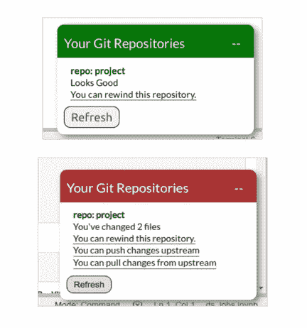
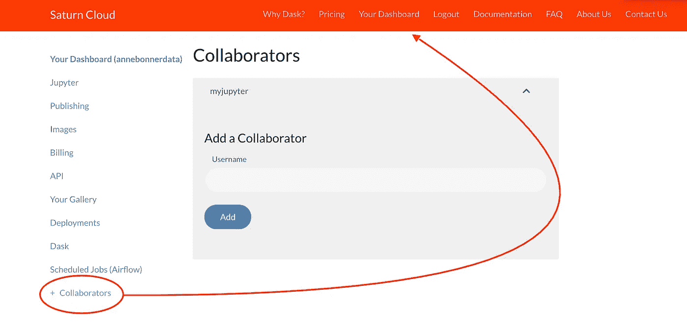

# 用土星云回放历史

> 原文：<https://towardsdatascience.com/rewind-history-with-saturn-cloud-1e6c3b14b1ca?source=collection_archive---------33----------------------->

## 难以置信的简单的 Jupyter 笔记本电脑自动版本控制

Photo by [Pixaby](https://www.pexels.com/photo/close-up-of-cat-248280/) via [Pexels](https://www.pexels.com/photo/close-up-of-cat-248280/)

如果你能用一个简单的滑块在你的 Jupyter 笔记本版本间来回移动，那不是很酷吗？

土星云让你做到了这一点！

Saturn Cloud 现在为您的 Jupyter 笔记本电脑提供自动化版本控制，以及一系列令人敬畏的新功能。它简单、免费，每个人都可以使用，而且完全不费力。[看看吧！](https://www.saturncloud.io/?source=ab-3)

Photo by [Magda Ehlers](https://www.pexels.com/@magda-ehlers-pexels?utm_content=attributionCopyText&utm_medium=referral&utm_source=pexels) from [Pexels](https://www.pexels.com/photo/brown-deer-beside-brown-leaves-1318555/?utm_content=attributionCopyText&utm_medium=referral&utm_source=pexels)

# 什么是 Jupyter 笔记本？

我喜欢 Jupyter 笔记本！

 [## 技巧、窍门、诀窍和魔法:如何毫不费力地优化您的 Jupyter 笔记本电脑

### 让 Jupyter 笔记本变得更好、更快、更强、更光滑、更棒的完整初学者指南

towardsdatascience.com](/how-to-effortlessly-optimize-jupyter-notebooks-e864162a06ee) 

Jupyter 笔记本是最好的之一(免费！)工具，帮助您获得在大量数据相关领域高效工作所需的技能。它们是数据科学、机器学习、深度学习、人工智能等的理想工具。它们不仅可以保存代码，还可以保存丰富的文本元素，比如图像、图形、链接等等。这使得他们成为一个完美的地方，把分析，你的结果，以及正在发生的事情的描述。

尽管它们很容易使用，但要启动并运行云托管服务通常很困难。有很多人已经完全陷入了试图让他们的笔记本电脑运行云提供商的困境。

这就是土星云出现的地方！

# 土星云是什么？

[土星云让生活变得简单。](https://www.saturncloud.io/?source=ab-3)

 [## 如何毫不费力地创建、发布甚至共享云托管的 Jupyter 笔记本

### 完全初学者指南，以闪电般的速度在 Jupyter 笔记本上创建、运行和协作…

towardsdatascience.com](/getting-started-with-saturn-cloud-jupyter-notebooks-b3f509a500ef) 

有了土星云，运行云托管的 Jupyter 笔记本变得异常容易。你点击几个按钮，你就设置好了。您可以创建、运行、发布甚至共享 Jupyter 笔记本了。你甚至可以与其他人合作！对于数据科学家来说，在他们的 Jupyter 笔记本上使用基于云的计算可能是最简单的方法。这是我发现的唯一能让你立即(而且毫无痛苦地)做到的方法！)发布并与全世界分享您的笔记本。

# 什么是版本控制？

版本控制基本上就是修订控制。它允许您管理对代码的更改。每个修订都与时间戳和做出更改的人相关联。可以比较、恢复修订，还可以合并某些类型的文件。

你刚刚完全搞乱了你的模型吗？

Photo by [Markus Distelrath](https://www.pexels.com/@markus-distelrath-1131903?utm_content=attributionCopyText&utm_medium=referral&utm_source=pexels) from [Pexels](https://www.pexels.com/photo/grey-bird-in-close-up-photography-2233442/?utm_content=attributionCopyText&utm_medium=referral&utm_source=pexels)

版本控制让您可以倒回历史。你可以回到你的 Jupyter 笔记本变成一个完整的恐怖秀之前的地方。版本控制允许您将文档恢复到以前的版本。这对于允许编辑跟踪彼此的编辑和纠正错误至关重要！

例如，当多个个人或团队在设计和开发软件时，同一软件的多个版本在不同的站点运行是很正常的。不同的开发人员可能同时进行更新。其中一些版本可能有缺陷。一些版本的更新带来了新的问题。为了找到并修复这些问题，您必须能够获取并运行不同的版本来确定问题发生在哪里。

但是，尽管版本控制是工作流程的一个重要部分，Jupyter 笔记本并没有提供一个简单的方法来做到这一点。有变通办法，但并不容易。这就是土星云出现的地方。

这是魔法。

Saturn 图像附带 git 命令行工具和许多文本编辑器，因此您可以像使用任何其他 UNIX 安装一样使用 git。Saturn Cloud 还会自动为您的项目拍摄快照，以便用户可以轻松回滚到以前的工作。

如果你有代码要推或者拉，土星云会通知你。您可以从用户分支推入主分支，或者从主分支拉入您的分支。Saturn 提供了一个 Git diff and merge 工具，它结合了查看和合并代码和笔记本。用户在服务器中同步的独立分支中工作。每个 Saturn 项目都分配了一个 Git 存储库。

如果分支之间没有冲突，您可以单击“完成”按钮，完成您的推或拉。(如果有冲突，您可以解决这些冲突，然后单击“解决”)确保完成后点击“保存”。当然，您也可以直接在命令行中解决冲突。如果你想阅读全部内容，请查阅官方文档。

# 协作呢？

就是这么简单！

你只需进入你的仪表板，点击“合作者”并添加某人的用户名。如果你已经有了一个团队，你只需要选择你想合作的团队成员的名字！

# 演员表

账单页面已经升级！现在，您可以一目了然地看到每台机器，而不仅仅是看到成本概览。通常，如果你的账单很高，很容易假设你的新机器学习模型有问题。现在你一眼就能看出，这实际上是一台完全不同的机器，已经运行了三天了！

你所需要做的就是打开你的仪表盘，点击账单，然后向下滚动。你所有的信息都在这里。

# 我喜欢它

土星云继续变冷。现在，他们为 Jupyter 笔记本带来了简单的版本控制，使协作变得更加容易，他们很难被击败。再加上易于理解的计费、升级的图像控制以及他们对每个人的图库所做的改进，很难想象还有更好的云托管 Jupyter 笔记本提供商！

我还必须提到，Saturn Cloud 计划将他们的自动化版本控制功能开源。如果向 Git-verse 开放这个功能不是最酷的事情，我不知道什么才是。

我不知道你怎么样，但是我非常想看一看引擎盖下面！

Photo by [Maria Geller](https://www.pexels.com/@maria-geller-801267?utm_content=attributionCopyText&utm_medium=referral&utm_source=pexels) from [Pexels](https://www.pexels.com/photo/black-porsche-vehicle-2127022/?utm_content=attributionCopyText&utm_medium=referral&utm_source=pexels)

感谢阅读！和往常一样，如果你用这些信息做了什么酷的事情，请在下面的评论中让大家知道，或者在 LinkedIn [@annebonnerdata](https://www.linkedin.com/in/annebonnerdata/) 上联系