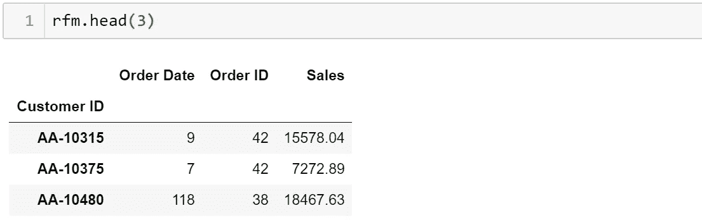

# 使用四分位数和 Jenks 自然间断的 RFM 分割

> 原文：<https://towardsdatascience.com/rfm-segmentation-using-quartiles-and-jenks-natural-breaks-924f4d8baee1?source=collection_archive---------8----------------------->


Photo by Heidi Sandstrom. on Unsplash

[](https://github.com/gianfelton/RFM-Segmentation-with-Quartiles-Jenks-Natural-Breaks-and-HDBSCAN/blob/master/RFM%20Segmentation.ipynb) [## 吉安费尔顿/RFM-带四分位数的分段-詹克斯-自然分段-HDBSCAN

### 通过创建一个……为吉安费尔顿/RFM-四分点分割-詹克斯-自然断裂-和组屋开发做出贡献

github.com](https://github.com/gianfelton/RFM-Segmentation-with-Quartiles-Jenks-Natural-Breaks-and-HDBSCAN/blob/master/RFM%20Segmentation.ipynb) 

这篇文章的笔记本可以在上面的链接中找到。

这篇文章的目的是分享我最近使用 RFM 模型进行客户细分的一些经验。对于那些刚接触 RFM 模型的人，这里有一个分类:


在实践中，它将生成如下所示的表格:


最终，我们将得到这些数字的百分位数(我们将在下面讨论)，然后是四分位数。四分位数将给出从 1 到 4 的分数，我们将组合这些分数得到 RFM 分数。该过程将如下所示:


让我们从笔记本开始吧。

```
**import** **numpy** **as** **np**
**import** **pandas** **as** **pd**
**import** **matplotlib.pyplot** **as** **plt**
%matplotlib inline
**import** **datetime** **as** **dt**
**from** **scipy** **import** stats
**import** **jenkspy**
**import** **seaborn** **as** **sns**
**import** **warnings**
warnings.filterwarnings("ignore")df = pd.read_csv(‘Superstore.csv’)
```

快速浏览前三行可以了解数据的概念:


我们可以将订单日期、订单 ID 和销售额用于 RFM。

```
df['Order Date'] = pd.to_datetime(df['Order Date'])anchorDate = dt.datetime(2015,1,1)rfm = df.groupby('Customer ID').agg({'Order Date': lambda x: (anchorDate - x.max()).days,
                                     'Order ID': lambda x: len(x),
                                     'Sales': lambda x: x.sum()})
```

在第一行中，我们将订单日期设置为日期时间格式。第二行仅在该数据集中是必要的，因为它在 2014 年 12 月 31 日结束。在现实世界的设置中，这只是设置为当前日期。第三部分按客户 ID 汇总了最近、频率和货币。

我们最终得到了这样一张表:



现在我们只需要更改列名。

```
rfm.columns = ['Recency', 'Frequency', 'Monetary']
```


从这里，我们可以很容易地得到百分位数和四分位数。

```
rfm['r_percentile'] = rfm['Recency'].rank(pct=True,ascending=False)
rfm['r_score'] = pd.qcut(rfm['r_percentile'], 4, labels=range(4,0,-1))rfm['f_percentile'] = rfm['Frequency'].rank(pct=True,ascending=True)
rfm['f_score'] = pd.qcut(rfm['f_percentile'], 4, labels=range(4,0,-1))rfm['m_percentile'] = rfm['Monetary'].rank(pct=True,ascending=True)
rfm['m_score'] = pd.qcut(rfm['m_percentile'], 4, labels=range(4,0,-1))
```

结果表有我们的最近、频率和货币列，以及每个值的百分位数和四分位数。


最后，我们只需要连接三个分数列。

```
rfm['rfm_score'] = rfm['r_score'].astype(str) + rfm['f_score'].astype(str) + rfm['m_score'].astype(str)
```

这是我们完成的桌子。


我们可以就此打住，但是让我们做一些探索和比较。

```
ax = rfm['rfm_score'].value_counts().plot(kind='bar', figsize=(15, 5), fontsize=12)
ax.set_xlabel("RFM Score", fontsize=12)
ax.set_ylabel("Count", fontsize=12)
plt.show()
```


我们可以看到，我们最大的细分市场是由最没有价值的客户组成的。然而，我们下一个最大的细分市场是由我们最有价值的客户组成的。这似乎很奇怪。让我们看看我们的数据是根据哪些值进行分区的。

```
r_quarters = rfm['Recency'].quantile(q=[0.0, 0.25,0.5,0.75, 1]).to_list()
f_quarters = rfm['Frequency'].quantile(q=[0.0, 0.25,0.5,0.75, 1]).to_list()
m_quarters = rfm['Monetary'].quantile(q=[0.0, 0.25,0.5,0.75, 1]).to_list()
quartile_spread = pd.DataFrame(list(zip(r_quarters, f_quarters, m_quarters)), 
                      columns=['Q_Recency','Q_Frequency', 'Q_Monetary'],
                     index = ['min', 'first_part','second_part','third_part', 'max'])
quartile_spread
```


尽管这让我们了解了分区之间的范围，但我们还需要其他东西来查看密度。让我们看一个直方图，我们的分区沿着 x 轴放置。

```
plt.figure(figsize = (16,6))
hist = plt.hist(rfm['Frequency'], bins=100, align='left', color='cornflowerblue')
for q in f_quarters:
    plt.vlines(q, ymin=0, ymax = max(hist[0]))
```


有了这个视图，我们可以看到分区并不十分适合我们的数据。15 处的分区将看起来像一个组的东西一分为二。让我们试着用 Jenks 的自然间断来划分我们的数据，而不是四分位数。

```
plt.figure(figsize = (16,6))
hist = plt.hist(rfm['Frequency'], bins=100, align='left', color='cornflowerblue')
for b in f_breaks:
    plt.vlines(b, ymin=0, ymax = max(hist[0]))
```


这使得这个数据更有意义。让我们用 Jenks 来看一个分区表。

```
r_breaks = jenkspy.jenks_breaks(rfm['Recency'], nb_class=4)
f_breaks = jenkspy.jenks_breaks(rfm['Frequency'], nb_class=4)
m_breaks = jenkspy.jenks_breaks(rfm['Monetary'], nb_class=4)
jenks_spread = pd.DataFrame(list(zip(r_breaks, f_breaks, m_breaks)), 
                      columns=['J_Recency','J_Frequency', 'J_Monetary'],
                     index = ['min', 'first_part','second_part','third_part', 'max'])
jenks_spread
```


在这一点上，这是否更好取决于业务。让我们并排比较两个分区表。

```
df = pd.concat([quartile_spread, jenks_spread], axis=1)
cols = ['Q_Recency', 'J_Recency','Q_Frequency', 'J_Frequency','Q_Monetary', 'J_Monetary']
df[cols]
```


这个表应该有助于决定使用四分位数还是 Jenks。不过，还有一件事。我们用 Jenks(用 nb_class=4 参数)指定了分区的数量，但是我们是如何得到这个数字的呢？我绘制了方差拟合优度与班级数量的关系图。它看起来有点像 K-Means 的肘方法。


基本上，我在寻找类的数量和方差拟合优度之间的平衡。

实现这一点的代码有点长。以下是计算方差拟合优度的函数:

```
# Crediting camdenl with this function
# [https://stats.stackexchange.com/users/27263/camdenl?tab=profile](https://stats.stackexchange.com/users/27263/camdenl?tab=profile)def goodness_of_variance_fit(array, classes):
    # get the break points
    classes = jenkspy.jenks_breaks(array, nb_class=classes)# do the actual classification
    classified = np.array([classify(i, classes) for i in array])# max value of zones
    maxz = max(classified)# nested list of zone indices
    zone_indices = [[idx for idx, val in enumerate(classified) if zone + 1 == val] for zone in range(maxz)]# sum of squared deviations from array mean
    sdam = np.sum((array - array.mean()) ** 2)# sorted polygon stats
    array_sort = [np.array([array[index] for index in zone]) for zone in zone_indices]# sum of squared deviations of class means
    sdcm = sum([np.sum((classified - classified.mean()) ** 2) for classified in array_sort])# goodness of variance fit
    gvf = (sdam - sdcm) / sdamreturn gvfdef classify(value, breaks):
    for i in range(1, len(breaks)):
        if value < breaks[i]:
            return i
    return len(breaks) - 1
```

下面是绘制方差拟合优度与类数量关系的代码:

```
my_dict = {}
for col in rfm.columns[:3]:
    results = []
    for i in range(2, 10):
        results.append(goodness_of_variance_fit(rfm[col], i))
    my_dict[col] = results  
plt.plot(range(2, 10), my_dict['Recency'], label='Recency')
plt.plot(range(2, 10), my_dict['Frequency'], label='Frequency')
plt.plot(range(2, 10), my_dict['Monetary'], label='Monetary')
plt.xlabel('Number of classes')
plt.ylabel('Goodness of Variance Fit')
plt.legend(loc='best')
plt.show()
```

既然我们已经使用四分位数和 Jenks 自然间断点进行了调查，让我们添加基于 Jenks 自然间断点的 rfm 分数，并查看两个分数如何比较。

```
breaks_list = [r_breaks, f_breaks, m_breaks]rfm['r_j_score'] = pd.cut(rfm['Recency'], bins=r_breaks, labels=[1, 2, 3, 4], include_lowest=True)
rfm['f_j_score'] = pd.cut(rfm['Frequency'], bins=f_breaks, labels=[4, 3, 2, 1], include_lowest=True)
rfm['m_j_score'] = pd.cut(rfm['Monetary'], bins=m_breaks, labels=[4, 3, 2, 1], include_lowest=True)rfm.drop(['r_percentile', 'f_percentile', 'm_percentile'], axis=1, inplace=True)rfm['rfm_j_score'] = rfm['r_j_score'].astype(str) + rfm['f_j_score'].astype(str) + rfm['m_j_score'].astype(str)
```


```
df = rfm['rfm_j_score'].value_counts().to_frame().join(rfm['rfm_score'].value_counts())
ax = df.plot(kind='bar', title ="Jenks vs Quartiles", figsize=(15, 5), legend=True, fontsize=12)
ax.set_xlabel("RFM Score", fontsize=12)
ax.set_ylabel("Count", fontsize=12)
plt.show()
```


我们可以看到结果非常不同。使用 Jenks 自然中断，最近但不频繁的购买者(总消费金额低)构成了最大的细分市场。

RFM 到此为止。基于我们到目前为止所看到的，一个人应该知道这些细分方法中的哪一种(如果有的话)更适合他们的情况。

以下部分独立于 RFM 分段。在完成自己的细分工作后，我花了相当多的时间在我的客户中寻找聚类。这是相关的，因为我使用了最近，频率和货币价值的聚类。

虽然我尝试了一些聚类方法，但下面是 HDBSCAN 的一个示例(在同一数据集上):

```
import hdbscanclusterer = hdbscan.HDBSCAN(min_cluster_size=30,min_samples=12, metric='euclidean')clusterer.fit(rfm[['Recency', 'Frequency', 'Monetary']])rfm['Cluster'] = pd.Series(clusterer.labels_, index=rfm.index)rfm.head(3)
```

我选择 HDBSCAN 的原因是因为它能够在不引入噪声的情况下进行聚类。第一类是噪音。

```
from mpl_toolkits.mplot3d import Axes3D
import matplotlib.colors as mcolorsfig = plt.figure(figsize=(18,12))
dx = fig.add_subplot(111, projection='3d')
colors = ['green', 'blue', 'red', 'yellow', 'black']
#colors = [ k for k in mcolors.CSS4_COLORS ]for i in range(-1,len(rfm['Cluster'].unique())-1):
    dx.scatter(rfm[rfm.Cluster == i].Recency, 
               rfm[rfm.Cluster == i].Frequency, 
               rfm[rfm.Cluster == i].Monetary, 
               c = colors[i], 
               label = 'Cluster ' + str(i), 
               s=10, alpha=1.0)dx.set_xlabel('Recency', fontsize=14)
dx.set_ylabel('Frequency', fontsize=14)
dx.set_zlabel('Monetary', fontsize=14)
dx.legend(fontsize=12)
```


我注意到的第一件事是绿色和红色集群的小尺寸。让我们看看集群之间的计数。

```
pd.Series(clusterer.labels_).value_counts()
```


让我们再看远一点的集群。簇 1 被排除，因为它是噪声。

```
myDict = {}
for i in range(0, len(rfm['Cluster'].unique())-1):
    clust = rfm[rfm['Cluster'] == i]
    myDict['Cluster ' + str(i)] = [int(round(clust['Recency'].mean(),0)),
                            int(round(clust['Frequency'].mean(),0)),
                            int(round(clust['Monetary'].mean(),0)),
                            int(round(clust['Recency'].median(),0)),
                            int(round(clust['Frequency'].median(),0)),
                            int(round(clust['Monetary'].median(),0))]

df = pd.DataFrame.from_dict(myDict, orient='index',
                            columns=['mean_Recency','mean_Frequency', 'mean_Monetary',
                                    'median_Recency','median_Frequency', 'median_Monetary'])
df
```


接下来，让我们来看看这些集群是如何按照 RFM 分数排列的:

```
myDict = {}
for i in range(-1, len(rfm['Cluster'].unique())-1):
    clust = rfm[rfm['Cluster'] == i]
    myDict["Cluster " + str(i)] = clust['rfm_j_score'].value_counts()
df = pd.DataFrame.from_dict(myDict)colors = ['black', 'green', 'blue', 'red', 'yellow']
ax = df.plot(kind='bar', figsize=(15, 5), legend=True, fontsize=12, color=colors)
ax.set_xlabel("RFM Score", fontsize=12)
ax.set_ylabel("Count", fontsize=12)
plt.show()
```


我们的集群有非常相似的 RFM 分数，这在用 RFM 模型术语描述我们集群的构成时是令人鼓舞的。帖子的聚类部分到此为止。谢谢大家！