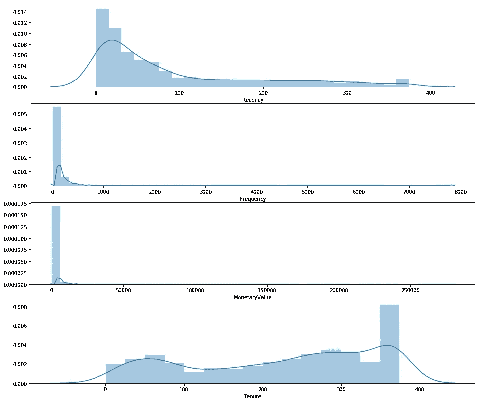
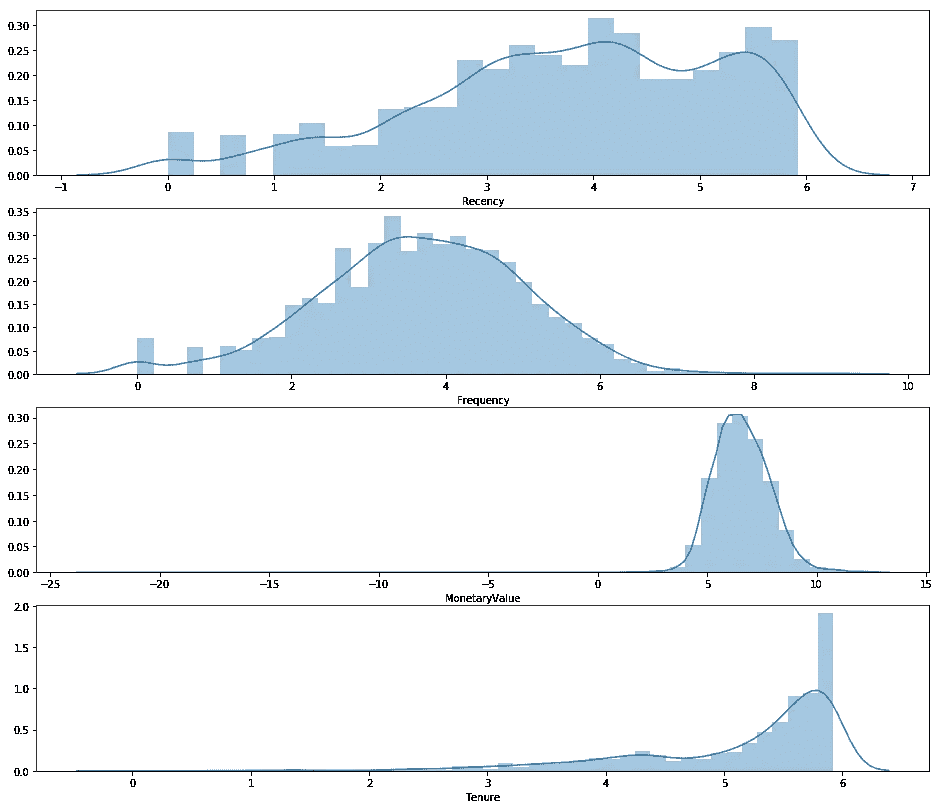
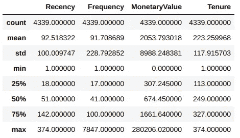
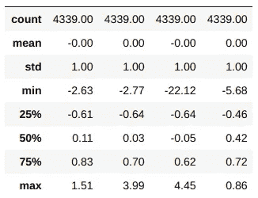
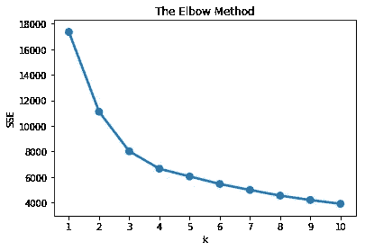
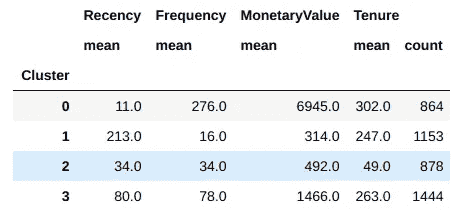
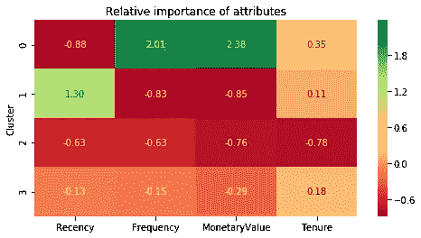
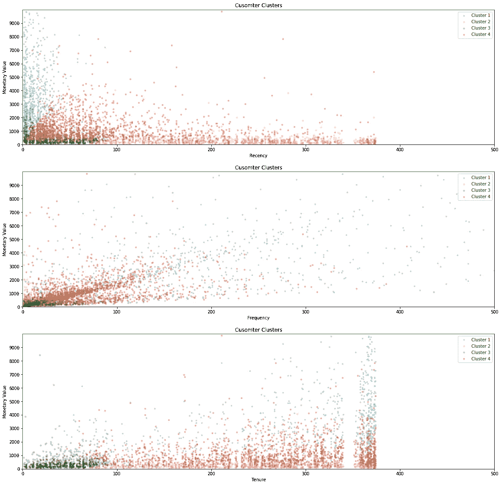

# 基于 K 均值聚类的 RFMT 分割

> 原文：<https://towardsdatascience.com/rfmt-segmentation-using-k-means-clustering-76bc5040ead5?source=collection_archive---------11----------------------->

**重要提示**:这是我个人学习 python 数据科学过程的一部分。当我把它写下来的时候，我发现它非常有帮助，可以帮助我学得更好更快。这是 DataCamp 课程的一部分，代码基于我使用的课程和其他在线资源。请访问 DataCamp 获取原始教学大纲。我不属于任何形式的 DataCamp，只是作为一名学习者使用他们的资源。

在我们客户细分旅程的最后一部分，我们将应用 K-Means 聚类方法来细分我们的客户数据。我们将继续使用我们在 RFM 车型中设计的功能。此外，我们将把**任期**作为我们模型的一个新特性，以创建 RFMT 模型。

# 什么是 K-Means？

K-Means 是一种流行且简单的无监督机器学习算法。简单地说，K-means 算法识别 *k* 个质心，然后将每个数据点分配到最近的簇，同时保持质心尽可能小。我们不会深入研究 K-Means 如何工作的细节，所以让我们深入研究客户细分的实现。

# k-均值假设

这是我们将要用来实现 K-Means 模型的 4 个特征。在我们将 K-Means 模型拟合到我们的数据之前，我们需要确保这些关键假设得到满足。

1.  变量的分布
2.  平均值相同的变量
3.  方差相同的变量

查看我们的 RFMT 汇总统计数据，我们可以看到我们的数据集目前不满足这些关键假设。让我们创建一个数据预处理管道，为 K-Means 准备好数据。

# 数据预处理流水线

下面是我们执行数据转换需要采取的步骤，并详细介绍了每个步骤:

1.  取消对数据的分类—我们将使用日志转换来完成这项工作
2.  标准化到相同的平均值
3.  缩放到相同的标准偏差
4.  存储为单独的数组，用于聚类分析

## 数据偏斜度

让我们检查一下当前数据集的分布形状。

```
# Plot RFM distributions
plt.figure(figsize=(16,14))# Plot distribution of R
plt.subplot(4, 1, 1); sns.distplot(data_process['Recency'])# Plot distribution of F
plt.subplot(4, 1, 2); sns.distplot(data_process['Frequency'])# Plot distribution of M
plt.subplot(4, 1, 3); sns.distplot(data_process['MonetaryValue'])# Plot distribution of T
plt.subplot(4, 1, 4); sns.distplot(data_process['Tenure'])# Show the plot
plt.show()
```



There is skewness in our RFMT data

如你所见，这是 R、F 和 M 向右的一般偏斜度。t 具有更均匀分布的形状。为了解决这个问题，我们将对数据进行对数转换。

```
# Apply Log Transformation
data_process['MonetaryValue'] = data_process['MonetaryValue'] + 0.0000000001
recency_log = np.log(data_process['Recency'])
frequency_log = np.log(data_process['Frequency'])
monetary_log = np.log(data_process['MonetaryValue'])
tenure_log = np.log(data_process['Tenure'])# Plot RFM distributions
plt.figure(figsize=(16,14))# Plot distribution of R
plt.subplot(4, 1, 1); sns.distplot(recency_log)# Plot distribution of F
plt.subplot(4, 1, 2); sns.distplot(frequency_log)# Plot distribution of M
plt.subplot(4, 1, 3); sns.distplot(monetary_log)# Plot distribution of M
plt.subplot(4, 1, 4); sns.distplot(tenure_log)# Show the plot
plt.show()
```



After applying log transformation, we see a much more normally distributed data set

太好了！看起来我们已经正常化了我们的 RFM 特征。但是，请注意，通过 log 变换 T，我们已经使数据向左倾斜。我们在通过可视化检查或其他方式转换数据时必须始终小心谨慎，以确保我们创建了最准确的客户群表示。

## 标准化平均值和标准偏差



为了标准平均值和标准偏差，我们可以使用下面的公式:

```
datamart_centered = datamart_rfm - datamart_rfm.mean()
datamart_scaled = datamart_rfm / datamart_rfm.std()
```

然而，让我们利用 SKLearn 库的 StandardScaler 来集中和缩放我们的数据。

```
from sklearn.preprocessing import StandardScalerscaler = StandardScaler()
scaler.fit(data_process_log)
data_process_norm = scaler.transform(data_process_log)data_process_norm_df = pd.DataFrame(data_process_norm)
data_process_norm_df.describe().round(2)
```



Our feature set post-scaling has a mean of 0 and standard deviation of 1

厉害！现在，我们已经实现了关键假设，以便我们能够正确、准确地应用 K-Means 聚类对我们的客户进行细分。

# 应用 K-均值

现在让我们进入任何机器学习项目中最激动人心的部分——应用 ML 模型！

但是在此之前，我们需要为我们的 K-Means 模型选择聚类数。这可以通过几种方式实现:

1.  可视化方法——肘部标准
2.  数学方法——轮廓系数
3.  最具商业意义的实验和诠释

我们将使用肘准则法。

## 相对于组内误差平方和(SSE)绘制组数

误差平方和(SSE)是每个数据点到其聚类中心的距离平方和。我们希望选择最佳的聚类数量，在不过度拟合的情况下减少 SSE 的数量。让我们画出肘图来确定这一点。

```
# Fit KMeans and calculate SSE for each *k*
sse = {}
for k in range(1, 11):
    kmeans = KMeans(n_clusters=k, random_state=1)
    kmeans.fit(data_process_norm)
    sse[k] = kmeans.inertia_# Plot SSE for each *k*
plt.title('The Elbow Method')
plt.xlabel('k'); plt.ylabel('SSE')
sns.pointplot(x=list(sse.keys()), y=list(sse.values()))
plt.show()
```



SSE plot against number of clusters

理想情况下，我们希望在肘形图上选择一个点，在该点上，SSE 停止以递增的速率下降，即，在该点上，多个聚类之间的变化梯度变得恒定。对于我们的模型，我们将选择 k=4。

## 将我们的数据集拟合到 K 均值

```
# Import KMeans from skLearn
from sklearn.cluster import KMeans# Choose k=4 and fit data set to k-means model
kmeans = KMeans(n_clusters=4, random_state=1)
kmeans.fit(data_process_norm)# Assign k-means labels to cluster labels
cluster_labels = kmeans.labels_# Assign cluster labels to original pre-transformed data set
data_process_k4 = data_process.assign(Cluster = cluster_labels)# Group data set by k-means cluster
data_process_k4.groupby(['Cluster']).agg({
    'Recency': 'mean',
    'Frequency': 'mean',
    'MonetaryValue': 'mean',
    'Tenure': ['mean', 'count']
}).round(0)
```



Our RFMT data set grouped by their K-Means clusters

我们可以看到，我们对 R、F、M 和 T 均值的分组总结表明，每个客户群对我们的 4 个特征有不同的侧重:

*   **聚类 0** 具有最高的月均值、最低的最近均值和最高的频率均值——这是我们理想的客户群
*   **集群 1** 在 R、F 和 M 领域表现不佳，在我们的数据库中也存在很长时间——我们需要设计活动来再次激活它们
*   **Cluster 2** 最近在我们这里购物，但没有像我们希望的那样花费那么多或那么频繁——也许一些针对他们的个性化产品可以帮助他们实现终身价值最大化？
*   **Cluster 3** 在我们这里花了相当多的钱，但是已经有 3-4 个月没有和我们一起购物了——我们需要在失去他们之前做点什么！

## RFMT 在 K 均值聚类中的相对重要性

我们可以通过热图来直观显示 4 个集群中每个功能的相对重要性。

```
# Calculate average RFM values for each cluster
cluster_avg = data_process_k4.groupby(['Cluster']).mean()# Calculate average RFM values for the total customer population
population_avg = data_process.mean()# Calculate relative importance of cluster's attribute value compared to population
relative_imp = cluster_avg / population_avg - 1# Initialize a plot with a figure size of 8 by 2 inches 
plt.figure(figsize=(8, 4))# Add the plot title
plt.title('Relative importance of attributes')# Plot the heatmap
sns.heatmap(data=relative_imp, annot=True, fmt='.2f', cmap='RdYlGn')
plt.show()
```



Relative Importance of RFMT for each of our 3 clusters

热图提供了一种简单易行的方法来理解我们的 K-Means 模型如何将我们的 RFMT 属性的相对重要性分配到每个客户各自的细分市场。

# 可视化我们的 K 均值聚类

最后，让我们在散点图中可视化我们的 K-Means 聚类，以结束我们的客户细分之旅。

```
# Plot RFM distributions
plt.figure(figsize=(20,20))
plt.subplot(3, 1, 1);
plt.scatter(data_process_k4[cluster_labels == 0].loc[:,'Recency'], data_process_k4[cluster_labels == 0].loc[:,'MonetaryValue'], s= 10, cmap='rainbow', label = 'Cluster 1', alpha=0.2)
plt.scatter(data_process_k4[cluster_labels == 1].loc[:,'Recency'], data_process_k4[cluster_labels == 1].loc[:,'MonetaryValue'], s= 10, cmap='rainbow', label = 'Cluster 2', alpha=0.2)
plt.scatter(data_process_k4[cluster_labels == 2].loc[:,'Recency'], data_process_k4[cluster_labels == 2].loc[:,'MonetaryValue'], s= 10, cmap='rainbow', label = 'Cluster 3', alpha=0.3)
plt.scatter(data_process_k4[cluster_labels == 3].loc[:,'Recency'], data_process_k4[cluster_labels == 3].loc[:,'MonetaryValue'], s= 10, cmap='rainbow', label = 'Cluster 4', alpha=0.3)
plt.xticks(np.arange(0, 1000, 100)) 
plt.yticks(np.arange(0, 10000, 1000))
axes = plt.gca()
axes.set_xlim(0, 500)
axes.set_ylim(0, 10000)
plt.title('Cusomter Clusters')
plt.xlabel('Recency')
plt.ylabel('Monetary Value')
plt.legend()plt.subplot(3, 1, 2);
plt.scatter(data_process_k4[cluster_labels == 0].loc[:,'Frequency'], data_process_k4[cluster_labels == 0].loc[:,'MonetaryValue'], s= 10, cmap='rainbow', label = 'Cluster 1', alpha=0.2)
plt.scatter(data_process_k4[cluster_labels == 1].loc[:,'Frequency'], data_process_k4[cluster_labels == 1].loc[:,'MonetaryValue'], s= 10, cmap='rainbow', label = 'Cluster 2', alpha=0.2)
plt.scatter(data_process_k4[cluster_labels == 2].loc[:,'Frequency'], data_process_k4[cluster_labels == 2].loc[:,'MonetaryValue'], s= 10, cmap='rainbow', label = 'Cluster 3', alpha=0.3)
plt.scatter(data_process_k4[cluster_labels == 3].loc[:,'Frequency'], data_process_k4[cluster_labels == 3].loc[:,'MonetaryValue'], s= 10, cmap='rainbow', label = 'Cluster 4', alpha=0.3)
plt.xticks(np.arange(0, 1000, 100)) 
plt.yticks(np.arange(0, 10000, 1000))
axes = plt.gca()
axes.set_xlim(0, 500)
axes.set_ylim(0, 10000)
plt.title('Cusomter Clusters')
plt.xlabel('Frequency')
plt.ylabel('Monetary Value')
plt.legend()plt.subplot(3, 1, 3);
plt.scatter(data_process_k4[cluster_labels == 0].loc[:,'Tenure'], data_process_k4[cluster_labels == 0].loc[:,'MonetaryValue'], s= 10, cmap='rainbow', label = 'Cluster 1', alpha=0.2)
plt.scatter(data_process_k4[cluster_labels == 1].loc[:,'Tenure'], data_process_k4[cluster_labels == 1].loc[:,'MonetaryValue'], s= 10, cmap='rainbow', label = 'Cluster 2', alpha=0.2)
plt.scatter(data_process_k4[cluster_labels == 2].loc[:,'Tenure'], data_process_k4[cluster_labels == 2].loc[:,'MonetaryValue'], s= 10, cmap='rainbow', label = 'Cluster 3', alpha=0.3)
plt.scatter(data_process_k4[cluster_labels == 3].loc[:,'Tenure'], data_process_k4[cluster_labels == 3].loc[:,'MonetaryValue'], s= 10, cmap='rainbow', label = 'Cluster 4', alpha=0.3)
plt.xticks(np.arange(0, 1000, 100)) 
plt.yticks(np.arange(0, 10000, 1000))
axes = plt.gca()
axes.set_xlim(0, 500)
axes.set_ylim(0, 10000)
plt.title('Cusomter Clusters')
plt.xlabel('Tenure')
plt.ylabel('Monetary Value')
plt.legend()plt.show()
```



感谢您花时间通过这个由 3 部分组成的系列来探索客户细分。如果你喜欢这些内容，请继续关注，我将探索更多的数据，也许还会用 Python 构建其他有趣的项目。