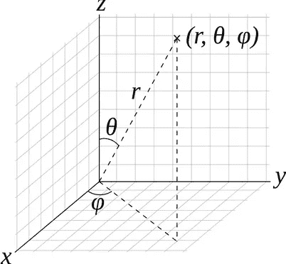

# RGB 到第八球面坐标的颜色转换

> 原文：<https://towardsdatascience.com/rgb-to-8th-spherical-coordinates-color-conversion-7d71a951d9ce?source=collection_archive---------11----------------------->

颜色转换是图像处理、计算机视觉和机器学习中的一个重要过程。例如，如果你有机器学习背景，你可以假设颜色是用于机器学习模型的数据集中的特征。

要了解彩色图像的 RGB 颜色和数字表示:

[维基百科- RGB 颜色模型](https://en.wikipedia.org/wiki/RGB_color_model)


Photo by [Amanda Dalbjörn](https://unsplash.com/@amandadalbjorn?utm_source=medium&utm_medium=referral) on [Unsplash](https://unsplash.com?utm_source=medium&utm_medium=referral)

## 不同的颜色表示会产生影响吗？

是的，他们可以。正确的色域可以为我们进行颜色分割和颜色检测创造完美的特征。

## 有哪些颜色转换方法？

要学习现有的颜色转换方法，我建议你 [OpenCV 资源](https://docs.opencv.org/3.1.0/de/d25/imgproc_color_conversions.html)。

## 一种新的已知领域颜色转换方法；

你了解球坐标系吗？球坐标系是用径向距离、极角和方位角三个参数来表示元素的坐标系。

来源:[维基百科-球面坐标系](https://en.wikipedia.org/wiki/Spherical_coordinate_system)



Spherical Coordinate System

我将 RGB(红、绿、蓝)颜色转换为球坐标系的参数，这样我就可以在球坐标系中表示颜色。

## 我为什么选择这种方法？

1.  我们在球坐标系中表示的颜色可以转换回 RGB 值，这意味着我们不会丢失信息。
2.  在我们将 RGB 值转换到球坐标系后，坐标系的参数代表了新的有价值的信息。极角和方位角代表颜色的类型，径向距离代表照度。像这样区分颜色的特征有助于我们找到特定的颜色，即使这些颜色受到阴影的影响。

## 因此，让我们编写一些 Python 脚本来展示我们如何做到这一点:

## 步骤:

1.  导入必要的库。
2.  计算极角:θ = arctan(Bv/Rv)
3.  计算方位角:𝜑 =反正切(√(Rv +Bv )/Gv)
4.  计算径向距离:r = √(Rv +Bv +Gv2)

，其中 Rv、Gv 和 Bv 代表红色、绿色和蓝色值。

```
from PIL import Image
import numpy as npimage = np.array(Image.open('yourImage'))image[:,:,0]Rv = image[:,:,0]
Gv = image[:,:,1]
Bv = image[:,:,2]polarAngle = np.arctan2(Bv,Rv)
azimuthAngle = np.arctan2(np.sqrt(np.square(Rv)+np.square(Bv)),Gv)
radialDistance = np.sqrt(np.square(Rv)+np.square(Bv)+np.square(Gv))
```

## 使用此转换的示例:

我用这种颜色转换的方法检测肤色。您可以在下面找到输入和输出图像:


Input image


Output Image