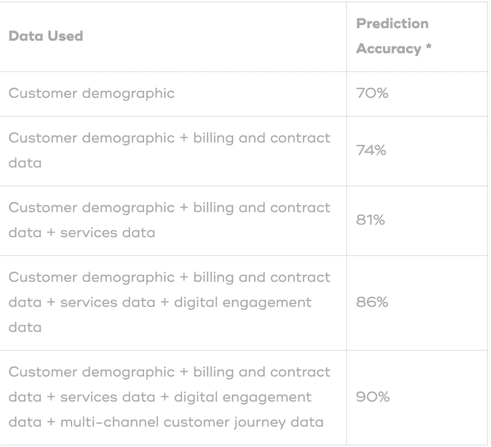
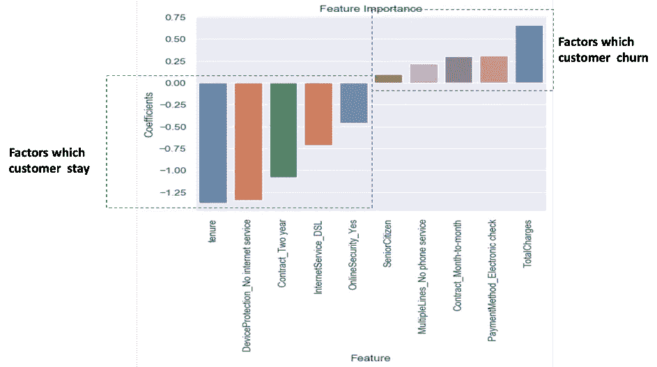
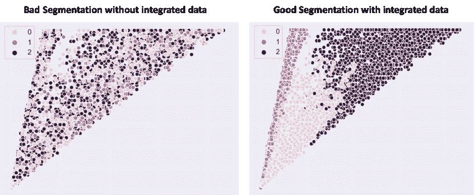

# 富模型，穷模型

> 原文：<https://towardsdatascience.com/rich-model-poor-model-80b9de39172c?source=collection_archive---------32----------------------->

## 模型的财务成功需要良好的数据基础

你们中的许多人可能读过罗伯特·基尤斯基和莎伦·莱赫特写的《富爸爸，穷爸爸 》一书。它倡导金融知识和通过投资资产积累财富的重要性。

我们可以将同样的概念应用于数据科学，并提出这样的问题，“什么是丰富的数据科学模型，什么是贫乏的数据科学模型？”我的回答是，富模型是为您的公司赚钱的模型，而差模型是不为您的公司赚钱的模型

那么，我们如何创建一个为您的公司赚很多钱的富数据科学模型呢？答案之一是投资资产……就模型而言，这意味着数据。

在本文中，我将概述一个 ***良好的数据基础和集成数据*** 如何在使数据科学具有相关性和丰富您的算法方面发挥重要作用。

# 集成数据=更好的预测准确性=每年潜在的百万美元

有人说预测准确性是数据科学的圣杯。拥有更好的预测准确性意味着你可以解决很多问题。在许多应用中，如预测机器故障、检测欺诈和客户流失预测，您需要准确预测。

让我们以[电信行业](https://www.teradata.com/Industries/Telco)的客户流失预测为例。电信行业的年流失率从 10%到 67%不等，大多数公司的流失率超过 20%。流失率低的公司能够有效地利用数据预测客户流失，并采取措施避免流失。预测搅拌棒需要使用集成数据开发数据科学模型。

然而，这听起来可能是显而易见的，但是为了主动预测和解决客户流失，您的预测模型需要准确。一般来说，防止流失需要联系潜在的流失者，或者给潜在的流失者一些优惠或折扣，以防止他们离开。如果你对客户流失预测不准确，你可能会给那些不会离开竞争对手的客户提供优惠和折扣，从而导致不必要的成本。更糟糕的是，你不会向真正的潜在客户提供任何东西，从而失去这些客户，降低你的整体业务。

那么我们如何提高预测精度呢？有许多数学方法，但最重要的是有一个良好的综合数据基础。在大多数情况下，以下数据有助于预测客户流失:

*   客户人口统计数据，如性别、年龄、婚姻或伴侣关系状况、受抚养人、位置等。
*   账单和合同数据，如月费、总费用、无纸化账单、合同期限等。
*   服务使用数据，如电话服务、互联网服务、在线安全等。
*   网站使用、移动应用使用、数字时事通讯互动等数字互动数据。
*   多渠道客户旅程数据，如导航路径、商店访问和呼叫中心互动。

让我们看看基于预测模型中使用的数据的典型流失预测准确性:

*Prediction accuracy figures are based on a typical churn model generally observed

如此处所示，通过使用集成的数据基础，预测精度可以提高近 20%。这可以转化成数百万美元。telecomstechnews 最近的一项研究表明，每个主要电信运营商每月的流失成本约为 6500 万美元。这意味着预测模型中 20%的改进可以转化为每年约 1.6 亿美元的成本节约。

这是巨大的。它展示了拥有集成数据基础的价值，以及数据科学模型为企业带来巨大成本节约的潜力。

如此处所示，通过使用集成的数据基础，预测精度可以提高近 20%。这可以转化成数百万美元。telecomstechnews 最近的一项研究表明，每个主要电信运营商每月的流失成本约为 6500 万美元。这意味着预测模型中 20%的改进可以转化为每年约 1.6 亿美元的成本节约。

这是巨大的。它展示了拥有集成数据基础的价值，以及数据科学模型为企业带来巨大成本节约的潜力。

# 集成数据=可操作的数据科学=百万美元/年实际现金流

有一个好的预测模型是一个好的开始，但绝不是结束。高预测准确率需要转化为可以避免流失的行动。那么，数据科学模型如何转化为行动呢？最常见的方法之一是查看模型的特性重要性。功能重要性是数据科学模型判断的导致客户流失的最重要因素。

此处显示了电信客户流失特征重要性的典型示例。

显示负系数的特征是使顾客留下的因素。例如，任期越高，客户就越不会流失。这意味着客户流失主要发生在新客户身上。另一方面，显示正系数的特征是促成流失的因素。如可视化图所示，拥有短期月度合同的客户以及总费用较高的客户可能会流失。

这清楚地表明，流失主要与新客户和短期合同客户有关。这为要采取的行动提供了明确的方向，这些行动应该围绕如何将新客户转化为忠诚客户。一般来说，一旦客户签了合同，电信公司就会忘记她或他。然而，保持持续联系的营销策略，特别是针对新客户的营销策略，将是非常有益的。

之所以能够采取这样切实的行动，是因为有各种各样的数据来理解预测模型。如果在预测模型中不考虑不同类型的数据，不仅预测精度会很低，而且得出的行动也可能是错误的。这可能会使情况恶化，而不是改善。

有形和具体的行动肯定会防止流失，从而确保现金流保持完整。预测结果显示，电信公司每年有 1.6 亿美元的成本节约潜力。通过切实的行动，利用综合数据，这种潜力可以转化为现实。

# 集成数据=更好的客户定位=参与的客户

防止流失不应该是被动的。你不能追逐每一个预计会流失的客户。你需要制定一个积极主动的策略，让客户甚至不会考虑离开。这种积极主动的策略包括定期与客户互动或沟通，并为他们提供一些好处。这些好处可以是产品优惠，甚至是关于产品使用的教育。

在上面的例子中，我们看到短期合同客户的流失率很高。因此，与新获得的客户进行主动沟通的策略非常重要。但是，在互动过程中，您不能向所有客户发送一般信息。有效的沟通是为客户量身定制的。创建定制通信的一种方法是对相似的客户进行细分，然后发送针对该细分市场的通信。

因此，问题变成了我们如何找到相似的客户放入一个细分市场？答案是基于一个综合的数据基础。你拥有的数据越多，同一细分市场中的相似客户就越多。在我们的示例中，如果您基于客户人口统计+账单和合同数据+服务使用+数字互动+多渠道客户旅程数据创建细分市场，那么每个细分市场中的客户实际上会共享许多相同的属性。然而，如果你只采用人口统计数据来创建你的细分市场，那么一个细分市场中的客户就不会真正相似，从而导致一个质量差的细分市场。如果你与某个细分市场的客户互动，认为他们是相似的，而实际上他们不是，那么你可能会加速流失，而不是减少流失。

下面是客户细分的可视化，每个点代表一个客户。真正相似的顾客被标上相同的颜色。在左侧，您有仅使用人口统计数据创建的细分市场。如您所见，没有明确的细分市场，因为相似的客户没有一起出现。在右侧，您有使用客户人口统计+账单和合同数据+服务使用+数字互动+多渠道客户旅程数据创建的细分市场。正如你所看到的，有一个清晰的模式出现，真正相似的客户确实形成了一个细分市场。

集成的数据基础将确保更好的沟通策略，这将使您积极主动地预防客户流失，并确保未来的现金流

因此，无论你的模型有多复杂，它的财务成功只能通过使用良好的、集成的数据基础来实现

# 额外资源

# 网站(全球资讯网的主机站)

你可以访问我的网站进行零编码分析。[https://experiencedatascience.com](https://experiencedatascience.com)

请**订阅**每当我发布一个新的故事时，请及时通知我。

 [## 每当 Pranay Dave 发表文章时，您都会收到电子邮件。

### 每当 Pranay Dave 发表文章时，您都会收到电子邮件。通过注册，您将创建一个中型帐户，如果您还没有…

pranay-dave9.medium.com](https://pranay-dave9.medium.com/subscribe) 

你也可以通过我的推荐链接加入 Medium。

 [## 通过我的推荐链接加入 Medium—Pranay Dave

### 作为一个媒体会员，你的会员费的一部分会给你阅读的作家，你可以完全接触到每一个故事…

pranay-dave9.medium.com](https://pranay-dave9.medium.com/membership) 

https://www.youtube.com/c/DataScienceDemonstrated 的 YouTube 频道
这里是我的 Youtube 频道
[的链接](https://www.youtube.com/c/DataScienceDemonstrated)