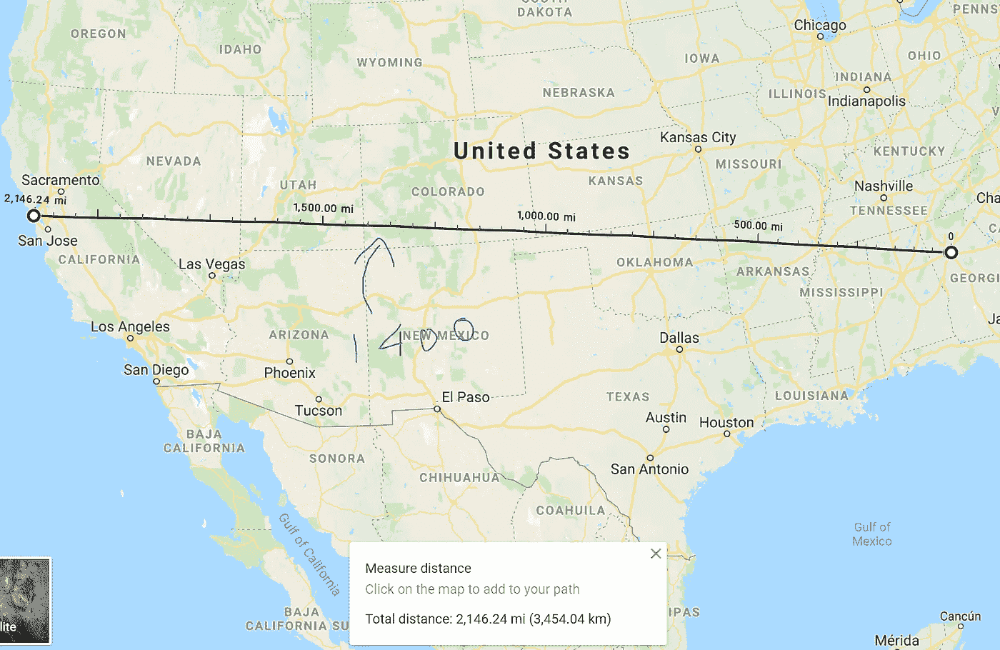
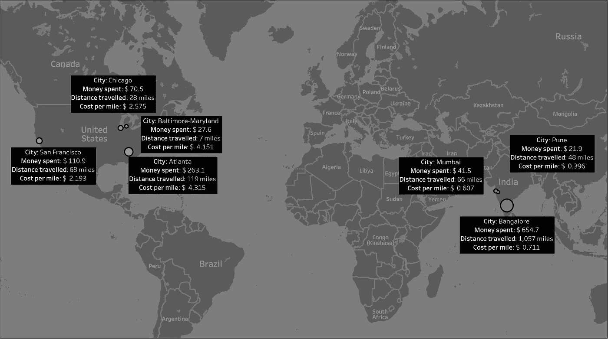
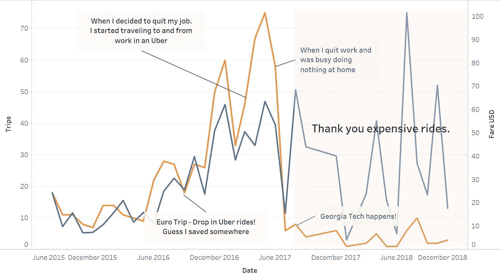
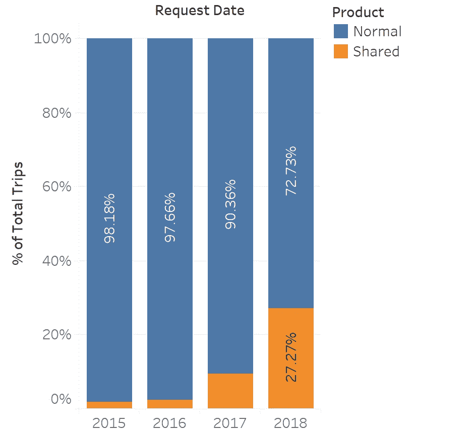
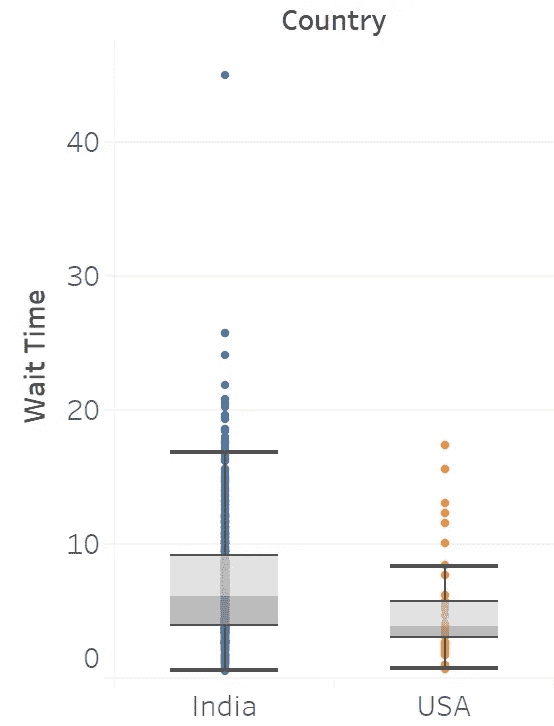

# 骑行共享我的路——优步

> 原文：<https://towardsdatascience.com/ridesharing-my-way-uber-7ce8738b068b?source=collection_archive---------13----------------------->

# 两个大陆

# 7 个城市

# 花费 1190 美元=约 90000 印度卢比

# 行程超过 1400 英里



从亚特兰大到旧金山(下周开始，我将去那里)的路程已经过半了

优步于 2013 年在印度启动了他们的业务，2015 年我搬到班加罗尔工作时，开始积极使用它。从那以后，这个应用程序**再也没有**离开过我的手机。

这个博客是关于分析使用模式和回答如下问题的；

> S **我应该在下午 5 点预订游泳池还是优步 x？**
> 
> **共享出租车的等待时间是否明显更长？**

这篇文章可能看起来很长，但是我向你保证这是一篇轻松的文章！

# 概观



我的大部分骑行是在班加罗尔，在那里我平均每英里花费 0.7 美元，这似乎很高，直到我搬到亚特兰大！每英里 4.3 美元！

旧金山、芝加哥和巴尔的摩的样本量不大，因此我不会深入分析或从这些城市得出任何结论。

## **在优步旅行的天数:6.62
与优步打交道的天数(等待时间+旅行时间):9.16
乘车时间效率:72.24%**

我从查看我的骑行时间表开始


Ride History Timeline

自从加入科技公司后，乘坐人数急剧下降。我住在离校园很近的地方。所以这是一个。此外，作为一名学生，我不喜欢坐优步，而是坐公交车(为了省钱(我想))

但是成本保持不变，多亏了每英里的高成本！



> 这只是优步。Ola 和 Lyft 将对此做出更多贡献。幸运的是，我没有从他们那里得到我的数据。

# 班加罗尔

在班加罗尔的使用建立了一些非常有趣的模式。


周一晚上是足球时间。我在下午 6 点左右去了球场，然后在晚上 8 点回到家，因此出现了黑点。

星期五是为了阿伯和托伊特。(周五晚上稍晚的黑点！)

但那是关于班加罗尔的。

# 美利坚合众国

> 优步只为您提供行程的起点和终点坐标。我计算了坐标间的**哈弗线距离**。这为我提供了骑行距离的下限估计。
> 
> 哈弗线距离基本上是欧几里得距离，但在球面上。它会考虑纬度和经度来计算沿表面两点之间的直线距离

虽然我在美国的乘车次数没有印度多，但我仍然有足够的时间来比较共享乘车和普通乘车。共享乘车包括优步池和 ExpressPool，而普通乘车是所有其他的。

当我搬到这里时，美国对汽车的依赖非常明显。作为一个坚持绿色科技和减少汽车使用的人，我一直提倡使用 **Pool** 而不是 **X，XL，Premier。**



随着多年来共享算法的改进，我增加了对共享出租车的使用。我敢打赌 2019 年远远超过 50 %！

然而，共乘有时间成本吗？

> 在美国，为了节约成本，出租车共享在二战期间变得流行起来。第二波出租车共享是在 1973 年石油危机期间。

我想到的问题是“共享出租车的总交互时间怎么会比普通出租车的总交互时间**低？”**

在需求低于或等于供给之前，这个假设完全有效。然而，当需求超过供应一定数量时，共用出租车比你自己的私人出租车更快。

# 统计分析

一些术语；

**短途旅行**——哈弗森距离小于 2.5 英里的旅行

**长途旅行**——哈弗森距离超过 2.5 英里的旅行

**日间行程** —上午 9 点到下午 7 点之间的行程

**夜间旅行** —晚上 7 点到早上 9 点之间的旅行



与美国相比，印度的等待时间差异很大，我的最高等待时间是 44.97 分钟。这次旅行是从 MG 路到班加罗尔机场，下午 6 点，持续了 **72.58 分钟**。

转移到亚特兰大的数据

> 我在亚特兰大的出租车数据不够，所以我请我的一个朋友分享他们的数据。

## 共享出租车和普通出租车的等待时间和总交互时间不同吗？

我最初使用非参数检验(Mann Whitney U 检验)来检查统计显著性，因为我的样本数量很少。

额外的数据允许我使用广泛使用的不成对 t 检验。(谢谢中央极限定理 **)**

**a .短途旅行——哈弗辛距离不到 2.5 英里**

测试的 p 值为 0.03，这意味着共享乘车与普通乘车的等待时间在统计上有所不同。

但是，共享和普通出租车总交互时间的 t 检验的 p 值为 0.2。

因此，虽然较短距离的等待时间不同，但从预订出租车到到达目的地的总时间在统计上没有显著差异。

此外，车费的差异也具有统计学意义，这加强了拼车优于优步 x 的理由。

**b .相当长的车程——哈弗斯距离超过 2.5 英里但不到 7.5 英里**

更长时间的乘坐有点不同。较长乘坐时间的等待时间差异也具有统计学意义，p 值为 0.02。

乘车时间+等待时间的差异也具有统计学意义，p 值为 0.05。

不出所料，共享乘车和普通乘车的票价也有统计学差异。

共享出租车和普通出租车之间的长途车费平均差异为 7.16 美元

所以，如果你急着去机场，并愿意支付一些额外的费用，那就打个 X 吧！

## 你应该根据一天中的时间选择不同的选项吗？

等待时间是选择共享出租车还是普通出租车的一个重要因素。此外，我们晚上会称得更重。统计测试未能拒绝以下假设，即对于 5 英里以内的行程，夜间(晚上 10 点至早上 7 点)共享出租车的等待时间不同于正常时间。

下面的互动 viz 向您展示了不同的时间和票价(平均值)是如何随着旅行距离的变化而变化的。

*巧妙地暗示我下个月将在哪里工作。*

# 电动滑板车

## 如果我们用踏板车代替哈弗森距离小于 2 英里的游乐设施会怎么样？

亚特兰大符合条件的游乐设施数量:127

电动滑板车的平均速度:每小时 7.5 英里

因为我认为哈弗线距离是旅程起点和终点之间的距离，所以我将它乘以 1.5，得到两点之间的近似曼哈顿距离。

平均节约约 30.79%(不包括环境效益)。

```
Average interaction time of taking a rideshare for short distances:  13.55 mins
Average interaction time of taking a scooter for short distances:  12.41 mins
```

好吧，没那么微妙。

感谢反馈和批评！

***所有的分析都是基于我的数据。结果会有所不同。请不要下任何一概而论的结论。***

github:[https://github.com/jehlokhande93/UberDataAnalysis](https://github.com/jehlokhande93/UberDataAnalysis)