# 更好使用的岭回归

> 原文：<https://towardsdatascience.com/ridge-regression-for-better-usage-2f19b3a202db?source=collection_archive---------0----------------------->

这篇文章的目标是让你更好地使用岭回归，而不仅仅是使用库提供的东西。那么，*“什么是岭回归？”。*回答问题最简单的方法是“*线性回归的变异”*。最糟糕的方法是从下面的数学方程式开始，很多人一看就不明白。

坏消息是我们仍然需要处理它，好消息是我们不会从这样的方程开始，尽管不是现在。我想从‘普通最小二乘法*(OLS)’开始。如果你碰巧很少或没有线性回归的背景知识，[这段视频](https://www.youtube.com/watch?v=Qa2APhWjQPc)将帮助你了解如何使用“最小二乘法”。现在，你知道 OLS 就像我们通常所说的“线性回归”，我将这样使用这个术语。*

## *在继续前进之前*

*在接下来的部分中，我将使用不同的术语和数字采取不同的方法。有两件事你要记住。一是我们不喜欢过度拟合。换句话说，**我们总是喜欢捕捉一般模式的模型**。另一个是我们的目标是从新数据中预测，而不是具体的数据。因此，**模型评估应该基于新数据(测试集)，而不是给定数据(训练集)**。此外，我将交替使用以下术语。*

*   *自变量=特征=属性=预测值= *X**
*   *系数=β=*β**
*   *残差平方和= RSS*

# *为什么是 OLS，为什么不是*

*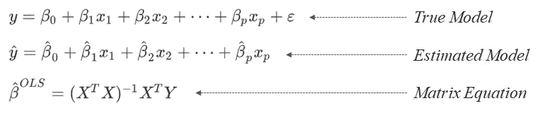*

## ***最小二乘法找到*最佳*和*无偏*系数***

*您可能知道最小二乘法可以找到最适合数据的系数。还要加上一个条件，就是它也能找到无偏系数。这里无偏是指 **OLS 不考虑哪个自变量比其他的更重要**。它只是找到给定数据集的系数。简而言之，只需要找到一组 betas，从而得到最低的“残差平方和(RSS)”。问题变成了“RSS 最低的模型真的是最好的模型吗？”。*

## *偏差与方差*

*以上问题的答案是*“不太会”*。正如“无偏”这个词所暗示的，我们也需要考虑“偏见”。偏差是指一个模型对其预测者的关注程度。假设有两个模型用两个预测器“甜度”和“光泽”来预测苹果价格；一个模型无偏，一个模型有偏。*

*首先，无偏模型试图找出两个特征和价格之间的关系，就像 OLS 方法一样。该模型将尽可能完美地拟合观测值，以最小化 RSS。然而，这很容易导致[过度拟合](https://en.wikipedia.org/wiki/Overfitting)的问题。换句话说，该模型在处理新数据时表现不佳，因为它是专门为给定数据构建的，可能不适合新数据。*

*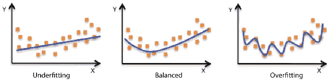*

*有偏模型不平等地接受其变量，以区别对待每个预测值。回到这个例子，我们想只关心“甜蜜”来建立一个模型，这应该在新数据中表现得更好。原因将在理解**偏差与方差**后解释。如果你不熟悉偏差与方差的话题，我强烈推荐你观看[这段视频](https://www.youtube.com/watch?v=EuBBz3bI-aA)，它会给你带来深刻的见解。*

**

*可以说**偏差与模型不符合训练集有关，方差与模型不符合测试集**有关。偏差和方差在模型复杂性上是一种权衡关系，这意味着一个简单的模型将具有高偏差和低方差，反之亦然。在我们的苹果例子中，只考虑“甜味”的模型不会像同时考虑“甜味”和“光泽”的另一个模型那样符合训练数据，但更简单的模型将更好地预测新数据。*

*这是因为“甜度”是价格的决定因素，而“光泽”不是常识。我们人类都知道这一点，但数学模型不会像我们一样思考，只是计算给定的数据，直到它找到所有预测器和独立变量之间的某种关系，以拟合训练数据。*

** *注*:我们假设“甜蜜”和“闪亮”不相关*

# *岭回归开始起作用了*

*查看*偏差与方差*图，Y 轴为“误差”，即“偏差和方差之和”。因为这两者基本上都与失败有关，所以我们想尽量减少它们。现在仔细看一下这个图，你会发现总误差最低的地方在中间。这通常被称为“甜蜜点”。*

**

*让我们回忆一下，OLS 平等地对待所有变量(无偏见)。因此，随着新变量的加入，OLS 模型变得更加复杂。可以说，OLS 模型总是在图的最右边，偏差最小，方差最大。它被固定在那里，从不移动，但我们想把它移到甜蜜点。这是岭回归大放异彩的时候，也称为*正则化*。I **n 岭回归，你可以调整λ参数，使模型系数发生变化**。这可以通过最后介绍的编程演示来更好地理解。*

# *岭回归的几何理解*

*很多时候，图形有助于获得模型如何工作的感觉，岭回归也不例外。下图是比较 OLS 和岭回归的几何解释。*

## *等高线和 OLS 估计*

*每个轮廓是 RSS 相同的点的连接，以 RSS 最低的 OLS 估计为中心。此外，OLS 估计是最适合训练集的点(低偏差)。*

*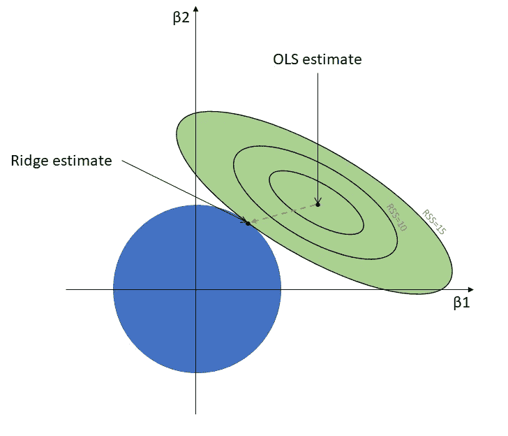*

## *圆和脊估计*

*与 OLS 估计值不同，山脊估计值会随着蓝色圆圈大小的变化而变化。它仅仅是圆与最外轮廓相遇的地方。岭回归的工作原理就是我们如何调整圆的大小。关键是 ***β* 的变化在不同的层面**。*

*假设 *β* 1 是‘闪亮’，而 *β* 2 是‘甜蜜’。如您所见，随着圆大小的变化，脊 *β* 1 比脊 *β* 2 相对更快地下降到零(比较两个图)。之所以会出现这种情况，是因为 RSS 对 *β* 的改变不同。更直观地说，轮廓不是圆，而是倾斜放置的椭圆。*

*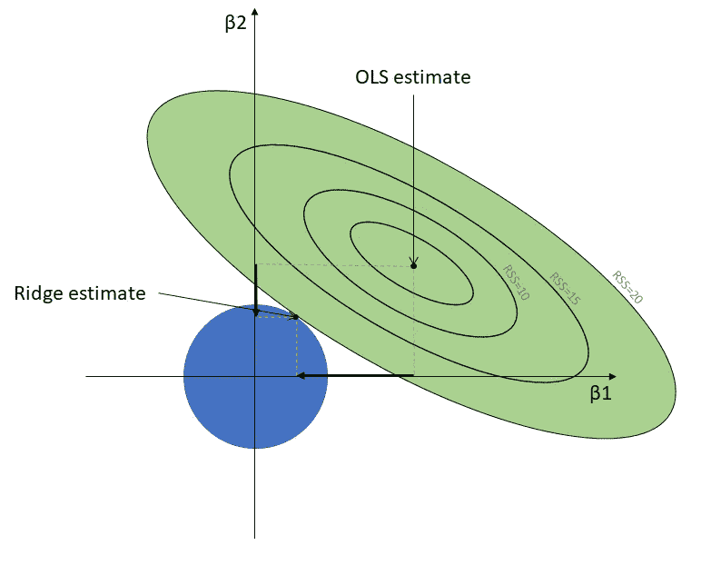*

*山脊 *β* 永远不可能为零，只有*向其收敛*，这将在下面用数学公式解释。虽然像这样的几何表达式很好地解释了主要思想，但也有一个限制，那就是我们不能在三维空间上表达它。所以，这一切都归结为数学表达式。*

# *数学公式*

*我们已经看到了多元线性回归方程的一般形式和矩阵形式。可以写成另一个版本如下。*

*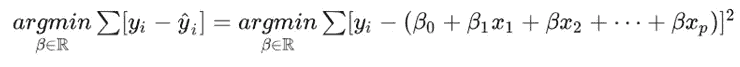*

*这里 *argmin* 的意思是使函数达到最小值的“最小值参数”。在上下文中，它找到最小化 RSS 的 *β* 。我们知道如何从矩阵公式中得到β。现在，问题变成了“这和岭回归有什么关系？”。*

*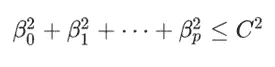*

*同样，岭回归是线性回归的一种变体。上面的项是 OLS 方程的脊约束。我们正在寻找 *β* ，但是它们现在也必须满足上述约束。回到几何图形，C 相当于圆的半径，因此， *β* 应该落在圆的区域，可能在边缘的某个地方。*

## *向量范数*

*我们仍然想理解第一个方程。为此，我们需要温习一下向量范数，它无非是以下定义。*

*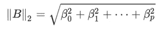*

*订阅 2 是作为在' L2 范数'，你可以了解更多关于向量范数[在这里](http://mathworld.wolfram.com)。此时我们只关心 L2 范数，所以我们可以构造我们已经看到的方程。下面是最简单的，但仍然和我们一直在讨论的一样。请注意，下面等式中的第一项基本上是 OLS，然后第二项是 lambda，这就是岭回归。*

*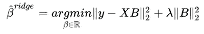*

## *我们真正想找到的是*

*lambda 项通常被称为“惩罚”,因为它增加了 RSS。我们将某些值迭代到 lambda 上，并用诸如“均方误差(MSE)”之类的度量来评估模型。因此，应该选择最小化 MSE 的λ值作为最终模型。这个**岭回归模型在预测上一般比 OLS 模型好**。如下面的公式所示，如果λ等于零(没有惩罚)，脊 *β* 随λ变化，并且变得与 OLS *β* 相同。*

*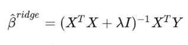*

## *为什么它收敛到零而不是变成零*

*使用我们之前看到的矩阵公式，λ以分母结束。这意味着如果我们增加 lambda 值，ridge *β* 应该会减少。但是不管 lambda 值设置得多大，ridge *β* 都不能为零。也就是说，岭回归为特征赋予不同的重要性权重，但不会丢弃不重要的特征。*

*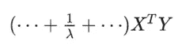*

# *使用数据集进行演示*

*来自 *sklearn* 库的数据集‘波士顿房价’用于演示。在[这个元数据](https://archive.ics.uci.edu/ml/machine-learning-databases/housing/housing.names)中解释了十几个特性。在整个演示过程中需要下面的 *python* 库。*

** *完整代码*可以在 [my github](https://github.com/Q-shick/fundamentals_of_data_science/blob/master/mathematical%20_model/Ridge%20and%20Lasso.ipynb) 找到*

*现在数据集已加载，接下来应该对要素进行标准化。由于岭回归是通过惩罚来缩小系数的，因此应该对要素进行缩放，以保证起始条件的公平性。本帖解释了这个问题的更多细节。*

*接下来，我们可以迭代从 0 到 199 的 lambda 值。注意，λ等于零( *x* = 0)时的系数与 OLS 系数相同。*

*现在，我们可以从数据框中绘制绘图。为了更好的可视化，只选择了五个属性。*

*凭直觉，‘房’应该是房价最好的指标。这就是为什么红色的线在迭代过程中不会收缩。相反，“高速公路通道”(蓝色)显著减少，这意味着当我们寻求更通用的模型时，该特征失去了它的重要性。*

*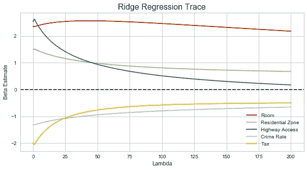*

*类似的图案从其余部分会聚到零(黑色虚线)可见。如果我们越来越多地增加 lambda(极端偏置)，那么只有“房间”会保持显著，这又是有意义的，因为房间的数量必须解释大多数。*

*上面的代码片段绘制了 lambda 跟踪的 MSE。由于随着λ值设置得越大，模型变得越简单(=有偏差)，所以 X 轴从左到右表示模型的简单性。*

*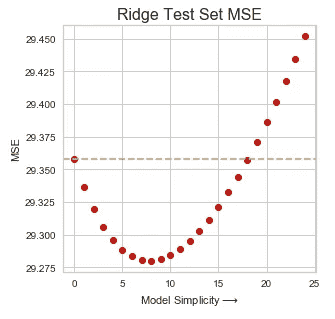*

*绿色虚线来自上图中的 OLS，X 轴通过增加λ值绘制。MSE 值在开始时随着 lambda 值的增加而减小，这意味着模型预测在某一点上得到改进(误差更小)。简而言之，**一个有一定偏差的 OLS 模型比纯粹的 OLS 模型**更好的预测，我们称这个修正的 OLS 模型为岭回归模型。*

# *结论*

*我们从不同的角度研究岭回归，从数学公式、矩阵格式到几何表达式。通过这些，我们可以理解岭回归基本上是一个带惩罚的线性回归。通过演示，我们确认了**没有找到最佳λ**的方程式。因此，我们需要迭代一系列值，并用 MSE 评估预测性能。通过这样做，我们发现岭回归模型比简单线性回归模型在预测方面表现得更好。*

*   *OLS 只是找到给定数据的最佳拟合*
*   *特性对 RSS 有不同的贡献*
*   *岭回归偏向于重要的特征*
*   *MSE 或 R 平方可用于寻找最佳λ*

# *好的读物*

* [## 欢迎来到 STAT 501！统计 501

### 这是 STAT 501 在线课程材料网站。在这方面有很多例子、笔记和讲座材料…

onlinecourses.science.psu.edu](https://onlinecourses.science.psu.edu/stat501/)  [## sklearn.linear_model。ridge-sci kit-了解 0.20.0 文档

### 该模型求解一个回归模型，其中损失函数是线性最小二乘函数，正则化是线性最小二乘函数

scikit-learn.org](http://scikit-learn.org/stable/modules/generated/sklearn.linear_model.Ridge.html)  [## IPython 食谱- 8.1。scikit 入门-学习

### IPython 食谱，

ipython-books.github.io](https://ipython-books.github.io/81-getting-started-with-scikit-learn/)*